p1-01 · Characterise lysine-rich domains
================
Yoichiro Sugimoto and Pallavi Kesavan
26 August, 2026

- <a href="#overview" id="toc-overview">Overview</a>
- <a href="#setup" id="toc-setup">Setup</a>
- <a href="#import-data" id="toc-import-data">Import data</a>
- <a href="#maximum-k-score-and-protein-length"
  id="toc-maximum-k-score-and-protein-length">Maximum K score and protein
  length</a>
- <a href="#k-score-distributions" id="toc-k-score-distributions">K score
  distributions</a>
- <a href="#subcellular-localisation"
  id="toc-subcellular-localisation">Subcellular localisation</a>
- <a href="#functional-class-enrichment"
  id="toc-functional-class-enrichment">Functional class enrichment</a>
- <a href="#k-score-in-histones" id="toc-k-score-in-histones">K score in
  histones</a>
- <a href="#k-score-in-disordered-regions"
  id="toc-k-score-in-disordered-regions">K score in disordered regions</a>
- <a href="#session-information" id="toc-session-information">Session
  information</a>

# Overview

**Purpose:** Characterise lysine-rich domains across the human proteome
— maximum K-score vs protein length, subcellular localisation,
functional-class enrichment, and K-scores in histones.

**Inputs:**
`data/processed_data_from_PNAS2022/all_protein_feature_per_position.csv`,
the cd-code annotation table under `data/public_data/`, and the UniProt
reference proteome; annotation packages `org.Hs.eg.db` and
`subcellularvis` (loaded where used).

**Outputs:** figures (rendered on knit).

**Upstream:** none. **Downstream:** none.

# Setup

``` r
## Resolve the repository root (via the .here sentinel) and load the shared
## setup: packages, helper functions, ggplot/knitr settings, and project paths.
repo_root <- local({
  p <- normalizePath(getwd(), winslash = "/", mustWork = FALSE)
  while (!file.exists(file.path(p, ".here")) && !identical(dirname(p), p)) p <- dirname(p)
  p
})
source(file.path(repo_root, "R", "functions", "_setup.R"))
```

# Import data

Loads the per-position protein feature table, maps UniProt IDs to gene
symbols, and prepares the K-score data used throughout.

``` r
## Define paths to directory
data.dir <- file.path(project.dir, "data")
results.dir <- file.path(project.dir, "results")

#Create p1 results directory
p1.results.dir <- file.path(results.dir, "p1_characterise_domains")
create.dirs(c(results.dir, p1.results.dir))

## Load data into environment 
protein.feature.dt <- fread(file.path(data.dir, "processed_data_from_PNAS2022/all_protein_feature_per_position.csv"))

## Load library  
library("org.Hs.eg.db")
```

    ## Loading required package: AnnotationDbi

    ## Loading required package: Biobase

    ## Welcome to Bioconductor
    ## 
    ##     Vignettes contain introductory material; view with
    ##     'browseVignettes()'. To cite Bioconductor, see
    ##     'citation("Biobase")', and for packages 'citation("pkgname")'.

    ## 
    ## Attaching package: 'AnnotationDbi'

    ## The following object is masked from 'package:dplyr':
    ## 
    ##     select

    ## 

``` r
## Convert gene id and names
# Map UniProt IDs to gene symbols and ENSEMBL IDs
gene.id.dt <- select(
    org.Hs.eg.db,
    keys = protein.feature.dt[, unique(uniprot_id)],
    columns = c("SYMBOL","ENSEMBL"),
    keytype = "UNIPROT"
) %>%
    data.table
```

    ## 'select()' returned 1:many mapping between keys and columns

``` r
# Rename columns 
setnames(
    gene.id.dt,
    old = c("UNIPROT", "SYMBOL","ENSEMBL"),
    new = c("uniprot_id", "gene_name", "gene_id")
)

## Clean and organize gene mapping table
# Sort gene_id in ascending order, remove duplicate UniProt id and remove rows missing gene_id 
gene.id.dt <- gene.id.dt[order(gene_id)][!duplicated(uniprot_id)][!is.na(gene_id)]

# Rename data file and save to directory 
fwrite(gene.id.dt, file.path(p1.results.dir,"uniprot-ensembl.csv"))
```

# Maximum K score and protein length

Computes each protein’s maximum K score (lysine richness) and its
length.

``` r
#-----------------------------------
# Maximum K score and Protein Length
#-----------------------------------

## Compute maximum K_ratio and protein length for each protein
max.k.score.dt <- protein.feature.dt[ 
  , list(
    max_k_ratio = max(K_ratio), 
    protein_len = max(position)
    ), 
  by = list(Accession, uniprot_id)] 

## Merge gene annotations with protein summary data (max K_ratio, protein length)
# Merge tables using the UniProt ID as the key
max.k.score.dt <- merge(
    gene.id.dt,
    max.k.score.dt,
    all.y = TRUE,
    by = "uniprot_id"
)

# Create dataset with max k score 
fwrite(max.k.score.dt, file.path(p1.results.dir, "max-k-score-per-protein.csv")) 

print("The ratio of proteins with the max K ratio > 0.3")
```

    ## [1] "The ratio of proteins with the max K ratio > 0.3"

``` r
round(nrow(max.k.score.dt[max_k_ratio >= 0.3]) / nrow(max.k.score.dt), digits = 2)
```

    ## [1] 0.74

``` r
# Median K score of all region in human proteome#
protein.feature.dt[, median(K_ratio)]
```

    ## [1] 0

# K score distributions

Visualises the distribution of K scores and the relationship between
maximum K score and protein length.

``` r
#---------------------------------------------------------
# Data Visualization - K score, Maximum K score and Protein Length
#---------------------------------------------------------

## K_ratio distribution 
# Count how many proteins have each K_ratio value
protein.feature.dt[, table(K_ratio)] 
```

    ## K_ratio
    ##       0     0.1     0.2     0.3     0.4     0.5     0.6     0.7     0.8     0.9 
    ## 6672182 3249314 1066633  255694   52006   11627    2951     979     322      54 
    ##       1 
    ##       2

``` r
# Create a new column `K_ratio_group` based on the K_ratio
protein.feature.dt[, K_ratio_group := case_when(
  K_ratio >= 0.9 ~ 0.9, #If K_ratio is 0.9 or higher, assign value 0.9
  TRUE ~ K_ratio #If K_ratio is lower than 0.9, then assign original K_ratio value
)]

# Plot - The number of proteins per K score
ggplot(
    protein.feature.dt,
    aes(
        x = K_ratio_group
    )
) +
    geom_bar() +
    scale_x_continuous(breaks=seq(0, 1, 0.1))
```

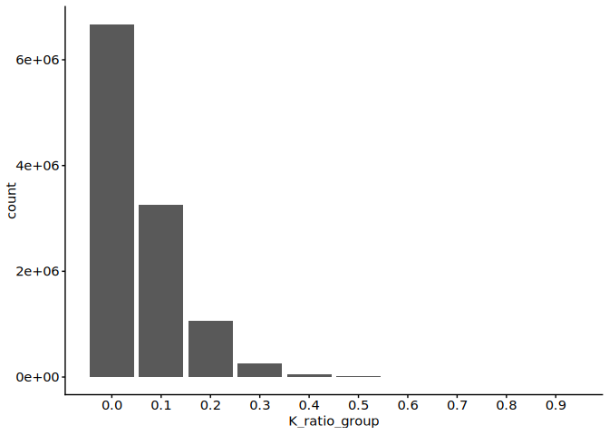<!-- -->

``` r
# Plot - The number of proteins per max K score
ggplot(
    max.k.score.dt,
    aes(
        x = max_k_ratio
    )
) +
    geom_bar() +
    scale_x_continuous(breaks=seq(0, 1, 0.1)) + 
  labs(x = "max_k_ratio", y = "number of protein_count")
```

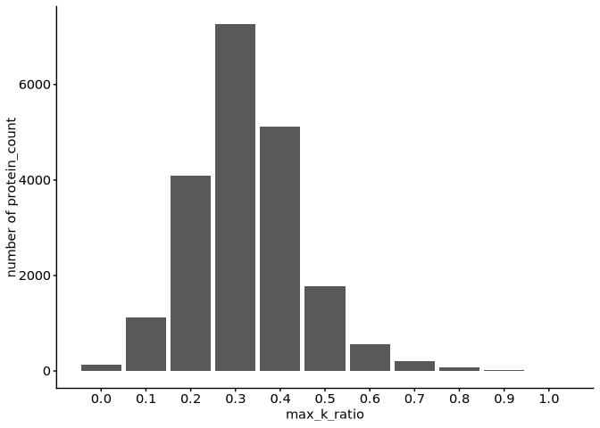<!-- -->

``` r
#Median - 24112025
median(max.k.score.dt[, max_k_ratio])
```

    ## [1] 0.3

``` r
# 0.3

# Plot - Max K ratio vs protein length
ggplot(
  max.k.score.dt,
  aes(
    y = protein_len,
    x = factor(max_k_ratio)
  )
) + geom_boxplot(fill = "steelblue", outlier.shape = NA) +
  labs(x = "max_K_ratio", y = "protein_length") +
  coord_cartesian(ylim = c(0, 2000))
```

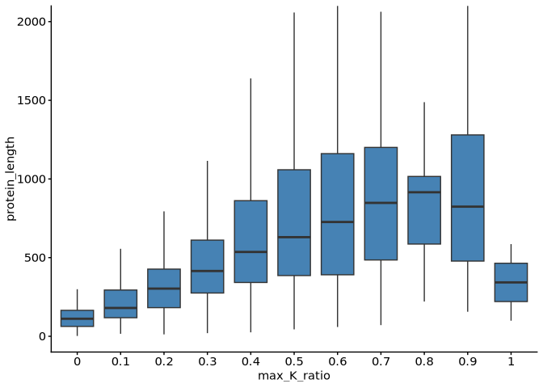<!-- -->

``` r
# Plot - K_score of disordered regions of proteins 
# This plot indicates K score depending on the level of protein disorderliness

ggplot(
  protein.feature.dt,
  aes(
    x = factor(K_ratio_group),
    y = IUPRED2
  )
) + 
  geom_boxplot(fill = "steelblue", outlier.shape = NA)
```

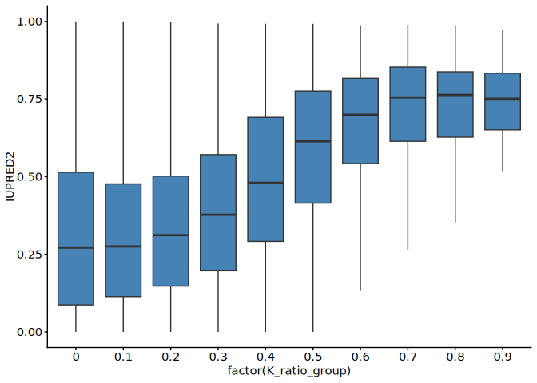<!-- -->

``` r
# Plot - Protein charge versus K_ratio_group
ggplot(
  protein.feature.dt,
  aes(
    x = factor(K_ratio_group),
    y = windowCharge
  )
) + 
  geom_hline(yintercept = 0, color = "gray60") +
  geom_boxplot(fill = "steelblue", outlier.shape = NA)
```

    ## Warning: Removed 211124 rows containing non-finite outside the scale range
    ## (`stat_boxplot()`).

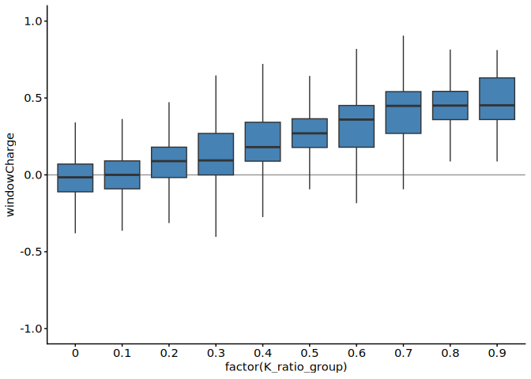<!-- -->

# Subcellular localisation

Annotates proteins with subcellular localisation to relate lysine
richness to cellular compartment.

``` r
#--------------------------------------
# Sub-cellular localisation analysis
#--------------------------------------

# Packaged installed 20th Oct 2025
# install.packages(file.path("/fast/AG_Sugimoto/home/users/pallavi/Software_packages/R/subcellularvis"), repos = NULL, type = "source")

## Load library
library("subcellularvis")

## Run sub-cellular compartment analysis with enrichment score according Gene Ontology
# The 'extractCompartment' function runs sub-cellular compartment analysis, retrieves 
extractCompartment <- function(gene.set, class.name){
  comp.out <- compartmentData(  # Run compartment enrichment analysis using the compartmentData() function
    gene.set,
    id_type = "UNIPROT",
    aspect = c("Whole cell"),
    organism = c("Human"),
    annotationSource =c("Gene Ontology") # Alternatively, Human Protein Atlas can also be used
  )
  
  # Convert enrichment results from comp.out into a data.table 
  comp.out.dt <- data.table(comp.out$enrichment)
  
  # Add metadata columns 
  comp.out.dt[, `:=`(
    Genes = NA,
    n_unmapped = length(str_split(comp.out$unmapped, ",")[[1]]), # Counting the number of unmapped IDs
    n_mapped = comp.out$nMapped, # adding mapped IDs
    class_name = class.name 
  )]
  
  #  Updated data table 
  return(comp.out.dt)
}

# Add column containing values from 0 - 0.9 only
max.k.score.dt[, max_k_ratio_group := case_when(
  max_k_ratio >= 0.9 ~ 0.9, # if ≥ 0.9 → set value to 0.9
  TRUE ~ max_k_ratio  #if < 0.9, then retain original max k ratio value
)]

# Apply the 'extractCompartment' function to each subset of protein grouped by
# max_K_ratio
k.score.compartment.dt <- mapply(
  extractCompartment,
  gene.set = lapply(
    seq(0, 9, by = 1) / 10, # create a sequence of 0 to 0.9 
    function(x){ # For each x, extract the 'uniport_id' belonging to that max_k_ratio_group
      max.k.score.dt[max_k_ratio_group == x, uniprot_id]}
    ),
  class.name = as.character(seq(0, 0.9, by = 0.1)), # convert and assign class names as strings
  SIMPLIFY = FALSE # Return list instead of matrix or array
) %>% rbindlist # combine all lists into a data table
  
# Calculate the negative log10 of FDR and create a new column called 'mlog10FDR'
k.score.compartment.dt[, mlog10FDR := -log10(FDR)]

# Convert data table into wide format 
# rows: 'Compartment'
# column: 'class_name'
# values: 'mlog10FDR'
d.k.score.compartment.dt <- dcast(
  k.score.compartment.dt,
  Compartment ~ factor(class_name),
  value.var = "mlog10FDR"
)

# convert data table into matrix 
d.k.score.compartment.mat <- as.matrix(d.k.score.compartment.dt[, 2:ncol(d.k.score.compartment.dt)])

# Assign Compartment names as rownames of the matrix 
rownames(d.k.score.compartment.mat) <- d.k.score.compartment.dt[, Compartment]
```

# Functional class enrichment

Tests which functional protein classes are enriched among lysine-rich
proteins.

``` r
library("mgcv")
```

    ## Loading required package: nlme

    ## 
    ## Attaching package: 'nlme'

    ## The following object is masked from 'package:Biostrings':
    ## 
    ##     collapse

    ## The following object is masked from 'package:IRanges':
    ## 
    ##     collapse

    ## The following object is masked from 'package:dplyr':
    ## 
    ##     collapse

    ## This is mgcv 1.9-4. For overview type '?mgcv'.

``` r
library("subcellularvis")

comp.out <- compartmentData(
    max.k.score.dt[, uniprot_id],
    id_type = "UNIPROT",
    aspect = c("Whole cell"),
    organism = c("Human"),
    annotationSource =c("Gene Ontology") #c("Human Protein Atlas")
  )

localisation_coef = function(i){
  localised_genes <- comp.out$enrichment[i, "Genes"] %>% {strsplit(., split = ",", fixed = TRUE)[[1]]}
  max.k.score.dt[, loc := uniprot_id %in% localised_genes]
  len.gam <- gam(max_k_ratio ~ s(protein_len) + loc, data = max.k.score.dt, method = "REML")
  
  dt <- data.table(
    functional_type = "localisation", 
    subtype = comp.out$enrichment[, "Compartment"][i],
    coef = summary(len.gam)$p.coeff["locTRUE"],
    se = summary(len.gam)$se["locTRUE"],
    p_value = summary(len.gam)$p.pv["locTRUE"],
    n = length(localised_genes)
  )
  
  return(dt)
}

localisation_dt <- lapply(1:length(comp.out$enrichment[, "Compartment"]), localisation_coef) %>%
  rbindlist

# Molecular condensates
cd_code <- fread(file.path(data.dir, "public_data/20241113_cd-code.csv"))

condensates_coef <- function(i){  
  condensate_genes <- cd_code[i, Proteins] %>% {strsplit(., split = "\t", fixed = TRUE)[[1]]}
  max.k.score.dt[, loc := uniprot_id %in% condensate_genes]
  len.gam <- gam(max_k_ratio ~ s(protein_len) + loc, data = max.k.score.dt, method = "REML")
  
  dt <- data.table(
    functional_type = "condensates", 
    subtype = cd_code[i, Name],
    coef = summary(len.gam)$p.coeff["locTRUE"],
    se = summary(len.gam)$se["locTRUE"],
    p_value = summary(len.gam)$p.pv["locTRUE"],
    n = length(condensate_genes)
  )
  
  return(dt)
}

condensate_dt <- lapply(1:nrow(cd_code), condensates_coef) %>%
  rbindlist

condensate_dt <- condensate_dt[order(p_value)][1:5]

# histone
max.k.score.dt[, histone_protein := grepl("^H[1-4]", gene_name)]
len.gam <- gam(max_k_ratio ~ s(protein_len) + histone_protein, data = max.k.score.dt, method = "REML")
  
histone_dt <- data.table(
  functional_type = "localisation", 
  subtype = "Histone",
  coef = summary(len.gam)$p.coeff["histone_proteinTRUE"],
  se = summary(len.gam)$se["histone_proteinTRUE"],
  p_value = summary(len.gam)$p.pv["histone_proteinTRUE"],
  n = nrow(max.k.score.dt[histone_protein == TRUE])
)

# Merge all three data
functional_class_summary <- rbindlist(list(
  localisation_dt, histone_dt, condensate_dt
))

functional_class_summary <- functional_class_summary[order(-functional_type, -coef)]
functional_class_summary[, `:=`(
  functional_type = factor(functional_type, levels = c("localisation", "condensates")),
  subtype = factor(subtype, levels = subtype)
)]

functional_class_summary
```

    ##     functional_type               subtype         coef          se
    ##              <fctr>                <fctr>        <num>       <num>
    ##  1:    localisation               Histone  0.163573821 0.015153259
    ##  2:    localisation              Ribosome  0.094719538 0.007785273
    ##  3:    localisation               Nucleus  0.044130892 0.001641308
    ##  4:    localisation          Cytoskeleton  0.008931795 0.002546917
    ##  5:    localisation             Cytoplasm  0.004000254 0.001617667
    ##  6:    localisation         Mitochondrion -0.002150944 0.002939521
    ##  7:    localisation Endoplasmic reticulum -0.010155542 0.002687986
    ##  8:    localisation Intracellular vesicle -0.011941747 0.002451759
    ##  9:    localisation  Extracellular region -0.013043133 0.001990705
    ## 10:    localisation              Endosome -0.017430567 0.003699277
    ## 11:    localisation       Plasma membrane -0.018304547 0.001817210
    ## 12:    localisation       Golgi apparatus -0.018694085 0.002980457
    ## 13:    localisation            Peroxisome -0.019337922 0.009531725
    ## 14:    localisation               Vacuole -0.029113620 0.004065612
    ## 15:    localisation              Lysosome -0.031381737 0.004308968
    ## 16:     condensates            Cajal body  0.091028126 0.013163794
    ## 17:     condensates             Nucleolus  0.076694198 0.003220552
    ## 18:     condensates       Nuclear speckle  0.054212632 0.007903436
    ## 19:     condensates                P-body  0.048065116 0.005231583
    ## 20:     condensates        Stress granule  0.034788726 0.003997924
    ##     functional_type               subtype         coef          se
    ##              <fctr>                <fctr>        <num>       <num>
    ##           p_value     n
    ##             <num> <int>
    ##  1:  4.320651e-27    56
    ##  2:  6.148159e-34   214
    ##  3: 1.643062e-156  7329
    ##  4:  4.543272e-04  2276
    ##  5:  1.341198e-02 11635
    ##  6:  4.643401e-01  1618
    ##  7:  1.584649e-04  1965
    ##  8:  1.120462e-06  2421
    ##  9:  5.812286e-11  4033
    ## 10:  2.470576e-06   984
    ## 11:  8.278909e-24  5351
    ## 12:  3.630958e-10  1566
    ## 13:  4.249208e-02   142
    ## 14:  8.285065e-13   806
    ## 15:  3.386400e-13   714
    ## 16:  4.815930e-12    74
    ## 17: 1.169497e-123  1411
    ## 18:  7.114597e-12   207
    ## 19:  4.396641e-20   536
    ## 20:  3.513771e-18   905
    ##           p_value     n
    ##             <num> <int>

``` r
ggplot(
  data = functional_class_summary,
  aes(
    x = subtype,
    y = coef
  )) +
  geom_hline(yintercept = 0, color = "gray60") +
  geom_point() +
  geom_errorbar(aes(
    ymin = coef - se, ymax = coef + se, width = 0.3
  )) +
  scale_x_discrete(guide = guide_axis(angle = 90)) +
  facet_grid(~ functional_type, scales = "free", space = "free")
```

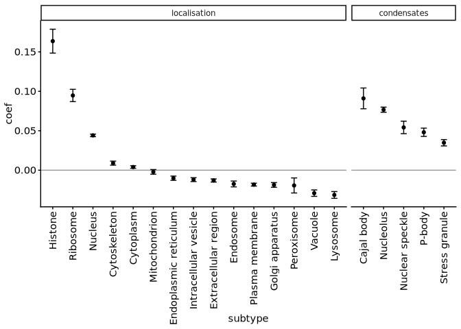<!-- -->

``` r
ggplot(
  data = max.k.score.dt,
  aes(
    x = factor(max_k_ratio),
    y = protein_len,
    fill = histone_protein
  )
) +
  geom_boxplot(outlier.shape = NA, position = position_dodge(preserve = "single")) +
  scale_fill_bright() +
  coord_cartesian(ylim = c(0, 2500))
```

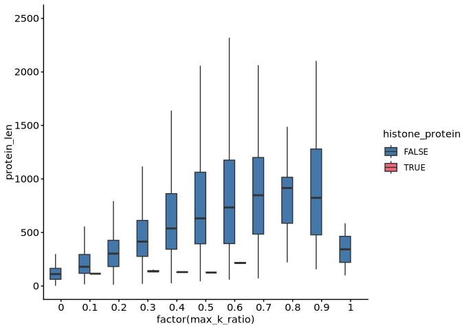<!-- -->

# K score in histones

Examines histones — well-defined lysine-rich proteins — as a reference
point.

The definition of histone tail was obtained from “Histone
post-translational modifications — cause and consequence of genome
function (<https://doi.org/10.1038/s41576-022-00468-7>)”.

``` r
#H2A
ggplot(
  protein.feature.dt[grepl("Q6FI13", Accession)],
  aes(
    x = position,
    y = K_ratio_score
  )
) +
  coord_cartesian(ylim = c(0,0.5)) +
  annotate("rect", xmin = 2, xmax = 26, ymin = 0, ymax = 1, fill = "red", alpha = 0.2) +
  geom_area(fill = "gray40") +
  ggtitle(protein.feature.dt[grepl("Q6FI13", Accession)][1, Accession])
```

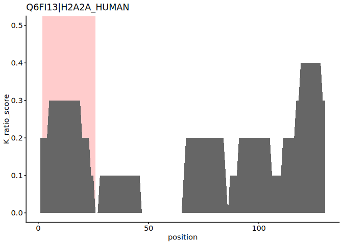<!-- -->

``` r
#H2B
ggplot(
  protein.feature.dt[grepl("P33778", Accession)],
  aes(
    x = position,
    y = K_ratio_score
  )
) +
  coord_cartesian(ylim = c(0,0.5)) +
  annotate("rect", xmin = 2, xmax = 33, ymin = 0, ymax = 1, fill = "red", alpha = 0.2) +
  geom_area(fill = "gray40") +
  ggtitle(protein.feature.dt[grepl("P33778", Accession)][1, Accession])
```

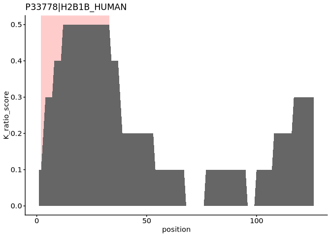<!-- -->

``` r
#H3
ggplot(
  protein.feature.dt[grepl("Q16695", Accession)],
  aes(
    x = position,
    y = K_ratio_score
  )
) +
  coord_cartesian(ylim = c(0,0.5)) +
  annotate("rect", xmin = 2, xmax = 44, ymin = 0, ymax = 1, fill = "red", alpha = 0.2) +
  geom_area(fill = "gray40") +
  ggtitle(protein.feature.dt[grepl("Q16695", Accession)][1, Accession])
```

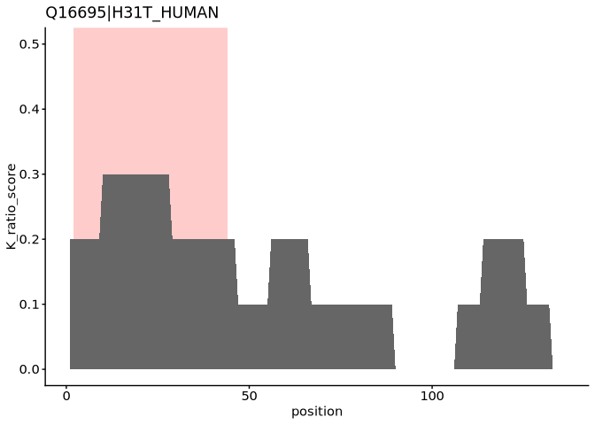<!-- -->

``` r
#H4
ggplot(
  protein.feature.dt[grepl("P62805", Accession)],
  aes(
    x = position,
    y = K_ratio_score
  )
) +
  coord_cartesian(ylim = c(0,0.5)) +
  annotate("rect", xmin = 2, xmax = 24, ymin = 0, ymax = 1, fill = "red", alpha = 0.2) +
  geom_area(fill = "gray40") +
  ggtitle(protein.feature.dt[grepl("P62805", Accession)][1, Accession])
```

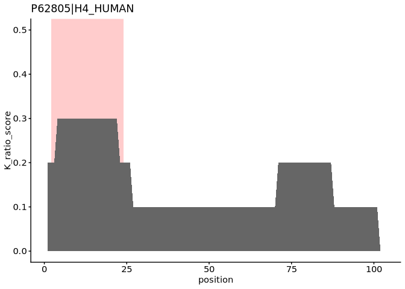<!-- -->

``` r
print("Median K score of histone tails")
```

    ## [1] "Median K score of histone tails"

``` r
rbindlist(list(
  protein.feature.dt[grepl("Q6FI13", Accession)][2:26],
  protein.feature.dt[grepl("P33778", Accession)][2:33],
  protein.feature.dt[grepl("Q16695", Accession)][2:44],
  protein.feature.dt[grepl("P62805", Accession)][2:24]
))[, median(K_ratio_score)]
```

    ## [1] 0.3

# K score in disordered regions

Relates lysine richness to protein disorder.

``` r
library("patchwork")

dkc1.1 <- ggplot(
  protein.feature.dt[grepl("O60832", Accession)],
  aes(
    x = position,
    y = K_ratio_score
  )
) +
  coord_cartesian(ylim = c(0, 1)) +
  geom_area(fill = "gray40") +
  ggtitle(protein.feature.dt[grepl("O60832", Accession)][1, Accession]) +
  geom_point(x = 475, y = 0, color = "red") +
  geom_point(data = data.table(x = c(501:505), y = rep(0, 5)), aes(x = x, y = y), color = "blue")

dkc1.2 <- ggplot(
  protein.feature.dt[grepl("O60832", Accession)],
  aes(
    x = position,
    y = IUPRED2
  )
) +
  coord_cartesian(ylim = c(0, 1)) +
  geom_area(fill = "gray40") +
  ggtitle(protein.feature.dt[grepl("O60832", Accession)][1, Accession])

dkc1.1 / dkc1.2
```

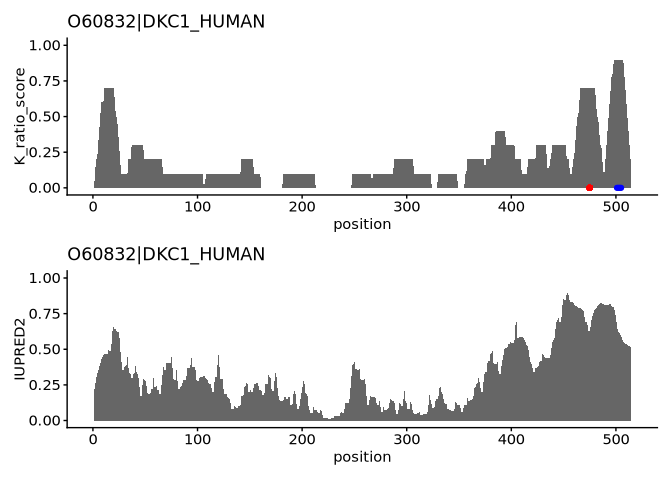<!-- -->

``` r
ARL6IP4.1 <- ggplot(
  protein.feature.dt[grepl("Q66PJ3", Accession)],
  aes(
    x = position,
    y = K_ratio_score
  )
) +
  coord_cartesian(ylim = c(0, 1)) +
  geom_area(fill = "gray40") +
  ggtitle(protein.feature.dt[grepl("Q66PJ3", Accession)][1, Accession]) +
  geom_point(data = data.table(x = c(290, 292, 294), y = rep(0, 3)), aes(x = x, y = y), color = "red") +
  geom_point(data = data.table(x = c(290, 292, 294, 303, 304, 306, 307), y = rep(0, 7)), aes(x = x, y = y), color = "blue")

ARL6IP4.2 <- ggplot(
  protein.feature.dt[grepl("Q66PJ3", Accession)],
  aes(
    x = position,
    y = IUPRED2
  )
) +
  coord_cartesian(ylim = c(0, 1)) +
  geom_area(fill = "gray40") +
  ggtitle(protein.feature.dt[grepl("Q66PJ3", Accession)][1, Accession])

ARL6IP4.1 / ARL6IP4.2
```

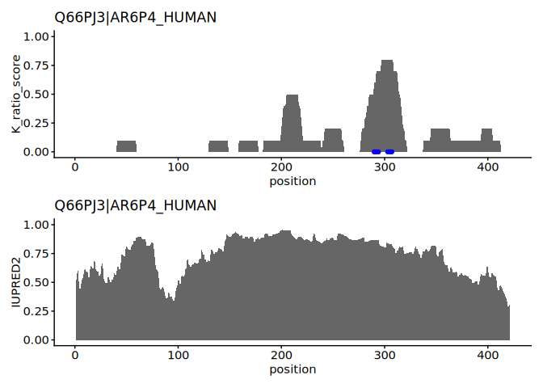<!-- -->

# Session information

``` r
sessioninfo::session_info()
```

    ## ─ Session info ───────────────────────────────────────────────────────────────
    ##  setting  value
    ##  version  R version 4.5.0 (2025-04-11)
    ##  os       Red Hat Enterprise Linux 9.6 (Plow)
    ##  system   x86_64, linux-gnu
    ##  ui       X11
    ##  language (EN)
    ##  collate  en_US.UTF-8
    ##  ctype    en_US.UTF-8
    ##  tz       Europe/Berlin
    ##  date     2026-08-26
    ##  pandoc   2.19.2 @ /gnu/store/sqwwnsp5xb8yd3z1a57lhldcsvx3z9gb-profile/bin/ (via rmarkdown)
    ##  quarto   NA
    ## 
    ## ─ Packages ───────────────────────────────────────────────────────────────────
    ##  ! package           * version    date (UTC) lib source
    ##  P AnnotationDbi     * 1.72.0     2025-10-29 [?] Bioconduc~
    ##  P Biobase           * 2.70.0     2025-10-29 [?] Bioconduc~
    ##  P BiocGenerics      * 0.56.0     2025-10-29 [?] Bioconduc~
    ##  P BiocManager         1.30.27    2025-11-14 [?] CRAN (R 4.5.0)
    ##  P Biostrings        * 2.78.0     2025-10-29 [?] Bioconduc~
    ##  P bit                 4.6.0      2025-03-06 [?] CRAN (R 4.5.0)
    ##  P bit64               4.8.2      2026-05-19 [?] CRAN (R 4.5.0)
    ##  P blob                1.3.0      2026-01-14 [?] CRAN (R 4.5.0)
    ##  P cachem              1.1.0      2024-05-16 [?] CRAN (R 4.5.0)
    ##  P cellranger          1.1.0      2016-07-27 [?] CRAN (R 4.5.0)
    ##  P cli                 3.6.6      2026-04-09 [?] CRAN (R 4.5.0)
    ##  P colourpicker        1.3.0      2023-08-21 [?] CRAN (R 4.5.0)
    ##  P crayon              1.5.3      2024-06-20 [?] CRAN (R 4.5.0)
    ##  P data.table        * 1.18.4     2026-05-06 [?] CRAN (R 4.5.0)
    ##  P DBI                 1.3.0      2026-02-25 [?] CRAN (R 4.5.0)
    ##  P digest              0.6.39     2025-11-19 [?] CRAN (R 4.5.0)
    ##  P dplyr             * 1.2.1      2026-04-03 [?] CRAN (R 4.5.0)
    ##  P evaluate            1.0.5      2025-08-27 [?] CRAN (R 4.5.0)
    ##  P farver              2.1.2      2024-05-13 [?] CRAN (R 4.5.0)
    ##  P fastmap             1.2.0      2024-05-15 [?] CRAN (R 4.5.0)
    ##  P formattable         0.2.1      2021-01-07 [?] CRAN (R 4.5.0)
    ##  P generics          * 0.1.4      2025-05-09 [?] CRAN (R 4.5.0)
    ##  P ggplot2           * 4.0.3      2026-04-22 [?] CRAN (R 4.5.0)
    ##  P glue                1.8.1      2026-04-17 [?] CRAN (R 4.5.0)
    ##  P gridExtra           2.3        2017-09-09 [?] CRAN (R 4.5.0)
    ##  P gtable              0.3.6      2024-10-25 [?] CRAN (R 4.5.0)
    ##  P htmltools           0.5.9      2025-12-04 [?] CRAN (R 4.5.0)
    ##  P htmlwidgets         1.6.4      2023-12-06 [?] CRAN (R 4.5.0)
    ##  P httpuv              1.6.17     2026-03-18 [?] CRAN (R 4.5.0)
    ##  P httr                1.4.8      2026-02-13 [?] CRAN (R 4.5.0)
    ##  P IRanges           * 2.44.0     2025-10-29 [?] Bioconduc~
    ##  P janitor             2.2.1      2024-12-22 [?] CRAN (R 4.5.0)
    ##  P jsonlite            2.0.0      2025-03-27 [?] CRAN (R 4.5.0)
    ##  P KEGGREST            1.50.0     2025-10-29 [?] Bioconduc~
    ##  P khroma            * 1.17.0     2025-09-29 [?] CRAN (R 4.5.0)
    ##  P knitr             * 1.51       2025-12-20 [?] CRAN (R 4.5.0)
    ##  P labeling            0.4.3      2023-08-29 [?] CRAN (R 4.5.0)
    ##  P later               1.4.8      2026-03-05 [?] CRAN (R 4.5.0)
    ##  P lattice             0.22-9     2026-02-09 [?] CRAN (R 4.5.0)
    ##  P lazyeval            0.2.3      2026-04-04 [?] CRAN (R 4.5.0)
    ##  P lifecycle           1.0.5      2026-01-08 [?] CRAN (R 4.5.0)
    ##  P lubridate           1.9.5      2026-02-04 [?] CRAN (R 4.5.0)
    ##  P magrittr          * 2.0.5      2026-04-04 [?] CRAN (R 4.5.0)
    ##  P Matrix              1.7-5      2026-03-21 [?] CRAN (R 4.5.0)
    ##  P memoise             2.0.1      2021-11-26 [?] CRAN (R 4.5.0)
    ##  P mgcv              * 1.9-4      2025-11-07 [?] CRAN (R 4.5.0)
    ##  P mime                0.13       2025-03-17 [?] CRAN (R 4.5.0)
    ##  P miniUI              0.1.2      2025-04-17 [?] CRAN (R 4.5.0)
    ##  P nlme              * 3.1-169    2026-03-27 [?] CRAN (R 4.5.0)
    ##  P org.Hs.eg.db      * 3.22.0     2026-06-24 [?] Bioconductor
    ##  P otel                0.2.0      2025-08-29 [?] CRAN (R 4.5.0)
    ##  P patchwork         * 1.3.2      2025-08-25 [?] CRAN (R 4.5.0)
    ##  P pillar              1.11.1     2025-09-17 [?] CRAN (R 4.5.0)
    ##  P pkgconfig           2.0.3      2019-09-22 [?] CRAN (R 4.5.0)
    ##  P plotly              4.12.0     2026-01-24 [?] CRAN (R 4.5.0)
    ##  P plyr                1.8.9      2023-10-02 [?] CRAN (R 4.5.0)
    ##  P png                 0.1-9      2026-03-15 [?] CRAN (R 4.5.0)
    ##  P promises            1.5.0      2025-11-01 [?] CRAN (R 4.5.0)
    ##    ptm.stoichiometry * 0.0.0.9000 2026-06-24 [1] local (/fast/AG_Sugimoto/home/users/yoichiro/projects/ptm.stoichiometry)
    ##  P purrr               1.2.2      2026-04-10 [?] CRAN (R 4.5.0)
    ##  P R6                  2.6.1      2025-02-15 [?] CRAN (R 4.5.0)
    ##  P RColorBrewer        1.1-3      2022-04-03 [?] CRAN (R 4.5.0)
    ##  P Rcpp                1.1.1-1.1  2026-04-24 [?] CRAN (R 4.5.0)
    ##  P readxl            * 1.5.0      2026-05-16 [?] CRAN (R 4.5.0)
    ##    renv                1.1.5      2025-07-24 [1] CRAN (R 4.5.0)
    ##  P rlang               1.2.0      2026-04-06 [?] CRAN (R 4.5.0)
    ##  P rmarkdown           2.31       2026-03-26 [?] CRAN (R 4.5.0)
    ##  P RSQLite             3.53.2     2026-06-17 [?] CRAN (R 4.5.0)
    ##  P S4Vectors         * 0.48.1     2026-04-05 [?] Bioconduc~
    ##  P S7                  0.2.2      2026-04-22 [?] CRAN (R 4.5.0)
    ##  P scales              1.4.0      2025-04-24 [?] CRAN (R 4.5.0)
    ##  P Seqinfo           * 1.0.0      2025-10-29 [?] Bioconduc~
    ##  P sessioninfo         1.2.4      2026-06-04 [?] CRAN (R 4.5.0)
    ##  P shiny               1.14.0     2026-06-21 [?] CRAN (R 4.5.0)
    ##  P shinythemes         1.2.0      2021-01-25 [?] CRAN (R 4.5.0)
    ##  P snakecase           0.11.1     2023-08-27 [?] CRAN (R 4.5.0)
    ##  P stringi             1.8.7      2025-03-27 [?] CRAN (R 4.5.0)
    ##  P stringr           * 1.6.0      2025-11-04 [?] CRAN (R 4.5.0)
    ##    subcellularvis    * 0.0.0.9000 2026-06-24 [1] local (/fast/AG_Sugimoto/home/users/yoichiro/software/R_packages/subcellularvis)
    ##  P tibble              3.3.1      2026-01-11 [?] CRAN (R 4.5.0)
    ##  P tidyr               1.3.2      2025-12-19 [?] CRAN (R 4.5.0)
    ##  P tidyselect          1.2.1      2024-03-11 [?] CRAN (R 4.5.0)
    ##  P timechange          0.4.0      2026-01-29 [?] CRAN (R 4.5.0)
    ##  P UpSetR              1.4.1      2026-05-25 [?] CRAN (R 4.5.0)
    ##  P vctrs               0.7.3      2026-04-11 [?] CRAN (R 4.5.0)
    ##  P viridisLite         0.4.3      2026-02-04 [?] CRAN (R 4.5.0)
    ##  P withr               3.0.3      2026-06-19 [?] CRAN (R 4.5.0)
    ##  P xfun                0.59       2026-06-19 [?] CRAN (R 4.5.0)
    ##  P xtable              1.8-8      2026-02-22 [?] CRAN (R 4.5.0)
    ##  P XVector           * 0.50.0     2025-10-29 [?] Bioconduc~
    ##  P yaml                2.3.12     2025-12-10 [?] CRAN (R 4.5.0)
    ## 
    ##  [1] /fast/AG_Sugimoto/home/users/yoichiro/projects/20241111_PTMs_in_lysine_rich_domains/renv/library/linux-rhel-9.6/R-4.5/x86_64-unknown-linux-gnu
    ##  [2] /fast/home/y/ysugimo/.cache/R/renv/sandbox/linux-rhel-9.6/R-4.5/x86_64-unknown-linux-gnu/cb72a45c
    ## 
    ##  * ── Packages attached to the search path.
    ##  P ── Loaded and on-disk path mismatch.
    ## 
    ## ──────────────────────────────────────────────────────────────────────────────
