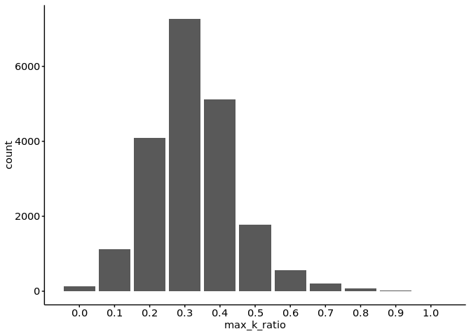
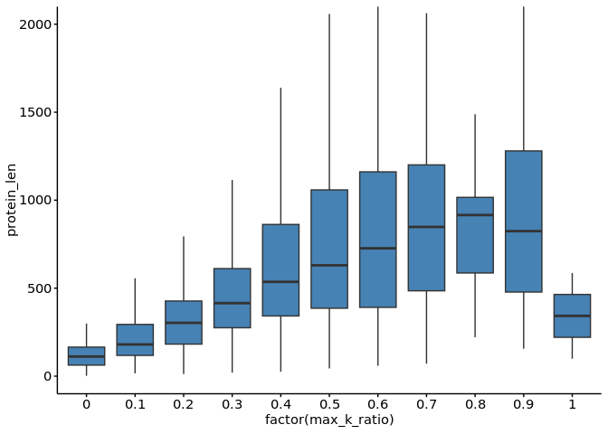
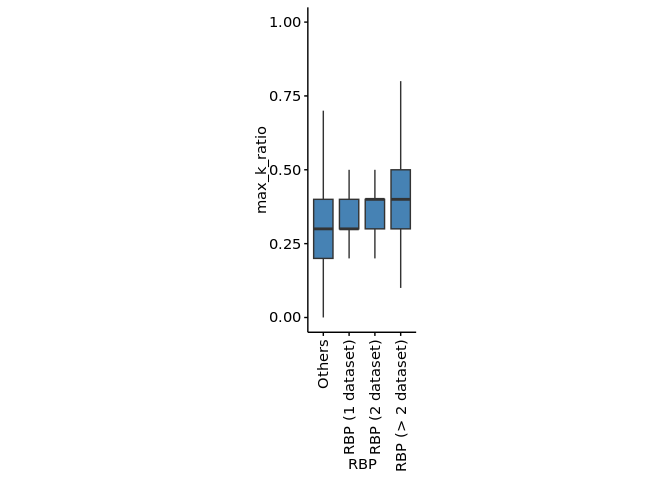
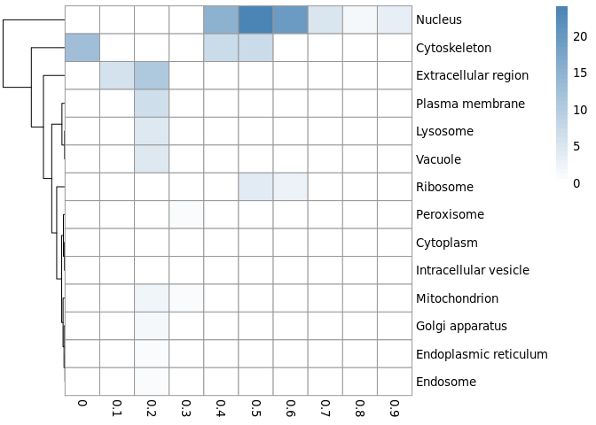
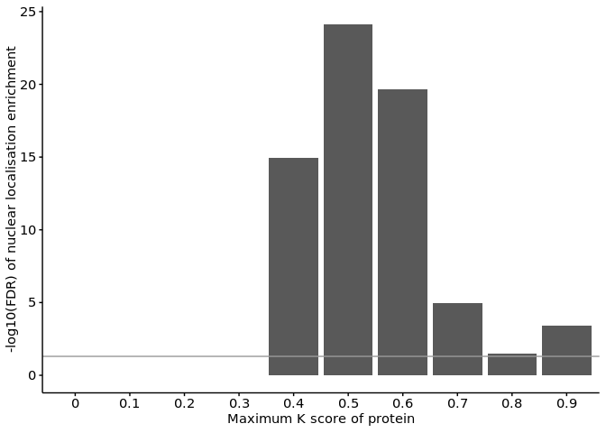

1-1. Proteins with lysine-rich domains
================
Yoichiro Sugimoto
18 November, 2024

- [Environment setup](#environment-setup)
- [Set up environment](#set-up-environment)
- [Import data](#import-data)
- [Basic statistics](#basic-statistics)
- [Subcellular localisation](#subcellular-localisation)
- [Session information](#session-information)

# Environment setup

``` r
# renv::init(
#           "/fast/AG_Sugimoto/home/users/yoichiro/projects/20241111_PTMs_in_lysine_rich_domains/R"
#       )

project.dir <- file.path("/fast/AG_Sugimoto/home/users/yoichiro/projects/20241111_PTMs_in_lysine_rich_domains")
## renv::snapshot(file.path(project.dir, "R"))

renv::restore(file.path(project.dir, "R"))
```

    ## The following package(s) will be updated:
    ## 
    ## # https://bioconductor.org/packages/3.18/bioc --------------------------------
    ## - AnnotationDbi      [1.64.1 -> 1.64.1]
    ## - Biobase            [2.62.0 -> 2.62.0]
    ## - BiocGenerics       [0.48.1 -> 0.48.1]
    ## - BiocVersion        [3.18.1 -> 3.18.1]
    ## - Biostrings         [2.70.3 -> 2.70.3]
    ## - GenomeInfoDb       [1.38.8 -> 1.38.8]
    ## - IRanges            [2.36.0 -> 2.36.0]
    ## - KEGGREST           [1.42.0 -> 1.42.0]
    ## - S4Vectors          [0.40.2 -> 0.40.2]
    ## - XVector            [0.42.0 -> 0.42.0]
    ## - zlibbioc           [1.48.2 -> 1.48.2]
    ## 
    ## # https://bioconductor.org/packages/3.18/data/annotation ---------------------
    ## - GenomeInfoDbData   [1.2.11 -> 1.2.11]
    ## - org.Hs.eg.db       [3.18.0 -> 3.18.0]
    ## 
    ## # Installing packages --------------------------------------------------------
    ## - Installing BiocVersion ...                    OK [copied from cache]
    ## - Installing zlibbioc ...                       OK [copied from cache]
    ## - Installing BiocGenerics ...                   OK [copied from cache]
    ## - Installing GenomeInfoDbData ...               OK [copied from cache]
    ## - Installing S4Vectors ...                      OK [copied from cache]
    ## - Installing IRanges ...                        OK [copied from cache]
    ## - Installing GenomeInfoDb ...                   OK [copied from cache]
    ## - Installing XVector ...                        OK [copied from cache]
    ## - Installing Biobase ...                        OK [copied from cache]
    ## - Installing Biostrings ...                     OK [copied from cache]
    ## - Installing KEGGREST ...                       OK [copied from cache]
    ## - Installing AnnotationDbi ...                  OK [copied from cache]
    ## - Installing org.Hs.eg.db ...                   OK [copied from cache in 0.39s]

``` r
temp <- sapply(list.files(file.path(project.dir, "R/functions"), pattern="*.R", full.names = TRUE), source)
```

    ## 
    ## Attaching package: 'dplyr'

    ## The following objects are masked from 'package:stats':
    ## 
    ##     filter, lag

    ## The following objects are masked from 'package:base':
    ## 
    ##     intersect, setdiff, setequal, union

    ## 
    ## Attaching package: 'data.table'

    ## The following objects are masked from 'package:dplyr':
    ## 
    ##     between, first, last

    ## Loading required package: BiocGenerics

    ## 
    ## Attaching package: 'BiocGenerics'

    ## The following objects are masked from 'package:dplyr':
    ## 
    ##     combine, intersect, setdiff, union

    ## The following objects are masked from 'package:stats':
    ## 
    ##     IQR, mad, sd, var, xtabs

    ## The following objects are masked from 'package:base':
    ## 
    ##     anyDuplicated, aperm, append, as.data.frame, basename, cbind,
    ##     colnames, dirname, do.call, duplicated, eval, evalq, Filter, Find,
    ##     get, grep, grepl, intersect, is.unsorted, lapply, Map, mapply,
    ##     match, mget, order, paste, pmax, pmax.int, pmin, pmin.int,
    ##     Position, rank, rbind, Reduce, rownames, sapply, setdiff, sort,
    ##     table, tapply, union, unique, unsplit, which.max, which.min

    ## Loading required package: S4Vectors

    ## Loading required package: stats4

    ## 
    ## Attaching package: 'S4Vectors'

    ## The following objects are masked from 'package:data.table':
    ## 
    ##     first, second

    ## The following objects are masked from 'package:dplyr':
    ## 
    ##     first, rename

    ## The following object is masked from 'package:utils':
    ## 
    ##     findMatches

    ## The following objects are masked from 'package:base':
    ## 
    ##     expand.grid, I, unname

    ## Loading required package: IRanges

    ## 
    ## Attaching package: 'IRanges'

    ## The following object is masked from 'package:data.table':
    ## 
    ##     shift

    ## The following objects are masked from 'package:dplyr':
    ## 
    ##     collapse, desc, slice

    ## Loading required package: XVector

    ## Loading required package: GenomeInfoDb

    ## 
    ## Attaching package: 'Biostrings'

    ## The following object is masked from 'package:base':
    ## 
    ##     strsplit

    ## 
    ## Attaching package: 'janitor'

    ## The following objects are masked from 'package:stats':
    ## 
    ##     chisq.test, fisher.test

# Set up environment

``` r
library("org.Hs.eg.db")
```

    ## Loading required package: AnnotationDbi

    ## Loading required package: Biobase

    ## Welcome to Bioconductor
    ## 
    ##     Vignettes contain introductory material; view with
    ##     'browseVignettes()'. To cite Bioconductor, see
    ##     'citation("Biobase")', and for packages 'citation("pkgname")'.

    ## 
    ## Attaching package: 'AnnotationDbi'

    ## The following object is masked from 'package:dplyr':
    ## 
    ##     select

    ## 

``` r
## paths
data.dir <- file.path(project.dir, "data")
results.dir <- file.path(project.dir, "results")
r0.dir <- file.path(results.dir, "p0-data-preprocessing")

dir.create(r0.dir, showWarnings = FALSE)
```

# Import data

``` r
protein.feature.dt <- fread(file.path(data.dir, "PNAS2022/all_protein_feature_per_position.csv"))

## Convert gene id and names
gene.id.dt <- select(
    org.Hs.eg.db,
    keys = protein.feature.dt[, unique(uniprot_id)],
    columns = c("SYMBOL","ENSEMBL"),
    keytype = "UNIPROT"
) %>%
    data.table
```

    ## 'select()' returned 1:many mapping between keys and columns

``` r
setnames(
    gene.id.dt,
    old = c("UNIPROT", "SYMBOL","ENSEMBL"),
    new = c("uniprot_id", "gene_name", "gene_id")
)

gene.id.dt <- gene.id.dt[order(gene_id)][!duplicated(uniprot_id)][!is.na(gene_id)]

fwrite(gene.id.dt, file.path(r0.dir, "uniprot-ensembl.csv"))

max.k.score.dt <- protein.feature.dt[
  , list(
    max_k_ratio = max(K_ratio),
    protein_len = max(position)
    ), 
  by = list(Accession, uniprot_id)] 

max.k.score.dt <- merge(
    gene.id.dt,
    max.k.score.dt,
    all.y = TRUE,
    by = "uniprot_id"
)

fwrite(max.k.score.dt, file.path(r0.dir, "max-k-score-per-protein.csv")) 

## RBPs

rbp.dt <- readxl::read_excel(file.path(data.dir, "20241113_RBPbase_Hs_DescriptiveID.xlsx")) %>%
  data.table()

setnames(rbp.dt, old = colnames(rbp.dt), new = str_split_fixed(colnames(rbp.dt), "\n", n = 2)[, 1])
rbp.dt <- janitor::clean_names(rbp.dt, case = "none")
setnames(rbp.dt, old = "UnitProtSwissProtID_Hs", new = "uniprot_id")


rbp.dt <- rbp.dt[
  , c("uniprot_id", grep("^Hs_", colnames(rbp.dt), value = TRUE)), with = FALSE
  ]

rbp.dt <- rbp.dt[!is.na(uniprot_id) & !duplicated(uniprot_id)]

m.rbp.dt <- melt(
    rbp.dt,
    id.vars = c("uniprot_id"),
    variable.name = "dataset",
    value.name = "RBP"
)

rbp.count.dt <- m.rbp.dt[!is.na(uniprot_id),
  list(
    identified_RBP = sum(RBP == "YES"),
    total = sum(RBP == "YES") + sum(RBP == "no") 
    ), by = uniprot_id
  ]

rbp.count.dt[, table(identified_RBP)]
```

    ## identified_RBP
    ##     0     1     2     3     4     5     6     7     8     9    10    11    12 
    ## 14104  1936   694   388   278   205   174   126   104    98    86    68    65 
    ##    13    14    15    16    17    18    19    20    21    22    23    24    25 
    ##    49    46    50    52    49    60    41    55    26    21    20    29    13 
    ##    26    27 
    ##     9     6

# Basic statistics

``` r
## The number of proteins per max K score

ggplot(
    max.k.score.dt,
    aes(
        x = max_k_ratio
    )
) +
    geom_bar() +
    scale_x_continuous(breaks=seq(0, 1, 0.1))
```

<!-- -->

``` r
## Max K ratio vs protein length

ggplot(
  max.k.score.dt,
  aes(
    y = protein_len,
    x = factor(max_k_ratio)
  )
) + geom_boxplot(fill = "steelblue", outlier.shape = NA) +
  coord_cartesian(ylim = c(0, 2000))
```

<!-- -->

``` r
## RBPs

rbp.count.dt <- merge(
  max.k.score.dt, rbp.count.dt, by = "uniprot_id"
)

data.set.names <- c(
  "Others", 
  "RBP (1 dataset)", "RBP (2 dataset)", "RBP (> 2 dataset)"
  )

rbp.count.dt[, RBP := case_when(
  identified_RBP > 2 ~ "RBP (> 2 dataset)",
  identified_RBP > 1 ~ "RBP (2 dataset)",
  identified_RBP > 0 ~ "RBP (1 dataset)", 
  TRUE ~ "Others") %>% factor(levels = data.set.names)]
rbp.count.dt[, table(RBP)]
```

    ## RBP
    ##            Others   RBP (1 dataset)   RBP (2 dataset) RBP (> 2 dataset) 
    ##             14045              1928               694              2111

``` r
ggplot(
  data = rbp.count.dt,
  aes(
    x = RBP,
    y = max_k_ratio
    )
  ) +
  geom_boxplot(fill = "steelblue", outlier.shape = NA) +
  scale_x_discrete(guide = guide_axis(angle = 90)) +
  theme(aspect.ratio = 3)
```

<!-- -->

# Subcellular localisation

``` r
library("subcellularvis")

extractCompartment <- function(gene.set, class.name){
  comp.out <- compartmentData(
    gene.set,
    id_type = "UNIPROT",
    aspect = c("Whole cell"),
    organism = c("Human"),
    annotationSource =c("Gene Ontology") #c("Human Protein Atlas")
  )
  
  comp.out.dt <- data.table(comp.out$enrichment)
  comp.out.dt[, `:=`(
    Genes = NA,
    n_unmmaped = length(str_split(comp.out$unmapped, ",")[[1]]),
    n_mapped = comp.out$nMapped,
    class_name = class.name
  )]
  
  return(comp.out.dt)
}

max.k.score.dt[, max_k_ratio_group := case_when(
  max_k_ratio >= 0.9 ~ 0.9,
  TRUE ~ max_k_ratio
)]

k.score.compartment.dt <- mapply(
  extractCompartment,
  gene.set = lapply(
    seq(0, 9, by = 1) / 10, 
    function(x){max.k.score.dt[max_k_ratio_group == x, uniprot_id]}
    ),
  class.name = as.character(seq(0, 0.9, by = 0.1)),
  SIMPLIFY = FALSE
) %>% rbindlist
  
k.score.compartment.dt[, mlog10FDR := -log10(FDR)]

library("pheatmap")

d.k.score.compartment.dt <- dcast(
  k.score.compartment.dt,
  Compartment ~ factor(class_name),
  value.var = "mlog10FDR"
)

d.k.score.compartment.mat <- as.matrix(d.k.score.compartment.dt[, 2:ncol(d.k.score.compartment.dt)])
rownames(d.k.score.compartment.mat) <- d.k.score.compartment.dt[, Compartment]

library(RColorBrewer)

mat_breaks <- seq(min(d.k.score.compartment.mat), max(d.k.score.compartment.mat), length.out = 40)

pheatmap(
  d.k.score.compartment.mat,
  cluster_cols = FALSE,
  color = colorRampPalette(c("white", "steelblue"))(length(mat_breaks)),
  breaks = mat_breaks
)
```

<!-- -->

``` r
ggplot(
  data = k.score.compartment.dt[Compartment == "Nucleus"],
  aes(
    x = factor(class_name),
    y = mlog10FDR
  )
) +
  geom_bar(stat = "identity") +
  geom_hline(yintercept = -log10(0.05), color = "gray60") +
  ylab("-log10(FDR) of nuclear localisation enrichment") +
  xlab("Maximum K score of protein")
```

<!-- -->

# Session information

``` r
sessioninfo::session_info()
```

    ## ─ Session info ───────────────────────────────────────────────────────────────
    ##  setting  value
    ##  version  R version 4.3.2 (2023-10-31)
    ##  os       Ubuntu 22.04.3 LTS
    ##  system   x86_64, linux-gnu
    ##  ui       X11
    ##  language (EN)
    ##  collate  C.UTF-8
    ##  ctype    C.UTF-8
    ##  tz       Europe/Berlin
    ##  date     2024-11-18
    ##  pandoc   3.1.1 @ /usr/lib/rstudio-server/bin/quarto/bin/tools/ (via rmarkdown)
    ## 
    ## ─ Packages ───────────────────────────────────────────────────────────────────
    ##  package          * version    date (UTC) lib source
    ##  AnnotationDbi    * 1.64.1     2023-11-03 [1] Bioconductor
    ##  Biobase          * 2.62.0     2023-10-24 [1] Bioconductor
    ##  BiocGenerics     * 0.48.1     2023-11-01 [1] Bioconductor
    ##  BiocManager        1.30.25    2024-08-28 [1] CRAN (R 4.3.2)
    ##  Biostrings       * 2.70.3     2024-03-13 [1] Bioconductor 3.18 (R 4.3.2)
    ##  bit                4.5.0      2024-09-20 [1] CRAN (R 4.3.2)
    ##  bit64              4.5.2      2024-09-22 [1] CRAN (R 4.3.2)
    ##  bitops             1.0-9      2024-10-03 [1] CRAN (R 4.3.2)
    ##  blob               1.2.4      2023-03-17 [1] CRAN (R 4.3.2)
    ##  cachem             1.1.0      2024-05-16 [1] CRAN (R 4.3.2)
    ##  cellranger         1.1.0      2016-07-27 [1] CRAN (R 4.3.2)
    ##  cli                3.6.3      2024-06-21 [1] CRAN (R 4.3.2)
    ##  colorspace         2.1-1      2024-07-26 [1] CRAN (R 4.3.2)
    ##  colourpicker       1.3.0      2023-08-21 [1] CRAN (R 4.3.2)
    ##  crayon             1.5.3      2024-06-20 [1] CRAN (R 4.3.2)
    ##  data.table       * 1.15.4     2024-03-30 [1] CRAN (R 4.3.2)
    ##  DBI                1.2.3      2024-06-02 [1] CRAN (R 4.3.2)
    ##  digest             0.6.36     2024-06-23 [1] CRAN (R 4.3.2)
    ##  dplyr            * 1.1.4      2023-11-17 [1] CRAN (R 4.3.2)
    ##  evaluate           0.24.0     2024-06-10 [1] CRAN (R 4.3.2)
    ##  fansi              1.0.6      2023-12-08 [1] CRAN (R 4.3.2)
    ##  farver             2.1.2      2024-05-13 [1] CRAN (R 4.3.2)
    ##  fastmap            1.2.0      2024-05-15 [1] CRAN (R 4.3.2)
    ##  formattable        0.2.1      2021-01-07 [1] CRAN (R 4.3.2)
    ##  generics           0.1.3      2022-07-05 [1] CRAN (R 4.3.2)
    ##  GenomeInfoDb     * 1.38.8     2024-03-15 [1] Bioconductor 3.18 (R 4.3.2)
    ##  GenomeInfoDbData   1.2.11     2024-11-18 [1] Bioconductor
    ##  ggplot2          * 3.5.1      2024-04-23 [1] CRAN (R 4.3.2)
    ##  glue               1.7.0      2024-01-09 [1] CRAN (R 4.3.2)
    ##  gridExtra          2.3        2017-09-09 [1] CRAN (R 4.3.2)
    ##  gtable             0.3.5      2024-04-22 [1] CRAN (R 4.3.2)
    ##  highr              0.11       2024-05-26 [1] CRAN (R 4.3.2)
    ##  htmltools          0.5.8.1    2024-04-04 [1] CRAN (R 4.3.2)
    ##  htmlwidgets        1.6.4      2023-12-06 [1] CRAN (R 4.3.2)
    ##  httpuv             1.6.15     2024-03-26 [1] CRAN (R 4.3.2)
    ##  httr               1.4.7      2023-08-15 [1] CRAN (R 4.3.2)
    ##  IRanges          * 2.36.0     2023-10-24 [1] Bioconductor
    ##  janitor          * 2.2.0      2023-02-02 [1] CRAN (R 4.3.2)
    ##  jsonlite           1.8.8      2023-12-04 [1] CRAN (R 4.3.2)
    ##  KEGGREST           1.42.0     2023-10-24 [1] Bioconductor
    ##  khroma           * 1.14.0     2024-08-26 [1] CRAN (R 4.3.2)
    ##  knitr            * 1.48       2024-07-07 [1] CRAN (R 4.3.2)
    ##  labeling           0.4.3      2023-08-29 [1] CRAN (R 4.3.2)
    ##  later              1.3.2      2023-12-06 [1] CRAN (R 4.3.2)
    ##  lazyeval           0.2.2      2019-03-15 [1] CRAN (R 4.3.2)
    ##  lifecycle          1.0.4      2023-11-07 [1] CRAN (R 4.3.2)
    ##  lubridate          1.9.3      2023-09-27 [1] CRAN (R 4.3.2)
    ##  magrittr         * 2.0.3      2022-03-30 [1] CRAN (R 4.3.2)
    ##  memoise            2.0.1      2021-11-26 [1] CRAN (R 4.3.2)
    ##  mime               0.12       2021-09-28 [1] CRAN (R 4.3.2)
    ##  miniUI             0.1.1.1    2018-05-18 [1] CRAN (R 4.3.2)
    ##  munsell            0.5.1      2024-04-01 [1] CRAN (R 4.3.2)
    ##  org.Hs.eg.db     * 3.18.0     2024-11-18 [1] Bioconductor
    ##  pheatmap         * 1.0.12     2019-01-04 [1] CRAN (R 4.3.2)
    ##  pillar             1.9.0      2023-03-22 [1] CRAN (R 4.3.2)
    ##  pkgconfig          2.0.3      2019-09-22 [1] CRAN (R 4.3.2)
    ##  plotly             4.10.4     2024-01-13 [1] CRAN (R 4.3.2)
    ##  plyr               1.8.9      2023-10-02 [1] CRAN (R 4.3.2)
    ##  png                0.1-8      2022-11-29 [1] CRAN (R 4.3.2)
    ##  promises           1.3.0      2024-04-05 [1] CRAN (R 4.3.2)
    ##  purrr              1.0.2      2023-08-10 [1] CRAN (R 4.3.2)
    ##  R6                 2.5.1      2021-08-19 [1] CRAN (R 4.3.2)
    ##  RColorBrewer     * 1.1-3      2022-04-03 [1] CRAN (R 4.3.2)
    ##  Rcpp               1.0.13-1   2024-11-02 [1] CRAN (R 4.3.2)
    ##  RCurl              1.98-1.16  2024-07-11 [1] CRAN (R 4.3.2)
    ##  readxl             1.4.3      2023-07-06 [1] CRAN (R 4.3.2)
    ##  renv               1.0.7      2024-04-11 [1] CRAN (R 4.3.2)
    ##  rlang              1.1.4      2024-06-04 [1] CRAN (R 4.3.2)
    ##  rmarkdown          2.27       2024-05-17 [1] CRAN (R 4.3.2)
    ##  RSQLite            2.3.8      2024-11-17 [1] CRAN (R 4.3.2)
    ##  rstudioapi         0.17.1     2024-10-22 [1] CRAN (R 4.3.2)
    ##  S4Vectors        * 0.40.2     2023-11-23 [1] Bioconductor 3.18 (R 4.3.2)
    ##  scales           * 1.3.0      2023-11-28 [1] CRAN (R 4.3.2)
    ##  sessioninfo        1.2.2      2021-12-06 [1] CRAN (R 4.3.2)
    ##  shiny              1.9.1      2024-08-01 [1] CRAN (R 4.3.2)
    ##  shinythemes        1.2.0      2021-01-25 [1] CRAN (R 4.3.2)
    ##  snakecase          0.11.1     2023-08-27 [1] CRAN (R 4.3.2)
    ##  stringi            1.8.4      2024-05-06 [1] CRAN (R 4.3.2)
    ##  stringr          * 1.5.1      2023-11-14 [1] CRAN (R 4.3.2)
    ##  subcellularvis   * 0.0.0.9000 2024-11-18 [1] Github (jowatson2011/subcellularvis@6a3f41d)
    ##  tibble             3.2.1      2023-03-20 [1] CRAN (R 4.3.2)
    ##  tidyr              1.3.1      2024-01-24 [1] CRAN (R 4.3.2)
    ##  tidyselect         1.2.1      2024-03-11 [1] CRAN (R 4.3.2)
    ##  timechange         0.3.0      2024-01-18 [1] CRAN (R 4.3.2)
    ##  UpSetR             1.4.0      2019-05-22 [1] CRAN (R 4.3.2)
    ##  utf8               1.2.4      2023-10-22 [1] CRAN (R 4.3.2)
    ##  vctrs              0.6.5      2023-12-01 [1] CRAN (R 4.3.2)
    ##  viridisLite        0.4.2      2023-05-02 [1] CRAN (R 4.3.2)
    ##  withr              3.0.1      2024-07-31 [1] CRAN (R 4.3.2)
    ##  xfun               0.46       2024-07-18 [1] CRAN (R 4.3.2)
    ##  xtable             1.8-4      2019-04-21 [1] CRAN (R 4.3.2)
    ##  XVector          * 0.42.0     2023-10-24 [1] Bioconductor
    ##  yaml               2.3.10     2024-07-26 [1] CRAN (R 4.3.2)
    ##  zlibbioc           1.48.2     2024-03-13 [1] Bioconductor 3.18 (R 4.3.2)
    ## 
    ##  [1] /home/ysugimo/R/x86_64-pc-linux-gnu-library/4.3
    ##  [2] /usr/local/lib/R/site-library
    ##  [3] /usr/lib/R/site-library
    ##  [4] /usr/lib/R/library
    ## 
    ## ──────────────────────────────────────────────────────────────────────────────
