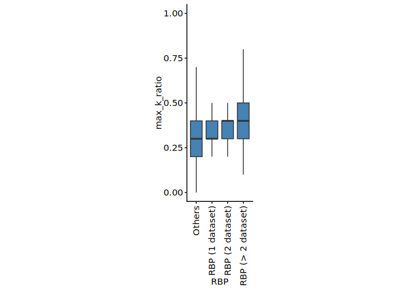
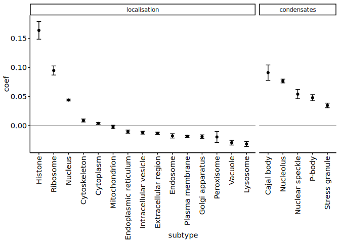
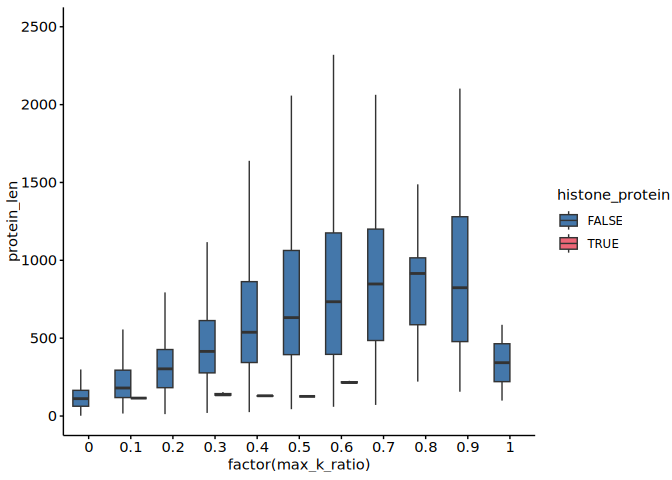
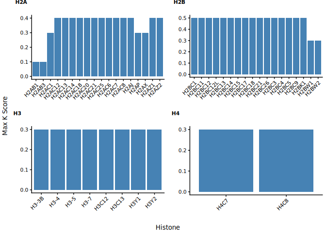
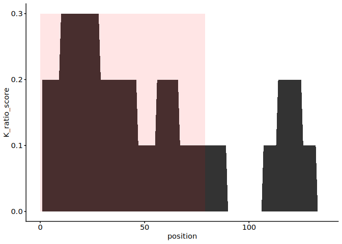
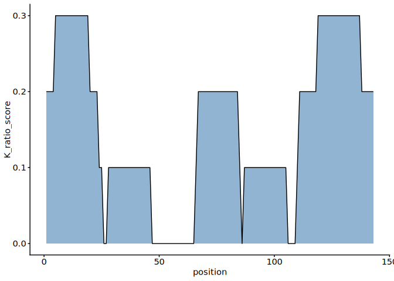
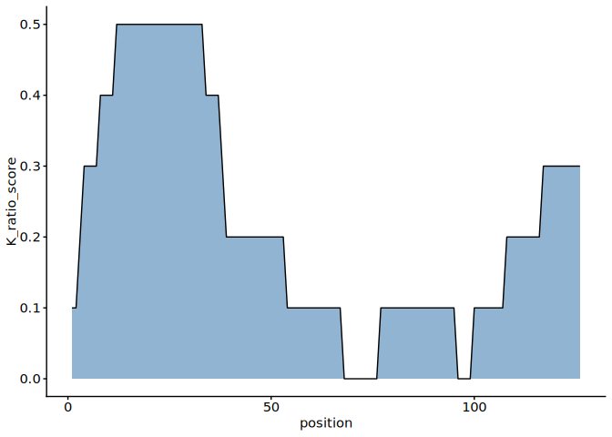
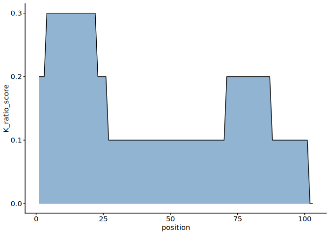
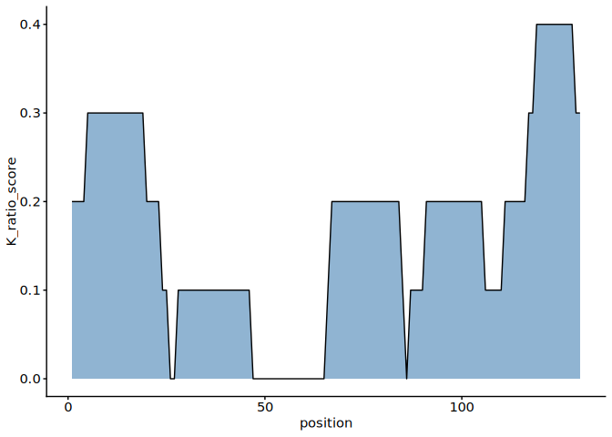

1-1. Proteins with lysine-rich domains
================
Pallavi Kesavan and Yoichiro Sugimoto
25 November, 2025

- [Environment setup](#environment-setup)
- [1.1 Import data](#11-import-data)
- [1.2 Maximum K score and Protein
  Length](#12-maximum-k-score-and-protein-length)
- [Data Visualization - K score, Maximum K score and Protein
  Length](#data-visualization---k-score-maximum-k-score-and-protein-length)
- [1.3 RNA-Binding proteins](#13-rna-binding-proteins)
- [Data Visualization - RNA-Binding Proteins (Max K score versus
  RBP)](#data-visualization---rna-binding-proteins-max-k-score-versus-rbp)
- [1.4 Subcellular localisation](#14-subcellular-localisation)
- [Data Visualization - Subcellular
  Localisation](#data-visualization---subcellular-localisation)
- [1.5 Enrichment of lysine-rich domains by functional protein
  classes](#15-enrichment-of-lysine-rich-domains-by-functional-protein-classes)
- [Session information](#session-information)

# Environment setup

``` r
## Initialize renv (first time only) - re-installed 24.09.2025
# Creates project specific library and renv.lock file. 
# Use 'renv::init(filepath)' to create project library
# renv::init(
#        "/fast/AG_Sugimoto/home/users/pallavi/projects/20241111_PTMs_in_lysine_rich_domains/R"
#    )

## Define project directory 
project.dir <- file.path("/fast/AG_Sugimoto/home/users/pallavi/projects/20241111_PTMs_in_lysine_rich_domains")

## Use 'renv::snapshot', if there are updates in the current dependencies 
# renv::snapshot(file.path(project.dir, "R"))

## Restore packages
#renv::restore(file.path(project.dir, "R"))

## Check package versions of current loaded library and lockfile 
#renv::status

## Load all R scripts from the 'functions' folder into the current session
P2_functions <- sapply(list.files(file.path(project.dir, "R/functions"), pattern="*.R", full.names = TRUE), source)
```

    ## 
    ## Attaching package: 'dplyr'

    ## The following objects are masked from 'package:stats':
    ## 
    ##     filter, lag

    ## The following objects are masked from 'package:base':
    ## 
    ##     intersect, setdiff, setequal, union

    ## 
    ## Attaching package: 'data.table'

    ## The following objects are masked from 'package:dplyr':
    ## 
    ##     between, first, last

    ## Loading required package: BiocGenerics

    ## Loading required package: generics

    ## 
    ## Attaching package: 'generics'

    ## The following object is masked from 'package:dplyr':
    ## 
    ##     explain

    ## The following objects are masked from 'package:base':
    ## 
    ##     as.difftime, as.factor, as.ordered, intersect, is.element, setdiff,
    ##     setequal, union

    ## 
    ## Attaching package: 'BiocGenerics'

    ## The following object is masked from 'package:dplyr':
    ## 
    ##     combine

    ## The following objects are masked from 'package:stats':
    ## 
    ##     IQR, mad, sd, var, xtabs

    ## The following objects are masked from 'package:base':
    ## 
    ##     anyDuplicated, aperm, append, as.data.frame, basename, cbind,
    ##     colnames, dirname, do.call, duplicated, eval, evalq, Filter, Find,
    ##     get, grep, grepl, is.unsorted, lapply, Map, mapply, match, mget,
    ##     order, paste, pmax, pmax.int, pmin, pmin.int, Position, rank,
    ##     rbind, Reduce, rownames, sapply, saveRDS, table, tapply, unique,
    ##     unsplit, which.max, which.min

    ## Loading required package: S4Vectors

    ## Loading required package: stats4

    ## 
    ## Attaching package: 'S4Vectors'

    ## The following objects are masked from 'package:data.table':
    ## 
    ##     first, second

    ## The following objects are masked from 'package:dplyr':
    ## 
    ##     first, rename

    ## The following object is masked from 'package:utils':
    ## 
    ##     findMatches

    ## The following objects are masked from 'package:base':
    ## 
    ##     expand.grid, I, unname

    ## Loading required package: IRanges

    ## 
    ## Attaching package: 'IRanges'

    ## The following object is masked from 'package:data.table':
    ## 
    ##     shift

    ## The following objects are masked from 'package:dplyr':
    ## 
    ##     collapse, desc, slice

    ## Loading required package: XVector

    ## Loading required package: GenomeInfoDb

    ## 
    ## Attaching package: 'Biostrings'

    ## The following object is masked from 'package:base':
    ## 
    ##     strsplit

``` r
# Load PTM stiochiometry functions
library("ptm.stoichiometry")
```

# 1.1 Import data

``` r
## Define paths to directory
data.dir <- file.path(project.dir, "data")
results.dir <- file.path(project.dir, "results")

#Create p1 results directory
p1_K_rich_domains <- file.path(results.dir, "p1_K_rich_domains")
dir.create(p1_K_rich_domains, showWarnings = FALSE, recursive = TRUE)

## Load data into environment 
protein.feature.dt <- fread(file.path(data.dir, "PNAS2022/all_protein_feature_per_position.csv"))

## Load library  
library("org.Hs.eg.db")
```

    ## Loading required package: AnnotationDbi

    ## Loading required package: Biobase

    ## Welcome to Bioconductor
    ## 
    ##     Vignettes contain introductory material; view with
    ##     'browseVignettes()'. To cite Bioconductor, see
    ##     'citation("Biobase")', and for packages 'citation("pkgname")'.

    ## 
    ## Attaching package: 'AnnotationDbi'

    ## The following object is masked from 'package:dplyr':
    ## 
    ##     select

    ## 

``` r
## Convert gene id and names
# Map UniProt IDs to gene symbols and ENSEMBL IDs
gene.id.dt <- select(
    org.Hs.eg.db,
    keys = protein.feature.dt[, unique(uniprot_id)],
    columns = c("SYMBOL","ENSEMBL"),
    keytype = "UNIPROT"
) %>%
    data.table
```

    ## 'select()' returned 1:many mapping between keys and columns

``` r
# Rename columns 
setnames(
    gene.id.dt,
    old = c("UNIPROT", "SYMBOL","ENSEMBL"),
    new = c("uniprot_id", "gene_name", "gene_id")
)

## Clean and organize gene mapping table
# Sort gene_id in ascending order, remove duplicate UniProt id and remove rows missing gene_id 
gene.id.dt <- gene.id.dt[order(gene_id)][!duplicated(uniprot_id)][!is.na(gene_id)]

# Rename data file and save to directory 
fwrite(gene.id.dt, file.path(results.dir, "p1_K_rich_domains","uniprot-ensembl.csv"))
```

# 1.2 Maximum K score and Protein Length

``` r
#-----------------------------------
# Maximum K score and Protein Length
#-----------------------------------

## Compute maximum K_ratio and protein length for each protein
max.k.score.dt <- protein.feature.dt[ 
  , list(
    max_k_ratio = max(K_ratio), 
    protein_len = max(position)
    ), 
  by = list(Accession, uniprot_id)] 

## Merge gene annotations with protein summary data (max K_ratio, protein length)
# Merge tables using the UniProt ID as the key
max.k.score.dt <- merge(
    gene.id.dt,
    max.k.score.dt,
    all.y = TRUE,
    by = "uniprot_id"
)

# Create dataset with max k score 
fwrite(max.k.score.dt, file.path(results.dir, "p1_K_rich_domains", "max-k-score-per-protein.csv")) 

# Import human protein reference data from specified file path 
ref_protein_data <- import_reference_fasta(file.path
("/fast/AG_Sugimoto/reference/uniprot/human", 
  "UP000005640_9606.fasta")) 

# Median K score of all region in human proteome
all_protein_K_ratio <- sapply(ref_protein_data$protein_seq, function(seq){
  if (is.na(seq) || nchar(seq) == 0) # checks for missing values 
    return(NA_real_)
  k_count <- str_count(seq, "K") # counts number of K in each sequence
  len <- nchar(seq) # counts the number of amino acid in sequence
  (k_count/len)*10 # compute K per 10 residues
})

# median K score
median_k_ratio <- median(all_protein_K_ratio, na.rm = TRUE)
print(median_k_ratio)
```

    ## [1] 0.5364807

# Data Visualization - K score, Maximum K score and Protein Length

``` r
#---------------------------------------------------------
# Data Visualization - K score, Maximum K score and Protein Length
#---------------------------------------------------------

## K_ratio distribution 
# Count how many proteins have each K_ratio value
protein.feature.dt[, table(K_ratio)] 
```

    ## K_ratio
    ##       0     0.1     0.2     0.3     0.4     0.5     0.6     0.7     0.8     0.9 
    ## 6672182 3249314 1066633  255694   52006   11627    2951     979     322      54 
    ##       1 
    ##       2

``` r
# Create a new column `K_ratio_group` based on the K_ratio
protein.feature.dt[, K_ratio_group := case_when(
  K_ratio >= 0.9 ~ 0.9, #If K_ratio is 0.9 or higher, assign value 0.9
  TRUE ~ K_ratio #If K_ratio is lower than 0.9, then assign original K_ratio value
)]

# Plot - The number of proteins per K score
ggplot(
    protein.feature.dt,
    aes(
        x = K_ratio_group
    )
) +
    geom_bar() +
    scale_x_continuous(breaks=seq(0, 1, 0.1))
```

<!-- -->

``` r
# Plot - The number of proteins per max K score
ggplot(
    max.k.score.dt,
    aes(
        x = max_k_ratio
    )
) +
    geom_bar() +
    scale_x_continuous(breaks=seq(0, 1, 0.1)) + 
  labs(x = "max_k_ratio", y = "number of protein_count")
```

<!-- -->

``` r
#Median - 24112025
median(max.k.score.dt[, max_k_ratio])
```

    ## [1] 0.3

``` r
# 0.3

# Plot - Max K ratio vs protein length
ggplot(
  max.k.score.dt,
  aes(
    y = protein_len,
    x = factor(max_k_ratio)
  )
) + geom_boxplot(fill = "steelblue", outlier.shape = NA) +
  labs(x = "max_K_ratio", y = "protein_length") +
  coord_cartesian(ylim = c(0, 2000))
```

<!-- -->

``` r
# Plot - K_score of disordered regions of proteins 
# This plot indicates K score depending on the level of protein disorderliness

ggplot(
  protein.feature.dt,
  aes(
    x = factor(K_ratio_group),
    y = IUPRED2
  )
) + 
  geom_boxplot(fill = "steelblue", outlier.shape = NA)
```

<!-- -->

``` r
# Plot - Protein charge versus K_ratio_group
ggplot(
  protein.feature.dt,
  aes(
    x = factor(K_ratio_group),
    y = windowCharge
  )
) + 
  geom_hline(yintercept = 0, color = "gray60") +
  geom_boxplot(fill = "steelblue", outlier.shape = NA)
```

    ## Warning: Removed 211124 rows containing non-finite outside the scale range
    ## (`stat_boxplot()`).

<!-- -->

# 1.3 RNA-Binding proteins

``` r
#---------------------------
# RNA-Binding Proteins (RBP)
#---------------------------

# Load data into environment 
rbp.dt <- readxl::read_excel(file.path(data.dir, "20241113_RBPbase_Hs_DescriptiveID.xlsx")) %>%
  data.table()

# Remove line breaks and split into two columns
setnames(rbp.dt, old = colnames(rbp.dt), new = str_split_fixed(colnames(rbp.dt), "\n", n = 2)[, 1])
rbp.dt <- janitor::clean_names(rbp.dt, case = "none") #Rename duplicate column names
setnames(rbp.dt, old = "UnitProtSwissProtID_Hs", new = "uniprot_id") 


# Dataset containing only UniProt id and Hs_ columns
rbp.dt <- rbp.dt[
  , c("uniprot_id", grep("^Hs_", colnames(rbp.dt), value = TRUE)), with = FALSE
  ]

# Remove NA and duplicated values
rbp.dt <- rbp.dt[!is.na(uniprot_id) & !duplicated(uniprot_id)]

# Reshape dataset into long format for easy data management and visualization 
m.rbp.dt <- melt(
    rbp.dt,
    id.vars = c("uniprot_id"),
    variable.name = "dataset",
    value.name = "RBP"
)

# Dataset containing count of identified RBP and total RBP 
rbp.count.dt <- m.rbp.dt[!is.na(uniprot_id),
  list(
    identified_RBP = sum(RBP == "YES"),
    total = sum(RBP == "YES") + sum(RBP == "no") 
    ), by = uniprot_id
  ]

rbp.count.dt[, table(identified_RBP)]
```

    ## identified_RBP
    ##     0     1     2     3     4     5     6     7     8     9    10    11    12 
    ## 14104  1936   694   388   278   205   174   126   104    98    86    68    65 
    ##    13    14    15    16    17    18    19    20    21    22    23    24    25 
    ##    49    46    50    52    49    60    41    55    26    21    20    29    13 
    ##    26    27 
    ##     9     6

``` r
#-----------------------------------
## Comparing Max K score versus RBP
#-----------------------------------

# Create dataset containing max K score and RBP count
rbp.count.dt <- merge(
  max.k.score.dt, rbp.count.dt, by = "uniprot_id"
)

data.set.names <- c(
  "Others", 
  "RBP (1 dataset)", "RBP (2 dataset)", "RBP (> 2 dataset)"
  )

# Assign values to RBP dataset columns based on RBP count 
rbp.count.dt[, RBP := case_when(
  identified_RBP > 2 ~ "RBP (> 2 dataset)",
  identified_RBP > 1 ~ "RBP (2 dataset)",
  identified_RBP > 0 ~ "RBP (1 dataset)", 
  TRUE ~ "Others") %>% factor(levels = data.set.names)]
rbp.count.dt[, table(RBP)]
```

    ## RBP
    ##            Others   RBP (1 dataset)   RBP (2 dataset) RBP (> 2 dataset) 
    ##             14045              1928               694              2111

# Data Visualization - RNA-Binding Proteins (Max K score versus RBP)

``` r
# Plot - Max K score versus RBP
 ggplot(
  data = rbp.count.dt,
  aes(
    x = RBP,
    y = max_k_ratio
    )
  ) +
  geom_boxplot(fill = "steelblue", outlier.shape = NA) +
  scale_x_discrete(guide = guide_axis(angle = 90)) +
  theme(aspect.ratio = 3)
```

<!-- -->

# 1.4 Subcellular localisation

``` r
#--------------------------------------
# Sub-cellular localisation analysis
#--------------------------------------

# Packaged installed 20th Oct 2025
# install.packages(file.path("/fast/AG_Sugimoto/home/users/pallavi/Software_packages/R/subcellularvis"), repos = NULL, type = "source")

## Load library
library("subcellularvis")

## Run sub-cellular compartment analysis with enrichment score according Gene Ontology
# The 'extractCompartment' function runs sub-cellular compartment analysis, retrieves 
extractCompartment <- function(gene.set, class.name){
  comp.out <- compartmentData(  # Run compartment enrichment analysis using the compartmentData() function
    gene.set,
    id_type = "UNIPROT",
    aspect = c("Whole cell"),
    organism = c("Human"),
    annotationSource =c("Gene Ontology") # Alternatively, Human Protein Atlas can also be used
  )
  
  # Convert enrichment results from comp.out into a data.table 
  comp.out.dt <- data.table(comp.out$enrichment)
  
  # Add metadata columns 
  comp.out.dt[, `:=`(
    Genes = NA,
    n_unmapped = length(str_split(comp.out$unmapped, ",")[[1]]), # Counting the number of unmapped IDs
    n_mapped = comp.out$nMapped, # adding mapped IDs
    class_name = class.name 
  )]
  
  #  Updated data table 
  return(comp.out.dt)
}

# Add column containing values from 0 - 0.9 only
max.k.score.dt[, max_k_ratio_group := case_when(
  max_k_ratio >= 0.9 ~ 0.9, # if ≥ 0.9 → set value to 0.9
  TRUE ~ max_k_ratio  #if < 0.9, then retain original max k ratio value
)]

# Apply the 'extractCompartment' function to each subset of protein grouped by
# max_K_ratio
k.score.compartment.dt <- mapply(
  extractCompartment,
  gene.set = lapply(
    seq(0, 9, by = 1) / 10, # create a sequence of 0 to 0.9 
    function(x){ # For each x, extract the 'uniport_id' belonging to that max_k_ratio_group
      max.k.score.dt[max_k_ratio_group == x, uniprot_id]}
    ),
  class.name = as.character(seq(0, 0.9, by = 0.1)), # convert and assign class names as strings
  SIMPLIFY = FALSE # Return list instead of matrix or array
) %>% rbindlist # combine all lists into a data table
  
# Calculate the negative log10 of FDR and create a new column called 'mlog10FDR'
k.score.compartment.dt[, mlog10FDR := -log10(FDR)]

# Convert data table into wide format 
# rows: 'Compartment'
# column: 'class_name'
# values: 'mlog10FDR'
d.k.score.compartment.dt <- dcast(
  k.score.compartment.dt,
  Compartment ~ factor(class_name),
  value.var = "mlog10FDR"
)

# convert data table into matrix 
d.k.score.compartment.mat <- as.matrix(d.k.score.compartment.dt[, 2:ncol(d.k.score.compartment.dt)])

# Assign Compartment names as rownames of the matrix 
rownames(d.k.score.compartment.mat) <- d.k.score.compartment.dt[, Compartment]
```

# Data Visualization - Subcellular Localisation

``` r
# Load libraries -  'RColorBrewer' and 'pheatmap'
library(RColorBrewer)
library("pheatmap")

mat_breaks <- seq(min(d.k.score.compartment.mat), max(d.k.score.compartment.mat), length.out = 40)

# Plot - heatmap of subcellular localisation
pheatmap(
  d.k.score.compartment.mat,
  cluster_cols = FALSE,
  color = colorRampPalette(c("white", "steelblue"))(length(mat_breaks)),
  breaks = mat_breaks
)
```

<!-- -->

``` r
# Plot - max_k_score versus −log10(FDR) of nuclear localisation enrichment
ggplot(
  data = k.score.compartment.dt[Compartment == "Nucleus"],
  aes(
    x = factor(class_name),
    y = mlog10FDR
  )
) +
  geom_bar(stat = "identity") +
  geom_hline(yintercept = -log10(0.05), color = "gray60") +
  ylab("-log10(FDR) of nuclear localisation enrichment") +
  xlab("Maximum K score of protein")
```

<!-- -->

# 1.5 Enrichment of lysine-rich domains by functional protein classes

``` r
library("mgcv")
```

    ## Loading required package: nlme

    ## 
    ## Attaching package: 'nlme'

    ## The following object is masked from 'package:Biostrings':
    ## 
    ##     collapse

    ## The following object is masked from 'package:IRanges':
    ## 
    ##     collapse

    ## The following object is masked from 'package:dplyr':
    ## 
    ##     collapse

    ## This is mgcv 1.9-1. For overview type 'help("mgcv-package")'.

``` r
library("subcellularvis")

comp.out <- compartmentData(
    max.k.score.dt[, uniprot_id],
    id_type = "UNIPROT",
    aspect = c("Whole cell"),
    organism = c("Human"),
    annotationSource =c("Gene Ontology") #c("Human Protein Atlas")
  )

localisation_coef = function(i){
  localised_genes <- comp.out$enrichment[i, "Genes"] %>% {strsplit(., split = ",", fixed = TRUE)[[1]]}
  max.k.score.dt[, loc := uniprot_id %in% localised_genes]
  len.gam <- gam(max_k_ratio ~ s(protein_len) + loc, data = max.k.score.dt, method = "REML")
  
  dt <- data.table(
    functional_type = "localisation", 
    subtype = comp.out$enrichment[, "Compartment"][i],
    coef = summary(len.gam)$p.coeff["locTRUE"],
    se = summary(len.gam)$se["locTRUE"],
    p_value = summary(len.gam)$p.pv["locTRUE"],
    n = length(localised_genes)
  )
  
  return(dt)
}

localisation_dt <- lapply(1:length(comp.out$enrichment[, "Compartment"]), localisation_coef) %>%
  rbindlist

# Molecular condensates
cd_code <- fread(file.path(data.dir, "20241113_cd-code.csv"))

condensates_coef <- function(i){  
  condensate_genes <- cd_code[i, Proteins] %>% {strsplit(., split = "\t", fixed = TRUE)[[1]]}
  max.k.score.dt[, loc := uniprot_id %in% condensate_genes]
  len.gam <- gam(max_k_ratio ~ s(protein_len) + loc, data = max.k.score.dt, method = "REML")
  
  dt <- data.table(
    functional_type = "condensates", 
    subtype = cd_code[i, Name],
    coef = summary(len.gam)$p.coeff["locTRUE"],
    se = summary(len.gam)$se["locTRUE"],
    p_value = summary(len.gam)$p.pv["locTRUE"],
    n = length(condensate_genes)
  )
  
  return(dt)
}

condensate_dt <- lapply(1:nrow(cd_code), condensates_coef) %>%
  rbindlist

condensate_dt <- condensate_dt[order(p_value)][1:5]

# histone
max.k.score.dt[, histone_protein := grepl("^H[1-4]", gene_name)]
len.gam <- gam(max_k_ratio ~ s(protein_len) + histone_protein, data = max.k.score.dt, method = "REML")
  
histone_dt <- data.table(
  functional_type = "localisation", 
  subtype = "Histone",
  coef = summary(len.gam)$p.coeff["histone_proteinTRUE"],
  se = summary(len.gam)$se["histone_proteinTRUE"],
  p_value = summary(len.gam)$p.pv["histone_proteinTRUE"],
  n = nrow(max.k.score.dt[histone_protein == TRUE])
)

# Merge all three data
functional_class_summary <- rbindlist(list(
  localisation_dt, histone_dt, condensate_dt
))

functional_class_summary <- functional_class_summary[order(-functional_type, -coef)]
functional_class_summary[, `:=`(
  functional_type = factor(functional_type, levels = c("localisation", "condensates")),
  subtype = factor(subtype, levels = subtype)
)]

functional_class_summary
```

    ##     functional_type               subtype         coef          se
    ##              <fctr>                <fctr>        <num>       <num>
    ##  1:    localisation               Histone  0.163573821 0.015153259
    ##  2:    localisation              Ribosome  0.094719538 0.007785273
    ##  3:    localisation               Nucleus  0.044130892 0.001641308
    ##  4:    localisation          Cytoskeleton  0.008931795 0.002546917
    ##  5:    localisation             Cytoplasm  0.004000254 0.001617667
    ##  6:    localisation         Mitochondrion -0.002150944 0.002939521
    ##  7:    localisation Endoplasmic reticulum -0.010155542 0.002687986
    ##  8:    localisation Intracellular vesicle -0.011941747 0.002451759
    ##  9:    localisation  Extracellular region -0.013043133 0.001990705
    ## 10:    localisation              Endosome -0.017430567 0.003699277
    ## 11:    localisation       Plasma membrane -0.018304547 0.001817210
    ## 12:    localisation       Golgi apparatus -0.018694085 0.002980457
    ## 13:    localisation            Peroxisome -0.019337922 0.009531725
    ## 14:    localisation               Vacuole -0.029113620 0.004065612
    ## 15:    localisation              Lysosome -0.031381737 0.004308968
    ## 16:     condensates            Cajal body  0.091028126 0.013163794
    ## 17:     condensates             Nucleolus  0.076694198 0.003220552
    ## 18:     condensates       Nuclear speckle  0.054212632 0.007903436
    ## 19:     condensates                P-body  0.048065116 0.005231583
    ## 20:     condensates        Stress granule  0.034788726 0.003997924
    ##     functional_type               subtype         coef          se
    ##           p_value     n
    ##             <num> <int>
    ##  1:  4.320651e-27    56
    ##  2:  6.148159e-34   214
    ##  3: 1.643062e-156  7329
    ##  4:  4.543272e-04  2276
    ##  5:  1.341198e-02 11635
    ##  6:  4.643401e-01  1618
    ##  7:  1.584649e-04  1965
    ##  8:  1.120462e-06  2421
    ##  9:  5.812286e-11  4033
    ## 10:  2.470576e-06   984
    ## 11:  8.278909e-24  5351
    ## 12:  3.630958e-10  1566
    ## 13:  4.249208e-02   142
    ## 14:  8.285065e-13   806
    ## 15:  3.386400e-13   714
    ## 16:  4.815930e-12    74
    ## 17: 1.169497e-123  1411
    ## 18:  7.114597e-12   207
    ## 19:  4.396641e-20   536
    ## 20:  3.513771e-18   905
    ##           p_value     n

``` r
ggplot(
  data = functional_class_summary,
  aes(
    x = subtype,
    y = coef
  )) +
  geom_hline(yintercept = 0, color = "gray60") +
  geom_point() +
  geom_errorbar(aes(
    ymin = coef - se, ymax = coef + se, width = 0.3
  )) +
  scale_x_discrete(guide = guide_axis(angle = 90)) +
  facet_grid(~ functional_type, scales = "free", space = "free")
```

<!-- -->

``` r
ggplot(
  data = max.k.score.dt,
  aes(
    x = factor(max_k_ratio),
    y = protein_len,
    fill = histone_protein
  )
) +
  geom_boxplot(outlier.shape = NA, position = position_dodge(preserve = "single")) +
  scale_fill_bright() +
  coord_cartesian(ylim = c(0, 2500))
```

<!-- -->

``` r
library("RColorBrewer")

#install.packages("ggpubr")
library("ggpubr")

# Filter the K scores for histones 1-4
max.k.score.dt[, histone_protein := grepl("^H[1-4]", gene_name)]
histone_protein_dt <- max.k.score.dt[histone_protein == "TRUE"]

median_k_ratio <- histone_protein_dt[, median(max_k_ratio, na.rm = TRUE)]
print(median_k_ratio)
```

    ## [1] 0.4

``` r
range_max_k <- histone_protein_dt[, range(max_k_ratio, na.rm = TRUE)]
print(range_max_k)
```

    ## [1] 0.1 0.6

``` r
H2A_dt <- histone_protein_dt[grepl("^H2A", gene_name)]
H2B_dt <- histone_protein_dt[grepl("^H2B", gene_name)]
H3_dt <- histone_protein_dt[grepl("^H3", gene_name)]
H4_dt <- histone_protein_dt[grepl("^H4", gene_name)]


# Plot - Histones 
P2_H2A <- ggplot(
  data = H2A_dt,
  mapping = aes(
    x = gene_name,
    y = max_k_ratio,
  )
) +
  geom_col(fill = "steelblue") +
  theme(axis.text.x = element_text(angle = 45, hjust = 1)) +
  theme(axis.text.x = element_text(size = 8),
        axis.text.y = element_text(size = 8)) +
  ggtitle("") + 
  xlab("") + 
  ylab("")


P3_H2B <- ggplot(
  data = H2B_dt,
  mapping = aes(
    x = gene_name,
    y = max_k_ratio,
  )
) +
  geom_col(fill = "steelblue") +
  theme(axis.text.x = element_text(angle = 45, hjust = 1)) +
  theme(axis.text.x = element_text(size = 8),
        axis.text.y = element_text(size = 8)) +
  ggtitle("") + 
  xlab("") + 
  ylab("")

P4_H3 <- ggplot(
  data = H3_dt,
  mapping = aes(
    x = gene_name,
    y = max_k_ratio,
  )
) +
  geom_col(fill = "steelblue") +
  theme(axis.text.x = element_text(angle = 45, hjust = 1)) +
  theme(axis.text.x = element_text(size = 8),
        axis.text.y = element_text(size = 8)) +
  ggtitle("") + 
  xlab("") + 
  ylab("")

P5_H4 <- ggplot(
  data = H4_dt,
  mapping = aes(
    x = gene_name,
    y = max_k_ratio,
  )
) +
  geom_col(fill = "steelblue") +
  theme(axis.text.x = element_text(angle = 45, hjust = 1)) +
  theme(axis.text.x = element_text(size = 8),
        axis.text.y = element_text(size = 8)) +
  ggtitle("") + 
  xlab("") + 
  ylab("")


combined <- ggarrange(
  P2_H2A, P3_H2B, P4_H3, P5_H4,
  ncol = 2, nrow = 2,
  labels = c("H2A", "H2B", "H3", "H4"),
  label.x = 0.0,          
  label.y = 1,  
  hjust = -0.5, 
  vjust = 1,
  heights = 1,
  font.label = list(size = 8, face = "bold")
)

annotate_figure(
  combined,
  left   = text_grob("Max K Score", rot = 90, size = 10),
  bottom = text_grob("Histone", size = 10)
)
```

<!-- -->

``` r
#H3
ggplot(
  protein.feature.dt[grepl("P62805", Accession)],
  aes(
    x = position,
    y = K_ratio_score
  )
) +
  geom_area(color = "black", fill = "steelblue", alpha = 0.6) 
```

<!-- -->

``` r
# H2AX 
ggplot(
  protein.feature.dt[grepl("P16104", Accession)],
  aes(
    x = position,
    y = K_ratio_score
  )
) +
  geom_area(color = "black", fill = "steelblue", alpha = 0.6)
```

<!-- -->

``` r
#H2B
ggplot(
  protein.feature.dt[grepl("P33778", Accession)],
  aes(
    x = position,
    y = K_ratio_score
  )
) +
  geom_area(color = "black", fill = "steelblue", alpha = 0.6) 
```

<!-- -->

``` r
#H4

ggplot(
  protein.feature.dt[grepl("P62805", Accession)],
  aes(
    x = position,
    y = K_ratio_score
  )
) +
  geom_area(color = "black", fill = "steelblue", alpha = 0.6) 
```

<!-- -->

``` r
#H2A

ggplot(
  protein.feature.dt[grepl("Q6FI13", Accession)],
  aes(
    x = position,
    y = K_ratio_score
  )
) +
  geom_area(color = "black", fill = "steelblue", alpha = 0.6) 
```

<!-- -->

# Session information

``` r
sessioninfo::session_info()
```

    ## ─ Session info ───────────────────────────────────────────────────────────────
    ##  setting  value
    ##  version  R version 4.5.1 (2025-06-13)
    ##  os       Ubuntu 24.04.2 LTS
    ##  system   x86_64, linux-gnu
    ##  ui       X11
    ##  language (EN)
    ##  collate  C.UTF-8
    ##  ctype    C.UTF-8
    ##  tz       Europe/Berlin
    ##  date     2025-11-25
    ##  pandoc   3.4 @ /usr/lib/rstudio-server/bin/quarto/bin/tools/x86_64/ (via rmarkdown)
    ##  quarto   1.6.42 @ /usr/lib/rstudio-server/bin/quarto/bin/quarto
    ## 
    ## ─ Packages ───────────────────────────────────────────────────────────────────
    ##  package           * version    date (UTC) lib source
    ##  abind               1.4-8      2024-09-12 [1] CRAN (R 4.5.1)
    ##  AnnotationDbi     * 1.70.0     2025-04-15 [1] Bioconduc~
    ##  backports           1.5.0      2024-05-23 [1] CRAN (R 4.5.1)
    ##  Biobase           * 2.68.0     2025-04-15 [1] Bioconduc~
    ##  BiocGenerics      * 0.54.0     2025-04-15 [1] Bioconduc~
    ##  Biostrings        * 2.76.0     2025-04-15 [1] Bioconduc~
    ##  bit                 4.6.0      2025-03-06 [1] CRAN (R 4.5.1)
    ##  bit64               4.6.0-1    2025-01-16 [1] CRAN (R 4.5.1)
    ##  blob                1.2.4      2023-03-17 [1] CRAN (R 4.5.1)
    ##  broom               1.0.10     2025-09-13 [1] CRAN (R 4.5.1)
    ##  cachem              1.1.0      2024-05-16 [1] CRAN (R 4.5.1)
    ##  car                 3.1-3      2024-09-27 [1] CRAN (R 4.5.1)
    ##  carData             3.0-5      2022-01-06 [1] CRAN (R 4.5.1)
    ##  cellranger          1.1.0      2016-07-27 [1] CRAN (R 4.5.1)
    ##  cli                 3.6.5      2025-04-23 [1] CRAN (R 4.5.1)
    ##  colourpicker        1.3.0      2023-08-21 [1] CRAN (R 4.5.1)
    ##  cowplot             1.2.0      2025-07-07 [1] CRAN (R 4.5.1)
    ##  crayon              1.5.3      2024-06-20 [1] CRAN (R 4.5.1)
    ##  data.table        * 1.17.8     2025-07-10 [1] CRAN (R 4.5.1)
    ##  DBI                 1.2.3      2024-06-02 [1] CRAN (R 4.5.1)
    ##  digest              0.6.37     2024-08-19 [1] CRAN (R 4.5.1)
    ##  dplyr             * 1.1.4      2023-11-17 [1] CRAN (R 4.5.1)
    ##  evaluate            1.0.5      2025-08-27 [1] CRAN (R 4.5.1)
    ##  farver              2.1.2      2024-05-13 [1] CRAN (R 4.5.1)
    ##  fastmap             1.2.0      2024-05-15 [1] CRAN (R 4.5.1)
    ##  formattable         0.2.1      2021-01-07 [1] CRAN (R 4.5.1)
    ##  Formula             1.2-5      2023-02-24 [1] CRAN (R 4.5.1)
    ##  generics          * 0.1.4      2025-05-09 [1] CRAN (R 4.5.1)
    ##  GenomeInfoDb      * 1.44.3     2025-09-21 [1] Bioconduc~
    ##  GenomeInfoDbData    1.2.14     2025-09-24 [1] Bioconductor
    ##  ggplot2           * 4.0.0      2025-09-11 [1] CRAN (R 4.5.1)
    ##  ggpubr            * 0.6.2      2025-10-17 [1] CRAN (R 4.5.1)
    ##  ggsignif            0.6.4      2022-10-13 [1] CRAN (R 4.5.1)
    ##  glue                1.8.0      2024-09-30 [1] CRAN (R 4.5.1)
    ##  gridExtra           2.3        2017-09-09 [1] CRAN (R 4.5.1)
    ##  gtable              0.3.6      2024-10-25 [1] CRAN (R 4.5.1)
    ##  htmltools           0.5.8.1    2024-04-04 [1] CRAN (R 4.5.1)
    ##  htmlwidgets         1.6.4      2023-12-06 [1] CRAN (R 4.5.1)
    ##  httpuv              1.6.16     2025-04-16 [1] CRAN (R 4.5.1)
    ##  httr                1.4.7      2023-08-15 [1] CRAN (R 4.5.1)
    ##  IRanges           * 2.42.0     2025-04-15 [1] Bioconduc~
    ##  janitor             2.2.1      2024-12-22 [1] CRAN (R 4.5.1)
    ##  jsonlite            2.0.0      2025-03-27 [1] CRAN (R 4.5.1)
    ##  KEGGREST            1.48.1     2025-06-22 [1] Bioconduc~
    ##  khroma            * 1.16.0     2025-02-25 [1] CRAN (R 4.5.1)
    ##  knitr             * 1.50       2025-03-16 [1] CRAN (R 4.5.1)
    ##  labeling            0.4.3      2023-08-29 [1] CRAN (R 4.5.1)
    ##  later               1.4.4      2025-08-27 [1] CRAN (R 4.5.1)
    ##  lattice             0.22-5     2023-10-24 [4] CRAN (R 4.3.3)
    ##  lazyeval            0.2.2      2019-03-15 [1] CRAN (R 4.5.1)
    ##  lifecycle           1.0.4      2023-11-07 [1] CRAN (R 4.5.1)
    ##  lubridate           1.9.4      2024-12-08 [1] CRAN (R 4.5.1)
    ##  magrittr          * 2.0.4      2025-09-12 [1] CRAN (R 4.5.1)
    ##  Matrix              1.7-3      2025-03-11 [4] CRAN (R 4.4.3)
    ##  memoise             2.0.1      2021-11-26 [1] CRAN (R 4.5.1)
    ##  mgcv              * 1.9-1      2023-12-21 [4] CRAN (R 4.3.2)
    ##  mime                0.13       2025-03-17 [1] CRAN (R 4.5.1)
    ##  miniUI              0.1.2      2025-04-17 [1] CRAN (R 4.5.1)
    ##  nlme              * 3.1-168    2025-03-31 [4] CRAN (R 4.4.3)
    ##  org.Hs.eg.db      * 3.21.0     2025-10-17 [1] Bioconductor
    ##  pheatmap          * 1.0.13     2025-06-05 [1] CRAN (R 4.5.1)
    ##  pillar              1.11.1     2025-09-17 [1] CRAN (R 4.5.1)
    ##  pkgconfig           2.0.3      2019-09-22 [1] CRAN (R 4.5.1)
    ##  plotly              4.11.0     2025-06-19 [1] CRAN (R 4.5.1)
    ##  plyr                1.8.9      2023-10-02 [1] CRAN (R 4.5.1)
    ##  png                 0.1-8      2022-11-29 [1] CRAN (R 4.5.1)
    ##  promises            1.3.3      2025-05-29 [1] CRAN (R 4.5.1)
    ##  ptm.stoichiometry * 0.0.0.9000 2025-11-07 [1] local
    ##  purrr               1.1.0      2025-07-10 [1] CRAN (R 4.5.1)
    ##  R6                  2.6.1      2025-02-15 [1] CRAN (R 4.5.1)
    ##  RColorBrewer      * 1.1-3      2022-04-03 [1] CRAN (R 4.5.1)
    ##  Rcpp                1.1.0      2025-07-02 [1] CRAN (R 4.5.1)
    ##  readxl              1.4.5      2025-03-07 [1] CRAN (R 4.5.1)
    ##  rlang               1.1.6      2025-04-11 [1] CRAN (R 4.5.1)
    ##  rmarkdown           2.29       2024-11-04 [1] CRAN (R 4.5.1)
    ##  RSQLite             2.4.3      2025-08-20 [1] CRAN (R 4.5.1)
    ##  rstatix             0.7.3      2025-10-18 [1] CRAN (R 4.5.1)
    ##  S4Vectors         * 0.46.0     2025-04-15 [1] Bioconduc~
    ##  S7                  0.2.0      2024-11-07 [1] CRAN (R 4.5.1)
    ##  scales              1.4.0      2025-04-24 [1] CRAN (R 4.5.1)
    ##  sessioninfo         1.2.3      2025-02-05 [1] CRAN (R 4.5.1)
    ##  shiny               1.11.1     2025-07-03 [1] CRAN (R 4.5.1)
    ##  shinythemes         1.2.0      2021-01-25 [1] CRAN (R 4.5.1)
    ##  snakecase           0.11.1     2023-08-27 [1] CRAN (R 4.5.1)
    ##  stringi             1.8.7      2025-03-27 [1] CRAN (R 4.5.1)
    ##  stringr           * 1.5.2      2025-09-08 [1] CRAN (R 4.5.1)
    ##  subcellularvis    * 0.0.0.9000 2025-10-20 [1] local
    ##  tibble              3.3.0      2025-06-08 [1] CRAN (R 4.5.1)
    ##  tidyr               1.3.1      2024-01-24 [1] CRAN (R 4.5.1)
    ##  tidyselect          1.2.1      2024-03-11 [1] CRAN (R 4.5.1)
    ##  timechange          0.3.0      2024-01-18 [1] CRAN (R 4.5.1)
    ##  UCSC.utils          1.4.0      2025-04-15 [1] Bioconduc~
    ##  UpSetR              1.4.0      2019-05-22 [1] CRAN (R 4.5.1)
    ##  vctrs               0.6.5      2023-12-01 [1] CRAN (R 4.5.1)
    ##  viridisLite         0.4.2      2023-05-02 [1] CRAN (R 4.5.1)
    ##  withr               3.0.2      2024-10-28 [1] CRAN (R 4.5.1)
    ##  xfun                0.53       2025-08-19 [1] CRAN (R 4.5.1)
    ##  xtable              1.8-4      2019-04-21 [1] CRAN (R 4.5.1)
    ##  XVector           * 0.48.0     2025-04-15 [1] Bioconduc~
    ##  yaml                2.3.10     2024-07-26 [1] CRAN (R 4.5.1)
    ## 
    ##  [1] /home/pkesava/R/x86_64-pc-linux-gnu-library/4.5
    ##  [2] /usr/local/lib/R/site-library
    ##  [3] /usr/lib/R/site-library
    ##  [4] /usr/lib/R/library
    ##  * ── Packages attached to the search path.
    ## 
    ## ──────────────────────────────────────────────────────────────────────────────
