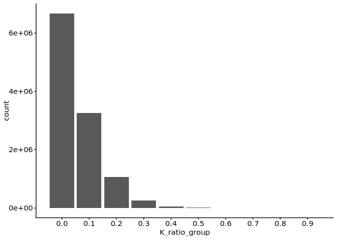
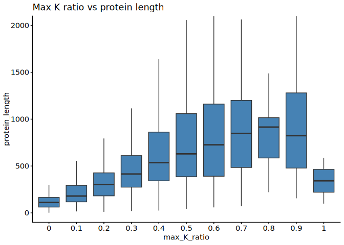
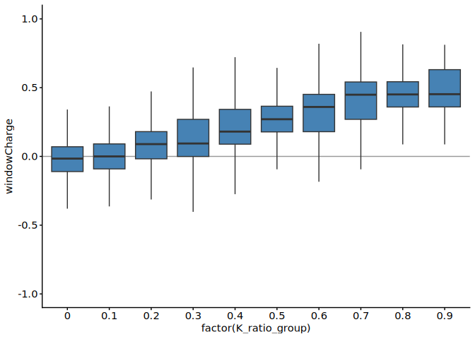

1-1. Proteins with lysine-rich domains
================
Pallavi Kesavan and Yoichiro Sugimoto
20 October, 2025

- [Environment setup](#environment-setup)
- [Set up environment](#set-up-environment)
- [Import data](#import-data)
- [Maximum K score and Protein
  Length](#maximum-k-score-and-protein-length)
- [Data Visualization - K score, Maximum K score and Protein
  Length](#data-visualization---k-score-maximum-k-score-and-protein-length)
- [RNA-Binding proteins](#rna-binding-proteins)
- [Data Visualization - RNA-Binding Proteins (Max K score versus
  RBP)](#data-visualization---rna-binding-proteins-max-k-score-versus-rbp)
- [Subcellular localisation](#subcellular-localisation)
- [Data Visualization - Subcellular
  Localisation](#data-visualization---subcellular-localisation)
- [Session information](#session-information)

# Environment setup

``` r
## Initialize renv (first time only) - re-installed 24.09.2025
# Creates project specific library and renv.lock file. 
# Use 'renv::init(filepath)' to create project library
# renv::init(
#        "/fast/AG_Sugimoto/home/users/pallavi/projects/20241111_PTMs_in_lysine_rich_domains/R"
#    )

## Define project directory 
project.dir <- file.path("/fast/AG_Sugimoto/home/users/pallavi/projects/20241111_PTMs_in_lysine_rich_domains")

## Use 'renv::snapshot', if there are updates in the current dependencies 
# renv::snapshot(file.path(project.dir, "R"))

## Restore packages
renv::restore(file.path(project.dir, "R"))
```

    ## The following required system packages are not installed:
    ## - pandoc  [required by knitr, rmarkdown]
    ## The R packages depending on these system packages may fail to install.
    ## 
    ## An administrator can install these packages with:
    ## - sudo apt install pandoc
    ## 
    ## - The library is already synchronized with the lockfile.

``` r
## Check package versions of current loaded library and lockfile 
renv::status
```

    ## function (project = NULL, ..., library = NULL, lockfile = NULL, 
    ##     sources = TRUE, cache = FALSE, dev = FALSE) 
    ## {
    ##     renv_scope_error_handler()
    ##     renv_dots_check(...)
    ##     renv_snapshot_auto_suppress_next()
    ##     renv_scope_options(renv.prompt.enabled = FALSE)
    ##     the$status_running <- TRUE
    ##     defer(the$status_running <- FALSE)
    ##     project <- renv_project_resolve(project)
    ##     renv_project_lock(project = project)
    ##     if (!renv_status_check_initialized(project, library, lockfile)) {
    ##         result <- list(library = list(Packages = named(list())), 
    ##             lockfile = list(Packages = named(list())), synchronized = FALSE)
    ##         return(invisible(result))
    ##     }
    ##     libpaths <- library %||% renv_libpaths_resolve()
    ##     lockpath <- lockfile %||% renv_paths_lockfile(project = project)
    ##     dependencies <- renv_snapshot_dependencies(project, dev = dev)
    ##     packages <- sort(union(dependencies, "renv"))
    ##     paths <- renv_package_dependencies(packages, libpaths = libpaths, 
    ##         project = project)
    ##     packages <- as.character(names(paths))
    ##     lockfile <- if (file.exists(lockpath)) 
    ##         renv_lockfile_read(lockpath)
    ##     else renv_lockfile_init(project = project)
    ##     library <- renv_lockfile_create(libpaths = libpaths, type = "all", 
    ##         prompt = FALSE, project = project)
    ##     ignored <- c(renv_project_ignored_packages(project), renv_packages_base(), 
    ##         if (renv_tests_running()) "renv")
    ##     packages <- setdiff(packages, ignored)
    ##     renv_lockfile_records(lockfile) <- omit(renv_lockfile_records(lockfile), 
    ##         ignored)
    ##     renv_lockfile_records(library) <- omit(renv_lockfile_records(library), 
    ##         ignored)
    ##     synchronized <- all(renv_status_check_consistent(lockfile, 
    ##         library, packages), renv_status_check_synchronized(lockfile, 
    ##         library), renv_status_check_version(lockfile))
    ##     if (sources) {
    ##         synchronized <- synchronized && renv_status_check_unknown_sources(project, 
    ##             lockfile)
    ##     }
    ##     if (cache) 
    ##         renv_status_check_cache(project)
    ##     if (synchronized) 
    ##         writef("No issues found -- the project is in a consistent state.")
    ##     else writef("See `?renv::status` for advice on resolving these issues.")
    ##     result <- list(library = library, lockfile = lockfile, synchronized = synchronized)
    ##     invisible(result)
    ## }
    ## <bytecode: 0x57ca8b73f5f0>
    ## <environment: namespace:renv>

``` r
## Load all R scripts from the 'functions' folder into the current session
temp <- sapply(list.files(file.path(project.dir, "R/functions"), pattern="*.R", full.names = TRUE), source)
```

    ## 
    ## Attaching package: 'dplyr'

    ## The following objects are masked from 'package:stats':
    ## 
    ##     filter, lag

    ## The following objects are masked from 'package:base':
    ## 
    ##     intersect, setdiff, setequal, union

    ## 
    ## Attaching package: 'data.table'

    ## The following objects are masked from 'package:dplyr':
    ## 
    ##     between, first, last

    ## Loading required package: BiocGenerics

    ## Loading required package: generics

    ## 
    ## Attaching package: 'generics'

    ## The following object is masked from 'package:dplyr':
    ## 
    ##     explain

    ## The following objects are masked from 'package:base':
    ## 
    ##     as.difftime, as.factor, as.ordered, intersect, is.element, setdiff,
    ##     setequal, union

    ## 
    ## Attaching package: 'BiocGenerics'

    ## The following object is masked from 'package:dplyr':
    ## 
    ##     combine

    ## The following objects are masked from 'package:stats':
    ## 
    ##     IQR, mad, sd, var, xtabs

    ## The following objects are masked from 'package:base':
    ## 
    ##     anyDuplicated, aperm, append, as.data.frame, basename, cbind,
    ##     colnames, dirname, do.call, duplicated, eval, evalq, Filter, Find,
    ##     get, grep, grepl, is.unsorted, lapply, Map, mapply, match, mget,
    ##     order, paste, pmax, pmax.int, pmin, pmin.int, Position, rank,
    ##     rbind, Reduce, rownames, sapply, saveRDS, table, tapply, unique,
    ##     unsplit, which.max, which.min

    ## Loading required package: S4Vectors

    ## Loading required package: stats4

    ## 
    ## Attaching package: 'S4Vectors'

    ## The following objects are masked from 'package:data.table':
    ## 
    ##     first, second

    ## The following objects are masked from 'package:dplyr':
    ## 
    ##     first, rename

    ## The following object is masked from 'package:utils':
    ## 
    ##     findMatches

    ## The following objects are masked from 'package:base':
    ## 
    ##     expand.grid, I, unname

    ## Loading required package: IRanges

    ## 
    ## Attaching package: 'IRanges'

    ## The following object is masked from 'package:data.table':
    ## 
    ##     shift

    ## The following objects are masked from 'package:dplyr':
    ## 
    ##     collapse, desc, slice

    ## Loading required package: XVector

    ## Loading required package: GenomeInfoDb

    ## 
    ## Attaching package: 'Biostrings'

    ## The following object is masked from 'package:base':
    ## 
    ##     strsplit

# Set up environment

``` r
## Define paths to directory
data.dir <- file.path(project.dir, "data")
results.dir <- file.path(project.dir, "results")

#Create p1 results directory
p1_K_rich_domains <- file.path(results.dir, "p1_K_rich_domains")
dir.create(p1_K_rich_domains, showWarnings = FALSE, recursive = TRUE)
```

# Import data

``` r
## Load data into environment 
protein.feature.dt <- fread(file.path(data.dir, "PNAS2022/all_protein_feature_per_position.csv"))

## Load library  
library("org.Hs.eg.db")
```

    ## Loading required package: AnnotationDbi

    ## Loading required package: Biobase

    ## Welcome to Bioconductor
    ## 
    ##     Vignettes contain introductory material; view with
    ##     'browseVignettes()'. To cite Bioconductor, see
    ##     'citation("Biobase")', and for packages 'citation("pkgname")'.

    ## 
    ## Attaching package: 'AnnotationDbi'

    ## The following object is masked from 'package:dplyr':
    ## 
    ##     select

    ## 

``` r
## Convert gene id and names
# Map UniProt IDs to gene symbols and ENSEMBL IDs
gene.id.dt <- select(
    org.Hs.eg.db,
    keys = protein.feature.dt[, unique(uniprot_id)],
    columns = c("SYMBOL","ENSEMBL"),
    keytype = "UNIPROT"
) %>%
    data.table
```

    ## 'select()' returned 1:many mapping between keys and columns

``` r
# Rename columns 
setnames(
    gene.id.dt,
    old = c("UNIPROT", "SYMBOL","ENSEMBL"),
    new = c("uniprot_id", "gene_name", "gene_id")
)

## Clean and organize gene mapping table
# Sort gene_id in ascending order, remove duplicate UniProt id and remove rows missing gene_id 
gene.id.dt <- gene.id.dt[order(gene_id)][!duplicated(uniprot_id)][!is.na(gene_id)]

# Rename data file and save to directory 
fwrite(gene.id.dt, file.path(results.dir, "p1_K_rich_domains","uniprot-ensembl.csv"))
```

# Maximum K score and Protein Length

``` r
#-----------------------------------
# Maximum K score and Protein Length
#-----------------------------------

## Compute maximum K_ratio and protein length for each protein
max.k.score.dt <- protein.feature.dt[ 
  , list(
    max_k_ratio = max(K_ratio), 
    protein_len = max(position)
    ), 
  by = list(Accession, uniprot_id)] 

## Merge gene annotations with protein summary data (max K_ratio, protein length)
# Merge tables using the UniProt ID as the key
max.k.score.dt <- merge(
    gene.id.dt,
    max.k.score.dt,
    all.y = TRUE,
    by = "uniprot_id"
)

# Create dataset with max k score 
fwrite(max.k.score.dt, file.path(results.dir, "p1_K_rich_domains", "max-k-score-per-protein.csv")) 
```

# Data Visualization - K score, Maximum K score and Protein Length

``` r
#---------------------------------------------------------
# Data Visualization - K score, Maximum K score and Protein Length
#---------------------------------------------------------

## K_ratio distribution 
# Count how many proteins have each K_ratio value
protein.feature.dt[, table(K_ratio)] 
```

    ## K_ratio
    ##       0     0.1     0.2     0.3     0.4     0.5     0.6     0.7     0.8     0.9 
    ## 6672182 3249314 1066633  255694   52006   11627    2951     979     322      54 
    ##       1 
    ##       2

``` r
# Create a new column `K_ratio_group` based on the K_ratio
protein.feature.dt[, K_ratio_group := case_when(
  K_ratio >= 0.9 ~ 0.9, #If K_ratio is 0.9 or higher, assign value 0.9
  TRUE ~ K_ratio #If K_ratio is lower than 0.9, then assign original K_ratio value
)]

# Plot - The number of proteins per K score
ggplot(
    protein.feature.dt,
    aes(
        x = K_ratio_group
    )
) +
    geom_bar() +
    scale_x_continuous(breaks=seq(0, 1, 0.1))
```

<!-- -->

``` r
# Plot - The number of proteins per max K score
ggplot(
    max.k.score.dt,
    aes(
        x = max_k_ratio
    )
) +
    geom_bar() +
    scale_x_continuous(breaks=seq(0, 1, 0.1)) + 
  labs(x = "max_k_ratio", y = "number of protein_count", title = "Number of proteins per max K score")
```

<!-- -->

``` r
# Plot - Max K ratio vs protein length
ggplot(
  max.k.score.dt,
  aes(
    y = protein_len,
    x = factor(max_k_ratio)
  )
) + geom_boxplot(fill = "steelblue", outlier.shape = NA) +
  labs(x = "max_K_ratio", y = "protein_length", title = "Max K ratio vs protein length") +
  coord_cartesian(ylim = c(0, 2000))
```

<!-- -->

``` r
# Plot - K_score of disordered regions of proteins 
# This plot indicates K score depending on the level of protein disorderliness

ggplot(
  protein.feature.dt,
  aes(
    x = factor(K_ratio_group),
    y = IUPRED2
  )
) + 
  geom_boxplot(fill = "steelblue", outlier.shape = NA)
```

<!-- -->

``` r
## Charge
ggplot(
  protein.feature.dt,
  aes(
    x = factor(K_ratio_group),
    y = windowCharge
  )
) + 
  geom_hline(yintercept = 0, color = "gray60") +
  geom_boxplot(fill = "steelblue", outlier.shape = NA)
```

    ## Warning: Removed 211124 rows containing non-finite outside the scale range
    ## (`stat_boxplot()`).

<!-- -->

# RNA-Binding proteins

``` r
#---------------------------
# RNA-Binding Proteins (RBP)
#---------------------------

# Load data into environment 
rbp.dt <- readxl::read_excel(file.path(data.dir, "20241113_RBPbase_Hs_DescriptiveID.xlsx")) %>%
  data.table()
```

    ## Warning: Expecting logical in EE3272 / R3272C135: got 'C56G2.7'

    ## Warning: Expecting logical in EF3272 / R3272C136: got 'C56G2.7'

    ## Warning: Expecting logical in EG3272 / R3272C137: got 'YES'

    ## Warning: Expecting logical in EH3272 / R3272C138: got 'no'

    ## Warning: Expecting logical in EI3272 / R3272C139: got 'no'

    ## Warning: Expecting logical in EJ3272 / R3272C140: got 'no'

    ## Warning: Expecting logical in EE3440 / R3440C135: got
    ## 'ZK757.3|C16C10.3|R06C7.1'

    ## Warning: Expecting logical in EF3440 / R3440C136: got
    ## 'ZK757.3|C16C10.3|R06C7.1'

    ## Warning: Expecting logical in EG3440 / R3440C137: got 'YES'

    ## Warning: Expecting logical in EH3440 / R3440C138: got 'no'

    ## Warning: Expecting logical in EI3440 / R3440C139: got 'no'

    ## Warning: Expecting logical in EJ3440 / R3440C140: got 'no'

    ## Warning: Expecting logical in EE3441 / R3441C135: got
    ## 'ZK757.3|C16C10.3|R06C7.1'

    ## Warning: Expecting logical in EF3441 / R3441C136: got
    ## 'ZK757.3|C16C10.3|R06C7.1'

    ## Warning: Expecting logical in EG3441 / R3441C137: got 'YES'

    ## Warning: Expecting logical in EH3441 / R3441C138: got 'no'

    ## Warning: Expecting logical in EI3441 / R3441C139: got 'no'

    ## Warning: Expecting logical in EJ3441 / R3441C140: got 'no'

    ## Warning: Expecting logical in EE3442 / R3442C135: got
    ## 'ZK757.3|C16C10.3|R06C7.1'

    ## Warning: Expecting logical in EF3442 / R3442C136: got
    ## 'ZK757.3|C16C10.3|R06C7.1'

    ## Warning: Expecting logical in EG3442 / R3442C137: got 'YES'

    ## Warning: Expecting logical in EH3442 / R3442C138: got 'no'

    ## Warning: Expecting logical in EI3442 / R3442C139: got 'no'

    ## Warning: Expecting logical in EJ3442 / R3442C140: got 'no'

    ## Warning: Expecting logical in EE3443 / R3443C135: got
    ## 'ZK757.3|C16C10.3|R06C7.1'

    ## Warning: Expecting logical in EF3443 / R3443C136: got
    ## 'ZK757.3|C16C10.3|R06C7.1'

    ## Warning: Expecting logical in EG3443 / R3443C137: got 'YES'

    ## Warning: Expecting logical in EH3443 / R3443C138: got 'no'

    ## Warning: Expecting logical in EI3443 / R3443C139: got 'no'

    ## Warning: Expecting logical in EJ3443 / R3443C140: got 'no'

    ## Warning: Expecting logical in EE3542 / R3542C135: got 'C56G2.1'

    ## Warning: Expecting logical in EF3542 / R3542C136: got 'C56G2.1'

    ## Warning: Expecting logical in EG3542 / R3542C137: got 'YES'

    ## Warning: Expecting logical in EH3542 / R3542C138: got 'no'

    ## Warning: Expecting logical in EI3542 / R3542C139: got 'no'

    ## Warning: Expecting logical in EJ3542 / R3542C140: got 'no'

    ## Warning: Expecting logical in EE3596 / R3596C135: got
    ## 'E01H11.1|C12D8.10|C54G4.1|W10G6.2'

    ## Warning: Expecting logical in EF3596 / R3596C136: got
    ## 'E01H11.1|C12D8.10|C54G4.1|W10G6.2'

    ## Warning: Expecting logical in EG3596 / R3596C137: got 'YES'

    ## Warning: Expecting logical in EH3596 / R3596C138: got 'no'

    ## Warning: Expecting logical in EI3596 / R3596C139: got 'no'

    ## Warning: Expecting logical in EJ3596 / R3596C140: got 'no'

    ## Warning: Expecting logical in EE3598 / R3598C135: got
    ## 'E01H11.1|C12D8.10|C54G4.1|W10G6.2'

    ## Warning: Expecting logical in EF3598 / R3598C136: got
    ## 'E01H11.1|C12D8.10|C54G4.1|W10G6.2'

    ## Warning: Expecting logical in EG3598 / R3598C137: got 'YES'

    ## Warning: Expecting logical in EH3598 / R3598C138: got 'no'

    ## Warning: Expecting logical in EI3598 / R3598C139: got 'no'

    ## Warning: Expecting logical in EJ3598 / R3598C140: got 'no'

    ## Warning: Expecting logical in EE3599 / R3599C135: got
    ## 'E01H11.1|C12D8.10|C54G4.1|W10G6.2'

    ## Warning: Expecting logical in EF3599 / R3599C136: got
    ## 'E01H11.1|C12D8.10|C54G4.1|W10G6.2'

    ## Warning: Expecting logical in EG3599 / R3599C137: got 'YES'

    ## Warning: Expecting logical in EH3599 / R3599C138: got 'no'

    ## Warning: Expecting logical in EI3599 / R3599C139: got 'no'

    ## Warning: Expecting logical in EJ3599 / R3599C140: got 'no'

    ## Warning: Expecting logical in EE3773 / R3773C135: got 'F13D12.4a'

    ## Warning: Expecting logical in EF3773 / R3773C136: got 'F13D12.4a'

    ## Warning: Expecting logical in EG3773 / R3773C137: got 'YES'

    ## Warning: Expecting logical in EH3773 / R3773C138: got 'no'

    ## Warning: Expecting logical in EI3773 / R3773C139: got 'no'

    ## Warning: Expecting logical in EJ3773 / R3773C140: got 'no'

    ## Warning: Expecting logical in EE3858 / R3858C135: got 'C37C3.6'

    ## Warning: Expecting logical in EF3858 / R3858C136: got 'C37C3.6'

    ## Warning: Expecting logical in EG3858 / R3858C137: got 'YES'

    ## Warning: Expecting logical in EH3858 / R3858C138: got 'no'

    ## Warning: Expecting logical in EI3858 / R3858C139: got 'no'

    ## Warning: Expecting logical in EJ3858 / R3858C140: got 'no'

    ## Warning: Expecting logical in EE4046 / R4046C135: got 'K06H7.3'

    ## Warning: Expecting logical in EF4046 / R4046C136: got 'K06H7.3'

    ## Warning: Expecting logical in EG4046 / R4046C137: got 'YES'

    ## Warning: Expecting logical in EH4046 / R4046C138: got 'no'

    ## Warning: Expecting logical in EI4046 / R4046C139: got 'no'

    ## Warning: Expecting logical in EJ4046 / R4046C140: got 'no'

    ## Warning: Expecting logical in EE4417 / R4417C135: got 'K11D2.3'

    ## Warning: Expecting logical in EF4417 / R4417C136: got 'K11D2.3'

    ## Warning: Expecting logical in EG4417 / R4417C137: got 'YES'

    ## Warning: Expecting logical in EH4417 / R4417C138: got 'no'

    ## Warning: Expecting logical in EI4417 / R4417C139: got 'no'

    ## Warning: Expecting logical in EJ4417 / R4417C140: got 'no'

    ## Warning: Expecting logical in EE4418 / R4418C135: got 'K11D2.3'

    ## Warning: Expecting logical in EF4418 / R4418C136: got 'K11D2.3'

    ## Warning: Expecting logical in EG4418 / R4418C137: got 'YES'

    ## Warning: Expecting logical in EH4418 / R4418C138: got 'no'

    ## Warning: Expecting logical in EI4418 / R4418C139: got 'no'

    ## Warning: Expecting logical in EJ4418 / R4418C140: got 'no'

    ## Warning: Expecting logical in EE4426 / R4426C135: got 'K11D2.3'

    ## Warning: Expecting logical in EF4426 / R4426C136: got 'K11D2.3'

    ## Warning: Expecting logical in EG4426 / R4426C137: got 'YES'

    ## Warning: Expecting logical in EH4426 / R4426C138: got 'no'

    ## Warning: Expecting logical in EI4426 / R4426C139: got 'no'

    ## Warning: Expecting logical in EJ4426 / R4426C140: got 'no'

    ## Warning: Expecting logical in EE4438 / R4438C135: got 'K11D2.3'

    ## Warning: Expecting logical in EF4438 / R4438C136: got 'K11D2.3'

    ## Warning: Expecting logical in EG4438 / R4438C137: got 'YES'

    ## Warning: Expecting logical in EH4438 / R4438C138: got 'no'

    ## Warning: Expecting logical in EI4438 / R4438C139: got 'no'

    ## Warning: Expecting logical in EJ4438 / R4438C140: got 'no'

    ## Warning: Expecting logical in EE4441 / R4441C135: got 'K11D2.3'

    ## Warning: Expecting logical in EF4441 / R4441C136: got 'K11D2.3'

    ## Warning: Expecting logical in EG4441 / R4441C137: got 'YES'

    ## Warning: Expecting logical in EH4441 / R4441C138: got 'no'

    ## Warning: Expecting logical in EI4441 / R4441C139: got 'no'

    ## Warning: Expecting logical in EJ4441 / R4441C140: got 'no'

    ## Warning: Expecting logical in EE4480 / R4480C135: got
    ## 'C42D8.2a|C04F6.1|F59D8.2|K07H8.6|K09F5.2|F59D8.1'

    ## Warning: Expecting logical in EF4480 / R4480C136: got
    ## 'C42D8.2a|C04F6.1|F59D8.2|K07H8.6|K09F5.2|F59D8.1'

    ## Warning: Expecting logical in EG4480 / R4480C137: got 'YES'

    ## Warning: Expecting logical in EH4480 / R4480C138: got 'no'

    ## Warning: Expecting logical in EI4480 / R4480C139: got 'no'

    ## Warning: Expecting logical in EJ4480 / R4480C140: got 'no'

    ## Warning: Expecting logical in EE4558 / R4558C135: got 'C13B9.3'

    ## Warning: Expecting logical in EF4558 / R4558C136: got 'C13B9.3'

    ## Warning: Expecting logical in EG4558 / R4558C137: got 'YES'

    ## Warning: Expecting logical in EH4558 / R4558C138: got 'no'

    ## Warning: Expecting logical in EI4558 / R4558C139: got 'no'

    ## Warning: Expecting logical in EJ4558 / R4558C140: got 'no'

    ## Warning: Expecting logical in EE4996 / R4996C135: got 'C17E4.9|F55F3.3'

    ## Warning: Expecting logical in EF4996 / R4996C136: got 'C17E4.9|F55F3.3'

    ## Warning: Expecting logical in EG4996 / R4996C137: got 'YES'

    ## Warning: Expecting logical in EH4996 / R4996C138: got 'no'

    ## Warning: Expecting logical in EI4996 / R4996C139: got 'no'

    ## Warning: Expecting logical in EJ4996 / R4996C140: got 'no'

    ## Warning: Expecting logical in EE4998 / R4998C135: got 'C17E4.9|F55F3.3'

    ## Warning: Expecting logical in EF4998 / R4998C136: got 'C17E4.9|F55F3.3'

    ## Warning: Expecting logical in EG4998 / R4998C137: got 'YES'

    ## Warning: Expecting logical in EH4998 / R4998C138: got 'no'

    ## Warning: Expecting logical in EI4998 / R4998C139: got 'no'

    ## Warning: Expecting logical in EJ4998 / R4998C140: got 'no'

    ## Warning: Expecting logical in EE4999 / R4999C135: got 'C17E4.9|F55F3.3'

    ## Warning: Expecting logical in EF4999 / R4999C136: got 'C17E4.9|F55F3.3'

    ## Warning: Expecting logical in EG4999 / R4999C137: got 'YES'

    ## Warning: Expecting logical in EH4999 / R4999C138: got 'no'

    ## Warning: Expecting logical in EI4999 / R4999C139: got 'no'

    ## Warning: Expecting logical in EJ4999 / R4999C140: got 'no'

    ## Warning: Expecting logical in EE5002 / R5002C135: got 'C17E4.9|F55F3.3'

    ## Warning: Expecting logical in EF5002 / R5002C136: got 'C17E4.9|F55F3.3'

    ## Warning: Expecting logical in EG5002 / R5002C137: got 'YES'

    ## Warning: Expecting logical in EH5002 / R5002C138: got 'no'

    ## Warning: Expecting logical in EI5002 / R5002C139: got 'no'

    ## Warning: Expecting logical in EJ5002 / R5002C140: got 'no'

    ## Warning: Expecting logical in EE5017 / R5017C135: got 'C17E4.9|F55F3.3'

    ## Warning: Expecting logical in EF5017 / R5017C136: got 'C17E4.9|F55F3.3'

    ## Warning: Expecting logical in EG5017 / R5017C137: got 'YES'

    ## Warning: Expecting logical in EH5017 / R5017C138: got 'no'

    ## Warning: Expecting logical in EI5017 / R5017C139: got 'no'

    ## Warning: Expecting logical in EJ5017 / R5017C140: got 'no'

    ## Warning: Expecting logical in EE5062 / R5062C135: got 'R53.4'

    ## Warning: Expecting logical in EF5062 / R5062C136: got 'R53.4'

    ## Warning: Expecting logical in EG5062 / R5062C137: got 'YES'

    ## Warning: Expecting logical in EH5062 / R5062C138: got 'no'

    ## Warning: Expecting logical in EI5062 / R5062C139: got 'no'

    ## Warning: Expecting logical in EJ5062 / R5062C140: got 'no'

    ## Warning: Expecting logical in EE5070 / R5070C135: got 'K07A12.3|C53B7.4'

    ## Warning: Expecting logical in EF5070 / R5070C136: got 'K07A12.3|C53B7.4'

    ## Warning: Expecting logical in EG5070 / R5070C137: got 'YES'

    ## Warning: Expecting logical in EH5070 / R5070C138: got 'no'

    ## Warning: Expecting logical in EI5070 / R5070C139: got 'no'

    ## Warning: Expecting logical in EJ5070 / R5070C140: got 'no'

    ## Warning: Expecting logical in EE5071 / R5071C135: got 'K07A12.3|C53B7.4'

    ## Warning: Expecting logical in EF5071 / R5071C136: got 'K07A12.3|C53B7.4'

    ## Warning: Expecting logical in EG5071 / R5071C137: got 'YES'

    ## Warning: Expecting logical in EH5071 / R5071C138: got 'no'

    ## Warning: Expecting logical in EI5071 / R5071C139: got 'no'

    ## Warning: Expecting logical in EJ5071 / R5071C140: got 'no'

    ## Warning: Expecting logical in EE5112 / R5112C135: got 'F46F11.5'

    ## Warning: Expecting logical in EF5112 / R5112C136: got 'F46F11.5'

    ## Warning: Expecting logical in EG5112 / R5112C137: got 'YES'

    ## Warning: Expecting logical in EH5112 / R5112C138: got 'no'

    ## Warning: Expecting logical in EI5112 / R5112C139: got 'no'

    ## Warning: Expecting logical in EJ5112 / R5112C140: got 'no'

    ## Warning: Expecting logical in EE5118 / R5118C135: got 'F46F11.5'

    ## Warning: Expecting logical in EF5118 / R5118C136: got 'F46F11.5'

    ## Warning: Expecting logical in EG5118 / R5118C137: got 'YES'

    ## Warning: Expecting logical in EH5118 / R5118C138: got 'no'

    ## Warning: Expecting logical in EI5118 / R5118C139: got 'no'

    ## Warning: Expecting logical in EJ5118 / R5118C140: got 'no'

    ## Warning: Expecting logical in EE5119 / R5119C135: got 'F46F11.5'

    ## Warning: Expecting logical in EF5119 / R5119C136: got 'F46F11.5'

    ## Warning: Expecting logical in EG5119 / R5119C137: got 'YES'

    ## Warning: Expecting logical in EH5119 / R5119C138: got 'no'

    ## Warning: Expecting logical in EI5119 / R5119C139: got 'no'

    ## Warning: Expecting logical in EJ5119 / R5119C140: got 'no'

    ## Warning: Expecting logical in EE5120 / R5120C135: got 'F46F11.5'

    ## Warning: Expecting logical in EF5120 / R5120C136: got 'F46F11.5'

    ## Warning: Expecting logical in EG5120 / R5120C137: got 'YES'

    ## Warning: Expecting logical in EH5120 / R5120C138: got 'no'

    ## Warning: Expecting logical in EI5120 / R5120C139: got 'no'

    ## Warning: Expecting logical in EJ5120 / R5120C140: got 'no'

    ## Warning: Expecting logical in EE5245 / R5245C135: got 'F21F8.7|H22K11.1'

    ## Warning: Expecting logical in EF5245 / R5245C136: got 'F21F8.7|H22K11.1'

    ## Warning: Expecting logical in EG5245 / R5245C137: got 'YES'

    ## Warning: Expecting logical in EH5245 / R5245C138: got 'no'

    ## Warning: Expecting logical in EI5245 / R5245C139: got 'no'

    ## Warning: Expecting logical in EJ5245 / R5245C140: got 'no'

    ## Warning: Expecting logical in EE5247 / R5247C135: got 'F21F8.7|H22K11.1'

    ## Warning: Expecting logical in EF5247 / R5247C136: got 'F21F8.7|H22K11.1'

    ## Warning: Expecting logical in EG5247 / R5247C137: got 'YES'

    ## Warning: Expecting logical in EH5247 / R5247C138: got 'no'

    ## Warning: Expecting logical in EI5247 / R5247C139: got 'no'

    ## Warning: Expecting logical in EJ5247 / R5247C140: got 'no'

    ## Warning: Expecting logical in EE5285 / R5285C135: got 'C08B11.7'

    ## Warning: Expecting logical in EF5285 / R5285C136: got 'C08B11.7'

    ## Warning: Expecting logical in EG5285 / R5285C137: got 'YES'

    ## Warning: Expecting logical in EH5285 / R5285C138: got 'no'

    ## Warning: Expecting logical in EI5285 / R5285C139: got 'no'

    ## Warning: Expecting logical in EJ5285 / R5285C140: got 'no'

    ## Warning: Expecting logical in EE5336 / R5336C135: got 'ZK1127.4'

    ## Warning: Expecting logical in EF5336 / R5336C136: got 'ZK1127.4'

    ## Warning: Expecting logical in EG5336 / R5336C137: got 'YES'

    ## Warning: Expecting logical in EH5336 / R5336C138: got 'no'

    ## Warning: Expecting logical in EI5336 / R5336C139: got 'no'

    ## Warning: Expecting logical in EJ5336 / R5336C140: got 'no'

    ## Warning: Expecting logical in EE5601 / R5601C135: got 'Y48B6A.1'

    ## Warning: Expecting logical in EF5601 / R5601C136: got 'Y48B6A.1'

    ## Warning: Expecting logical in EG5601 / R5601C137: got 'YES'

    ## Warning: Expecting logical in EH5601 / R5601C138: got 'no'

    ## Warning: Expecting logical in EI5601 / R5601C139: got 'no'

    ## Warning: Expecting logical in EJ5601 / R5601C140: got 'no'

    ## Warning: Expecting logical in EE5691 / R5691C135: got 'T01C8.1'

    ## Warning: Expecting logical in EF5691 / R5691C136: got 'T01C8.1'

    ## Warning: Expecting logical in EG5691 / R5691C137: got 'YES'

    ## Warning: Expecting logical in EH5691 / R5691C138: got 'no'

    ## Warning: Expecting logical in EI5691 / R5691C139: got 'no'

    ## Warning: Expecting logical in EJ5691 / R5691C140: got 'no'

    ## Warning: Expecting logical in EE5692 / R5692C135: got 'T01C8.1'

    ## Warning: Expecting logical in EF5692 / R5692C136: got 'T01C8.1'

    ## Warning: Expecting logical in EG5692 / R5692C137: got 'YES'

    ## Warning: Expecting logical in EH5692 / R5692C138: got 'no'

    ## Warning: Expecting logical in EI5692 / R5692C139: got 'no'

    ## Warning: Expecting logical in EJ5692 / R5692C140: got 'no'

    ## Warning: Expecting logical in EE5739 / R5739C135: got 'C56C10.8'

    ## Warning: Expecting logical in EF5739 / R5739C136: got 'C56C10.8'

    ## Warning: Expecting logical in EG5739 / R5739C137: got 'YES'

    ## Warning: Expecting logical in EH5739 / R5739C138: got 'no'

    ## Warning: Expecting logical in EI5739 / R5739C139: got 'no'

    ## Warning: Expecting logical in EJ5739 / R5739C140: got 'no'

    ## Warning: Expecting logical in EE5740 / R5740C135: got 'C56C10.8'

    ## Warning: Expecting logical in EF5740 / R5740C136: got 'C56C10.8'

    ## Warning: Expecting logical in EG5740 / R5740C137: got 'YES'

    ## Warning: Expecting logical in EH5740 / R5740C138: got 'no'

    ## Warning: Expecting logical in EI5740 / R5740C139: got 'no'

    ## Warning: Expecting logical in EJ5740 / R5740C140: got 'no'

    ## Warning: Expecting logical in EE5898 / R5898C135: got 'T28F2.4a'

    ## Warning: Expecting logical in EF5898 / R5898C136: got 'T28F2.4a'

    ## Warning: Expecting logical in EG5898 / R5898C137: got 'YES'

    ## Warning: Expecting logical in EH5898 / R5898C138: got 'no'

    ## Warning: Expecting logical in EI5898 / R5898C139: got 'no'

    ## Warning: Expecting logical in EJ5898 / R5898C140: got 'no'

    ## Warning: Expecting logical in EE6075 / R6075C135: got 'F59A2.3'

    ## Warning: Expecting logical in EF6075 / R6075C136: got 'F59A2.3'

    ## Warning: Expecting logical in EG6075 / R6075C137: got 'YES'

    ## Warning: Expecting logical in EH6075 / R6075C138: got 'no'

    ## Warning: Expecting logical in EI6075 / R6075C139: got 'no'

    ## Warning: Expecting logical in EJ6075 / R6075C140: got 'no'

    ## Warning: Expecting logical in EE6178 / R6178C135: got 'F37B4.7'

    ## Warning: Expecting logical in EF6178 / R6178C136: got 'F37B4.7'

    ## Warning: Expecting logical in EG6178 / R6178C137: got 'YES'

    ## Warning: Expecting logical in EH6178 / R6178C138: got 'no'

    ## Warning: Expecting logical in EI6178 / R6178C139: got 'no'

    ## Warning: Expecting logical in EJ6178 / R6178C140: got 'no'

    ## Warning: Expecting logical in EE6481 / R6481C135: got 'Y38A10A.5'

    ## Warning: Expecting logical in EF6481 / R6481C136: got 'Y38A10A.5'

    ## Warning: Expecting logical in EG6481 / R6481C137: got 'YES'

    ## Warning: Expecting logical in EH6481 / R6481C138: got 'no'

    ## Warning: Expecting logical in EI6481 / R6481C139: got 'no'

    ## Warning: Expecting logical in EJ6481 / R6481C140: got 'no'

    ## Warning: Expecting logical in EE6482 / R6482C135: got 'Y38A10A.5'

    ## Warning: Expecting logical in EF6482 / R6482C136: got 'Y38A10A.5'

    ## Warning: Expecting logical in EG6482 / R6482C137: got 'YES'

    ## Warning: Expecting logical in EH6482 / R6482C138: got 'no'

    ## Warning: Expecting logical in EI6482 / R6482C139: got 'no'

    ## Warning: Expecting logical in EJ6482 / R6482C140: got 'no'

    ## Warning: Expecting logical in EE6511 / R6511C135: got 'ZK632.6'

    ## Warning: Expecting logical in EF6511 / R6511C136: got 'ZK632.6'

    ## Warning: Expecting logical in EG6511 / R6511C137: got 'YES'

    ## Warning: Expecting logical in EH6511 / R6511C138: got 'no'

    ## Warning: Expecting logical in EI6511 / R6511C139: got 'no'

    ## Warning: Expecting logical in EJ6511 / R6511C140: got 'no'

    ## Warning: Expecting logical in EE6970 / R6970C135: got 'F01F1.8a'

    ## Warning: Expecting logical in EF6970 / R6970C136: got 'F01F1.8a'

    ## Warning: Expecting logical in EG6970 / R6970C137: got 'YES'

    ## Warning: Expecting logical in EH6970 / R6970C138: got 'no'

    ## Warning: Expecting logical in EI6970 / R6970C139: got 'no'

    ## Warning: Expecting logical in EJ6970 / R6970C140: got 'no'

    ## Warning: Expecting logical in EE6971 / R6971C135: got 'F01F1.8a'

    ## Warning: Expecting logical in EF6971 / R6971C136: got 'F01F1.8a'

    ## Warning: Expecting logical in EG6971 / R6971C137: got 'YES'

    ## Warning: Expecting logical in EH6971 / R6971C138: got 'no'

    ## Warning: Expecting logical in EI6971 / R6971C139: got 'no'

    ## Warning: Expecting logical in EJ6971 / R6971C140: got 'no'

    ## Warning: Expecting logical in EE6979 / R6979C135: got 'Y55F3AR.3'

    ## Warning: Expecting logical in EF6979 / R6979C136: got 'Y55F3AR.3'

    ## Warning: Expecting logical in EG6979 / R6979C137: got 'YES'

    ## Warning: Expecting logical in EH6979 / R6979C138: got 'no'

    ## Warning: Expecting logical in EI6979 / R6979C139: got 'no'

    ## Warning: Expecting logical in EJ6979 / R6979C140: got 'no'

    ## Warning: Expecting logical in EE6981 / R6981C135: got 'Y55F3AR.3'

    ## Warning: Expecting logical in EF6981 / R6981C136: got 'Y55F3AR.3'

    ## Warning: Expecting logical in EG6981 / R6981C137: got 'YES'

    ## Warning: Expecting logical in EH6981 / R6981C138: got 'no'

    ## Warning: Expecting logical in EI6981 / R6981C139: got 'no'

    ## Warning: Expecting logical in EJ6981 / R6981C140: got 'no'

    ## Warning: Expecting logical in EE7060 / R7060C135: got 'C03B1.12'

    ## Warning: Expecting logical in EF7060 / R7060C136: got 'C03B1.12'

    ## Warning: Expecting logical in EG7060 / R7060C137: got 'YES'

    ## Warning: Expecting logical in EH7060 / R7060C138: got 'no'

    ## Warning: Expecting logical in EI7060 / R7060C139: got 'no'

    ## Warning: Expecting logical in EJ7060 / R7060C140: got 'no'

    ## Warning: Expecting logical in EE7185 / R7185C135: got 'T05G5.3'

    ## Warning: Expecting logical in EF7185 / R7185C136: got 'T05G5.3'

    ## Warning: Expecting logical in EG7185 / R7185C137: got 'YES'

    ## Warning: Expecting logical in EH7185 / R7185C138: got 'no'

    ## Warning: Expecting logical in EI7185 / R7185C139: got 'no'

    ## Warning: Expecting logical in EJ7185 / R7185C140: got 'no'

    ## Warning: Expecting logical in EE7191 / R7191C135: got 'T05G5.3'

    ## Warning: Expecting logical in EF7191 / R7191C136: got 'T05G5.3'

    ## Warning: Expecting logical in EG7191 / R7191C137: got 'YES'

    ## Warning: Expecting logical in EH7191 / R7191C138: got 'no'

    ## Warning: Expecting logical in EI7191 / R7191C139: got 'no'

    ## Warning: Expecting logical in EJ7191 / R7191C140: got 'no'

    ## Warning: Expecting logical in EE7192 / R7192C135: got 'T05G5.3'

    ## Warning: Expecting logical in EF7192 / R7192C136: got 'T05G5.3'

    ## Warning: Expecting logical in EG7192 / R7192C137: got 'YES'

    ## Warning: Expecting logical in EH7192 / R7192C138: got 'no'

    ## Warning: Expecting logical in EI7192 / R7192C139: got 'no'

    ## Warning: Expecting logical in EJ7192 / R7192C140: got 'no'

    ## Warning: Expecting logical in EE7193 / R7193C135: got 'T05G5.3'

    ## Warning: Expecting logical in EF7193 / R7193C136: got 'T05G5.3'

    ## Warning: Expecting logical in EG7193 / R7193C137: got 'YES'

    ## Warning: Expecting logical in EH7193 / R7193C138: got 'no'

    ## Warning: Expecting logical in EI7193 / R7193C139: got 'no'

    ## Warning: Expecting logical in EJ7193 / R7193C140: got 'no'

    ## Warning: Expecting logical in EE7194 / R7194C135: got 'T05G5.3'

    ## Warning: Expecting logical in EF7194 / R7194C136: got 'T05G5.3'

    ## Warning: Expecting logical in EG7194 / R7194C137: got 'YES'

    ## Warning: Expecting logical in EH7194 / R7194C138: got 'no'

    ## Warning: Expecting logical in EI7194 / R7194C139: got 'no'

    ## Warning: Expecting logical in EJ7194 / R7194C140: got 'no'

    ## Warning: Expecting logical in EE7195 / R7195C135: got 'T05G5.3'

    ## Warning: Expecting logical in EF7195 / R7195C136: got 'T05G5.3'

    ## Warning: Expecting logical in EG7195 / R7195C137: got 'YES'

    ## Warning: Expecting logical in EH7195 / R7195C138: got 'no'

    ## Warning: Expecting logical in EI7195 / R7195C139: got 'no'

    ## Warning: Expecting logical in EJ7195 / R7195C140: got 'no'

    ## Warning: Expecting logical in EE7197 / R7197C135: got 'T05G5.3'

    ## Warning: Expecting logical in EF7197 / R7197C136: got 'T05G5.3'

    ## Warning: Expecting logical in EG7197 / R7197C137: got 'YES'

    ## Warning: Expecting logical in EH7197 / R7197C138: got 'no'

    ## Warning: Expecting logical in EI7197 / R7197C139: got 'no'

    ## Warning: Expecting logical in EJ7197 / R7197C140: got 'no'

    ## Warning: Expecting logical in EE7204 / R7204C135: got 'T05G5.3'

    ## Warning: Expecting logical in EF7204 / R7204C136: got 'T05G5.3'

    ## Warning: Expecting logical in EG7204 / R7204C137: got 'YES'

    ## Warning: Expecting logical in EH7204 / R7204C138: got 'no'

    ## Warning: Expecting logical in EI7204 / R7204C139: got 'no'

    ## Warning: Expecting logical in EJ7204 / R7204C140: got 'no'

    ## Warning: Expecting logical in EE7205 / R7205C135: got 'T05G5.3'

    ## Warning: Expecting logical in EF7205 / R7205C136: got 'T05G5.3'

    ## Warning: Expecting logical in EG7205 / R7205C137: got 'YES'

    ## Warning: Expecting logical in EH7205 / R7205C138: got 'no'

    ## Warning: Expecting logical in EI7205 / R7205C139: got 'no'

    ## Warning: Expecting logical in EJ7205 / R7205C140: got 'no'

    ## Warning: Expecting logical in EE7207 / R7207C135: got 'T05G5.3'

    ## Warning: Expecting logical in EF7207 / R7207C136: got 'T05G5.3'

    ## Warning: Expecting logical in EG7207 / R7207C137: got 'YES'

    ## Warning: Expecting logical in EH7207 / R7207C138: got 'no'

    ## Warning: Expecting logical in EI7207 / R7207C139: got 'no'

    ## Warning: Expecting logical in EJ7207 / R7207C140: got 'no'

    ## Warning: Expecting logical in EE7213 / R7213C135: got 'Y113G7B.16'

    ## Warning: Expecting logical in EF7213 / R7213C136: got 'Y113G7B.16'

    ## Warning: Expecting logical in EG7213 / R7213C137: got 'YES'

    ## Warning: Expecting logical in EH7213 / R7213C138: got 'no'

    ## Warning: Expecting logical in EI7213 / R7213C139: got 'no'

    ## Warning: Expecting logical in EJ7213 / R7213C140: got 'no'

    ## Warning: Expecting logical in EE7214 / R7214C135: got 'T05G5.3'

    ## Warning: Expecting logical in EF7214 / R7214C136: got 'T05G5.3'

    ## Warning: Expecting logical in EG7214 / R7214C137: got 'YES'

    ## Warning: Expecting logical in EH7214 / R7214C138: got 'no'

    ## Warning: Expecting logical in EI7214 / R7214C139: got 'no'

    ## Warning: Expecting logical in EJ7214 / R7214C140: got 'no'

    ## Warning: Expecting logical in EE7494 / R7494C135: got 'C38C3.5a'

    ## Warning: Expecting logical in EF7494 / R7494C136: got 'C38C3.5a'

    ## Warning: Expecting logical in EG7494 / R7494C137: got 'YES'

    ## Warning: Expecting logical in EH7494 / R7494C138: got 'no'

    ## Warning: Expecting logical in EI7494 / R7494C139: got 'no'

    ## Warning: Expecting logical in EJ7494 / R7494C140: got 'no'

    ## Warning: Expecting logical in EE7503 / R7503C135: got 'C38C3.5a'

    ## Warning: Expecting logical in EF7503 / R7503C136: got 'C38C3.5a'

    ## Warning: Expecting logical in EG7503 / R7503C137: got 'YES'

    ## Warning: Expecting logical in EH7503 / R7503C138: got 'no'

    ## Warning: Expecting logical in EI7503 / R7503C139: got 'no'

    ## Warning: Expecting logical in EJ7503 / R7503C140: got 'no'

    ## Warning: Expecting logical in EE7666 / R7666C135: got 'T01C8.1'

    ## Warning: Expecting logical in EF7666 / R7666C136: got 'T01C8.1'

    ## Warning: Expecting logical in EG7666 / R7666C137: got 'YES'

    ## Warning: Expecting logical in EH7666 / R7666C138: got 'no'

    ## Warning: Expecting logical in EI7666 / R7666C139: got 'no'

    ## Warning: Expecting logical in EJ7666 / R7666C140: got 'no'

    ## Warning: Expecting logical in EE7921 / R7921C135: got 'W09H1.6a|R07B1.10'

    ## Warning: Expecting logical in EF7921 / R7921C136: got 'W09H1.6a|R07B1.10'

    ## Warning: Expecting logical in EG7921 / R7921C137: got 'YES'

    ## Warning: Expecting logical in EH7921 / R7921C138: got 'no'

    ## Warning: Expecting logical in EI7921 / R7921C139: got 'no'

    ## Warning: Expecting logical in EJ7921 / R7921C140: got 'no'

    ## Warning: Expecting logical in EE7999 / R7999C135: got 'ZK632.6'

    ## Warning: Expecting logical in EF7999 / R7999C136: got 'ZK632.6'

    ## Warning: Expecting logical in EG7999 / R7999C137: got 'YES'

    ## Warning: Expecting logical in EH7999 / R7999C138: got 'no'

    ## Warning: Expecting logical in EI7999 / R7999C139: got 'no'

    ## Warning: Expecting logical in EJ7999 / R7999C140: got 'no'

    ## Warning: Expecting logical in EE8000 / R8000C135: got 'T20G5.1'

    ## Warning: Expecting logical in EF8000 / R8000C136: got 'T20G5.1'

    ## Warning: Expecting logical in EG8000 / R8000C137: got 'YES'

    ## Warning: Expecting logical in EH8000 / R8000C138: got 'no'

    ## Warning: Expecting logical in EI8000 / R8000C139: got 'no'

    ## Warning: Expecting logical in EJ8000 / R8000C140: got 'no'

    ## Warning: Expecting logical in EE8057 / R8057C135: got 'T20G5.1'

    ## Warning: Expecting logical in EF8057 / R8057C136: got 'T20G5.1'

    ## Warning: Expecting logical in EG8057 / R8057C137: got 'YES'

    ## Warning: Expecting logical in EH8057 / R8057C138: got 'no'

    ## Warning: Expecting logical in EI8057 / R8057C139: got 'no'

    ## Warning: Expecting logical in EJ8057 / R8057C140: got 'no'

    ## Warning: Expecting logical in EE8058 / R8058C135: got 'T20G5.1'

    ## Warning: Expecting logical in EF8058 / R8058C136: got 'T20G5.1'

    ## Warning: Expecting logical in EG8058 / R8058C137: got 'YES'

    ## Warning: Expecting logical in EH8058 / R8058C138: got 'no'

    ## Warning: Expecting logical in EI8058 / R8058C139: got 'no'

    ## Warning: Expecting logical in EJ8058 / R8058C140: got 'no'

    ## Warning: Expecting logical in EE8061 / R8061C135: got 'F55H2.6'

    ## Warning: Expecting logical in EF8061 / R8061C136: got 'F55H2.6'

    ## Warning: Expecting logical in EG8061 / R8061C137: got 'YES'

    ## Warning: Expecting logical in EH8061 / R8061C138: got 'no'

    ## Warning: Expecting logical in EI8061 / R8061C139: got 'no'

    ## Warning: Expecting logical in EJ8061 / R8061C140: got 'no'

    ## Warning: Expecting logical in EE8218 / R8218C135: got 'F27C1.8'

    ## Warning: Expecting logical in EF8218 / R8218C136: got 'F27C1.8'

    ## Warning: Expecting logical in EG8218 / R8218C137: got 'YES'

    ## Warning: Expecting logical in EH8218 / R8218C138: got 'no'

    ## Warning: Expecting logical in EI8218 / R8218C139: got 'no'

    ## Warning: Expecting logical in EJ8218 / R8218C140: got 'no'

    ## Warning: Expecting logical in EE8220 / R8220C135: got 'F27C1.8'

    ## Warning: Expecting logical in EF8220 / R8220C136: got 'F27C1.8'

    ## Warning: Expecting logical in EG8220 / R8220C137: got 'YES'

    ## Warning: Expecting logical in EH8220 / R8220C138: got 'no'

    ## Warning: Expecting logical in EI8220 / R8220C139: got 'no'

    ## Warning: Expecting logical in EJ8220 / R8220C140: got 'no'

    ## Warning: Expecting logical in EE8232 / R8232C135: got 'F27C1.8'

    ## Warning: Expecting logical in EF8232 / R8232C136: got 'F27C1.8'

    ## Warning: Expecting logical in EG8232 / R8232C137: got 'YES'

    ## Warning: Expecting logical in EH8232 / R8232C138: got 'no'

    ## Warning: Expecting logical in EI8232 / R8232C139: got 'no'

    ## Warning: Expecting logical in EJ8232 / R8232C140: got 'no'

    ## Warning: Expecting logical in EE8233 / R8233C135: got 'F27C1.8'

    ## Warning: Expecting logical in EF8233 / R8233C136: got 'F27C1.8'

    ## Warning: Expecting logical in EG8233 / R8233C137: got 'YES'

    ## Warning: Expecting logical in EH8233 / R8233C138: got 'no'

    ## Warning: Expecting logical in EI8233 / R8233C139: got 'no'

    ## Warning: Expecting logical in EJ8233 / R8233C140: got 'no'

    ## Warning: Expecting logical in EE8234 / R8234C135: got 'F27C1.8'

    ## Warning: Expecting logical in EF8234 / R8234C136: got 'F27C1.8'

    ## Warning: Expecting logical in EG8234 / R8234C137: got 'YES'

    ## Warning: Expecting logical in EH8234 / R8234C138: got 'no'

    ## Warning: Expecting logical in EI8234 / R8234C139: got 'no'

    ## Warning: Expecting logical in EJ8234 / R8234C140: got 'no'

    ## Warning: Expecting logical in EE8236 / R8236C135: got 'F27C1.8'

    ## Warning: Expecting logical in EF8236 / R8236C136: got 'F27C1.8'

    ## Warning: Expecting logical in EG8236 / R8236C137: got 'YES'

    ## Warning: Expecting logical in EH8236 / R8236C138: got 'no'

    ## Warning: Expecting logical in EI8236 / R8236C139: got 'no'

    ## Warning: Expecting logical in EJ8236 / R8236C140: got 'no'

    ## Warning: Expecting logical in EE8237 / R8237C135: got 'F27C1.8'

    ## Warning: Expecting logical in EF8237 / R8237C136: got 'F27C1.8'

    ## Warning: Expecting logical in EG8237 / R8237C137: got 'YES'

    ## Warning: Expecting logical in EH8237 / R8237C138: got 'no'

    ## Warning: Expecting logical in EI8237 / R8237C139: got 'no'

    ## Warning: Expecting logical in EJ8237 / R8237C140: got 'no'

    ## Warning: Expecting logical in EE8238 / R8238C135: got 'F27C1.8'

    ## Warning: Expecting logical in EF8238 / R8238C136: got 'F27C1.8'

    ## Warning: Expecting logical in EG8238 / R8238C137: got 'YES'

    ## Warning: Expecting logical in EH8238 / R8238C138: got 'no'

    ## Warning: Expecting logical in EI8238 / R8238C139: got 'no'

    ## Warning: Expecting logical in EJ8238 / R8238C140: got 'no'

    ## Warning: Expecting logical in EE8241 / R8241C135: got 'F27C1.8'

    ## Warning: Expecting logical in EF8241 / R8241C136: got 'F27C1.8'

    ## Warning: Expecting logical in EG8241 / R8241C137: got 'YES'

    ## Warning: Expecting logical in EH8241 / R8241C138: got 'no'

    ## Warning: Expecting logical in EI8241 / R8241C139: got 'no'

    ## Warning: Expecting logical in EJ8241 / R8241C140: got 'no'

    ## Warning: Expecting logical in EE8243 / R8243C135: got 'F27C1.8'

    ## Warning: Expecting logical in EF8243 / R8243C136: got 'F27C1.8'

    ## Warning: Expecting logical in EG8243 / R8243C137: got 'YES'

    ## Warning: Expecting logical in EH8243 / R8243C138: got 'no'

    ## Warning: Expecting logical in EI8243 / R8243C139: got 'no'

    ## Warning: Expecting logical in EJ8243 / R8243C140: got 'no'

    ## Warning: Expecting logical in EE8244 / R8244C135: got 'F27C1.8'

    ## Warning: Expecting logical in EF8244 / R8244C136: got 'F27C1.8'

    ## Warning: Expecting logical in EG8244 / R8244C137: got 'YES'

    ## Warning: Expecting logical in EH8244 / R8244C138: got 'no'

    ## Warning: Expecting logical in EI8244 / R8244C139: got 'no'

    ## Warning: Expecting logical in EJ8244 / R8244C140: got 'no'

    ## Warning: Expecting logical in EE8245 / R8245C135: got 'F27C1.8'

    ## Warning: Expecting logical in EF8245 / R8245C136: got 'F27C1.8'

    ## Warning: Expecting logical in EG8245 / R8245C137: got 'YES'

    ## Warning: Expecting logical in EH8245 / R8245C138: got 'no'

    ## Warning: Expecting logical in EI8245 / R8245C139: got 'no'

    ## Warning: Expecting logical in EJ8245 / R8245C140: got 'no'

    ## Warning: Expecting logical in EE8246 / R8246C135: got 'F27C1.8'

    ## Warning: Expecting logical in EF8246 / R8246C136: got 'F27C1.8'

    ## Warning: Expecting logical in EG8246 / R8246C137: got 'YES'

    ## Warning: Expecting logical in EH8246 / R8246C138: got 'no'

    ## Warning: Expecting logical in EI8246 / R8246C139: got 'no'

    ## Warning: Expecting logical in EJ8246 / R8246C140: got 'no'

    ## Warning: Expecting logical in EE8252 / R8252C135: got 'F27C1.8'

    ## Warning: Expecting logical in EF8252 / R8252C136: got 'F27C1.8'

    ## Warning: Expecting logical in EG8252 / R8252C137: got 'YES'

    ## Warning: Expecting logical in EH8252 / R8252C138: got 'no'

    ## Warning: Expecting logical in EI8252 / R8252C139: got 'no'

    ## Warning: Expecting logical in EJ8252 / R8252C140: got 'no'

    ## Warning: Expecting logical in EE8254 / R8254C135: got 'F27C1.8'

    ## Warning: Expecting logical in EF8254 / R8254C136: got 'F27C1.8'

    ## Warning: Expecting logical in EG8254 / R8254C137: got 'YES'

    ## Warning: Expecting logical in EH8254 / R8254C138: got 'no'

    ## Warning: Expecting logical in EI8254 / R8254C139: got 'no'

    ## Warning: Expecting logical in EJ8254 / R8254C140: got 'no'

    ## Warning: Expecting logical in EE8257 / R8257C135: got 'F27C1.8'

    ## Warning: Expecting logical in EF8257 / R8257C136: got 'F27C1.8'

    ## Warning: Expecting logical in EG8257 / R8257C137: got 'YES'

    ## Warning: Expecting logical in EH8257 / R8257C138: got 'no'

    ## Warning: Expecting logical in EI8257 / R8257C139: got 'no'

    ## Warning: Expecting logical in EJ8257 / R8257C140: got 'no'

    ## Warning: Expecting logical in EE8263 / R8263C135: got 'F27C1.8'

    ## Warning: Expecting logical in EF8263 / R8263C136: got 'F27C1.8'

    ## Warning: Expecting logical in EG8263 / R8263C137: got 'YES'

    ## Warning: Expecting logical in EH8263 / R8263C138: got 'no'

    ## Warning: Expecting logical in EI8263 / R8263C139: got 'no'

    ## Warning: Expecting logical in EJ8263 / R8263C140: got 'no'

    ## Warning: Expecting logical in EE8265 / R8265C135: got 'F27C1.8'

    ## Warning: Expecting logical in EF8265 / R8265C136: got 'F27C1.8'

    ## Warning: Expecting logical in EG8265 / R8265C137: got 'YES'

    ## Warning: Expecting logical in EH8265 / R8265C138: got 'no'

    ## Warning: Expecting logical in EI8265 / R8265C139: got 'no'

    ## Warning: Expecting logical in EJ8265 / R8265C140: got 'no'

    ## Warning: Expecting logical in EE8269 / R8269C135: got 'F27C1.8'

    ## Warning: Expecting logical in EF8269 / R8269C136: got 'F27C1.8'

    ## Warning: Expecting logical in EG8269 / R8269C137: got 'YES'

    ## Warning: Expecting logical in EH8269 / R8269C138: got 'no'

    ## Warning: Expecting logical in EI8269 / R8269C139: got 'no'

    ## Warning: Expecting logical in EJ8269 / R8269C140: got 'no'

    ## Warning: Expecting logical in EE8270 / R8270C135: got 'F27C1.8'

    ## Warning: Expecting logical in EF8270 / R8270C136: got 'F27C1.8'

    ## Warning: Expecting logical in EG8270 / R8270C137: got 'YES'

    ## Warning: Expecting logical in EH8270 / R8270C138: got 'no'

    ## Warning: Expecting logical in EI8270 / R8270C139: got 'no'

    ## Warning: Expecting logical in EJ8270 / R8270C140: got 'no'

    ## Warning: Expecting logical in EE8295 / R8295C135: got 'F38E11.5'

    ## Warning: Expecting logical in EF8295 / R8295C136: got 'F38E11.5'

    ## Warning: Expecting logical in EG8295 / R8295C137: got 'YES'

    ## Warning: Expecting logical in EH8295 / R8295C138: got 'no'

    ## Warning: Expecting logical in EI8295 / R8295C139: got 'no'

    ## Warning: Expecting logical in EJ8295 / R8295C140: got 'no'

    ## Warning: Expecting logical in EE8296 / R8296C135: got 'F45G2.4'

    ## Warning: Expecting logical in EF8296 / R8296C136: got 'F45G2.4'

    ## Warning: Expecting logical in EG8296 / R8296C137: got 'YES'

    ## Warning: Expecting logical in EH8296 / R8296C138: got 'no'

    ## Warning: Expecting logical in EI8296 / R8296C139: got 'no'

    ## Warning: Expecting logical in EJ8296 / R8296C140: got 'no'

    ## Warning: Expecting logical in EE8358 / R8358C135: got 'Y37D8A.14'

    ## Warning: Expecting logical in EF8358 / R8358C136: got 'Y37D8A.14'

    ## Warning: Expecting logical in EG8358 / R8358C137: got 'YES'

    ## Warning: Expecting logical in EH8358 / R8358C138: got 'no'

    ## Warning: Expecting logical in EI8358 / R8358C139: got 'no'

    ## Warning: Expecting logical in EJ8358 / R8358C140: got 'no'

    ## Warning: Expecting logical in EE8367 / R8367C135: got 'F54D8.2'

    ## Warning: Expecting logical in EF8367 / R8367C136: got 'F54D8.2'

    ## Warning: Expecting logical in EG8367 / R8367C137: got 'YES'

    ## Warning: Expecting logical in EH8367 / R8367C138: got 'no'

    ## Warning: Expecting logical in EI8367 / R8367C139: got 'no'

    ## Warning: Expecting logical in EJ8367 / R8367C140: got 'no'

    ## Warning: Expecting logical in EE8370 / R8370C135: got 'F54D8.2'

    ## Warning: Expecting logical in EF8370 / R8370C136: got 'F54D8.2'

    ## Warning: Expecting logical in EG8370 / R8370C137: got 'YES'

    ## Warning: Expecting logical in EH8370 / R8370C138: got 'no'

    ## Warning: Expecting logical in EI8370 / R8370C139: got 'no'

    ## Warning: Expecting logical in EJ8370 / R8370C140: got 'no'

    ## Warning: Expecting logical in EE8426 / R8426C135: got 'C30B5.3'

    ## Warning: Expecting logical in EF8426 / R8426C136: got 'C30B5.3'

    ## Warning: Expecting logical in EG8426 / R8426C137: got 'YES'

    ## Warning: Expecting logical in EH8426 / R8426C138: got 'no'

    ## Warning: Expecting logical in EI8426 / R8426C139: got 'no'

    ## Warning: Expecting logical in EJ8426 / R8426C140: got 'no'

    ## Warning: Expecting logical in EE8428 / R8428C135: got 'C30B5.3'

    ## Warning: Expecting logical in EF8428 / R8428C136: got 'C30B5.3'

    ## Warning: Expecting logical in EG8428 / R8428C137: got 'YES'

    ## Warning: Expecting logical in EH8428 / R8428C138: got 'no'

    ## Warning: Expecting logical in EI8428 / R8428C139: got 'no'

    ## Warning: Expecting logical in EJ8428 / R8428C140: got 'no'

    ## Warning: Expecting logical in EE8430 / R8430C135: got 'C30B5.3'

    ## Warning: Expecting logical in EF8430 / R8430C136: got 'C30B5.3'

    ## Warning: Expecting logical in EG8430 / R8430C137: got 'YES'

    ## Warning: Expecting logical in EH8430 / R8430C138: got 'no'

    ## Warning: Expecting logical in EI8430 / R8430C139: got 'no'

    ## Warning: Expecting logical in EJ8430 / R8430C140: got 'no'

    ## Warning: Expecting logical in EE8487 / R8487C135: got
    ## 'W02D3.5|T22G5.2|F40F4.2|Y40B10A.1a'

    ## Warning: Expecting logical in EF8487 / R8487C136: got
    ## 'W02D3.5|T22G5.2|F40F4.2|Y40B10A.1a'

    ## Warning: Expecting logical in EG8487 / R8487C137: got 'YES'

    ## Warning: Expecting logical in EH8487 / R8487C138: got 'no'

    ## Warning: Expecting logical in EI8487 / R8487C139: got 'no'

    ## Warning: Expecting logical in EJ8487 / R8487C140: got 'no'

    ## Warning: Expecting logical in EE8488 / R8488C135: got
    ## 'W02D3.5|T22G5.2|F40F4.2|Y40B10A.1a'

    ## Warning: Expecting logical in EF8488 / R8488C136: got
    ## 'W02D3.5|T22G5.2|F40F4.2|Y40B10A.1a'

    ## Warning: Expecting logical in EG8488 / R8488C137: got 'YES'

    ## Warning: Expecting logical in EH8488 / R8488C138: got 'no'

    ## Warning: Expecting logical in EI8488 / R8488C139: got 'no'

    ## Warning: Expecting logical in EJ8488 / R8488C140: got 'no'

    ## Warning: Expecting logical in EE8570 / R8570C135: got 'C14B9.1|T27E4.2|F43D9.4'

    ## Warning: Expecting logical in EF8570 / R8570C136: got 'C14B9.1|T27E4.2|F43D9.4'

    ## Warning: Expecting logical in EG8570 / R8570C137: got 'YES'

    ## Warning: Expecting logical in EH8570 / R8570C138: got 'no'

    ## Warning: Expecting logical in EI8570 / R8570C139: got 'no'

    ## Warning: Expecting logical in EJ8570 / R8570C140: got 'no'

    ## Warning: Expecting logical in EE8571 / R8571C135: got 'C14B9.1|T27E4.2|F43D9.4'

    ## Warning: Expecting logical in EF8571 / R8571C136: got 'C14B9.1|T27E4.2|F43D9.4'

    ## Warning: Expecting logical in EG8571 / R8571C137: got 'YES'

    ## Warning: Expecting logical in EH8571 / R8571C138: got 'no'

    ## Warning: Expecting logical in EI8571 / R8571C139: got 'no'

    ## Warning: Expecting logical in EJ8571 / R8571C140: got 'no'

    ## Warning: Expecting logical in EE8629 / R8629C135: got 'C03C10.1'

    ## Warning: Expecting logical in EF8629 / R8629C136: got 'C03C10.1'

    ## Warning: Expecting logical in EG8629 / R8629C137: got 'YES'

    ## Warning: Expecting logical in EH8629 / R8629C138: got 'no'

    ## Warning: Expecting logical in EI8629 / R8629C139: got 'no'

    ## Warning: Expecting logical in EJ8629 / R8629C140: got 'no'

    ## Warning: Expecting logical in EE8630 / R8630C135: got 'C03C10.1'

    ## Warning: Expecting logical in EF8630 / R8630C136: got 'C03C10.1'

    ## Warning: Expecting logical in EG8630 / R8630C137: got 'YES'

    ## Warning: Expecting logical in EH8630 / R8630C138: got 'no'

    ## Warning: Expecting logical in EI8630 / R8630C139: got 'no'

    ## Warning: Expecting logical in EJ8630 / R8630C140: got 'no'

    ## Warning: Expecting logical in EE8633 / R8633C135: got 'C03C10.1'

    ## Warning: Expecting logical in EF8633 / R8633C136: got 'C03C10.1'

    ## Warning: Expecting logical in EG8633 / R8633C137: got 'YES'

    ## Warning: Expecting logical in EH8633 / R8633C138: got 'no'

    ## Warning: Expecting logical in EI8633 / R8633C139: got 'no'

    ## Warning: Expecting logical in EJ8633 / R8633C140: got 'no'

    ## Warning: Expecting logical in EE8634 / R8634C135: got 'C03C10.1'

    ## Warning: Expecting logical in EF8634 / R8634C136: got 'C03C10.1'

    ## Warning: Expecting logical in EG8634 / R8634C137: got 'YES'

    ## Warning: Expecting logical in EH8634 / R8634C138: got 'no'

    ## Warning: Expecting logical in EI8634 / R8634C139: got 'no'

    ## Warning: Expecting logical in EJ8634 / R8634C140: got 'no'

    ## Warning: Expecting logical in EE8640 / R8640C135: got 'B0205.7'

    ## Warning: Expecting logical in EF8640 / R8640C136: got 'B0205.7'

    ## Warning: Expecting logical in EG8640 / R8640C137: got 'YES'

    ## Warning: Expecting logical in EH8640 / R8640C138: got 'no'

    ## Warning: Expecting logical in EI8640 / R8640C139: got 'no'

    ## Warning: Expecting logical in EJ8640 / R8640C140: got 'no'

    ## Warning: Expecting logical in EE8641 / R8641C135: got 'B0205.7'

    ## Warning: Expecting logical in EF8641 / R8641C136: got 'B0205.7'

    ## Warning: Expecting logical in EG8641 / R8641C137: got 'YES'

    ## Warning: Expecting logical in EH8641 / R8641C138: got 'no'

    ## Warning: Expecting logical in EI8641 / R8641C139: got 'no'

    ## Warning: Expecting logical in EJ8641 / R8641C140: got 'no'

    ## Warning: Expecting logical in EE8642 / R8642C135: got 'B0205.7'

    ## Warning: Expecting logical in EF8642 / R8642C136: got 'B0205.7'

    ## Warning: Expecting logical in EG8642 / R8642C137: got 'YES'

    ## Warning: Expecting logical in EH8642 / R8642C138: got 'no'

    ## Warning: Expecting logical in EI8642 / R8642C139: got 'no'

    ## Warning: Expecting logical in EJ8642 / R8642C140: got 'no'

    ## Warning: Expecting logical in EE8890 / R8890C135: got 'C37C3.6'

    ## Warning: Expecting logical in EF8890 / R8890C136: got 'C37C3.6'

    ## Warning: Expecting logical in EG8890 / R8890C137: got 'YES'

    ## Warning: Expecting logical in EH8890 / R8890C138: got 'no'

    ## Warning: Expecting logical in EI8890 / R8890C139: got 'no'

    ## Warning: Expecting logical in EJ8890 / R8890C140: got 'no'

    ## Warning: Expecting logical in EE9245 / R9245C135: got 'F27C1.8'

    ## Warning: Expecting logical in EF9245 / R9245C136: got 'F27C1.8'

    ## Warning: Expecting logical in EG9245 / R9245C137: got 'YES'

    ## Warning: Expecting logical in EH9245 / R9245C138: got 'no'

    ## Warning: Expecting logical in EI9245 / R9245C139: got 'no'

    ## Warning: Expecting logical in EJ9245 / R9245C140: got 'no'

    ## Warning: Expecting logical in EE10969 / R10969C135: got 'F21F8.7|H22K11.1'

    ## Warning: Expecting logical in EF10969 / R10969C136: got 'F21F8.7|H22K11.1'

    ## Warning: Expecting logical in EG10969 / R10969C137: got 'YES'

    ## Warning: Expecting logical in EH10969 / R10969C138: got 'no'

    ## Warning: Expecting logical in EI10969 / R10969C139: got 'no'

    ## Warning: Expecting logical in EJ10969 / R10969C140: got 'no'

    ## Warning: Expecting logical in EE10970 / R10970C135: got 'F21F8.7|H22K11.1'

    ## Warning: Expecting logical in EF10970 / R10970C136: got 'F21F8.7|H22K11.1'

    ## Warning: Expecting logical in EG10970 / R10970C137: got 'YES'

    ## Warning: Expecting logical in EH10970 / R10970C138: got 'no'

    ## Warning: Expecting logical in EI10970 / R10970C139: got 'no'

    ## Warning: Expecting logical in EJ10970 / R10970C140: got 'no'

    ## Warning: Expecting logical in EE11059 / R11059C135: got 'F27C1.8'

    ## Warning: Expecting logical in EF11059 / R11059C136: got 'F27C1.8'

    ## Warning: Expecting logical in EG11059 / R11059C137: got 'YES'

    ## Warning: Expecting logical in EH11059 / R11059C138: got 'no'

    ## Warning: Expecting logical in EI11059 / R11059C139: got 'no'

    ## Warning: Expecting logical in EJ11059 / R11059C140: got 'no'

    ## Warning: Expecting logical in EE11060 / R11060C135: got 'F27C1.8'

    ## Warning: Expecting logical in EF11060 / R11060C136: got 'F27C1.8'

    ## Warning: Expecting logical in EG11060 / R11060C137: got 'YES'

    ## Warning: Expecting logical in EH11060 / R11060C138: got 'no'

    ## Warning: Expecting logical in EI11060 / R11060C139: got 'no'

    ## Warning: Expecting logical in EJ11060 / R11060C140: got 'no'

    ## Warning: Expecting logical in EE11316 / R11316C135: got 'F46F11.5'

    ## Warning: Expecting logical in EF11316 / R11316C136: got 'F46F11.5'

    ## Warning: Expecting logical in EG11316 / R11316C137: got 'YES'

    ## Warning: Expecting logical in EH11316 / R11316C138: got 'no'

    ## Warning: Expecting logical in EI11316 / R11316C139: got 'no'

    ## Warning: Expecting logical in EJ11316 / R11316C140: got 'no'

    ## Warning: Expecting logical in EE11438 / R11438C135: got 'T09A5.11'

    ## Warning: Expecting logical in EF11438 / R11438C136: got 'T09A5.11'

    ## Warning: Expecting logical in EG11438 / R11438C137: got 'YES'

    ## Warning: Expecting logical in EH11438 / R11438C138: got 'no'

    ## Warning: Expecting logical in EI11438 / R11438C139: got 'no'

    ## Warning: Expecting logical in EJ11438 / R11438C140: got 'no'

    ## Warning: Expecting logical in EE11443 / R11443C135: got 'C52E4.2a'

    ## Warning: Expecting logical in EF11443 / R11443C136: got 'C52E4.2a'

    ## Warning: Expecting logical in EG11443 / R11443C137: got 'YES'

    ## Warning: Expecting logical in EH11443 / R11443C138: got 'no'

    ## Warning: Expecting logical in EI11443 / R11443C139: got 'no'

    ## Warning: Expecting logical in EJ11443 / R11443C140: got 'no'

    ## Warning: Expecting logical in EE11444 / R11444C135: got 'C52E4.2a'

    ## Warning: Expecting logical in EF11444 / R11444C136: got 'C52E4.2a'

    ## Warning: Expecting logical in EG11444 / R11444C137: got 'YES'

    ## Warning: Expecting logical in EH11444 / R11444C138: got 'no'

    ## Warning: Expecting logical in EI11444 / R11444C139: got 'no'

    ## Warning: Expecting logical in EJ11444 / R11444C140: got 'no'

    ## Warning: Expecting logical in EE11476 / R11476C135: got 'ZK512.2'

    ## Warning: Expecting logical in EF11476 / R11476C136: got 'ZK512.2'

    ## Warning: Expecting logical in EG11476 / R11476C137: got 'YES'

    ## Warning: Expecting logical in EH11476 / R11476C138: got 'no'

    ## Warning: Expecting logical in EI11476 / R11476C139: got 'no'

    ## Warning: Expecting logical in EJ11476 / R11476C140: got 'no'

    ## Warning: Expecting logical in EE11486 / R11486C135: got
    ## 'B0414.6|T12F5.3|T21G5.3|C55B7.1'

    ## Warning: Expecting logical in EF11486 / R11486C136: got
    ## 'B0414.6|T12F5.3|T21G5.3|C55B7.1'

    ## Warning: Expecting logical in EG11486 / R11486C137: got 'YES'

    ## Warning: Expecting logical in EH11486 / R11486C138: got 'no'

    ## Warning: Expecting logical in EI11486 / R11486C139: got 'no'

    ## Warning: Expecting logical in EJ11486 / R11486C140: got 'no'

    ## Warning: Expecting logical in EE11487 / R11487C135: got
    ## 'B0414.6|T12F5.3|T21G5.3|C55B7.1'

    ## Warning: Expecting logical in EF11487 / R11487C136: got
    ## 'B0414.6|T12F5.3|T21G5.3|C55B7.1'

    ## Warning: Expecting logical in EG11487 / R11487C137: got 'YES'

    ## Warning: Expecting logical in EH11487 / R11487C138: got 'no'

    ## Warning: Expecting logical in EI11487 / R11487C139: got 'no'

    ## Warning: Expecting logical in EJ11487 / R11487C140: got 'no'

    ## Warning: Expecting logical in EE11488 / R11488C135: got
    ## 'B0414.6|T12F5.3|T21G5.3|C55B7.1'

    ## Warning: Expecting logical in EF11488 / R11488C136: got
    ## 'B0414.6|T12F5.3|T21G5.3|C55B7.1'

    ## Warning: Expecting logical in EG11488 / R11488C137: got 'YES'

    ## Warning: Expecting logical in EH11488 / R11488C138: got 'no'

    ## Warning: Expecting logical in EI11488 / R11488C139: got 'no'

    ## Warning: Expecting logical in EJ11488 / R11488C140: got 'no'

    ## Warning: Expecting logical in EE11502 / R11502C135: got 'ZK686.2'

    ## Warning: Expecting logical in EF11502 / R11502C136: got 'ZK686.2'

    ## Warning: Expecting logical in EG11502 / R11502C137: got 'YES'

    ## Warning: Expecting logical in EH11502 / R11502C138: got 'no'

    ## Warning: Expecting logical in EI11502 / R11502C139: got 'no'

    ## Warning: Expecting logical in EJ11502 / R11502C140: got 'no'

    ## Warning: Expecting logical in EE11506 / R11506C135: got 'ZK512.2'

    ## Warning: Expecting logical in EF11506 / R11506C136: got 'ZK512.2'

    ## Warning: Expecting logical in EG11506 / R11506C137: got 'YES'

    ## Warning: Expecting logical in EH11506 / R11506C138: got 'no'

    ## Warning: Expecting logical in EI11506 / R11506C139: got 'no'

    ## Warning: Expecting logical in EJ11506 / R11506C140: got 'no'

    ## Warning: Expecting logical in EE11511 / R11511C135: got 'C07H6.5'

    ## Warning: Expecting logical in EF11511 / R11511C136: got 'C07H6.5'

    ## Warning: Expecting logical in EG11511 / R11511C137: got 'YES'

    ## Warning: Expecting logical in EH11511 / R11511C138: got 'no'

    ## Warning: Expecting logical in EI11511 / R11511C139: got 'no'

    ## Warning: Expecting logical in EJ11511 / R11511C140: got 'no'

    ## Warning: Expecting logical in EE12139 / R12139C135: got 'C38C3.5a'

    ## Warning: Expecting logical in EF12139 / R12139C136: got 'C38C3.5a'

    ## Warning: Expecting logical in EG12139 / R12139C137: got 'YES'

    ## Warning: Expecting logical in EH12139 / R12139C138: got 'no'

    ## Warning: Expecting logical in EI12139 / R12139C139: got 'no'

    ## Warning: Expecting logical in EJ12139 / R12139C140: got 'no'

    ## Warning: Expecting logical in EE12342 / R12342C135: got 'C18A3.3'

    ## Warning: Expecting logical in EF12342 / R12342C136: got 'C18A3.3'

    ## Warning: Expecting logical in EG12342 / R12342C137: got 'YES'

    ## Warning: Expecting logical in EH12342 / R12342C138: got 'no'

    ## Warning: Expecting logical in EI12342 / R12342C139: got 'no'

    ## Warning: Expecting logical in EJ12342 / R12342C140: got 'no'

    ## Warning: Expecting logical in EE12591 / R12591C135: got 'C27D11.1'

    ## Warning: Expecting logical in EF12591 / R12591C136: got 'C27D11.1'

    ## Warning: Expecting logical in EG12591 / R12591C137: got 'YES'

    ## Warning: Expecting logical in EH12591 / R12591C138: got 'no'

    ## Warning: Expecting logical in EI12591 / R12591C139: got 'no'

    ## Warning: Expecting logical in EJ12591 / R12591C140: got 'no'

    ## Warning: Expecting logical in EE12593 / R12593C135: got 'T23D8.4'

    ## Warning: Expecting logical in EF12593 / R12593C136: got 'T23D8.4'

    ## Warning: Expecting logical in EG12593 / R12593C137: got 'YES'

    ## Warning: Expecting logical in EH12593 / R12593C138: got 'no'

    ## Warning: Expecting logical in EI12593 / R12593C139: got 'no'

    ## Warning: Expecting logical in EJ12593 / R12593C140: got 'no'

    ## Warning: Expecting logical in EE12594 / R12594C135: got 'T23D8.4'

    ## Warning: Expecting logical in EF12594 / R12594C136: got 'T23D8.4'

    ## Warning: Expecting logical in EG12594 / R12594C137: got 'YES'

    ## Warning: Expecting logical in EH12594 / R12594C138: got 'no'

    ## Warning: Expecting logical in EI12594 / R12594C139: got 'no'

    ## Warning: Expecting logical in EJ12594 / R12594C140: got 'no'

    ## Warning: Expecting logical in EE12595 / R12595C135: got 'R08D7.3'

    ## Warning: Expecting logical in EF12595 / R12595C136: got 'R08D7.3'

    ## Warning: Expecting logical in EG12595 / R12595C137: got 'YES'

    ## Warning: Expecting logical in EH12595 / R12595C138: got 'no'

    ## Warning: Expecting logical in EI12595 / R12595C139: got 'no'

    ## Warning: Expecting logical in EJ12595 / R12595C140: got 'no'

    ## Warning: Expecting logical in EE12596 / R12596C135: got 'B0511.10'

    ## Warning: Expecting logical in EF12596 / R12596C136: got 'B0511.10'

    ## Warning: Expecting logical in EG12596 / R12596C137: got 'YES'

    ## Warning: Expecting logical in EH12596 / R12596C138: got 'no'

    ## Warning: Expecting logical in EI12596 / R12596C139: got 'no'

    ## Warning: Expecting logical in EJ12596 / R12596C140: got 'no'

    ## Warning: Expecting logical in EE12602 / R12602C135: got 'F22B5.2'

    ## Warning: Expecting logical in EF12602 / R12602C136: got 'F22B5.2'

    ## Warning: Expecting logical in EG12602 / R12602C137: got 'YES'

    ## Warning: Expecting logical in EH12602 / R12602C138: got 'no'

    ## Warning: Expecting logical in EI12602 / R12602C139: got 'no'

    ## Warning: Expecting logical in EJ12602 / R12602C140: got 'no'

    ## Warning: Expecting logical in EE12603 / R12603C135: got 'C41D11.2'

    ## Warning: Expecting logical in EF12603 / R12603C136: got 'C41D11.2'

    ## Warning: Expecting logical in EG12603 / R12603C137: got 'YES'

    ## Warning: Expecting logical in EH12603 / R12603C138: got 'no'

    ## Warning: Expecting logical in EI12603 / R12603C139: got 'no'

    ## Warning: Expecting logical in EJ12603 / R12603C140: got 'no'

    ## Warning: Expecting logical in EE12604 / R12604C135: got 'Y74C10AR.1'

    ## Warning: Expecting logical in EF12604 / R12604C136: got 'Y74C10AR.1'

    ## Warning: Expecting logical in EG12604 / R12604C137: got 'YES'

    ## Warning: Expecting logical in EH12604 / R12604C138: got 'no'

    ## Warning: Expecting logical in EI12604 / R12604C139: got 'no'

    ## Warning: Expecting logical in EJ12604 / R12604C140: got 'no'

    ## Warning: Expecting logical in EE12608 / R12608C135: got 'T16G1.11'

    ## Warning: Expecting logical in EF12608 / R12608C136: got 'T16G1.11'

    ## Warning: Expecting logical in EG12608 / R12608C137: got 'YES'

    ## Warning: Expecting logical in EH12608 / R12608C138: got 'no'

    ## Warning: Expecting logical in EI12608 / R12608C139: got 'no'

    ## Warning: Expecting logical in EJ12608 / R12608C140: got 'no'

    ## Warning: Expecting logical in EE12612 / R12612C135: got 'C17G10.9'

    ## Warning: Expecting logical in EF12612 / R12612C136: got 'C17G10.9'

    ## Warning: Expecting logical in EG12612 / R12612C137: got 'YES'

    ## Warning: Expecting logical in EH12612 / R12612C138: got 'no'

    ## Warning: Expecting logical in EI12612 / R12612C139: got 'no'

    ## Warning: Expecting logical in EJ12612 / R12612C140: got 'no'

    ## Warning: Expecting logical in EE12616 / R12616C135: got 'K08F11.3'

    ## Warning: Expecting logical in EF12616 / R12616C136: got 'K08F11.3'

    ## Warning: Expecting logical in EG12616 / R12616C137: got 'YES'

    ## Warning: Expecting logical in EH12616 / R12616C138: got 'no'

    ## Warning: Expecting logical in EI12616 / R12616C139: got 'no'

    ## Warning: Expecting logical in EJ12616 / R12616C140: got 'no'

    ## Warning: Expecting logical in EE12894 / R12894C135: got 'C37C3.6'

    ## Warning: Expecting logical in EF12894 / R12894C136: got 'C37C3.6'

    ## Warning: Expecting logical in EG12894 / R12894C137: got 'YES'

    ## Warning: Expecting logical in EH12894 / R12894C138: got 'no'

    ## Warning: Expecting logical in EI12894 / R12894C139: got 'no'

    ## Warning: Expecting logical in EJ12894 / R12894C140: got 'no'

    ## Warning: Expecting logical in EE12895 / R12895C135: got 'C37C3.6'

    ## Warning: Expecting logical in EF12895 / R12895C136: got 'C37C3.6'

    ## Warning: Expecting logical in EG12895 / R12895C137: got 'YES'

    ## Warning: Expecting logical in EH12895 / R12895C138: got 'no'

    ## Warning: Expecting logical in EI12895 / R12895C139: got 'no'

    ## Warning: Expecting logical in EJ12895 / R12895C140: got 'no'

    ## Warning: Expecting logical in EE12997 / R12997C135: got 'ZK1067.6'

    ## Warning: Expecting logical in EF12997 / R12997C136: got 'ZK1067.6'

    ## Warning: Expecting logical in EG12997 / R12997C137: got 'YES'

    ## Warning: Expecting logical in EH12997 / R12997C138: got 'no'

    ## Warning: Expecting logical in EI12997 / R12997C139: got 'no'

    ## Warning: Expecting logical in EJ12997 / R12997C140: got 'no'

    ## Warning: Expecting logical in EE12998 / R12998C135: got 'ZK1067.6'

    ## Warning: Expecting logical in EF12998 / R12998C136: got 'ZK1067.6'

    ## Warning: Expecting logical in EG12998 / R12998C137: got 'YES'

    ## Warning: Expecting logical in EH12998 / R12998C138: got 'no'

    ## Warning: Expecting logical in EI12998 / R12998C139: got 'no'

    ## Warning: Expecting logical in EJ12998 / R12998C140: got 'no'

    ## Warning: Expecting logical in EE13131 / R13131C135: got
    ## 'W02D3.5|T22G5.2|F40F4.2|Y40B10A.1a'

    ## Warning: Expecting logical in EF13131 / R13131C136: got
    ## 'W02D3.5|T22G5.2|F40F4.2|Y40B10A.1a'

    ## Warning: Expecting logical in EG13131 / R13131C137: got 'YES'

    ## Warning: Expecting logical in EH13131 / R13131C138: got 'no'

    ## Warning: Expecting logical in EI13131 / R13131C139: got 'no'

    ## Warning: Expecting logical in EJ13131 / R13131C140: got 'no'

    ## Warning: Expecting logical in EE13132 / R13132C135: got
    ## 'W02D3.5|T22G5.2|F40F4.2|Y40B10A.1a'

    ## Warning: Expecting logical in EF13132 / R13132C136: got
    ## 'W02D3.5|T22G5.2|F40F4.2|Y40B10A.1a'

    ## Warning: Expecting logical in EG13132 / R13132C137: got 'YES'

    ## Warning: Expecting logical in EH13132 / R13132C138: got 'no'

    ## Warning: Expecting logical in EI13132 / R13132C139: got 'no'

    ## Warning: Expecting logical in EJ13132 / R13132C140: got 'no'

    ## Warning: Expecting logical in EE13134 / R13134C135: got
    ## 'W02D3.5|T22G5.2|F40F4.2|Y40B10A.1a'

    ## Warning: Expecting logical in EF13134 / R13134C136: got
    ## 'W02D3.5|T22G5.2|F40F4.2|Y40B10A.1a'

    ## Warning: Expecting logical in EG13134 / R13134C137: got 'YES'

    ## Warning: Expecting logical in EH13134 / R13134C138: got 'no'

    ## Warning: Expecting logical in EI13134 / R13134C139: got 'no'

    ## Warning: Expecting logical in EJ13134 / R13134C140: got 'no'

    ## Warning: Expecting logical in EE13135 / R13135C135: got
    ## 'W02D3.5|T22G5.2|F40F4.2|Y40B10A.1a'

    ## Warning: Expecting logical in EF13135 / R13135C136: got
    ## 'W02D3.5|T22G5.2|F40F4.2|Y40B10A.1a'

    ## Warning: Expecting logical in EG13135 / R13135C137: got 'YES'

    ## Warning: Expecting logical in EH13135 / R13135C138: got 'no'

    ## Warning: Expecting logical in EI13135 / R13135C139: got 'no'

    ## Warning: Expecting logical in EJ13135 / R13135C140: got 'no'

    ## Warning: Expecting logical in EE13137 / R13137C135: got
    ## 'W02D3.5|T22G5.2|F40F4.2|Y40B10A.1a'

    ## Warning: Expecting logical in EF13137 / R13137C136: got
    ## 'W02D3.5|T22G5.2|F40F4.2|Y40B10A.1a'

    ## Warning: Expecting logical in EG13137 / R13137C137: got 'YES'

    ## Warning: Expecting logical in EH13137 / R13137C138: got 'no'

    ## Warning: Expecting logical in EI13137 / R13137C139: got 'no'

    ## Warning: Expecting logical in EJ13137 / R13137C140: got 'no'

    ## Warning: Expecting logical in EE13138 / R13138C135: got
    ## 'W02D3.5|T22G5.2|F40F4.2|Y40B10A.1a'

    ## Warning: Expecting logical in EF13138 / R13138C136: got
    ## 'W02D3.5|T22G5.2|F40F4.2|Y40B10A.1a'

    ## Warning: Expecting logical in EG13138 / R13138C137: got 'YES'

    ## Warning: Expecting logical in EH13138 / R13138C138: got 'no'

    ## Warning: Expecting logical in EI13138 / R13138C139: got 'no'

    ## Warning: Expecting logical in EJ13138 / R13138C140: got 'no'

    ## Warning: Expecting logical in EE13152 / R13152C135: got
    ## 'W02D3.5|T22G5.2|F40F4.2|Y40B10A.1a'

    ## Warning: Expecting logical in EF13152 / R13152C136: got
    ## 'W02D3.5|T22G5.2|F40F4.2|Y40B10A.1a'

    ## Warning: Expecting logical in EG13152 / R13152C137: got 'YES'

    ## Warning: Expecting logical in EH13152 / R13152C138: got 'no'

    ## Warning: Expecting logical in EI13152 / R13152C139: got 'no'

    ## Warning: Expecting logical in EJ13152 / R13152C140: got 'no'

    ## Warning: Expecting logical in EE13153 / R13153C135: got
    ## 'W02D3.5|T22G5.2|F40F4.2|Y40B10A.1a'

    ## Warning: Expecting logical in EF13153 / R13153C136: got
    ## 'W02D3.5|T22G5.2|F40F4.2|Y40B10A.1a'

    ## Warning: Expecting logical in EG13153 / R13153C137: got 'YES'

    ## Warning: Expecting logical in EH13153 / R13153C138: got 'no'

    ## Warning: Expecting logical in EI13153 / R13153C139: got 'no'

    ## Warning: Expecting logical in EJ13153 / R13153C140: got 'no'

    ## Warning: Expecting logical in EE13156 / R13156C135: got
    ## 'W02D3.5|T22G5.2|F40F4.2|Y40B10A.1a'

    ## Warning: Expecting logical in EF13156 / R13156C136: got
    ## 'W02D3.5|T22G5.2|F40F4.2|Y40B10A.1a'

    ## Warning: Expecting logical in EG13156 / R13156C137: got 'YES'

    ## Warning: Expecting logical in EH13156 / R13156C138: got 'no'

    ## Warning: Expecting logical in EI13156 / R13156C139: got 'no'

    ## Warning: Expecting logical in EJ13156 / R13156C140: got 'no'

    ## Warning: Expecting logical in EE14628 / R14628C135: got 'F37B12.2'

    ## Warning: Expecting logical in EF14628 / R14628C136: got 'F37B12.2'

    ## Warning: Expecting logical in EG14628 / R14628C137: got 'YES'

    ## Warning: Expecting logical in EH14628 / R14628C138: got 'no'

    ## Warning: Expecting logical in EI14628 / R14628C139: got 'no'

    ## Warning: Expecting logical in EJ14628 / R14628C140: got 'no'

    ## Warning: Expecting logical in EE14925 / R14925C135: got 'C26C6.2'

    ## Warning: Expecting logical in EF14925 / R14925C136: got 'C26C6.2'

    ## Warning: Expecting logical in EG14925 / R14925C137: got 'YES'

    ## Warning: Expecting logical in EH14925 / R14925C138: got 'no'

    ## Warning: Expecting logical in EI14925 / R14925C139: got 'no'

    ## Warning: Expecting logical in EJ14925 / R14925C140: got 'no'

    ## Warning: Expecting logical in EE14926 / R14926C135: got 'C26C6.2'

    ## Warning: Expecting logical in EF14926 / R14926C136: got 'C26C6.2'

    ## Warning: Expecting logical in EG14926 / R14926C137: got 'YES'

    ## Warning: Expecting logical in EH14926 / R14926C138: got 'no'

    ## Warning: Expecting logical in EI14926 / R14926C139: got 'no'

    ## Warning: Expecting logical in EJ14926 / R14926C140: got 'no'

    ## Warning: Expecting logical in EE14927 / R14927C135: got 'C26C6.2'

    ## Warning: Expecting logical in EF14927 / R14927C136: got 'C26C6.2'

    ## Warning: Expecting logical in EG14927 / R14927C137: got 'YES'

    ## Warning: Expecting logical in EH14927 / R14927C138: got 'no'

    ## Warning: Expecting logical in EI14927 / R14927C139: got 'no'

    ## Warning: Expecting logical in EJ14927 / R14927C140: got 'no'

    ## Warning: Expecting logical in EE14928 / R14928C135: got 'C26C6.2'

    ## Warning: Expecting logical in EF14928 / R14928C136: got 'C26C6.2'

    ## Warning: Expecting logical in EG14928 / R14928C137: got 'YES'

    ## Warning: Expecting logical in EH14928 / R14928C138: got 'no'

    ## Warning: Expecting logical in EI14928 / R14928C139: got 'no'

    ## Warning: Expecting logical in EJ14928 / R14928C140: got 'no'

    ## Warning: Expecting logical in EE14930 / R14930C135: got 'C26C6.2'

    ## Warning: Expecting logical in EF14930 / R14930C136: got 'C26C6.2'

    ## Warning: Expecting logical in EG14930 / R14930C137: got 'YES'

    ## Warning: Expecting logical in EH14930 / R14930C138: got 'no'

    ## Warning: Expecting logical in EI14930 / R14930C139: got 'no'

    ## Warning: Expecting logical in EJ14930 / R14930C140: got 'no'

    ## Warning: Expecting logical in EE14931 / R14931C135: got 'C26C6.2'

    ## Warning: Expecting logical in EF14931 / R14931C136: got 'C26C6.2'

    ## Warning: Expecting logical in EG14931 / R14931C137: got 'YES'

    ## Warning: Expecting logical in EH14931 / R14931C138: got 'no'

    ## Warning: Expecting logical in EI14931 / R14931C139: got 'no'

    ## Warning: Expecting logical in EJ14931 / R14931C140: got 'no'

    ## Warning: Expecting logical in EE14932 / R14932C135: got 'C26C6.2'

    ## Warning: Expecting logical in EF14932 / R14932C136: got 'C26C6.2'

    ## Warning: Expecting logical in EG14932 / R14932C137: got 'YES'

    ## Warning: Expecting logical in EH14932 / R14932C138: got 'no'

    ## Warning: Expecting logical in EI14932 / R14932C139: got 'no'

    ## Warning: Expecting logical in EJ14932 / R14932C140: got 'no'

    ## Warning: Expecting logical in EE14935 / R14935C135: got 'C26C6.2'

    ## Warning: Expecting logical in EF14935 / R14935C136: got 'C26C6.2'

    ## Warning: Expecting logical in EG14935 / R14935C137: got 'YES'

    ## Warning: Expecting logical in EH14935 / R14935C138: got 'no'

    ## Warning: Expecting logical in EI14935 / R14935C139: got 'no'

    ## Warning: Expecting logical in EJ14935 / R14935C140: got 'no'

    ## Warning: Expecting logical in EE14937 / R14937C135: got 'C26C6.2'

    ## Warning: Expecting logical in EF14937 / R14937C136: got 'C26C6.2'

    ## Warning: Expecting logical in EG14937 / R14937C137: got 'YES'

    ## Warning: Expecting logical in EH14937 / R14937C138: got 'no'

    ## Warning: Expecting logical in EI14937 / R14937C139: got 'no'

    ## Warning: Expecting logical in EJ14937 / R14937C140: got 'no'

    ## Warning: Expecting logical in EE14938 / R14938C135: got 'C26C6.2'

    ## Warning: Expecting logical in EF14938 / R14938C136: got 'C26C6.2'

    ## Warning: Expecting logical in EG14938 / R14938C137: got 'YES'

    ## Warning: Expecting logical in EH14938 / R14938C138: got 'no'

    ## Warning: Expecting logical in EI14938 / R14938C139: got 'no'

    ## Warning: Expecting logical in EJ14938 / R14938C140: got 'no'

    ## Warning: Expecting logical in EE14946 / R14946C135: got 'C26C6.2'

    ## Warning: Expecting logical in EF14946 / R14946C136: got 'C26C6.2'

    ## Warning: Expecting logical in EG14946 / R14946C137: got 'YES'

    ## Warning: Expecting logical in EH14946 / R14946C138: got 'no'

    ## Warning: Expecting logical in EI14946 / R14946C139: got 'no'

    ## Warning: Expecting logical in EJ14946 / R14946C140: got 'no'

    ## Warning: Expecting logical in EE14947 / R14947C135: got 'C26C6.2'

    ## Warning: Expecting logical in EF14947 / R14947C136: got 'C26C6.2'

    ## Warning: Expecting logical in EG14947 / R14947C137: got 'YES'

    ## Warning: Expecting logical in EH14947 / R14947C138: got 'no'

    ## Warning: Expecting logical in EI14947 / R14947C139: got 'no'

    ## Warning: Expecting logical in EJ14947 / R14947C140: got 'no'

    ## Warning: Expecting logical in EE14948 / R14948C135: got 'C26C6.2'

    ## Warning: Expecting logical in EF14948 / R14948C136: got 'C26C6.2'

    ## Warning: Expecting logical in EG14948 / R14948C137: got 'YES'

    ## Warning: Expecting logical in EH14948 / R14948C138: got 'no'

    ## Warning: Expecting logical in EI14948 / R14948C139: got 'no'

    ## Warning: Expecting logical in EJ14948 / R14948C140: got 'no'

    ## Warning: Expecting logical in EE14949 / R14949C135: got 'C26C6.2'

    ## Warning: Expecting logical in EF14949 / R14949C136: got 'C26C6.2'

    ## Warning: Expecting logical in EG14949 / R14949C137: got 'YES'

    ## Warning: Expecting logical in EH14949 / R14949C138: got 'no'

    ## Warning: Expecting logical in EI14949 / R14949C139: got 'no'

    ## Warning: Expecting logical in EJ14949 / R14949C140: got 'no'

    ## Warning: Expecting logical in EE15289 / R15289C135: got 'W09H1.6a|R07B1.10'

    ## Warning: Expecting logical in EF15289 / R15289C136: got 'W09H1.6a|R07B1.10'

    ## Warning: Expecting logical in EG15289 / R15289C137: got 'YES'

    ## Warning: Expecting logical in EH15289 / R15289C138: got 'no'

    ## Warning: Expecting logical in EI15289 / R15289C139: got 'no'

    ## Warning: Expecting logical in EJ15289 / R15289C140: got 'no'

    ## Warning: Expecting logical in EE15455 / R15455C135: got
    ## 'R107.7|F11G11.2|R07B1.4|Y45G12C.2'

    ## Warning: Expecting logical in EF15455 / R15455C136: got
    ## 'R107.7|F11G11.2|R07B1.4|Y45G12C.2'

    ## Warning: Expecting logical in EG15455 / R15455C137: got 'YES'

    ## Warning: Expecting logical in EH15455 / R15455C138: got 'no'

    ## Warning: Expecting logical in EI15455 / R15455C139: got 'no'

    ## Warning: Expecting logical in EJ15455 / R15455C140: got 'no'

    ## Warning: Expecting logical in EE15459 / R15459C135: got
    ## 'R107.7|F11G11.2|R07B1.4|Y45G12C.2'

    ## Warning: Expecting logical in EF15459 / R15459C136: got
    ## 'R107.7|F11G11.2|R07B1.4|Y45G12C.2'

    ## Warning: Expecting logical in EG15459 / R15459C137: got 'YES'

    ## Warning: Expecting logical in EH15459 / R15459C138: got 'no'

    ## Warning: Expecting logical in EI15459 / R15459C139: got 'no'

    ## Warning: Expecting logical in EJ15459 / R15459C140: got 'no'

    ## Warning: Expecting logical in EE15460 / R15460C135: got
    ## 'R107.7|F11G11.2|R07B1.4|Y45G12C.2'

    ## Warning: Expecting logical in EF15460 / R15460C136: got
    ## 'R107.7|F11G11.2|R07B1.4|Y45G12C.2'

    ## Warning: Expecting logical in EG15460 / R15460C137: got 'YES'

    ## Warning: Expecting logical in EH15460 / R15460C138: got 'no'

    ## Warning: Expecting logical in EI15460 / R15460C139: got 'no'

    ## Warning: Expecting logical in EJ15460 / R15460C140: got 'no'

    ## Warning: Expecting logical in EE15461 / R15461C135: got
    ## 'R107.7|F11G11.2|R07B1.4|Y45G12C.2'

    ## Warning: Expecting logical in EF15461 / R15461C136: got
    ## 'R107.7|F11G11.2|R07B1.4|Y45G12C.2'

    ## Warning: Expecting logical in EG15461 / R15461C137: got 'YES'

    ## Warning: Expecting logical in EH15461 / R15461C138: got 'no'

    ## Warning: Expecting logical in EI15461 / R15461C139: got 'no'

    ## Warning: Expecting logical in EJ15461 / R15461C140: got 'no'

    ## Warning: Expecting logical in EE15462 / R15462C135: got
    ## 'R107.7|F11G11.2|R07B1.4|Y45G12C.2'

    ## Warning: Expecting logical in EF15462 / R15462C136: got
    ## 'R107.7|F11G11.2|R07B1.4|Y45G12C.2'

    ## Warning: Expecting logical in EG15462 / R15462C137: got 'YES'

    ## Warning: Expecting logical in EH15462 / R15462C138: got 'no'

    ## Warning: Expecting logical in EI15462 / R15462C139: got 'no'

    ## Warning: Expecting logical in EJ15462 / R15462C140: got 'no'

    ## Warning: Expecting logical in EE15481 / R15481C135: got
    ## 'R107.7|F11G11.2|R07B1.4|Y45G12C.2'

    ## Warning: Expecting logical in EF15481 / R15481C136: got
    ## 'R107.7|F11G11.2|R07B1.4|Y45G12C.2'

    ## Warning: Expecting logical in EG15481 / R15481C137: got 'YES'

    ## Warning: Expecting logical in EH15481 / R15481C138: got 'no'

    ## Warning: Expecting logical in EI15481 / R15481C139: got 'no'

    ## Warning: Expecting logical in EJ15481 / R15481C140: got 'no'

    ## Warning: Expecting logical in EE15644 / R15644C135: got 'B0414.3|M163.3'

    ## Warning: Expecting logical in EF15644 / R15644C136: got 'B0414.3|M163.3'

    ## Warning: Expecting logical in EG15644 / R15644C137: got 'YES'

    ## Warning: Expecting logical in EH15644 / R15644C138: got 'no'

    ## Warning: Expecting logical in EI15644 / R15644C139: got 'no'

    ## Warning: Expecting logical in EJ15644 / R15644C140: got 'no'

    ## Warning: Expecting logical in EE15646 / R15646C135: got 'B0414.3|M163.3'

    ## Warning: Expecting logical in EF15646 / R15646C136: got 'B0414.3|M163.3'

    ## Warning: Expecting logical in EG15646 / R15646C137: got 'YES'

    ## Warning: Expecting logical in EH15646 / R15646C138: got 'no'

    ## Warning: Expecting logical in EI15646 / R15646C139: got 'no'

    ## Warning: Expecting logical in EJ15646 / R15646C140: got 'no'

    ## Warning: Expecting logical in EE15647 / R15647C135: got 'B0414.3|M163.3'

    ## Warning: Expecting logical in EF15647 / R15647C136: got 'B0414.3|M163.3'

    ## Warning: Expecting logical in EG15647 / R15647C137: got 'YES'

    ## Warning: Expecting logical in EH15647 / R15647C138: got 'no'

    ## Warning: Expecting logical in EI15647 / R15647C139: got 'no'

    ## Warning: Expecting logical in EJ15647 / R15647C140: got 'no'

    ## Warning: Expecting logical in EE15663 / R15663C135: got 'F08G2.1'

    ## Warning: Expecting logical in EF15663 / R15663C136: got 'F08G2.1'

    ## Warning: Expecting logical in EG15663 / R15663C137: got 'YES'

    ## Warning: Expecting logical in EH15663 / R15663C138: got 'no'

    ## Warning: Expecting logical in EI15663 / R15663C139: got 'no'

    ## Warning: Expecting logical in EJ15663 / R15663C140: got 'no'

    ## Warning: Expecting logical in EE15664 / R15664C135: got 'F08G2.1'

    ## Warning: Expecting logical in EF15664 / R15664C136: got 'F08G2.1'

    ## Warning: Expecting logical in EG15664 / R15664C137: got 'YES'

    ## Warning: Expecting logical in EH15664 / R15664C138: got 'no'

    ## Warning: Expecting logical in EI15664 / R15664C139: got 'no'

    ## Warning: Expecting logical in EJ15664 / R15664C140: got 'no'

    ## Warning: Expecting logical in EE15665 / R15665C135: got 'F08G2.1'

    ## Warning: Expecting logical in EF15665 / R15665C136: got 'F08G2.1'

    ## Warning: Expecting logical in EG15665 / R15665C137: got 'YES'

    ## Warning: Expecting logical in EH15665 / R15665C138: got 'no'

    ## Warning: Expecting logical in EI15665 / R15665C139: got 'no'

    ## Warning: Expecting logical in EJ15665 / R15665C140: got 'no'

    ## Warning: Expecting logical in EE15758 / R15758C135: got 'T06D8.6'

    ## Warning: Expecting logical in EF15758 / R15758C136: got 'T06D8.6'

    ## Warning: Expecting logical in EG15758 / R15758C137: got 'YES'

    ## Warning: Expecting logical in EH15758 / R15758C138: got 'no'

    ## Warning: Expecting logical in EI15758 / R15758C139: got 'no'

    ## Warning: Expecting logical in EJ15758 / R15758C140: got 'no'

    ## Warning: Expecting logical in EE15824 / R15824C135: got 'ZK430.1'

    ## Warning: Expecting logical in EF15824 / R15824C136: got 'ZK430.1'

    ## Warning: Expecting logical in EG15824 / R15824C137: got 'YES'

    ## Warning: Expecting logical in EH15824 / R15824C138: got 'no'

    ## Warning: Expecting logical in EI15824 / R15824C139: got 'no'

    ## Warning: Expecting logical in EJ15824 / R15824C140: got 'no'

    ## Warning: Expecting logical in EE15967 / R15967C135: got 'B0414.3|M163.3'

    ## Warning: Expecting logical in EF15967 / R15967C136: got 'B0414.3|M163.3'

    ## Warning: Expecting logical in EG15967 / R15967C137: got 'YES'

    ## Warning: Expecting logical in EH15967 / R15967C138: got 'no'

    ## Warning: Expecting logical in EI15967 / R15967C139: got 'no'

    ## Warning: Expecting logical in EJ15967 / R15967C140: got 'no'

    ## Warning: Expecting logical in EE15968 / R15968C135: got 'B0414.3|M163.3'

    ## Warning: Expecting logical in EF15968 / R15968C136: got 'B0414.3|M163.3'

    ## Warning: Expecting logical in EG15968 / R15968C137: got 'YES'

    ## Warning: Expecting logical in EH15968 / R15968C138: got 'no'

    ## Warning: Expecting logical in EI15968 / R15968C139: got 'no'

    ## Warning: Expecting logical in EJ15968 / R15968C140: got 'no'

    ## Warning: Expecting logical in EE15969 / R15969C135: got 'B0414.3|M163.3'

    ## Warning: Expecting logical in EF15969 / R15969C136: got 'B0414.3|M163.3'

    ## Warning: Expecting logical in EG15969 / R15969C137: got 'YES'

    ## Warning: Expecting logical in EH15969 / R15969C138: got 'no'

    ## Warning: Expecting logical in EI15969 / R15969C139: got 'no'

    ## Warning: Expecting logical in EJ15969 / R15969C140: got 'no'

    ## Warning: Expecting logical in EE15970 / R15970C135: got 'B0414.3|M163.3'

    ## Warning: Expecting logical in EF15970 / R15970C136: got 'B0414.3|M163.3'

    ## Warning: Expecting logical in EG15970 / R15970C137: got 'YES'

    ## Warning: Expecting logical in EH15970 / R15970C138: got 'no'

    ## Warning: Expecting logical in EI15970 / R15970C139: got 'no'

    ## Warning: Expecting logical in EJ15970 / R15970C140: got 'no'

    ## Warning: Expecting logical in EE15971 / R15971C135: got 'B0414.3|M163.3'

    ## Warning: Expecting logical in EF15971 / R15971C136: got 'B0414.3|M163.3'

    ## Warning: Expecting logical in EG15971 / R15971C137: got 'YES'

    ## Warning: Expecting logical in EH15971 / R15971C138: got 'no'

    ## Warning: Expecting logical in EI15971 / R15971C139: got 'no'

    ## Warning: Expecting logical in EJ15971 / R15971C140: got 'no'

    ## Warning: Expecting logical in EE15974 / R15974C135: got 'B0414.3|M163.3'

    ## Warning: Expecting logical in EF15974 / R15974C136: got 'B0414.3|M163.3'

    ## Warning: Expecting logical in EG15974 / R15974C137: got 'YES'

    ## Warning: Expecting logical in EH15974 / R15974C138: got 'no'

    ## Warning: Expecting logical in EI15974 / R15974C139: got 'no'

    ## Warning: Expecting logical in EJ15974 / R15974C140: got 'no'

    ## Warning: Expecting logical in EE15993 / R15993C135: got 'F08G2.1'

    ## Warning: Expecting logical in EF15993 / R15993C136: got 'F08G2.1'

    ## Warning: Expecting logical in EG15993 / R15993C137: got 'YES'

    ## Warning: Expecting logical in EH15993 / R15993C138: got 'no'

    ## Warning: Expecting logical in EI15993 / R15993C139: got 'no'

    ## Warning: Expecting logical in EJ15993 / R15993C140: got 'no'

    ## Warning: Expecting logical in EE15994 / R15994C135: got 'F08G2.1'

    ## Warning: Expecting logical in EF15994 / R15994C136: got 'F08G2.1'

    ## Warning: Expecting logical in EG15994 / R15994C137: got 'YES'

    ## Warning: Expecting logical in EH15994 / R15994C138: got 'no'

    ## Warning: Expecting logical in EI15994 / R15994C139: got 'no'

    ## Warning: Expecting logical in EJ15994 / R15994C140: got 'no'

    ## Warning: Expecting logical in EE15995 / R15995C135: got 'F08G2.1'

    ## Warning: Expecting logical in EF15995 / R15995C136: got 'F08G2.1'

    ## Warning: Expecting logical in EG15995 / R15995C137: got 'YES'

    ## Warning: Expecting logical in EH15995 / R15995C138: got 'no'

    ## Warning: Expecting logical in EI15995 / R15995C139: got 'no'

    ## Warning: Expecting logical in EJ15995 / R15995C140: got 'no'

    ## Warning: Expecting logical in EE15996 / R15996C135: got 'F08G2.1'

    ## Warning: Expecting logical in EF15996 / R15996C136: got 'F08G2.1'

    ## Warning: Expecting logical in EG15996 / R15996C137: got 'YES'

    ## Warning: Expecting logical in EH15996 / R15996C138: got 'no'

    ## Warning: Expecting logical in EI15996 / R15996C139: got 'no'

    ## Warning: Expecting logical in EJ15996 / R15996C140: got 'no'

    ## Warning: Expecting logical in EE15997 / R15997C135: got 'F08G2.1'

    ## Warning: Expecting logical in EF15997 / R15997C136: got 'F08G2.1'

    ## Warning: Expecting logical in EG15997 / R15997C137: got 'YES'

    ## Warning: Expecting logical in EH15997 / R15997C138: got 'no'

    ## Warning: Expecting logical in EI15997 / R15997C139: got 'no'

    ## Warning: Expecting logical in EJ15997 / R15997C140: got 'no'

    ## Warning: Expecting logical in EE15998 / R15998C135: got 'F08G2.1'

    ## Warning: Expecting logical in EF15998 / R15998C136: got 'F08G2.1'

    ## Warning: Expecting logical in EG15998 / R15998C137: got 'YES'

    ## Warning: Expecting logical in EH15998 / R15998C138: got 'no'

    ## Warning: Expecting logical in EI15998 / R15998C139: got 'no'

    ## Warning: Expecting logical in EJ15998 / R15998C140: got 'no'

    ## Warning: Expecting logical in EE15999 / R15999C135: got 'F08G2.1'

    ## Warning: Expecting logical in EF15999 / R15999C136: got 'F08G2.1'

    ## Warning: Expecting logical in EG15999 / R15999C137: got 'YES'

    ## Warning: Expecting logical in EH15999 / R15999C138: got 'no'

    ## Warning: Expecting logical in EI15999 / R15999C139: got 'no'

    ## Warning: Expecting logical in EJ15999 / R15999C140: got 'no'

    ## Warning: Expecting logical in EE16000 / R16000C135: got 'F08G2.1'

    ## Warning: Expecting logical in EF16000 / R16000C136: got 'F08G2.1'

    ## Warning: Expecting logical in EG16000 / R16000C137: got 'YES'

    ## Warning: Expecting logical in EH16000 / R16000C138: got 'no'

    ## Warning: Expecting logical in EI16000 / R16000C139: got 'no'

    ## Warning: Expecting logical in EJ16000 / R16000C140: got 'no'

    ## Warning: Expecting logical in EE16001 / R16001C135: got 'F08G2.1'

    ## Warning: Expecting logical in EF16001 / R16001C136: got 'F08G2.1'

    ## Warning: Expecting logical in EG16001 / R16001C137: got 'YES'

    ## Warning: Expecting logical in EH16001 / R16001C138: got 'no'

    ## Warning: Expecting logical in EI16001 / R16001C139: got 'no'

    ## Warning: Expecting logical in EJ16001 / R16001C140: got 'no'

    ## Warning: Expecting logical in EE16002 / R16002C135: got 'F08G2.1'

    ## Warning: Expecting logical in EF16002 / R16002C136: got 'F08G2.1'

    ## Warning: Expecting logical in EG16002 / R16002C137: got 'YES'

    ## Warning: Expecting logical in EH16002 / R16002C138: got 'no'

    ## Warning: Expecting logical in EI16002 / R16002C139: got 'no'

    ## Warning: Expecting logical in EJ16002 / R16002C140: got 'no'

    ## Warning: Expecting logical in EE16003 / R16003C135: got 'F08G2.1'

    ## Warning: Expecting logical in EF16003 / R16003C136: got 'F08G2.1'

    ## Warning: Expecting logical in EG16003 / R16003C137: got 'YES'

    ## Warning: Expecting logical in EH16003 / R16003C138: got 'no'

    ## Warning: Expecting logical in EI16003 / R16003C139: got 'no'

    ## Warning: Expecting logical in EJ16003 / R16003C140: got 'no'

    ## Warning: Expecting logical in EE16004 / R16004C135: got 'F08G2.1'

    ## Warning: Expecting logical in EF16004 / R16004C136: got 'F08G2.1'

    ## Warning: Expecting logical in EG16004 / R16004C137: got 'YES'

    ## Warning: Expecting logical in EH16004 / R16004C138: got 'no'

    ## Warning: Expecting logical in EI16004 / R16004C139: got 'no'

    ## Warning: Expecting logical in EJ16004 / R16004C140: got 'no'

    ## Warning: Expecting logical in EE16005 / R16005C135: got 'F08G2.1'

    ## Warning: Expecting logical in EF16005 / R16005C136: got 'F08G2.1'

    ## Warning: Expecting logical in EG16005 / R16005C137: got 'YES'

    ## Warning: Expecting logical in EH16005 / R16005C138: got 'no'

    ## Warning: Expecting logical in EI16005 / R16005C139: got 'no'

    ## Warning: Expecting logical in EJ16005 / R16005C140: got 'no'

    ## Warning: Expecting logical in EE16006 / R16006C135: got 'F08G2.1'

    ## Warning: Expecting logical in EF16006 / R16006C136: got 'F08G2.1'

    ## Warning: Expecting logical in EG16006 / R16006C137: got 'YES'

    ## Warning: Expecting logical in EH16006 / R16006C138: got 'no'

    ## Warning: Expecting logical in EI16006 / R16006C139: got 'no'

    ## Warning: Expecting logical in EJ16006 / R16006C140: got 'no'

    ## Warning: Expecting logical in EE16007 / R16007C135: got 'F08G2.1'

    ## Warning: Expecting logical in EF16007 / R16007C136: got 'F08G2.1'

    ## Warning: Expecting logical in EG16007 / R16007C137: got 'YES'

    ## Warning: Expecting logical in EH16007 / R16007C138: got 'no'

    ## Warning: Expecting logical in EI16007 / R16007C139: got 'no'

    ## Warning: Expecting logical in EJ16007 / R16007C140: got 'no'

    ## Warning: Expecting logical in EE16043 / R16043C135: got 'F08G2.1'

    ## Warning: Expecting logical in EF16043 / R16043C136: got 'F08G2.1'

    ## Warning: Expecting logical in EG16043 / R16043C137: got 'YES'

    ## Warning: Expecting logical in EH16043 / R16043C138: got 'no'

    ## Warning: Expecting logical in EI16043 / R16043C139: got 'no'

    ## Warning: Expecting logical in EJ16043 / R16043C140: got 'no'

    ## Warning: Expecting logical in EE16044 / R16044C135: got 'F08G2.1'

    ## Warning: Expecting logical in EF16044 / R16044C136: got 'F08G2.1'

    ## Warning: Expecting logical in EG16044 / R16044C137: got 'YES'

    ## Warning: Expecting logical in EH16044 / R16044C138: got 'no'

    ## Warning: Expecting logical in EI16044 / R16044C139: got 'no'

    ## Warning: Expecting logical in EJ16044 / R16044C140: got 'no'

    ## Warning: Expecting logical in EE16054 / R16054C135: got 'F08G2.1'

    ## Warning: Expecting logical in EF16054 / R16054C136: got 'F08G2.1'

    ## Warning: Expecting logical in EG16054 / R16054C137: got 'YES'

    ## Warning: Expecting logical in EH16054 / R16054C138: got 'no'

    ## Warning: Expecting logical in EI16054 / R16054C139: got 'no'

    ## Warning: Expecting logical in EJ16054 / R16054C140: got 'no'

    ## Warning: Expecting logical in EE16119 / R16119C135: got 'T05E11.5'

    ## Warning: Expecting logical in EF16119 / R16119C136: got 'T05E11.5'

    ## Warning: Expecting logical in EG16119 / R16119C137: got 'YES'

    ## Warning: Expecting logical in EH16119 / R16119C138: got 'no'

    ## Warning: Expecting logical in EI16119 / R16119C139: got 'no'

    ## Warning: Expecting logical in EJ16119 / R16119C140: got 'no'

    ## Warning: Expecting logical in EE16564 / R16564C135: got 'B0414.3|M163.3'

    ## Warning: Expecting logical in EF16564 / R16564C136: got 'B0414.3|M163.3'

    ## Warning: Expecting logical in EG16564 / R16564C137: got 'YES'

    ## Warning: Expecting logical in EH16564 / R16564C138: got 'no'

    ## Warning: Expecting logical in EI16564 / R16564C139: got 'no'

    ## Warning: Expecting logical in EJ16564 / R16564C140: got 'no'

    ## Warning: Expecting logical in EE16572 / R16572C135: got
    ## 'R107.7|F11G11.2|R07B1.4|Y45G12C.2'

    ## Warning: Expecting logical in EF16572 / R16572C136: got
    ## 'R107.7|F11G11.2|R07B1.4|Y45G12C.2'

    ## Warning: Expecting logical in EG16572 / R16572C137: got 'YES'

    ## Warning: Expecting logical in EH16572 / R16572C138: got 'no'

    ## Warning: Expecting logical in EI16572 / R16572C139: got 'no'

    ## Warning: Expecting logical in EJ16572 / R16572C140: got 'no'

    ## Warning: Expecting logical in EE16732 / R16732C135: got
    ## 'C14B9.1|T27E4.2|F43D9.4'

    ## Warning: Expecting logical in EF16732 / R16732C136: got
    ## 'C14B9.1|T27E4.2|F43D9.4'

    ## Warning: Expecting logical in EG16732 / R16732C137: got 'YES'

    ## Warning: Expecting logical in EH16732 / R16732C138: got 'no'

    ## Warning: Expecting logical in EI16732 / R16732C139: got 'no'

    ## Warning: Expecting logical in EJ16732 / R16732C140: got 'no'

    ## Warning: Expecting logical in EE16736 / R16736C135: got
    ## 'C14B9.1|T27E4.2|F43D9.4'

    ## Warning: Expecting logical in EF16736 / R16736C136: got
    ## 'C14B9.1|T27E4.2|F43D9.4'

    ## Warning: Expecting logical in EG16736 / R16736C137: got 'YES'

    ## Warning: Expecting logical in EH16736 / R16736C138: got 'no'

    ## Warning: Expecting logical in EI16736 / R16736C139: got 'no'

    ## Warning: Expecting logical in EJ16736 / R16736C140: got 'no'

    ## Warning: Expecting logical in EE16738 / R16738C135: got
    ## 'C14B9.1|T27E4.2|F43D9.4'

    ## Warning: Expecting logical in EF16738 / R16738C136: got
    ## 'C14B9.1|T27E4.2|F43D9.4'

    ## Warning: Expecting logical in EG16738 / R16738C137: got 'YES'

    ## Warning: Expecting logical in EH16738 / R16738C138: got 'no'

    ## Warning: Expecting logical in EI16738 / R16738C139: got 'no'

    ## Warning: Expecting logical in EJ16738 / R16738C140: got 'no'

    ## Warning: Expecting logical in EE16739 / R16739C135: got
    ## 'C14B9.1|T27E4.2|F43D9.4'

    ## Warning: Expecting logical in EF16739 / R16739C136: got
    ## 'C14B9.1|T27E4.2|F43D9.4'

    ## Warning: Expecting logical in EG16739 / R16739C137: got 'YES'

    ## Warning: Expecting logical in EH16739 / R16739C138: got 'no'

    ## Warning: Expecting logical in EI16739 / R16739C139: got 'no'

    ## Warning: Expecting logical in EJ16739 / R16739C140: got 'no'

    ## Warning: Expecting logical in EE16740 / R16740C135: got
    ## 'C14B9.1|T27E4.2|F43D9.4'

    ## Warning: Expecting logical in EF16740 / R16740C136: got
    ## 'C14B9.1|T27E4.2|F43D9.4'

    ## Warning: Expecting logical in EG16740 / R16740C137: got 'YES'

    ## Warning: Expecting logical in EH16740 / R16740C138: got 'no'

    ## Warning: Expecting logical in EI16740 / R16740C139: got 'no'

    ## Warning: Expecting logical in EJ16740 / R16740C140: got 'no'

    ## Warning: Expecting logical in EE16741 / R16741C135: got
    ## 'C14B9.1|T27E4.2|F43D9.4'

    ## Warning: Expecting logical in EF16741 / R16741C136: got
    ## 'C14B9.1|T27E4.2|F43D9.4'

    ## Warning: Expecting logical in EG16741 / R16741C137: got 'YES'

    ## Warning: Expecting logical in EH16741 / R16741C138: got 'no'

    ## Warning: Expecting logical in EI16741 / R16741C139: got 'no'

    ## Warning: Expecting logical in EJ16741 / R16741C140: got 'no'

    ## Warning: Expecting logical in EE16742 / R16742C135: got
    ## 'C14B9.1|T27E4.2|F43D9.4'

    ## Warning: Expecting logical in EF16742 / R16742C136: got
    ## 'C14B9.1|T27E4.2|F43D9.4'

    ## Warning: Expecting logical in EG16742 / R16742C137: got 'YES'

    ## Warning: Expecting logical in EH16742 / R16742C138: got 'no'

    ## Warning: Expecting logical in EI16742 / R16742C139: got 'no'

    ## Warning: Expecting logical in EJ16742 / R16742C140: got 'no'

    ## Warning: Expecting logical in EE16909 / R16909C135: got 'F37H8.5'

    ## Warning: Expecting logical in EF16909 / R16909C136: got 'F37H8.5'

    ## Warning: Expecting logical in EG16909 / R16909C137: got 'YES'

    ## Warning: Expecting logical in EH16909 / R16909C138: got 'no'

    ## Warning: Expecting logical in EI16909 / R16909C139: got 'no'

    ## Warning: Expecting logical in EJ16909 / R16909C140: got 'no'

    ## Warning: Expecting logical in EE17872 / R17872C135: got 'K05C4.2'

    ## Warning: Expecting logical in EF17872 / R17872C136: got 'K05C4.2'

    ## Warning: Expecting logical in EG17872 / R17872C137: got 'YES'

    ## Warning: Expecting logical in EH17872 / R17872C138: got 'no'

    ## Warning: Expecting logical in EI17872 / R17872C139: got 'no'

    ## Warning: Expecting logical in EJ17872 / R17872C140: got 'no'

    ## Warning: Expecting logical in EE19019 / R19019C135: got 'C03B1.12'

    ## Warning: Expecting logical in EF19019 / R19019C136: got 'C03B1.12'

    ## Warning: Expecting logical in EG19019 / R19019C137: got 'YES'

    ## Warning: Expecting logical in EH19019 / R19019C138: got 'no'

    ## Warning: Expecting logical in EI19019 / R19019C139: got 'no'

    ## Warning: Expecting logical in EJ19019 / R19019C140: got 'no'

    ## Warning: Expecting logical in EE19020 / R19020C135: got 'C03B1.12'

    ## Warning: Expecting logical in EF19020 / R19020C136: got 'C03B1.12'

    ## Warning: Expecting logical in EG19020 / R19020C137: got 'YES'

    ## Warning: Expecting logical in EH19020 / R19020C138: got 'no'

    ## Warning: Expecting logical in EI19020 / R19020C139: got 'no'

    ## Warning: Expecting logical in EJ19020 / R19020C140: got 'no'

    ## Warning: Expecting logical in EE19021 / R19021C135: got 'C03B1.12'

    ## Warning: Expecting logical in EF19021 / R19021C136: got 'C03B1.12'

    ## Warning: Expecting logical in EG19021 / R19021C137: got 'YES'

    ## Warning: Expecting logical in EH19021 / R19021C138: got 'no'

    ## Warning: Expecting logical in EI19021 / R19021C139: got 'no'

    ## Warning: Expecting logical in EJ19021 / R19021C140: got 'no'

    ## Warning: Expecting logical in EE19115 / R19115C135: got 'C37C3.6'

    ## Warning: Expecting logical in EF19115 / R19115C136: got 'C37C3.6'

    ## Warning: Expecting logical in EG19115 / R19115C137: got 'YES'

    ## Warning: Expecting logical in EH19115 / R19115C138: got 'no'

    ## Warning: Expecting logical in EI19115 / R19115C139: got 'no'

    ## Warning: Expecting logical in EJ19115 / R19115C140: got 'no'

    ## Warning: Expecting logical in EE19191 / R19191C135: got 'W09H1.6a|R07B1.10'

    ## Warning: Expecting logical in EF19191 / R19191C136: got 'W09H1.6a|R07B1.10'

    ## Warning: Expecting logical in EG19191 / R19191C137: got 'YES'

    ## Warning: Expecting logical in EH19191 / R19191C138: got 'no'

    ## Warning: Expecting logical in EI19191 / R19191C139: got 'no'

    ## Warning: Expecting logical in EJ19191 / R19191C140: got 'no'

    ## Warning: Expecting logical in EE19192 / R19192C135: got 'W09H1.6a|R07B1.10'

    ## Warning: Expecting logical in EF19192 / R19192C136: got 'W09H1.6a|R07B1.10'

    ## Warning: Expecting logical in EG19192 / R19192C137: got 'YES'

    ## Warning: Expecting logical in EH19192 / R19192C138: got 'no'

    ## Warning: Expecting logical in EI19192 / R19192C139: got 'no'

    ## Warning: Expecting logical in EJ19192 / R19192C140: got 'no'

    ## Warning: Expecting logical in EE19193 / R19193C135: got 'W09H1.6a|R07B1.10'

    ## Warning: Expecting logical in EF19193 / R19193C136: got 'W09H1.6a|R07B1.10'

    ## Warning: Expecting logical in EG19193 / R19193C137: got 'YES'

    ## Warning: Expecting logical in EH19193 / R19193C138: got 'no'

    ## Warning: Expecting logical in EI19193 / R19193C139: got 'no'

    ## Warning: Expecting logical in EJ19193 / R19193C140: got 'no'

    ## Warning: Expecting logical in EE19194 / R19194C135: got 'W09H1.6a|R07B1.10'

    ## Warning: Expecting logical in EF19194 / R19194C136: got 'W09H1.6a|R07B1.10'

    ## Warning: Expecting logical in EG19194 / R19194C137: got 'YES'

    ## Warning: Expecting logical in EH19194 / R19194C138: got 'no'

    ## Warning: Expecting logical in EI19194 / R19194C139: got 'no'

    ## Warning: Expecting logical in EJ19194 / R19194C140: got 'no'

    ## Warning: Expecting logical in EE19195 / R19195C135: got 'W09H1.6a|R07B1.10'

    ## Warning: Expecting logical in EF19195 / R19195C136: got 'W09H1.6a|R07B1.10'

    ## Warning: Expecting logical in EG19195 / R19195C137: got 'YES'

    ## Warning: Expecting logical in EH19195 / R19195C138: got 'no'

    ## Warning: Expecting logical in EI19195 / R19195C139: got 'no'

    ## Warning: Expecting logical in EJ19195 / R19195C140: got 'no'

    ## Warning: Expecting logical in EE19197 / R19197C135: got 'W09H1.6a|R07B1.10'

    ## Warning: Expecting logical in EF19197 / R19197C136: got 'W09H1.6a|R07B1.10'

    ## Warning: Expecting logical in EG19197 / R19197C137: got 'YES'

    ## Warning: Expecting logical in EH19197 / R19197C138: got 'no'

    ## Warning: Expecting logical in EI19197 / R19197C139: got 'no'

    ## Warning: Expecting logical in EJ19197 / R19197C140: got 'no'

    ## Warning: Expecting logical in EE19198 / R19198C135: got 'W09H1.6a|R07B1.10'

    ## Warning: Expecting logical in EF19198 / R19198C136: got 'W09H1.6a|R07B1.10'

    ## Warning: Expecting logical in EG19198 / R19198C137: got 'YES'

    ## Warning: Expecting logical in EH19198 / R19198C138: got 'no'

    ## Warning: Expecting logical in EI19198 / R19198C139: got 'no'

    ## Warning: Expecting logical in EJ19198 / R19198C140: got 'no'

    ## Warning: Expecting logical in EE19200 / R19200C135: got 'W09H1.6a|R07B1.10'

    ## Warning: Expecting logical in EF19200 / R19200C136: got 'W09H1.6a|R07B1.10'

    ## Warning: Expecting logical in EG19200 / R19200C137: got 'YES'

    ## Warning: Expecting logical in EH19200 / R19200C138: got 'no'

    ## Warning: Expecting logical in EI19200 / R19200C139: got 'no'

    ## Warning: Expecting logical in EJ19200 / R19200C140: got 'no'

    ## Warning: Expecting logical in EE19201 / R19201C135: got 'W09H1.6a|R07B1.10'

    ## Warning: Expecting logical in EF19201 / R19201C136: got 'W09H1.6a|R07B1.10'

    ## Warning: Expecting logical in EG19201 / R19201C137: got 'YES'

    ## Warning: Expecting logical in EH19201 / R19201C138: got 'no'

    ## Warning: Expecting logical in EI19201 / R19201C139: got 'no'

    ## Warning: Expecting logical in EJ19201 / R19201C140: got 'no'

    ## Warning: Expecting logical in EE19202 / R19202C135: got 'W09H1.6a|R07B1.10'

    ## Warning: Expecting logical in EF19202 / R19202C136: got 'W09H1.6a|R07B1.10'

    ## Warning: Expecting logical in EG19202 / R19202C137: got 'YES'

    ## Warning: Expecting logical in EH19202 / R19202C138: got 'no'

    ## Warning: Expecting logical in EI19202 / R19202C139: got 'no'

    ## Warning: Expecting logical in EJ19202 / R19202C140: got 'no'

    ## Warning: Expecting logical in EE19203 / R19203C135: got 'W09H1.6a|R07B1.10'

    ## Warning: Expecting logical in EF19203 / R19203C136: got 'W09H1.6a|R07B1.10'

    ## Warning: Expecting logical in EG19203 / R19203C137: got 'YES'

    ## Warning: Expecting logical in EH19203 / R19203C138: got 'no'

    ## Warning: Expecting logical in EI19203 / R19203C139: got 'no'

    ## Warning: Expecting logical in EJ19203 / R19203C140: got 'no'

    ## Warning: Expecting logical in EE19205 / R19205C135: got 'W09H1.6a|R07B1.10'

    ## Warning: Expecting logical in EF19205 / R19205C136: got 'W09H1.6a|R07B1.10'

    ## Warning: Expecting logical in EG19205 / R19205C137: got 'YES'

    ## Warning: Expecting logical in EH19205 / R19205C138: got 'no'

    ## Warning: Expecting logical in EI19205 / R19205C139: got 'no'

    ## Warning: Expecting logical in EJ19205 / R19205C140: got 'no'

    ## Warning: Expecting logical in EE19206 / R19206C135: got 'W09H1.6a|R07B1.10'

    ## Warning: Expecting logical in EF19206 / R19206C136: got 'W09H1.6a|R07B1.10'

    ## Warning: Expecting logical in EG19206 / R19206C137: got 'YES'

    ## Warning: Expecting logical in EH19206 / R19206C138: got 'no'

    ## Warning: Expecting logical in EI19206 / R19206C139: got 'no'

    ## Warning: Expecting logical in EJ19206 / R19206C140: got 'no'

    ## Warning: Expecting logical in EE19207 / R19207C135: got 'W09H1.6a|R07B1.10'

    ## Warning: Expecting logical in EF19207 / R19207C136: got 'W09H1.6a|R07B1.10'

    ## Warning: Expecting logical in EG19207 / R19207C137: got 'YES'

    ## Warning: Expecting logical in EH19207 / R19207C138: got 'no'

    ## Warning: Expecting logical in EI19207 / R19207C139: got 'no'

    ## Warning: Expecting logical in EJ19207 / R19207C140: got 'no'

    ## Warning: Expecting logical in EE19209 / R19209C135: got 'W09H1.6a|R07B1.10'

    ## Warning: Expecting logical in EF19209 / R19209C136: got 'W09H1.6a|R07B1.10'

    ## Warning: Expecting logical in EG19209 / R19209C137: got 'YES'

    ## Warning: Expecting logical in EH19209 / R19209C138: got 'no'

    ## Warning: Expecting logical in EI19209 / R19209C139: got 'no'

    ## Warning: Expecting logical in EJ19209 / R19209C140: got 'no'

    ## Warning: Expecting logical in EE20409 / R20409C135: got 'W10G6.3|F10C1.2|DY3.2'

    ## Warning: Expecting logical in EF20409 / R20409C136: got 'W10G6.3|F10C1.2|DY3.2'

    ## Warning: Expecting logical in EG20409 / R20409C137: got 'YES'

    ## Warning: Expecting logical in EH20409 / R20409C138: got 'no'

    ## Warning: Expecting logical in EI20409 / R20409C139: got 'no'

    ## Warning: Expecting logical in EJ20409 / R20409C140: got 'no'

    ## Warning: Expecting logical in EE20410 / R20410C135: got 'W10G6.3|F10C1.2|DY3.2'

    ## Warning: Expecting logical in EF20410 / R20410C136: got 'W10G6.3|F10C1.2|DY3.2'

    ## Warning: Expecting logical in EG20410 / R20410C137: got 'YES'

    ## Warning: Expecting logical in EH20410 / R20410C138: got 'no'

    ## Warning: Expecting logical in EI20410 / R20410C139: got 'no'

    ## Warning: Expecting logical in EJ20410 / R20410C140: got 'no'

    ## Warning: Expecting logical in EE20411 / R20411C135: got 'W10G6.3|F10C1.2|DY3.2'

    ## Warning: Expecting logical in EF20411 / R20411C136: got 'W10G6.3|F10C1.2|DY3.2'

    ## Warning: Expecting logical in EG20411 / R20411C137: got 'YES'

    ## Warning: Expecting logical in EH20411 / R20411C138: got 'no'

    ## Warning: Expecting logical in EI20411 / R20411C139: got 'no'

    ## Warning: Expecting logical in EJ20411 / R20411C140: got 'no'

    ## Warning: Expecting logical in EE20412 / R20412C135: got 'W10G6.3|F10C1.2|DY3.2'

    ## Warning: Expecting logical in EF20412 / R20412C136: got 'W10G6.3|F10C1.2|DY3.2'

    ## Warning: Expecting logical in EG20412 / R20412C137: got 'YES'

    ## Warning: Expecting logical in EH20412 / R20412C138: got 'no'

    ## Warning: Expecting logical in EI20412 / R20412C139: got 'no'

    ## Warning: Expecting logical in EJ20412 / R20412C140: got 'no'

    ## Warning: Expecting logical in EE20413 / R20413C135: got 'W10G6.3|F10C1.2|DY3.2'

    ## Warning: Expecting logical in EF20413 / R20413C136: got 'W10G6.3|F10C1.2|DY3.2'

    ## Warning: Expecting logical in EG20413 / R20413C137: got 'YES'

    ## Warning: Expecting logical in EH20413 / R20413C138: got 'no'

    ## Warning: Expecting logical in EI20413 / R20413C139: got 'no'

    ## Warning: Expecting logical in EJ20413 / R20413C140: got 'no'

    ## Warning: Expecting logical in EE20650 / R20650C135: got 'F32A5.7'

    ## Warning: Expecting logical in EF20650 / R20650C136: got 'F32A5.7'

    ## Warning: Expecting logical in EG20650 / R20650C137: got 'YES'

    ## Warning: Expecting logical in EH20650 / R20650C138: got 'no'

    ## Warning: Expecting logical in EI20650 / R20650C139: got 'no'

    ## Warning: Expecting logical in EJ20650 / R20650C140: got 'no'

    ## Warning: Expecting logical in EE20846 / R20846C135: got 'R09B3.5'

    ## Warning: Expecting logical in EF20846 / R20846C136: got 'R09B3.5'

    ## Warning: Expecting logical in EG20846 / R20846C137: got 'YES'

    ## Warning: Expecting logical in EH20846 / R20846C138: got 'no'

    ## Warning: Expecting logical in EI20846 / R20846C139: got 'no'

    ## Warning: Expecting logical in EJ20846 / R20846C140: got 'no'

    ## Warning: Expecting logical in EE20849 / R20849C135: got 'R09B3.5'

    ## Warning: Expecting logical in EF20849 / R20849C136: got 'R09B3.5'

    ## Warning: Expecting logical in EG20849 / R20849C137: got 'YES'

    ## Warning: Expecting logical in EH20849 / R20849C138: got 'no'

    ## Warning: Expecting logical in EI20849 / R20849C139: got 'no'

    ## Warning: Expecting logical in EJ20849 / R20849C140: got 'no'

    ## Warning: Expecting logical in EE20850 / R20850C135: got 'ZK686.3'

    ## Warning: Expecting logical in EF20850 / R20850C136: got 'ZK686.3'

    ## Warning: Expecting logical in EG20850 / R20850C137: got 'YES'

    ## Warning: Expecting logical in EH20850 / R20850C138: got 'no'

    ## Warning: Expecting logical in EI20850 / R20850C139: got 'no'

    ## Warning: Expecting logical in EJ20850 / R20850C140: got 'no'

    ## Warning: Expecting logical in EE20902 / R20902C135: got 'Y54E10BL.6'

    ## Warning: Expecting logical in EF20902 / R20902C136: got 'Y54E10BL.6'

    ## Warning: Expecting logical in EG20902 / R20902C137: got 'YES'

    ## Warning: Expecting logical in EH20902 / R20902C138: got 'no'

    ## Warning: Expecting logical in EI20902 / R20902C139: got 'no'

    ## Warning: Expecting logical in EJ20902 / R20902C140: got 'no'

    ## Warning: Expecting logical in EE20904 / R20904C135: got 'Y54E10BL.6'

    ## Warning: Expecting logical in EF20904 / R20904C136: got 'Y54E10BL.6'

    ## Warning: Expecting logical in EG20904 / R20904C137: got 'YES'

    ## Warning: Expecting logical in EH20904 / R20904C138: got 'no'

    ## Warning: Expecting logical in EI20904 / R20904C139: got 'no'

    ## Warning: Expecting logical in EJ20904 / R20904C140: got 'no'

    ## Warning: Expecting logical in EE20908 / R20908C135: got 'Y54E10BL.6'

    ## Warning: Expecting logical in EF20908 / R20908C136: got 'Y54E10BL.6'

    ## Warning: Expecting logical in EG20908 / R20908C137: got 'YES'

    ## Warning: Expecting logical in EH20908 / R20908C138: got 'no'

    ## Warning: Expecting logical in EI20908 / R20908C139: got 'no'

    ## Warning: Expecting logical in EJ20908 / R20908C140: got 'no'

    ## Warning: Expecting logical in EE20996 / R20996C135: got 'T01C8.1'

    ## Warning: Expecting logical in EF20996 / R20996C136: got 'T01C8.1'

    ## Warning: Expecting logical in EG20996 / R20996C137: got 'YES'

    ## Warning: Expecting logical in EH20996 / R20996C138: got 'no'

    ## Warning: Expecting logical in EI20996 / R20996C139: got 'no'

    ## Warning: Expecting logical in EJ20996 / R20996C140: got 'no'

    ## Warning: Expecting logical in EE20997 / R20997C135: got 'T01C8.1'

    ## Warning: Expecting logical in EF20997 / R20997C136: got 'T01C8.1'

    ## Warning: Expecting logical in EG20997 / R20997C137: got 'YES'

    ## Warning: Expecting logical in EH20997 / R20997C138: got 'no'

    ## Warning: Expecting logical in EI20997 / R20997C139: got 'no'

    ## Warning: Expecting logical in EJ20997 / R20997C140: got 'no'

    ## Warning: Expecting logical in EE21011 / R21011C135: got 'T01C8.1'

    ## Warning: Expecting logical in EF21011 / R21011C136: got 'T01C8.1'

    ## Warning: Expecting logical in EG21011 / R21011C137: got 'YES'

    ## Warning: Expecting logical in EH21011 / R21011C138: got 'no'

    ## Warning: Expecting logical in EI21011 / R21011C139: got 'no'

    ## Warning: Expecting logical in EJ21011 / R21011C140: got 'no'

    ## Warning: Expecting logical in EE21014 / R21014C135: got 'T01C8.1'

    ## Warning: Expecting logical in EF21014 / R21014C136: got 'T01C8.1'

    ## Warning: Expecting logical in EG21014 / R21014C137: got 'YES'

    ## Warning: Expecting logical in EH21014 / R21014C138: got 'no'

    ## Warning: Expecting logical in EI21014 / R21014C139: got 'no'

    ## Warning: Expecting logical in EJ21014 / R21014C140: got 'no'

    ## Warning: Expecting logical in EE21403 / R21403C135: got 'ZK1005.1'

    ## Warning: Expecting logical in EF21403 / R21403C136: got 'ZK1005.1'

    ## Warning: Expecting logical in EG21403 / R21403C137: got 'YES'

    ## Warning: Expecting logical in EH21403 / R21403C138: got 'no'

    ## Warning: Expecting logical in EI21403 / R21403C139: got 'no'

    ## Warning: Expecting logical in EJ21403 / R21403C140: got 'no'

    ## Warning: Expecting logical in EE21432 / R21432C135: got 'C52E4.2a'

    ## Warning: Expecting logical in EF21432 / R21432C136: got 'C52E4.2a'

    ## Warning: Expecting logical in EG21432 / R21432C137: got 'YES'

    ## Warning: Expecting logical in EH21432 / R21432C138: got 'no'

    ## Warning: Expecting logical in EI21432 / R21432C139: got 'no'

    ## Warning: Expecting logical in EJ21432 / R21432C140: got 'no'

    ## Warning: Expecting logical in EE21440 / R21440C135: got 'T28F2.4a'

    ## Warning: Expecting logical in EF21440 / R21440C136: got 'T28F2.4a'

    ## Warning: Expecting logical in EG21440 / R21440C137: got 'YES'

    ## Warning: Expecting logical in EH21440 / R21440C138: got 'no'

    ## Warning: Expecting logical in EI21440 / R21440C139: got 'no'

    ## Warning: Expecting logical in EJ21440 / R21440C140: got 'no'

    ## Warning: Expecting logical in EE23388 / R23388C135: got 'B0432.3'

    ## Warning: Expecting logical in EF23388 / R23388C136: got 'B0432.3'

    ## Warning: Expecting logical in EG23388 / R23388C137: got 'YES'

    ## Warning: Expecting logical in EH23388 / R23388C138: got 'no'

    ## Warning: Expecting logical in EI23388 / R23388C139: got 'no'

    ## Warning: Expecting logical in EJ23388 / R23388C140: got 'no'

    ## Warning: Expecting logical in EE23396 / R23396C135: got 'Y119D3B.16'

    ## Warning: Expecting logical in EF23396 / R23396C136: got 'Y119D3B.16'

    ## Warning: Expecting logical in EG23396 / R23396C137: got 'YES'

    ## Warning: Expecting logical in EH23396 / R23396C138: got 'no'

    ## Warning: Expecting logical in EI23396 / R23396C139: got 'no'

    ## Warning: Expecting logical in EJ23396 / R23396C140: got 'no'

    ## Warning: Expecting logical in EE23402 / R23402C135: got 'R11D1.9'

    ## Warning: Expecting logical in EF23402 / R23402C136: got 'R11D1.9'

    ## Warning: Expecting logical in EG23402 / R23402C137: got 'YES'

    ## Warning: Expecting logical in EH23402 / R23402C138: got 'no'

    ## Warning: Expecting logical in EI23402 / R23402C139: got 'no'

    ## Warning: Expecting logical in EJ23402 / R23402C140: got 'no'

    ## Warning: Expecting logical in EE23438 / R23438C135: got 'C05D11.10'

    ## Warning: Expecting logical in EF23438 / R23438C136: got 'C05D11.10'

    ## Warning: Expecting logical in EG23438 / R23438C137: got 'YES'

    ## Warning: Expecting logical in EH23438 / R23438C138: got 'no'

    ## Warning: Expecting logical in EI23438 / R23438C139: got 'no'

    ## Warning: Expecting logical in EJ23438 / R23438C140: got 'no'

    ## Warning: Expecting logical in EE23462 / R23462C135: got 'ZK1098.7'

    ## Warning: Expecting logical in EF23462 / R23462C136: got 'ZK1098.7'

    ## Warning: Expecting logical in EG23462 / R23462C137: got 'YES'

    ## Warning: Expecting logical in EH23462 / R23462C138: got 'no'

    ## Warning: Expecting logical in EI23462 / R23462C139: got 'no'

    ## Warning: Expecting logical in EJ23462 / R23462C140: got 'no'

    ## Warning: Expecting logical in EE23469 / R23469C135: got 'C32A3.2'

    ## Warning: Expecting logical in EF23469 / R23469C136: got 'C32A3.2'

    ## Warning: Expecting logical in EG23469 / R23469C137: got 'YES'

    ## Warning: Expecting logical in EH23469 / R23469C138: got 'no'

    ## Warning: Expecting logical in EI23469 / R23469C139: got 'no'

    ## Warning: Expecting logical in EJ23469 / R23469C140: got 'no'

    ## Warning: Expecting logical in EE24308 / R24308C135: got 'R13F6.10'

    ## Warning: Expecting logical in EF24308 / R24308C136: got 'R13F6.10'

    ## Warning: Expecting logical in EG24308 / R24308C137: got 'YES'

    ## Warning: Expecting logical in EH24308 / R24308C138: got 'no'

    ## Warning: Expecting logical in EI24308 / R24308C139: got 'no'

    ## Warning: Expecting logical in EJ24308 / R24308C140: got 'no'

    ## Warning: Expecting logical in EE24399 / R24399C135: got 'F21F8.7|H22K11.1'

    ## Warning: Expecting logical in EF24399 / R24399C136: got 'F21F8.7|H22K11.1'

    ## Warning: Expecting logical in EG24399 / R24399C137: got 'YES'

    ## Warning: Expecting logical in EH24399 / R24399C138: got 'no'

    ## Warning: Expecting logical in EI24399 / R24399C139: got 'no'

    ## Warning: Expecting logical in EJ24399 / R24399C140: got 'no'

    ## Warning: Expecting logical in EE24555 / R24555C135: got 'Y94H6A.8'

    ## Warning: Expecting logical in EF24555 / R24555C136: got 'Y94H6A.8'

    ## Warning: Expecting logical in EG24555 / R24555C137: got 'YES'

    ## Warning: Expecting logical in EH24555 / R24555C138: got 'no'

    ## Warning: Expecting logical in EI24555 / R24555C139: got 'no'

    ## Warning: Expecting logical in EJ24555 / R24555C140: got 'no'

    ## Warning: Expecting logical in EE24568 / R24568C135: got 'C33A12.1'

    ## Warning: Expecting logical in EF24568 / R24568C136: got 'C33A12.1'

    ## Warning: Expecting logical in EG24568 / R24568C137: got 'YES'

    ## Warning: Expecting logical in EH24568 / R24568C138: got 'no'

    ## Warning: Expecting logical in EI24568 / R24568C139: got 'no'

    ## Warning: Expecting logical in EJ24568 / R24568C140: got 'no'

    ## Warning: Expecting logical in EE25433 / R25433C135: got 'C15H11.3a'

    ## Warning: Expecting logical in EF25433 / R25433C136: got 'C15H11.3a'

    ## Warning: Expecting logical in EG25433 / R25433C137: got 'YES'

    ## Warning: Expecting logical in EH25433 / R25433C138: got 'no'

    ## Warning: Expecting logical in EI25433 / R25433C139: got 'no'

    ## Warning: Expecting logical in EJ25433 / R25433C140: got 'no'

    ## Warning: Expecting logical in EE25434 / R25434C135: got 'C15H11.3a'

    ## Warning: Expecting logical in EF25434 / R25434C136: got 'C15H11.3a'

    ## Warning: Expecting logical in EG25434 / R25434C137: got 'YES'

    ## Warning: Expecting logical in EH25434 / R25434C138: got 'no'

    ## Warning: Expecting logical in EI25434 / R25434C139: got 'no'

    ## Warning: Expecting logical in EJ25434 / R25434C140: got 'no'

    ## Warning: Expecting logical in EE25435 / R25435C135: got 'C15H11.3a'

    ## Warning: Expecting logical in EF25435 / R25435C136: got 'C15H11.3a'

    ## Warning: Expecting logical in EG25435 / R25435C137: got 'YES'

    ## Warning: Expecting logical in EH25435 / R25435C138: got 'no'

    ## Warning: Expecting logical in EI25435 / R25435C139: got 'no'

    ## Warning: Expecting logical in EJ25435 / R25435C140: got 'no'

    ## Warning: Expecting logical in EE25436 / R25436C135: got 'C15H11.3a'

    ## Warning: Expecting logical in EF25436 / R25436C136: got 'C15H11.3a'

    ## Warning: Expecting logical in EG25436 / R25436C137: got 'YES'

    ## Warning: Expecting logical in EH25436 / R25436C138: got 'no'

    ## Warning: Expecting logical in EI25436 / R25436C139: got 'no'

    ## Warning: Expecting logical in EJ25436 / R25436C140: got 'no'

    ## Warning: Expecting logical in EE25438 / R25438C135: got 'C15H11.3a'

    ## Warning: Expecting logical in EF25438 / R25438C136: got 'C15H11.3a'

    ## Warning: Expecting logical in EG25438 / R25438C137: got 'YES'

    ## Warning: Expecting logical in EH25438 / R25438C138: got 'no'

    ## Warning: Expecting logical in EI25438 / R25438C139: got 'no'

    ## Warning: Expecting logical in EJ25438 / R25438C140: got 'no'

    ## Warning: Expecting logical in EE26519 / R26519C135: got 'C25D7.8'

    ## Warning: Expecting logical in EF26519 / R26519C136: got 'C25D7.8'

    ## Warning: Expecting logical in EG26519 / R26519C137: got 'YES'

    ## Warning: Expecting logical in EH26519 / R26519C138: got 'no'

    ## Warning: Expecting logical in EI26519 / R26519C139: got 'no'

    ## Warning: Expecting logical in EJ26519 / R26519C140: got 'no'

    ## Warning: Expecting logical in EE26520 / R26520C135: got 'C25D7.8'

    ## Warning: Expecting logical in EF26520 / R26520C136: got 'C25D7.8'

    ## Warning: Expecting logical in EG26520 / R26520C137: got 'YES'

    ## Warning: Expecting logical in EH26520 / R26520C138: got 'no'

    ## Warning: Expecting logical in EI26520 / R26520C139: got 'no'

    ## Warning: Expecting logical in EJ26520 / R26520C140: got 'no'

    ## Warning: Expecting logical in EE26586 / R26586C135: got 'Y47D3B.10|F35G2.4'

    ## Warning: Expecting logical in EF26586 / R26586C136: got 'Y47D3B.10|F35G2.4'

    ## Warning: Expecting logical in EG26586 / R26586C137: got 'YES'

    ## Warning: Expecting logical in EH26586 / R26586C138: got 'no'

    ## Warning: Expecting logical in EI26586 / R26586C139: got 'no'

    ## Warning: Expecting logical in EJ26586 / R26586C140: got 'no'

    ## Warning: Expecting logical in EE26587 / R26587C135: got 'Y47D3B.10|F35G2.4'

    ## Warning: Expecting logical in EF26587 / R26587C136: got 'Y47D3B.10|F35G2.4'

    ## Warning: Expecting logical in EG26587 / R26587C137: got 'YES'

    ## Warning: Expecting logical in EH26587 / R26587C138: got 'no'

    ## Warning: Expecting logical in EI26587 / R26587C139: got 'no'

    ## Warning: Expecting logical in EJ26587 / R26587C140: got 'no'

    ## Warning: Expecting logical in EE26589 / R26589C135: got 'Y47D3B.10|F35G2.4'

    ## Warning: Expecting logical in EF26589 / R26589C136: got 'Y47D3B.10|F35G2.4'

    ## Warning: Expecting logical in EG26589 / R26589C137: got 'YES'

    ## Warning: Expecting logical in EH26589 / R26589C138: got 'no'

    ## Warning: Expecting logical in EI26589 / R26589C139: got 'no'

    ## Warning: Expecting logical in EJ26589 / R26589C140: got 'no'

    ## Warning: Expecting logical in EE26591 / R26591C135: got 'Y47D3B.10|F35G2.4'

    ## Warning: Expecting logical in EF26591 / R26591C136: got 'Y47D3B.10|F35G2.4'

    ## Warning: Expecting logical in EG26591 / R26591C137: got 'YES'

    ## Warning: Expecting logical in EH26591 / R26591C138: got 'no'

    ## Warning: Expecting logical in EI26591 / R26591C139: got 'no'

    ## Warning: Expecting logical in EJ26591 / R26591C140: got 'no'

    ## Warning: Expecting logical in EE26701 / R26701C135: got 'C37C3.6'

    ## Warning: Expecting logical in EF26701 / R26701C136: got 'C37C3.6'

    ## Warning: Expecting logical in EG26701 / R26701C137: got 'YES'

    ## Warning: Expecting logical in EH26701 / R26701C138: got 'no'

    ## Warning: Expecting logical in EI26701 / R26701C139: got 'no'

    ## Warning: Expecting logical in EJ26701 / R26701C140: got 'no'

    ## Warning: Expecting logical in EE26733 / R26733C135: got 'ZK1005.1'

    ## Warning: Expecting logical in EF26733 / R26733C136: got 'ZK1005.1'

    ## Warning: Expecting logical in EG26733 / R26733C137: got 'YES'

    ## Warning: Expecting logical in EH26733 / R26733C138: got 'no'

    ## Warning: Expecting logical in EI26733 / R26733C139: got 'no'

    ## Warning: Expecting logical in EJ26733 / R26733C140: got 'no'

    ## Warning: Expecting logical in EE26742 / R26742C135: got 'ZK1005.1'

    ## Warning: Expecting logical in EF26742 / R26742C136: got 'ZK1005.1'

    ## Warning: Expecting logical in EG26742 / R26742C137: got 'YES'

    ## Warning: Expecting logical in EH26742 / R26742C138: got 'no'

    ## Warning: Expecting logical in EI26742 / R26742C139: got 'no'

    ## Warning: Expecting logical in EJ26742 / R26742C140: got 'no'

    ## Warning: Expecting logical in EE26743 / R26743C135: got 'ZK1005.1'

    ## Warning: Expecting logical in EF26743 / R26743C136: got 'ZK1005.1'

    ## Warning: Expecting logical in EG26743 / R26743C137: got 'YES'

    ## Warning: Expecting logical in EH26743 / R26743C138: got 'no'

    ## Warning: Expecting logical in EI26743 / R26743C139: got 'no'

    ## Warning: Expecting logical in EJ26743 / R26743C140: got 'no'

    ## Warning: Expecting logical in EE26744 / R26744C135: got 'ZK1005.1'

    ## Warning: Expecting logical in EF26744 / R26744C136: got 'ZK1005.1'

    ## Warning: Expecting logical in EG26744 / R26744C137: got 'YES'

    ## Warning: Expecting logical in EH26744 / R26744C138: got 'no'

    ## Warning: Expecting logical in EI26744 / R26744C139: got 'no'

    ## Warning: Expecting logical in EJ26744 / R26744C140: got 'no'

    ## Warning: Expecting logical in EE26981 / R26981C135: got 'R10E12.1'

    ## Warning: Expecting logical in EF26981 / R26981C136: got 'R10E12.1'

    ## Warning: Expecting logical in EG26981 / R26981C137: got 'YES'

    ## Warning: Expecting logical in EH26981 / R26981C138: got 'no'

    ## Warning: Expecting logical in EI26981 / R26981C139: got 'no'

    ## Warning: Expecting logical in EJ26981 / R26981C140: got 'no'

    ## Warning: Expecting logical in EE27161 / R27161C135: got 'F35C8.6|Y18D10A.20'

    ## Warning: Expecting logical in EF27161 / R27161C136: got 'F35C8.6|Y18D10A.20'

    ## Warning: Expecting logical in EG27161 / R27161C137: got 'YES'

    ## Warning: Expecting logical in EH27161 / R27161C138: got 'no'

    ## Warning: Expecting logical in EI27161 / R27161C139: got 'no'

    ## Warning: Expecting logical in EJ27161 / R27161C140: got 'no'

    ## Warning: Expecting logical in EE27172 / R27172C135: got 'F35C8.6|Y18D10A.20'

    ## Warning: Expecting logical in EF27172 / R27172C136: got 'F35C8.6|Y18D10A.20'

    ## Warning: Expecting logical in EG27172 / R27172C137: got 'YES'

    ## Warning: Expecting logical in EH27172 / R27172C138: got 'no'

    ## Warning: Expecting logical in EI27172 / R27172C139: got 'no'

    ## Warning: Expecting logical in EJ27172 / R27172C140: got 'no'

    ## Warning: Expecting logical in EE27174 / R27174C135: got 'F35C8.6|Y18D10A.20'

    ## Warning: Expecting logical in EF27174 / R27174C136: got 'F35C8.6|Y18D10A.20'

    ## Warning: Expecting logical in EG27174 / R27174C137: got 'YES'

    ## Warning: Expecting logical in EH27174 / R27174C138: got 'no'

    ## Warning: Expecting logical in EI27174 / R27174C139: got 'no'

    ## Warning: Expecting logical in EJ27174 / R27174C140: got 'no'

    ## Warning: Expecting logical in EE27175 / R27175C135: got 'F21F8.7|H22K11.1'

    ## Warning: Expecting logical in EF27175 / R27175C136: got 'F21F8.7|H22K11.1'

    ## Warning: Expecting logical in EG27175 / R27175C137: got 'YES'

    ## Warning: Expecting logical in EH27175 / R27175C138: got 'no'

    ## Warning: Expecting logical in EI27175 / R27175C139: got 'no'

    ## Warning: Expecting logical in EJ27175 / R27175C140: got 'no'

    ## Warning: Expecting logical in EE27176 / R27176C135: got 'F21F8.7|H22K11.1'

    ## Warning: Expecting logical in EF27176 / R27176C136: got 'F21F8.7|H22K11.1'

    ## Warning: Expecting logical in EG27176 / R27176C137: got 'YES'

    ## Warning: Expecting logical in EH27176 / R27176C138: got 'no'

    ## Warning: Expecting logical in EI27176 / R27176C139: got 'no'

    ## Warning: Expecting logical in EJ27176 / R27176C140: got 'no'

    ## Warning: Expecting logical in EE27177 / R27177C135: got 'F21F8.7|H22K11.1'

    ## Warning: Expecting logical in EF27177 / R27177C136: got 'F21F8.7|H22K11.1'

    ## Warning: Expecting logical in EG27177 / R27177C137: got 'YES'

    ## Warning: Expecting logical in EH27177 / R27177C138: got 'no'

    ## Warning: Expecting logical in EI27177 / R27177C139: got 'no'

    ## Warning: Expecting logical in EJ27177 / R27177C140: got 'no'

    ## Warning: Expecting logical in EE27213 / R27213C135: got 'F21F8.7|H22K11.1'

    ## Warning: Expecting logical in EF27213 / R27213C136: got 'F21F8.7|H22K11.1'

    ## Warning: Expecting logical in EG27213 / R27213C137: got 'YES'

    ## Warning: Expecting logical in EH27213 / R27213C138: got 'no'

    ## Warning: Expecting logical in EI27213 / R27213C139: got 'no'

    ## Warning: Expecting logical in EJ27213 / R27213C140: got 'no'

    ## Warning: Expecting logical in EE27502 / R27502C135: got
    ## 'E01H11.1|C12D8.10|C54G4.1|W10G6.2'

    ## Warning: Expecting logical in EF27502 / R27502C136: got
    ## 'E01H11.1|C12D8.10|C54G4.1|W10G6.2'

    ## Warning: Expecting logical in EG27502 / R27502C137: got 'YES'

    ## Warning: Expecting logical in EH27502 / R27502C138: got 'no'

    ## Warning: Expecting logical in EI27502 / R27502C139: got 'no'

    ## Warning: Expecting logical in EJ27502 / R27502C140: got 'no'

    ## Warning: Expecting logical in EE27503 / R27503C135: got
    ## 'E01H11.1|C12D8.10|C54G4.1|W10G6.2'

    ## Warning: Expecting logical in EF27503 / R27503C136: got
    ## 'E01H11.1|C12D8.10|C54G4.1|W10G6.2'

    ## Warning: Expecting logical in EG27503 / R27503C137: got 'YES'

    ## Warning: Expecting logical in EH27503 / R27503C138: got 'no'

    ## Warning: Expecting logical in EI27503 / R27503C139: got 'no'

    ## Warning: Expecting logical in EJ27503 / R27503C140: got 'no'

    ## Warning: Expecting logical in EE27505 / R27505C135: got
    ## 'E01H11.1|C12D8.10|C54G4.1|W10G6.2'

    ## Warning: Expecting logical in EF27505 / R27505C136: got
    ## 'E01H11.1|C12D8.10|C54G4.1|W10G6.2'

    ## Warning: Expecting logical in EG27505 / R27505C137: got 'YES'

    ## Warning: Expecting logical in EH27505 / R27505C138: got 'no'

    ## Warning: Expecting logical in EI27505 / R27505C139: got 'no'

    ## Warning: Expecting logical in EJ27505 / R27505C140: got 'no'

    ## Warning: Expecting logical in EE27554 / R27554C135: got 'F09B12.3|Y54F10AM.8'

    ## Warning: Expecting logical in EF27554 / R27554C136: got 'F09B12.3|Y54F10AM.8'

    ## Warning: Expecting logical in EG27554 / R27554C137: got 'YES'

    ## Warning: Expecting logical in EH27554 / R27554C138: got 'no'

    ## Warning: Expecting logical in EI27554 / R27554C139: got 'no'

    ## Warning: Expecting logical in EJ27554 / R27554C140: got 'no'

    ## Warning: Expecting logical in EE27556 / R27556C135: got 'F09B12.3|Y54F10AM.8'

    ## Warning: Expecting logical in EF27556 / R27556C136: got 'F09B12.3|Y54F10AM.8'

    ## Warning: Expecting logical in EG27556 / R27556C137: got 'YES'

    ## Warning: Expecting logical in EH27556 / R27556C138: got 'no'

    ## Warning: Expecting logical in EI27556 / R27556C139: got 'no'

    ## Warning: Expecting logical in EJ27556 / R27556C140: got 'no'

    ## Warning: Expecting logical in EE27702 / R27702C135: got
    ## 'W02D3.5|T22G5.2|F40F4.2|Y40B10A.1a'

    ## Warning: Expecting logical in EF27702 / R27702C136: got
    ## 'W02D3.5|T22G5.2|F40F4.2|Y40B10A.1a'

    ## Warning: Expecting logical in EG27702 / R27702C137: got 'YES'

    ## Warning: Expecting logical in EH27702 / R27702C138: got 'no'

    ## Warning: Expecting logical in EI27702 / R27702C139: got 'no'

    ## Warning: Expecting logical in EJ27702 / R27702C140: got 'no'

    ## Warning: Expecting logical in EE27985 / R27985C135: got 'F31C3.1'

    ## Warning: Expecting logical in EF27985 / R27985C136: got 'F31C3.1'

    ## Warning: Expecting logical in EG27985 / R27985C137: got 'YES'

    ## Warning: Expecting logical in EH27985 / R27985C138: got 'no'

    ## Warning: Expecting logical in EI27985 / R27985C139: got 'no'

    ## Warning: Expecting logical in EJ27985 / R27985C140: got 'no'

    ## Warning: Expecting logical in EE27986 / R27986C135: got 'F31C3.1'

    ## Warning: Expecting logical in EF27986 / R27986C136: got 'F31C3.1'

    ## Warning: Expecting logical in EG27986 / R27986C137: got 'YES'

    ## Warning: Expecting logical in EH27986 / R27986C138: got 'no'

    ## Warning: Expecting logical in EI27986 / R27986C139: got 'no'

    ## Warning: Expecting logical in EJ27986 / R27986C140: got 'no'

    ## Warning: Expecting logical in EE28018 / R28018C135: got 'F56C9.1|F29F11.6'

    ## Warning: Expecting logical in EF28018 / R28018C136: got 'F56C9.1|F29F11.6'

    ## Warning: Expecting logical in EG28018 / R28018C137: got 'YES'

    ## Warning: Expecting logical in EH28018 / R28018C138: got 'no'

    ## Warning: Expecting logical in EI28018 / R28018C139: got 'no'

    ## Warning: Expecting logical in EJ28018 / R28018C140: got 'no'

    ## Warning: Expecting logical in EE28019 / R28019C135: got 'F56C9.1|F29F11.6'

    ## Warning: Expecting logical in EF28019 / R28019C136: got 'F56C9.1|F29F11.6'

    ## Warning: Expecting logical in EG28019 / R28019C137: got 'YES'

    ## Warning: Expecting logical in EH28019 / R28019C138: got 'no'

    ## Warning: Expecting logical in EI28019 / R28019C139: got 'no'

    ## Warning: Expecting logical in EJ28019 / R28019C140: got 'no'

    ## Warning: Expecting logical in EE28020 / R28020C135: got 'F56C9.1|F29F11.6'

    ## Warning: Expecting logical in EF28020 / R28020C136: got 'F56C9.1|F29F11.6'

    ## Warning: Expecting logical in EG28020 / R28020C137: got 'YES'

    ## Warning: Expecting logical in EH28020 / R28020C138: got 'no'

    ## Warning: Expecting logical in EI28020 / R28020C139: got 'no'

    ## Warning: Expecting logical in EJ28020 / R28020C140: got 'no'

    ## Warning: Expecting logical in EE28088 / R28088C135: got 'F48E8.5'

    ## Warning: Expecting logical in EF28088 / R28088C136: got 'F48E8.5'

    ## Warning: Expecting logical in EG28088 / R28088C137: got 'YES'

    ## Warning: Expecting logical in EH28088 / R28088C138: got 'no'

    ## Warning: Expecting logical in EI28088 / R28088C139: got 'no'

    ## Warning: Expecting logical in EJ28088 / R28088C140: got 'no'

    ## Warning: Expecting logical in EE28089 / R28089C135: got 'F48E8.5'

    ## Warning: Expecting logical in EF28089 / R28089C136: got 'F48E8.5'

    ## Warning: Expecting logical in EG28089 / R28089C137: got 'YES'

    ## Warning: Expecting logical in EH28089 / R28089C138: got 'no'

    ## Warning: Expecting logical in EI28089 / R28089C139: got 'no'

    ## Warning: Expecting logical in EJ28089 / R28089C140: got 'no'

    ## Warning: Expecting logical in EE28264 / R28264C135: got 'T01C8.1'

    ## Warning: Expecting logical in EF28264 / R28264C136: got 'T01C8.1'

    ## Warning: Expecting logical in EG28264 / R28264C137: got 'YES'

    ## Warning: Expecting logical in EH28264 / R28264C138: got 'no'

    ## Warning: Expecting logical in EI28264 / R28264C139: got 'no'

    ## Warning: Expecting logical in EJ28264 / R28264C140: got 'no'

    ## Warning: Expecting logical in EE28265 / R28265C135: got 'T01C8.1'

    ## Warning: Expecting logical in EF28265 / R28265C136: got 'T01C8.1'

    ## Warning: Expecting logical in EG28265 / R28265C137: got 'YES'

    ## Warning: Expecting logical in EH28265 / R28265C138: got 'no'

    ## Warning: Expecting logical in EI28265 / R28265C139: got 'no'

    ## Warning: Expecting logical in EJ28265 / R28265C140: got 'no'

    ## Warning: Expecting logical in EE28268 / R28268C135: got 'F55A8.2'

    ## Warning: Expecting logical in EF28268 / R28268C136: got 'F55A8.2'

    ## Warning: Expecting logical in EG28268 / R28268C137: got 'YES'

    ## Warning: Expecting logical in EH28268 / R28268C138: got 'no'

    ## Warning: Expecting logical in EI28268 / R28268C139: got 'no'

    ## Warning: Expecting logical in EJ28268 / R28268C140: got 'no'

    ## Warning: Expecting logical in EE28269 / R28269C135: got 'F55A8.2'

    ## Warning: Expecting logical in EF28269 / R28269C136: got 'F55A8.2'

    ## Warning: Expecting logical in EG28269 / R28269C137: got 'YES'

    ## Warning: Expecting logical in EH28269 / R28269C138: got 'no'

    ## Warning: Expecting logical in EI28269 / R28269C139: got 'no'

    ## Warning: Expecting logical in EJ28269 / R28269C140: got 'no'

    ## Warning: Expecting logical in EE28270 / R28270C135: got 'F55A8.2'

    ## Warning: Expecting logical in EF28270 / R28270C136: got 'F55A8.2'

    ## Warning: Expecting logical in EG28270 / R28270C137: got 'YES'

    ## Warning: Expecting logical in EH28270 / R28270C138: got 'no'

    ## Warning: Expecting logical in EI28270 / R28270C139: got 'no'

    ## Warning: Expecting logical in EJ28270 / R28270C140: got 'no'

    ## Warning: Expecting logical in EE28281 / R28281C135: got
    ## 'E01H11.1|C12D8.10|C54G4.1|W10G6.2'

    ## Warning: Expecting logical in EF28281 / R28281C136: got
    ## 'E01H11.1|C12D8.10|C54G4.1|W10G6.2'

    ## Warning: Expecting logical in EG28281 / R28281C137: got 'YES'

    ## Warning: Expecting logical in EH28281 / R28281C138: got 'no'

    ## Warning: Expecting logical in EI28281 / R28281C139: got 'no'

    ## Warning: Expecting logical in EJ28281 / R28281C140: got 'no'

    ## Warning: Expecting logical in EE28283 / R28283C135: got
    ## 'E01H11.1|C12D8.10|C54G4.1|W10G6.2'

    ## Warning: Expecting logical in EF28283 / R28283C136: got
    ## 'E01H11.1|C12D8.10|C54G4.1|W10G6.2'

    ## Warning: Expecting logical in EG28283 / R28283C137: got 'YES'

    ## Warning: Expecting logical in EH28283 / R28283C138: got 'no'

    ## Warning: Expecting logical in EI28283 / R28283C139: got 'no'

    ## Warning: Expecting logical in EJ28283 / R28283C140: got 'no'

    ## Warning: Expecting logical in EE28284 / R28284C135: got
    ## 'E01H11.1|C12D8.10|C54G4.1|W10G6.2'

    ## Warning: Expecting logical in EF28284 / R28284C136: got
    ## 'E01H11.1|C12D8.10|C54G4.1|W10G6.2'

    ## Warning: Expecting logical in EG28284 / R28284C137: got 'YES'

    ## Warning: Expecting logical in EH28284 / R28284C138: got 'no'

    ## Warning: Expecting logical in EI28284 / R28284C139: got 'no'

    ## Warning: Expecting logical in EJ28284 / R28284C140: got 'no'

    ## Warning: Expecting logical in EE28286 / R28286C135: got
    ## 'E01H11.1|C12D8.10|C54G4.1|W10G6.2'

    ## Warning: Expecting logical in EF28286 / R28286C136: got
    ## 'E01H11.1|C12D8.10|C54G4.1|W10G6.2'

    ## Warning: Expecting logical in EG28286 / R28286C137: got 'YES'

    ## Warning: Expecting logical in EH28286 / R28286C138: got 'no'

    ## Warning: Expecting logical in EI28286 / R28286C139: got 'no'

    ## Warning: Expecting logical in EJ28286 / R28286C140: got 'no'

    ## Warning: Expecting logical in EE28287 / R28287C135: got
    ## 'E01H11.1|C12D8.10|C54G4.1|W10G6.2'

    ## Warning: Expecting logical in EF28287 / R28287C136: got
    ## 'E01H11.1|C12D8.10|C54G4.1|W10G6.2'

    ## Warning: Expecting logical in EG28287 / R28287C137: got 'YES'

    ## Warning: Expecting logical in EH28287 / R28287C138: got 'no'

    ## Warning: Expecting logical in EI28287 / R28287C139: got 'no'

    ## Warning: Expecting logical in EJ28287 / R28287C140: got 'no'

    ## Warning: Expecting logical in EE28288 / R28288C135: got
    ## 'E01H11.1|C12D8.10|C54G4.1|W10G6.2'

    ## Warning: Expecting logical in EF28288 / R28288C136: got
    ## 'E01H11.1|C12D8.10|C54G4.1|W10G6.2'

    ## Warning: Expecting logical in EG28288 / R28288C137: got 'YES'

    ## Warning: Expecting logical in EH28288 / R28288C138: got 'no'

    ## Warning: Expecting logical in EI28288 / R28288C139: got 'no'

    ## Warning: Expecting logical in EJ28288 / R28288C140: got 'no'

    ## Warning: Expecting logical in EE28290 / R28290C135: got
    ## 'E01H11.1|C12D8.10|C54G4.1|W10G6.2'

    ## Warning: Expecting logical in EF28290 / R28290C136: got
    ## 'E01H11.1|C12D8.10|C54G4.1|W10G6.2'

    ## Warning: Expecting logical in EG28290 / R28290C137: got 'YES'

    ## Warning: Expecting logical in EH28290 / R28290C138: got 'no'

    ## Warning: Expecting logical in EI28290 / R28290C139: got 'no'

    ## Warning: Expecting logical in EJ28290 / R28290C140: got 'no'

    ## Warning: Expecting logical in EE28298 / R28298C135: got 'F55A8.2'

    ## Warning: Expecting logical in EF28298 / R28298C136: got 'F55A8.2'

    ## Warning: Expecting logical in EG28298 / R28298C137: got 'YES'

    ## Warning: Expecting logical in EH28298 / R28298C138: got 'no'

    ## Warning: Expecting logical in EI28298 / R28298C139: got 'no'

    ## Warning: Expecting logical in EJ28298 / R28298C140: got 'no'

    ## Warning: Expecting logical in EE28300 / R28300C135: got 'F55A8.2'

    ## Warning: Expecting logical in EF28300 / R28300C136: got 'F55A8.2'

    ## Warning: Expecting logical in EG28300 / R28300C137: got 'YES'

    ## Warning: Expecting logical in EH28300 / R28300C138: got 'no'

    ## Warning: Expecting logical in EI28300 / R28300C139: got 'no'

    ## Warning: Expecting logical in EJ28300 / R28300C140: got 'no'

    ## Warning: Expecting logical in EE28303 / R28303C135: got 'F55A8.2'

    ## Warning: Expecting logical in EF28303 / R28303C136: got 'F55A8.2'

    ## Warning: Expecting logical in EG28303 / R28303C137: got 'YES'

    ## Warning: Expecting logical in EH28303 / R28303C138: got 'no'

    ## Warning: Expecting logical in EI28303 / R28303C139: got 'no'

    ## Warning: Expecting logical in EJ28303 / R28303C140: got 'no'

    ## Warning: Expecting logical in EE28358 / R28358C135: got 'T10F2.4'

    ## Warning: Expecting logical in EF28358 / R28358C136: got 'T10F2.4'

    ## Warning: Expecting logical in EG28358 / R28358C137: got 'YES'

    ## Warning: Expecting logical in EH28358 / R28358C138: got 'no'

    ## Warning: Expecting logical in EI28358 / R28358C139: got 'no'

    ## Warning: Expecting logical in EJ28358 / R28358C140: got 'no'

    ## Warning: Expecting logical in EE28450 / R28450C135: got 'K12H4.7'

    ## Warning: Expecting logical in EF28450 / R28450C136: got 'K12H4.7'

    ## Warning: Expecting logical in EG28450 / R28450C137: got 'YES'

    ## Warning: Expecting logical in EH28450 / R28450C138: got 'no'

    ## Warning: Expecting logical in EI28450 / R28450C139: got 'no'

    ## Warning: Expecting logical in EJ28450 / R28450C140: got 'no'

    ## Warning: Expecting logical in EE28532 / R28532C135: got 'ZK945.2'

    ## Warning: Expecting logical in EF28532 / R28532C136: got 'ZK945.2'

    ## Warning: Expecting logical in EG28532 / R28532C137: got 'YES'

    ## Warning: Expecting logical in EH28532 / R28532C138: got 'no'

    ## Warning: Expecting logical in EI28532 / R28532C139: got 'no'

    ## Warning: Expecting logical in EJ28532 / R28532C140: got 'no'

    ## Warning: Expecting logical in EE28537 / R28537C135: got 'C15H11.7'

    ## Warning: Expecting logical in EF28537 / R28537C136: got 'C15H11.7'

    ## Warning: Expecting logical in EG28537 / R28537C137: got 'YES'

    ## Warning: Expecting logical in EH28537 / R28537C138: got 'no'

    ## Warning: Expecting logical in EI28537 / R28537C139: got 'no'

    ## Warning: Expecting logical in EJ28537 / R28537C140: got 'no'

    ## Warning: Expecting logical in EE28542 / R28542C135: got 'C36B1.4'

    ## Warning: Expecting logical in EF28542 / R28542C136: got 'C36B1.4'

    ## Warning: Expecting logical in EG28542 / R28542C137: got 'YES'

    ## Warning: Expecting logical in EH28542 / R28542C138: got 'no'

    ## Warning: Expecting logical in EI28542 / R28542C139: got 'no'

    ## Warning: Expecting logical in EJ28542 / R28542C140: got 'no'

    ## Warning: Expecting logical in EE28543 / R28543C135: got 'C36B1.4'

    ## Warning: Expecting logical in EF28543 / R28543C136: got 'C36B1.4'

    ## Warning: Expecting logical in EG28543 / R28543C137: got 'YES'

    ## Warning: Expecting logical in EH28543 / R28543C138: got 'no'

    ## Warning: Expecting logical in EI28543 / R28543C139: got 'no'

    ## Warning: Expecting logical in EJ28543 / R28543C140: got 'no'

    ## Warning: Expecting logical in EE28548 / R28548C135: got 'Y38A8.2'

    ## Warning: Expecting logical in EF28548 / R28548C136: got 'Y38A8.2'

    ## Warning: Expecting logical in EG28548 / R28548C137: got 'YES'

    ## Warning: Expecting logical in EH28548 / R28548C138: got 'no'

    ## Warning: Expecting logical in EI28548 / R28548C139: got 'no'

    ## Warning: Expecting logical in EJ28548 / R28548C140: got 'no'

    ## Warning: Expecting logical in EE28589 / R28589C135: got 'C30C11.2'

    ## Warning: Expecting logical in EF28589 / R28589C136: got 'C30C11.2'

    ## Warning: Expecting logical in EG28589 / R28589C137: got 'YES'

    ## Warning: Expecting logical in EH28589 / R28589C138: got 'no'

    ## Warning: Expecting logical in EI28589 / R28589C139: got 'no'

    ## Warning: Expecting logical in EJ28589 / R28589C140: got 'no'

    ## Warning: Expecting logical in EE28598 / R28598C135: got 'ZK20.5'

    ## Warning: Expecting logical in EF28598 / R28598C136: got 'ZK20.5'

    ## Warning: Expecting logical in EG28598 / R28598C137: got 'YES'

    ## Warning: Expecting logical in EH28598 / R28598C138: got 'no'

    ## Warning: Expecting logical in EI28598 / R28598C139: got 'no'

    ## Warning: Expecting logical in EJ28598 / R28598C140: got 'no'

    ## Warning: Expecting logical in EE28669 / R28669C135: got 'ZC395.10'

    ## Warning: Expecting logical in EF28669 / R28669C136: got 'ZC395.10'

    ## Warning: Expecting logical in EG28669 / R28669C137: got 'YES'

    ## Warning: Expecting logical in EH28669 / R28669C138: got 'no'

    ## Warning: Expecting logical in EI28669 / R28669C139: got 'no'

    ## Warning: Expecting logical in EJ28669 / R28669C140: got 'no'

    ## Warning: Expecting logical in EE28670 / R28670C135: got 'ZC395.10'

    ## Warning: Expecting logical in EF28670 / R28670C136: got 'ZC395.10'

    ## Warning: Expecting logical in EG28670 / R28670C137: got 'YES'

    ## Warning: Expecting logical in EH28670 / R28670C138: got 'no'

    ## Warning: Expecting logical in EI28670 / R28670C139: got 'no'

    ## Warning: Expecting logical in EJ28670 / R28670C140: got 'no'

    ## Warning: Expecting logical in EE28733 / R28733C135: got 'R10E12.1'

    ## Warning: Expecting logical in EF28733 / R28733C136: got 'R10E12.1'

    ## Warning: Expecting logical in EG28733 / R28733C137: got 'YES'

    ## Warning: Expecting logical in EH28733 / R28733C138: got 'no'

    ## Warning: Expecting logical in EI28733 / R28733C139: got 'no'

    ## Warning: Expecting logical in EJ28733 / R28733C140: got 'no'

    ## Warning: Expecting logical in EE28787 / R28787C135: got 'ZK945.3'

    ## Warning: Expecting logical in EF28787 / R28787C136: got 'ZK945.3'

    ## Warning: Expecting logical in EG28787 / R28787C137: got 'YES'

    ## Warning: Expecting logical in EH28787 / R28787C138: got 'no'

    ## Warning: Expecting logical in EI28787 / R28787C139: got 'no'

    ## Warning: Expecting logical in EJ28787 / R28787C140: got 'no'

    ## Warning: Expecting logical in EE28894 / R28894C135: got 'Y92C3B.3'

    ## Warning: Expecting logical in EF28894 / R28894C136: got 'Y92C3B.3'

    ## Warning: Expecting logical in EG28894 / R28894C137: got 'YES'

    ## Warning: Expecting logical in EH28894 / R28894C138: got 'no'

    ## Warning: Expecting logical in EI28894 / R28894C139: got 'no'

    ## Warning: Expecting logical in EJ28894 / R28894C140: got 'no'

    ## Warning: Expecting logical in EE28923 / R28923C135: got 'F59B2.7'

    ## Warning: Expecting logical in EF28923 / R28923C136: got 'F59B2.7'

    ## Warning: Expecting logical in EG28923 / R28923C137: got 'YES'

    ## Warning: Expecting logical in EH28923 / R28923C138: got 'no'

    ## Warning: Expecting logical in EI28923 / R28923C139: got 'no'

    ## Warning: Expecting logical in EJ28923 / R28923C140: got 'no'

    ## Warning: Expecting logical in EE28925 / R28925C135: got 'F59B2.7'

    ## Warning: Expecting logical in EF28925 / R28925C136: got 'F59B2.7'

    ## Warning: Expecting logical in EG28925 / R28925C137: got 'YES'

    ## Warning: Expecting logical in EH28925 / R28925C138: got 'no'

    ## Warning: Expecting logical in EI28925 / R28925C139: got 'no'

    ## Warning: Expecting logical in EJ28925 / R28925C140: got 'no'

    ## Warning: Expecting logical in EE28942 / R28942C135: got 'F59B2.7'

    ## Warning: Expecting logical in EF28942 / R28942C136: got 'F59B2.7'

    ## Warning: Expecting logical in EG28942 / R28942C137: got 'YES'

    ## Warning: Expecting logical in EH28942 / R28942C138: got 'no'

    ## Warning: Expecting logical in EI28942 / R28942C139: got 'no'

    ## Warning: Expecting logical in EJ28942 / R28942C140: got 'no'

    ## Warning: Expecting logical in EE28956 / R28956C135: got 'F59B2.7'

    ## Warning: Expecting logical in EF28956 / R28956C136: got 'F59B2.7'

    ## Warning: Expecting logical in EG28956 / R28956C137: got 'YES'

    ## Warning: Expecting logical in EH28956 / R28956C138: got 'no'

    ## Warning: Expecting logical in EI28956 / R28956C139: got 'no'

    ## Warning: Expecting logical in EJ28956 / R28956C140: got 'no'

    ## Warning: Expecting logical in EE28957 / R28957C135: got 'F59B2.7'

    ## Warning: Expecting logical in EF28957 / R28957C136: got 'F59B2.7'

    ## Warning: Expecting logical in EG28957 / R28957C137: got 'YES'

    ## Warning: Expecting logical in EH28957 / R28957C138: got 'no'

    ## Warning: Expecting logical in EI28957 / R28957C139: got 'no'

    ## Warning: Expecting logical in EJ28957 / R28957C140: got 'no'

    ## Warning: Expecting logical in EE28958 / R28958C135: got 'F59B2.7'

    ## Warning: Expecting logical in EF28958 / R28958C136: got 'F59B2.7'

    ## Warning: Expecting logical in EG28958 / R28958C137: got 'YES'

    ## Warning: Expecting logical in EH28958 / R28958C138: got 'no'

    ## Warning: Expecting logical in EI28958 / R28958C139: got 'no'

    ## Warning: Expecting logical in EJ28958 / R28958C140: got 'no'

    ## Warning: Expecting logical in EE29001 / R29001C135: got 'K04D7.1'

    ## Warning: Expecting logical in EF29001 / R29001C136: got 'K04D7.1'

    ## Warning: Expecting logical in EG29001 / R29001C137: got 'YES'

    ## Warning: Expecting logical in EH29001 / R29001C138: got 'no'

    ## Warning: Expecting logical in EI29001 / R29001C139: got 'no'

    ## Warning: Expecting logical in EJ29001 / R29001C140: got 'no'

    ## Warning: Expecting logical in EE29066 / R29066C135: got 'K01G5.4'

    ## Warning: Expecting logical in EF29066 / R29066C136: got 'K01G5.4'

    ## Warning: Expecting logical in EG29066 / R29066C137: got 'YES'

    ## Warning: Expecting logical in EH29066 / R29066C138: got 'no'

    ## Warning: Expecting logical in EI29066 / R29066C139: got 'no'

    ## Warning: Expecting logical in EJ29066 / R29066C140: got 'no'

    ## Warning: Expecting logical in EE29185 / R29185C135: got 'K07A1.12'

    ## Warning: Expecting logical in EF29185 / R29185C136: got 'K07A1.12'

    ## Warning: Expecting logical in EG29185 / R29185C137: got 'YES'

    ## Warning: Expecting logical in EH29185 / R29185C138: got 'no'

    ## Warning: Expecting logical in EI29185 / R29185C139: got 'no'

    ## Warning: Expecting logical in EJ29185 / R29185C140: got 'no'

    ## Warning: Expecting logical in EE29194 / R29194C135: got 'K07A1.12'

    ## Warning: Expecting logical in EF29194 / R29194C136: got 'K07A1.12'

    ## Warning: Expecting logical in EG29194 / R29194C137: got 'YES'

    ## Warning: Expecting logical in EH29194 / R29194C138: got 'no'

    ## Warning: Expecting logical in EI29194 / R29194C139: got 'no'

    ## Warning: Expecting logical in EJ29194 / R29194C140: got 'no'

    ## Warning: Expecting logical in EE29250 / R29250C135: got 'B0414.3|M163.3'

    ## Warning: Expecting logical in EF29250 / R29250C136: got 'B0414.3|M163.3'

    ## Warning: Expecting logical in EG29250 / R29250C137: got 'YES'

    ## Warning: Expecting logical in EH29250 / R29250C138: got 'no'

    ## Warning: Expecting logical in EI29250 / R29250C139: got 'no'

    ## Warning: Expecting logical in EJ29250 / R29250C140: got 'no'

    ## Warning: Expecting logical in EE29314 / R29314C135: got
    ## 'W02D3.5|T22G5.2|F40F4.2|Y40B10A.1a'

    ## Warning: Expecting logical in EF29314 / R29314C136: got
    ## 'W02D3.5|T22G5.2|F40F4.2|Y40B10A.1a'

    ## Warning: Expecting logical in EG29314 / R29314C137: got 'YES'

    ## Warning: Expecting logical in EH29314 / R29314C138: got 'no'

    ## Warning: Expecting logical in EI29314 / R29314C139: got 'no'

    ## Warning: Expecting logical in EJ29314 / R29314C140: got 'no'

    ## Warning: Expecting logical in EE29315 / R29315C135: got
    ## 'W02D3.5|T22G5.2|F40F4.2|Y40B10A.1a'

    ## Warning: Expecting logical in EF29315 / R29315C136: got
    ## 'W02D3.5|T22G5.2|F40F4.2|Y40B10A.1a'

    ## Warning: Expecting logical in EG29315 / R29315C137: got 'YES'

    ## Warning: Expecting logical in EH29315 / R29315C138: got 'no'

    ## Warning: Expecting logical in EI29315 / R29315C139: got 'no'

    ## Warning: Expecting logical in EJ29315 / R29315C140: got 'no'

    ## Warning: Expecting logical in EE29318 / R29318C135: got
    ## 'W02D3.5|T22G5.2|F40F4.2|Y40B10A.1a'

    ## Warning: Expecting logical in EF29318 / R29318C136: got
    ## 'W02D3.5|T22G5.2|F40F4.2|Y40B10A.1a'

    ## Warning: Expecting logical in EG29318 / R29318C137: got 'YES'

    ## Warning: Expecting logical in EH29318 / R29318C138: got 'no'

    ## Warning: Expecting logical in EI29318 / R29318C139: got 'no'

    ## Warning: Expecting logical in EJ29318 / R29318C140: got 'no'

    ## Warning: Expecting logical in EE29319 / R29319C135: got
    ## 'W02D3.5|T22G5.2|F40F4.2|Y40B10A.1a'

    ## Warning: Expecting logical in EF29319 / R29319C136: got
    ## 'W02D3.5|T22G5.2|F40F4.2|Y40B10A.1a'

    ## Warning: Expecting logical in EG29319 / R29319C137: got 'YES'

    ## Warning: Expecting logical in EH29319 / R29319C138: got 'no'

    ## Warning: Expecting logical in EI29319 / R29319C139: got 'no'

    ## Warning: Expecting logical in EJ29319 / R29319C140: got 'no'

    ## Warning: Expecting logical in EE29333 / R29333C135: got 'M142.6'

    ## Warning: Expecting logical in EF29333 / R29333C136: got 'M142.6'

    ## Warning: Expecting logical in EG29333 / R29333C137: got 'YES'

    ## Warning: Expecting logical in EH29333 / R29333C138: got 'no'

    ## Warning: Expecting logical in EI29333 / R29333C139: got 'no'

    ## Warning: Expecting logical in EJ29333 / R29333C140: got 'no'

    ## Warning: Expecting logical in EE29335 / R29335C135: got 'M142.6'

    ## Warning: Expecting logical in EF29335 / R29335C136: got 'M142.6'

    ## Warning: Expecting logical in EG29335 / R29335C137: got 'YES'

    ## Warning: Expecting logical in EH29335 / R29335C138: got 'no'

    ## Warning: Expecting logical in EI29335 / R29335C139: got 'no'

    ## Warning: Expecting logical in EJ29335 / R29335C140: got 'no'

    ## Warning: Expecting logical in EE29407 / R29407C135: got 'F21F8.7|H22K11.1'

    ## Warning: Expecting logical in EF29407 / R29407C136: got 'F21F8.7|H22K11.1'

    ## Warning: Expecting logical in EG29407 / R29407C137: got 'YES'

    ## Warning: Expecting logical in EH29407 / R29407C138: got 'no'

    ## Warning: Expecting logical in EI29407 / R29407C139: got 'no'

    ## Warning: Expecting logical in EJ29407 / R29407C140: got 'no'

    ## Warning: Expecting logical in EE29591 / R29591C135: got 'R10E12.1'

    ## Warning: Expecting logical in EF29591 / R29591C136: got 'R10E12.1'

    ## Warning: Expecting logical in EG29591 / R29591C137: got 'YES'

    ## Warning: Expecting logical in EH29591 / R29591C138: got 'no'

    ## Warning: Expecting logical in EI29591 / R29591C139: got 'no'

    ## Warning: Expecting logical in EJ29591 / R29591C140: got 'no'

    ## Warning: Expecting logical in EE29593 / R29593C135: got 'R10E12.1'

    ## Warning: Expecting logical in EF29593 / R29593C136: got 'R10E12.1'

    ## Warning: Expecting logical in EG29593 / R29593C137: got 'YES'

    ## Warning: Expecting logical in EH29593 / R29593C138: got 'no'

    ## Warning: Expecting logical in EI29593 / R29593C139: got 'no'

    ## Warning: Expecting logical in EJ29593 / R29593C140: got 'no'

    ## Warning: Expecting logical in EE33955 / R33955C135: got 'F27C1.8'

    ## Warning: Expecting logical in EF33955 / R33955C136: got 'F27C1.8'

    ## Warning: Expecting logical in EG33955 / R33955C137: got 'YES'

    ## Warning: Expecting logical in EH33955 / R33955C138: got 'no'

    ## Warning: Expecting logical in EI33955 / R33955C139: got 'no'

    ## Warning: Expecting logical in EJ33955 / R33955C140: got 'no'

    ## Warning: Expecting logical in EE35228 / R35228C135: got 'C30B5.3'

    ## Warning: Expecting logical in EF35228 / R35228C136: got 'C30B5.3'

    ## Warning: Expecting logical in EG35228 / R35228C137: got 'YES'

    ## Warning: Expecting logical in EH35228 / R35228C138: got 'no'

    ## Warning: Expecting logical in EI35228 / R35228C139: got 'no'

    ## Warning: Expecting logical in EJ35228 / R35228C140: got 'no'

    ## Warning: Expecting logical in EE35420 / R35420C135: got 'C05D11.10'

    ## Warning: Expecting logical in EF35420 / R35420C136: got 'C05D11.10'

    ## Warning: Expecting logical in EG35420 / R35420C137: got 'YES'

    ## Warning: Expecting logical in EH35420 / R35420C138: got 'no'

    ## Warning: Expecting logical in EI35420 / R35420C139: got 'no'

    ## Warning: Expecting logical in EJ35420 / R35420C140: got 'no'

    ## Warning: Expecting logical in EE35736 / R35736C135: got
    ## 'E01H11.1|C12D8.10|C54G4.1|W10G6.2'

    ## Warning: Expecting logical in EF35736 / R35736C136: got
    ## 'E01H11.1|C12D8.10|C54G4.1|W10G6.2'

    ## Warning: Expecting logical in EG35736 / R35736C137: got 'YES'

    ## Warning: Expecting logical in EH35736 / R35736C138: got 'no'

    ## Warning: Expecting logical in EI35736 / R35736C139: got 'no'

    ## Warning: Expecting logical in EJ35736 / R35736C140: got 'no'

    ## Warning: Expecting logical in EE35944 / R35944C135: got
    ## 'E01H11.1|C12D8.10|C54G4.1|W10G6.2'

    ## Warning: Expecting logical in EF35944 / R35944C136: got
    ## 'E01H11.1|C12D8.10|C54G4.1|W10G6.2'

    ## Warning: Expecting logical in EG35944 / R35944C137: got 'YES'

    ## Warning: Expecting logical in EH35944 / R35944C138: got 'no'

    ## Warning: Expecting logical in EI35944 / R35944C139: got 'no'

    ## Warning: Expecting logical in EJ35944 / R35944C140: got 'no'

    ## Warning: Expecting logical in EE37072 / R37072C135: got 'F13E6.1'

    ## Warning: Expecting logical in EF37072 / R37072C136: got 'F13E6.1'

    ## Warning: Expecting logical in EG37072 / R37072C137: got 'YES'

    ## Warning: Expecting logical in EH37072 / R37072C138: got 'no'

    ## Warning: Expecting logical in EI37072 / R37072C139: got 'no'

    ## Warning: Expecting logical in EJ37072 / R37072C140: got 'no'

    ## Warning: Expecting logical in EE37324 / R37324C135: got 'Y54E10BL.6'

    ## Warning: Expecting logical in EF37324 / R37324C136: got 'Y54E10BL.6'

    ## Warning: Expecting logical in EG37324 / R37324C137: got 'YES'

    ## Warning: Expecting logical in EH37324 / R37324C138: got 'no'

    ## Warning: Expecting logical in EI37324 / R37324C139: got 'no'

    ## Warning: Expecting logical in EJ37324 / R37324C140: got 'no'

    ## Warning: Expecting logical in EE37471 / R37471C135: got 'F21F8.7|H22K11.1'

    ## Warning: Expecting logical in EF37471 / R37471C136: got 'F21F8.7|H22K11.1'

    ## Warning: Expecting logical in EG37471 / R37471C137: got 'YES'

    ## Warning: Expecting logical in EH37471 / R37471C138: got 'no'

    ## Warning: Expecting logical in EI37471 / R37471C139: got 'no'

    ## Warning: Expecting logical in EJ37471 / R37471C140: got 'no'

    ## Warning: Expecting logical in EE39576 / R39576C135: got 'F27C1.8'

    ## Warning: Expecting logical in EF39576 / R39576C136: got 'F27C1.8'

    ## Warning: Expecting logical in EG39576 / R39576C137: got 'YES'

    ## Warning: Expecting logical in EH39576 / R39576C138: got 'no'

    ## Warning: Expecting logical in EI39576 / R39576C139: got 'no'

    ## Warning: Expecting logical in EJ39576 / R39576C140: got 'no'

    ## Warning: Expecting logical in EE40952 / R40952C135: got
    ## 'E01H11.1|C12D8.10|C54G4.1|W10G6.2'

    ## Warning: Expecting logical in EF40952 / R40952C136: got
    ## 'E01H11.1|C12D8.10|C54G4.1|W10G6.2'

    ## Warning: Expecting logical in EG40952 / R40952C137: got 'YES'

    ## Warning: Expecting logical in EH40952 / R40952C138: got 'no'

    ## Warning: Expecting logical in EI40952 / R40952C139: got 'no'

    ## Warning: Expecting logical in EJ40952 / R40952C140: got 'no'

    ## Warning: Expecting logical in EE47684 / R47684C135: got 'C27A2.2'

    ## Warning: Expecting logical in EF47684 / R47684C136: got 'C27A2.2'

    ## Warning: Expecting logical in EG47684 / R47684C137: got 'YES'

    ## Warning: Expecting logical in EH47684 / R47684C138: got 'no'

    ## Warning: Expecting logical in EI47684 / R47684C139: got 'no'

    ## Warning: Expecting logical in EJ47684 / R47684C140: got 'no'

    ## Warning: Expecting logical in EE47685 / R47685C135: got 'C27A2.2'

    ## Warning: Expecting logical in EF47685 / R47685C136: got 'C27A2.2'

    ## Warning: Expecting logical in EG47685 / R47685C137: got 'YES'

    ## Warning: Expecting logical in EH47685 / R47685C138: got 'no'

    ## Warning: Expecting logical in EI47685 / R47685C139: got 'no'

    ## Warning: Expecting logical in EJ47685 / R47685C140: got 'no'

    ## Warning: Expecting logical in EE47817 / R47817C135: got 'R11D1.8'

    ## Warning: Expecting logical in EF47817 / R47817C136: got 'R11D1.8'

    ## Warning: Expecting logical in EG47817 / R47817C137: got 'YES'

    ## Warning: Expecting logical in EH47817 / R47817C138: got 'no'

    ## Warning: Expecting logical in EI47817 / R47817C139: got 'no'

    ## Warning: Expecting logical in EJ47817 / R47817C140: got 'no'

    ## Warning: Expecting logical in EE47986 / R47986C135: got 'C06B8.8'

    ## Warning: Expecting logical in EF47986 / R47986C136: got 'C06B8.8'

    ## Warning: Expecting logical in EG47986 / R47986C137: got 'YES'

    ## Warning: Expecting logical in EH47986 / R47986C138: got 'no'

    ## Warning: Expecting logical in EI47986 / R47986C139: got 'no'

    ## Warning: Expecting logical in EJ47986 / R47986C140: got 'no'

    ## Warning: Expecting logical in EE48357 / R48357C135: got 'F37C12.11'

    ## Warning: Expecting logical in EF48357 / R48357C136: got 'F37C12.11'

    ## Warning: Expecting logical in EG48357 / R48357C137: got 'YES'

    ## Warning: Expecting logical in EH48357 / R48357C138: got 'no'

    ## Warning: Expecting logical in EI48357 / R48357C139: got 'no'

    ## Warning: Expecting logical in EJ48357 / R48357C140: got 'no'

    ## Warning: Expecting logical in EE48581 / R48581C135: got
    ## 'E01H11.1|C12D8.10|C54G4.1|W10G6.2'

    ## Warning: Expecting logical in EF48581 / R48581C136: got
    ## 'E01H11.1|C12D8.10|C54G4.1|W10G6.2'

    ## Warning: Expecting logical in EG48581 / R48581C137: got 'YES'

    ## Warning: Expecting logical in EH48581 / R48581C138: got 'no'

    ## Warning: Expecting logical in EI48581 / R48581C139: got 'no'

    ## Warning: Expecting logical in EJ48581 / R48581C140: got 'no'

    ## Warning: Expecting logical in EE48582 / R48582C135: got
    ## 'E01H11.1|C12D8.10|C54G4.1|W10G6.2'

    ## Warning: Expecting logical in EF48582 / R48582C136: got
    ## 'E01H11.1|C12D8.10|C54G4.1|W10G6.2'

    ## Warning: Expecting logical in EG48582 / R48582C137: got 'YES'

    ## Warning: Expecting logical in EH48582 / R48582C138: got 'no'

    ## Warning: Expecting logical in EI48582 / R48582C139: got 'no'

    ## Warning: Expecting logical in EJ48582 / R48582C140: got 'no'

    ## Warning: Expecting logical in EE48585 / R48585C135: got
    ## 'E01H11.1|C12D8.10|C54G4.1|W10G6.2'

    ## Warning: Expecting logical in EF48585 / R48585C136: got
    ## 'E01H11.1|C12D8.10|C54G4.1|W10G6.2'

    ## Warning: Expecting logical in EG48585 / R48585C137: got 'YES'

    ## Warning: Expecting logical in EH48585 / R48585C138: got 'no'

    ## Warning: Expecting logical in EI48585 / R48585C139: got 'no'

    ## Warning: Expecting logical in EJ48585 / R48585C140: got 'no'

    ## Warning: Expecting logical in EE48586 / R48586C135: got
    ## 'E01H11.1|C12D8.10|C54G4.1|W10G6.2'

    ## Warning: Expecting logical in EF48586 / R48586C136: got
    ## 'E01H11.1|C12D8.10|C54G4.1|W10G6.2'

    ## Warning: Expecting logical in EG48586 / R48586C137: got 'YES'

    ## Warning: Expecting logical in EH48586 / R48586C138: got 'no'

    ## Warning: Expecting logical in EI48586 / R48586C139: got 'no'

    ## Warning: Expecting logical in EJ48586 / R48586C140: got 'no'

    ## Warning: Expecting logical in EE48587 / R48587C135: got
    ## 'E01H11.1|C12D8.10|C54G4.1|W10G6.2'

    ## Warning: Expecting logical in EF48587 / R48587C136: got
    ## 'E01H11.1|C12D8.10|C54G4.1|W10G6.2'

    ## Warning: Expecting logical in EG48587 / R48587C137: got 'YES'

    ## Warning: Expecting logical in EH48587 / R48587C138: got 'no'

    ## Warning: Expecting logical in EI48587 / R48587C139: got 'no'

    ## Warning: Expecting logical in EJ48587 / R48587C140: got 'no'

    ## Warning: Expecting logical in EE48588 / R48588C135: got
    ## 'E01H11.1|C12D8.10|C54G4.1|W10G6.2'

    ## Warning: Expecting logical in EF48588 / R48588C136: got
    ## 'E01H11.1|C12D8.10|C54G4.1|W10G6.2'

    ## Warning: Expecting logical in EG48588 / R48588C137: got 'YES'

    ## Warning: Expecting logical in EH48588 / R48588C138: got 'no'

    ## Warning: Expecting logical in EI48588 / R48588C139: got 'no'

    ## Warning: Expecting logical in EJ48588 / R48588C140: got 'no'

    ## Warning: Expecting logical in EE48589 / R48589C135: got
    ## 'E01H11.1|C12D8.10|C54G4.1|W10G6.2'

    ## Warning: Expecting logical in EF48589 / R48589C136: got
    ## 'E01H11.1|C12D8.10|C54G4.1|W10G6.2'

    ## Warning: Expecting logical in EG48589 / R48589C137: got 'YES'

    ## Warning: Expecting logical in EH48589 / R48589C138: got 'no'

    ## Warning: Expecting logical in EI48589 / R48589C139: got 'no'

    ## Warning: Expecting logical in EJ48589 / R48589C140: got 'no'

    ## Warning: Expecting logical in EE48590 / R48590C135: got
    ## 'E01H11.1|C12D8.10|C54G4.1|W10G6.2'

    ## Warning: Expecting logical in EF48590 / R48590C136: got
    ## 'E01H11.1|C12D8.10|C54G4.1|W10G6.2'

    ## Warning: Expecting logical in EG48590 / R48590C137: got 'YES'

    ## Warning: Expecting logical in EH48590 / R48590C138: got 'no'

    ## Warning: Expecting logical in EI48590 / R48590C139: got 'no'

    ## Warning: Expecting logical in EJ48590 / R48590C140: got 'no'

    ## Warning: Expecting logical in EE48605 / R48605C135: got 'ZC434.2'

    ## Warning: Expecting logical in EF48605 / R48605C136: got 'ZC434.2'

    ## Warning: Expecting logical in EG48605 / R48605C137: got 'YES'

    ## Warning: Expecting logical in EH48605 / R48605C138: got 'no'

    ## Warning: Expecting logical in EI48605 / R48605C139: got 'no'

    ## Warning: Expecting logical in EJ48605 / R48605C140: got 'no'

    ## Warning: Expecting logical in EE48731 / R48731C135: got 'C47E12.7'

    ## Warning: Expecting logical in EF48731 / R48731C136: got 'C47E12.7'

    ## Warning: Expecting logical in EG48731 / R48731C137: got 'YES'

    ## Warning: Expecting logical in EH48731 / R48731C138: got 'no'

    ## Warning: Expecting logical in EI48731 / R48731C139: got 'no'

    ## Warning: Expecting logical in EJ48731 / R48731C140: got 'no'

    ## Warning: Expecting logical in EE48734 / R48734C135: got 'C47E12.7'

    ## Warning: Expecting logical in EF48734 / R48734C136: got 'C47E12.7'

    ## Warning: Expecting logical in EG48734 / R48734C137: got 'YES'

    ## Warning: Expecting logical in EH48734 / R48734C138: got 'no'

    ## Warning: Expecting logical in EI48734 / R48734C139: got 'no'

    ## Warning: Expecting logical in EJ48734 / R48734C140: got 'no'

    ## Warning: Expecting logical in EE48950 / R48950C135: got 'ZK180.4'

    ## Warning: Expecting logical in EF48950 / R48950C136: got 'ZK180.4'

    ## Warning: Expecting logical in EG48950 / R48950C137: got 'YES'

    ## Warning: Expecting logical in EH48950 / R48950C138: got 'no'

    ## Warning: Expecting logical in EI48950 / R48950C139: got 'no'

    ## Warning: Expecting logical in EJ48950 / R48950C140: got 'no'

    ## Warning: Expecting logical in EE48953 / R48953C135: got 'ZK180.4'

    ## Warning: Expecting logical in EF48953 / R48953C136: got 'ZK180.4'

    ## Warning: Expecting logical in EG48953 / R48953C137: got 'YES'

    ## Warning: Expecting logical in EH48953 / R48953C138: got 'no'

    ## Warning: Expecting logical in EI48953 / R48953C139: got 'no'

    ## Warning: Expecting logical in EJ48953 / R48953C140: got 'no'

    ## Warning: Expecting logical in EE49124 / R49124C135: got 'Y39B6A.14'

    ## Warning: Expecting logical in EF49124 / R49124C136: got 'Y39B6A.14'

    ## Warning: Expecting logical in EG49124 / R49124C137: got 'YES'

    ## Warning: Expecting logical in EH49124 / R49124C138: got 'no'

    ## Warning: Expecting logical in EI49124 / R49124C139: got 'no'

    ## Warning: Expecting logical in EJ49124 / R49124C140: got 'no'

    ## Warning: Expecting logical in EE49450 / R49450C135: got 'C08B11.5'

    ## Warning: Expecting logical in EF49450 / R49450C136: got 'C08B11.5'

    ## Warning: Expecting logical in EG49450 / R49450C137: got 'YES'

    ## Warning: Expecting logical in EH49450 / R49450C138: got 'no'

    ## Warning: Expecting logical in EI49450 / R49450C139: got 'no'

    ## Warning: Expecting logical in EJ49450 / R49450C140: got 'no'

    ## Warning: Expecting logical in EE49493 / R49493C135: got
    ## 'E01H11.1|C12D8.10|C54G4.1|W10G6.2'

    ## Warning: Expecting logical in EF49493 / R49493C136: got
    ## 'E01H11.1|C12D8.10|C54G4.1|W10G6.2'

    ## Warning: Expecting logical in EG49493 / R49493C137: got 'YES'

    ## Warning: Expecting logical in EH49493 / R49493C138: got 'no'

    ## Warning: Expecting logical in EI49493 / R49493C139: got 'no'

    ## Warning: Expecting logical in EJ49493 / R49493C140: got 'no'

    ## Warning: Expecting logical in EE49494 / R49494C135: got
    ## 'E01H11.1|C12D8.10|C54G4.1|W10G6.2'

    ## Warning: Expecting logical in EF49494 / R49494C136: got
    ## 'E01H11.1|C12D8.10|C54G4.1|W10G6.2'

    ## Warning: Expecting logical in EG49494 / R49494C137: got 'YES'

    ## Warning: Expecting logical in EH49494 / R49494C138: got 'no'

    ## Warning: Expecting logical in EI49494 / R49494C139: got 'no'

    ## Warning: Expecting logical in EJ49494 / R49494C140: got 'no'

    ## Warning: Expecting logical in EE49496 / R49496C135: got
    ## 'E01H11.1|C12D8.10|C54G4.1|W10G6.2'

    ## Warning: Expecting logical in EF49496 / R49496C136: got
    ## 'E01H11.1|C12D8.10|C54G4.1|W10G6.2'

    ## Warning: Expecting logical in EG49496 / R49496C137: got 'YES'

    ## Warning: Expecting logical in EH49496 / R49496C138: got 'no'

    ## Warning: Expecting logical in EI49496 / R49496C139: got 'no'

    ## Warning: Expecting logical in EJ49496 / R49496C140: got 'no'

    ## Warning: Expecting logical in EE49644 / R49644C135: got 'T01C8.1'

    ## Warning: Expecting logical in EF49644 / R49644C136: got 'T01C8.1'

    ## Warning: Expecting logical in EG49644 / R49644C137: got 'YES'

    ## Warning: Expecting logical in EH49644 / R49644C138: got 'no'

    ## Warning: Expecting logical in EI49644 / R49644C139: got 'no'

    ## Warning: Expecting logical in EJ49644 / R49644C140: got 'no'

    ## Warning: Expecting logical in EE49645 / R49645C135: got 'T01C8.1'

    ## Warning: Expecting logical in EF49645 / R49645C136: got 'T01C8.1'

    ## Warning: Expecting logical in EG49645 / R49645C137: got 'YES'

    ## Warning: Expecting logical in EH49645 / R49645C138: got 'no'

    ## Warning: Expecting logical in EI49645 / R49645C139: got 'no'

    ## Warning: Expecting logical in EJ49645 / R49645C140: got 'no'

    ## Warning: Expecting logical in EE49646 / R49646C135: got 'T01C8.1'

    ## Warning: Expecting logical in EF49646 / R49646C136: got 'T01C8.1'

    ## Warning: Expecting logical in EG49646 / R49646C137: got 'YES'

    ## Warning: Expecting logical in EH49646 / R49646C138: got 'no'

    ## Warning: Expecting logical in EI49646 / R49646C139: got 'no'

    ## Warning: Expecting logical in EJ49646 / R49646C140: got 'no'

    ## Warning: Expecting logical in EE49782 / R49782C135: got 'F37B4.7'

    ## Warning: Expecting logical in EF49782 / R49782C136: got 'F37B4.7'

    ## Warning: Expecting logical in EG49782 / R49782C137: got 'YES'

    ## Warning: Expecting logical in EH49782 / R49782C138: got 'no'

    ## Warning: Expecting logical in EI49782 / R49782C139: got 'no'

    ## Warning: Expecting logical in EJ49782 / R49782C140: got 'no'

    ## Warning: Expecting logical in EE49783 / R49783C135: got 'F37B4.7'

    ## Warning: Expecting logical in EF49783 / R49783C136: got 'F37B4.7'

    ## Warning: Expecting logical in EG49783 / R49783C137: got 'YES'

    ## Warning: Expecting logical in EH49783 / R49783C138: got 'no'

    ## Warning: Expecting logical in EI49783 / R49783C139: got 'no'

    ## Warning: Expecting logical in EJ49783 / R49783C140: got 'no'

    ## Warning: Expecting logical in EE49784 / R49784C135: got 'F37B4.7'

    ## Warning: Expecting logical in EF49784 / R49784C136: got 'F37B4.7'

    ## Warning: Expecting logical in EG49784 / R49784C137: got 'YES'

    ## Warning: Expecting logical in EH49784 / R49784C138: got 'no'

    ## Warning: Expecting logical in EI49784 / R49784C139: got 'no'

    ## Warning: Expecting logical in EJ49784 / R49784C140: got 'no'

    ## Warning: Expecting logical in EE49829 / R49829C135: got 'K11H3.3'

    ## Warning: Expecting logical in EF49829 / R49829C136: got 'K11H3.3'

    ## Warning: Expecting logical in EG49829 / R49829C137: got 'YES'

    ## Warning: Expecting logical in EH49829 / R49829C138: got 'no'

    ## Warning: Expecting logical in EI49829 / R49829C139: got 'no'

    ## Warning: Expecting logical in EJ49829 / R49829C140: got 'no'

    ## Warning: Expecting logical in EE49832 / R49832C135: got 'K02F3.2'

    ## Warning: Expecting logical in EF49832 / R49832C136: got 'K02F3.2'

    ## Warning: Expecting logical in EG49832 / R49832C137: got 'YES'

    ## Warning: Expecting logical in EH49832 / R49832C138: got 'no'

    ## Warning: Expecting logical in EI49832 / R49832C139: got 'no'

    ## Warning: Expecting logical in EJ49832 / R49832C140: got 'no'

    ## Warning: Expecting logical in EE49833 / R49833C135: got 'K02F3.2'

    ## Warning: Expecting logical in EF49833 / R49833C136: got 'K02F3.2'

    ## Warning: Expecting logical in EG49833 / R49833C137: got 'YES'

    ## Warning: Expecting logical in EH49833 / R49833C138: got 'no'

    ## Warning: Expecting logical in EI49833 / R49833C139: got 'no'

    ## Warning: Expecting logical in EJ49833 / R49833C140: got 'no'

    ## Warning: Expecting logical in EE49868 / R49868C135: got 'F01G4.6a'

    ## Warning: Expecting logical in EF49868 / R49868C136: got 'F01G4.6a'

    ## Warning: Expecting logical in EG49868 / R49868C137: got 'YES'

    ## Warning: Expecting logical in EH49868 / R49868C138: got 'no'

    ## Warning: Expecting logical in EI49868 / R49868C139: got 'no'

    ## Warning: Expecting logical in EJ49868 / R49868C140: got 'no'

    ## Warning: Expecting logical in EE50909 / R50909C135: got 'Y71F9B.4'

    ## Warning: Expecting logical in EF50909 / R50909C136: got 'Y71F9B.4'

    ## Warning: Expecting logical in EG50909 / R50909C137: got 'YES'

    ## Warning: Expecting logical in EH50909 / R50909C138: got 'no'

    ## Warning: Expecting logical in EI50909 / R50909C139: got 'no'

    ## Warning: Expecting logical in EJ50909 / R50909C140: got 'no'

    ## Warning: Expecting logical in EE50941 / R50941C135: got 'T27F2.1'

    ## Warning: Expecting logical in EF50941 / R50941C136: got 'T27F2.1'

    ## Warning: Expecting logical in EG50941 / R50941C137: got 'YES'

    ## Warning: Expecting logical in EH50941 / R50941C138: got 'no'

    ## Warning: Expecting logical in EI50941 / R50941C139: got 'no'

    ## Warning: Expecting logical in EJ50941 / R50941C140: got 'no'

    ## Warning: Expecting logical in EE51193 / R51193C135: got 'K12H4.4'

    ## Warning: Expecting logical in EF51193 / R51193C136: got 'K12H4.4'

    ## Warning: Expecting logical in EG51193 / R51193C137: got 'YES'

    ## Warning: Expecting logical in EH51193 / R51193C138: got 'no'

    ## Warning: Expecting logical in EI51193 / R51193C139: got 'no'

    ## Warning: Expecting logical in EJ51193 / R51193C140: got 'no'

    ## Warning: Expecting logical in EE51261 / R51261C135: got 'C37C3.6'

    ## Warning: Expecting logical in EF51261 / R51261C136: got 'C37C3.6'

    ## Warning: Expecting logical in EG51261 / R51261C137: got 'YES'

    ## Warning: Expecting logical in EH51261 / R51261C138: got 'no'

    ## Warning: Expecting logical in EI51261 / R51261C139: got 'no'

    ## Warning: Expecting logical in EJ51261 / R51261C140: got 'no'

    ## Warning: Expecting logical in EE51262 / R51262C135: got 'C37C3.6'

    ## Warning: Expecting logical in EF51262 / R51262C136: got 'C37C3.6'

    ## Warning: Expecting logical in EG51262 / R51262C137: got 'YES'

    ## Warning: Expecting logical in EH51262 / R51262C138: got 'no'

    ## Warning: Expecting logical in EI51262 / R51262C139: got 'no'

    ## Warning: Expecting logical in EJ51262 / R51262C140: got 'no'

    ## Warning: Expecting logical in EE51263 / R51263C135: got 'C37C3.6'

    ## Warning: Expecting logical in EF51263 / R51263C136: got 'C37C3.6'

    ## Warning: Expecting logical in EG51263 / R51263C137: got 'YES'

    ## Warning: Expecting logical in EH51263 / R51263C138: got 'no'

    ## Warning: Expecting logical in EI51263 / R51263C139: got 'no'

    ## Warning: Expecting logical in EJ51263 / R51263C140: got 'no'

    ## Warning: Expecting logical in EE51264 / R51264C135: got 'C37C3.6'

    ## Warning: Expecting logical in EF51264 / R51264C136: got 'C37C3.6'

    ## Warning: Expecting logical in EG51264 / R51264C137: got 'YES'

    ## Warning: Expecting logical in EH51264 / R51264C138: got 'no'

    ## Warning: Expecting logical in EI51264 / R51264C139: got 'no'

    ## Warning: Expecting logical in EJ51264 / R51264C140: got 'no'

    ## Warning: Expecting logical in EE51287 / R51287C135: got 'T05E11.5'

    ## Warning: Expecting logical in EF51287 / R51287C136: got 'T05E11.5'

    ## Warning: Expecting logical in EG51287 / R51287C137: got 'YES'

    ## Warning: Expecting logical in EH51287 / R51287C138: got 'no'

    ## Warning: Expecting logical in EI51287 / R51287C139: got 'no'

    ## Warning: Expecting logical in EJ51287 / R51287C140: got 'no'

    ## Warning: Expecting logical in EE51389 / R51389C135: got 'F55C5.8'

    ## Warning: Expecting logical in EF51389 / R51389C136: got 'F55C5.8'

    ## Warning: Expecting logical in EG51389 / R51389C137: got 'YES'

    ## Warning: Expecting logical in EH51389 / R51389C138: got 'no'

    ## Warning: Expecting logical in EI51389 / R51389C139: got 'no'

    ## Warning: Expecting logical in EJ51389 / R51389C140: got 'no'

    ## Warning: Expecting logical in EE51393 / R51393C135: got 'F08D12.1'

    ## Warning: Expecting logical in EF51393 / R51393C136: got 'F08D12.1'

    ## Warning: Expecting logical in EG51393 / R51393C137: got 'YES'

    ## Warning: Expecting logical in EH51393 / R51393C138: got 'no'

    ## Warning: Expecting logical in EI51393 / R51393C139: got 'no'

    ## Warning: Expecting logical in EJ51393 / R51393C140: got 'no'

    ## Warning: Expecting logical in EE51398 / R51398C135: got 'B0464.5'

    ## Warning: Expecting logical in EF51398 / R51398C136: got 'B0464.5'

    ## Warning: Expecting logical in EG51398 / R51398C137: got 'YES'

    ## Warning: Expecting logical in EH51398 / R51398C138: got 'no'

    ## Warning: Expecting logical in EI51398 / R51398C139: got 'no'

    ## Warning: Expecting logical in EJ51398 / R51398C140: got 'no'

    ## Warning: Expecting logical in EE51399 / R51399C135: got 'B0464.5'

    ## Warning: Expecting logical in EF51399 / R51399C136: got 'B0464.5'

    ## Warning: Expecting logical in EG51399 / R51399C137: got 'YES'

    ## Warning: Expecting logical in EH51399 / R51399C138: got 'no'

    ## Warning: Expecting logical in EI51399 / R51399C139: got 'no'

    ## Warning: Expecting logical in EJ51399 / R51399C140: got 'no'

    ## Warning: Expecting logical in EE51401 / R51401C135: got 'B0464.5'

    ## Warning: Expecting logical in EF51401 / R51401C136: got 'B0464.5'

    ## Warning: Expecting logical in EG51401 / R51401C137: got 'YES'

    ## Warning: Expecting logical in EH51401 / R51401C138: got 'no'

    ## Warning: Expecting logical in EI51401 / R51401C139: got 'no'

    ## Warning: Expecting logical in EJ51401 / R51401C140: got 'no'

    ## Warning: Expecting logical in EE51416 / R51416C135: got 'E01A2.2'

    ## Warning: Expecting logical in EF51416 / R51416C136: got 'E01A2.2'

    ## Warning: Expecting logical in EG51416 / R51416C137: got 'YES'

    ## Warning: Expecting logical in EH51416 / R51416C138: got 'no'

    ## Warning: Expecting logical in EI51416 / R51416C139: got 'no'

    ## Warning: Expecting logical in EJ51416 / R51416C140: got 'no'

    ## Warning: Expecting logical in EE51424 / R51424C135: got 'C33H5.12'

    ## Warning: Expecting logical in EF51424 / R51424C136: got 'C33H5.12'

    ## Warning: Expecting logical in EG51424 / R51424C137: got 'YES'

    ## Warning: Expecting logical in EH51424 / R51424C138: got 'no'

    ## Warning: Expecting logical in EI51424 / R51424C139: got 'no'

    ## Warning: Expecting logical in EJ51424 / R51424C140: got 'no'

    ## Warning: Expecting logical in EE51428 / R51428C135: got 'C33H5.12'

    ## Warning: Expecting logical in EF51428 / R51428C136: got 'C33H5.12'

    ## Warning: Expecting logical in EG51428 / R51428C137: got 'YES'

    ## Warning: Expecting logical in EH51428 / R51428C138: got 'no'

    ## Warning: Expecting logical in EI51428 / R51428C139: got 'no'

    ## Warning: Expecting logical in EJ51428 / R51428C140: got 'no'

    ## Warning: Expecting logical in EE51458 / R51458C135: got 'T04G9.5'

    ## Warning: Expecting logical in EF51458 / R51458C136: got 'T04G9.5'

    ## Warning: Expecting logical in EG51458 / R51458C137: got 'YES'

    ## Warning: Expecting logical in EH51458 / R51458C138: got 'no'

    ## Warning: Expecting logical in EI51458 / R51458C139: got 'no'

    ## Warning: Expecting logical in EJ51458 / R51458C140: got 'no'

    ## Warning: Expecting logical in EE51646 / R51646C135: got
    ## 'E01H11.1|C12D8.10|C54G4.1|W10G6.2'

    ## Warning: Expecting logical in EF51646 / R51646C136: got
    ## 'E01H11.1|C12D8.10|C54G4.1|W10G6.2'

    ## Warning: Expecting logical in EG51646 / R51646C137: got 'YES'

    ## Warning: Expecting logical in EH51646 / R51646C138: got 'no'

    ## Warning: Expecting logical in EI51646 / R51646C139: got 'no'

    ## Warning: Expecting logical in EJ51646 / R51646C140: got 'no'

    ## Warning: Expecting logical in EE51647 / R51647C135: got
    ## 'E01H11.1|C12D8.10|C54G4.1|W10G6.2'

    ## Warning: Expecting logical in EF51647 / R51647C136: got
    ## 'E01H11.1|C12D8.10|C54G4.1|W10G6.2'

    ## Warning: Expecting logical in EG51647 / R51647C137: got 'YES'

    ## Warning: Expecting logical in EH51647 / R51647C138: got 'no'

    ## Warning: Expecting logical in EI51647 / R51647C139: got 'no'

    ## Warning: Expecting logical in EJ51647 / R51647C140: got 'no'

    ## Warning: Expecting logical in EE51648 / R51648C135: got
    ## 'E01H11.1|C12D8.10|C54G4.1|W10G6.2'

    ## Warning: Expecting logical in EF51648 / R51648C136: got
    ## 'E01H11.1|C12D8.10|C54G4.1|W10G6.2'

    ## Warning: Expecting logical in EG51648 / R51648C137: got 'YES'

    ## Warning: Expecting logical in EH51648 / R51648C138: got 'no'

    ## Warning: Expecting logical in EI51648 / R51648C139: got 'no'

    ## Warning: Expecting logical in EJ51648 / R51648C140: got 'no'

    ## Warning: Expecting logical in EE51829 / R51829C135: got 'ZK546.14a'

    ## Warning: Expecting logical in EF51829 / R51829C136: got 'ZK546.14a'

    ## Warning: Expecting logical in EG51829 / R51829C137: got 'YES'

    ## Warning: Expecting logical in EH51829 / R51829C138: got 'no'

    ## Warning: Expecting logical in EI51829 / R51829C139: got 'no'

    ## Warning: Expecting logical in EJ51829 / R51829C140: got 'no'

    ## Warning: Expecting logical in EE51869 / R51869C135: got 'K04G7.11'

    ## Warning: Expecting logical in EF51869 / R51869C136: got 'K04G7.11'

    ## Warning: Expecting logical in EG51869 / R51869C137: got 'YES'

    ## Warning: Expecting logical in EH51869 / R51869C138: got 'no'

    ## Warning: Expecting logical in EI51869 / R51869C139: got 'no'

    ## Warning: Expecting logical in EJ51869 / R51869C140: got 'no'

    ## Warning: Expecting logical in EE52330 / R52330C135: got 'C56G2.1'

    ## Warning: Expecting logical in EF52330 / R52330C136: got 'C56G2.1'

    ## Warning: Expecting logical in EG52330 / R52330C137: got 'YES'

    ## Warning: Expecting logical in EH52330 / R52330C138: got 'no'

    ## Warning: Expecting logical in EI52330 / R52330C139: got 'no'

    ## Warning: Expecting logical in EJ52330 / R52330C140: got 'no'

    ## Warning: Expecting logical in EE52451 / R52451C135: got 'C37C3.6'

    ## Warning: Expecting logical in EF52451 / R52451C136: got 'C37C3.6'

    ## Warning: Expecting logical in EG52451 / R52451C137: got 'YES'

    ## Warning: Expecting logical in EH52451 / R52451C138: got 'no'

    ## Warning: Expecting logical in EI52451 / R52451C139: got 'no'

    ## Warning: Expecting logical in EJ52451 / R52451C140: got 'no'

    ## Warning: Expecting logical in EE52452 / R52452C135: got 'C37C3.6'

    ## Warning: Expecting logical in EF52452 / R52452C136: got 'C37C3.6'

    ## Warning: Expecting logical in EG52452 / R52452C137: got 'YES'

    ## Warning: Expecting logical in EH52452 / R52452C138: got 'no'

    ## Warning: Expecting logical in EI52452 / R52452C139: got 'no'

    ## Warning: Expecting logical in EJ52452 / R52452C140: got 'no'

    ## Warning: Expecting logical in EE52590 / R52590C135: got 'DY3.1'

    ## Warning: Expecting logical in EF52590 / R52590C136: got 'DY3.1'

    ## Warning: Expecting logical in EG52590 / R52590C137: got 'YES'

    ## Warning: Expecting logical in EH52590 / R52590C138: got 'no'

    ## Warning: Expecting logical in EI52590 / R52590C139: got 'no'

    ## Warning: Expecting logical in EJ52590 / R52590C140: got 'no'

    ## Warning: Expecting logical in EE52599 / R52599C135: got 'T09B4.9'

    ## Warning: Expecting logical in EF52599 / R52599C136: got 'T09B4.9'

    ## Warning: Expecting logical in EG52599 / R52599C137: got 'YES'

    ## Warning: Expecting logical in EH52599 / R52599C138: got 'no'

    ## Warning: Expecting logical in EI52599 / R52599C139: got 'no'

    ## Warning: Expecting logical in EJ52599 / R52599C140: got 'no'

    ## Warning: Expecting logical in EE52611 / R52611C135: got 'K07C11.5'

    ## Warning: Expecting logical in EF52611 / R52611C136: got 'K07C11.5'

    ## Warning: Expecting logical in EG52611 / R52611C137: got 'YES'

    ## Warning: Expecting logical in EH52611 / R52611C138: got 'no'

    ## Warning: Expecting logical in EI52611 / R52611C139: got 'no'

    ## Warning: Expecting logical in EJ52611 / R52611C140: got 'no'

    ## Warning: Expecting logical in EE52612 / R52612C135: got 'K07C11.5'

    ## Warning: Expecting logical in EF52612 / R52612C136: got 'K07C11.5'

    ## Warning: Expecting logical in EG52612 / R52612C137: got 'YES'

    ## Warning: Expecting logical in EH52612 / R52612C138: got 'no'

    ## Warning: Expecting logical in EI52612 / R52612C139: got 'no'

    ## Warning: Expecting logical in EJ52612 / R52612C140: got 'no'

    ## Warning: Expecting logical in EE52613 / R52613C135: got 'K07C11.5'

    ## Warning: Expecting logical in EF52613 / R52613C136: got 'K07C11.5'

    ## Warning: Expecting logical in EG52613 / R52613C137: got 'YES'

    ## Warning: Expecting logical in EH52613 / R52613C138: got 'no'

    ## Warning: Expecting logical in EI52613 / R52613C139: got 'no'

    ## Warning: Expecting logical in EJ52613 / R52613C140: got 'no'

    ## Warning: Expecting logical in EE52614 / R52614C135: got 'K07C11.5'

    ## Warning: Expecting logical in EF52614 / R52614C136: got 'K07C11.5'

    ## Warning: Expecting logical in EG52614 / R52614C137: got 'YES'

    ## Warning: Expecting logical in EH52614 / R52614C138: got 'no'

    ## Warning: Expecting logical in EI52614 / R52614C139: got 'no'

    ## Warning: Expecting logical in EJ52614 / R52614C140: got 'no'

    ## Warning: Expecting logical in EE53139 / R53139C135: got
    ## 'W03F8.1|F42E11.4|ZK721.2'

    ## Warning: Expecting logical in EF53139 / R53139C136: got
    ## 'W03F8.1|F42E11.4|ZK721.2'

    ## Warning: Expecting logical in EG53139 / R53139C137: got 'YES'

    ## Warning: Expecting logical in EH53139 / R53139C138: got 'no'

    ## Warning: Expecting logical in EI53139 / R53139C139: got 'no'

    ## Warning: Expecting logical in EJ53139 / R53139C140: got 'no'

    ## Warning: Expecting logical in EE53140 / R53140C135: got
    ## 'W03F8.1|F42E11.4|ZK721.2'

    ## Warning: Expecting logical in EF53140 / R53140C136: got
    ## 'W03F8.1|F42E11.4|ZK721.2'

    ## Warning: Expecting logical in EG53140 / R53140C137: got 'YES'

    ## Warning: Expecting logical in EH53140 / R53140C138: got 'no'

    ## Warning: Expecting logical in EI53140 / R53140C139: got 'no'

    ## Warning: Expecting logical in EJ53140 / R53140C140: got 'no'

    ## Warning: Expecting logical in EE53141 / R53141C135: got
    ## 'W03F8.1|F42E11.4|ZK721.2'

    ## Warning: Expecting logical in EF53141 / R53141C136: got
    ## 'W03F8.1|F42E11.4|ZK721.2'

    ## Warning: Expecting logical in EG53141 / R53141C137: got 'YES'

    ## Warning: Expecting logical in EH53141 / R53141C138: got 'no'

    ## Warning: Expecting logical in EI53141 / R53141C139: got 'no'

    ## Warning: Expecting logical in EJ53141 / R53141C140: got 'no'

    ## Warning: Expecting logical in EE53143 / R53143C135: got 'T22E5.5'

    ## Warning: Expecting logical in EF53143 / R53143C136: got 'T22E5.5'

    ## Warning: Expecting logical in EG53143 / R53143C137: got 'YES'

    ## Warning: Expecting logical in EH53143 / R53143C138: got 'no'

    ## Warning: Expecting logical in EI53143 / R53143C139: got 'no'

    ## Warning: Expecting logical in EJ53143 / R53143C140: got 'no'

    ## Warning: Expecting logical in EE53144 / R53144C135: got 'T22E5.5'

    ## Warning: Expecting logical in EF53144 / R53144C136: got 'T22E5.5'

    ## Warning: Expecting logical in EG53144 / R53144C137: got 'YES'

    ## Warning: Expecting logical in EH53144 / R53144C138: got 'no'

    ## Warning: Expecting logical in EI53144 / R53144C139: got 'no'

    ## Warning: Expecting logical in EJ53144 / R53144C140: got 'no'

    ## Warning: Expecting logical in EE53145 / R53145C135: got 'T22E5.5'

    ## Warning: Expecting logical in EF53145 / R53145C136: got 'T22E5.5'

    ## Warning: Expecting logical in EG53145 / R53145C137: got 'YES'

    ## Warning: Expecting logical in EH53145 / R53145C138: got 'no'

    ## Warning: Expecting logical in EI53145 / R53145C139: got 'no'

    ## Warning: Expecting logical in EJ53145 / R53145C140: got 'no'

    ## Warning: Expecting logical in EE53199 / R53199C135: got 'ZK370.8'

    ## Warning: Expecting logical in EF53199 / R53199C136: got 'ZK370.8'

    ## Warning: Expecting logical in EG53199 / R53199C137: got 'YES'

    ## Warning: Expecting logical in EH53199 / R53199C138: got 'no'

    ## Warning: Expecting logical in EI53199 / R53199C139: got 'no'

    ## Warning: Expecting logical in EJ53199 / R53199C140: got 'no'

    ## Warning: Expecting logical in EE53256 / R53256C135: got 'F13E6.1'

    ## Warning: Expecting logical in EF53256 / R53256C136: got 'F13E6.1'

    ## Warning: Expecting logical in EG53256 / R53256C137: got 'YES'

    ## Warning: Expecting logical in EH53256 / R53256C138: got 'no'

    ## Warning: Expecting logical in EI53256 / R53256C139: got 'no'

    ## Warning: Expecting logical in EJ53256 / R53256C140: got 'no'

    ## Warning: Expecting logical in EE53257 / R53257C135: got 'F13E6.1'

    ## Warning: Expecting logical in EF53257 / R53257C136: got 'F13E6.1'

    ## Warning: Expecting logical in EG53257 / R53257C137: got 'YES'

    ## Warning: Expecting logical in EH53257 / R53257C138: got 'no'

    ## Warning: Expecting logical in EI53257 / R53257C139: got 'no'

    ## Warning: Expecting logical in EJ53257 / R53257C140: got 'no'

    ## Warning: Expecting logical in EE53258 / R53258C135: got 'F13E6.1'

    ## Warning: Expecting logical in EF53258 / R53258C136: got 'F13E6.1'

    ## Warning: Expecting logical in EG53258 / R53258C137: got 'YES'

    ## Warning: Expecting logical in EH53258 / R53258C138: got 'no'

    ## Warning: Expecting logical in EI53258 / R53258C139: got 'no'

    ## Warning: Expecting logical in EJ53258 / R53258C140: got 'no'

    ## Warning: Expecting logical in EE53259 / R53259C135: got 'F13E6.1'

    ## Warning: Expecting logical in EF53259 / R53259C136: got 'F13E6.1'

    ## Warning: Expecting logical in EG53259 / R53259C137: got 'YES'

    ## Warning: Expecting logical in EH53259 / R53259C138: got 'no'

    ## Warning: Expecting logical in EI53259 / R53259C139: got 'no'

    ## Warning: Expecting logical in EJ53259 / R53259C140: got 'no'

    ## Warning: Expecting logical in EE53270 / R53270C135: got 'Y105E8B.1a'

    ## Warning: Expecting logical in EF53270 / R53270C136: got 'Y105E8B.1a'

    ## Warning: Expecting logical in EG53270 / R53270C137: got 'YES'

    ## Warning: Expecting logical in EH53270 / R53270C138: got 'no'

    ## Warning: Expecting logical in EI53270 / R53270C139: got 'no'

    ## Warning: Expecting logical in EJ53270 / R53270C140: got 'no'

    ## Warning: Expecting logical in EE53271 / R53271C135: got 'Y105E8B.1a'

    ## Warning: Expecting logical in EF53271 / R53271C136: got 'Y105E8B.1a'

    ## Warning: Expecting logical in EG53271 / R53271C137: got 'YES'

    ## Warning: Expecting logical in EH53271 / R53271C138: got 'no'

    ## Warning: Expecting logical in EI53271 / R53271C139: got 'no'

    ## Warning: Expecting logical in EJ53271 / R53271C140: got 'no'

    ## Warning: Expecting logical in EE53272 / R53272C135: got 'Y105E8B.1a'

    ## Warning: Expecting logical in EF53272 / R53272C136: got 'Y105E8B.1a'

    ## Warning: Expecting logical in EG53272 / R53272C137: got 'YES'

    ## Warning: Expecting logical in EH53272 / R53272C138: got 'no'

    ## Warning: Expecting logical in EI53272 / R53272C139: got 'no'

    ## Warning: Expecting logical in EJ53272 / R53272C140: got 'no'

    ## Warning: Expecting logical in EE53281 / R53281C135: got 'Y105E8B.1a'

    ## Warning: Expecting logical in EF53281 / R53281C136: got 'Y105E8B.1a'

    ## Warning: Expecting logical in EG53281 / R53281C137: got 'YES'

    ## Warning: Expecting logical in EH53281 / R53281C138: got 'no'

    ## Warning: Expecting logical in EI53281 / R53281C139: got 'no'

    ## Warning: Expecting logical in EJ53281 / R53281C140: got 'no'

    ## Warning: Expecting logical in EE53317 / R53317C135: got 'F25H2.11'

    ## Warning: Expecting logical in EF53317 / R53317C136: got 'F25H2.11'

    ## Warning: Expecting logical in EG53317 / R53317C137: got 'YES'

    ## Warning: Expecting logical in EH53317 / R53317C138: got 'no'

    ## Warning: Expecting logical in EI53317 / R53317C139: got 'no'

    ## Warning: Expecting logical in EJ53317 / R53317C140: got 'no'

    ## Warning: Expecting logical in EE53788 / R53788C135: got 'C56G2.3'

    ## Warning: Expecting logical in EF53788 / R53788C136: got 'C56G2.3'

    ## Warning: Expecting logical in EG53788 / R53788C137: got 'YES'

    ## Warning: Expecting logical in EH53788 / R53788C138: got 'no'

    ## Warning: Expecting logical in EI53788 / R53788C139: got 'no'

    ## Warning: Expecting logical in EJ53788 / R53788C140: got 'no'

    ## Warning: Expecting logical in EE53789 / R53789C135: got 'C56G2.3'

    ## Warning: Expecting logical in EF53789 / R53789C136: got 'C56G2.3'

    ## Warning: Expecting logical in EG53789 / R53789C137: got 'YES'

    ## Warning: Expecting logical in EH53789 / R53789C138: got 'no'

    ## Warning: Expecting logical in EI53789 / R53789C139: got 'no'

    ## Warning: Expecting logical in EJ53789 / R53789C140: got 'no'

    ## Warning: Expecting logical in EE53790 / R53790C135: got 'C56G2.3'

    ## Warning: Expecting logical in EF53790 / R53790C136: got 'C56G2.3'

    ## Warning: Expecting logical in EG53790 / R53790C137: got 'YES'

    ## Warning: Expecting logical in EH53790 / R53790C138: got 'no'

    ## Warning: Expecting logical in EI53790 / R53790C139: got 'no'

    ## Warning: Expecting logical in EJ53790 / R53790C140: got 'no'

    ## Warning: Expecting logical in EE53817 / R53817C135: got 'C12D8.11'

    ## Warning: Expecting logical in EF53817 / R53817C136: got 'C12D8.11'

    ## Warning: Expecting logical in EG53817 / R53817C137: got 'YES'

    ## Warning: Expecting logical in EH53817 / R53817C138: got 'no'

    ## Warning: Expecting logical in EI53817 / R53817C139: got 'no'

    ## Warning: Expecting logical in EJ53817 / R53817C140: got 'no'

    ## Warning: Expecting logical in EE53968 / R53968C135: got 'C03C10.1'

    ## Warning: Expecting logical in EF53968 / R53968C136: got 'C03C10.1'

    ## Warning: Expecting logical in EG53968 / R53968C137: got 'YES'

    ## Warning: Expecting logical in EH53968 / R53968C138: got 'no'

    ## Warning: Expecting logical in EI53968 / R53968C139: got 'no'

    ## Warning: Expecting logical in EJ53968 / R53968C140: got 'no'

    ## Warning: Expecting logical in EE53969 / R53969C135: got 'C03C10.1'

    ## Warning: Expecting logical in EF53969 / R53969C136: got 'C03C10.1'

    ## Warning: Expecting logical in EG53969 / R53969C137: got 'YES'

    ## Warning: Expecting logical in EH53969 / R53969C138: got 'no'

    ## Warning: Expecting logical in EI53969 / R53969C139: got 'no'

    ## Warning: Expecting logical in EJ53969 / R53969C140: got 'no'

    ## Warning: Expecting logical in EE54035 / R54035C135: got 'D2013.9'

    ## Warning: Expecting logical in EF54035 / R54035C136: got 'D2013.9'

    ## Warning: Expecting logical in EG54035 / R54035C137: got 'YES'

    ## Warning: Expecting logical in EH54035 / R54035C138: got 'no'

    ## Warning: Expecting logical in EI54035 / R54035C139: got 'no'

    ## Warning: Expecting logical in EJ54035 / R54035C140: got 'no'

    ## Warning: Expecting logical in EE54176 / R54176C135: got 'ZK686.3'

    ## Warning: Expecting logical in EF54176 / R54176C136: got 'ZK686.3'

    ## Warning: Expecting logical in EG54176 / R54176C137: got 'YES'

    ## Warning: Expecting logical in EH54176 / R54176C138: got 'no'

    ## Warning: Expecting logical in EI54176 / R54176C139: got 'no'

    ## Warning: Expecting logical in EJ54176 / R54176C140: got 'no'

    ## Warning: Expecting logical in EE54252 / R54252C135: got 'Y92C3B.2c'

    ## Warning: Expecting logical in EF54252 / R54252C136: got 'Y92C3B.2c'

    ## Warning: Expecting logical in EG54252 / R54252C137: got 'YES'

    ## Warning: Expecting logical in EH54252 / R54252C138: got 'no'

    ## Warning: Expecting logical in EI54252 / R54252C139: got 'no'

    ## Warning: Expecting logical in EJ54252 / R54252C140: got 'no'

    ## Warning: Expecting logical in EE54416 / R54416C135: got 'C13B4.2'

    ## Warning: Expecting logical in EF54416 / R54416C136: got 'C13B4.2'

    ## Warning: Expecting logical in EG54416 / R54416C137: got 'YES'

    ## Warning: Expecting logical in EH54416 / R54416C138: got 'no'

    ## Warning: Expecting logical in EI54416 / R54416C139: got 'no'

    ## Warning: Expecting logical in EJ54416 / R54416C140: got 'no'

    ## Warning: Expecting logical in EE54479 / R54479C135: got 'C08B11.7'

    ## Warning: Expecting logical in EF54479 / R54479C136: got 'C08B11.7'

    ## Warning: Expecting logical in EG54479 / R54479C137: got 'YES'

    ## Warning: Expecting logical in EH54479 / R54479C138: got 'no'

    ## Warning: Expecting logical in EI54479 / R54479C139: got 'no'

    ## Warning: Expecting logical in EJ54479 / R54479C140: got 'no'

    ## Warning: Expecting logical in EE54494 / R54494C135: got 'C06G3.9'

    ## Warning: Expecting logical in EF54494 / R54494C136: got 'C06G3.9'

    ## Warning: Expecting logical in EG54494 / R54494C137: got 'YES'

    ## Warning: Expecting logical in EH54494 / R54494C138: got 'no'

    ## Warning: Expecting logical in EI54494 / R54494C139: got 'no'

    ## Warning: Expecting logical in EJ54494 / R54494C140: got 'no'

    ## Warning: Expecting logical in EE54671 / R54671C135: got 'C13B4.2'

    ## Warning: Expecting logical in EF54671 / R54671C136: got 'C13B4.2'

    ## Warning: Expecting logical in EG54671 / R54671C137: got 'YES'

    ## Warning: Expecting logical in EH54671 / R54671C138: got 'no'

    ## Warning: Expecting logical in EI54671 / R54671C139: got 'no'

    ## Warning: Expecting logical in EJ54671 / R54671C140: got 'no'

    ## Warning: Expecting logical in EE54863 / R54863C135: got 'R05G6.7'

    ## Warning: Expecting logical in EF54863 / R54863C136: got 'R05G6.7'

    ## Warning: Expecting logical in EG54863 / R54863C137: got 'YES'

    ## Warning: Expecting logical in EH54863 / R54863C138: got 'no'

    ## Warning: Expecting logical in EI54863 / R54863C139: got 'no'

    ## Warning: Expecting logical in EJ54863 / R54863C140: got 'no'

    ## Warning: Expecting logical in EE54877 / R54877C135: got 'R05G6.7'

    ## Warning: Expecting logical in EF54877 / R54877C136: got 'R05G6.7'

    ## Warning: Expecting logical in EG54877 / R54877C137: got 'YES'

    ## Warning: Expecting logical in EH54877 / R54877C138: got 'no'

    ## Warning: Expecting logical in EI54877 / R54877C139: got 'no'

    ## Warning: Expecting logical in EJ54877 / R54877C140: got 'no'

    ## Warning: Expecting logical in EE54882 / R54882C135: got 'R05G6.7'

    ## Warning: Expecting logical in EF54882 / R54882C136: got 'R05G6.7'

    ## Warning: Expecting logical in EG54882 / R54882C137: got 'YES'

    ## Warning: Expecting logical in EH54882 / R54882C138: got 'no'

    ## Warning: Expecting logical in EI54882 / R54882C139: got 'no'

    ## Warning: Expecting logical in EJ54882 / R54882C140: got 'no'

    ## Warning: Expecting logical in EE55042 / R55042C135: got 'C03C10.1'

    ## Warning: Expecting logical in EF55042 / R55042C136: got 'C03C10.1'

    ## Warning: Expecting logical in EG55042 / R55042C137: got 'YES'

    ## Warning: Expecting logical in EH55042 / R55042C138: got 'no'

    ## Warning: Expecting logical in EI55042 / R55042C139: got 'no'

    ## Warning: Expecting logical in EJ55042 / R55042C140: got 'no'

    ## Warning: Expecting logical in EE55043 / R55043C135: got 'C03C10.1'

    ## Warning: Expecting logical in EF55043 / R55043C136: got 'C03C10.1'

    ## Warning: Expecting logical in EG55043 / R55043C137: got 'YES'

    ## Warning: Expecting logical in EH55043 / R55043C138: got 'no'

    ## Warning: Expecting logical in EI55043 / R55043C139: got 'no'

    ## Warning: Expecting logical in EJ55043 / R55043C140: got 'no'

    ## Warning: Expecting logical in EE55044 / R55044C135: got 'C03C10.1'

    ## Warning: Expecting logical in EF55044 / R55044C136: got 'C03C10.1'

    ## Warning: Expecting logical in EG55044 / R55044C137: got 'YES'

    ## Warning: Expecting logical in EH55044 / R55044C138: got 'no'

    ## Warning: Expecting logical in EI55044 / R55044C139: got 'no'

    ## Warning: Expecting logical in EJ55044 / R55044C140: got 'no'

    ## Warning: Expecting logical in EE55079 / R55079C135: got 'F27C1.8'

    ## Warning: Expecting logical in EF55079 / R55079C136: got 'F27C1.8'

    ## Warning: Expecting logical in EG55079 / R55079C137: got 'YES'

    ## Warning: Expecting logical in EH55079 / R55079C138: got 'no'

    ## Warning: Expecting logical in EI55079 / R55079C139: got 'no'

    ## Warning: Expecting logical in EJ55079 / R55079C140: got 'no'

    ## Warning: Expecting logical in EE55080 / R55080C135: got 'F27C1.8'

    ## Warning: Expecting logical in EF55080 / R55080C136: got 'F27C1.8'

    ## Warning: Expecting logical in EG55080 / R55080C137: got 'YES'

    ## Warning: Expecting logical in EH55080 / R55080C138: got 'no'

    ## Warning: Expecting logical in EI55080 / R55080C139: got 'no'

    ## Warning: Expecting logical in EJ55080 / R55080C140: got 'no'

    ## Warning: Expecting logical in EE55156 / R55156C135: got 'C04F6.4'

    ## Warning: Expecting logical in EF55156 / R55156C136: got 'C04F6.4'

    ## Warning: Expecting logical in EG55156 / R55156C137: got 'YES'

    ## Warning: Expecting logical in EH55156 / R55156C138: got 'no'

    ## Warning: Expecting logical in EI55156 / R55156C139: got 'no'

    ## Warning: Expecting logical in EJ55156 / R55156C140: got 'no'

    ## Warning: Expecting logical in EE55170 / R55170C135: got 'K04D7.1'

    ## Warning: Expecting logical in EF55170 / R55170C136: got 'K04D7.1'

    ## Warning: Expecting logical in EG55170 / R55170C137: got 'YES'

    ## Warning: Expecting logical in EH55170 / R55170C138: got 'no'

    ## Warning: Expecting logical in EI55170 / R55170C139: got 'no'

    ## Warning: Expecting logical in EJ55170 / R55170C140: got 'no'

    ## Warning: Expecting logical in EE55205 / R55205C135: got 'K07A1.12'

    ## Warning: Expecting logical in EF55205 / R55205C136: got 'K07A1.12'

    ## Warning: Expecting logical in EG55205 / R55205C137: got 'YES'

    ## Warning: Expecting logical in EH55205 / R55205C138: got 'no'

    ## Warning: Expecting logical in EI55205 / R55205C139: got 'no'

    ## Warning: Expecting logical in EJ55205 / R55205C140: got 'no'

    ## Warning: Expecting logical in EE55244 / R55244C135: got 'C37C3.6'

    ## Warning: Expecting logical in EF55244 / R55244C136: got 'C37C3.6'

    ## Warning: Expecting logical in EG55244 / R55244C137: got 'YES'

    ## Warning: Expecting logical in EH55244 / R55244C138: got 'no'

    ## Warning: Expecting logical in EI55244 / R55244C139: got 'no'

    ## Warning: Expecting logical in EJ55244 / R55244C140: got 'no'

    ## Warning: Expecting logical in EE55245 / R55245C135: got 'C37C3.6'

    ## Warning: Expecting logical in EF55245 / R55245C136: got 'C37C3.6'

    ## Warning: Expecting logical in EG55245 / R55245C137: got 'YES'

    ## Warning: Expecting logical in EH55245 / R55245C138: got 'no'

    ## Warning: Expecting logical in EI55245 / R55245C139: got 'no'

    ## Warning: Expecting logical in EJ55245 / R55245C140: got 'no'

    ## Warning: Expecting logical in EE55331 / R55331C135: got 'F59B2.7'

    ## Warning: Expecting logical in EF55331 / R55331C136: got 'F59B2.7'

    ## Warning: Expecting logical in EG55331 / R55331C137: got 'YES'

    ## Warning: Expecting logical in EH55331 / R55331C138: got 'no'

    ## Warning: Expecting logical in EI55331 / R55331C139: got 'no'

    ## Warning: Expecting logical in EJ55331 / R55331C140: got 'no'

``` r
# Remove line breaks and split into two columns
setnames(rbp.dt, old = colnames(rbp.dt), new = str_split_fixed(colnames(rbp.dt), "\n", n = 2)[, 1])
rbp.dt <- janitor::clean_names(rbp.dt, case = "none") #Rename duplicate column names
setnames(rbp.dt, old = "UnitProtSwissProtID_Hs", new = "uniprot_id") 


# Dataset containing only UniProt id and Hs_ columns
rbp.dt <- rbp.dt[
  , c("uniprot_id", grep("^Hs_", colnames(rbp.dt), value = TRUE)), with = FALSE
  ]

# Remove NA and duplicated values
rbp.dt <- rbp.dt[!is.na(uniprot_id) & !duplicated(uniprot_id)]

# Reshape dataset into long format for easy data management and visualization 
m.rbp.dt <- melt(
    rbp.dt,
    id.vars = c("uniprot_id"),
    variable.name = "dataset",
    value.name = "RBP"
)

# Dataset containing count of identified RBP and total RBP 
rbp.count.dt <- m.rbp.dt[!is.na(uniprot_id),
  list(
    identified_RBP = sum(RBP == "YES"),
    total = sum(RBP == "YES") + sum(RBP == "no") 
    ), by = uniprot_id
  ]

rbp.count.dt[, table(identified_RBP)]
```

    ## identified_RBP
    ##     0     1     2     3     4     5     6     7     8     9    10    11    12 
    ## 14104  1936   694   388   278   205   174   126   104    98    86    68    65 
    ##    13    14    15    16    17    18    19    20    21    22    23    24    25 
    ##    49    46    50    52    49    60    41    55    26    21    20    29    13 
    ##    26    27 
    ##     9     6

``` r
#-----------------------------------
## Comparing Max K score versus RBP
#-----------------------------------

# Create dataset containing max K score and RBP count
rbp.count.dt <- merge(
  max.k.score.dt, rbp.count.dt, by = "uniprot_id"
)

data.set.names <- c(
  "Others", 
  "RBP (1 dataset)", "RBP (2 dataset)", "RBP (> 2 dataset)"
  )

# Assign values to RBP dataset columns based on RBP count 
rbp.count.dt[, RBP := case_when(
  identified_RBP > 2 ~ "RBP (> 2 dataset)",
  identified_RBP > 1 ~ "RBP (2 dataset)",
  identified_RBP > 0 ~ "RBP (1 dataset)", 
  TRUE ~ "Others") %>% factor(levels = data.set.names)]
rbp.count.dt[, table(RBP)]
```

    ## RBP
    ##            Others   RBP (1 dataset)   RBP (2 dataset) RBP (> 2 dataset) 
    ##             14045              1928               694              2111

# Data Visualization - RNA-Binding Proteins (Max K score versus RBP)

``` r
# Plot - Max K score versus RBP
max_K_score_rbp <- ggplot(
  data = rbp.count.dt,
  aes(
    x = RBP,
    y = max_k_ratio
    )
  ) +
  geom_boxplot(fill = "steelblue", outlier.shape = NA) +
  scale_x_discrete(guide = guide_axis(angle = 90)) +
  theme(aspect.ratio = 3)
```

# Subcellular localisation

``` r
#--------------------------------------
# Sub-cellular localisation analysis
#--------------------------------------

# Packaged installed 20th Oct 2025
# install.packages(file.path("/fast/AG_Sugimoto/home/users/pallavi/Software_packages/R/subcellularvis"), repos = NULL, type = "source")

## Load library
library("subcellularvis")

## Run sub-cellular compartment analysis with enrichment score according Gene Ontology
# The 'extractCompartment' function runs sub-cellular compartment analysis, retrieves 
extractCompartment <- function(gene.set, class.name){
  comp.out <- compartmentData(  # Run compartment enrichment analysis using the compartmentData() function
    gene.set,
    id_type = "UNIPROT",
    aspect = c("Whole cell"),
    organism = c("Human"),
    annotationSource =c("Gene Ontology") # Alternatively, Human Protein Atlas can also be used
  )
  
  # Convert enrichment results from comp.out into a data.table 
  comp.out.dt <- data.table(comp.out$enrichment)
  
  # Add metadata columns 
  comp.out.dt[, `:=`(
    Genes = NA,
    n_unmapped = length(str_split(comp.out$unmapped, ",")[[1]]), # Counting the number of unmapped IDs
    n_mapped = comp.out$nMapped, # adding mapped IDs
    class_name = class.name 
  )]
  
  #  Updated data table 
  return(comp.out.dt)
}

# Add column containing values from 0 - 0.9 only
max.k.score.dt[, max_k_ratio_group := case_when(
  max_k_ratio >= 0.9 ~ 0.9, # if ≥ 0.9 → set value to 0.9
  TRUE ~ max_k_ratio  #if < 0.9, then retain original max k ratio value
)]

# Apply the 'extractCompartment' function to each subset of protein grouped by
# max_K_ratio
k.score.compartment.dt <- mapply(
  extractCompartment,
  gene.set = lapply(
    seq(0, 9, by = 1) / 10, # create a sequence of 0 to 0.9 
    function(x){ # For each x, extract the 'uniport_id' belonging to that max_k_ratio_group
      max.k.score.dt[max_k_ratio_group == x, uniprot_id]}
    ),
  class.name = as.character(seq(0, 0.9, by = 0.1)), # convert and assign class names as strings
  SIMPLIFY = FALSE # Return list instead of matrix or array
) %>% rbindlist # combine all lists into a data table
  
# Calculate the negative log10 of FDR and create a new column called 'mlog10FDR'
k.score.compartment.dt[, mlog10FDR := -log10(FDR)]

# Convert data table into wide format 
# rows: 'Compartment'
# column: 'class_name'
# values: 'mlog10FDR'
d.k.score.compartment.dt <- dcast(
  k.score.compartment.dt,
  Compartment ~ factor(class_name),
  value.var = "mlog10FDR"
)

# convert data table into matrix 
d.k.score.compartment.mat <- as.matrix(d.k.score.compartment.dt[, 2:ncol(d.k.score.compartment.dt)])

# Assign Compartment names as rownames of the matrix 
rownames(d.k.score.compartment.mat) <- d.k.score.compartment.dt[, Compartment]
```

# Data Visualization - Subcellular Localisation

``` r
# Load libraries -  'RColorBrewer' and 'pheatmap'
library(RColorBrewer)
library("pheatmap")

mat_breaks <- seq(min(d.k.score.compartment.mat), max(d.k.score.compartment.mat), length.out = 40)

# Plot - heatmap of subcellular localisation
pheatmap(
  d.k.score.compartment.mat,
  cluster_cols = FALSE,
  color = colorRampPalette(c("white", "steelblue"))(length(mat_breaks)),
  breaks = mat_breaks
)
```

<!-- -->

``` r
# Plot - max_k_score versus −log10(FDR) of nuclear localisation enrichment
ggplot(
  data = k.score.compartment.dt[Compartment == "Nucleus"],
  aes(
    x = factor(class_name),
    y = mlog10FDR
  )
) +
  geom_bar(stat = "identity") +
  geom_hline(yintercept = -log10(0.05), color = "gray60") +
  ylab("-log10(FDR) of nuclear localisation enrichment") +
  xlab("Maximum K score of protein")
```

<!-- -->

# Session information

``` r
sessioninfo::session_info()
```

    ## ─ Session info ───────────────────────────────────────────────────────────────
    ##  setting  value
    ##  version  R version 4.5.1 (2025-06-13)
    ##  os       Ubuntu 24.04.2 LTS
    ##  system   x86_64, linux-gnu
    ##  ui       X11
    ##  language (EN)
    ##  collate  C.UTF-8
    ##  ctype    C.UTF-8
    ##  tz       Europe/Berlin
    ##  date     2025-10-20
    ##  pandoc   3.4 @ /usr/lib/rstudio-server/bin/quarto/bin/tools/x86_64/ (via rmarkdown)
    ##  quarto   1.6.42 @ /usr/lib/rstudio-server/bin/quarto/bin/quarto
    ## 
    ## ─ Packages ───────────────────────────────────────────────────────────────────
    ##  package          * version    date (UTC) lib source
    ##  AnnotationDbi    * 1.70.0     2025-04-15 [1] Bioconduc~
    ##  Biobase          * 2.68.0     2025-04-15 [1] Bioconduc~
    ##  BiocGenerics     * 0.54.0     2025-04-15 [1] Bioconduc~
    ##  Biostrings       * 2.76.0     2025-04-15 [1] Bioconduc~
    ##  bit                4.6.0      2025-03-06 [1] CRAN (R 4.5.1)
    ##  bit64              4.6.0-1    2025-01-16 [1] CRAN (R 4.5.1)
    ##  blob               1.2.4      2023-03-17 [1] CRAN (R 4.5.1)
    ##  cachem             1.1.0      2024-05-16 [1] CRAN (R 4.5.1)
    ##  cellranger         1.1.0      2016-07-27 [1] CRAN (R 4.5.1)
    ##  cli                3.6.5      2025-04-23 [1] CRAN (R 4.5.1)
    ##  colourpicker       1.3.0      2023-08-21 [1] CRAN (R 4.5.1)
    ##  crayon             1.5.3      2024-06-20 [1] CRAN (R 4.5.1)
    ##  data.table       * 1.17.8     2025-07-10 [1] CRAN (R 4.5.1)
    ##  DBI                1.2.3      2024-06-02 [1] CRAN (R 4.5.1)
    ##  digest             0.6.37     2024-08-19 [1] CRAN (R 4.5.1)
    ##  dplyr            * 1.1.4      2023-11-17 [1] CRAN (R 4.5.1)
    ##  evaluate           1.0.5      2025-08-27 [1] CRAN (R 4.5.1)
    ##  farver             2.1.2      2024-05-13 [1] CRAN (R 4.5.1)
    ##  fastmap            1.2.0      2024-05-15 [1] CRAN (R 4.5.1)
    ##  formattable        0.2.1      2021-01-07 [1] CRAN (R 4.5.1)
    ##  generics         * 0.1.4      2025-05-09 [1] CRAN (R 4.5.1)
    ##  GenomeInfoDb     * 1.44.3     2025-09-21 [1] Bioconduc~
    ##  GenomeInfoDbData   1.2.14     2025-09-24 [1] Bioconductor
    ##  ggplot2          * 4.0.0      2025-09-11 [1] CRAN (R 4.5.1)
    ##  glue               1.8.0      2024-09-30 [1] CRAN (R 4.5.1)
    ##  gridExtra          2.3        2017-09-09 [1] CRAN (R 4.5.1)
    ##  gtable             0.3.6      2024-10-25 [1] CRAN (R 4.5.1)
    ##  htmltools          0.5.8.1    2024-04-04 [1] CRAN (R 4.5.1)
    ##  htmlwidgets        1.6.4      2023-12-06 [1] CRAN (R 4.5.1)
    ##  httpuv             1.6.16     2025-04-16 [1] CRAN (R 4.5.1)
    ##  httr               1.4.7      2023-08-15 [1] CRAN (R 4.5.1)
    ##  IRanges          * 2.42.0     2025-04-15 [1] Bioconduc~
    ##  janitor            2.2.1      2024-12-22 [1] CRAN (R 4.5.1)
    ##  jsonlite           2.0.0      2025-03-27 [1] CRAN (R 4.5.1)
    ##  KEGGREST           1.48.1     2025-06-22 [1] Bioconduc~
    ##  khroma           * 1.16.0     2025-02-25 [1] CRAN (R 4.5.1)
    ##  knitr            * 1.50       2025-03-16 [1] CRAN (R 4.5.1)
    ##  labeling           0.4.3      2023-08-29 [1] CRAN (R 4.5.1)
    ##  later              1.4.4      2025-08-27 [1] CRAN (R 4.5.1)
    ##  lazyeval           0.2.2      2019-03-15 [1] CRAN (R 4.5.1)
    ##  lifecycle          1.0.4      2023-11-07 [1] CRAN (R 4.5.1)
    ##  lubridate          1.9.4      2024-12-08 [1] CRAN (R 4.5.1)
    ##  magrittr         * 2.0.4      2025-09-12 [1] CRAN (R 4.5.1)
    ##  memoise            2.0.1      2021-11-26 [1] CRAN (R 4.5.1)
    ##  mime               0.13       2025-03-17 [1] CRAN (R 4.5.1)
    ##  miniUI             0.1.2      2025-04-17 [1] CRAN (R 4.5.1)
    ##  org.Hs.eg.db     * 3.21.0     2025-10-17 [1] Bioconductor
    ##  pheatmap         * 1.0.13     2025-06-05 [1] CRAN (R 4.5.1)
    ##  pillar             1.11.1     2025-09-17 [1] CRAN (R 4.5.1)
    ##  pkgconfig          2.0.3      2019-09-22 [1] CRAN (R 4.5.1)
    ##  plotly             4.11.0     2025-06-19 [1] CRAN (R 4.5.1)
    ##  plyr               1.8.9      2023-10-02 [1] CRAN (R 4.5.1)
    ##  png                0.1-8      2022-11-29 [1] CRAN (R 4.5.1)
    ##  promises           1.3.3      2025-05-29 [1] CRAN (R 4.5.1)
    ##  purrr              1.1.0      2025-07-10 [1] CRAN (R 4.5.1)
    ##  R6                 2.6.1      2025-02-15 [1] CRAN (R 4.5.1)
    ##  RColorBrewer     * 1.1-3      2022-04-03 [1] CRAN (R 4.5.1)
    ##  Rcpp               1.1.0      2025-07-02 [1] CRAN (R 4.5.1)
    ##  readxl             1.4.5      2025-03-07 [1] CRAN (R 4.5.1)
    ##  renv               1.1.5      2025-07-24 [1] CRAN (R 4.5.1)
    ##  rlang              1.1.6      2025-04-11 [1] CRAN (R 4.5.1)
    ##  rmarkdown          2.29       2024-11-04 [1] CRAN (R 4.5.1)
    ##  RSQLite            2.4.3      2025-08-20 [1] CRAN (R 4.5.1)
    ##  S4Vectors        * 0.46.0     2025-04-15 [1] Bioconduc~
    ##  S7                 0.2.0      2024-11-07 [1] CRAN (R 4.5.1)
    ##  scales             1.4.0      2025-04-24 [1] CRAN (R 4.5.1)
    ##  sessioninfo        1.2.3      2025-02-05 [1] CRAN (R 4.5.1)
    ##  shiny              1.11.1     2025-07-03 [1] CRAN (R 4.5.1)
    ##  shinythemes        1.2.0      2021-01-25 [1] CRAN (R 4.5.1)
    ##  snakecase          0.11.1     2023-08-27 [1] CRAN (R 4.5.1)
    ##  stringi            1.8.7      2025-03-27 [1] CRAN (R 4.5.1)
    ##  stringr          * 1.5.2      2025-09-08 [1] CRAN (R 4.5.1)
    ##  subcellularvis   * 0.0.0.9000 2025-10-20 [1] local
    ##  tibble             3.3.0      2025-06-08 [1] CRAN (R 4.5.1)
    ##  tidyr              1.3.1      2024-01-24 [1] CRAN (R 4.5.1)
    ##  tidyselect         1.2.1      2024-03-11 [1] CRAN (R 4.5.1)
    ##  timechange         0.3.0      2024-01-18 [1] CRAN (R 4.5.1)
    ##  UCSC.utils         1.4.0      2025-04-15 [1] Bioconduc~
    ##  UpSetR             1.4.0      2019-05-22 [1] CRAN (R 4.5.1)
    ##  vctrs              0.6.5      2023-12-01 [1] CRAN (R 4.5.1)
    ##  viridisLite        0.4.2      2023-05-02 [1] CRAN (R 4.5.1)
    ##  withr              3.0.2      2024-10-28 [1] CRAN (R 4.5.1)
    ##  xfun               0.53       2025-08-19 [1] CRAN (R 4.5.1)
    ##  xtable             1.8-4      2019-04-21 [1] CRAN (R 4.5.1)
    ##  XVector          * 0.48.0     2025-04-15 [1] Bioconduc~
    ##  yaml               2.3.10     2024-07-26 [1] CRAN (R 4.5.1)
    ## 
    ##  [1] /home/pkesava/R/x86_64-pc-linux-gnu-library/4.5
    ##  [2] /usr/local/lib/R/site-library
    ##  [3] /usr/lib/R/site-library
    ##  [4] /usr/lib/R/library
    ##  * ── Packages attached to the search path.
    ## 
    ## ──────────────────────────────────────────────────────────────────────────────
