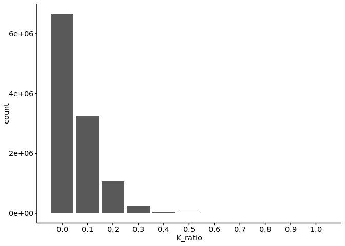
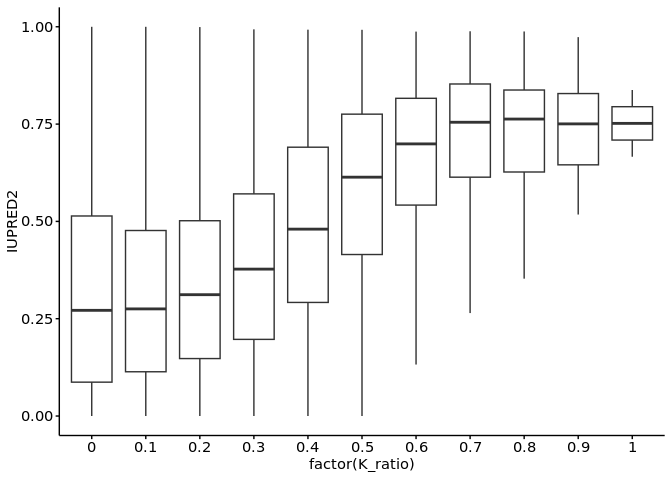
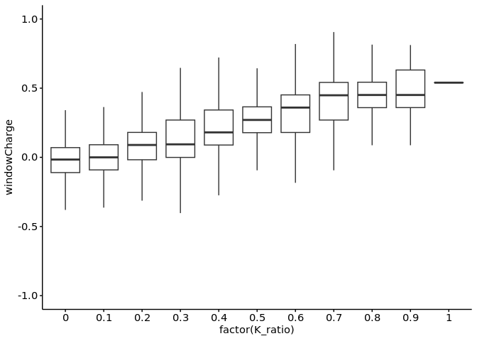

1-2. Lysine-rich domains
================
Yoichiro Sugimoto
18 November, 2024

- [Environment setup](#environment-setup)
- [Set up environment](#set-up-environment)
- [Import data](#import-data)
- [Basic statistics](#basic-statistics)
- [Session information](#session-information)

# Environment setup

``` r
# renv::init(
#           "/fast/AG_Sugimoto/home/users/yoichiro/projects/20241111_PTMs_in_lysine_rich_domains/R"
#       )

project.dir <- file.path("/fast/AG_Sugimoto/home/users/yoichiro/projects/20241111_PTMs_in_lysine_rich_domains")
## renv::snapshot(file.path(project.dir, "R"))

renv::restore(file.path(project.dir, "R"))
```

    ## The following package(s) will be updated:
    ## 
    ## # https://bioconductor.org/packages/3.18/bioc --------------------------------
    ## - AnnotationDbi      [1.64.1 -> 1.64.1]
    ## - Biobase            [2.62.0 -> 2.62.0]
    ## - BiocGenerics       [0.48.1 -> 0.48.1]
    ## - BiocVersion        [3.18.1 -> 3.18.1]
    ## - Biostrings         [2.70.3 -> 2.70.3]
    ## - GenomeInfoDb       [1.38.8 -> 1.38.8]
    ## - IRanges            [2.36.0 -> 2.36.0]
    ## - KEGGREST           [1.42.0 -> 1.42.0]
    ## - S4Vectors          [0.40.2 -> 0.40.2]
    ## - XVector            [0.42.0 -> 0.42.0]
    ## - zlibbioc           [1.48.2 -> 1.48.2]
    ## 
    ## # https://bioconductor.org/packages/3.18/data/annotation ---------------------
    ## - GenomeInfoDbData   [1.2.11 -> 1.2.11]
    ## - org.Hs.eg.db       [3.18.0 -> 3.18.0]
    ## 
    ## # Installing packages --------------------------------------------------------
    ## - Installing BiocVersion ...                    OK [copied from cache]
    ## - Installing zlibbioc ...                       OK [copied from cache]
    ## - Installing BiocGenerics ...                   OK [copied from cache]
    ## - Installing GenomeInfoDbData ...               OK [copied from cache]
    ## - Installing S4Vectors ...                      OK [copied from cache]
    ## - Installing IRanges ...                        OK [copied from cache]
    ## - Installing GenomeInfoDb ...                   OK [copied from cache]
    ## - Installing XVector ...                        OK [copied from cache]
    ## - Installing Biobase ...                        OK [copied from cache]
    ## - Installing Biostrings ...                     OK [copied from cache]
    ## - Installing KEGGREST ...                       OK [copied from cache]
    ## - Installing AnnotationDbi ...                  OK [copied from cache]
    ## - Installing org.Hs.eg.db ...                   OK [copied from cache in 0.43s]

``` r
temp <- sapply(list.files(file.path(project.dir, "R/functions"), pattern="*.R", full.names = TRUE), source)
```

    ## 
    ## Attaching package: 'dplyr'

    ## The following objects are masked from 'package:stats':
    ## 
    ##     filter, lag

    ## The following objects are masked from 'package:base':
    ## 
    ##     intersect, setdiff, setequal, union

    ## 
    ## Attaching package: 'data.table'

    ## The following objects are masked from 'package:dplyr':
    ## 
    ##     between, first, last

    ## Loading required package: BiocGenerics

    ## 
    ## Attaching package: 'BiocGenerics'

    ## The following objects are masked from 'package:dplyr':
    ## 
    ##     combine, intersect, setdiff, union

    ## The following objects are masked from 'package:stats':
    ## 
    ##     IQR, mad, sd, var, xtabs

    ## The following objects are masked from 'package:base':
    ## 
    ##     anyDuplicated, aperm, append, as.data.frame, basename, cbind,
    ##     colnames, dirname, do.call, duplicated, eval, evalq, Filter, Find,
    ##     get, grep, grepl, intersect, is.unsorted, lapply, Map, mapply,
    ##     match, mget, order, paste, pmax, pmax.int, pmin, pmin.int,
    ##     Position, rank, rbind, Reduce, rownames, sapply, setdiff, sort,
    ##     table, tapply, union, unique, unsplit, which.max, which.min

    ## Loading required package: S4Vectors

    ## Loading required package: stats4

    ## 
    ## Attaching package: 'S4Vectors'

    ## The following objects are masked from 'package:data.table':
    ## 
    ##     first, second

    ## The following objects are masked from 'package:dplyr':
    ## 
    ##     first, rename

    ## The following object is masked from 'package:utils':
    ## 
    ##     findMatches

    ## The following objects are masked from 'package:base':
    ## 
    ##     expand.grid, I, unname

    ## Loading required package: IRanges

    ## 
    ## Attaching package: 'IRanges'

    ## The following object is masked from 'package:data.table':
    ## 
    ##     shift

    ## The following objects are masked from 'package:dplyr':
    ## 
    ##     collapse, desc, slice

    ## Loading required package: XVector

    ## Loading required package: GenomeInfoDb

    ## 
    ## Attaching package: 'Biostrings'

    ## The following object is masked from 'package:base':
    ## 
    ##     strsplit

    ## 
    ## Attaching package: 'janitor'

    ## The following objects are masked from 'package:stats':
    ## 
    ##     chisq.test, fisher.test

# Set up environment

``` r
## paths
data.dir <- file.path(project.dir, "data")
results.dir <- file.path(project.dir, "results")
r0.dir <- file.path(results.dir, "p0-data-preprocessing")
```

# Import data

``` r
protein.feature.dt <- fread(file.path(data.dir, "PNAS2022/all_protein_feature_per_position.csv"))
```

# Basic statistics

``` r
## The number of proteins per max K score

ggplot(
    protein.feature.dt,
    aes(
        x = K_ratio
    )
) +
    geom_bar() +
    scale_x_continuous(breaks=seq(0, 1, 0.1))
```

<!-- -->

``` r
## Disorderedness

ggplot(
  protein.feature.dt,
  aes(
    x = factor(K_ratio),
    y = IUPRED2
  )
) + 
  geom_boxplot(outlier.shape = NA)
```

<!-- -->

``` r
## Charge
ggplot(
  protein.feature.dt,
  aes(
    x = factor(K_ratio),
    y = windowCharge
  )
) + 
  geom_boxplot(outlier.shape = NA)
```

    ## Warning: Removed 211124 rows containing non-finite outside the scale range
    ## (`stat_boxplot()`).

<!-- -->

# Session information

``` r
sessioninfo::session_info()
```

    ## ─ Session info ───────────────────────────────────────────────────────────────
    ##  setting  value
    ##  version  R version 4.3.2 (2023-10-31)
    ##  os       Ubuntu 22.04.3 LTS
    ##  system   x86_64, linux-gnu
    ##  ui       X11
    ##  language (EN)
    ##  collate  C.UTF-8
    ##  ctype    C.UTF-8
    ##  tz       Europe/Berlin
    ##  date     2024-11-18
    ##  pandoc   3.1.1 @ /usr/lib/rstudio-server/bin/quarto/bin/tools/ (via rmarkdown)
    ## 
    ## ─ Packages ───────────────────────────────────────────────────────────────────
    ##  package          * version   date (UTC) lib source
    ##  BiocGenerics     * 0.48.1    2023-11-01 [1] Bioconductor
    ##  BiocManager        1.30.25   2024-08-28 [1] CRAN (R 4.3.2)
    ##  Biostrings       * 2.70.3    2024-03-13 [1] Bioconductor 3.18 (R 4.3.2)
    ##  bitops             1.0-9     2024-10-03 [1] CRAN (R 4.3.2)
    ##  cli                3.6.3     2024-06-21 [1] CRAN (R 4.3.2)
    ##  colorspace         2.1-1     2024-07-26 [1] CRAN (R 4.3.2)
    ##  crayon             1.5.3     2024-06-20 [1] CRAN (R 4.3.2)
    ##  data.table       * 1.15.4    2024-03-30 [1] CRAN (R 4.3.2)
    ##  digest             0.6.36    2024-06-23 [1] CRAN (R 4.3.2)
    ##  dplyr            * 1.1.4     2023-11-17 [1] CRAN (R 4.3.2)
    ##  evaluate           0.24.0    2024-06-10 [1] CRAN (R 4.3.2)
    ##  fansi              1.0.6     2023-12-08 [1] CRAN (R 4.3.2)
    ##  farver             2.1.2     2024-05-13 [1] CRAN (R 4.3.2)
    ##  fastmap            1.2.0     2024-05-15 [1] CRAN (R 4.3.2)
    ##  generics           0.1.3     2022-07-05 [1] CRAN (R 4.3.2)
    ##  GenomeInfoDb     * 1.38.8    2024-03-15 [1] Bioconductor 3.18 (R 4.3.2)
    ##  GenomeInfoDbData   1.2.11    2024-11-18 [1] Bioconductor
    ##  ggplot2          * 3.5.1     2024-04-23 [1] CRAN (R 4.3.2)
    ##  glue               1.7.0     2024-01-09 [1] CRAN (R 4.3.2)
    ##  gtable             0.3.5     2024-04-22 [1] CRAN (R 4.3.2)
    ##  highr              0.11      2024-05-26 [1] CRAN (R 4.3.2)
    ##  htmltools          0.5.8.1   2024-04-04 [1] CRAN (R 4.3.2)
    ##  IRanges          * 2.36.0    2023-10-24 [1] Bioconductor
    ##  janitor          * 2.2.0     2023-02-02 [1] CRAN (R 4.3.2)
    ##  khroma           * 1.14.0    2024-08-26 [1] CRAN (R 4.3.2)
    ##  knitr            * 1.48      2024-07-07 [1] CRAN (R 4.3.2)
    ##  labeling           0.4.3     2023-08-29 [1] CRAN (R 4.3.2)
    ##  lifecycle          1.0.4     2023-11-07 [1] CRAN (R 4.3.2)
    ##  lubridate          1.9.3     2023-09-27 [1] CRAN (R 4.3.2)
    ##  magrittr         * 2.0.3     2022-03-30 [1] CRAN (R 4.3.2)
    ##  munsell            0.5.1     2024-04-01 [1] CRAN (R 4.3.2)
    ##  pillar             1.9.0     2023-03-22 [1] CRAN (R 4.3.2)
    ##  pkgconfig          2.0.3     2019-09-22 [1] CRAN (R 4.3.2)
    ##  R6                 2.5.1     2021-08-19 [1] CRAN (R 4.3.2)
    ##  RCurl              1.98-1.16 2024-07-11 [1] CRAN (R 4.3.2)
    ##  renv               1.0.7     2024-04-11 [1] CRAN (R 4.3.2)
    ##  rlang              1.1.4     2024-06-04 [1] CRAN (R 4.3.2)
    ##  rmarkdown          2.27      2024-05-17 [1] CRAN (R 4.3.2)
    ##  rstudioapi         0.17.1    2024-10-22 [1] CRAN (R 4.3.2)
    ##  S4Vectors        * 0.40.2    2023-11-23 [1] Bioconductor 3.18 (R 4.3.2)
    ##  scales           * 1.3.0     2023-11-28 [1] CRAN (R 4.3.2)
    ##  sessioninfo        1.2.2     2021-12-06 [1] CRAN (R 4.3.2)
    ##  snakecase          0.11.1    2023-08-27 [1] CRAN (R 4.3.2)
    ##  stringi            1.8.4     2024-05-06 [1] CRAN (R 4.3.2)
    ##  stringr          * 1.5.1     2023-11-14 [1] CRAN (R 4.3.2)
    ##  tibble             3.2.1     2023-03-20 [1] CRAN (R 4.3.2)
    ##  tidyselect         1.2.1     2024-03-11 [1] CRAN (R 4.3.2)
    ##  timechange         0.3.0     2024-01-18 [1] CRAN (R 4.3.2)
    ##  utf8               1.2.4     2023-10-22 [1] CRAN (R 4.3.2)
    ##  vctrs              0.6.5     2023-12-01 [1] CRAN (R 4.3.2)
    ##  withr              3.0.1     2024-07-31 [1] CRAN (R 4.3.2)
    ##  xfun               0.46      2024-07-18 [1] CRAN (R 4.3.2)
    ##  XVector          * 0.42.0    2023-10-24 [1] Bioconductor
    ##  yaml               2.3.10    2024-07-26 [1] CRAN (R 4.3.2)
    ##  zlibbioc           1.48.2    2024-03-13 [1] Bioconductor 3.18 (R 4.3.2)
    ## 
    ##  [1] /home/ysugimo/R/x86_64-pc-linux-gnu-library/4.3
    ##  [2] /usr/local/lib/R/site-library
    ##  [3] /usr/lib/R/site-library
    ##  [4] /usr/lib/R/library
    ## 
    ## ──────────────────────────────────────────────────────────────────────────────
