2-8. Lysine hydroxylations in varying O2 pc and dox induction time -
data visualisation
================
Yoichiro Sugimoto and Pallavi Kesavan
22 February, 2026

- [Overview](#overview)
- [Environment setup](#environment-setup)
- [2.7.1 Install,load essential functions and
  libraries](#271-installload-essential-functions-and-libraries)
- [2.7.2 Import human protein reference
  data](#272-import-human-protein-reference-data)
- [2.7.3 Plotting Stoichiometry values of hypoxia and normoxia data with
  re-expression of JMJD6 (+ diagnostic
  ion)](#273-plotting-stoichiometry-values-of-hypoxia-and-normoxia-data-with-re-expression-of-jmjd6--diagnostic-ion)
- [2.7.4 Comparing hypoxia stoichiometry under varying dox incubation (+
  diagnostic
  ion)](#274-comparing-hypoxia-stoichiometry-under-varying-dox-incubation--diagnostic-ion)
- [2.7.5 XIC values against MS_SS and MS_KR_1 stoichiometry
  data.](#275-xic-values-against-ms_ss-and-ms_kr_1-stoichiometry-data)
- [Session information](#session-information)

# Overview

This script examines the oxygen sensitivity of lysine hydroxylations in
BRD proteins and their respective sites. This script is for visualizing
the calculated stoichiometry.

# Environment setup

``` r
## Initialize renv (first time only) - re-installed 24.09.2025
# Creates project specific library and renv.lock file. 
# Use 'renv::init(filepath)' to create project library
# renv::init(
#        "/fast/AG_Sugimoto/home/users/pallavi/projects/20241111_PTMs_in_lysine_rich_domains/R"
#    )

# Define project directory - contains the R scripts, data and result folders
project.dir <-
  file.path(
    "/fast/AG_Sugimoto/home/users/pallavi/projects/20241111_PTMs_in_lysine_rich_domains"
  )

# renv::snapshot(file.path(project.dir, "R"))

#renv::restore completed 24.09.2025
#renv::restore(file.path(project.dir, "R"))
```

# 2.7.1 Install,load essential functions and libraries

``` r
## Load all R scripts from the 'functions' folder into the current session
P2_functions <- sapply(list.files
                       (file.path(project.dir, "R/functions"), 
                         pattern="*.R", 
                         full.names = TRUE), 
                       source)
```

    ## 
    ## Attaching package: 'dplyr'

    ## The following objects are masked from 'package:stats':
    ## 
    ##     filter, lag

    ## The following objects are masked from 'package:base':
    ## 
    ##     intersect, setdiff, setequal, union

    ## 
    ## Attaching package: 'data.table'

    ## The following objects are masked from 'package:dplyr':
    ## 
    ##     between, first, last

    ## Loading required package: BiocGenerics

    ## Loading required package: generics

    ## 
    ## Attaching package: 'generics'

    ## The following object is masked from 'package:dplyr':
    ## 
    ##     explain

    ## The following objects are masked from 'package:base':
    ## 
    ##     as.difftime, as.factor, as.ordered, intersect, is.element, setdiff,
    ##     setequal, union

    ## 
    ## Attaching package: 'BiocGenerics'

    ## The following object is masked from 'package:dplyr':
    ## 
    ##     combine

    ## The following objects are masked from 'package:stats':
    ## 
    ##     IQR, mad, sd, var, xtabs

    ## The following objects are masked from 'package:base':
    ## 
    ##     anyDuplicated, aperm, append, as.data.frame, basename, cbind,
    ##     colnames, dirname, do.call, duplicated, eval, evalq, Filter, Find,
    ##     get, grep, grepl, is.unsorted, lapply, Map, mapply, match, mget,
    ##     order, paste, pmax, pmax.int, pmin, pmin.int, Position, rank,
    ##     rbind, Reduce, rownames, sapply, saveRDS, table, tapply, unique,
    ##     unsplit, which.max, which.min

    ## Loading required package: S4Vectors

    ## Loading required package: stats4

    ## 
    ## Attaching package: 'S4Vectors'

    ## The following objects are masked from 'package:data.table':
    ## 
    ##     first, second

    ## The following objects are masked from 'package:dplyr':
    ## 
    ##     first, rename

    ## The following object is masked from 'package:utils':
    ## 
    ##     findMatches

    ## The following objects are masked from 'package:base':
    ## 
    ##     expand.grid, I, unname

    ## Loading required package: IRanges

    ## 
    ## Attaching package: 'IRanges'

    ## The following object is masked from 'package:data.table':
    ## 
    ##     shift

    ## The following objects are masked from 'package:dplyr':
    ## 
    ##     collapse, desc, slice

    ## Loading required package: XVector

    ## Loading required package: GenomeInfoDb

    ## 
    ## Attaching package: 'Biostrings'

    ## The following object is masked from 'package:base':
    ## 
    ##     strsplit

``` r
## Install private package 
# Install ptm.stiochiometry package
# install.packages("/fast/AG_Sugimoto/home/users/pallavi/projects/ptm.stoichiometry", repos = NULL, type = "source")

# Load Libraries
library("readxl")
library("janitor")
```

    ## 
    ## Attaching package: 'janitor'

    ## The following objects are masked from 'package:stats':
    ## 
    ##     chisq.test, fisher.test

``` r
library("ptm.stoichiometry")
```

# 2.7.2 Import human protein reference data

``` r
# Import human protein reference data from specified file path 
ref_protein_dt <- import_reference_fasta(file.path
                                         ("/fast/AG_Sugimoto/reference/uniprot/human", 
                                           "UP000005640_9606.fasta")) 
```

``` r
# Define path to data directory
data.dir <- file.path(project.dir, "data")
results.dir <- file.path(project.dir, "results")
```

# 2.7.3 Plotting Stoichiometry values of hypoxia and normoxia data with re-expression of JMJD6 (+ diagnostic ion)

``` r
# Read FASTA data 
all.protein.bs <- Biostrings::readAAStringSet(
  file.path(
    "/fast/AG_Sugimoto/reference/uniprot/human",
    "UP000005640_9606.fasta"
  )
)

# Define function - 'read_stoic_data'
read_stoic_data <- function(prefix, pre_prefix, post_fix = "", dir_path){
  # Read csv file with defined file path,  
  dt <- fread(file.path(dir_path, paste0(pre_prefix, prefix, "PTM_stoichiometry", post_fix, ".csv"))) 
  dt[, condition := gsub("_$", "", prefix)] # Removes '_' at the end of the prefix and creates a new column called condition
  return(dt)
}

#-------------------------------------
# Contrast function - by sample group
#-------------------------------------

contrast_hydroxylation_by_sample_group<- function(all_stoic_dt){
  wt_ko_dt <- all_stoic_dt
  
  # Add new columns into metadata
  wt_ko_dt[, `:=`(
    pos_id = paste0(protein_accession, "_", aa_pos), 
    sample_pos_id = paste0(sample_group, "_", protein_accession, "_", aa_pos)
  )]
  
  # Identify position with at least one oxidation event
  oxidation_ids <- wt_ko_dt[
    grepl("[Oxidation (K)]", ptm, fixed = TRUE), # checks for oxidation event
    unique(pos_id) # Returns unique pos_id with oxidation event
  ]
  oxidation_sample_ids <- wt_ko_dt[
    grepl("[Oxidation (K)]", ptm, fixed = TRUE),
    unique(sample_pos_id)
  ]
  
  # Collect non hydroxylated K information for the sites with hydroxylation
  no_hydroxyK_dt <- copy(wt_ko_dt[aa == "K"])
  no_hydroxyK_dt <- no_hydroxyK_dt[pos_id %in% oxidation_ids] %>%
    {.[!sample_pos_id %in% oxidation_sample_ids]} # If hydroxylation data exist, this is not necessary
  
  # Set stoichiometry and PSM count to zero for these positions and update the PTM label
  no_hydroxyK_dt[, `:=`(
    sum_psm_mapped = 0,
    stoichiometry = 0,
    ptm = "[Oxidation (K)]"
  )]
  
  # Combine oxidation data from both original and the newly flagged unmodified K data
  hydroxyK_dt <- rbind(
    wt_ko_dt[grepl("[Oxidation (K)]", ptm, fixed = TRUE)],
    no_hydroxyK_dt
  )
  
  # Filter psm mapped greater than 2 for higher confidence 
  hydroxyK_dt <- hydroxyK_dt[
    sum_psm_mapped_per_position > 2
  ]
  
  # Sort stoichiometry column from highest to lowest
  hydroxyK_dt <- hydroxyK_dt[order(stoichiometry, decreasing = TRUE)][
    !duplicated(paste0(protein_accession, gene_name, aa_pos, sample_group)) # Remove duplicate rows
  ]
  
  # Reshape 'd.hydroxyK_dt' from long to wide based on stoichiometry values  
  d.hydroxyK_dt <- dcast(
    hydroxyK_dt,
    protein_accession + gene_name + aa_pos ~ sample_group, # values in oxygen_stat become into separate columns (Normoxia & Hypoxia)
    value.var = "stoichiometry"
  )
  
  return(d.hydroxyK_dt)
}

#---------------------------------
# Contrast function - by genotype
#---------------------------------

contrast_hydroxylation_by_genotype <- function(all_stoic_dt, min.psm = 2){
  wt_ko_dt <- all_stoic_dt
  
  # Add new columns into metadata
  wt_ko_dt[, `:=`(
    genotype = str_extract(sample_name, "(?<=HeLa)(WT|JMJD6KO)"), # new column - Genotype, extract WT or JMJD6KO from sample_name column
    pos_id = paste0(protein_accession, "_", aa_pos), 
    sample_pos_id = paste0(sample_name, "_", protein_accession, "_", aa_pos)
  )]
  
  # Identify position with at least one oxidation event
  oxidation_ids <- wt_ko_dt[
    grepl("[Oxidation (K)]", ptm, fixed = TRUE), # checks for oxidation event
    unique(pos_id) # Returns unique pos_id with oxidation event
  ]
  oxidation_sample_ids <- wt_ko_dt[
    grepl("[Oxidation (K)]", ptm, fixed = TRUE),
    unique(sample_pos_id)
  ]
  
  # Collect non hydroxylated K information for the sites with hydroxylation
  no_hydroxyK_dt <- copy(wt_ko_dt[aa == "K"])
  no_hydroxyK_dt <- no_hydroxyK_dt[pos_id %in% oxidation_ids] %>%
    {.[!sample_pos_id %in% oxidation_sample_ids]} # If hydroxylation data exist, this is not necessary
  
  # Set stoichiometry and PSM count to zero for these positions and update the PTM label
  no_hydroxyK_dt[, `:=`(
    sum_psm_mapped = 0,
    stoichiometry = 0,
    ptm = "[Oxidation (K)]"
  )]
  
  # Combine oxidation data from both original and the newly flagged unmodified K data
  hydroxyK_dt <- rbind(
    wt_ko_dt[grepl("[Oxidation (K)]", ptm, fixed = TRUE)],
    no_hydroxyK_dt
  )
  
  # Filter psm mapped greater than min.psm (def. 2) for higher confidence 
  hydroxyK_dt <- hydroxyK_dt[
    sum_psm_mapped_per_position > min.psm
  ]
  
  # Sort stoichiometry column from highest to lowest
  hydroxyK_dt <- hydroxyK_dt[order(stoichiometry, decreasing = TRUE)][
    !duplicated(paste0(protein_accession, gene_name, aa_pos, genotype)) # Remove duplicate rows
  ]
  
  # Reshape 'd.hydroxyK_dt' from long to wide based on stoichiometry values  
  d.hydroxyK_dt <- dcast(
    hydroxyK_dt,
    protein_accession + gene_name + aa_pos ~ genotype, # values in genotype become into separate columns (WT & JMJD6KO)
    value.var = "stoichiometry"
  )
  
  return(d.hydroxyK_dt)
}
```

``` r
#-----------------------------
# Load MS_KR_1 stoichiometry data
#-----------------------------

## Read stoichiometry data for MS_KR1 data (noH2O loss)
 MS_KR1_stoic_dt <- read_stoic_data(
  prefix = "MS_KR_1_noH2O_",
  pre_prefix = "",
  post_fix = "_DI",
  dir_path = file.path(results.dir, "p2-analysis-setting", "MS_KR_1_noH2O"))


# Create a logical column for diagnostic peak. For rows where diagnostic peak is 
# present "+", logical vector is "TRUE", or else "FALSE"
MS_KR1_stoic_dt[, `:=`(
  is_diagnostic_peak = diagnostic_peak == "+" 
)]

#-----------------------------
# Load MS_SS stoichiometry data
#-----------------------------

## Read stoichiometry data for MS_SS data 
 MS_SS_stoic_dt <- read_stoic_data(
  prefix = "MS_SS_",
  pre_prefix = "",
  post_fix = "_DI",
  dir_path = file.path(results.dir, "p2-analysis-setting", "MS_SS_noH2O"))

 #[Oxidation (K)] 

# Create a logical column for diagnostic peak. For rows where diagnostic peak is 
# present "+", logical vector is "TRUE", or else "FALSE"
MS_SS_stoic_dt[, `:=`(
  is_diagnostic_peak = diagnostic_peak == "+" 
)]


#-----------------------------
# Load PNAS stoichiometry data
#-----------------------------

pnas2022_stoic_dt <- fread(file.path(data.dir, "PNAS2022/long_K_stoichiometry_data.csv"))

# Replace old column names with new ones
setnames(
  pnas2022_stoic_dt, 
  old = c("uniprot_id", "position", "residue", "oxK_ratio", "data_source", "total_n_feature_oxK", "total_n_feature_K"), 
  new = c("protein_accession", "aa_pos", "aa", "stoichiometry", "sample_name", "sum_psm_mapped", "sum_psm_mapped_per_position")
)

# Merge the reference protein data with the PNAS stoichiometry data by protein accession ID
pnas2022_stoic_dt <- merge(
  ref_protein_dt[, .(protein_accession, gene_name)], # Take columns protein_accession and gene_name from the ref data 
  pnas2022_stoic_dt,
  by = "protein_accession" #combine both data.table by protein accession ID
)

# Adding columns to pnas2022_stoic_dt metadata
pnas2022_stoic_dt[, `:=`(
  accession_position = paste0(protein_accession, "_", aa_pos), # combines data from protein_accession and aa_pos
  ptm = fifelse(curated_oxK_site, "[Oxidation (K)]", ""), # add the "[Oxidation (K)]" in ptm column, if curated oxK site is TRUE
  sample_name = gsub("HeLa_", "HeLa", sample_name) %>% #replace sample names as mentioned (from "Hela_" to "HeLa")
    {gsub("HeLaJMJD6FLAG", "HeLaWT_JMJD6FLAG", .)} 
)]

# subset the data to curated_oxK_site = TRUE, aa = K and BRD proteins
pnas2022_stoic_dt <-  pnas2022_stoic_dt[
  curated_oxK_site == TRUE &
  ptm == "[Oxidation (K)]" &
  gene_name %in% c("BRD2", "BRD3", "BRD4") &
  aa == "K"
]

# Contrast non hydroxylated and hydroxylated lysines
# Take only the HeLa samples with JQ1 or J6 peptide pull-down
pnas_hydroxy_dt <- contrast_hydroxylation_by_genotype(
  pnas2022_stoic_dt[
    grepl("HeLa", sample_name) & (grepl("JQ1", sample_name) | grepl("J6pep", sample_name))
  ]
)
```

``` r
# Filter MS_KR_1 data to retain only BRD2, 3, 4 data
MS_KR1_BRD_dt <- MS_KR1_stoic_dt[
    gene_name %in% c("BRD2", "BRD3", "BRD4") & 
    aa == "K"]

# Filter MS_SS data to retain only BRD2, 3, 4 data 
MS_SS_BRD_dt <-  MS_SS_stoic_dt[
  gene_name %in% c("BRD2", "BRD3", "BRD4")&
    aa == "K"]

# subset rows with diagnostic ion from MS_SS and MS_KR data
DI_sites <- rbind(
  MS_KR1_BRD_dt[is_diagnostic_peak == TRUE, .(protein_accession, aa_pos)],
  MS_SS_BRD_dt[is_diagnostic_peak == TRUE, .(protein_accession, aa_pos)]
)

# remove duplicate sites 
DI_sites <- DI_sites[!duplicated(paste(protein_accession, aa_pos))]

# Combine MS_KR1_subset_dt and MS_SS_all_dt data
MS_SS_KR_dt <- rbindlist(list(MS_SS_BRD_dt,
                         MS_KR1_BRD_dt),
                         use.names = TRUE)

# Merge MS_SS_KR data to only have unique diagnostic ion sites
MS_SS_KR_dt <- merge(
  DI_sites,
  MS_SS_KR_dt,
  by = c("protein_accession", "aa_pos")
)

# Remove BRD2/3 samples reporting BRD4 stoichiomtery and vice versa
# These samples are removed as it could be false positives reported by the system 
MS_SS_KR_dt <- MS_SS_KR_dt[
  !((grepl("_BRD23$", sample_name) & gene_name == "BRD4") |
       (grepl("_BRD4$", sample_name) & gene_name %in% c("BRD2", "BRD3")))
]

# Column "sample group" created to simpilfy sample names
MS_SS_KR_dt[, `:=`(
  sample_group = case_when(
    condition == "MS_SS" & grepl("minusDox", sample_name) ~ paste0("iJ6_0h_21pc_SS"),
    condition == "MS_SS"~ paste0("iJ6_", str_split_fixed(sample_name, "_", 3)[, 1], "_", str_split_fixed(sample_name, "_", 3)[, 2], "_SS"),
    sample_name == "HeLaiJMJD6_noDox_N_NA" ~ "iJ6_0h_21pc_KR",
    sample_name == "HeLaiJMJD6_Dox_N_NA" ~ "iJ6_24h_21pc_KR",
    sample_name == "HeLaWT_NA_N_NA" ~ "WT_Inf_21pc_KR", 
    sample_name == "HeLaiJMJD6_Dox_01O224h_NA" ~ "iJ6_24h_01pc_KR"
  )
)]

# Using contrast function on MS_SS_KR raw stoic data
c_MS_SS_KR_dt <- contrast_hydroxylation_by_sample_group(MS_SS_KR_dt)

# Factor the gene names
c_MS_SS_KR_dt[, `:=`(
  gene_name =  
    factor(gene_name)
)]
```

``` r
# Plotting stoichiometry of BRD proteins in different O2% 
# Note: the amino acid region of the proteins is that of the ones represented 
# in the PNAS2022 paper. 

#accession = "P25440", plot_range = c(540, 590) BRD2
plot_ptm_stoichiometry(
  MS_SS_KR_dt[grepl("18h|24h|WT|0h", sample_group) & gene_name == "BRD2"],
  accession = "P25440",
  plot_range = c(540, 590), 
  all.protein.bs, 
  sample_colors = NA,
)
```

<!-- -->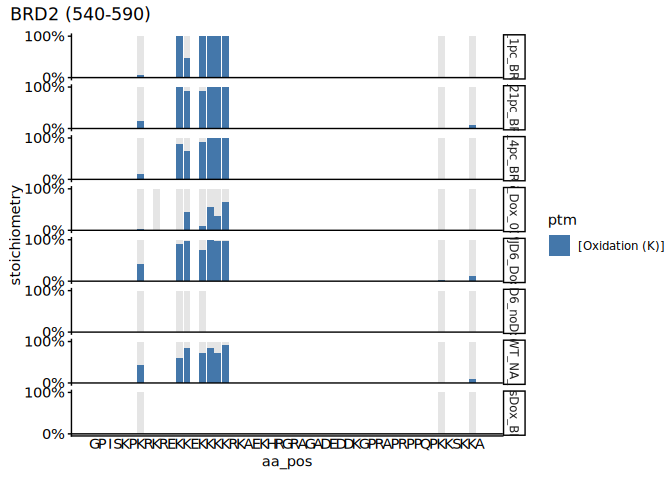<!-- -->

``` r
# accession = "Q15059", plot_range = c(483, 533) BRD3
plot_ptm_stoichiometry(
  MS_SS_KR_dt[grepl("18h|24h|WT|0h", sample_group) & gene_name == "BRD3"],
  accession = "Q15059",
  plot_range = c(483, 533), 
  all.protein.bs, 
  sample_colors = NA,
)
```

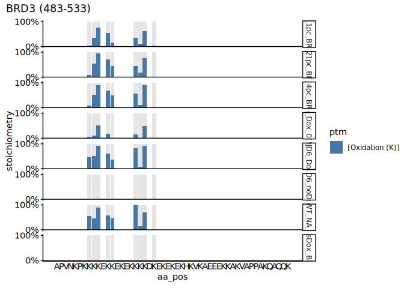<!-- --><!-- -->

``` r
# accession = "O60885", plot_range = c(531, 581) BRD4 
plot_ptm_stoichiometry(
  MS_SS_KR_dt[grepl("18h|24h|WT|0h", sample_group) & gene_name == "BRD4"],
  accession = "O60885",
  plot_range = c(531, 581), 
  all.protein.bs, 
  sample_colors = NA,
)
```

<!-- -->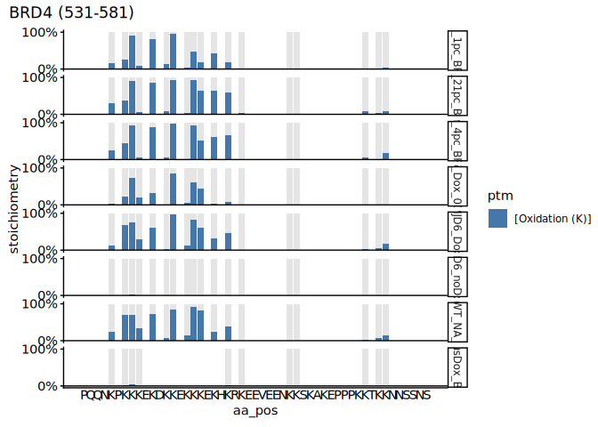<!-- -->

``` r
# Change wide format to long format 
long_c_MS_SS_KR_dt <- melt(
  c_MS_SS_KR_dt,
  id.vars = c("protein_accession", "gene_name", "aa_pos"),
  value.name = "Stoichiometry", 
  variable.name = "sample_group"
  #value.var = grep("_", colnames(c_MS_SS_KR_all_dt), value = TRUE)
)

# Separate the contents of sample_group column into new columns 
long_c_MS_SS_KR_dt[, `:=`(
  cell = str_split_fixed(sample_group, "_", 4)[, 1],
  induction = str_split_fixed(sample_group, "_", 4)[, 2] %>%
    factor(levels = c("Inf", "0h", "4h", "8h", "18h", "24h")),
  oxygen = str_split_fixed(sample_group, "_", 4)[, 3],
  dataset = str_split_fixed(sample_group, "_", 4)[, 4]
)]

# subset rows that do not contain NA values 
long_c_MS_SS_KR_dt <- long_c_MS_SS_KR_dt[!is.na(Stoichiometry)]

# counting the data per sample and size 
long_c_MS_SS_KR_dt[, data_size_per_sample := .N, by = list(sample_group)]
long_c_MS_SS_KR_dt[, data_size_per_site := .N, by = list(protein_accession, aa_pos)]

# reorder the oxygen levels
long_c_MS_SS_KR_dt <-  long_c_MS_SS_KR_dt[, oxygen := factor(
  oxygen,
  levels = c("01pc", "1pc", "4pc", "21pc")
)]
```

``` r
#---------------------------------------------
# Normoxia samples under varying dox induction
#---------------------------------------------

# subset data to WT normoxia (MS_KR_1 sample)
wt_21pc <- long_c_MS_SS_KR_dt[sample_group == "WT_Inf_21pc_KR", .(protein_accession, aa_pos, Stoichiometry)]
setnames(wt_21pc, old = "Stoichiometry", "WT_stioichiomtry")

# Merge WT data with MS_SS_KR normoxia data
pc2wt_21pc <- merge(
  long_c_MS_SS_KR_dt[
    cell == "iJ6" &
    oxygen == "21pc"
  ],
  wt_21pc,
  by = c("protein_accession", "aa_pos")
)

# Boxplot - comparing normoxia in different dox incubation timings
ggplot(
  data = pc2wt_21pc[data_size_per_site == max(pc2wt_21pc[, data_size_per_site])],
  aes(
    x = induction,
    y = Stoichiometry / WT_stioichiomtry
  )
) +
  #geom_hline(yintercept = 1, color = "gray60") +
  geom_boxplot(outlier.shape = NA) +
  # facet_grid(~ oxygen) +
  ylab("Stoichiometry [% to WT]") +
  theme_classic()+
  theme(axis.text.x = element_text(angle = 90, hjust = 1)) + 
  theme(legend.position="right") +
  coord_cartesian(ylim = c(0, 1.2)) +
  theme(aspect.ratio = 2) +
  scale_y_continuous(labels = scales::percent_format(accuracy = 1))
```

    ## Warning: Removed 30 rows containing non-finite outside the scale range
    ## (`stat_boxplot()`).

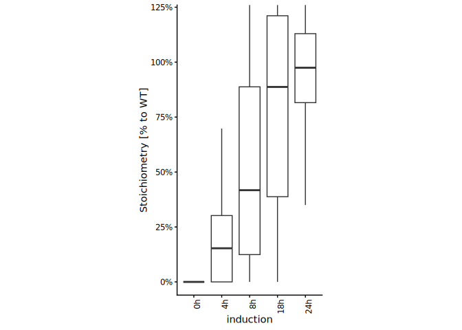<!-- -->

``` r
#-----------------------------------

# Normoxia subset to greater than 0.1 (N >= 0.1)
pc2wt_21pc_N01 <- pc2wt_21pc[Stoichiometry >0.1]

# Boxplot - comparing normoxia in different dox incubation timings
ggplot(
  data = pc2wt_21pc_N01[data_size_per_site == max(pc2wt_21pc_N01[, data_size_per_site])],
  aes(
    x = induction,
    y = Stoichiometry / WT_stioichiomtry
  )
) +
  #geom_hline(yintercept = 1, color = "gray60") +
  geom_boxplot(outlier.shape = NA) +
  # facet_grid(~ oxygen) +
  ylab("(N >= 0.1) Stoichiometry [% to WT]") +
  theme_classic()+
  theme(axis.text.x = element_text(angle = 90, hjust = 1)) + 
  theme(legend.position="right") +
  coord_cartesian(ylim = c(0, 1.2)) +
  theme(aspect.ratio = 2) +
  scale_y_continuous(labels = scales::percent_format(accuracy = 1))
```

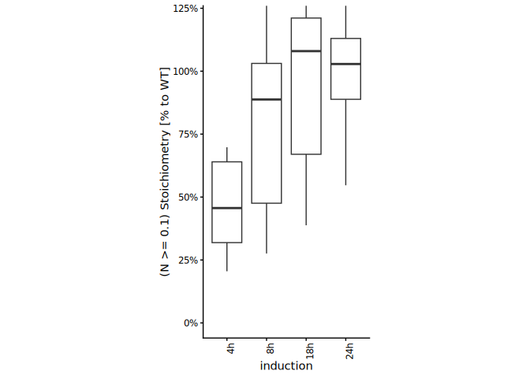<!-- -->

``` r
# Boxplot - Stoichiometry of Dox + and - JMJD6 under O2 levels
ggplot(
  data = long_c_MS_SS_KR_dt[data_size_per_site == max(long_c_MS_SS_KR_dt[, data_size_per_site])],
  aes(
    x = induction,
    y = Stoichiometry
  )
) +
  #geom_hline(yintercept = 1, color = "gray60") +
  geom_boxplot(outlier.shape = NA) +
  facet_grid(~ oxygen) +
  ylab("Stoichiometry [%]") +
  theme_classic()+
  theme(axis.text.x = element_text(angle = 90, hjust = 1)) + 
  theme(legend.position="right") +
  coord_cartesian(ylim = c(0, 1.2)) +
  theme(aspect.ratio = 2) +
  scale_y_continuous(labels = scales::percent_format(accuracy = 1))
```

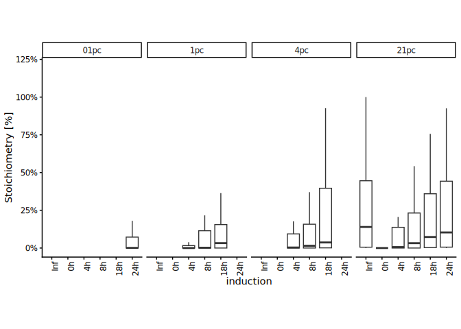<!-- -->

``` r
#---------------------

# O2 levels subset to 21pc 
long_c_MS_SS_KR_21pc_dt <- long_c_MS_SS_KR_dt[oxygen == "21pc"]


# Boxplot - Stoichiometry of Dox + and - JMJD6 at 21pc O2
ggplot(
  data = long_c_MS_SS_KR_21pc_dt[data_size_per_site == max(long_c_MS_SS_KR_dt[, data_size_per_site])],
  aes(
    x = induction,
    y = Stoichiometry
  )
) +
  #geom_hline(yintercept = 1, color = "gray60") +
  geom_boxplot(outlier.shape = NA) +
  facet_grid(~ oxygen) +
  ylab("Stoichiometry [%]") +
  theme_classic()+
  theme(axis.text.x = element_text(angle = 90, hjust = 1)) + 
  theme(legend.position="right") +
  coord_cartesian(ylim = c(0, 1.2)) +
  theme(aspect.ratio = 2) +
  scale_y_continuous(labels = scales::percent_format(accuracy = 1))
```

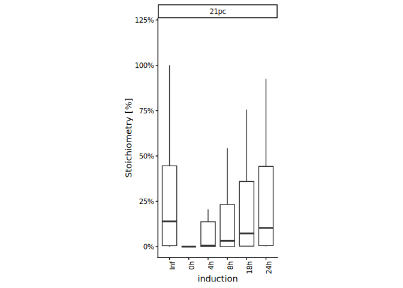<!-- -->

``` r
#------------------------

# O2 levels subset to 21pc and (N >= 0.1)
long_c_MS_SS_KR_21pc_dt <- long_c_MS_SS_KR_21pc_dt[oxygen == "21pc" & Stoichiometry >= 0.1]


# Boxplot - Stoichiometry of Dox + and - JMJD6 at 21pc O2
ggplot(
  data = long_c_MS_SS_KR_21pc_dt[data_size_per_site == max(long_c_MS_SS_KR_dt[, data_size_per_site])],
  aes(
    x = induction,
    y = Stoichiometry
  )
) +
  #geom_hline(yintercept = 1, color = "gray60") +
  geom_boxplot(outlier.shape = NA) +
  facet_grid(~ oxygen) +
  ylab("(N >= 0.1) Stoichiometry [%]") +
  theme_classic()+
  theme(axis.text.x = element_text(angle = 90, hjust = 1)) + 
  theme(legend.position="right") +
  coord_cartesian(ylim = c(0, 1.2)) +
  theme(aspect.ratio = 2) +
  scale_y_continuous(labels = scales::percent_format(accuracy = 1))
```

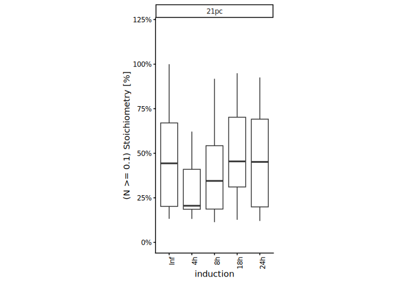<!-- -->

``` r
# Boxplot - Comparing the stoic between normoxia and varying pc of hypoxia
# Data subset to overnight (18/24h) dox induction

long_MS_SS_KR_O2p_dt <- long_c_MS_SS_KR_dt[grepl("18h|24h|WT", sample_group)]

# reorder the sample_group according to oxygen levels
long_MS_SS_KR_O2p_dt[, sample_group :=
                       factor(sample_group,
                              levels = c("WT_Inf_21pc_KR",
                                         "iJ6_24h_21pc_KR",
                                         "iJ6_18h_21pc_SS",
                                         "iJ6_18h_4pc_SS",
                                         "iJ6_18h_1pc_SS",
                                         "iJ6_24h_01pc_KR"))
]

# Plot
ggplot(
  data = long_MS_SS_KR_O2p_dt, 
  aes(
    x = sample_group,
    y = Stoichiometry
  )
) +
  geom_boxplot(outlier.shape = NA) +
  ylab("Stoichiometry") +
  theme_classic()+
  theme(axis.text.x = element_text(angle = 90, hjust = 1)) + 
  theme(legend.position="right") +
  coord_cartesian(ylim = c(0, 1.2)) +
  theme(aspect.ratio = 2) +
  scale_y_continuous(labels = scales::percent_format(accuracy = 1))
```

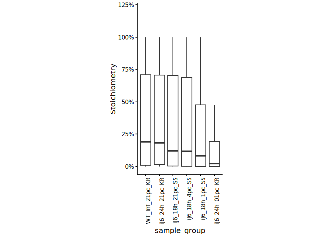<!-- -->

``` r
#-----------------------------
# binning normoxia values 

# subset data to WT normoxia (MS_SS_KR sample)
MS_SS_KR_21pc <- long_c_MS_SS_KR_dt[grepl("18h|24h", sample_group) & grepl("21pc", oxygen),  .(protein_accession, aa_pos, Stoichiometry)]

MS_SS_KR_21pc[
  ,
  normoxia_bin := cut(
    Stoichiometry,
    breaks = c(0, 0.3, 0.6, 1),
    labels = c("0–0.3", "0.3–0.6", "0.6–1"),
    include.lowest = TRUE
  )
]
```

``` r
# Scatter plot - Normoxia stoichiometry versus hypoxia at 4% - 18h dox incubation
ggplot(
  data = c_MS_SS_KR_dt, 
  aes(
    x = iJ6_18h_21pc_SS,
    y = iJ6_18h_4pc_SS
  )
) +
  geom_point(aes(colour = gene_name)) +
  #facet_grid(~ gene_name, space = "free")+
  theme_classic() +
  coord_cartesian(ylim = c(0, 1)) +
  theme(axis.text.x = element_text(angle = 90, hjust = 1)) + 
  theme(legend.position="right") 
```

    ## Warning: Removed 1 row containing missing values or values outside the scale range
    ## (`geom_point()`).

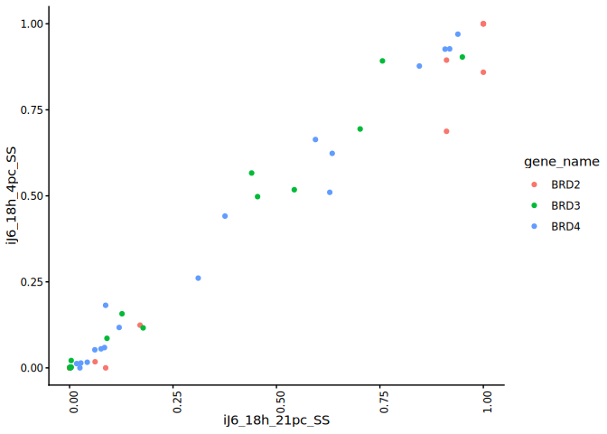<!-- -->

``` r
# correlation test 
cor.test(c_MS_SS_KR_dt[, iJ6_18h_21pc_SS], c_MS_SS_KR_dt[, iJ6_18h_4pc_SS], method = "spearma")
```

    ## Warning in cor.test.default(c_MS_SS_KR_dt[, iJ6_18h_21pc_SS], c_MS_SS_KR_dt[, :
    ## Cannot compute exact p-value with ties

    ## 
    ##  Spearman's rank correlation rho
    ## 
    ## data:  c_MS_SS_KR_dt[, iJ6_18h_21pc_SS] and c_MS_SS_KR_dt[, iJ6_18h_4pc_SS]
    ## S = 878.53, p-value < 2.2e-16
    ## alternative hypothesis: true rho is not equal to 0
    ## sample estimates:
    ##       rho 
    ## 0.9551768

``` r
wilcox.test(
  c_MS_SS_KR_dt[, iJ6_18h_4pc_SS],
  c_MS_SS_KR_dt[, iJ6_18h_21pc_SS],
  paired = TRUE
)
```

    ## Warning in wilcox.test.default(c_MS_SS_KR_dt[, iJ6_18h_4pc_SS], c_MS_SS_KR_dt[,
    ## : cannot compute exact p-value with zeroes

    ## 
    ##  Wilcoxon signed rank test with continuity correction
    ## 
    ## data:  c_MS_SS_KR_dt[, iJ6_18h_4pc_SS] and c_MS_SS_KR_dt[, iJ6_18h_21pc_SS]
    ## V = 347, p-value = 0.1935
    ## alternative hypothesis: true location shift is not equal to 0

``` r
# Scatter plot - Normoxia stoichiometry versus hypoxia at 1% - 18h dox incubation
ggplot(
  data = c_MS_SS_KR_dt, 
  aes(
    x = iJ6_18h_21pc_SS,
    y = iJ6_18h_1pc_SS
  )
) +
  geom_point(aes(colour = gene_name)) +
#  facet_grid(~ gene_name, space = "free")+
  theme_classic() +
  coord_cartesian(ylim = c(0, 1)) +
  theme(axis.text.x = element_text(angle = 90, hjust = 1)) + 
  theme(legend.position="right") 
```

    ## Warning: Removed 1 row containing missing values or values outside the scale range
    ## (`geom_point()`).

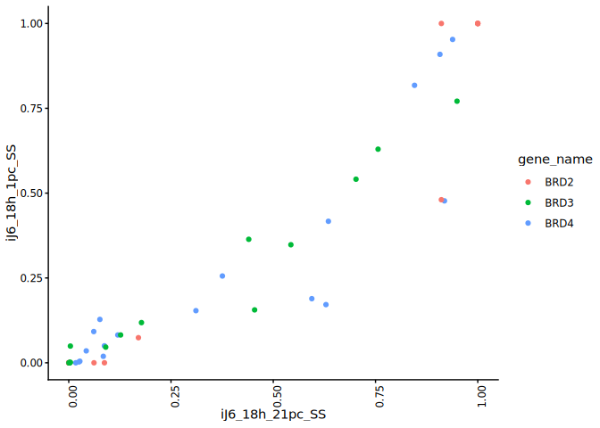<!-- -->

``` r
# correlation test 
cor.test(c_MS_SS_KR_dt[, iJ6_18h_21pc_SS], c_MS_SS_KR_dt[, iJ6_18h_1pc_SS], method = "spearma")
```

    ## Warning in cor.test.default(c_MS_SS_KR_dt[, iJ6_18h_21pc_SS], c_MS_SS_KR_dt[, :
    ## Cannot compute exact p-value with ties

    ## 
    ##  Spearman's rank correlation rho
    ## 
    ## data:  c_MS_SS_KR_dt[, iJ6_18h_21pc_SS] and c_MS_SS_KR_dt[, iJ6_18h_1pc_SS]
    ## S = 985.17, p-value < 2.2e-16
    ## alternative hypothesis: true rho is not equal to 0
    ## sample estimates:
    ##       rho 
    ## 0.9497364

``` r
wilcox.test(
  c_MS_SS_KR_dt[, iJ6_18h_1pc_SS],
  c_MS_SS_KR_dt[, iJ6_18h_21pc_SS],
  paired = TRUE
)
```

    ## Warning in wilcox.test.default(c_MS_SS_KR_dt[, iJ6_18h_1pc_SS], c_MS_SS_KR_dt[,
    ## : cannot compute exact p-value with zeroes

    ## 
    ##  Wilcoxon signed rank test with continuity correction
    ## 
    ## data:  c_MS_SS_KR_dt[, iJ6_18h_1pc_SS] and c_MS_SS_KR_dt[, iJ6_18h_21pc_SS]
    ## V = 97, p-value = 2.664e-05
    ## alternative hypothesis: true location shift is not equal to 0

``` r
# Scatter plot - Normoxia stoichiometry versus hypoxia at 0.1% - 24h dox incubation
ggplot(
  data = c_MS_SS_KR_dt, 
  aes(
    x = iJ6_24h_21pc_KR,
    y = iJ6_24h_01pc_KR
  )
) +
  geom_point(aes(colour = gene_name)) +
  #facet_grid(~ gene_name, space = "free")+
  theme_classic() +
  coord_cartesian(ylim = c(0, 1)) +
  theme(axis.text.x = element_text(angle = 90, hjust = 1)) + 
  theme(legend.position="right")
```

    ## Warning: Removed 2 rows containing missing values or values outside the scale range
    ## (`geom_point()`).

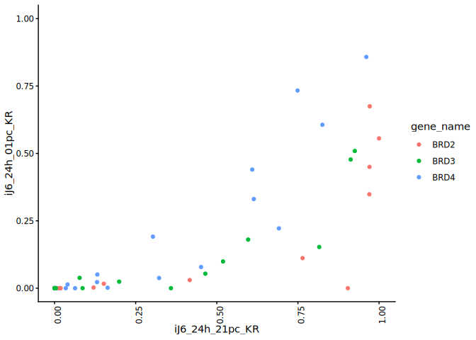<!-- -->

``` r
# correlation test 
cor.test(c_MS_SS_KR_dt[, iJ6_24h_21pc_KR], c_MS_SS_KR_dt[, iJ6_24h_01pc_KR], method = "spearma")
```

    ## Warning in cor.test.default(c_MS_SS_KR_dt[, iJ6_24h_21pc_KR], c_MS_SS_KR_dt[, :
    ## Cannot compute exact p-value with ties

    ## 
    ##  Spearman's rank correlation rho
    ## 
    ## data:  c_MS_SS_KR_dt[, iJ6_24h_21pc_KR] and c_MS_SS_KR_dt[, iJ6_24h_01pc_KR]
    ## S = 2455.7, p-value = 1.707e-15
    ## alternative hypothesis: true rho is not equal to 0
    ## sample estimates:
    ##       rho 
    ## 0.8667125

``` r
wilcox.test(
  c_MS_SS_KR_dt[, iJ6_24h_01pc_KR],
  c_MS_SS_KR_dt[, iJ6_24h_21pc_KR],
  paired = TRUE
)
```

    ## Warning in wilcox.test.default(c_MS_SS_KR_dt[, iJ6_24h_01pc_KR],
    ## c_MS_SS_KR_dt[, : cannot compute exact p-value with zeroes

    ## 
    ##  Wilcoxon signed rank test with continuity correction
    ## 
    ## data:  c_MS_SS_KR_dt[, iJ6_24h_01pc_KR] and c_MS_SS_KR_dt[, iJ6_24h_21pc_KR]
    ## V = 0, p-value = 1.161e-08
    ## alternative hypothesis: true location shift is not equal to 0

# 2.7.4 Comparing hypoxia stoichiometry under varying dox incubation (+ diagnostic ion)

``` r
# box_plot - hypoxia stoichiometry in diff dox incubation
ggplot(
  data = long_c_MS_SS_KR_dt[induction != "Inf" & oxygen != "21pc"], 
  aes(
    x = induction,
    y = Stoichiometry
  )
) +
  geom_boxplot(outlier.shape = NA) +
  #facet_grid(~ oxygen)+
  ggtitle("Hypoxia samples in diff dox incubation") +
  ylab("Stoichiometry [%]") +
  theme_classic()+
  theme(axis.text.x = element_text(angle = 90, hjust = 1)) + 
  theme(legend.position="right") +
  theme(aspect.ratio = 3) +
  scale_y_continuous(labels = scales::percent_format(accuracy = 1))
```

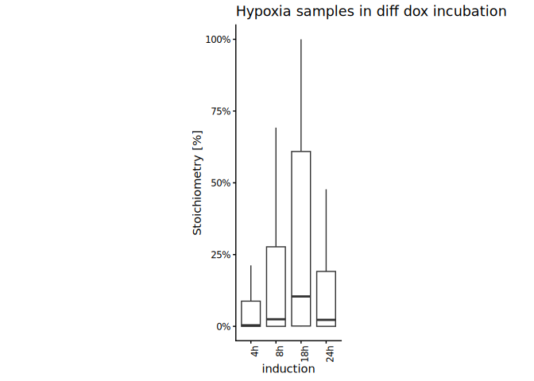<!-- -->

``` r
#--------------------

# Subset normoxia data to >= 0.1
O2_21pc_N01_dt <- long_c_MS_SS_KR_dt[
  oxygen == "21pc" & Stoichiometry >= 0.1
]
  
# Combine subset normoxia 
MS_hypo_Nsub_dt <- rbindlist(list(O2_21pc_N01_dt,
                                     long_c_MS_SS_KR_dt),
                                use.names = TRUE)

# box_plot - Hypoxia samples in diff dox incubation (N =>0.1)
ggplot(
  data = MS_hypo_Nsub_dt[induction != "Inf" & oxygen != "21pc"], 
  aes(
    x = induction,
    y = Stoichiometry
  )
) +
  geom_boxplot(outlier.shape = NA) +
 # facet_grid(~ oxygen)+
  ggtitle("Hypoxia samples in diff dox incubation (N subset)") +
  ylab("Stoichiometry [%] (N =>0.1)") +
  theme_classic()+
  theme(axis.text.x = element_text(angle = 90, hjust = 1)) + 
  theme(legend.position="right") +
  theme(aspect.ratio = 3) +
  scale_y_continuous(labels = scales::percent_format(accuracy = 1))
```

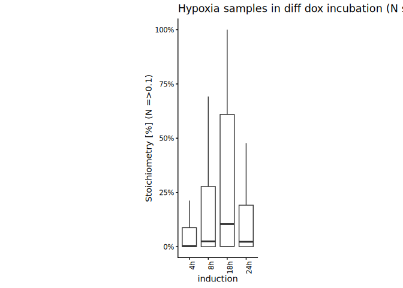<!-- -->

# 2.7.5 XIC values against MS_SS and MS_KR_1 stoichiometry data.

``` r
#-------------
# XIC vs stoic
#-------------

# Load XIC data
xic_MS_SS <- fread(file.path(data.dir, "xic_MS_SS.csv"))

# Merge XIC data and stoichiometry data
xic_stoic <- merge(long_c_MS_SS_KR_dt, 
                   xic_MS_SS,
                   by = c("induction", "oxygen", "gene_name", "aa_pos"))

# Scatter plot - XIC vs stoichiometry
ggplot(
  xic_stoic,
  aes(
    x = XIC,
    y = Stoichiometry
  )
) + 
  geom_point() +
  theme_classic()
```

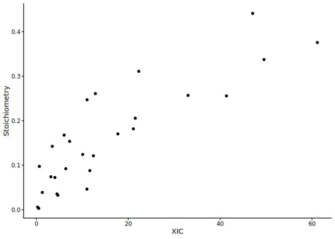<!-- -->

# Session information

``` r
sessioninfo::session_info()
```

    ## ─ Session info ───────────────────────────────────────────────────────────────
    ##  setting  value
    ##  version  R version 4.5.1 (2025-06-13)
    ##  os       Ubuntu 24.04.2 LTS
    ##  system   x86_64, linux-gnu
    ##  ui       X11
    ##  language (EN)
    ##  collate  C.UTF-8
    ##  ctype    C.UTF-8
    ##  tz       Europe/Berlin
    ##  date     2026-02-22
    ##  pandoc   3.4 @ /usr/lib/rstudio-server/bin/quarto/bin/tools/x86_64/ (via rmarkdown)
    ##  quarto   1.6.42 @ /usr/lib/rstudio-server/bin/quarto/bin/quarto
    ## 
    ## ─ Packages ───────────────────────────────────────────────────────────────────
    ##  package           * version    date (UTC) lib source
    ##  BiocGenerics      * 0.54.0     2025-04-15 [1] Bioconduc~
    ##  Biostrings        * 2.76.0     2025-04-15 [1] Bioconduc~
    ##  cellranger          1.1.0      2016-07-27 [1] CRAN (R 4.5.1)
    ##  cli                 3.6.5      2025-04-23 [1] CRAN (R 4.5.1)
    ##  crayon              1.5.3      2024-06-20 [1] CRAN (R 4.5.1)
    ##  data.table        * 1.17.8     2025-07-10 [1] CRAN (R 4.5.1)
    ##  digest              0.6.37     2024-08-19 [1] CRAN (R 4.5.1)
    ##  dplyr             * 1.1.4      2023-11-17 [1] CRAN (R 4.5.1)
    ##  evaluate            1.0.5      2025-08-27 [1] CRAN (R 4.5.1)
    ##  farver              2.1.2      2024-05-13 [1] CRAN (R 4.5.1)
    ##  fastmap             1.2.0      2024-05-15 [1] CRAN (R 4.5.1)
    ##  generics          * 0.1.4      2025-05-09 [1] CRAN (R 4.5.1)
    ##  GenomeInfoDb      * 1.44.3     2025-09-21 [1] Bioconduc~
    ##  GenomeInfoDbData    1.2.14     2025-09-24 [1] Bioconductor
    ##  ggplot2           * 4.0.1      2025-11-14 [1] CRAN (R 4.5.1)
    ##  glue                1.8.0      2024-09-30 [1] CRAN (R 4.5.1)
    ##  gtable              0.3.6      2024-10-25 [1] CRAN (R 4.5.1)
    ##  htmltools           0.5.8.1    2024-04-04 [1] CRAN (R 4.5.1)
    ##  httr                1.4.7      2023-08-15 [1] CRAN (R 4.5.1)
    ##  IRanges           * 2.42.0     2025-04-15 [1] Bioconduc~
    ##  janitor           * 2.2.1      2024-12-22 [1] CRAN (R 4.5.1)
    ##  jsonlite            2.0.0      2025-03-27 [1] CRAN (R 4.5.1)
    ##  khroma            * 1.16.0     2025-02-25 [1] CRAN (R 4.5.1)
    ##  knitr             * 1.50       2025-03-16 [1] CRAN (R 4.5.1)
    ##  labeling            0.4.3      2023-08-29 [1] CRAN (R 4.5.1)
    ##  lifecycle           1.0.4      2023-11-07 [1] CRAN (R 4.5.1)
    ##  lubridate           1.9.4      2024-12-08 [1] CRAN (R 4.5.1)
    ##  magrittr          * 2.0.4      2025-09-12 [1] CRAN (R 4.5.1)
    ##  patchwork           1.3.2      2025-08-25 [1] CRAN (R 4.5.1)
    ##  pillar              1.11.1     2025-09-17 [1] CRAN (R 4.5.1)
    ##  pkgconfig           2.0.3      2019-09-22 [1] CRAN (R 4.5.1)
    ##  ptm.stoichiometry * 0.0.0.9000 2025-12-16 [1] local
    ##  R6                  2.6.1      2025-02-15 [1] CRAN (R 4.5.1)
    ##  RColorBrewer        1.1-3      2022-04-03 [1] CRAN (R 4.5.1)
    ##  readxl            * 1.4.5      2025-03-07 [1] CRAN (R 4.5.1)
    ##  rlang               1.1.6      2025-04-11 [1] CRAN (R 4.5.1)
    ##  rmarkdown           2.29       2024-11-04 [1] CRAN (R 4.5.1)
    ##  rstudioapi          0.17.1     2024-10-22 [1] CRAN (R 4.5.1)
    ##  S4Vectors         * 0.46.0     2025-04-15 [1] Bioconduc~
    ##  S7                  0.2.0      2024-11-07 [1] CRAN (R 4.5.1)
    ##  scales              1.4.0      2025-04-24 [1] CRAN (R 4.5.1)
    ##  sessioninfo         1.2.3      2025-02-05 [1] CRAN (R 4.5.1)
    ##  snakecase           0.11.1     2023-08-27 [1] CRAN (R 4.5.1)
    ##  stringi             1.8.7      2025-03-27 [1] CRAN (R 4.5.1)
    ##  stringr           * 1.5.2      2025-09-08 [1] CRAN (R 4.5.1)
    ##  tibble              3.3.0      2025-06-08 [1] CRAN (R 4.5.1)
    ##  tidyselect          1.2.1      2024-03-11 [1] CRAN (R 4.5.1)
    ##  timechange          0.3.0      2024-01-18 [1] CRAN (R 4.5.1)
    ##  UCSC.utils          1.4.0      2025-04-15 [1] Bioconduc~
    ##  vctrs               0.6.5      2023-12-01 [1] CRAN (R 4.5.1)
    ##  withr               3.0.2      2024-10-28 [1] CRAN (R 4.5.1)
    ##  xfun                0.53       2025-08-19 [1] CRAN (R 4.5.1)
    ##  XVector           * 0.48.0     2025-04-15 [1] Bioconduc~
    ##  yaml                2.3.10     2024-07-26 [1] CRAN (R 4.5.1)
    ## 
    ##  [1] /home/pkesava/R/x86_64-pc-linux-gnu-library/4.5
    ##  [2] /usr/local/lib/R/site-library
    ##  [3] /usr/lib/R/site-library
    ##  [4] /usr/lib/R/library
    ##  * ── Packages attached to the search path.
    ## 
    ## ──────────────────────────────────────────────────────────────────────────────
