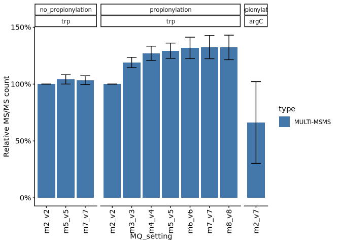
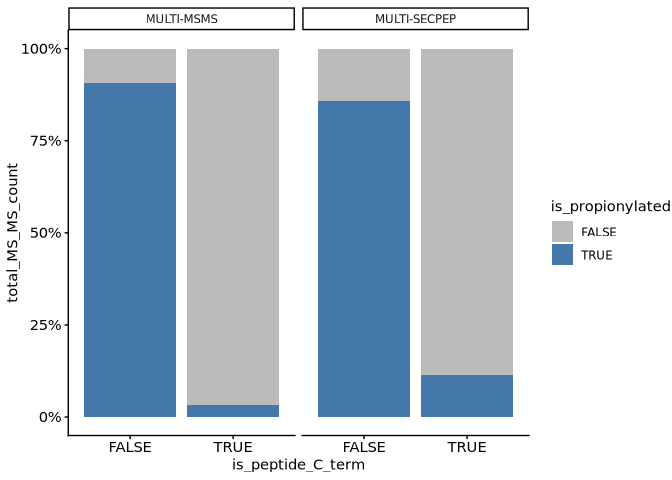
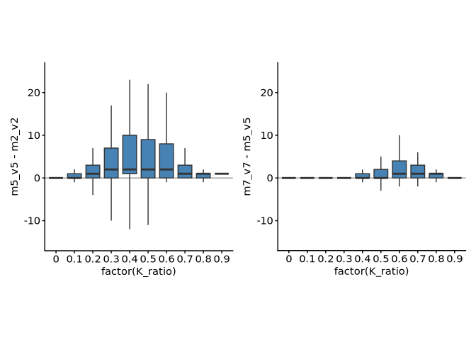
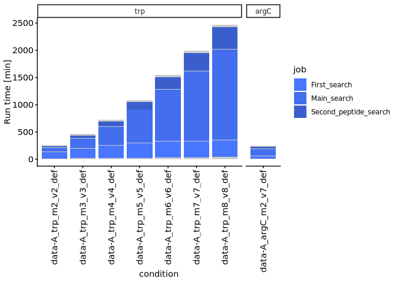
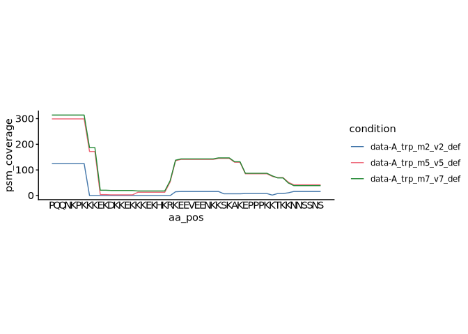
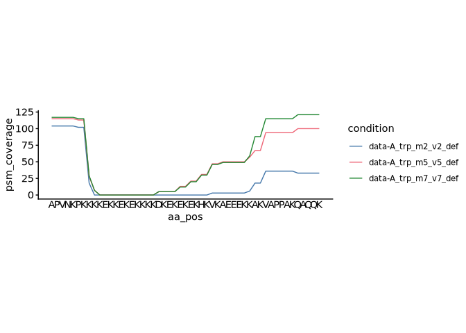
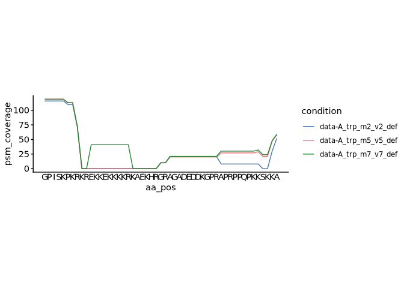

p2-02 · Optimise database search
================
Yoichiro Sugimoto and Pallavi Kesavan
26 August, 2026

- <a href="#overview" id="toc-overview">Overview</a>
- <a href="#setup" id="toc-setup">Setup</a>
- <a href="#import-data" id="toc-import-data">Import data</a>
- <a href="#helper-functions" id="toc-helper-functions">Helper
  functions</a>
- <a href="#msms-counts-by-setting" id="toc-msms-counts-by-setting">MS/MS
  counts by setting</a>
- <a href="#propionylation-position-qc"
  id="toc-propionylation-position-qc">Propionylation position QC</a>
- <a href="#coverage-by-k-score" id="toc-coverage-by-k-score">Coverage by
  K score</a>
- <a href="#runtime-by-setting" id="toc-runtime-by-setting">Runtime by
  setting</a>
- <a href="#brd234-coverage" id="toc-brd234-coverage">BRD2/3/4
  coverage</a>
- <a href="#notes" id="toc-notes">Notes</a>
- <a href="#session-information" id="toc-session-information">Session
  information</a>

# Overview

**Purpose:** Determine optimal MaxQuant database-search settings for
lysine-derivatised samples — effect of miscleavages and modifications on
MS/MS counts, coverage of lysine-rich regions, and runtime.

**Inputs:** MaxQuant evidence / runtime / mqpar under
`data/MQ_Std/PNAS2022/`; protein feature data.

**Outputs:** figures (rendered on knit).

**Upstream:** p2-01. **Downstream:** none.

# Setup

``` r
## Resolve the repository root (via the .here sentinel) and load the shared
## setup: packages, helper functions, ggplot/knitr settings, and project paths.
repo_root <- local({
  p <- normalizePath(getwd(), winslash = "/", mustWork = FALSE)
  while (!file.exists(file.path(p, ".here")) && !identical(dirname(p), p)) p <- dirname(p)
  p
})
source(file.path(repo_root, "R", "functions", "_setup.R"))

## Script-specific packages and the results subdirectory used throughout
library("RColorBrewer")
library("patchwork")
p2_results_dir <- file.path(results.dir, "p2-analysis-setting")
```

# Import data

Loads the sample run-info table, the protein feature data, and the
reference proteome used in the comparisons below.

``` r
# Sample run info (one row per run); data.dir is defined in _setup.R
all_sample_run_info <- read_excel(
  file.path(data.dir, "analysis_setting", "PXD031221_sample_matrix.xlsx"),
  sheet = "MQ_Std"
) %>% data.table

# Protein feature data, harmonised to the shared column names
protein_feature_dt <- fread(
  file.path(data.dir, "processed_data_from_PNAS2022/all_protein_feature_per_position.csv")
)
setnames(
  protein_feature_dt,
  old = c("uniprot_id", "position"),
  new = c("protein_accession", "aa_pos")
)
```

# Helper functions

Readers and the coverage-plot helper used by the analysis chunks below.

``` r
# Read a processed evidence table (MULTI-MSMS + MULTI-SECPEP search). Returns an
# empty data.table if the file is missing so missing runs are skipped silently.
read_evidence <- function(prefix, dir_path) {
  input_file <- file.path(
    dir_path, paste0("including_SECPEP_", prefix, "all_processed_evidence_data.csv")
  )
  if (file.exists(input_file)) {
    dt <- fread(input_file)
    dt[, condition := gsub("_$", "", prefix)]
  } else {
    dt <- data.table()
  }
  dt
}

# Read a per-position table from the MULTI-MSMS + MULTI-SECPEP search
read_per_pos_secpep <- function(prefix, dir_path) {
  dt <- fread(file.path(dir_path, paste0("including_SECPEP_", prefix, "all_per_pos_data.csv")))
  dt[, condition := gsub("_$", "", prefix)]
  dt
}

# Read a MaxQuant runtime table, tidy its column/job names, and relabel the
# search-stage jobs to publication-friendly names.
read_runtime_data <- function(prefix, dir_path) {
  mq_setting <- gsub("_$", "", sub("^data-[^_]+_", "", prefix))
  dt <- fread(file.path(dir_path, mq_setting, paste0(prefix, "runningTimes.txt")))
  dt[, condition := gsub("_$", "", prefix)]

  dt <- janitor::clean_names(dt)
  dt[, job := janitor::clean_names(setNames(nm = job)) %>% names %>% as.character]

  dt[, job := dplyr::case_when(
    job == "ms_ms_first_search"     ~ "First_search",
    job == "ms_ms_main_search"      ~ "Main_search",
    job == "second_peptide_search"  ~ "Second_peptide_search",
    TRUE ~ job
  )]
  dt
}

# Plot per-position PSM coverage of an accession across the m2/m5/m7 settings
plot_coverage <- function(stoichiometry_data, accession, plot_range) {
  coverage_dt <- lapply(
    c("data-A_trp_m2_v2_def", "data-A_trp_m5_v5_def", "data-A_trp_m7_v7_def"),
    function(setting) {
      preprocess_stoichiometry_data_for_plotting(
        stoichiometry_data = stoichiometry_data[
          sample_name == "JQ1_HeLaWT_derivatised" & condition == setting
        ],
        accession      = accession,
        plot_range     = plot_range,
        all.protein.bs = all.protein.bs
      )$coverage_data %>%
        {.[, condition := setting]}
    }
  ) %>% rbindlist

  ggplot(
    coverage_dt,
    aes(x = aa_pos, y = psm_coverage, color = condition)
  ) +
    geom_line() +
    scale_x_continuous(
      breaks = plot_range[1]:plot_range[2],
      labels = all.protein.bs[
        str_split_fixed(names(all.protein.bs), "\\|", n = 3)[, 2] == accession
      ] %>%
        {strsplit(as.character(.), "")[[1]]} %>%
        {.[plot_range[1]:plot_range[2]]}   # amino-acid residues as axis labels
    ) +
    scale_color_bright() +
    theme(axis.ticks.x = element_blank(), aspect.ratio = 0.3)
}
```

# MS/MS counts by setting

Compares the number of MS/MS identifications obtained under each
MaxQuant search setting.

``` r
# Benchmark the search settings on data-A and data-D to compare BRD datasets with or without derivatisation
evidence_dt <- lapply(
  all_sample_run_info[data %in% c("data-A", "data-D") & !is.na(prefix), prefix],
  read_evidence,
  dir_path = file.path(p2_results_dir, "MQ_Std_MSMS_SECPEP")
) %>% rbindlist

data_count_dt <- evidence_dt[, list(
  total_peptide_count = .N,                 # number of peptides
  total_msms_count    = sum(psm_mapped),    # mapped PSMs
  total_intensity     = sum(peak_intensity)
), by = list(file_name, sample_name, condition, type)]

data_count_dt[, `:=`(
  propionylation = case_when(
    grepl("^data-D", condition) ~ "no_propionylation",
    TRUE ~ "propionylation"
  ),
  MQ_setting       = str_extract(condition, "m\\d+_v\\d+"),
  protease_setting = str_split_fixed(condition, "_", n = 3)[, 2]
)]

# Counts relative to the m2_v2 / MULTI-MSMS baseline of each file
data_col <- c("total_peptide_count", "total_msms_count", "total_intensity")

m2_v2_dt <- data_count_dt[
  MQ_setting == "m2_v2" & type == "MULTI-MSMS"
][, c("file_name", data_col), with = FALSE]
setnames(m2_v2_dt, old = data_col, new = paste0("m2_v2_", data_col))

rel_count_dt <- merge(data_count_dt, m2_v2_dt, by = "file_name")

rel_count_dt[, `:=`(
  rel_total_peptide_count = total_peptide_count / m2_v2_total_peptide_count,
  rel_msms_count          = total_msms_count / m2_v2_total_msms_count,
  rel_intensity           = total_intensity / m2_v2_total_intensity
)]

rel_count_dt[type == "MULTI-MSMS", .N, by = list(propionylation, MQ_setting, protease_setting, type)]
```

    ##        propionylation MQ_setting protease_setting       type     N
    ##                <char>     <char>           <char>     <char> <int>
    ##  1:    propionylation      m2_v2              trp MULTI-MSMS    10
    ##  2:    propionylation      m3_v3              trp MULTI-MSMS    10
    ##  3:    propionylation      m4_v4              trp MULTI-MSMS    10
    ##  4:    propionylation      m5_v5              trp MULTI-MSMS    10
    ##  5:    propionylation      m6_v6              trp MULTI-MSMS    10
    ##  6:    propionylation      m7_v7              trp MULTI-MSMS    10
    ##  7:    propionylation      m8_v8              trp MULTI-MSMS    10
    ##  8:    propionylation      m2_v7             argC MULTI-MSMS    10
    ##  9: no_propionylation      m2_v2              trp MULTI-MSMS     6
    ## 10: no_propionylation      m5_v5              trp MULTI-MSMS     6
    ## 11: no_propionylation      m7_v7              trp MULTI-MSMS     6

``` r
rel_count_dt[, .N, by = list(propionylation, MQ_setting, protease_setting, type)]
```

    ##        propionylation MQ_setting protease_setting         type     N
    ##                <char>     <char>           <char>       <char> <int>
    ##  1:    propionylation      m2_v2              trp   MULTI-MSMS    10
    ##  2:    propionylation      m2_v2              trp MULTI-SECPEP    10
    ##  3:    propionylation      m3_v3              trp   MULTI-MSMS    10
    ##  4:    propionylation      m3_v3              trp MULTI-SECPEP    10
    ##  5:    propionylation      m4_v4              trp   MULTI-MSMS    10
    ##  6:    propionylation      m4_v4              trp MULTI-SECPEP    10
    ##  7:    propionylation      m5_v5              trp   MULTI-MSMS    10
    ##  8:    propionylation      m5_v5              trp MULTI-SECPEP    10
    ##  9:    propionylation      m6_v6              trp   MULTI-MSMS    10
    ## 10:    propionylation      m6_v6              trp MULTI-SECPEP    10
    ## 11:    propionylation      m7_v7              trp   MULTI-MSMS    10
    ## 12:    propionylation      m7_v7              trp MULTI-SECPEP    10
    ## 13:    propionylation      m8_v8              trp   MULTI-MSMS    10
    ## 14:    propionylation      m8_v8              trp MULTI-SECPEP    10
    ## 15:    propionylation      m2_v7             argC   MULTI-MSMS    10
    ## 16:    propionylation      m2_v7             argC MULTI-SECPEP    10
    ## 17: no_propionylation      m2_v2              trp   MULTI-MSMS     6
    ## 18: no_propionylation      m2_v2              trp MULTI-SECPEP     6
    ## 19: no_propionylation      m5_v5              trp   MULTI-MSMS     6
    ## 20: no_propionylation      m5_v5              trp MULTI-SECPEP     6
    ## 21: no_propionylation      m7_v7              trp   MULTI-MSMS     6
    ## 22: no_propionylation      m7_v7              trp MULTI-SECPEP     6
    ##        propionylation MQ_setting protease_setting         type     N
    ##                <char>     <char>           <char>       <char> <int>

``` r
rel_count_stat_dt <- rel_count_dt[, list(
  mean_rel_total_peptide_count = mean(rel_total_peptide_count),
  sd_rel_total_peptide_count   = sd(rel_total_peptide_count),
  mean_rel_msms_count          = mean(rel_msms_count),
  sd_rel_msms_count            = sd(rel_msms_count),
  mean_rel_intensity           = mean(rel_intensity),
  sd_rel_intensity             = sd(rel_intensity)
), by = list(propionylation, MQ_setting, protease_setting, type)]

rel_count_stat_dt[, `:=`(
  protease_setting = factor(protease_setting, levels = c("trp", "argC")),
  type             = factor(type, levels = c("MULTI-MSMS", "MULTI-SECPEP"))
)]

ggplot(
  rel_count_stat_dt[type == "MULTI-MSMS"],
  aes(x = MQ_setting, y = mean_rel_msms_count, fill = type)
) +
  geom_bar(stat = "identity") +
  geom_errorbar(aes(
    ymin = mean_rel_msms_count - sd_rel_msms_count,
    ymax = mean_rel_msms_count + sd_rel_msms_count
  ), width = 0.5, position = position_dodge(width = 0.9)) +
  facet_grid(~ propionylation + protease_setting, scales = "free", space = "free") +
  scale_y_continuous(labels = scales::percent_format(accuracy = 1)) +
  scale_x_discrete(guide = guide_axis(angle = 90)) +
  ylab("Relative MS/MS count") +
  scale_fill_manual(values = c("MULTI-MSMS" = "#4477AA")) #+
```

<!-- -->

``` r
# scale_color_manual(values = c("MULTI-MSMS" = "#4477AA", "MULTI-SECPEP" = "#66CCEE"))
```

The results indicate that the setting with 7 miscleavage and 7 variable
modifications identify the highest MS/MS count.

# Propionylation position QC

Quality control: checks the positional distribution of propionylated
lysines, confirming efficient lysine derivatisation.

``` r
# QC uses data-A searched with m7_v7 (7 miscleavages).
all_per_pos_secpep_dt <- lapply(
  all_sample_run_info[data %in% c("data-A") & grepl("m7_v7", prefix) & !is.na(prefix), prefix],
  read_per_pos_secpep,
  dir_path = file.path(p2_results_dir, "MQ_Std_MSMS_SECPEP")
) %>% rbindlist

all_per_pos_secpep_dt[, `:=`(
  propionylation = case_when(
    grepl("^data-D", condition) ~ "no_propionylation",
    TRUE ~ "propionylation"
  ),
  MQ_setting        = str_extract(condition, "m\\d+_v\\d+"),
  protease_setting  = str_split_fixed(condition, "_", n = 3)[, 2],
  is_peptide_C_term = peptide_end == aa_pos,
  is_propionylated  = ptm %in% c("[Propionylation]", "[Oxidised Propionylation]")
)]

all_per_k_pos_secpep_dt <- all_per_pos_secpep_dt[aa == "K"]

propionylated_k_count_dt <- all_per_k_pos_secpep_dt[
  , list(total_MS_MS_count = sum(psm_mapped)),
  by = list(is_propionylated, is_peptide_C_term, type)
]

propionylated_k_count_dt
```

    ##    is_propionylated is_peptide_C_term         type total_MS_MS_count
    ##              <lgcl>            <lgcl>       <char>             <int>
    ## 1:            FALSE             FALSE MULTI-SECPEP               272
    ## 2:             TRUE             FALSE MULTI-SECPEP              1652
    ## 3:            FALSE              TRUE MULTI-SECPEP               273
    ## 4:             TRUE             FALSE   MULTI-MSMS            180191
    ## 5:            FALSE              TRUE   MULTI-MSMS             33088
    ## 6:            FALSE             FALSE   MULTI-MSMS             18788
    ## 7:             TRUE              TRUE   MULTI-MSMS              1124
    ## 8:             TRUE              TRUE MULTI-SECPEP                35

``` r
ggplot(
  propionylated_k_count_dt,
  aes(x = is_peptide_C_term, y = total_MS_MS_count, fill = is_propionylated)
) +
  geom_bar(stat = "identity", position = "fill") +
  scale_fill_manual(values = c("TRUE" = "#4477AA", "FALSE" = "#BBBBBB")) +
  facet_grid(~ type) +
  scale_y_continuous(labels = scales::percent_format(accuracy = 1))
```

<!-- -->

Based on the analyses here, we decided to focus on using MULTI-MSMS
data.

# Coverage by K score

Examines how the search settings change coverage as a function of lysine
richness (K score).

``` r
kscore_stoic_dt <- lapply(
  all_sample_run_info[
    data != "data-D" &
      grepl("_trp_", prefix) &
      !grepl("including_SECPEP", prefix) &
      grepl("m[257]_v[257]_(def|mCC)", prefix) &
      !is.na(prefix), prefix
  ],
  read_stoic_data,
  dir_path = file.path(p2_results_dir, "MQ_Std_MSMS")
) %>% rbindlist

kscore_stoic_dt[, MQ_setting := str_extract(condition, "m\\d+_v\\d+")]

ms_ms_count_dt <- kscore_stoic_dt[
  , list(total_ms_ms_count = sum(sum_psm_mapped)),
  by = list(protein_accession, aa_pos, MQ_setting)
]

ms_ms_count_dt <- merge(
  ms_ms_count_dt,
  protein_feature_dt[, .(protein_accession, aa_pos, K_ratio, K_ratio_score, IUPRED2)],
  by = c("protein_accession", "aa_pos")
)

# One column of MS/MS counts per setting (wide form)
ms_ms_count_wide_dt <- dcast(
  copy(ms_ms_count_dt)[, IUPRED2 := NULL],
  protein_accession + aa_pos + K_ratio + K_ratio_score ~ MQ_setting,
  value.var = "total_ms_ms_count", fill = 0
)

ms_ms_count_wide_dt[, table(K_ratio)]
```

    ## K_ratio
    ##      0    0.1    0.2    0.3    0.4    0.5    0.6    0.7    0.8    0.9 
    ## 281712 188153  76269  24156   7014   2074    604    221     60     10

``` r
p1 <- ggplot(
  ms_ms_count_wide_dt[order(K_ratio)],
  aes(x = m2_v2, y = m5_v5)
) +
  geom_abline(slope = 1, intercept = 0, color = "gray60") +
  geom_point() +
  coord_cartesian(xlim = c(0, 1000), ylim = c(0, 1000)) +
  theme(aspect.ratio = 1)

p2 <- ggplot(
  ms_ms_count_wide_dt[order(K_ratio)],
  aes(x = m5_v5, y = m7_v7)
) +
  geom_abline(slope = 1, intercept = 0, color = "gray60") +
  geom_point() +
  coord_cartesian(xlim = c(0, 1000), ylim = c(0, 1000)) +
  theme(aspect.ratio = 1)

p1 + p2
```

<!-- -->

``` r
p3 <- ggplot(
  ms_ms_count_wide_dt,
  aes(x = factor(K_ratio), y = m5_v5 - m2_v2)
) +
  geom_hline(yintercept = 0, color = "gray60") +
  geom_boxplot(outlier.shape = NA, fill = "steelblue") +
  coord_cartesian(ylim = c(-15, 25)) +
  theme(aspect.ratio = 1)

p4 <- ggplot(
  ms_ms_count_wide_dt,
  aes(x = factor(K_ratio), y = m7_v7 - m5_v5)
) +
  geom_hline(yintercept = 0, color = "gray60") +
  geom_boxplot(outlier.shape = NA, fill = "steelblue") +
  coord_cartesian(ylim = c(-15, 25))

p3 + p4
```

<!-- -->

# Runtime by setting

Compares MaxQuant search runtime across the settings.

``` r
# Prefixes for the data-A runtime comparison (reused for the condition factor)
runtime_prefixes <- all_sample_run_info[
  data == "data-A" &
    !grepl("including_SECPEP", prefix) &
    grepl("m[2-8]_v[2-8]_(def|mCC)", prefix) &
    !is.na(prefix), prefix
]

all_runtime_dt <- lapply(
  runtime_prefixes,
  read_runtime_data,
  dir_path = file.path(data.dir, "MQ_Std/PNAS2022/data-A")
) %>% rbindlist

job_names <- all_runtime_dt[, unique(job)]

all_runtime_dt[, `:=`(
  job       = factor(job, levels = rev(job_names)),
  condition = factor(condition, levels = gsub("_$", "", runtime_prefixes))
)]

all_runtime_dt[, protease_setting :=
  str_split_fixed(condition, "_", n = 5)[, 2] %>% factor(levels = c("trp", "argC"))
]

runtime_plot_colors <- setNames(rep("gray80", length(job_names)), nm = job_names)
runtime_plot_colors[c("First_search", "Main_search", "Second_peptide_search")] <-
  c("royalblue1", "royalblue2", "royalblue3")

ggplot(
  all_runtime_dt,
  aes(x = condition, y = running_time_min, fill = job),
  color = NA
) +
  geom_bar(stat = "identity") +
  scale_fill_manual(
    breaks = c("First_search", "Main_search", "Second_peptide_search"),
    values = runtime_plot_colors
  ) +
  facet_grid(~ protease_setting, scales = "free_x", space = "free") +
  scale_x_discrete(guide = guide_axis(angle = 90)) +
  ylab("Run time [min]")
```

    ## Warning in fortify(data, ...): Arguments in `...` must be used.
    ## ✖ Problematic argument:
    ## • color = NA
    ## ℹ Did you misspell an argument name?

<!-- -->

# BRD2/3/4 coverage

Coverage of the lysine-rich regions of BRD2, BRD3 and BRD4 under each
setting.

``` r
coverage_stoic_dt <- lapply(
  all_sample_run_info[
    data == "data-A" &
      grepl("_trp_", prefix) &
      !grepl("including_SECPEP", prefix) &
      grepl("m[257]_v[257]_(def|mCC)", prefix) &
      !is.na(prefix), prefix
  ],
  read_stoic_data,
  dir_path = file.path(p2_results_dir, "MQ_Std_MSMS")
) %>% rbindlist

# BRD4
plot_coverage(coverage_stoic_dt, accession = "O60885", plot_range = c(531, 581))
```

<!-- -->

``` r
# BRD3
plot_coverage(coverage_stoic_dt, accession = "Q15059", plot_range = c(483, 533))
```

<!-- -->

``` r
# BRD2
plot_coverage(coverage_stoic_dt, accession = "P25440", plot_range = c(540, 590))
```

<!-- -->

# Notes

The following sites were identified by non-unique peptides (therefore
total number used here is 153 instead of 150 in the paper).

           Accession position curated_oxK_site    screen

1: Q14331\|FRG1_HUMAN 27 JMJD6_substrate FLAGJMJD6 2: Q14331\|FRG1_HUMAN
29 JMJD6_substrate FLAGJMJD6 3: Q14331\|FRG1_HUMAN 30 JMJD6_substrate
FLAGJMJD6 4: Q9UQ35\|SRRM2_HUMAN 241 JMJD6_substrate FLAGJMJD6 5:
Q9UQ35\|SRRM2_HUMAN 243 JMJD6_substrate FLAGJMJD6 6: Q9UQ35\|SRRM2_HUMAN
244 JMJD6_substrate FLAGJMJD6

In the end, 91% of hydroxylated sites were covered by the data, and 80%
(120 / 150) of reported hydroxylation sites were identified by this
workflow.

# Session information

``` r
sessioninfo::session_info()
```

    ## ─ Session info ───────────────────────────────────────────────────────────────
    ##  setting  value
    ##  version  R version 4.5.0 (2025-04-11)
    ##  os       Red Hat Enterprise Linux 9.6 (Plow)
    ##  system   x86_64, linux-gnu
    ##  ui       X11
    ##  language (EN)
    ##  collate  en_US.UTF-8
    ##  ctype    en_US.UTF-8
    ##  tz       Europe/Berlin
    ##  date     2026-08-26
    ##  pandoc   2.19.2 @ /gnu/store/sqwwnsp5xb8yd3z1a57lhldcsvx3z9gb-profile/bin/ (via rmarkdown)
    ##  quarto   NA
    ## 
    ## ─ Packages ───────────────────────────────────────────────────────────────────
    ##  ! package           * version    date (UTC) lib source
    ##  P AnnotationDbi     * 1.72.0     2025-10-29 [?] Bioconduc~
    ##  P Biobase           * 2.70.0     2025-10-29 [?] Bioconduc~
    ##  P BiocGenerics      * 0.56.0     2025-10-29 [?] Bioconduc~
    ##  P BiocManager         1.30.27    2025-11-14 [?] CRAN (R 4.5.0)
    ##  P Biostrings        * 2.78.0     2025-10-29 [?] Bioconduc~
    ##  P bit                 4.6.0      2025-03-06 [?] CRAN (R 4.5.0)
    ##  P bit64               4.8.2      2026-05-19 [?] CRAN (R 4.5.0)
    ##  P blob                1.3.0      2026-01-14 [?] CRAN (R 4.5.0)
    ##  P cachem              1.1.0      2024-05-16 [?] CRAN (R 4.5.0)
    ##  P cellranger          1.1.0      2016-07-27 [?] CRAN (R 4.5.0)
    ##  P cli                 3.6.6      2026-04-09 [?] CRAN (R 4.5.0)
    ##  P colourpicker        1.3.0      2023-08-21 [?] CRAN (R 4.5.0)
    ##  P crayon              1.5.3      2024-06-20 [?] CRAN (R 4.5.0)
    ##  P data.table        * 1.18.4     2026-05-06 [?] CRAN (R 4.5.0)
    ##  P DBI                 1.3.0      2026-02-25 [?] CRAN (R 4.5.0)
    ##  P digest              0.6.39     2025-11-19 [?] CRAN (R 4.5.0)
    ##  P dplyr             * 1.2.1      2026-04-03 [?] CRAN (R 4.5.0)
    ##  P evaluate            1.0.5      2025-08-27 [?] CRAN (R 4.5.0)
    ##  P farver              2.1.2      2024-05-13 [?] CRAN (R 4.5.0)
    ##  P fastmap             1.2.0      2024-05-15 [?] CRAN (R 4.5.0)
    ##  P formattable         0.2.1      2021-01-07 [?] CRAN (R 4.5.0)
    ##  P generics          * 0.1.4      2025-05-09 [?] CRAN (R 4.5.0)
    ##  P ggplot2           * 4.0.3      2026-04-22 [?] CRAN (R 4.5.0)
    ##  P glue                1.8.1      2026-04-17 [?] CRAN (R 4.5.0)
    ##  P gridExtra           2.3        2017-09-09 [?] CRAN (R 4.5.0)
    ##  P gtable              0.3.6      2024-10-25 [?] CRAN (R 4.5.0)
    ##  P htmltools           0.5.9      2025-12-04 [?] CRAN (R 4.5.0)
    ##  P htmlwidgets         1.6.4      2023-12-06 [?] CRAN (R 4.5.0)
    ##  P httpuv              1.6.17     2026-03-18 [?] CRAN (R 4.5.0)
    ##  P httr                1.4.8      2026-02-13 [?] CRAN (R 4.5.0)
    ##  P IRanges           * 2.44.0     2025-10-29 [?] Bioconduc~
    ##  P janitor             2.2.1      2024-12-22 [?] CRAN (R 4.5.0)
    ##  P jsonlite            2.0.0      2025-03-27 [?] CRAN (R 4.5.0)
    ##  P KEGGREST            1.50.0     2025-10-29 [?] Bioconduc~
    ##  P khroma            * 1.17.0     2025-09-29 [?] CRAN (R 4.5.0)
    ##  P knitr             * 1.51       2025-12-20 [?] CRAN (R 4.5.0)
    ##  P labeling            0.4.3      2023-08-29 [?] CRAN (R 4.5.0)
    ##  P later               1.4.8      2026-03-05 [?] CRAN (R 4.5.0)
    ##  P lattice             0.22-9     2026-02-09 [?] CRAN (R 4.5.0)
    ##  P lazyeval            0.2.3      2026-04-04 [?] CRAN (R 4.5.0)
    ##  P lifecycle           1.0.5      2026-01-08 [?] CRAN (R 4.5.0)
    ##  P lubridate           1.9.5      2026-02-04 [?] CRAN (R 4.5.0)
    ##  P magrittr          * 2.0.5      2026-04-04 [?] CRAN (R 4.5.0)
    ##  P Matrix              1.7-5      2026-03-21 [?] CRAN (R 4.5.0)
    ##  P memoise             2.0.1      2021-11-26 [?] CRAN (R 4.5.0)
    ##  P mgcv              * 1.9-4      2025-11-07 [?] CRAN (R 4.5.0)
    ##  P mime                0.13       2025-03-17 [?] CRAN (R 4.5.0)
    ##  P miniUI              0.1.2      2025-04-17 [?] CRAN (R 4.5.0)
    ##  P nlme              * 3.1-169    2026-03-27 [?] CRAN (R 4.5.0)
    ##  P org.Hs.eg.db      * 3.22.0     2026-06-24 [?] Bioconductor
    ##  P otel                0.2.0      2025-08-29 [?] CRAN (R 4.5.0)
    ##  P patchwork         * 1.3.2      2025-08-25 [?] CRAN (R 4.5.0)
    ##  P pillar              1.11.1     2025-09-17 [?] CRAN (R 4.5.0)
    ##  P pkgconfig           2.0.3      2019-09-22 [?] CRAN (R 4.5.0)
    ##  P plotly              4.12.0     2026-01-24 [?] CRAN (R 4.5.0)
    ##  P plyr                1.8.9      2023-10-02 [?] CRAN (R 4.5.0)
    ##  P png                 0.1-9      2026-03-15 [?] CRAN (R 4.5.0)
    ##  P promises            1.5.0      2025-11-01 [?] CRAN (R 4.5.0)
    ##    ptm.stoichiometry * 0.0.0.9000 2026-06-24 [1] local (/fast/AG_Sugimoto/home/users/yoichiro/projects/ptm.stoichiometry)
    ##  P purrr               1.2.2      2026-04-10 [?] CRAN (R 4.5.0)
    ##  P R6                  2.6.1      2025-02-15 [?] CRAN (R 4.5.0)
    ##  P RColorBrewer      * 1.1-3      2022-04-03 [?] CRAN (R 4.5.0)
    ##  P Rcpp                1.1.1-1.1  2026-04-24 [?] CRAN (R 4.5.0)
    ##  P readxl            * 1.5.0      2026-05-16 [?] CRAN (R 4.5.0)
    ##    renv                1.1.5      2025-07-24 [1] CRAN (R 4.5.0)
    ##  P rlang               1.2.0      2026-04-06 [?] CRAN (R 4.5.0)
    ##  P rmarkdown           2.31       2026-03-26 [?] CRAN (R 4.5.0)
    ##  P RSQLite             3.53.2     2026-06-17 [?] CRAN (R 4.5.0)
    ##  P S4Vectors         * 0.48.1     2026-04-05 [?] Bioconduc~
    ##  P S7                  0.2.2      2026-04-22 [?] CRAN (R 4.5.0)
    ##  P scales              1.4.0      2025-04-24 [?] CRAN (R 4.5.0)
    ##  P Seqinfo           * 1.0.0      2025-10-29 [?] Bioconduc~
    ##  P sessioninfo         1.2.4      2026-06-04 [?] CRAN (R 4.5.0)
    ##  P shiny               1.14.0     2026-06-21 [?] CRAN (R 4.5.0)
    ##  P shinythemes         1.2.0      2021-01-25 [?] CRAN (R 4.5.0)
    ##  P snakecase           0.11.1     2023-08-27 [?] CRAN (R 4.5.0)
    ##  P stringi             1.8.7      2025-03-27 [?] CRAN (R 4.5.0)
    ##  P stringr           * 1.6.0      2025-11-04 [?] CRAN (R 4.5.0)
    ##    subcellularvis    * 0.0.0.9000 2026-06-24 [1] local (/fast/AG_Sugimoto/home/users/yoichiro/software/R_packages/subcellularvis)
    ##  P tibble              3.3.1      2026-01-11 [?] CRAN (R 4.5.0)
    ##  P tidyr               1.3.2      2025-12-19 [?] CRAN (R 4.5.0)
    ##  P tidyselect          1.2.1      2024-03-11 [?] CRAN (R 4.5.0)
    ##  P timechange          0.4.0      2026-01-29 [?] CRAN (R 4.5.0)
    ##  P UpSetR              1.4.1      2026-05-25 [?] CRAN (R 4.5.0)
    ##  P vctrs               0.7.3      2026-04-11 [?] CRAN (R 4.5.0)
    ##  P viridisLite         0.4.3      2026-02-04 [?] CRAN (R 4.5.0)
    ##  P withr               3.0.3      2026-06-19 [?] CRAN (R 4.5.0)
    ##  P xfun                0.59       2026-06-19 [?] CRAN (R 4.5.0)
    ##  P xtable              1.8-8      2026-02-22 [?] CRAN (R 4.5.0)
    ##  P XVector           * 0.50.0     2025-10-29 [?] Bioconduc~
    ##  P yaml                2.3.12     2025-12-10 [?] CRAN (R 4.5.0)
    ## 
    ##  [1] /fast/AG_Sugimoto/home/users/yoichiro/projects/20241111_PTMs_in_lysine_rich_domains/renv/library/linux-rhel-9.6/R-4.5/x86_64-unknown-linux-gnu
    ##  [2] /fast/home/y/ysugimo/.cache/R/renv/sandbox/linux-rhel-9.6/R-4.5/x86_64-unknown-linux-gnu/cb72a45c
    ## 
    ##  * ── Packages attached to the search path.
    ##  P ── Loaded and on-disk path mismatch.
    ## 
    ## ──────────────────────────────────────────────────────────────────────────────
