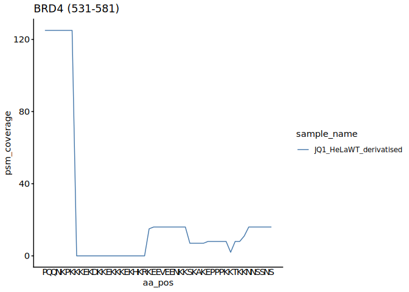
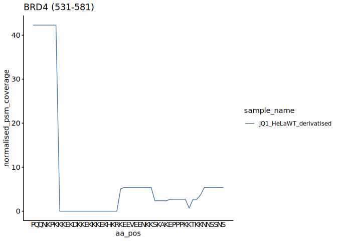
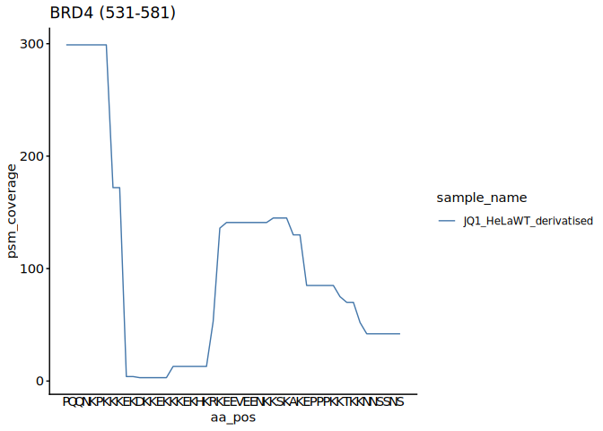
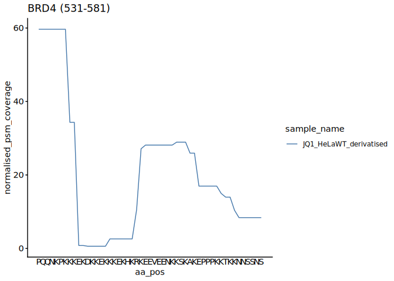
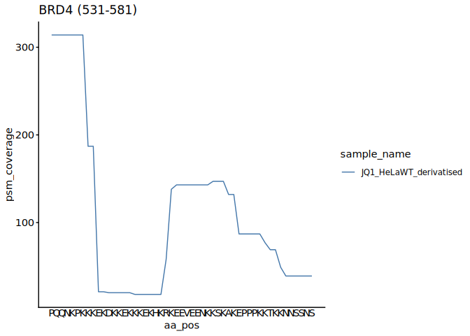
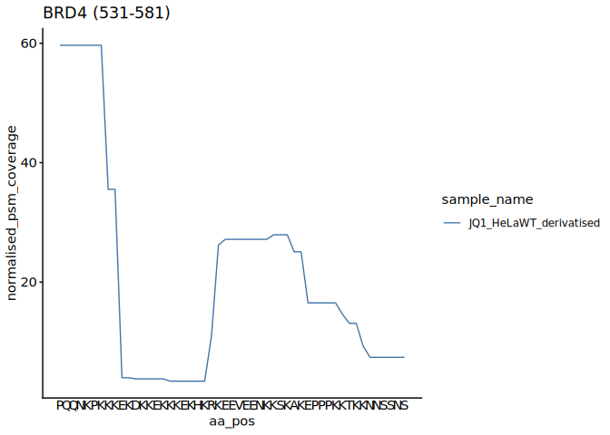
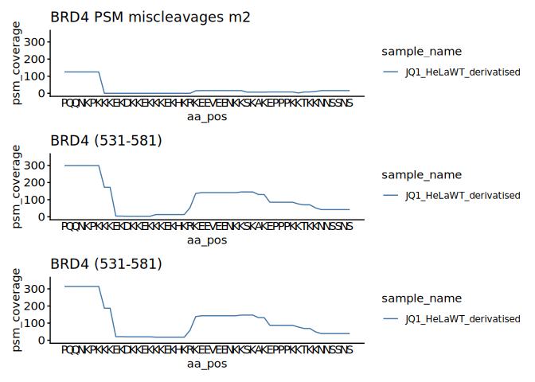
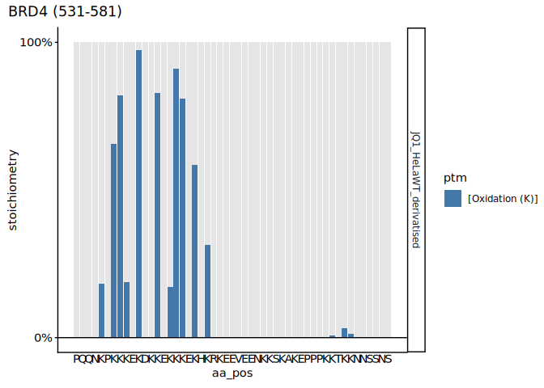

p2-03 · Compare miscleavage settings
================
Yoichiro Sugimoto and Pallavi Kesavan
18 June, 2026

- [Overview](#overview)
- [Setup](#setup)
- [PSM coverage by miscleavage](#psm-coverage-by-miscleavage)
- [Session information](#session-information)

# Overview

**Purpose:** Compare PSM coverage of lysine-rich domains across
miscleavage settings (m2 / m5 / m7).

**Inputs:** stoichiometry tables from p2-01
(`results/p2-analysis-setting/`); sample matrix.

**Outputs:** figures (rendered on knit).

**Upstream:** p2-01. **Downstream:** none.

# Setup

``` r
## Resolve the repository root (via the .here sentinel) and load the shared
## setup: packages, helper functions, ggplot/knitr settings, and project paths.
repo_root <- local({
  p <- normalizePath(getwd(), winslash = "/", mustWork = FALSE)
  while (!file.exists(file.path(p, ".here")) && !identical(dirname(p), p)) p <- dirname(p)
  p
})
source(file.path(repo_root, "R", "functions", "_setup.R"))
library("patchwork")
```

# PSM coverage by miscleavage

Compares PSM coverage of lysine-rich domains between the m2, m5 and m7
miscleavage search settings.

``` r
# Sample run info (one row per run)
mq_std_sample_dt <- read_excel(
  file.path(project.dir, "data/analysis_setting/PXD031221_sample_matrix.xlsx"),
  sheet = "MQ_Std"
) %>% data.table

# Sequential sample id (1:N)
mq_std_sample_dt[, sample_id := 1:.N]

# Stoichiometry tables for the MQ_Std (MULTI-MSMS) search
mq_std_stoic_dt <- lapply(
  mq_std_sample_dt[, prefix],
  read_stoic_data,
  pre_prefix = "",
  post_fix   = "",
  dir_path   = file.path(results.dir, "p2-analysis-setting", "MQ_Std_MSMS")
) %>% rbindlist
```

``` r
## BRD4 PSM coverage across miscleavage settings (m2, m5, m7), WT derivatised

# PSM-coverage plot for one search setting, on a common y-axis
brd4_psm_plot <- function(setting) {
  plot_psm_coverage(
    mq_std_stoic_dt[sample_name == "JQ1_HeLaWT_derivatised" & condition == setting],
    accession = "O60885", plot_range = c(531, 581), all.protein.bs, sample_colors = NA
  )$coverage_plot_g +
    coord_cartesian(ylim = c(0, 350))
}

m2_g <- brd4_psm_plot("data-A_trp_m2_v2_def") + labs(title = "BRD4 PSM miscleavages m2")
```

<!-- --><!-- -->

``` r
m5_g <- brd4_psm_plot("data-A_trp_m5_v5_def")
```

<!-- --><!-- -->

``` r
m7_g <- brd4_psm_plot("data-A_trp_m7_v7_def")
```

<!-- --><!-- -->

``` r
m2_g / m5_g / m7_g
```

<!-- -->

``` r
plot_ptm_stoichiometry(
  mq_std_stoic_dt[sample_name == "JQ1_HeLaWT_derivatised" & condition == "data-A_trp_m7_v7_def"],
  accession = "O60885", plot_range = c(531, 581), all.protein.bs
)
```

<!-- --><!-- -->

# Session information

``` r
sessioninfo::session_info()
```

    ## ─ Session info ───────────────────────────────────────────────────────────────
    ##  setting  value
    ##  version  R version 4.4.3 (2025-02-28)
    ##  os       Ubuntu 24.04.2 LTS
    ##  system   x86_64, linux-gnu
    ##  ui       X11
    ##  language (EN)
    ##  collate  C.UTF-8
    ##  ctype    C.UTF-8
    ##  tz       Europe/Berlin
    ##  date     2026-06-18
    ##  pandoc   3.2 @ /usr/lib/rstudio-server/bin/quarto/bin/tools/x86_64/ (via rmarkdown)
    ##  quarto   1.5.57 @ /usr/lib/rstudio-server/bin/quarto/bin/quarto
    ## 
    ## ─ Packages ───────────────────────────────────────────────────────────────────
    ##  package           * version    date (UTC) lib source
    ##  BiocGenerics      * 0.52.0     2024-10-29 [1] Bioconduc~
    ##  Biostrings        * 2.74.1     2024-12-16 [1] Bioconduc~
    ##  cellranger          1.1.0      2016-07-27 [1] CRAN (R 4.4.3)
    ##  cli                 3.6.5      2025-04-23 [1] CRAN (R 4.4.3)
    ##  crayon              1.5.3      2024-06-20 [1] CRAN (R 4.4.3)
    ##  data.table        * 1.17.8     2025-07-10 [1] CRAN (R 4.4.3)
    ##  digest              0.6.37     2024-08-19 [1] CRAN (R 4.4.3)
    ##  dplyr             * 1.1.4      2023-11-17 [1] CRAN (R 4.4.3)
    ##  evaluate            1.0.5      2025-08-27 [1] CRAN (R 4.4.3)
    ##  farver              2.1.2      2024-05-13 [1] CRAN (R 4.4.3)
    ##  fastmap             1.2.0      2024-05-15 [1] CRAN (R 4.4.3)
    ##  generics            0.1.4      2025-05-09 [1] CRAN (R 4.4.3)
    ##  GenomeInfoDb      * 1.42.3     2025-01-27 [1] Bioconduc~
    ##  GenomeInfoDbData    1.2.13     2025-07-21 [1] Bioconductor
    ##  ggplot2           * 4.0.0      2025-09-11 [1] CRAN (R 4.4.3)
    ##  glue                1.8.0      2024-09-30 [1] CRAN (R 4.4.3)
    ##  gtable              0.3.6      2024-10-25 [1] CRAN (R 4.4.3)
    ##  htmltools           0.5.8.1    2024-04-04 [1] CRAN (R 4.4.3)
    ##  httr                1.4.7      2023-08-15 [1] CRAN (R 4.4.3)
    ##  IRanges           * 2.40.1     2024-12-05 [1] Bioconduc~
    ##  janitor             2.2.1      2024-12-22 [1] CRAN (R 4.4.3)
    ##  jsonlite            2.0.0      2025-03-27 [1] CRAN (R 4.4.3)
    ##  khroma            * 1.16.0     2025-02-25 [1] CRAN (R 4.4.3)
    ##  knitr             * 1.50       2025-03-16 [1] CRAN (R 4.4.3)
    ##  labeling            0.4.3      2023-08-29 [1] CRAN (R 4.4.3)
    ##  lifecycle           1.0.4      2023-11-07 [1] CRAN (R 4.4.3)
    ##  lubridate           1.9.4      2024-12-08 [1] CRAN (R 4.4.3)
    ##  magrittr          * 2.0.4      2025-09-12 [1] CRAN (R 4.4.3)
    ##  patchwork         * 1.3.2      2025-08-25 [1] CRAN (R 4.4.3)
    ##  pillar              1.11.1     2025-09-17 [1] CRAN (R 4.4.3)
    ##  pkgconfig           2.0.3      2019-09-22 [1] CRAN (R 4.4.3)
    ##  ptm.stoichiometry * 0.0.0.9000 2025-12-13 [1] local
    ##  R6                  2.6.1      2025-02-15 [1] CRAN (R 4.4.3)
    ##  RColorBrewer        1.1-3      2022-04-03 [1] CRAN (R 4.4.3)
    ##  readxl            * 1.4.5      2025-03-07 [1] CRAN (R 4.4.3)
    ##  rlang               1.1.6      2025-04-11 [1] CRAN (R 4.4.3)
    ##  rmarkdown           2.29       2024-11-04 [1] CRAN (R 4.4.3)
    ##  rstudioapi          0.17.1     2024-10-22 [1] CRAN (R 4.4.3)
    ##  S4Vectors         * 0.44.0     2024-10-29 [1] Bioconduc~
    ##  S7                  0.2.0      2024-11-07 [1] CRAN (R 4.4.3)
    ##  scales              1.4.0      2025-04-24 [1] CRAN (R 4.4.3)
    ##  sessioninfo         1.2.3      2025-02-05 [1] CRAN (R 4.4.3)
    ##  snakecase           0.11.1     2023-08-27 [1] CRAN (R 4.4.3)
    ##  stringi             1.8.7      2025-03-27 [1] CRAN (R 4.4.3)
    ##  stringr           * 1.5.2      2025-09-08 [1] CRAN (R 4.4.3)
    ##  tibble              3.3.0      2025-06-08 [1] CRAN (R 4.4.3)
    ##  tidyselect          1.2.1      2024-03-11 [1] CRAN (R 4.4.3)
    ##  timechange          0.3.0      2024-01-18 [1] CRAN (R 4.4.3)
    ##  UCSC.utils          1.2.0      2024-10-29 [1] Bioconduc~
    ##  vctrs               0.6.5      2023-12-01 [1] CRAN (R 4.4.3)
    ##  withr               3.0.2      2024-10-28 [1] CRAN (R 4.4.3)
    ##  xfun                0.53       2025-08-19 [1] CRAN (R 4.4.3)
    ##  XVector           * 0.46.0     2024-10-29 [1] Bioconduc~
    ##  yaml                2.3.10     2024-07-26 [1] CRAN (R 4.4.3)
    ##  zlibbioc            1.52.0     2024-10-29 [1] Bioconduc~
    ## 
    ##  [1] /home/ysugimo/R/x86_64-pc-linux-gnu-library/4.4
    ##  [2] /usr/local/lib/R/site-library
    ##  [3] /usr/lib/R/site-library
    ##  [4] /usr/lib/R/library
    ##  * ── Packages attached to the search path.
    ## 
    ## ──────────────────────────────────────────────────────────────────────────────
