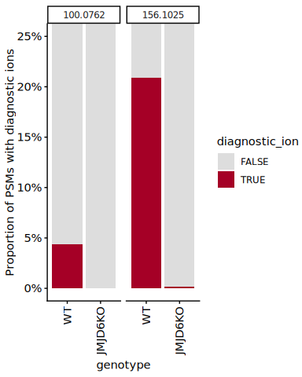

p2-04 · Identify diagnostic ions
================
Yoichiro Sugimoto and Pallavi Kesavan
20 July, 2026

- [Overview](#overview)
- [Setup](#setup)
- [Import data](#import-data)
- [Identify diagnostic ions](#identify-diagnostic-ions)
- [Session information](#session-information)

# Overview

**Purpose:** Identify immonium / diagnostic ions that mark
hydroxylysine, using FragPipe diagnostic-ion output and a WT vs JMJD6-KO
contrast.

**Inputs:** FragPipe `diagnosticIons.tsv` + `psm.tsv`
(`data/FP_diagnostic_ion_search/`); data-A sample info; reference
proteome.

**Outputs:** figures (rendered on knit).

**Upstream:** p2-01. **Downstream:** p2-05.

# Setup

``` r
## Resolve the repository root (via the .here sentinel) and load the shared
## setup: packages, helper functions, ggplot/knitr settings, and project paths.
repo_root <- local({
  p <- normalizePath(getwd(), winslash = "/", mustWork = FALSE)
  while (!file.exists(file.path(p, ".here")) && !identical(dirname(p), p)) p <- dirname(p)
  p
})
source(file.path(repo_root, "R", "functions", "_setup.R"))
```

    ## - The project is out-of-sync -- use `]8;;x-r-run:renv::status()renv::status()]8;;` for details.

``` r
## Script-specific packages
library("janitor")
library("ggbeeswarm")
```

# Import data

Loads the FragPipe diagnostic-ion and PSM tables, and the data-A sample
info.

``` r
# FragPipe diagnostic-ion table (data-A); data.dir is defined in _setup.R
diagnostic_ion_dt <- file.path(
  data.dir, "FP_diagnostic_ion_search/fragpipe_dataset-A/dataset01.diagnosticIons.tsv"
) %>%
  fread %>%
  clean_names
```

    ## Warning in fread(.): Discarded single-line footer: <<COMPLETE>>

``` r
# FragPipe PSM table (data-A)
fragpipe_psm_dt <- file.path(
  data.dir, "FP_diagnostic_ion_search/fragpipe_dataset-A/psm.tsv"
) %>%
  fread %>%
  clean_names

# data-A sample info (MaxQuant standard search output root)
mq_std_data_dir <- file.path(data.dir, "MQ_Std/PNAS2022")
data_a_sample_info_dt <- fread(file.path(
  mq_std_data_dir, "data-A", "MS_dataset_overview_PXD031221_data-A.csv"
))
```

# Identify diagnostic ions

Identifies which immonium / diagnostic-ion masses mark hydroxylysine, by
contrasting their intensity between JMJD6 WT and KO cells at BRD4 sites.

``` r
# Attach protein / position info from the PSM table, keyed by spectrum
diagnostic_ion_dt <- merge(
  fragpipe_psm_dt[, .(spectrum, protein_id, gene, protein_start, protein_end)],
  diagnostic_ion_dt,
  by = "spectrum"
)

# Raw file name = part of 'spectrum' before the first '.'
diagnostic_ion_dt[, file_name := str_split_fixed(spectrum, "\\.", n = 2)[, 1]]

# Attach the data-A sample info, keyed by raw file name
diagnostic_ion_dt <- merge(
  data_a_sample_info_dt,
  diagnostic_ion_dt,
  by = "file_name"
)

# Restrict to the BRD4 lysine-rich region (around residues 535-555).
brd4_di_dt <- diagnostic_ion_dt[
  gene == "BRD4" & (555 >= protein_start & 535 <= protein_end)
]

# Reshape the per-ion intensity columns to long format
brd4_di_long_dt <- melt(
  brd4_di_dt,
  measure.vars = grep("intensity$", colnames(brd4_di_dt), value = TRUE),
  value.name   = "intensity"
)

# Derive the monoisotopic mass (from the column name), a diagnostic-ion flag,
# and an ordered genotype factor
brd4_di_long_dt[, `:=`(
  monoisotopic_mass = variable %>%
    str_replace_all("ox_", "") %>%          # drop "ox_" prefix
    str_replace_all("_intensity", "") %>%   # drop "_intensity" suffix
    str_replace_all("_", ".") %>%           # remaining "_" -> "."
    factor(levels = c(
      "101.1079", #Lysine   K           immonium ion    C5 H13 N2 +
      "100.0762", #Hydroxylation (K)    K   O   15.9949 cyclic immonium ion C5 H10 N O+
      "82.0657", #Hydroxylation (K) K   O   15.9949 diagnostic ion (water loss) C5 H8 N+
      "117.1028", #Hydroxylation (K)    K   O   15.9949 immonium ion    C5 H13 O N2 + calculated
      "117.0658", #Hydroxylation (K)    K   O   15.9949 immonium ion    C5 H13 O N2 + (from citation)
      "138.0919", #Hydroxylation-Propionylation (K) K   C3 H4 O2    72.02112937 diagnostic ion (water loss) C8 H12 N1 O+
      "145.0977", #Hydroxylation (K)    K   O   15.9949 (intact, water loss)    C6H13N2O2+
      "156.1025", #Hydroxylation-Propionylation (K) K   C3 H4 O2    72.02112937 cyclic immonium ion C8 H14 N1 O2+
      "173.1290" #Hydroxylation-Propionylation (K)  K   C3 H4 O2    72.02112937 immonium ion    C8 H17 O2 N2 +
    )),
  diagnostic_ion = intensity > 0,
  genotype = factor(genotype, levels = c("WT", "JMJD6KO"))
)]
```

``` r
selected_ms <- c("100.0762", "156.1025")

# PSM counts for each selected monoisotopic mass
psm_count_by_di_dt <- brd4_di_long_dt[monoisotopic_mass %in% selected_ms][
  , .N, by = list(monoisotopic_mass, genotype, diagnostic_ion)
]

print("Ratio of PSM with diagnostic ion: 100.0762")
```

    ## [1] "Ratio of PSM with diagnostic ion: 100.0762"

``` r
psm_count_by_di_dt[monoisotopic_mass == "100.0762" & genotype == "WT" & diagnostic_ion == TRUE, N] /
  psm_count_by_di_dt[monoisotopic_mass == "100.0762" & genotype == "WT", sum(N)]
```

    ## [1] 0.04388298

``` r
print("Ratio of PSM with diagnostic ion: 156.1025")
```

    ## [1] "Ratio of PSM with diagnostic ion: 156.1025"

``` r
psm_count_by_di_dt[monoisotopic_mass == "156.1025" & genotype == "WT" & diagnostic_ion == TRUE, N] /
  psm_count_by_di_dt[monoisotopic_mass == "156.1025" & genotype == "WT", sum(N)]
```

    ## [1] 0.2087766

``` r
# Fisher's test of diagnostic-ion presence by genotype, per selected mass
for (ms in selected_ms) {
  print(ms)

  psm_count_by_di_dt[monoisotopic_mass == ms] %>%      # counts for this mass
    dcast(genotype ~ diagnostic_ion, value.var = "N") %>%   # long -> wide
    setnafill(cols = c("FALSE", "TRUE"), fill = 0) %>%      # NA -> 0
    {as.matrix(.[, c("FALSE", "TRUE"), with = FALSE])} %>%  # to matrix
    fisher.test %>% print
}
```

    ## [1] "100.0762"
    ## 
    ##  Fisher's Exact Test for Count Data
    ## 
    ## data:  .
    ## p-value = 4.92e-09
    ## alternative hypothesis: true odds ratio is not equal to 1
    ## 95 percent confidence interval:
    ##  0.0000000 0.1460815
    ## sample estimates:
    ## odds ratio 
    ##          0 
    ## 
    ## [1] "156.1025"
    ## 
    ##  Fisher's Exact Test for Count Data
    ## 
    ## data:  .
    ## p-value < 2.2e-16
    ## alternative hypothesis: true odds ratio is not equal to 1
    ## 95 percent confidence interval:
    ##  0.0001688554 0.0369678626
    ## sample estimates:
    ##  odds ratio 
    ## 0.006489756

``` r
brd4_di_long_dt[monoisotopic_mass %in% selected_ms][, .N, by = list(monoisotopic_mass, genotype)]
```

    ##    monoisotopic_mass genotype     N
    ##               <fctr>   <fctr> <int>
    ## 1:          100.0762       WT   752
    ## 2:          100.0762  JMJD6KO   586
    ## 3:          156.1025       WT   752
    ## 4:          156.1025  JMJD6KO   586

``` r
# Proportion of PSMs with a diagnostic ion, by genotype
ggplot(
  brd4_di_long_dt[monoisotopic_mass %in% selected_ms],
  aes(x = genotype, fill = diagnostic_ion)
) +
  geom_bar(position = "fill") +
  scale_x_discrete(guide = guide_axis(angle = 90)) +
  facet_grid(~ monoisotopic_mass) +
  scale_fill_manual(values = c("TRUE" = "#A50026", "FALSE" = "#DDDDDD")) +
  scale_y_continuous(labels = scales::percent_format(accuracy = 1)) +
  coord_cartesian(ylim = c(0, 0.25)) +
  ylab("Proportion of PSMs with diagnostic ions")
```

<!-- -->

# Session information

``` r
sessioninfo::session_info()
```

    ## ─ Session info ───────────────────────────────────────────────────────────────
    ##  setting  value
    ##  version  R version 4.5.1 (2025-06-13)
    ##  os       Ubuntu 24.04.2 LTS
    ##  system   x86_64, linux-gnu
    ##  ui       X11
    ##  language (EN)
    ##  collate  C.UTF-8
    ##  ctype    C.UTF-8
    ##  tz       Europe/Berlin
    ##  date     2026-07-20
    ##  pandoc   3.4 @ /usr/lib/rstudio-server/bin/quarto/bin/tools/x86_64/ (via rmarkdown)
    ##  quarto   1.6.42 @ /usr/lib/rstudio-server/bin/quarto/bin/quarto
    ## 
    ## ─ Packages ───────────────────────────────────────────────────────────────────
    ##  ! package           * version    date (UTC) lib source
    ##  P beeswarm            0.4.0      2021-06-01 [?] CRAN (R 4.5.1)
    ##  P BiocGenerics      * 0.56.0     2025-10-29 [?] Bioconductor 3.22 (R 4.5.1)
    ##  P Biostrings        * 2.78.0     2025-10-29 [?] Bioconductor 3.22 (R 4.5.1)
    ##  P cellranger          1.1.0      2016-07-27 [?] CRAN (R 4.5.1)
    ##  P cli                 3.6.6      2026-04-09 [?] CRAN (R 4.5.1)
    ##  P crayon              1.5.3      2024-06-20 [?] CRAN (R 4.5.1)
    ##  P data.table        * 1.18.4     2026-05-06 [?] CRAN (R 4.5.1)
    ##  P digest              0.6.39     2025-11-19 [?] CRAN (R 4.5.1)
    ##  P dplyr             * 1.2.1      2026-04-03 [?] CRAN (R 4.5.1)
    ##  P evaluate            1.0.5      2025-08-27 [?] CRAN (R 4.5.1)
    ##  P farver              2.1.2      2024-05-13 [?] CRAN (R 4.5.1)
    ##  P fastmap             1.2.0      2024-05-15 [?] CRAN (R 4.5.1)
    ##  P generics          * 0.1.4      2025-05-09 [?] CRAN (R 4.5.1)
    ##  P ggbeeswarm        * 0.7.3      2025-11-29 [?] CRAN (R 4.5.1)
    ##  P ggplot2           * 4.0.3      2026-04-22 [?] CRAN (R 4.5.1)
    ##  P glue                1.8.1      2026-04-17 [?] CRAN (R 4.5.1)
    ##  P gtable              0.3.6      2024-10-25 [?] CRAN (R 4.5.1)
    ##  P htmltools           0.5.9      2025-12-04 [?] CRAN (R 4.5.1)
    ##  P IRanges           * 2.44.0     2025-10-29 [?] Bioconductor 3.22 (R 4.5.1)
    ##  P janitor           * 2.2.1      2024-12-22 [?] CRAN (R 4.5.1)
    ##  P khroma            * 1.17.0     2025-09-29 [?] CRAN (R 4.5.1)
    ##  P knitr             * 1.51       2025-12-20 [?] CRAN (R 4.5.1)
    ##  P labeling            0.4.3      2023-08-29 [?] CRAN (R 4.5.1)
    ##  P lifecycle           1.0.5      2026-01-08 [?] CRAN (R 4.5.1)
    ##  P lubridate           1.9.5      2026-02-04 [?] CRAN (R 4.5.1)
    ##  P magrittr          * 2.0.5      2026-04-04 [?] CRAN (R 4.5.1)
    ##  P otel                0.2.0      2025-08-29 [?] CRAN (R 4.5.1)
    ##  P pillar              1.11.1     2025-09-17 [?] CRAN (R 4.5.1)
    ##  P pkgconfig           2.0.3      2019-09-22 [?] CRAN (R 4.5.1)
    ##    ptm.stoichiometry * 0.0.0.9000 2026-06-26 [1] local (/fast/AG_Sugimoto/home/users/yoichiro/projects/ptm.stoichiometry)
    ##  P R6                  2.6.1      2025-02-15 [?] CRAN (R 4.5.1)
    ##  P RColorBrewer        1.1-3      2022-04-03 [?] CRAN (R 4.5.1)
    ##  P readxl            * 1.5.0      2026-05-16 [?] CRAN (R 4.5.1)
    ##    renv                1.1.5      2025-07-24 [1] CRAN (R 4.5.1)
    ##  P rlang               1.2.0      2026-04-06 [?] CRAN (R 4.5.1)
    ##  P rmarkdown           2.31       2026-03-26 [?] CRAN (R 4.5.1)
    ##  P S4Vectors         * 0.48.1     2026-04-05 [?] Bioconductor 3.22 (R 4.5.1)
    ##  P S7                  0.2.2      2026-04-22 [?] CRAN (R 4.5.1)
    ##  P scales              1.4.0      2025-04-24 [?] CRAN (R 4.5.1)
    ##  P Seqinfo           * 1.0.0      2025-10-29 [?] Bioconductor 3.22 (R 4.5.1)
    ##  P sessioninfo         1.2.4      2026-06-04 [?] CRAN (R 4.5.1)
    ##  P snakecase           0.11.1     2023-08-27 [?] CRAN (R 4.5.1)
    ##  P stringi             1.8.7      2025-03-27 [?] CRAN (R 4.5.1)
    ##  P stringr           * 1.6.0      2025-11-04 [?] CRAN (R 4.5.1)
    ##  P tibble              3.3.1      2026-01-11 [?] CRAN (R 4.5.1)
    ##  P tidyselect          1.2.1      2024-03-11 [?] CRAN (R 4.5.1)
    ##  P timechange          0.4.0      2026-01-29 [?] CRAN (R 4.5.1)
    ##  P vctrs               0.7.3      2026-04-11 [?] CRAN (R 4.5.1)
    ##  P vipor               0.4.7      2023-12-18 [?] CRAN (R 4.5.1)
    ##  P withr               3.0.3      2026-06-19 [?] CRAN (R 4.5.1)
    ##  P xfun                0.59       2026-06-19 [?] CRAN (R 4.5.1)
    ##  P XVector           * 0.50.0     2025-10-29 [?] Bioconductor 3.22 (R 4.5.1)
    ##  P yaml                2.3.12     2025-12-10 [?] CRAN (R 4.5.1)
    ## 
    ##  [1] /fast/AG_Sugimoto/home/users/yoichiro/projects/20241111_PTMs_in_lysine_rich_domains/renv/library/linux-ubuntu-noble/R-4.5/x86_64-pc-linux-gnu
    ##  [2] /home/ysugimo/.cache/R/renv/sandbox/linux-ubuntu-noble/R-4.5/x86_64-pc-linux-gnu/9a444a72
    ## 
    ##  * ── Packages attached to the search path.
    ##  P ── Loaded and on-disk path mismatch.
    ## 
    ## ──────────────────────────────────────────────────────────────────────────────
