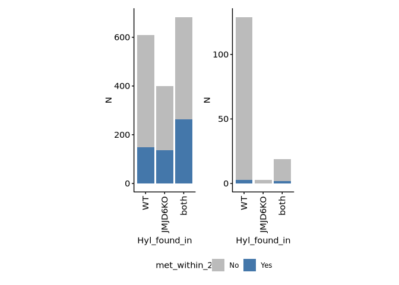
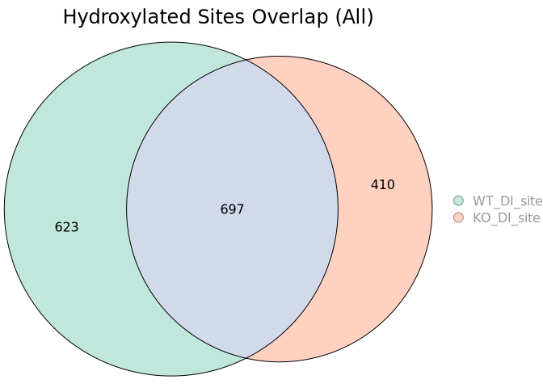
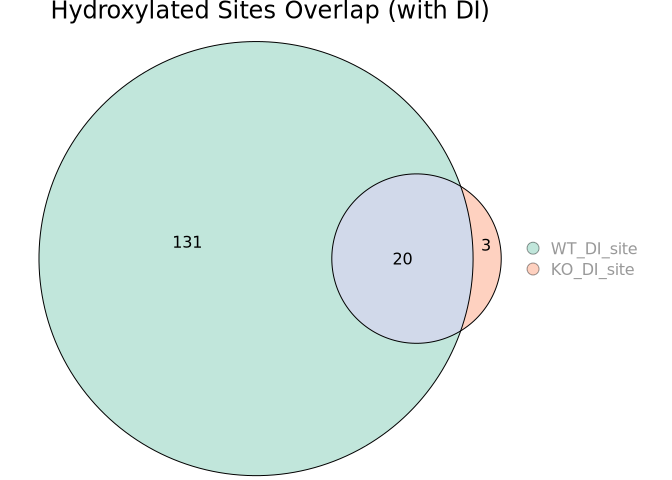
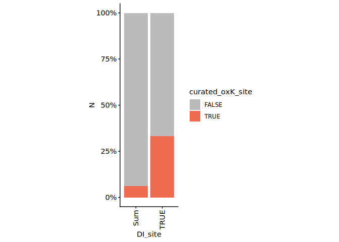

p2-05 · Plot diagnostic-ion analysis
================
Yoichiro Sugimoto and Pallavi Kesavan
20 July, 2026

- <a href="#overview" id="toc-overview">Overview</a>
- <a href="#setup" id="toc-setup">Setup</a>
- <a href="#helper-functions" id="toc-helper-functions">Helper
  functions</a>
- <a href="#import-data" id="toc-import-data">Import data</a>
- <a href="#diagnostic-ions-and-precision"
  id="toc-diagnostic-ions-and-precision">Diagnostic ions and precision</a>
- <a href="#wt-vs-ko-site-overlap" id="toc-wt-vs-ko-site-overlap">WT vs KO
  site overlap</a>
- <a href="#comparison-with-pnas-2022"
  id="toc-comparison-with-pnas-2022">Comparison with PNAS 2022</a>
- <a href="#session-information" id="toc-session-information">Session
  information</a>

# Overview

**Purpose:** Evaluate how diagnostic ions improve hydroxylation analysis
— precision, WT / KO overlap, and comparison with PNAS 2022.

**Inputs:** stoichiometry tables from p2-01; PNAS2022 reference data.

**Outputs:** figures (rendered on knit).

**Upstream:** p2-01, p2-04. **Downstream:** none.

# Setup

``` r
## Resolve the repository root (via the .here sentinel) and load the shared
## setup: packages, helper functions, ggplot/knitr settings, and project paths.
repo_root <- local({
  p <- normalizePath(getwd(), winslash = "/", mustWork = FALSE)
  while (!file.exists(file.path(p, ".here")) && !identical(dirname(p), p)) p <- dirname(p)
  p
})
source(file.path(repo_root, "R", "functions", "_setup.R"))
```

    ## - The project is out-of-sync -- use `renv::status()` for details.

``` r
## Script-specific packages
library("patchwork")
library("eulerr")
library("RColorBrewer")
```

# Helper functions

``` r
# Area-proportional Euler diagram of WT vs KO site overlap
plot_overlap_venn <- function(wt_ids, ko_ids, main) {
  venn_list <- list(WT_DI_site = wt_ids, KO_DI_site = ko_ids)
  plot(
    euler(venn_list),
    fills      = list(fill = brewer.pal(3, "Set2"), alpha = 0.4),
    legend     = list(side = "right"),
    quantities = TRUE,
    main       = main
  )
}
```

# Import data

Loads the diagnostic-ion sample matrix (data paths come from
`_setup.R`).

``` r
# Sample run info (MQ diagnostic-ion search)
mq_di_sample_dt <- read_excel(
  file.path(project.dir, "data/analysis_setting/PXD031221_sample_matrix.xlsx"),
  sheet = "MQ_DI"
) %>% data.table

# Sequential sample id (1:N)
mq_di_sample_dt[, sample_id := 1:.N]
```

# Diagnostic ions and precision

Assesses how requiring a diagnostic ion changes the precision of
hydroxylation calls.

``` r
# Read stoichiometry data for MQ_DI (change from the older version: a potential
# diagnostic ion with water loss is no longer considered)
mq_di_stoic_dt <- lapply(
  mq_di_sample_dt[, prefix],
  read_stoic_data,
  pre_prefix = "DI_",
  post_fix   = "_DI",
  dir_path   = file.path(results.dir, "p2-analysis-setting", "MQ_DI")
) %>% rbindlist

# fwrite(mq_di_stoic_dt[ptm != ""], file = file.path(results.dir, "p2-analysis-setting", "all_hydroxylysine.csv"))

mq_di_stoic_dt <- mq_di_stoic_dt[aa == "K"]
mq_di_stoic_dt[, genotype :=
  str_split_fixed(sample_name, "_", n = 3)[, 2] %>% factor(levels = c("HeLaWT", "HeLaJMJD6KO"))
]

# Sites with a diagnostic ion, and a per-row flag for them
di_sites_dt <- mq_di_stoic_dt[diagnostic_peak == "+"][
  !duplicated(paste(protein_accession, aa_pos)), .(protein_accession, aa_pos)
]
mq_di_stoic_dt[, DI_site :=
  paste(protein_accession, aa_pos) %in% di_sites_dt[, paste(protein_accession, aa_pos)]
]

# Protein feature data (lysines only), with a methionine-proximity annotation
protein_feature_dt <- fread(
  file.path(data.dir, "processed_data_from_PNAS2022/all_protein_feature_per_position.csv")
)
protein_feature_dt <- protein_feature_dt[residue == "K"]
setnames(protein_feature_dt, old = c("uniprot_id", "position"), new = c("protein_accession", "aa_pos"))

protein_feature_dt[, met_within_2 := case_when(
  nchar(Window) == 11 & grepl("M", substr(Window, start = 4, stop = 8)) ~ "Yes",  # M in the middle
  nchar(Window) == 11 ~ "No",                                                     # no M in window
  TRUE ~ "edge"                                                                   # M present but off-centre
)]

# Attach feature annotation to the stoichiometry data
wt_vs_ko_stoic_dt <- merge(
  copy(mq_di_stoic_dt),
  protein_feature_dt,
  by = c("protein_accession", "aa_pos")
)

# Keep only sites covered (>= 1 PSM) in both WT and KO so presence/absence is comparable
wt_coverage_dt <- wt_vs_ko_stoic_dt[genotype == "HeLaWT"][
  , list(total_wt_sum_psm_mapped = sum(sum_psm_mapped)), by = list(protein_accession, aa_pos)]
ko_coverage_dt <- wt_vs_ko_stoic_dt[genotype == "HeLaJMJD6KO"][
  , list(total_ko_sum_psm_mapped = sum(sum_psm_mapped)), by = list(protein_accession, aa_pos)]

all_coverage_dt <- merge(wt_coverage_dt, ko_coverage_dt, by = c("protein_accession", "aa_pos"))

wt_vs_ko_stoic_dt <- wt_vs_ko_stoic_dt[
  paste(protein_accession, aa_pos) %in%
    all_coverage_dt[total_wt_sum_psm_mapped > 0 & total_ko_sum_psm_mapped > 0][
      , paste(protein_accession, aa_pos)]
]

# Number of sites analysed, per genotype
wt_vs_ko_stoic_dt[!duplicated(paste(genotype, protein_accession, aa_pos))][, .N, by = genotype]
```

    ##       genotype     N
    ##         <fctr> <int>
    ## 1:      HeLaWT 26074
    ## 2: HeLaJMJD6KO 26074

``` r
# Hydroxylated K rows only, one (DI-preferred) row per genotype/site
koh_wt_vs_ko_dt <- wt_vs_ko_stoic_dt[ptm == "[Oxidation (K)]"]
koh_wt_vs_ko_dt <- koh_wt_vs_ko_dt[order(-DI_site)][
  !duplicated(paste(genotype, protein_accession, aa_pos))
]

g1 <- ggplot(
  koh_wt_vs_ko_dt[met_within_2 != "edge"],
  aes(x = genotype, fill = met_within_2)
) +
  geom_bar() +
  scale_fill_manual(values = c("Yes" = "#4477AA", "No" = "#BBBBBB")) +
  theme(aspect.ratio = 3) +
  scale_x_discrete(guide = guide_axis(angle = 90))

g2 <- ggplot(
  koh_wt_vs_ko_dt[met_within_2 != "edge" & DI_site == TRUE],
  aes(x = genotype, fill = met_within_2)
) +
  geom_bar() +
  scale_fill_manual(values = c("Yes" = "#4477AA", "No" = "#BBBBBB")) +
  theme(aspect.ratio = 3) +
  scale_x_discrete(guide = guide_axis(angle = 90))

# Number of sites for plotting g2
koh_wt_vs_ko_dt[met_within_2 != "edge" & DI_site == TRUE][, .N, by = list(met_within_2, genotype)]
```

    ##    met_within_2    genotype     N
    ##          <char>      <fctr> <int>
    ## 1:           No HeLaJMJD6KO    20
    ## 2:           No      HeLaWT   143
    ## 3:          Yes HeLaJMJD6KO     2
    ## 4:          Yes      HeLaWT     5

``` r
g1 + g2 + plot_layout(guides = "collect") & theme(legend.position = "bottom")
```

<!-- -->

# WT vs KO site overlap

Compares hydroxylysine sites detected in JMJD6 WT vs KO cells (overlap
and methionine proximity).

``` r
koh_per_site_dt <- dcast(
  koh_wt_vs_ko_dt,
  protein_accession + aa_pos + DI_site + met_within_2 ~ genotype,
  fun.aggregate = length
)

koh_per_site_dt[, Hyl_found_in := case_when(
  HeLaWT == 1 & HeLaJMJD6KO == 1 ~ "both",
  HeLaWT == 1 ~ "WT",
  HeLaJMJD6KO == 1 ~ "JMJD6KO",
  TRUE ~ "not_found"
) %>% factor(levels = c("WT", "JMJD6KO", "both", "not_found"))]

koh_per_site_dt <- koh_per_site_dt[met_within_2 != "edge"]

koh_per_site_count_dt <- koh_per_site_dt[, .N, by = list(Hyl_found_in, met_within_2, DI_site)]

g1 <- ggplot(koh_per_site_count_dt, aes(x = Hyl_found_in, y = N, fill = met_within_2)) +
  geom_bar(stat = "identity") +
  scale_fill_manual(values = c("Yes" = "#4477AA", "No" = "#BBBBBB")) +
  theme(aspect.ratio = 3) +
  scale_x_discrete(guide = guide_axis(angle = 90))

g2 <- ggplot(koh_per_site_count_dt[DI_site == TRUE], aes(x = Hyl_found_in, y = N, fill = met_within_2)) +
  geom_bar(stat = "identity") +
  scale_fill_manual(values = c("Yes" = "#4477AA", "No" = "#BBBBBB")) +
  theme(aspect.ratio = 3) +
  scale_x_discrete(guide = guide_axis(angle = 90))

g1 + g2 + plot_layout(guides = "collect") & theme(legend.position = "bottom")
```

<!-- -->

``` r
merge(
  koh_wt_vs_ko_dt[!duplicated(paste(protein_accession, gene_name)), .(protein_accession, gene_name)],
  koh_per_site_dt[DI_site == TRUE & Hyl_found_in == "both"]
)
```

    ## Key: <protein_accession>
    ##     protein_accession gene_name aa_pos DI_site met_within_2 HeLaWT HeLaJMJD6KO
    ##                <char>    <char>  <int>  <lgcl>       <char>  <int>       <int>
    ##  1:            O60814    H2BC12     21    TRUE           No      1           1
    ##  2:            P13639      EEF2    159    TRUE          Yes      1           1
    ##  3:            P16403      H1-2    137    TRUE           No      1           1
    ##  4:            P16403      H1-2    148    TRUE           No      1           1
    ##  5:            P16403      H1-2    149    TRUE           No      1           1
    ##  6:            P16403      H1-2    152    TRUE           No      1           1
    ##  7:            P16403      H1-2    153    TRUE           No      1           1
    ##  8:            P19338       NCL    282    TRUE          Yes      1           1
    ##  9:            P20908    COL5A1    535    TRUE           No      1           1
    ## 10:            P29375     KDM5A   1495    TRUE           No      1           1
    ## 11:            P29375     KDM5A   1497    TRUE           No      1           1
    ## 12:            P46777      RPL5    264    TRUE           No      1           1
    ## 13:            P62753      RPS6    221    TRUE           No      1           1
    ## 14:            P62805     H4C16     13    TRUE           No      1           1
    ## 15:            P62805     H4C16     92    TRUE           No      1           1
    ## 16:            Q13428     TCOF1   1444    TRUE           No      1           1
    ## 17:            Q8TA86       RP9    195    TRUE           No      1           1
    ## 18:            Q9Y3S2    ZNF330     10    TRUE           No      1           1
    ## 19:            Q9Y3S2    ZNF330     11    TRUE           No      1           1
    ##     Hyl_found_in
    ##           <fctr>
    ##  1:         both
    ##  2:         both
    ##  3:         both
    ##  4:         both
    ##  5:         both
    ##  6:         both
    ##  7:         both
    ##  8:         both
    ##  9:         both
    ## 10:         both
    ## 11:         both
    ## 12:         both
    ## 13:         both
    ## 14:         both
    ## 15:         both
    ## 16:         both
    ## 17:         both
    ## 18:         both
    ## 19:         both

``` r
# Statistical significance of methionine enrichment (all sites vs hydroxylated)
all_k_met_count_dt <- rbind(
  copy(protein_feature_dt[met_within_2 != "edge", .N, by = met_within_2])[, data_type := "all_K"],
  copy(koh_per_site_count_dt[, list(N = sum(N)), by = met_within_2])[, data_type := "koh"]
) %>%
  dcast(met_within_2 ~ data_type, value.var = "N")

fisher.test(all_k_met_count_dt[, .(all_K, koh)], alternative = "two.sided")
```

    ## 
    ##  Fisher's Exact Test for Count Data
    ## 
    ## data:  all_k_met_count_dt[, .(all_K, koh)]
    ## p-value < 2.2e-16
    ## alternative hypothesis: true odds ratio is not equal to 1
    ## 95 percent confidence interval:
    ##  4.577065 5.630746
    ## sample estimates:
    ## odds ratio 
    ##   5.079513

``` r
# WT vs KO site overlap (all sites)
plot_overlap_venn(
  wt_ids = koh_wt_vs_ko_dt[genotype == "HeLaWT", paste(protein_accession, aa_pos)],
  ko_ids = koh_wt_vs_ko_dt[genotype == "HeLaJMJD6KO", paste(protein_accession, aa_pos)],
  main   = "Hydroxylated Sites Overlap (All)"
)
```

<!-- -->

``` r
# WT vs KO site overlap (diagnostic-ion sites only)
plot_overlap_venn(
  wt_ids = koh_wt_vs_ko_dt[genotype == "HeLaWT" & DI_site == TRUE, paste(protein_accession, aa_pos)],
  ko_ids = koh_wt_vs_ko_dt[genotype == "HeLaJMJD6KO" & DI_site == TRUE, paste(protein_accession, aa_pos)],
  main   = "Hydroxylated Sites Overlap (with DI)"
)
```

<!-- -->

# Comparison with PNAS 2022

Benchmarks the diagnostic-ion-based sites against the manually curated
sites from the PNAS 2022 study.

``` r
# PNAS2022 curated stoichiometry data
pnas2022_stoic_dt <- fread(
  file.path(data.dir, "processed_data_from_PNAS2022/long_K_stoichiometry_data.csv")
)
setnames(pnas2022_stoic_dt, old = c("uniprot_id", "position", "residue"), new = c("protein_accession", "aa_pos", "aa"))
pnas2022_stoic_dt[, accession_position := paste0(protein_accession, "_", aa_pos)]

# Flag MQ_DI sites that PNAS2022 curated as hydroxylated
mq_di_stoic_dt[, curated_oxK_site :=
  paste0(protein_accession, "_", aa_pos) %in%
  pnas2022_stoic_dt[curated_oxK_site == TRUE, paste0(protein_accession, "_", aa_pos)]
]

# One hydroxylated WT row per site (DI-preferred)
mq_di_hydroxyk_dt <- mq_di_stoic_dt[ptm == "[Oxidation (K)]" & genotype == "HeLaWT"][
  order(genotype, DI_site)
][!duplicated(paste(protein_accession, aa_pos))]

# Cross-tabulate DI sites against PNAS2022 curated sites
hyl_precision_dt <- mq_di_hydroxyk_dt[, table(DI_site, curated_oxK_site) %>% addmargins] %>% data.table
hyl_precision_dt <- hyl_precision_dt[DI_site %in% c("Sum", "TRUE") & curated_oxK_site != "Sum"]

hyl_precision_dt
```

    ##    DI_site curated_oxK_site     N
    ##     <char>           <char> <num>
    ## 1:    TRUE            FALSE   157
    ## 2:     Sum            FALSE  1782
    ## 3:    TRUE             TRUE    78
    ## 4:     Sum             TRUE   120

``` r
ggplot(
  hyl_precision_dt,
  aes(x = DI_site, y = N, fill = curated_oxK_site)
) +
  geom_bar(stat = "identity", position = "fill") +
  scale_y_continuous(labels = scales::percent_format(accuracy = 1)) +
  scale_fill_manual(values = c("TRUE" = "coral2", "FALSE" = "#BBBBBB")) +
  scale_x_discrete(guide = guide_axis(angle = 90)) +
  theme(aspect.ratio = 3.5)
```

<!-- -->

``` r
dcast(hyl_precision_dt, DI_site ~ curated_oxK_site, value.var = "N") %>%
  {fisher.test(.[, c("FALSE", "TRUE"), with = FALSE], alternative = "two.sided")}
```

    ## 
    ##  Fisher's Exact Test for Count Data
    ## 
    ## data:  .[, c("FALSE", "TRUE"), with = FALSE]
    ## p-value < 2.2e-16
    ## alternative hypothesis: true odds ratio is not equal to 1
    ## 95 percent confidence interval:
    ##   5.224579 10.359296
    ## sample estimates:
    ## odds ratio 
    ##   7.365665

# Session information

``` r
sessioninfo::session_info()
```

    ## ─ Session info ───────────────────────────────────────────────────────────────
    ##  setting  value
    ##  version  R version 4.5.0 (2025-04-11)
    ##  os       Red Hat Enterprise Linux 9.6 (Plow)
    ##  system   x86_64, linux-gnu
    ##  ui       X11
    ##  language (EN)
    ##  collate  en_US.UTF-8
    ##  ctype    en_US.UTF-8
    ##  tz       Europe/Berlin
    ##  date     2026-07-20
    ##  pandoc   2.19.2 @ /gnu/store/sqwwnsp5xb8yd3z1a57lhldcsvx3z9gb-profile/bin/ (via rmarkdown)
    ##  quarto   NA
    ## 
    ## ─ Packages ───────────────────────────────────────────────────────────────────
    ##  ! package           * version    date (UTC) lib source
    ##  P AnnotationDbi     * 1.72.0     2025-10-29 [?] Bioconduc~
    ##  P beeswarm            0.4.0      2021-06-01 [?] CRAN (R 4.5.0)
    ##  P Biobase           * 2.70.0     2025-10-29 [?] Bioconduc~
    ##  P BiocGenerics      * 0.56.0     2025-10-29 [?] Bioconduc~
    ##  P Biostrings        * 2.78.0     2025-10-29 [?] Bioconduc~
    ##  P bit                 4.6.0      2025-03-06 [?] CRAN (R 4.5.0)
    ##  P bit64               4.8.2      2026-05-19 [?] CRAN (R 4.5.0)
    ##  P blob                1.3.0      2026-01-14 [?] CRAN (R 4.5.0)
    ##  P cachem              1.1.0      2024-05-16 [?] CRAN (R 4.5.0)
    ##  P cellranger          1.1.0      2016-07-27 [?] CRAN (R 4.5.0)
    ##  P cli                 3.6.6      2026-04-09 [?] CRAN (R 4.5.0)
    ##  P colourpicker        1.3.0      2023-08-21 [?] CRAN (R 4.5.0)
    ##  P crayon              1.5.3      2024-06-20 [?] CRAN (R 4.5.0)
    ##  P data.table        * 1.18.4     2026-05-06 [?] CRAN (R 4.5.0)
    ##  P DBI                 1.3.0      2026-02-25 [?] CRAN (R 4.5.0)
    ##  P digest              0.6.39     2025-11-19 [?] CRAN (R 4.5.0)
    ##  P dplyr             * 1.2.1      2026-04-03 [?] CRAN (R 4.5.0)
    ##  P eulerr            * 7.0.2      2024-03-28 [?] CRAN (R 4.5.0)
    ##  P evaluate            1.0.5      2025-08-27 [?] CRAN (R 4.5.0)
    ##  P farver              2.1.2      2024-05-13 [?] CRAN (R 4.5.0)
    ##  P fastmap             1.2.0      2024-05-15 [?] CRAN (R 4.5.0)
    ##  P formattable         0.2.1      2021-01-07 [?] CRAN (R 4.5.0)
    ##  P generics          * 0.1.4      2025-05-09 [?] CRAN (R 4.5.0)
    ##  P ggbeeswarm        * 0.7.3      2025-11-29 [?] CRAN (R 4.5.0)
    ##  P ggplot2           * 4.0.3      2026-04-22 [?] CRAN (R 4.5.0)
    ##  P glue                1.8.1      2026-04-17 [?] CRAN (R 4.5.0)
    ##  P gridExtra           2.3        2017-09-09 [?] CRAN (R 4.5.0)
    ##  P gtable              0.3.6      2024-10-25 [?] CRAN (R 4.5.0)
    ##  P htmltools           0.5.9      2025-12-04 [?] CRAN (R 4.5.0)
    ##  P htmlwidgets         1.6.4      2023-12-06 [?] CRAN (R 4.5.0)
    ##  P httpuv              1.6.17     2026-03-18 [?] CRAN (R 4.5.0)
    ##  P httr                1.4.8      2026-02-13 [?] CRAN (R 4.5.0)
    ##  P IRanges           * 2.44.0     2025-10-29 [?] Bioconduc~
    ##  P janitor           * 2.2.1      2024-12-22 [?] CRAN (R 4.5.0)
    ##  P jsonlite            2.0.0      2025-03-27 [?] CRAN (R 4.5.0)
    ##  P KEGGREST            1.50.0     2025-10-29 [?] Bioconduc~
    ##  P khroma            * 1.17.0     2025-09-29 [?] CRAN (R 4.5.0)
    ##  P knitr             * 1.51       2025-12-20 [?] CRAN (R 4.5.0)
    ##  P labeling            0.4.3      2023-08-29 [?] CRAN (R 4.5.0)
    ##  P later               1.4.8      2026-03-05 [?] CRAN (R 4.5.0)
    ##  P lattice             0.22-9     2026-02-09 [?] CRAN (R 4.5.0)
    ##  P lazyeval            0.2.3      2026-04-04 [?] CRAN (R 4.5.0)
    ##  P lifecycle           1.0.5      2026-01-08 [?] CRAN (R 4.5.0)
    ##  P lubridate           1.9.5      2026-02-04 [?] CRAN (R 4.5.0)
    ##  P magrittr          * 2.0.5      2026-04-04 [?] CRAN (R 4.5.0)
    ##  P Matrix              1.7-5      2026-03-21 [?] CRAN (R 4.5.0)
    ##  P memoise             2.0.1      2021-11-26 [?] CRAN (R 4.5.0)
    ##  P mgcv              * 1.9-4      2025-11-07 [?] CRAN (R 4.5.0)
    ##  P mime                0.13       2025-03-17 [?] CRAN (R 4.5.0)
    ##  P miniUI              0.1.2      2025-04-17 [?] CRAN (R 4.5.0)
    ##  P nlme              * 3.1-169    2026-03-27 [?] CRAN (R 4.5.0)
    ##  P org.Hs.eg.db      * 3.22.0     2026-06-24 [?] Bioconductor
    ##  P otel                0.2.0      2025-08-29 [?] CRAN (R 4.5.0)
    ##  P patchwork         * 1.3.2      2025-08-25 [?] CRAN (R 4.5.0)
    ##  P pillar              1.11.1     2025-09-17 [?] CRAN (R 4.5.0)
    ##  P pkgconfig           2.0.3      2019-09-22 [?] CRAN (R 4.5.0)
    ##  P plotly              4.12.0     2026-01-24 [?] CRAN (R 4.5.0)
    ##  P plyr                1.8.9      2023-10-02 [?] CRAN (R 4.5.0)
    ##  P png                 0.1-9      2026-03-15 [?] CRAN (R 4.5.0)
    ##  P polyclip            1.10-7     2024-07-23 [?] CRAN (R 4.5.0)
    ##  P polylabelr          1.0.0      2026-01-19 [?] CRAN (R 4.5.0)
    ##  P promises            1.5.0      2025-11-01 [?] CRAN (R 4.5.0)
    ##    ptm.stoichiometry * 0.0.0.9000 2026-06-24 [1] local (/fast/AG_Sugimoto/home/users/yoichiro/projects/ptm.stoichiometry)
    ##  P purrr               1.2.2      2026-04-10 [?] CRAN (R 4.5.0)
    ##  P R6                  2.6.1      2025-02-15 [?] CRAN (R 4.5.0)
    ##  P RColorBrewer      * 1.1-3      2022-04-03 [?] CRAN (R 4.5.0)
    ##  P Rcpp                1.1.1-1.1  2026-04-24 [?] CRAN (R 4.5.0)
    ##  P readxl            * 1.5.0      2026-05-16 [?] CRAN (R 4.5.0)
    ##    renv                1.1.5      2025-07-24 [1] CRAN (R 4.5.0)
    ##  P rlang               1.2.0      2026-04-06 [?] CRAN (R 4.5.0)
    ##  P rmarkdown           2.31       2026-03-26 [?] CRAN (R 4.5.0)
    ##  P RSQLite             3.53.2     2026-06-17 [?] CRAN (R 4.5.0)
    ##  P S4Vectors         * 0.48.1     2026-04-05 [?] Bioconduc~
    ##  P S7                  0.2.2      2026-04-22 [?] CRAN (R 4.5.0)
    ##  P scales              1.4.0      2025-04-24 [?] CRAN (R 4.5.0)
    ##  P Seqinfo           * 1.0.0      2025-10-29 [?] Bioconduc~
    ##  P sessioninfo         1.2.4      2026-06-04 [?] CRAN (R 4.5.0)
    ##  P shiny               1.14.0     2026-06-21 [?] CRAN (R 4.5.0)
    ##  P shinythemes         1.2.0      2021-01-25 [?] CRAN (R 4.5.0)
    ##  P snakecase           0.11.1     2023-08-27 [?] CRAN (R 4.5.0)
    ##  P stringi             1.8.7      2025-03-27 [?] CRAN (R 4.5.0)
    ##  P stringr           * 1.6.0      2025-11-04 [?] CRAN (R 4.5.0)
    ##    subcellularvis    * 0.0.0.9000 2026-06-24 [1] local (/fast/AG_Sugimoto/home/users/yoichiro/software/R_packages/subcellularvis)
    ##  P tibble              3.3.1      2026-01-11 [?] CRAN (R 4.5.0)
    ##  P tidyr               1.3.2      2025-12-19 [?] CRAN (R 4.5.0)
    ##  P tidyselect          1.2.1      2024-03-11 [?] CRAN (R 4.5.0)
    ##  P timechange          0.4.0      2026-01-29 [?] CRAN (R 4.5.0)
    ##  P UpSetR              1.4.1      2026-05-25 [?] CRAN (R 4.5.0)
    ##  P vctrs               0.7.3      2026-04-11 [?] CRAN (R 4.5.0)
    ##  P vipor               0.4.7      2023-12-18 [?] CRAN (R 4.5.0)
    ##  P viridisLite         0.4.3      2026-02-04 [?] CRAN (R 4.5.0)
    ##  P withr               3.0.3      2026-06-19 [?] CRAN (R 4.5.0)
    ##  P xfun                0.59       2026-06-19 [?] CRAN (R 4.5.0)
    ##  P xtable              1.8-8      2026-02-22 [?] CRAN (R 4.5.0)
    ##  P XVector           * 0.50.0     2025-10-29 [?] Bioconduc~
    ##  P yaml                2.3.12     2025-12-10 [?] CRAN (R 4.5.0)
    ## 
    ##  [1] /fast/AG_Sugimoto/home/users/yoichiro/projects/20241111_PTMs_in_lysine_rich_domains/renv/library/linux-rhel-9.6/R-4.5/x86_64-unknown-linux-gnu
    ##  [2] /fast/home/y/ysugimo/.cache/R/renv/sandbox/linux-rhel-9.6/R-4.5/x86_64-unknown-linux-gnu/cb72a45c
    ## 
    ##  * ── Packages attached to the search path.
    ##  P ── Loaded and on-disk path mismatch.
    ## 
    ## ──────────────────────────────────────────────────────────────────────────────
