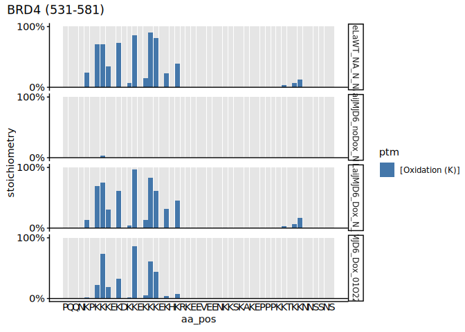
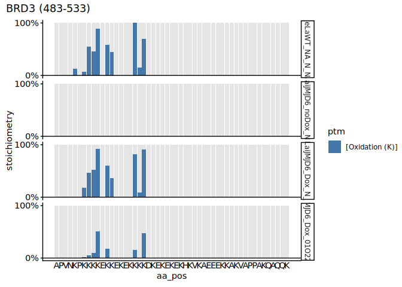
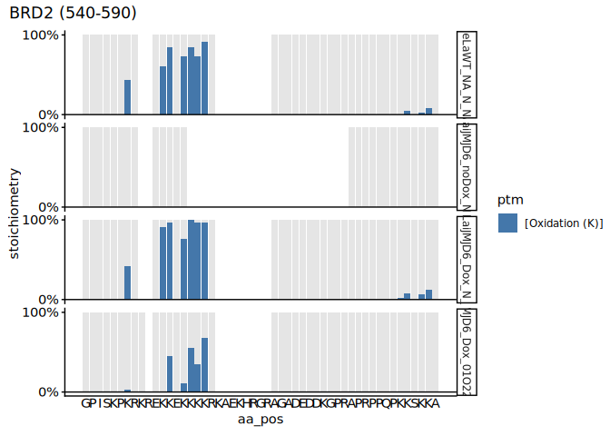

p2-06 · Analyse MS_KR_1 stoichiometry
================
Yoichiro Sugimoto and Pallavi Kesavan
18 June, 2026

- [Overview](#overview)
- [Setup](#setup)
- [Per-site stoichiometry across
  conditions](#per-site-stoichiometry-across-conditions)
- [Normoxia vs hypoxia (JMJD6
  re-expression)](#normoxia-vs-hypoxia-jmjd6-re-expression)
- [Session information](#session-information)

# Overview

**Purpose:** Analyse MS_KR_1 lysine-hydroxylation stoichiometry — oxygen
sensitivity (hypoxia vs normoxia) across BRD2/3/4, including JMJD6
re-expression. Stoichiometry itself is computed in p2-01; this script
reads those tables.

**Inputs:** stoichiometry tables from
`results/p2-analysis-setting/MS_KR_1/` (written by p2-01); UniProt
reference proteome (`reference_fasta`).

**Outputs:** figures (rendered on knit).

**Upstream:** p2-01. **Downstream:** none.

# Setup

``` r
## Resolve the repository root (via the .here sentinel) and load the shared
## setup: packages, helper functions, ggplot/knitr settings, and project paths.
repo_root <- local({
  p <- normalizePath(getwd(), winslash = "/", mustWork = FALSE)
  while (!file.exists(file.path(p, ".here")) && !identical(dirname(p), p)) p <- dirname(p)
  p
})
source(file.path(repo_root, "R", "functions", "_setup.R"))
```

# Per-site stoichiometry across conditions

Reads the MS_KR_1 stoichiometry table and plots site-specific
hydroxylation along BRD4 (O60885), BRD3 (Q15059) and BRD2 (P25440)
across the four conditions — parental WT, induced cells without
doxycycline, and JMJD6 re-expression (+Dox) under normoxia and 0.1% O2.
The `diagnostic_peak` flag marks sites confirmed by the hydroxylysine
immonium ion.

``` r
# Read stoichiometry data for MS_KR_1
ms_kr1_stoic_dt <- read_stoic_data(
  prefix     = "MS_KR_1_",
  pre_prefix = "",
  post_fix   = "_DI",
  dir_path   = file.path(results.dir, "p2-analysis-setting", "MS_KR_1")
)

# Diagnostic-ion flag and an ordered sample factor (all four conditions)
ms_kr1_stoic_dt[, is_diagnostic_peak := diagnostic_peak == "+"]

kr1_conditions <- c(
  "HeLaWT_NA_N_NA", "HeLaiJMJD6_noDox_N_NA",
  "HeLaiJMJD6_Dox_N_NA", "HeLaiJMJD6_Dox_01O224h_NA"
)
ms_kr1_stoic_dt[, sample_name := factor(sample_name, levels = kr1_conditions)]

# Per-site stoichiometry for one accession across all four conditions
plot_brd_stoic <- function(accession, plot_range) {
  plot_ptm_stoichiometry(
    ms_kr1_stoic_dt[sample_name %in% kr1_conditions],
    accession = accession, plot_range = plot_range, all.protein.bs, sample_colors = NA
  )
}

plot_brd_stoic("O60885", c(531, 581))  # BRD4
```

<!-- --><!-- -->

``` r
plot_brd_stoic("Q15059", c(483, 533))  # BRD3
```

<!-- --><!-- -->

``` r
plot_brd_stoic("P25440", c(540, 590))  # BRD2
```

<!-- --><!-- -->

# Normoxia vs hypoxia (JMJD6 re-expression)

Restricts the data to the two JMJD6 re-expression conditions (+Dox:
normoxia vs 0.1% O2), contrasts per-site stoichiometry between them, and
tests whether the normoxia − hypoxia difference differs between BRD2/3/4
(ANOVA and boxplot).

``` r
# Keep only the JMJD6 re-expression (+Dox) conditions; the parental WT and the
# un-induced (no-Dox) samples are dropped because this comparison isolates the
# oxygen effect on JMJD6-dependent hydroxylation, which requires JMJD6 expression.
ms_kr1_stoic_dt <- droplevels(
  ms_kr1_stoic_dt[!sample_name %in% c("HeLaWT_NA_N_NA", "HeLaiJMJD6_noDox_N_NA")]
)
ms_kr1_stoic_dt[, sample_name :=
  factor(sample_name, levels = c("HeLaiJMJD6_Dox_N_NA", "HeLaiJMJD6_Dox_01O224h_NA"))
]

# Restrict to BRD2/3/4 and label the oxygen condition
ms_kr1_stoic_dt <- ms_kr1_stoic_dt[gene_name %in% c("BRD2", "BRD3", "BRD4")]
ms_kr1_stoic_dt[, oxygen_levels := factor(
  fcase(
    grepl("^HeLaiJMJD6_Dox_N_NA", sample_name),       "HeLaNormoxia_JMJD6KO_reexp",
    grepl("^HeLaiJMJD6_Dox_01O224h_NA", sample_name), "HeLaHypoxia",
    default = NA_character_
  ),
  levels = c("HeLaNormoxia_JMJD6KO_reexp", "HeLaHypoxia")
)]

# Derive the oxygen status (Normoxia / Hypoxia) used to group the contrast.
# The per-sample zero-fill keys on the finer 'oxygen_levels' label.
ms_kr1_stoic_dt[, oxygen_stat := str_extract(oxygen_levels, "(?<=HeLa)(Normoxia|Hypoxia)")]

# Zero-fill non-hydroxylated K and reshape to one column per oxygen status.
# (Shared helper contrast_hydroxylation() lives in R/functions/2-useful_functions.R.)
ms_kr1_hydroxy_dt <- contrast_hydroxylation(
  ms_kr1_stoic_dt,
  group_col  = "oxygen_stat",
  sample_col = "oxygen_levels"
)

# Per-site diagnostic-peak status (most confident row per site)
di_info_dt <- ms_kr1_stoic_dt[
  , .(protein_accession, aa_pos, diagnostic_peak)
][
  order(protein_accession, aa_pos, -diagnostic_peak)
][
  !duplicated(paste(protein_accession, aa_pos))
]

ms_kr1_hydroxy_dt <- merge(ms_kr1_hydroxy_dt, di_info_dt, by = c("protein_accession", "aa_pos"))
ms_kr1_hydroxy_dt[, is_diagnostic_peak := diagnostic_peak == "+"]

# Keep only sites whose hydroxylation is confirmed by the diagnostic (immonium) ion
ms_kr1_hydroxy_dt <- ms_kr1_hydroxy_dt[is_diagnostic_peak == TRUE]

# Normoxia - hypoxia stoichiometry difference, per site
ms_kr1_hydroxy_dt[, Stoic_diff := Normoxia - Hypoxia]
ms_kr1_hydroxy_dt[, gene_name := factor(gene_name)]
```

``` r
# Analyse only sites with appreciable normoxic hydroxylation (stoichiometry >= 0.1).
# little signal for a normoxia-hypoxia difference.
ms_kr1_hydroxy_dt <- subset(ms_kr1_hydroxy_dt, Normoxia >= 0.1)

ms_kr1_hydroxy_dt[, table(gene_name)]
```

    ## gene_name
    ## BRD2 BRD3 BRD4 
    ##    8    8   11

``` r
# ANOVA: does the normoxia - hypoxia difference vary between BRD2/3/4?
anova_ms_kr1 <- aov(Stoic_diff ~ gene_name, data = ms_kr1_hydroxy_dt)
summary(anova_ms_kr1)
```

    ##             Df Sum Sq Mean Sq F value Pr(>F)  
    ## gene_name    2 0.3554 0.17770   5.199 0.0133 *
    ## Residuals   24 0.8204 0.03418                 
    ## ---
    ## Signif. codes:  0 '***' 0.001 '**' 0.01 '*' 0.05 '.' 0.1 ' ' 1

``` r
# Stoichiometry difference (normoxia - hypoxia) between BRD2, 3 and 4
ggplot(
  ms_kr1_hydroxy_dt[is_diagnostic_peak == TRUE],
  aes(x = gene_name, y = Stoic_diff)
) +
  stat_boxplot(geom = "errorbar", width = 0.25) +
  geom_boxplot() +
  geom_point() +
  labs(title = "Stoichiometry difference (Normoxia 0.1 between BRD2, 3 and 4") +
  theme(axis.text.x = element_text(angle = 0, hjust = 1)) +
  theme(legend.position = "none")
```

<!-- -->

# Session information

``` r
sessioninfo::session_info()
```

    ## ─ Session info ───────────────────────────────────────────────────────────────
    ##  setting  value
    ##  version  R version 4.4.3 (2025-02-28)
    ##  os       Ubuntu 24.04.2 LTS
    ##  system   x86_64, linux-gnu
    ##  ui       X11
    ##  language (EN)
    ##  collate  C.UTF-8
    ##  ctype    C.UTF-8
    ##  tz       Europe/Berlin
    ##  date     2026-06-18
    ##  pandoc   3.2 @ /usr/lib/rstudio-server/bin/quarto/bin/tools/x86_64/ (via rmarkdown)
    ##  quarto   1.5.57 @ /usr/lib/rstudio-server/bin/quarto/bin/quarto
    ## 
    ## ─ Packages ───────────────────────────────────────────────────────────────────
    ##  package           * version    date (UTC) lib source
    ##  BiocGenerics      * 0.52.0     2024-10-29 [1] Bioconduc~
    ##  Biostrings        * 2.74.1     2024-12-16 [1] Bioconduc~
    ##  cellranger          1.1.0      2016-07-27 [1] CRAN (R 4.4.3)
    ##  cli                 3.6.5      2025-04-23 [1] CRAN (R 4.4.3)
    ##  crayon              1.5.3      2024-06-20 [1] CRAN (R 4.4.3)
    ##  data.table        * 1.17.8     2025-07-10 [1] CRAN (R 4.4.3)
    ##  digest              0.6.37     2024-08-19 [1] CRAN (R 4.4.3)
    ##  dplyr             * 1.1.4      2023-11-17 [1] CRAN (R 4.4.3)
    ##  evaluate            1.0.5      2025-08-27 [1] CRAN (R 4.4.3)
    ##  farver              2.1.2      2024-05-13 [1] CRAN (R 4.4.3)
    ##  fastmap             1.2.0      2024-05-15 [1] CRAN (R 4.4.3)
    ##  generics            0.1.4      2025-05-09 [1] CRAN (R 4.4.3)
    ##  GenomeInfoDb      * 1.42.3     2025-01-27 [1] Bioconduc~
    ##  GenomeInfoDbData    1.2.13     2025-07-21 [1] Bioconductor
    ##  ggplot2           * 4.0.0      2025-09-11 [1] CRAN (R 4.4.3)
    ##  glue                1.8.0      2024-09-30 [1] CRAN (R 4.4.3)
    ##  gtable              0.3.6      2024-10-25 [1] CRAN (R 4.4.3)
    ##  htmltools           0.5.8.1    2024-04-04 [1] CRAN (R 4.4.3)
    ##  httr                1.4.7      2023-08-15 [1] CRAN (R 4.4.3)
    ##  IRanges           * 2.40.1     2024-12-05 [1] Bioconduc~
    ##  janitor             2.2.1      2024-12-22 [1] CRAN (R 4.4.3)
    ##  jsonlite            2.0.0      2025-03-27 [1] CRAN (R 4.4.3)
    ##  khroma            * 1.16.0     2025-02-25 [1] CRAN (R 4.4.3)
    ##  knitr             * 1.50       2025-03-16 [1] CRAN (R 4.4.3)
    ##  labeling            0.4.3      2023-08-29 [1] CRAN (R 4.4.3)
    ##  lifecycle           1.0.4      2023-11-07 [1] CRAN (R 4.4.3)
    ##  lubridate           1.9.4      2024-12-08 [1] CRAN (R 4.4.3)
    ##  magrittr          * 2.0.4      2025-09-12 [1] CRAN (R 4.4.3)
    ##  patchwork           1.3.2      2025-08-25 [1] CRAN (R 4.4.3)
    ##  pillar              1.11.1     2025-09-17 [1] CRAN (R 4.4.3)
    ##  pkgconfig           2.0.3      2019-09-22 [1] CRAN (R 4.4.3)
    ##  ptm.stoichiometry * 0.0.0.9000 2025-12-13 [1] local
    ##  R6                  2.6.1      2025-02-15 [1] CRAN (R 4.4.3)
    ##  RColorBrewer        1.1-3      2022-04-03 [1] CRAN (R 4.4.3)
    ##  readxl            * 1.4.5      2025-03-07 [1] CRAN (R 4.4.3)
    ##  rlang               1.1.6      2025-04-11 [1] CRAN (R 4.4.3)
    ##  rmarkdown           2.29       2024-11-04 [1] CRAN (R 4.4.3)
    ##  rstudioapi          0.17.1     2024-10-22 [1] CRAN (R 4.4.3)
    ##  S4Vectors         * 0.44.0     2024-10-29 [1] Bioconduc~
    ##  S7                  0.2.0      2024-11-07 [1] CRAN (R 4.4.3)
    ##  scales              1.4.0      2025-04-24 [1] CRAN (R 4.4.3)
    ##  sessioninfo         1.2.3      2025-02-05 [1] CRAN (R 4.4.3)
    ##  snakecase           0.11.1     2023-08-27 [1] CRAN (R 4.4.3)
    ##  stringi             1.8.7      2025-03-27 [1] CRAN (R 4.4.3)
    ##  stringr           * 1.5.2      2025-09-08 [1] CRAN (R 4.4.3)
    ##  tibble              3.3.0      2025-06-08 [1] CRAN (R 4.4.3)
    ##  tidyselect          1.2.1      2024-03-11 [1] CRAN (R 4.4.3)
    ##  timechange          0.3.0      2024-01-18 [1] CRAN (R 4.4.3)
    ##  UCSC.utils          1.2.0      2024-10-29 [1] Bioconduc~
    ##  vctrs               0.6.5      2023-12-01 [1] CRAN (R 4.4.3)
    ##  withr               3.0.2      2024-10-28 [1] CRAN (R 4.4.3)
    ##  xfun                0.53       2025-08-19 [1] CRAN (R 4.4.3)
    ##  XVector           * 0.46.0     2024-10-29 [1] Bioconduc~
    ##  yaml                2.3.10     2024-07-26 [1] CRAN (R 4.4.3)
    ##  zlibbioc            1.52.0     2024-10-29 [1] Bioconduc~
    ## 
    ##  [1] /home/ysugimo/R/x86_64-pc-linux-gnu-library/4.4
    ##  [2] /usr/local/lib/R/site-library
    ##  [3] /usr/lib/R/site-library
    ##  [4] /usr/lib/R/library
    ##  * ── Packages attached to the search path.
    ## 
    ## ──────────────────────────────────────────────────────────────────────────────
