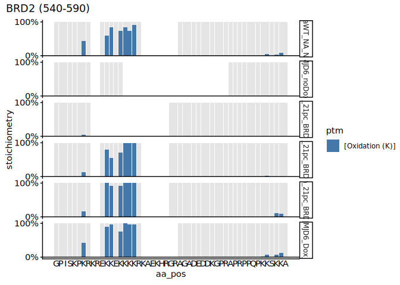
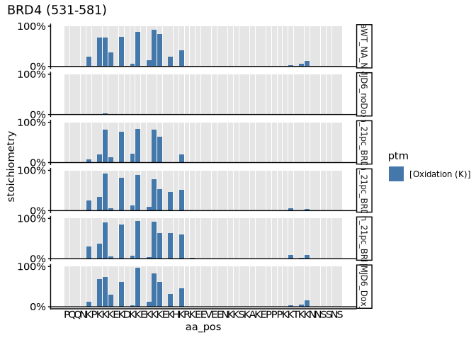
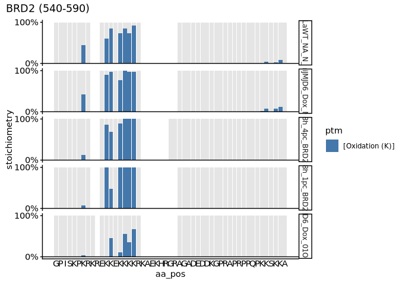
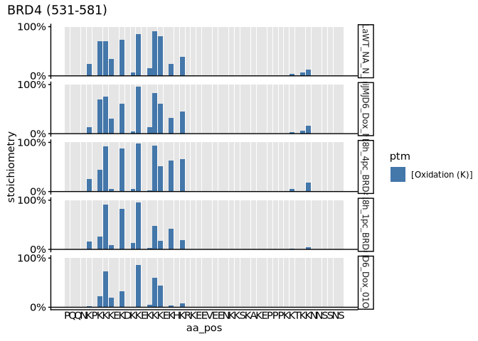

p2-07 · Plot site-specific stoichiometry
================
Yoichiro Sugimoto and Pallavi Kesavan
25 August, 2026

- <a href="#overview" id="toc-overview">Overview</a>
- <a href="#setup" id="toc-setup">Setup</a>
- <a href="#helper-functions" id="toc-helper-functions">Helper
  functions</a>
- <a href="#load-and-preprocess-data"
  id="toc-load-and-preprocess-data">Load and preprocess data</a>
- <a href="#normoxia-time-course" id="toc-normoxia-time-course">Normoxia
  time course</a>
- <a href="#normoxia-vs-hypoxia" id="toc-normoxia-vs-hypoxia">Normoxia vs
  hypoxia</a>
- <a href="#session-information" id="toc-session-information">Session
  information</a>

# Overview

**Purpose:** Visualise site-specific hydroxylation stoichiometry in
BRD2/3/4 across O2% and dox induction (via `plot_ptm_stoichiometry`).

**Inputs:** MS_KR_1 / MS_SS / PNAS stoichiometry tables from p2-01;
reference proteome.

**Outputs:** figures (rendered on knit).

**Upstream:** p2-01. **Downstream:** none.

# Setup

``` r
## Resolve the repository root (via the .here sentinel) and load the shared
## setup: packages, helper functions, ggplot/knitr settings, and project paths.
repo_root <- local({
  p <- normalizePath(getwd(), winslash = "/", mustWork = FALSE)
  while (!file.exists(file.path(p, ".here")) && !identical(dirname(p), p)) p <- dirname(p)
  p
})
source(file.path(repo_root, "R", "functions", "_setup.R"))
```

    ## - The project is out-of-sync -- use `renv::status()` for details.

# Helper functions

``` r
# Order the sample factor and draw the per-site stoichiometry plot for one accession
plot_brd_stoic <- function(subset_dt, accession, plot_range, sample_levels) {
  subset_dt[, sample_name := factor(sample_name, levels = sample_levels)]
  plot_ptm_stoichiometry(
    subset_dt,
    accession = accession, plot_range = plot_range,
    all.protein.bs, sample_colors = NA
  )
}
```

# Load and preprocess data

Loads and preprocesses the MS_KR_1 / MS_SS / PNAS stoichiometry tables
(via load_stoichiometry_datasets()).

``` r
# Load and preprocess the MS_KR_1, MS_SS and PNAS stoichiometry tables
# (see load_stoichiometry_datasets() in R/functions/2-useful_functions.R).
.stoic_data       <- load_stoichiometry_datasets(results.dir, data.dir)
ms_kr1_stoic_dt   <- .stoic_data$MS_KR1_stoic_dt
ms_ss_stoic_dt    <- .stoic_data$MS_SS_stoic_dt
pnas2022_stoic_dt <- .stoic_data$pnas2022_stoic_dt
```

``` r
# Remove BRD2/3 samples reporting BRD4 stoichiometry and vice versa: these are
# cross-protein false positives (e.g. from shared / homologous peptides).
ms_ss_stoic_dt <- ms_ss_stoic_dt[
  !((grepl("_BRD23$", sample_name) & gene_name == "BRD4") |
       (grepl("_BRD4$", sample_name) & gene_name %in% c("BRD2", "BRD3")))
]

# Combine the three datasets and keep BRD2/3/4 only
brd_stoic_dt <- rbindlist(
  list(ms_ss_stoic_dt, ms_kr1_stoic_dt, pnas2022_stoic_dt),
  use.names = TRUE
)
brd_stoic_dt <- brd_stoic_dt[gene_name %in% c("BRD2", "BRD3", "BRD4")]

# Simplified sample-group label shared by the plots below
brd_stoic_dt[, sample_group := case_when(
  condition == "MS_SS" & grepl("minusDox", sample_name) ~ "iJ6_0h_21pc_SS",
  condition == "MS_SS" ~ paste0("iJ6_", str_split_fixed(sample_name, "_", 3)[, 1], "_", str_split_fixed(sample_name, "_", 3)[, 2], "_SS"),
  sample_name == "HeLaiJMJD6_noDox_N_NA"       ~ "iJ6_0h_21pc_KR",
  sample_name == "HeLaiJMJD6_Dox_N_NA"         ~ "iJ6_24h_21pc_KR",
  sample_name == "HeLaWT_NA_N_NA"              ~ "WT_Inf_21pc_KR",
  sample_name == "HeLaiJMJD6_Dox_01O224h_NA"   ~ "iJ6_24h_01pc_KR",
  sample_name == "JQ1_HeLaWT_derivatised"      ~ "WT_Inf_21pc_PNAS",
  sample_name == "JQ1_HeLaJMJD6KO_derivatised" ~ "iJ6_Inf_21pc_PNAS"
)]

brd_stoic_dt[grepl("iJ6_0h", sample_group), .N, sample_group]
```

    ##      sample_group     N
    ##            <char> <int>
    ## 1: iJ6_0h_21pc_SS  1706
    ## 2: iJ6_0h_21pc_KR  1938

# Normoxia time course

Plots site-specific stoichiometry under normoxia across the JMJD6
re-expression time course for BRD2/3/4. The plotted amino-acid range
matches the region shown in the PNAS2022 paper.

``` r
# Select the appropriate minus-Dox (un-induced) control and exclude the JQ1/PNAS
# derivatised samples from these plots.
brd2_21pc_dt <- brd_stoic_dt[
  sample_group %in% c(
    "WT_Inf_21pc_KR", "iJ6_0h_21pc_KR", "iJ6_4h_21pc_SS", "iJ6_8h_21pc_SS", "iJ6_18h_21pc_SS", "iJ6_24h_21pc_KR"
    
  ) &
    gene_name == "BRD2"
]

plot_brd_stoic(
  brd2_21pc_dt, accession = "P25440", plot_range = c(540, 590),
  sample_levels = c("HeLaWT_NA_N_NA", "HeLaiJMJD6_noDox_N_NA",
                    "4h_21pc_BRD23", "8h_21pc_BRD23", "18h_21pc_BRD23",
                    "HeLaiJMJD6_Dox_N_NA")
)
```

<!-- --><!-- -->

``` r
brd3_21pc_dt <- brd_stoic_dt[
  grepl("Inf|0h|4h|8h|18h|24h", sample_group) &
    grepl("21pc", sample_group) &
    !sample_name %in% c("minusDox_BRD23", "JQ1_HeLaWT_derivatised", "JQ1_HeLaJMJD6KO_derivatised") &
    gene_name == "BRD3"
]

plot_brd_stoic(
  brd3_21pc_dt, accession = "Q15059", plot_range = c(483, 533),
  sample_levels = c("HeLaWT_NA_N_NA", "HeLaiJMJD6_noDox_N_NA",
                    "4h_21pc_BRD23", "8h_21pc_BRD23", "18h_21pc_BRD23",
                    "HeLaiJMJD6_Dox_N_NA")
)
```

<!-- --><!-- -->

``` r
brd4_21pc_dt <- brd_stoic_dt[
  grepl("Inf|0h|4h|8h|18h|24h", sample_group) &
    grepl("21pc", sample_group) &
    !sample_name %in% c("minusDox_BRD4", "JQ1_HeLaWT_derivatised", "JQ1_HeLaJMJD6KO_derivatised") &
    gene_name == "BRD4"
]

plot_brd_stoic(
  brd4_21pc_dt, accession = "O60885", plot_range = c(531, 581),
  sample_levels = c("HeLaWT_NA_N_NA", "HeLaiJMJD6_noDox_N_NA",
                    "4h_21pc_BRD4", "8h_21pc_BRD4", "18h_21pc_BRD4",
                    "HeLaiJMJD6_Dox_N_NA")
)
```

<!-- --><!-- -->

# Normoxia vs hypoxia

Plots site-specific stoichiometry comparing normoxia and hypoxia for
BRD2/3/4.

Sample-group ↔ sample-name key:

    # HeLaWT_NA_N_NA            - WT_Inf_21pc_KR
    # JQ1_HeLaWT_derivatised    - WT_Inf_21pc_PNAS
    # JQ1_HeLaJMJD6KO_derivatised - iJ6_Inf_21pc_PNAS
    # HeLaiJMJD6_Dox_N_NA       - iJ6_24h_21pc_KR
    # 18h_4pc_BRD23             - iJ6_18h_4pc_SS
    # 18h_1pc_BRD23             - iJ6_18h_1pc_SS
    # HeLaiJMJD6_Dox_01O224h_NA - iJ6_24h_01pc_KR
    # minusDox_BRD23            - iJ6_0h_21pc_SS
    # HeLaiJMJD6_noDox_N_NA     - iJ6_0h_21pc_KR

``` r
brd2_o2_dt <- brd_stoic_dt[
  grepl("Inf|18h|24h|0h", sample_group) &
    !sample_name %in% c("minusDox_BRD23", "18h_21pc_BRD23", "HeLaiJMJD6_noDox_N_NA",
                        "JQ1_HeLaWT_derivatised", "JQ1_HeLaJMJD6KO_derivatised") &
    gene_name == "BRD2"
]

plot_brd_stoic(
  brd2_o2_dt, accession = "P25440", plot_range = c(540, 590),
  sample_levels = c("HeLaWT_NA_N_NA", "HeLaiJMJD6_Dox_N_NA",
                    "18h_4pc_BRD23", "18h_1pc_BRD23", "HeLaiJMJD6_Dox_01O224h_NA")
)
```

<!-- --><!-- -->

``` r
brd3_o2_dt <- brd_stoic_dt[
  grepl("Inf|18h|24h|0h", sample_group) &
    !sample_name %in% c("minusDox_BRD23", "18h_21pc_BRD23", "HeLaiJMJD6_noDox_N_NA",
                        "JQ1_HeLaWT_derivatised", "JQ1_HeLaJMJD6KO_derivatised") &
    gene_name == "BRD3"
]

plot_brd_stoic(
  brd3_o2_dt, accession = "Q15059", plot_range = c(483, 533),
  sample_levels = c("HeLaWT_NA_N_NA", "HeLaiJMJD6_Dox_N_NA",
                    "18h_4pc_BRD23", "18h_1pc_BRD23", "HeLaiJMJD6_Dox_01O224h_NA")
)
```

<!-- --><!-- -->

``` r
brd4_o2_dt <- brd_stoic_dt[
  grepl("Inf|18h|24h|0h", sample_group) &
    !sample_name %in% c("minusDox_BRD4", "18h_21pc_BRD4", "HeLaiJMJD6_noDox_N_NA",
                        "JQ1_HeLaWT_derivatised", "JQ1_HeLaJMJD6KO_derivatised") &
    gene_name == "BRD4"
]

plot_brd_stoic(
  brd4_o2_dt, accession = "O60885", plot_range = c(531, 581),
  sample_levels = c("HeLaWT_NA_N_NA", "HeLaiJMJD6_Dox_N_NA",
                    "18h_4pc_BRD4", "18h_1pc_BRD4", "HeLaiJMJD6_Dox_01O224h_NA")
)
```

<!-- --><!-- -->

# Session information

``` r
sessioninfo::session_info()
```

    ## ─ Session info ───────────────────────────────────────────────────────────────
    ##  setting  value
    ##  version  R version 4.5.0 (2025-04-11)
    ##  os       Red Hat Enterprise Linux 9.6 (Plow)
    ##  system   x86_64, linux-gnu
    ##  ui       X11
    ##  language (EN)
    ##  collate  en_US.UTF-8
    ##  ctype    en_US.UTF-8
    ##  tz       Europe/Berlin
    ##  date     2026-08-25
    ##  pandoc   2.19.2 @ /gnu/store/sqwwnsp5xb8yd3z1a57lhldcsvx3z9gb-profile/bin/ (via rmarkdown)
    ##  quarto   NA
    ## 
    ## ─ Packages ───────────────────────────────────────────────────────────────────
    ##  ! package           * version    date (UTC) lib source
    ##  P AnnotationDbi     * 1.72.0     2025-10-29 [?] Bioconduc~
    ##  P beeswarm            0.4.0      2021-06-01 [?] CRAN (R 4.5.0)
    ##  P Biobase           * 2.70.0     2025-10-29 [?] Bioconduc~
    ##  P BiocGenerics      * 0.56.0     2025-10-29 [?] Bioconduc~
    ##  P Biostrings        * 2.78.0     2025-10-29 [?] Bioconduc~
    ##  P bit                 4.6.0      2025-03-06 [?] CRAN (R 4.5.0)
    ##  P bit64               4.8.2      2026-05-19 [?] CRAN (R 4.5.0)
    ##  P blob                1.3.0      2026-01-14 [?] CRAN (R 4.5.0)
    ##  P cachem              1.1.0      2024-05-16 [?] CRAN (R 4.5.0)
    ##  P cellranger          1.1.0      2016-07-27 [?] CRAN (R 4.5.0)
    ##  P cli                 3.6.6      2026-04-09 [?] CRAN (R 4.5.0)
    ##  P colourpicker        1.3.0      2023-08-21 [?] CRAN (R 4.5.0)
    ##  P crayon              1.5.3      2024-06-20 [?] CRAN (R 4.5.0)
    ##  P data.table        * 1.18.4     2026-05-06 [?] CRAN (R 4.5.0)
    ##  P DBI                 1.3.0      2026-02-25 [?] CRAN (R 4.5.0)
    ##  P digest              0.6.39     2025-11-19 [?] CRAN (R 4.5.0)
    ##  P dplyr             * 1.2.1      2026-04-03 [?] CRAN (R 4.5.0)
    ##  P eulerr            * 7.0.2      2024-03-28 [?] CRAN (R 4.5.0)
    ##  P evaluate            1.0.5      2025-08-27 [?] CRAN (R 4.5.0)
    ##  P farver              2.1.2      2024-05-13 [?] CRAN (R 4.5.0)
    ##  P fastmap             1.2.0      2024-05-15 [?] CRAN (R 4.5.0)
    ##  P formattable         0.2.1      2021-01-07 [?] CRAN (R 4.5.0)
    ##  P generics          * 0.1.4      2025-05-09 [?] CRAN (R 4.5.0)
    ##  P ggbeeswarm        * 0.7.3      2025-11-29 [?] CRAN (R 4.5.0)
    ##  P ggplot2           * 4.0.3      2026-04-22 [?] CRAN (R 4.5.0)
    ##  P glue                1.8.1      2026-04-17 [?] CRAN (R 4.5.0)
    ##  P gridExtra           2.3        2017-09-09 [?] CRAN (R 4.5.0)
    ##  P gtable              0.3.6      2024-10-25 [?] CRAN (R 4.5.0)
    ##  P htmltools           0.5.9      2025-12-04 [?] CRAN (R 4.5.0)
    ##  P htmlwidgets         1.6.4      2023-12-06 [?] CRAN (R 4.5.0)
    ##  P httpuv              1.6.17     2026-03-18 [?] CRAN (R 4.5.0)
    ##  P httr                1.4.8      2026-02-13 [?] CRAN (R 4.5.0)
    ##  P IRanges           * 2.44.0     2025-10-29 [?] Bioconduc~
    ##  P janitor           * 2.2.1      2024-12-22 [?] CRAN (R 4.5.0)
    ##  P jsonlite            2.0.0      2025-03-27 [?] CRAN (R 4.5.0)
    ##  P KEGGREST            1.50.0     2025-10-29 [?] Bioconduc~
    ##  P khroma            * 1.17.0     2025-09-29 [?] CRAN (R 4.5.0)
    ##  P knitr             * 1.51       2025-12-20 [?] CRAN (R 4.5.0)
    ##  P labeling            0.4.3      2023-08-29 [?] CRAN (R 4.5.0)
    ##  P later               1.4.8      2026-03-05 [?] CRAN (R 4.5.0)
    ##  P lattice             0.22-9     2026-02-09 [?] CRAN (R 4.5.0)
    ##  P lazyeval            0.2.3      2026-04-04 [?] CRAN (R 4.5.0)
    ##  P lifecycle           1.0.5      2026-01-08 [?] CRAN (R 4.5.0)
    ##  P lubridate           1.9.5      2026-02-04 [?] CRAN (R 4.5.0)
    ##  P magrittr          * 2.0.5      2026-04-04 [?] CRAN (R 4.5.0)
    ##  P Matrix              1.7-5      2026-03-21 [?] CRAN (R 4.5.0)
    ##  P memoise             2.0.1      2021-11-26 [?] CRAN (R 4.5.0)
    ##  P mgcv              * 1.9-4      2025-11-07 [?] CRAN (R 4.5.0)
    ##  P mime                0.13       2025-03-17 [?] CRAN (R 4.5.0)
    ##  P miniUI              0.1.2      2025-04-17 [?] CRAN (R 4.5.0)
    ##  P nlme              * 3.1-169    2026-03-27 [?] CRAN (R 4.5.0)
    ##  P org.Hs.eg.db      * 3.22.0     2026-06-24 [?] Bioconductor
    ##  P otel                0.2.0      2025-08-29 [?] CRAN (R 4.5.0)
    ##  P patchwork         * 1.3.2      2025-08-25 [?] CRAN (R 4.5.0)
    ##  P pillar              1.11.1     2025-09-17 [?] CRAN (R 4.5.0)
    ##  P pkgconfig           2.0.3      2019-09-22 [?] CRAN (R 4.5.0)
    ##  P plotly              4.12.0     2026-01-24 [?] CRAN (R 4.5.0)
    ##  P plyr                1.8.9      2023-10-02 [?] CRAN (R 4.5.0)
    ##  P png                 0.1-9      2026-03-15 [?] CRAN (R 4.5.0)
    ##  P polyclip            1.10-7     2024-07-23 [?] CRAN (R 4.5.0)
    ##  P polylabelr          1.0.0      2026-01-19 [?] CRAN (R 4.5.0)
    ##  P promises            1.5.0      2025-11-01 [?] CRAN (R 4.5.0)
    ##    ptm.stoichiometry * 0.0.0.9000 2026-06-24 [1] local (/fast/AG_Sugimoto/home/users/yoichiro/projects/ptm.stoichiometry)
    ##  P purrr               1.2.2      2026-04-10 [?] CRAN (R 4.5.0)
    ##  P R6                  2.6.1      2025-02-15 [?] CRAN (R 4.5.0)
    ##  P RColorBrewer      * 1.1-3      2022-04-03 [?] CRAN (R 4.5.0)
    ##  P Rcpp                1.1.1-1.1  2026-04-24 [?] CRAN (R 4.5.0)
    ##  P readxl            * 1.5.0      2026-05-16 [?] CRAN (R 4.5.0)
    ##    renv                1.1.5      2025-07-24 [1] CRAN (R 4.5.0)
    ##  P rlang               1.2.0      2026-04-06 [?] CRAN (R 4.5.0)
    ##  P rmarkdown           2.31       2026-03-26 [?] CRAN (R 4.5.0)
    ##  P RSQLite             3.53.2     2026-06-17 [?] CRAN (R 4.5.0)
    ##  P S4Vectors         * 0.48.1     2026-04-05 [?] Bioconduc~
    ##  P S7                  0.2.2      2026-04-22 [?] CRAN (R 4.5.0)
    ##  P scales              1.4.0      2025-04-24 [?] CRAN (R 4.5.0)
    ##  P Seqinfo           * 1.0.0      2025-10-29 [?] Bioconduc~
    ##  P sessioninfo         1.2.4      2026-06-04 [?] CRAN (R 4.5.0)
    ##  P shiny               1.14.0     2026-06-21 [?] CRAN (R 4.5.0)
    ##  P shinythemes         1.2.0      2021-01-25 [?] CRAN (R 4.5.0)
    ##  P snakecase           0.11.1     2023-08-27 [?] CRAN (R 4.5.0)
    ##  P stringi             1.8.7      2025-03-27 [?] CRAN (R 4.5.0)
    ##  P stringr           * 1.6.0      2025-11-04 [?] CRAN (R 4.5.0)
    ##    subcellularvis    * 0.0.0.9000 2026-06-24 [1] local (/fast/AG_Sugimoto/home/users/yoichiro/software/R_packages/subcellularvis)
    ##  P tibble              3.3.1      2026-01-11 [?] CRAN (R 4.5.0)
    ##  P tidyr               1.3.2      2025-12-19 [?] CRAN (R 4.5.0)
    ##  P tidyselect          1.2.1      2024-03-11 [?] CRAN (R 4.5.0)
    ##  P timechange          0.4.0      2026-01-29 [?] CRAN (R 4.5.0)
    ##  P UpSetR              1.4.1      2026-05-25 [?] CRAN (R 4.5.0)
    ##  P vctrs               0.7.3      2026-04-11 [?] CRAN (R 4.5.0)
    ##  P vipor               0.4.7      2023-12-18 [?] CRAN (R 4.5.0)
    ##  P viridisLite         0.4.3      2026-02-04 [?] CRAN (R 4.5.0)
    ##  P withr               3.0.3      2026-06-19 [?] CRAN (R 4.5.0)
    ##  P xfun                0.59       2026-06-19 [?] CRAN (R 4.5.0)
    ##  P xtable              1.8-8      2026-02-22 [?] CRAN (R 4.5.0)
    ##  P XVector           * 0.50.0     2025-10-29 [?] Bioconduc~
    ##  P yaml                2.3.12     2025-12-10 [?] CRAN (R 4.5.0)
    ## 
    ##  [1] /fast/AG_Sugimoto/home/users/yoichiro/projects/20241111_PTMs_in_lysine_rich_domains/renv/library/linux-rhel-9.6/R-4.5/x86_64-unknown-linux-gnu
    ##  [2] /fast/home/y/ysugimo/.cache/R/renv/sandbox/linux-rhel-9.6/R-4.5/x86_64-unknown-linux-gnu/cb72a45c
    ## 
    ##  * ── Packages attached to the search path.
    ##  P ── Loaded and on-disk path mismatch.
    ## 
    ## ──────────────────────────────────────────────────────────────────────────────
