p2-08 · Analyse hydroxylation kinetics
================
Yoichiro Sugimoto and Pallavi Kesavan
24 August, 2026

- [Overview](#overview)
- [Setup](#setup)
- [Load and preprocess data](#load-and-preprocess-data)
- [Normoxia vs hypoxia](#normoxia-vs-hypoxia)
- [Normoxia dox time course](#normoxia-dox-time-course)
- [t50 (time to half-maximal)](#t50-time-to-half-maximal)
- [Kinetics](#kinetics)
- [XIC vs stoichiometry](#xic-vs-stoichiometry)
- [Neighbouring-site interaction](#neighbouring-site-interaction)
- [Oxygen sensitivity](#oxygen-sensitivity)
- [Baseline vs hypoxic change](#baseline-vs-hypoxic-change)
- [Session information](#session-information)

# Overview

**Purpose:** Analyse and visualise hydroxylation across conditions —
hypoxia vs normoxia, kinetics (t50), cross-dataset XIC-vs-stoichiometry,
neighbouring-site interaction, and O2 / dox sensitivity.

**Inputs:** MS_KR_1 / MS_SS / PNAS stoichiometry tables from p2-01; XIC
data (`data/xic_MS_SS.csv`); reference proteome.

**Outputs:** figures (rendered on knit).

**Upstream:** p2-01. **Downstream:** none.

# Setup

``` r
# setwd("~/mdc_fast/AG_Sugimoto/home/users/yoichiro/projects/20241111_PTMs_in_lysine_rich_domains/")
# Sys.setenv(USE_BUNDLED_LIBUV = "1")
# renv::restore(
#   lockfile = "/fast/AG_Sugimoto/home/users/yoichiro/projects/20241111_PTMs_in_lysine_rich_domains/R/renv.lock",
#   prompt = FALSE
# )


## Resolve the repository root (via the .here sentinel) and load the shared
## setup: packages, helper functions, ggplot/knitr settings, and project paths.
repo_root <- local({
  p <- normalizePath(getwd(), winslash = "/", mustWork = FALSE)
  while (!file.exists(file.path(p, ".here")) && !identical(dirname(p), p)) p <- dirname(p)
  p
})
source(file.path(repo_root, "R", "functions", "_setup.R"))
```

    ## The following package(s) are missing entries in the cache:
    ## - AnnotationDbi
    ## - askpass
    ## - Biobase
    ## - bit
    ## - bit64
    ## - blob
    ## - colourpicker
    ## - commonmark
    ## - crosstalk
    ## - curl
    ## - DBI
    ## - eulerr
    ## - formattable
    ## - GenSA
    ## - gridExtra
    ## - htmlwidgets
    ## - httpuv
    ## - httr
    ## - KEGGREST
    ## - later
    ## - lattice
    ## - lazyeval
    ## - Matrix
    ## - mgcv
    ## - miniUI
    ## - nlme
    ## - openssl
    ## - openxlsx
    ## - org.Hs.eg.db
    ## - otel
    ## - plotly
    ## - plyr
    ## - png
    ## - polyclip
    ## - polylabelr
    ## - promises
    ## - Rcpp
    ## - RcppArmadillo
    ## - RSQLite
    ## - shiny
    ## - shinyjs
    ## - shinythemes
    ## - sourcetools
    ## - sys
    ## - UpSetR
    ## - xtable
    ## - zip
    ## These packages will need to be reinstalled.
    ## 
    ## The following package(s) have broken symlinks into the cache:
    ## - AnnotationDbi
    ## - askpass
    ## - Biobase
    ## - bit
    ## - bit64
    ## - blob
    ## - colourpicker
    ## - commonmark
    ## - crosstalk
    ## - curl
    ## - DBI
    ## - eulerr
    ## - formattable
    ## - GenSA
    ## - gridExtra
    ## - htmlwidgets
    ## - httpuv
    ## - httr
    ## - KEGGREST
    ## - later
    ## - lattice
    ## - lazyeval
    ## - Matrix
    ## - mgcv
    ## - miniUI
    ## - nlme
    ## - openssl
    ## - openxlsx
    ## - org.Hs.eg.db
    ## - otel
    ## - plotly
    ## - plyr
    ## - png
    ## - polyclip
    ## - polylabelr
    ## - promises
    ## - Rcpp
    ## - RcppArmadillo
    ## - RSQLite
    ## - shiny
    ## - shinyjs
    ## - shinythemes
    ## - sourcetools
    ## - sys
    ## - UpSetR
    ## - xtable
    ## - zip
    ## Use `]8;;x-r-run:renv::repair()renv::repair()]8;;` to try and reinstall these packages.
    ## 
    ## - The project is out-of-sync -- use `]8;;x-r-run:renv::status()renv::status()]8;;` for details.

# Load and preprocess data

Loads the MS_KR_1 / MS_SS / PNAS stoichiometry tables and harmonises
sample labels. The grouped zero-fill / reshape used below is the shared
`contrast_hydroxylation()` helper in `R/functions/2-useful_functions.R`
(p2-06 uses the same helper, grouped by oxygen status).

``` r
# Load and preprocess the MS_KR_1, MS_SS and PNAS stoichiometry tables
# (see load_stoichiometry_datasets() in R/functions/2-useful_functions.R).
.stoic_data       <- load_stoichiometry_datasets(results.dir, data.dir)
ms_kr1_stoic_dt   <- .stoic_data$MS_KR1_stoic_dt
ms_ss_stoic_dt    <- .stoic_data$MS_SS_stoic_dt
pnas2022_stoic_dt <- .stoic_data$pnas2022_stoic_dt
pnas2022_dt       <- .stoic_data$pnas2022_dt
```

``` r
# Remove BRD2/3 samples reporting BRD4 stoichiometry and vice versa: these are
# cross-protein false positives (e.g. from shared / homologous peptides).
ms_ss_stoic_dt <- ms_ss_stoic_dt[
  !((grepl("_BRD23$", sample_name) & gene_name == "BRD4") |
       (grepl("_BRD4$", sample_name) & gene_name %in% c("BRD2", "BRD3")))
]

# Combine MS_SS and MS_KR_1 data (PNAS optionally added below)
ms_ss_kr_pnas_dt <- rbindlist(list(ms_ss_stoic_dt,
                         ms_kr1_stoic_dt#,
                         #pnas2022_stoic_dt
                         ),
                         use.names = TRUE)

ms_ss_kr_pnas_dt <- ms_ss_kr_pnas_dt[
  gene_name %in% c("BRD2", "BRD3", "BRD4")
]

# Column "sample group" created to simplify sample names
ms_ss_kr_pnas_dt[, `:=`(
  sample_group = case_when(
    condition == "MS_SS" & grepl("minusDox", sample_name) ~ paste0("iJ6_0h_21pc_SS"),
    condition == "MS_SS"~ paste0("iJ6_", str_split_fixed(sample_name, "_", 3)[, 1], "_", str_split_fixed(sample_name, "_", 3)[, 2], "_SS"),
    sample_name == "HeLaiJMJD6_noDox_N_NA" ~ "iJ6_0h_21pc_KR",
    sample_name == "HeLaiJMJD6_Dox_N_NA" ~ "iJ6_24h_21pc_KR",
    sample_name == "HeLaWT_NA_N_NA" ~ "WT_Inf_21pc_KR", 
    sample_name == "HeLaiJMJD6_Dox_01O224h_NA" ~ "iJ6_24h_01pc_KR",
    sample_name == "JQ1_HeLaWT_derivatised" ~ "WT_Inf_21pc_PNAS", 
    sample_name == "JQ1_HeLaJMJD6KO_derivatised" ~ "iJ6_Inf_21pc_PNAS"
  )
)]
```

# Normoxia vs hypoxia

Plots per-site stoichiometry under normoxia vs hypoxia with JMJD6
re-expression.

``` r
# Diagnostic-ion (or PNAS-curated) sites across MS_SS, MS_KR_1 and PNAS
di_sites_dt <- rbind(
  ms_ss_stoic_dt[is_diagnostic_peak == TRUE, .(protein_accession, aa_pos)],
  ms_kr1_stoic_dt[is_diagnostic_peak == TRUE, .(protein_accession, aa_pos)],
  pnas2022_stoic_dt[is_diagnostic_peak == TRUE, .(protein_accession, aa_pos)],
  pnas2022_dt[curated_oxK_site == TRUE, .(protein_accession, aa_pos)]
)
di_sites_dt <- di_sites_dt[!duplicated(paste(protein_accession, aa_pos))]

# Keep only those unique diagnostic-ion sites
ms_ss_kr_pnas_dt <- merge(
  di_sites_dt,
  ms_ss_kr_pnas_dt[aa == "K"],
  by = c("protein_accession", "aa_pos")
)

# Using contrast function on MS_SS_KR raw stoic data
c_ms_ss_kr_pnas_dt <- contrast_hydroxylation(ms_ss_kr_pnas_dt, group_col = "sample_group")

# Factor the gene names
c_ms_ss_kr_pnas_dt[, `:=`(
  gene_name =  
    factor(gene_name, levels = c("BRD2", "BRD3", "BRD4"))
)]
```

``` r
# Change wide format to long format 
lc_ms_ss_kr_pnas_dt <- melt(
  c_ms_ss_kr_pnas_dt,
  id.vars = c("protein_accession", "gene_name", "aa_pos"),
  value.name = "Stoichiometry", 
  variable.name = "sample_group"
  #value.var = grep("_", colnames(c_MS_SS_KR_all_dt), value = TRUE)
)

# Separate the contents of sample_group column into new columns 
lc_ms_ss_kr_pnas_dt[, `:=`(
  cell = str_split_fixed(sample_group, "_", 4)[, 1],
  induction = str_split_fixed(sample_group, "_", 4)[, 2] %>%
    factor(levels = c("Inf", "0h", "4h", "8h", "18h", "24h")),
  oxygen = str_split_fixed(sample_group, "_", 4)[, 3],
  dataset = str_split_fixed(sample_group, "_", 4)[, 4]
)]

# reorder the oxygen levels
lc_ms_ss_kr_pnas_dt <-  lc_ms_ss_kr_pnas_dt[, oxygen := factor(
  oxygen,
  levels = c("01pc", "1pc", "4pc", "21pc")
)]

# subset rows that do not contain NA values 
lc_ms_ss_kr_pnas_dt <- lc_ms_ss_kr_pnas_dt[!is.na(Stoichiometry)]

# counting the data per sample and size 
lc_ms_ss_kr_pnas_dt[, data_size_per_sample := .N, by = list(sample_group)]
lc_ms_ss_kr_pnas_dt[, data_size_per_site := .N, by = list(protein_accession, aa_pos)]
```

# Normoxia dox time course

Examines stoichiometry under normoxia across the doxycycline induction
time course.

``` r
# Subset data to WT normoxia (MS_KR_1 sample)
wt_21pc <- lc_ms_ss_kr_pnas_dt[sample_group == "WT_Inf_21pc_KR", .(protein_accession, aa_pos, Stoichiometry)]
setnames(wt_21pc, old = "Stoichiometry", "WT_stoichiometry")

# Sub-setting and combining data tables 
long_pc2wt_21pc <- rbind(
  lc_ms_ss_kr_pnas_dt[
    cell == "iJ6" &
    oxygen == "21pc"
  ],
  lc_ms_ss_kr_pnas_dt[sample_group == "WT_Inf_21pc_KR"]
)
long_pc2wt_21pc <- long_pc2wt_21pc[sample_group != "iJ6_0h_21pc_SS"]

# Here, we combine induction times 18h and 24h into category 18-24h 
lc_ms_ss_kr_pnas_dt[, induction2 := case_when(
  induction == "18h" ~ "18-24h",
  induction == "24h" ~ "18-24h",
  #induction == "Inf" ~ "18-24h",
  TRUE ~ induction
)][, induction2 := factor(induction2, levels = c("Inf", "0h", "4h", "8h", "18-24h"))]

# Count data per protein accession and aa position
plot_long_pc2wt_21pc <- copy(long_pc2wt_21pc)[, data_size_per_site := .N, by = list(protein_accession, aa_pos)]
plot_long_pc2wt_21pc <- plot_long_pc2wt_21pc[data_size_per_site == max(plot_long_pc2wt_21pc[, data_size_per_site])] # keep only max value of data

# Keep only sites which are WT and stoichiometry > 0 
plot_long_pc2wt_21pc <- plot_long_pc2wt_21pc[
  paste(protein_accession, aa_pos) %in% plot_long_pc2wt_21pc[cell == "WT"][Stoichiometry > 0, paste(protein_accession, aa_pos)]
]

# Boxplot - comparing normoxia in different dox incubation timings
ggplot(
  plot_long_pc2wt_21pc,
  aes(
    x = induction,
    y = Stoichiometry
  )
) +
  geom_boxplot(outlier.shape = NA) +
  ylab("Stoichiometry [%]") +
  theme_classic_2()+
  theme(axis.text.x = element_text(angle = 90, hjust = 1)) + 
  theme(legend.position="right") +
  coord_cartesian(ylim = c(0, 1)) +
  theme(aspect.ratio = 1.5) +
  scale_y_continuous(labels = scales::percent_format(accuracy = 1)) +
  ggtitle("All the sites")
```

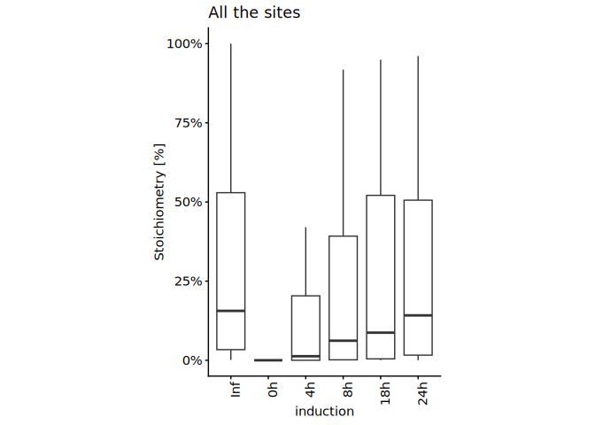<!-- -->

``` r
plot_long_pc2wt_21pc[, .N, by = induction]
```

    ##    induction     N
    ##       <fctr> <int>
    ## 1:        0h    42
    ## 2:       18h    42
    ## 3:       24h    42
    ## 4:        4h    42
    ## 5:        8h    42
    ## 6:       Inf    42

``` r
# Plot ratio
# Merge MS_SS normoxia data with MS_KR_1 WT normoxia data
pc2wt_21pc <- merge(
  lc_ms_ss_kr_pnas_dt[
    cell == "iJ6" &
    oxygen == "21pc"
  ],
  wt_21pc,
  by = c("protein_accession", "aa_pos")
)

# Subset data to WT_stoichiometry > 0 and exclude sample group = iJ6_0h_21pc_SS
pc2wt_21pc_sub <- pc2wt_21pc[WT_stoichiometry > 0][sample_group != "iJ6_0h_21pc_SS"]

pc2wt_21pc_sub <- copy(pc2wt_21pc_sub)[, data_size_per_site := .N, by = list(protein_accession, aa_pos)]
pc2wt_21pc_sub <- pc2wt_21pc_sub[data_size_per_site == max(pc2wt_21pc_sub[, data_size_per_site])]

# Boxplot - comparing normoxia in different dox incubation timings (relative to WT stoichiometry)
ggplot(
  data = pc2wt_21pc_sub,
  aes(
    x = induction,
    y = Stoichiometry / WT_stoichiometry
  )
) +
  #geom_hline(yintercept = 1, color = "gray60") +
  geom_boxplot(outlier.shape = NA) +
  # facet_grid(~ oxygen) +
  ylab("Stoichiometry [% to WT]") +
  theme_classic_2()+
  theme(axis.text.x = element_text(angle = 90, hjust = 1)) + 
  theme(legend.position="right") +
  coord_cartesian(ylim = c(0, 1.5)) +
  theme(aspect.ratio = 2) +
  scale_y_continuous(labels = scales::percent_format(accuracy = 1))
```

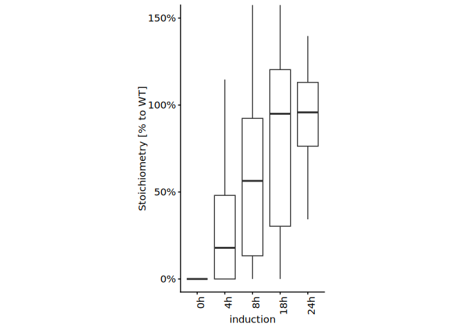<!-- -->

``` r
# Create data table  
induction_t_test <- data.table()

# One sample two-sided t.test compared to mu = 1
for(i in pc2wt_21pc_sub[, unique(induction)]){
  t.out <- t.test(
    pc2wt_21pc_sub[induction == i][, Stoichiometry / WT_stoichiometry],
    mu = 1,
    alternative = "two.sided"
  )
  induction_t_test <- rbind(
    induction_t_test,
    data.table(induction = i, p_value = t.out$p.value, n = nrow(pc2wt_21pc_sub[induction == i]))
  )  
}

# Adjusted P-value
induction_t_test[, padj := p.adjust(p_value, method = "holm")]
induction_t_test[, significance := case_when(
  padj < 0.005 ~ "**",
  padj < 0.05 ~ "*",
  TRUE ~ "N.S."
)]

induction_t_test
```

    ##    induction      p_value     n         padj significance
    ##       <char>        <num> <int>        <num>       <char>
    ## 1:        0h 7.743089e-30    42 3.871544e-29           **
    ## 2:       18h 5.381566e-01    42 1.000000e+00         N.S.
    ## 3:       24h 7.616065e-01    42 1.000000e+00         N.S.
    ## 4:        4h 1.244710e-09    42 4.978840e-09           **
    ## 5:        8h 1.178126e-05    42 3.534378e-05           **

# t50 (time to half-maximal)

Estimates t50 — the induction time to reach half-maximal stoichiometry —
per site.

``` r
# helper: convert time to numeric and replace Inf by a large finite value
time_to_num <- function(x, inf_value = 100) {
  x_chr <- as.character(x)
  out <- suppressWarnings(as.numeric(gsub("[^0-9.]+", "", x_chr)))
  out[grepl("^inf$", x_chr, ignore.case = TRUE)] <- inf_value
  out[is.infinite(out)] <- inf_value
  out
}

# Calculate t50 based on induction time 
calc_t50 <- function(dt, time_col = "induction", y_col = "Stoichiometry", inf_value = 100) {
  t <- time_to_num(dt[[time_col]], inf_value = inf_value)
  y <- as.numeric(dt[[y_col]])

  keep <- is.finite(t) & is.finite(y)
  t <- t[keep]
  y <- y[keep]

  if (length(t) < 2L || uniqueN(t) < 2L || all(y <= 0, na.rm = TRUE)) {
    return(NA_real_)
  }

  # average replicates at the same time
  d <- data.table(t = t, y = y)[, .(y = mean(y, na.rm = TRUE)), by = t][order(t)]

  # monotone increasing fit
  iso <- isoreg(d$t, d$y)
  y_fit <- iso$yf

  ymax <- max(y_fit, na.rm = TRUE)
  if (!is.finite(ymax) || ymax <= 0) return(NA_real_)

  y_half <- ymax / 2

  # first point where fitted curve reaches half-max
  idx <- which(y_fit >= y_half)[1]
  if (is.na(idx)) return(NA_real_)

  if (idx == 1L) return(d$t[1])

  t1 <- d$t[idx - 1L]
  t2 <- d$t[idx]
  y1 <- y_fit[idx - 1L]
  y2 <- y_fit[idx]

  if (y2 == y1) return(mean(c(t1, t2)))

  t1 + (y_half - y1) * (t2 - t1) / (y2 - y1)
}

# Calculate t50 for normoxia data 
t50_dt <- lc_ms_ss_kr_pnas_dt[oxygen == "21pc"][, .(
  t50 = calc_t50(.SD, time_col = "induction", y_col = "Stoichiometry", inf_value = 100),
  n = .N
), by = .(gene_name, aa_pos)]

t50_dt[, `:=`(
  t50_bin = case_when(
    t50 <= 4 ~ "0-4h",
    t50 <= 8 ~ "4-8h",
    TRUE ~ ">8h"
  ) %>% factor(levels = c("0-4h", "4-8h", ">8h"))
)]

t50_dt
```

    ##     gene_name aa_pos       t50     n t50_bin
    ##        <fctr>  <int>     <num> <int>  <fctr>
    ##  1:      BRD4    291 62.000000     7     >8h
    ##  2:      BRD4    329 13.000000     7     >8h
    ##  3:      BRD4    332 10.875997     7     >8h
    ##  4:      BRD4    535  5.205940     7    4-8h
    ##  5:      BRD4    537 12.537167     7     >8h
    ##  6:      BRD4    538  1.914826     7    0-4h
    ##  7:      BRD4    539 20.354251     7     >8h
    ##  8:      BRD4    541  2.000000     6    0-4h
    ##  9:      BRD4    543  2.000000     6    0-4h
    ## 10:      BRD4    544  2.202539     6    0-4h
    ## 11:      BRD4    546 19.094271     6     >8h
    ## 12:      BRD4    547  2.274141     6    0-4h
    ## 13:      BRD4    548  2.757705     6    0-4h
    ## 14:      BRD4    550  5.957624     6    4-8h
    ## 15:      BRD4    552  4.641731     7    4-8h
    ## 16:      BRD4    554 11.541566     7     >8h
    ## 17:      BRD4    561 21.276581     7     >8h
    ## 18:      BRD4    562 15.945181     7     >8h
    ## 19:      BRD4    572  5.688024     7    4-8h
    ## 20:      BRD4    574 19.155493     7     >8h
    ## 21:      BRD4    575 14.865966     7     >8h
    ## 22:      BRD4    727 12.503481     4     >8h
    ## 23:      BRD2    546 19.201084     7     >8h
    ## 24:      BRD2    551  4.166637     5    4-8h
    ## 25:      BRD2    552  6.595157     5    4-8h
    ## 26:      BRD2    554  4.482859     5    4-8h
    ## 27:      BRD2    555  8.000000     4    4-8h
    ## 28:      BRD2    556  8.000000     4    4-8h
    ## 29:      BRD2    557  8.000000     4    4-8h
    ## 30:      BRD2    585 21.000000     7     >8h
    ## 31:      BRD2    586 19.995857     7     >8h
    ## 32:      BRD2    589 13.918552     7     >8h
    ## 33:      BRD2    713 21.000000     7     >8h
    ## 34:      BRD2    718 21.000000     7     >8h
    ## 35:      BRD2    755 19.116352     7     >8h
    ## 36:      BRD2    756 42.153411     7     >8h
    ## 37:      BRD3    245 37.736947     7     >8h
    ## 38:      BRD3    364 31.555315     7     >8h
    ## 39:      BRD3    487 61.640419     7     >8h
    ## 40:      BRD3    489 10.259251     7     >8h
    ## 41:      BRD3    490 20.979746     7     >8h
    ## 42:      BRD3    491  5.273730     7    4-8h
    ## 43:      BRD3    492  2.965761     7    0-4h
    ## 44:      BRD3    494  3.306317     7    0-4h
    ## 45:      BRD3    495  9.684812     7     >8h
    ## 46:      BRD3    500 18.957295     7     >8h
    ## 47:      BRD3    501  5.638917     7    4-8h
    ## 48:      BRD3    502  3.837635     7    0-4h
    ## 49:      BRD3    504  2.000000     7    0-4h
    ## 50:      BRD3    538 10.701912     7     >8h
    ## 51:      BRD3    591  1.758896     7    0-4h
    ## 52:      BRD3    650 13.000000     7     >8h
    ## 53:      BRD3    651  7.106203     7    4-8h
    ## 54:      BRD3    655 13.000000     7     >8h
    ## 55:      BRD3    683 58.749514     7     >8h
    ## 56:      BRD3    684 10.794703     7     >8h
    ##     gene_name aa_pos       t50     n t50_bin
    ##        <fctr>  <int>     <num> <int>  <fctr>

# Kinetics

Summarises per-site hydroxylation kinetics (t50 distributions across
BRD2/3/4).

``` r
# Kinetics uses the induction time course excluding 0h and 18h, and requires
# detectable WT stoichiometry (> 0).
kinetics_data <- pc2wt_21pc[!(induction %in% c("0h", "18h"))][WT_stoichiometry > 0]

# Boxplot - WT stoichiometry versus normalized stoichiometry 
ggplot(
  data = kinetics_data,
  aes(
    x = WT_stoichiometry,
    y = Stoichiometry / WT_stoichiometry
  )
) +
  # geom_smooth(method = "lm", se = FALSE) +
  geom_point() +
  facet_grid(~ induction2) +
  ylab("Stoichiometry [% to WT]") +
  theme_classic_2()+
  theme(axis.text.x = element_text(angle = 90, hjust = 1)) + 
  theme(legend.position="right") +
  coord_cartesian(ylim = c(0, 1.5)) +
  theme(aspect.ratio = 1) +
  scale_x_continuous(labels = scales::percent_format(accuracy = 1))
```

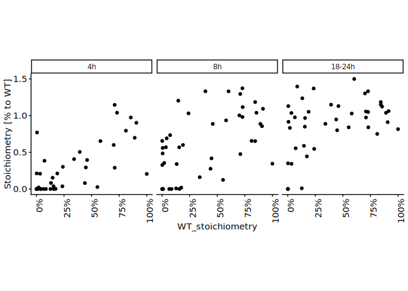<!-- -->

``` r
# Spearman correlation between WT stoichiometry and normalized stoichiometry 
kinetics_out <- data.table()

for(i2 in kinetics_data[, unique(induction2)]){
  c1 <- kinetics_data[induction2 == i2] %$%
    cor.test(x = WT_stoichiometry, y = Stoichiometry / WT_stoichiometry, method = "spearman")
  
  kinetics_out <- rbind(kinetics_out, data.table(induction2 = i2, rho = c1$estimate, p_val = c1$p.value, n = nrow(kinetics_data[induction2 == i2])))
}
```

    ## Warning in cor.test.default(x = WT_stoichiometry, y =
    ## Stoichiometry/WT_stoichiometry, : Cannot compute exact p-value with ties
    ## Warning in cor.test.default(x = WT_stoichiometry, y =
    ## Stoichiometry/WT_stoichiometry, : Cannot compute exact p-value with ties
    ## Warning in cor.test.default(x = WT_stoichiometry, y =
    ## Stoichiometry/WT_stoichiometry, : Cannot compute exact p-value with ties

``` r
# Adjusted p-value
kinetics_out[, padj := p.adjust(p_val, method = "holm")] # Holm correction for multiple comparisons

kinetics_out
```

    ##    induction2       rho        p_val     n         padj
    ##        <char>     <num>        <num> <int>        <num>
    ## 1:     18-24h 0.1381575 3.490397e-01    48 3.490397e-01
    ## 2:         4h 0.6632045 1.700021e-06    42 5.100062e-06
    ## 3:         8h 0.4699430 7.513709e-04    48 1.502742e-03

``` r
kinetics_data <- merge(
  kinetics_data,
  t50_dt,
  by = c("gene_name", "aa_pos")
)

# Boxplot - half-time versus stoichiometry 
ggplot(
  data = kinetics_data[!duplicated(paste(gene_name, aa_pos))],
  aes(
    x = t50_bin,
    y = WT_stoichiometry
  )
) +
  # geom_smooth(method = "lm", se = FALSE) +
  geom_boxplot(outlier.shape = NA) +
  ylab("Stoichiometry [%]") +
  theme_classic_2()+
  theme(axis.text.x = element_text(angle = 90, hjust = 1)) + 
  theme(legend.position="right") +
  coord_cartesian(ylim = c(0, 1)) +
  theme(aspect.ratio = 3) +
  scale_y_continuous(labels = scales::percent_format(accuracy = 1))
```

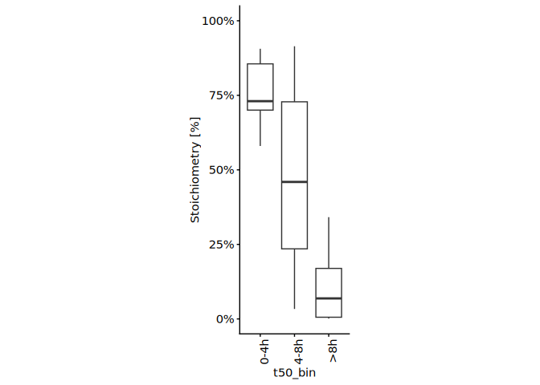<!-- -->

``` r
kinetics_data[!duplicated(paste(gene_name, aa_pos))][, table(gene_name, t50_bin)]
```

    ##          t50_bin
    ## gene_name 0-4h 4-8h >8h
    ##      BRD2    0    6   6
    ##      BRD3    3    3  10
    ##      BRD4    6    4  10

# XIC vs stoichiometry

Benchmarks extracted-ion-chromatogram (XIC) intensities against
precursor-intensity stoichiometry across datasets.

``` r
# Load XIC data
xic_ms_ss_dt <- fread(file.path(data.dir, "XIC_MS_SS/xic_MS_SS.csv"))
xic_ms_ss_dt[, induction2 := case_when(
  induction == "18h" ~ "18-24h",
  TRUE ~ induction
)]

on_lc_ms_ss_kr_pnas_dt <- copy(lc_ms_ss_kr_pnas_dt)[, induction2 := case_when(
  induction == "18h" ~ "18-24h",
  induction == "24h" ~ "18-24h",
  #induction == "Inf" ~ "18-24h",
  TRUE ~ induction
)]

# on_lc_ms_ss_kr_pnas_dt <- on_lc_ms_ss_kr_pnas_dt[induction != "24h"]

# Merge XIC data and stoichiometry data
xic_stoic <- merge(on_lc_ms_ss_kr_pnas_dt,
                   xic_ms_ss_dt,
                   by = c("induction2", "oxygen", "gene_name", "aa_pos"))

xic_stoic[, XIC := XIC/100]

# Scatter plot - XIC vs stoichiometry
ggplot(
  xic_stoic,
  aes(
    x = XIC,
    y = Stoichiometry
  )
) + 
  geom_point(size = 2) +
  theme_classic_2() +
  theme(aspect.ratio = 1) +
  coord_cartesian(xlim = c(0, 0.7), ylim = c(0, 0.7)) +
  scale_y_continuous(labels = scales::percent_format(accuracy = 1)) +
  scale_x_continuous(labels = scales::percent_format(accuracy = 1))
```

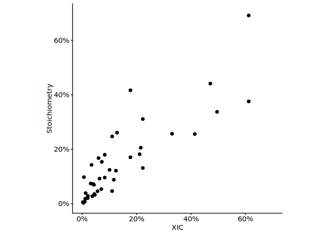<!-- -->

``` r
xic_stoic %$%
cor.test(
  XIC,
  Stoichiometry
)
```

    ## 
    ##  Pearson's product-moment correlation
    ## 
    ## data:  XIC and Stoichiometry
    ## t = 10.24, df = 38, p-value = 1.761e-12
    ## alternative hypothesis: true correlation is not equal to 0
    ## 95 percent confidence interval:
    ##  0.7436956 0.9221384
    ## sample estimates:
    ##       cor 
    ## 0.8567283

``` r
m_xic_stoic <- melt(
  xic_stoic,
  id.vars = c("gene_name", "aa_pos", "oxygen", "induction2"),
  measure.vars = c("Stoichiometry", "XIC"),
  variable.name = "type",
  value.name = "stoichiometry"
)

m_xic_stoic[, `:=`(
  oxygen = factor(oxygen, levels = rev(c("1pc", "4pc", "21pc"))),
  induction2 = factor(induction2, levels = c("4h", "8h", "18h"))
)]
```

``` r
ggplot(
  m_xic_stoic,
  aes(
    x = induction2,
    y = stoichiometry,
    color = type
  )
) + 
  facet_grid(~ gene_name + aa_pos + oxygen, scale = "free", space = "free") +
  geom_point(size = 4) +
  theme_classic_2() +
  coord_cartesian(ylim = c(0, 0.7)) +
  scale_x_discrete(guide = guide_axis(angle = 90)) +
  scale_y_continuous(labels = scales::percent_format(accuracy = 1)) +
  scale_color_manual(values = c("XIC" = "black", "Stoichiometry" = "darkred"))
```

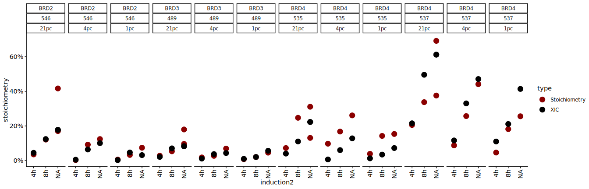<!-- -->

# Neighbouring-site interaction

Tests for interdependence between neighbouring hydroxylation sites (how
one site’s modification affects another).

``` r
#t50 data subset to BRD4 region (amino acid position - 534 to 560)
t50_dt[gene_name == "BRD4"][aa_pos > 534 & aa_pos < 560]
```

    ##     gene_name aa_pos       t50     n t50_bin
    ##        <fctr>  <int>     <num> <int>  <fctr>
    ##  1:      BRD4    535  5.205940     7    4-8h
    ##  2:      BRD4    537 12.537167     7     >8h
    ##  3:      BRD4    538  1.914826     7    0-4h
    ##  4:      BRD4    539 20.354251     7     >8h
    ##  5:      BRD4    541  2.000000     6    0-4h
    ##  6:      BRD4    543  2.000000     6    0-4h
    ##  7:      BRD4    544  2.202539     6    0-4h
    ##  8:      BRD4    546 19.094271     6     >8h
    ##  9:      BRD4    547  2.274141     6    0-4h
    ## 10:      BRD4    548  2.757705     6    0-4h
    ## 11:      BRD4    550  5.957624     6    4-8h
    ## 12:      BRD4    552  4.641731     7    4-8h
    ## 13:      BRD4    554 11.541566     7     >8h

``` r
# For a high- and low-t50 site pair, compare the high site's
# hydroxylation fraction on peptides that do vs. do not also carry hydroxylation
# at the low site (tests neighbouring-site interaction).
calc_neighbouring_site_interaction <- function(input_per_pos_data, low_t50_sites, high_t50_sites, sample_group) {

  di_ptms <- c("[Oxidation (K) DI]", "[Oxidised Propionylation (K) DI]")

  # Fraction of a site's intensity with hydroxylation
  stoic_ratio <- function(dt, site) {
    dt[paste(protein_accession, aa_pos) == site & ptm %in% di_ptms, sum(peak_intensity)] /
      dt[paste(protein_accession, aa_pos) == site, sum(peak_intensity)]
  }

  low_t50_site_ids <- low_t50_sites[, paste(protein_accession, aa_pos)]
  high_t50_site_ids  <- high_t50_sites[, paste(protein_accession, aa_pos)]

  peptide_with_low_t50_sites <- input_per_pos_data[paste(protein_accession, aa_pos) %in% low_t50_site_ids][, unique(peptide_id)]
  peptide_with_high_t50_sites  <- input_per_pos_data[paste(protein_accession, aa_pos) %in% high_t50_site_ids][, unique(peptide_id)]

  hydroxy_input_per_pos_data <- copy(input_per_pos_data)[
    peptide_id %in% intersect(peptide_with_low_t50_sites, peptide_with_high_t50_sites)
  ]
  peptide_with_multiple_hydroxyK_sites <- hydroxy_input_per_pos_data[, .N, by = list(peptide_id)][N > 1, unique(peptide_id)]

  sl_input_per_pos_data <- input_per_pos_data[peptide_id %in% peptide_with_multiple_hydroxyK_sites]

  rows <- list()

  for (low_t50_hyl_site in low_t50_site_ids) {
    for (high_t50_hyl_site in high_t50_site_ids) {

      peptide_with_both_sites <- sl_input_per_pos_data[
        (paste(protein_accession, aa_pos) %in% low_t50_hyl_site) |
          (paste(protein_accession, aa_pos) %in% high_t50_hyl_site)
      ] %>%
        {.[, .N, by = peptide_id][N > 1, unique(peptide_id)]}

      if (length(peptide_with_both_sites) > 1) {
        both_dt <- sl_input_per_pos_data[peptide_id %in% peptide_with_both_sites]

        # Peptides carrying a diagnostic-ion hydroxylation at the high site
        peptide_with_hyl_in_high <- both_dt[
          ptm %in% di_ptms
        ][paste(protein_accession, aa_pos) == low_t50_hyl_site, unique(peptide_id)]

        with_high_dt    <- both_dt[peptide_id %in% peptide_with_hyl_in_high]
        without_high_dt <- both_dt[!(peptide_id %in% peptide_with_hyl_in_high)]

        rows[[length(rows) + 1L]] <- data.table(
          protein_accession              = str_split_fixed(low_t50_hyl_site, " ", 2)[, 1],
          low_t50_stoic_aa_pos              = str_split_fixed(low_t50_hyl_site, " ", 2)[, 2] %>% as.integer,
          high_t50_stoic_aa_pos               = str_split_fixed(high_t50_hyl_site, " ", 2)[, 2] %>% as.integer,
          high_t50_hyl_total_stoic            = stoic_ratio(both_dt, high_t50_hyl_site),
          high_t50_hyl_stoic_with_high_hyl    = stoic_ratio(with_high_dt, high_t50_hyl_site),
          high_t50_hyl_stoic_without_high_hyl = stoic_ratio(without_high_dt, high_t50_hyl_site),
          n                              = length(peptide_with_both_sites),
          sample_group
        )
      }
    }
  }

  rbindlist(rows)[high_t50_hyl_total_stoic > 0]
}

# Define high and low t50 sites of BRD4 (535 included here for computation purpose)
low_t50_sites <- data.table(protein_accession = "O60885", aa_pos = c(535, 538, 548))
high_t50_sites  <- data.table(protein_accession = "O60885", aa_pos = c(535, 537, 550, 552))

# Calculate interaction between high and low t50 sites across datasets
# PNAS data-A (MQ_DI, no water loss)
data_a_per_pos <- fread(file.path(results.dir, "p2-analysis-setting/MQ_DI/DI_data-A_trp_m7_v7_def_all_per_pos_data.csv"))[gene_name %in% c("BRD2", "BRD3", "BRD4")] %>%
  {.[sample_name == "JQ1_HeLaWT_derivatised"]}
data_a_interaction_summary <- calc_neighbouring_site_interaction(data_a_per_pos, low_t50_sites, high_t50_sites, sample_group = "WT_PNAS2022")

# MS_KR_1 data
ms_kr1_per_pos <- fread(file.path(results.dir, "p2-analysis-setting/MS_KR_1/MS_KR_1_all_per_pos_data.csv"))[gene_name %in% c("BRD2", "BRD3", "BRD4")]
ms_kr1_wt_per_pos <- ms_kr1_per_pos[sample_name == "HeLaWT_NA_N_NA"]
ms_kr1_wt_interaction_summary <- calc_neighbouring_site_interaction(ms_kr1_wt_per_pos, low_t50_sites, high_t50_sites, sample_group = "WT")

# MS_KR_1 - iJMJD6 cells, 24h dox induction
ms_kr1_24h_per_pos <- ms_kr1_per_pos[sample_name == "HeLaiJMJD6_Dox_N_NA"]
ms_kr1_24h_interaction_summary <- calc_neighbouring_site_interaction(ms_kr1_24h_per_pos, low_t50_sites, high_t50_sites, sample_group = "iJMJD6 24h")

# MS_SS data
ms_ss1_per_pos <- fread(file.path(results.dir, "p2-analysis-setting/MS_SS/MS_SS_all_per_pos_data.csv")) %>%
  {rbind(.[gene_name %in% c("BRD4")][sample_name == "18h_21pc_BRD4"], .[gene_name %in% c("BRD2", "BRD3")][sample_name == "18h_21pc_BRD23"])}
ms_ss1_interaction_summary <- calc_neighbouring_site_interaction(ms_ss1_per_pos, low_t50_sites, high_t50_sites, sample_group = "iJMJD6 18h")

# Combine interaction data from each dataset
all_interaction_summary <- rbindlist(
  list(
    data_a_interaction_summary, ms_kr1_wt_interaction_summary,
    ms_kr1_24h_interaction_summary, ms_ss1_interaction_summary
  )
)

#Statistical inference of interaction data 
interaction_out_data <- data.table()

all_sites_to_analyse <- all_interaction_summary[!duplicated(paste(protein_accession, low_t50_stoic_aa_pos, high_t50_stoic_aa_pos))][, .(protein_accession, low_t50_stoic_aa_pos, high_t50_stoic_aa_pos)]

for(irow in 1:nrow(all_sites_to_analyse)){
  
  sl_all_interaction_summary <- merge(
    all_interaction_summary,
    all_sites_to_analyse[irow],
    by = c("protein_accession", "low_t50_stoic_aa_pos", "high_t50_stoic_aa_pos")
  )
  
  if(nrow(sl_all_interaction_summary) > 2){
    # Paired t-test: low Hyl stoichiometry without vs. with a high-stoic neighbour
    t_out <- sl_all_interaction_summary %$%
      t.test(high_t50_hyl_stoic_without_high_hyl, high_t50_hyl_stoic_with_high_hyl, paired = TRUE)
    
    m_all_interaction_summary <- melt(
      sl_all_interaction_summary, 
      id.vars = c("protein_accession", "low_t50_stoic_aa_pos", "high_t50_stoic_aa_pos", "n"), 
      measure.vars = c("high_t50_hyl_stoic_without_high_hyl", "high_t50_hyl_stoic_with_high_hyl"),
      variable.name = "type",
      value.name = "stoichiometry"
    )
    
    # combine the interaction_out_data table with p-value and sample size for site pair 
    interaction_out_data <- rbind(
      interaction_out_data,
      data.table(all_sites_to_analyse[irow], p_val = t_out$p.value, n = nrow(sl_all_interaction_summary))
    )} else {}
}

interaction_out_data
```

    ##    protein_accession low_t50_stoic_aa_pos high_t50_stoic_aa_pos       p_val
    ##               <char>                <int>                 <int>       <num>
    ## 1:            O60885                  535                   537 0.066869776
    ## 2:            O60885                  538                   535 0.003700816
    ## 3:            O60885                  538                   537 0.071239152
    ## 4:            O60885                  548                   550 0.057590253
    ## 5:            O60885                  548                   552 0.136244776
    ##        n
    ##    <int>
    ## 1:     4
    ## 2:     4
    ## 3:     4
    ## 4:     4
    ## 5:     4

``` r
# paired t-test 
all_interaction_summary %$%
  t.test(high_t50_hyl_stoic_without_high_hyl, high_t50_hyl_stoic_with_high_hyl, paired = TRUE)
```

    ## 
    ##  Paired t-test
    ## 
    ## data:  high_t50_hyl_stoic_without_high_hyl and high_t50_hyl_stoic_with_high_hyl
    ## t = -6.0346, df = 19, p-value = 8.345e-06
    ## alternative hypothesis: true mean difference is not equal to 0
    ## 95 percent confidence interval:
    ##  -0.3614428 -0.1752847
    ## sample estimates:
    ## mean difference 
    ##      -0.2683637

``` r
# convert table into long format for plotting 
m_all_interaction_summary <- melt(
  all_interaction_summary, 
  id.vars = c("protein_accession", "low_t50_stoic_aa_pos", "high_t50_stoic_aa_pos", "n", "sample_group"), 
  measure.vars = c("high_t50_hyl_stoic_with_high_hyl", "high_t50_hyl_stoic_without_high_hyl"),
  variable.name = "type",
  value.name = "stoichiometry"
)

# new column - type - with or without high_hyl
m_all_interaction_summary[, type := gsub("high_t50_hyl_stoic_", "", type)]

# Plot
ggplot(
  data = m_all_interaction_summary[!(low_t50_stoic_aa_pos == 550)],
  aes(
    x = type,
    y = stoichiometry,
    group = paste(sample_group, low_t50_stoic_aa_pos, high_t50_stoic_aa_pos),
    color = paste(low_t50_stoic_aa_pos, high_t50_stoic_aa_pos)
  )
) +
  geom_line(color = "black") +
  geom_point(size = 4) +
  scale_y_continuous(labels = scales::percent_format(accuracy = 1)) +
  scale_color_bright() +
  scale_x_discrete(guide = guide_axis(angle = 90)) +
  theme_classic_2() +
  theme(aspect.ratio = 4)
```

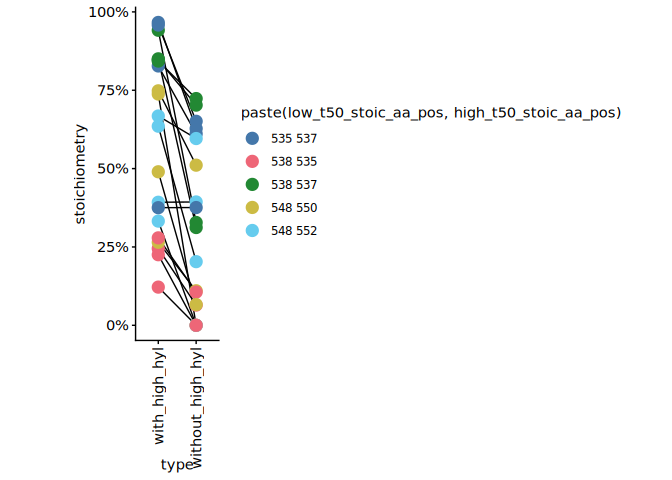<!-- -->

# Oxygen sensitivity

Compares hydroxylation under hypoxia across doxycycline incubation times
to assess oxygen sensitivity.

``` r
# Boxplot - Comparing the stoic between normoxia and varying pc of hypoxia
# Data subset to overnight (18/24h) dox induction

on_data <- lc_ms_ss_kr_pnas_dt[induction2 %in% c("18-24h", "Inf")][
  sample_group != "iJ6_18h_21pc_SS" # As iJ6_24h_21pc_KR exists
]

#---------------------------------------------
# Stoichiometry relative to WT values
#---------------------------------------------

# subset data to WT normoxia (MS_KR_1 sample)
wt_on <- on_data[induction2 == "Inf", .(protein_accession, aa_pos, Stoichiometry)]
setnames(wt_on, old = "Stoichiometry", "WT_stoichiometry")

# Merge MS_SS normoxia data with MS_KR_1 WT normoxia data
pc2wt_on <- merge(
  on_data[induction2 != "Inf"],
  wt_on,
  by = c("protein_accession", "aa_pos")
)

pc2wt_on <- copy(pc2wt_on)[, data_size_per_site := .N, by = list(protein_accession, aa_pos)]
pc2wt_on <- pc2wt_on[data_size_per_site == max(pc2wt_on[, data_size_per_site])]

pc2wt_on <- pc2wt_on[WT_stoichiometry > 0]
pc2wt_on[, `:=`(
  oxygen = factor(oxygen, c("21pc", "4pc", "1pc", "01pc"))
)]

ggplot(
  data = pc2wt_on,
  aes(
    x = oxygen,
    y = Stoichiometry
  )
) +
  geom_boxplot(outlier.shape = NA) +
  ylab("Stoichiometry") +
  theme_classic_2()+
  theme(axis.text.x = element_text(angle = 90, hjust = 1)) + 
  theme(legend.position="right") +
  coord_cartesian(ylim = c(0, 1)) +
  theme(aspect.ratio = 2) +
  scale_y_continuous(labels = scales::percent_format(accuracy = 1)) +
  ggtitle("Min WT stoichiometry > 0")
```

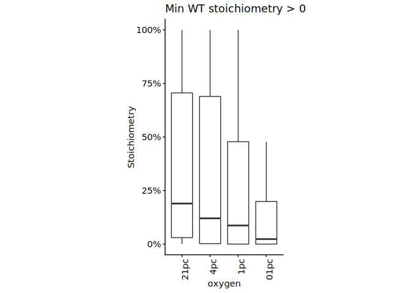<!-- -->

``` r
pc2wt_on[, .N, by = oxygen]
```

    ##    oxygen     N
    ##    <fctr> <int>
    ## 1:    1pc    48
    ## 2:    4pc    48
    ## 3:   01pc    48
    ## 4:   21pc    48

``` r
# Boxplot - comparing normoxia versus hypoxia
ggplot(
  data = pc2wt_on,
  aes(
    x = oxygen,
    y = Stoichiometry / WT_stoichiometry
  )
) +
  #geom_hline(yintercept = 1, color = "gray60") +
  geom_boxplot(outlier.shape = NA) +
  # facet_grid(~ oxygen) +
  ylab("Stoichiometry [% to WT]") +
  theme_classic_2()+
  theme(axis.text.x = element_text(angle = 90, hjust = 1)) + 
  theme(legend.position="right") +
  coord_cartesian(ylim = c(0, 1.5)) +
  theme(aspect.ratio = 2) +
  scale_y_continuous(labels = scales::percent_format(accuracy = 1))
```

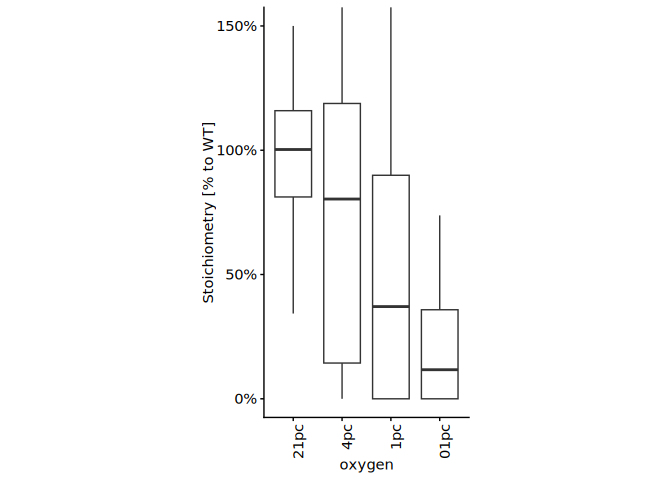<!-- -->

``` r
oxygen_t_test <- data.table()

for(i in pc2wt_on[, unique(oxygen)]){
  t.out <- t.test(
    pc2wt_on[oxygen == i][, Stoichiometry/WT_stoichiometry],
    pc2wt_on[oxygen == "21pc"][, Stoichiometry/WT_stoichiometry],
    paired = TRUE
  )
  oxygen_t_test <- rbind(
    oxygen_t_test,
    data.table(induction = i, p_value = t.out$p.value, n = nrow(pc2wt_on[data_size_per_site == max(pc2wt_on[, data_size_per_site])][oxygen == i]))
  )  
}

oxygen_t_test[, padj := p.adjust(p_value, method = "holm")]
oxygen_t_test[, significance := case_when(
  padj < 0.005 ~ "**",
  padj < 0.05 ~ "*",
  TRUE ~ "N.S."
)]

oxygen_t_test
```

    ##    induction      p_value     n         padj significance
    ##       <char>        <num> <int>        <num>       <char>
    ## 1:       1pc 1.988958e-05    48 3.977917e-05           **
    ## 2:       4pc 3.860210e-02    48 3.860210e-02            *
    ## 3:      01pc 9.613294e-12    48 2.883988e-11           **
    ## 4:      21pc          NaN    48          NaN         N.S.

# Baseline vs hypoxic change

Relates baseline (WT/normoxia) stoichiometry to the magnitude of hypoxic
suppression per site.

``` r
ggplot(
  data = pc2wt_on[oxygen != "21pc"],
  aes(
    x = WT_stoichiometry,
    y = Stoichiometry / WT_stoichiometry
  )
) +
  geom_smooth(method = "lm", se = FALSE) +
  geom_point(size = 2) +
  facet_grid(~ oxygen) +
  theme(
    aspect.ratio = 1,
    legend.position = NULL
  ) +
  ylab("Stoichiometry [% to WT]") +
  scale_y_continuous(labels = scales::percent_format(accuracy = 1)) +
  scale_x_continuous(labels = scales::percent_format(accuracy = 1))
```

    ## `geom_smooth()` using formula = 'y ~ x'

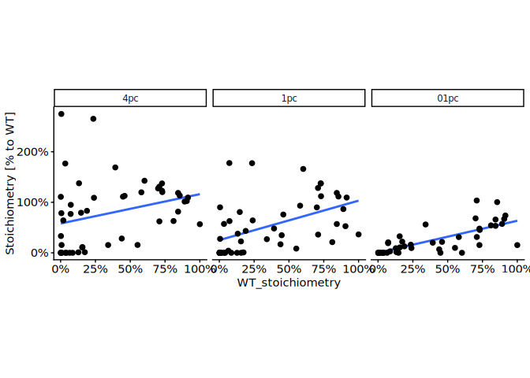<!-- -->

``` r
oxygen_out <- data.table()

for(o2 in pc2wt_on[oxygen != "21pc"][, unique(oxygen)]){
  c2 <- pc2wt_on[oxygen == o2] %$%
    cor.test(
      WT_stoichiometry, Stoichiometry / WT_stoichiometry, method = "spearman"
    )
  
    oxygen_out <- rbind(oxygen_out, data.table(oxygen = o2, rho = c2$estimate, p_val = c2$p.value, n = nrow(pc2wt_on[oxygen == o2])))
}
```

    ## Warning in cor.test.default(WT_stoichiometry, Stoichiometry/WT_stoichiometry, :
    ## Cannot compute exact p-value with ties
    ## Warning in cor.test.default(WT_stoichiometry, Stoichiometry/WT_stoichiometry, :
    ## Cannot compute exact p-value with ties
    ## Warning in cor.test.default(WT_stoichiometry, Stoichiometry/WT_stoichiometry, :
    ## Cannot compute exact p-value with ties

``` r
oxygen_out[, padj := p.adjust(p_val, method = "holm")]

oxygen_out
```

    ##    oxygen       rho        p_val     n         padj
    ##    <char>     <num>        <num> <int>        <num>
    ## 1:    1pc 0.6117460 3.846637e-06    48 7.693273e-06
    ## 2:    4pc 0.4209248 2.890543e-03    48 2.890543e-03
    ## 3:   01pc 0.8053679 5.133028e-12    48 1.539908e-11

``` r
# Boxplot - Comparing the stoic between normoxia and varying pc of hypoxia
on_01pc_ms_kr1_data <- lc_ms_ss_kr_pnas_dt[induction2 %in% c("18-24h", "Inf")][
  sample_group == "iJ6_24h_01pc_KR"
]
setnames(on_01pc_ms_kr1_data, old = "Stoichiometry", "ON01_stoichiometry")

wt_on <- lc_ms_ss_kr_pnas_dt[sample_group == "WT_Inf_21pc_KR"]
setnames(wt_on, old = "Stoichiometry", "WT_stoichiometry")

merge_dts <- function(dt_list, by_columns){Reduce(function(...) merge(..., by = by_columns), dt_list)}

sl_columns <- c("protein_accession", "aa_pos")

ref_dts <- merge_dts(
  dt_list = list(
    on_01pc_ms_kr1_data[, c(sl_columns, "ON01_stoichiometry"), with = FALSE],
    wt_on[, c(sl_columns, "WT_stoichiometry"), with = FALSE]
  ),
  by = sl_columns
)

non_ref_lc_ms_ss_kr_pnas_dt <- lc_ms_ss_kr_pnas_dt[
  !(sample_group %in% c("iJ6_24h_01pc_KR", "WT_Inf_21pc_KR", "iJ6_0h_21pc_SS", "iJ6_0h_21pc_KR", "iJ6_18h_21pc_SS"))
]

induction2vsref_21pc <- merge(
  non_ref_lc_ms_ss_kr_pnas_dt,
  ref_dts,
  by = sl_columns
)

induction2vsref_21pc <- induction2vsref_21pc[WT_stoichiometry > 0]
## induction2vsref_21pc <- induction2vsref_21pc[sample_group %in% c("iJ6_4h_21pc_SS", "iJ6_8h_21pc_SS", "iJ6_24h_21pc_KR")]
induction2vsref_21pc[, data_size_per_site := .N, by = list(protein_accession, aa_pos)]
induction2vsref_21pc <- induction2vsref_21pc[data_size_per_site == max(induction2vsref_21pc[, data_size_per_site])]

induction2vsref_21pc[, .N, by = list(sample_group, gene_name)][order(sample_group)]
```

    ##        sample_group gene_name     N
    ##              <fctr>    <fctr> <int>
    ##  1:  iJ6_18h_1pc_SS      BRD4    20
    ##  2:  iJ6_18h_1pc_SS      BRD2     6
    ##  3:  iJ6_18h_1pc_SS      BRD3    16
    ##  4:  iJ6_18h_4pc_SS      BRD4    20
    ##  5:  iJ6_18h_4pc_SS      BRD2     6
    ##  6:  iJ6_18h_4pc_SS      BRD3    16
    ##  7: iJ6_24h_21pc_KR      BRD4    20
    ##  8: iJ6_24h_21pc_KR      BRD2     6
    ##  9: iJ6_24h_21pc_KR      BRD3    16
    ## 10:   iJ6_4h_1pc_SS      BRD4    20
    ## 11:   iJ6_4h_1pc_SS      BRD2     6
    ## 12:   iJ6_4h_1pc_SS      BRD3    16
    ## 13:  iJ6_4h_21pc_SS      BRD4    20
    ## 14:  iJ6_4h_21pc_SS      BRD2     6
    ## 15:  iJ6_4h_21pc_SS      BRD3    16
    ## 16:   iJ6_4h_4pc_SS      BRD4    20
    ## 17:   iJ6_4h_4pc_SS      BRD2     6
    ## 18:   iJ6_4h_4pc_SS      BRD3    16
    ## 19:   iJ6_8h_1pc_SS      BRD4    20
    ## 20:   iJ6_8h_1pc_SS      BRD2     6
    ## 21:   iJ6_8h_1pc_SS      BRD3    16
    ## 22:  iJ6_8h_21pc_SS      BRD4    20
    ## 23:  iJ6_8h_21pc_SS      BRD2     6
    ## 24:  iJ6_8h_21pc_SS      BRD3    16
    ## 25:   iJ6_8h_4pc_SS      BRD4    20
    ## 26:   iJ6_8h_4pc_SS      BRD2     6
    ## 27:   iJ6_8h_4pc_SS      BRD3    16
    ##        sample_group gene_name     N
    ##              <fctr>    <fctr> <int>

``` r
ggplot(
  data = induction2vsref_21pc,
  aes(
    x = ON01_stoichiometry,
    y = Stoichiometry
  )
) +
  # geom_smooth(method = "lm", se = FALSE) +
  geom_abline(intercept = 0, slope = 1) +
  geom_point() +
  facet_grid(oxygen ~ induction2) +
  theme(aspect.ratio = 1) +
  coord_cartesian(ylim = c(0, 1), xlim = c(0, 1))
```

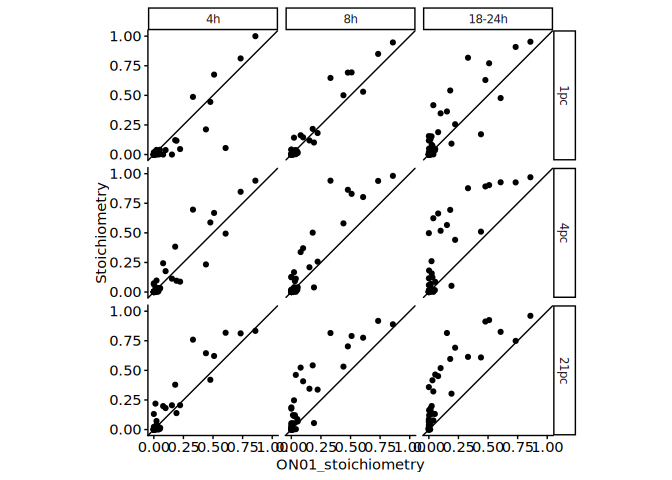<!-- -->

``` r
rsq_out_dt <- data.table()

for(o2 in induction2vsref_21pc[, unique(oxygen)]){
  for(i2 in induction2vsref_21pc[, unique(induction2)]){
    rsq_dt <- induction2vsref_21pc[
      oxygen == o2 & induction2 == i2
    ]
    rsq_dt[, mean_St := mean(Stoichiometry)]
    rsq <- 1 - sum(rsq_dt[, (Stoichiometry - ON01_stoichiometry)^2]) / sum(rsq_dt[, (Stoichiometry - mean_St)^2])
    rsq_out_dt <- rbind(
      rsq_out_dt, data.table(oxygen = o2, induction2 = i2, rsq = rsq, n = nrow(rsq_dt))
    )
  }
}

rsq_out_dt
```

    ##    oxygen induction2       rsq     n
    ##    <char>     <char>     <num> <int>
    ## 1:    1pc     18-24h 0.6976193    42
    ## 2:    1pc         4h 0.7678493    42
    ## 3:    1pc         8h 0.9091016    42
    ## 4:    4pc     18-24h 0.4727418    42
    ## 5:    4pc         4h 0.8588508    42
    ## 6:    4pc         8h 0.7383229    42
    ## 7:   21pc     18-24h 0.4097677    42
    ## 8:   21pc         4h 0.8504380    42
    ## 9:   21pc         8h 0.6441541    42

``` r
pc2wt_on_kinetics <- merge(
  pc2wt_on,
  t50_dt,
  by = c("gene_name", "aa_pos")
)

library("ggbeeswarm")

ggplot(
  pc2wt_on_kinetics[n == 7][oxygen != "21pc"],
  aes(
    x = t50,
    y = Stoichiometry / WT_stoichiometry
  )
) +
  geom_point(size = 2) +
  facet_grid(~ oxygen) +
  theme(
    aspect.ratio = 1,
    legend.position = NULL
  ) +
  ylab("Stoichiometry [% to WT]") +
  coord_cartesian(xlim = c(0, 24)) +
  scale_y_continuous(labels = scales::percent_format(accuracy = 1))
```

<!-- -->

``` r
ggplot(
  pc2wt_on_kinetics[n == 7][oxygen != "21pc"],
  aes(
    x = oxygen,
    y = Stoichiometry / WT_stoichiometry
  )
) +
  geom_boxplot(outlier.shape = NA) +
  geom_beeswarm() +
  facet_grid(~ t50_bin) +
  theme(
    aspect.ratio = 3,
    legend.position = NULL
  ) +
  ylab("Stoichiometry [% to WT]") +
  scale_x_discrete(guide = guide_axis(angle = 90)) +
  coord_cartesian(ylim = c(0, 2)) +
  scale_y_continuous(labels = scales::percent_format(accuracy = 1))
```

<!-- -->

``` r
# QC
ggplot(
  pc2wt_on_kinetics[n == 7],
  aes(
    x = oxygen,
    y = Stoichiometry / WT_stoichiometry
  )
) +
  geom_boxplot(outlier.shape = NA) +
  facet_grid(~ t50_bin) +
  theme(
    aspect.ratio = 3,
    legend.position = NULL
  ) +
  ylab("Stoichiometry [% to WT]") +
  scale_x_discrete(guide = guide_axis(angle = 90)) +
  coord_cartesian(ylim = c(0, 2)) +
  scale_y_continuous(labels = scales::percent_format(accuracy = 1))
```

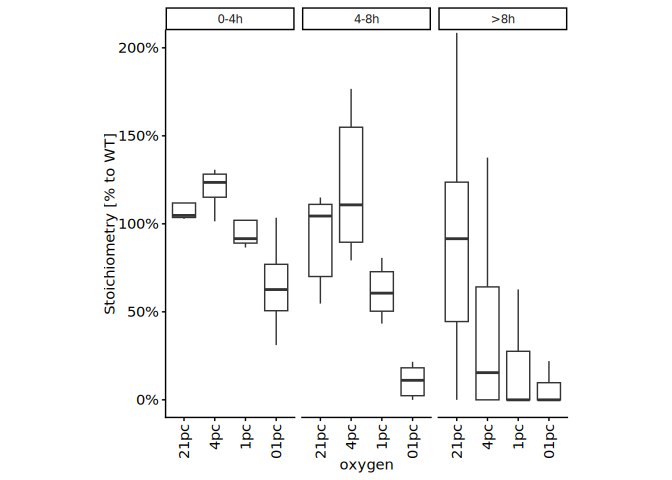<!-- -->

``` r
pc2wt_on_kinetics[n == 7][, .N, by = list(oxygen, t50_bin)]
```

    ##     oxygen t50_bin     N
    ##     <fctr>  <fctr> <int>
    ##  1:    1pc     >8h    25
    ##  2:    4pc     >8h    25
    ##  3:   01pc     >8h    25
    ##  4:   21pc     >8h    25
    ##  5:    1pc    4-8h     6
    ##  6:    4pc    4-8h     6
    ##  7:   01pc    4-8h     6
    ##  8:   21pc    4-8h     6
    ##  9:    1pc    0-4h     4
    ## 10:    4pc    0-4h     4
    ## 11:   01pc    0-4h     4
    ## 12:   21pc    0-4h     4

# Session information

``` r
sessioninfo::session_info()
```

    ## ─ Session info ───────────────────────────────────────────────────────────────
    ##  setting  value
    ##  version  R version 4.5.1 (2025-06-13)
    ##  os       Ubuntu 24.04.2 LTS
    ##  system   x86_64, linux-gnu
    ##  ui       X11
    ##  language (EN)
    ##  collate  C.UTF-8
    ##  ctype    C.UTF-8
    ##  tz       Europe/Berlin
    ##  date     2026-08-24
    ##  pandoc   3.4 @ /usr/lib/rstudio-server/bin/quarto/bin/tools/x86_64/ (via rmarkdown)
    ##  quarto   1.6.42 @ /usr/lib/rstudio-server/bin/quarto/bin/quarto
    ## 
    ## ─ Packages ───────────────────────────────────────────────────────────────────
    ##  ! package           * version    date (UTC) lib source
    ##  P beeswarm            0.4.0      2021-06-01 [?] CRAN (R 4.5.1)
    ##  P BiocGenerics      * 0.56.0     2025-10-29 [?] Bioconduc~
    ##  P Biostrings        * 2.78.0     2025-10-29 [?] Bioconduc~
    ##  P cellranger          1.1.0      2016-07-27 [?] CRAN (R 4.5.1)
    ##  P cli                 3.6.6      2026-04-09 [?] CRAN (R 4.5.1)
    ##  P crayon              1.5.3      2024-06-20 [?] CRAN (R 4.5.1)
    ##  P data.table        * 1.18.6.1   2026-08-24 [?] CRAN (R 4.5.1)
    ##  P digest              0.6.39     2025-11-19 [?] CRAN (R 4.5.1)
    ##  P dplyr             * 1.2.1      2026-04-03 [?] CRAN (R 4.5.1)
    ##  P evaluate            1.0.5      2025-08-27 [?] CRAN (R 4.5.1)
    ##  P farver              2.1.2      2024-05-13 [?] CRAN (R 4.5.1)
    ##  P fastmap             1.2.0      2024-05-15 [?] CRAN (R 4.5.1)
    ##  P generics          * 0.1.4      2025-05-09 [?] CRAN (R 4.5.1)
    ##  P ggbeeswarm        * 0.7.3      2025-11-29 [?] CRAN (R 4.5.1)
    ##  P ggplot2           * 4.0.3      2026-04-22 [?] CRAN (R 4.5.1)
    ##  P glue                1.8.1      2026-04-17 [?] CRAN (R 4.5.1)
    ##  P gtable              0.3.6      2024-10-25 [?] CRAN (R 4.5.1)
    ##  P htmltools           0.5.9      2025-12-04 [?] CRAN (R 4.5.1)
    ##  P IRanges           * 2.44.0     2025-10-29 [?] Bioconduc~
    ##  P janitor             2.2.1      2024-12-22 [?] CRAN (R 4.5.1)
    ##  P khroma            * 1.17.0     2025-09-29 [?] CRAN (R 4.5.1)
    ##  P knitr             * 1.51       2025-12-20 [?] CRAN (R 4.5.1)
    ##  P labeling            0.4.3      2023-08-29 [?] CRAN (R 4.5.1)
    ##  P lattice             0.22-5     2023-10-24 [?] CRAN (R 4.3.3)
    ##  P lifecycle           1.0.5      2026-01-08 [?] CRAN (R 4.5.1)
    ##  P lubridate           1.9.5      2026-02-04 [?] CRAN (R 4.5.1)
    ##  P magrittr          * 2.0.5      2026-04-04 [?] CRAN (R 4.5.1)
    ##  P Matrix              1.7-3      2025-03-11 [?] CRAN (R 4.4.3)
    ##  P mgcv                1.9-1      2023-12-21 [?] CRAN (R 4.3.2)
    ##  P nlme                3.1-168    2025-03-31 [?] CRAN (R 4.4.3)
    ##  P pillar              1.11.1     2025-09-17 [?] CRAN (R 4.5.1)
    ##  P pkgconfig           2.0.3      2019-09-22 [?] CRAN (R 4.5.1)
    ##    ptm.stoichiometry * 0.0.0.9000 2026-08-24 [1] local
    ##  P R6                  2.6.1      2025-02-15 [?] CRAN (R 4.5.1)
    ##  P RColorBrewer        1.1-3      2022-04-03 [?] CRAN (R 4.5.1)
    ##  P readxl            * 1.5.0      2026-05-16 [?] CRAN (R 4.5.1)
    ##    renv                1.1.5      2025-07-24 [1] CRAN (R 4.5.1)
    ##  P rlang               1.3.0      2026-07-05 [?] CRAN (R 4.5.1)
    ##    rmarkdown           2.31       2026-03-26 [1] CRAN (R 4.5.1)
    ##  P S4Vectors         * 0.48.1     2026-04-05 [?] Bioconduc~
    ##  P S7                  0.2.2      2026-04-22 [?] CRAN (R 4.5.1)
    ##  P scales              1.4.0      2025-04-24 [?] CRAN (R 4.5.1)
    ##  P Seqinfo           * 1.0.0      2025-10-29 [?] Bioconduc~
    ##  P sessioninfo         1.2.4      2026-06-04 [?] CRAN (R 4.5.1)
    ##  P snakecase           0.11.1     2023-08-27 [?] CRAN (R 4.5.1)
    ##  P stringi             1.8.9      2026-08-04 [?] CRAN (R 4.5.1)
    ##  P stringr           * 1.6.0      2025-11-04 [?] CRAN (R 4.5.1)
    ##  P tibble              3.3.1      2026-01-11 [?] CRAN (R 4.5.1)
    ##  P tidyselect          1.2.1      2024-03-11 [?] CRAN (R 4.5.1)
    ##  P timechange          0.4.0      2026-01-29 [?] CRAN (R 4.5.1)
    ##  P vctrs               0.7.3      2026-04-11 [?] CRAN (R 4.5.1)
    ##  P vipor               0.4.7      2023-12-18 [?] CRAN (R 4.5.1)
    ##  P withr               3.0.3      2026-06-19 [?] CRAN (R 4.5.1)
    ##  P xfun                0.60       2026-07-09 [?] CRAN (R 4.5.1)
    ##  P XVector           * 0.50.0     2025-10-29 [?] Bioconduc~
    ##  P yaml                2.3.12     2025-12-10 [?] CRAN (R 4.5.1)
    ## 
    ##  [1] /fast/AG_Sugimoto/home/users/yoichiro/projects/20241111_PTMs_in_lysine_rich_domains/renv/library/linux-ubuntu-noble/R-4.5/x86_64-pc-linux-gnu
    ##  [2] /home/ysugimo/.cache/R/renv/sandbox/linux-ubuntu-noble/R-4.5/x86_64-pc-linux-gnu/9a444a72
    ## 
    ##  * ── Packages attached to the search path.
    ##  P ── Loaded and on-disk path mismatch.
    ## 
    ## ──────────────────────────────────────────────────────────────────────────────
