2-1_1. PSM_PTM_comparisons
================
Yoichiro Sugimoto and Pallavi Kesavan
09 December, 2025

- [Overview](#overview)
- [This script calculates the stiochiomtery using MaxQuant
  data](#this-script-calculates-the-stiochiomtery-using-maxquant-data)
- [Environment setup](#environment-setup)
- [2.1.1.1 Install,load essential functions and
  libraries](#2111-installload-essential-functions-and-libraries)
- [2.1.1.2 Import human protein reference
  data](#2112-import-human-protein-reference-data)
- [2.1.1.3 Comparison - PNAS2022 versus new workflow for PSM coverage
  and PTM
  stoichiometry](#2113-comparison---pnas2022-versus-new-workflow-for-psm-coverage-and-ptm-stoichiometry)
- [2.1.1.4 Comparing PSM coverage between m2, m5, and m7
  miscleavages](#2114-comparing-psm-coverage-between-m2-m5-and-m7-miscleavages)
- [Session information](#session-information)

# Overview

# This script calculates the stiochiomtery using MaxQuant data

# Environment setup

``` r
## Initialize renv (first time only) - re-installed 24.09.2025
# Creates project specific library and renv.lock file. 
# Use 'renv::init(filepath)' to create project library
# renv::init(
#        "/fast/AG_Sugimoto/home/users/pallavi/projects/20241111_PTMs_in_lysine_rich_domains/R"
#    )

# Define project directory - contains the R scripts, data and result folders
project.dir <-
  file.path(
    "/fast/AG_Sugimoto/home/users/pallavi/projects/20241111_PTMs_in_lysine_rich_domains"
  )

# renv::snapshot(file.path(project.dir, "R"))

#renv::restore completed 24.09.2025
#renv::restore(file.path(project.dir, "R"))
```

# 2.1.1.1 Install,load essential functions and libraries

``` r
## Load all R scripts from the 'functions' folder into the current session
P2_functions <- sapply(list.files(file.path(project.dir, "R/functions"), pattern="*.R", full.names = TRUE), source)
```

    ## 
    ## Attaching package: 'dplyr'

    ## The following objects are masked from 'package:stats':
    ## 
    ##     filter, lag

    ## The following objects are masked from 'package:base':
    ## 
    ##     intersect, setdiff, setequal, union

    ## 
    ## Attaching package: 'data.table'

    ## The following objects are masked from 'package:dplyr':
    ## 
    ##     between, first, last

    ## Loading required package: BiocGenerics

    ## Loading required package: generics

    ## 
    ## Attaching package: 'generics'

    ## The following object is masked from 'package:dplyr':
    ## 
    ##     explain

    ## The following objects are masked from 'package:base':
    ## 
    ##     as.difftime, as.factor, as.ordered, intersect, is.element, setdiff,
    ##     setequal, union

    ## 
    ## Attaching package: 'BiocGenerics'

    ## The following object is masked from 'package:dplyr':
    ## 
    ##     combine

    ## The following objects are masked from 'package:stats':
    ## 
    ##     IQR, mad, sd, var, xtabs

    ## The following objects are masked from 'package:base':
    ## 
    ##     anyDuplicated, aperm, append, as.data.frame, basename, cbind,
    ##     colnames, dirname, do.call, duplicated, eval, evalq, Filter, Find,
    ##     get, grep, grepl, is.unsorted, lapply, Map, mapply, match, mget,
    ##     order, paste, pmax, pmax.int, pmin, pmin.int, Position, rank,
    ##     rbind, Reduce, rownames, sapply, saveRDS, table, tapply, unique,
    ##     unsplit, which.max, which.min

    ## Loading required package: S4Vectors

    ## Loading required package: stats4

    ## 
    ## Attaching package: 'S4Vectors'

    ## The following objects are masked from 'package:data.table':
    ## 
    ##     first, second

    ## The following objects are masked from 'package:dplyr':
    ## 
    ##     first, rename

    ## The following object is masked from 'package:utils':
    ## 
    ##     findMatches

    ## The following objects are masked from 'package:base':
    ## 
    ##     expand.grid, I, unname

    ## Loading required package: IRanges

    ## 
    ## Attaching package: 'IRanges'

    ## The following object is masked from 'package:data.table':
    ## 
    ##     shift

    ## The following objects are masked from 'package:dplyr':
    ## 
    ##     collapse, desc, slice

    ## Loading required package: XVector

    ## Loading required package: GenomeInfoDb

    ## 
    ## Attaching package: 'Biostrings'

    ## The following object is masked from 'package:base':
    ## 
    ##     strsplit

``` r
## Install private package 
# Install ptm.stiochiometry package
#install.packages("/fast/AG_Sugimoto/home/users/pallavi/projects/ptm.stoichiometry", repos = NULL, type = "source")

# Load Libraries - ptm.stiochiometry and readxl
library(ptm.stoichiometry)
library("readxl")
```

``` r
# Define path to data directory
data.dir <- file.path(project.dir, "data")
results.dir <- file.path(project.dir, "results")
```

# 2.1.1.2 Import human protein reference data

``` r
# Import human protein reference data from specified file path 
ref_protein_data <- import_reference_fasta(file.path
                                           ("/fast/AG_Sugimoto/reference/uniprot/human", 
                                             "UP000005640_9606.fasta")) 

all.protein.bs <- Biostrings::readAAStringSet(
  file.path(
    "/fast/AG_Sugimoto/reference/uniprot/human",
    "UP000005640_9606.fasta"
  )
)
```

# 2.1.1.3 Comparison - PNAS2022 versus new workflow for PSM coverage and PTM stoichiometry

``` r
# Define function - 'read_stoic_data'
read_stoic_data <- function(prefix, pre_prefix, post_fix = "", dir_path){
  # Read csv file with defined file path,  
  dt <- fread(file.path(dir_path, paste0(pre_prefix, prefix, "PTM_stoichiometry", post_fix, ".csv"))) 
  dt[, condition := gsub("_$", "", prefix)] # Removes '_' at the end of the prefix and creates a new column called condition
  return(dt)
}
```

``` r
pnas2022.stoic.dt <- fread(file.path(data.dir, "PNAS2022/long_K_stoichiometry_data.csv"))

setnames(
  pnas2022.stoic.dt, 
  old = c("uniprot_id", "position", "residue", "oxK_ratio", "data_source"), 
  new = c("protein_accession", "aa_pos", "aa", "stoichiometry", "sample_name")
)

pnas2022.stoic.dt[, `:=`(
  sum_psm_mapped = total_n_feature_K + total_n_feature_oxK
)]

pnas2022.stoic.dt <- merge(
  ref_protein_data[, .(protein_accession, gene_name)],
  pnas2022.stoic.dt,
  by = "protein_accession"
)

pnas2022.stoic.dt[, `:=`(
  accession_position = paste0(protein_accession, "_", aa_pos),
  ptm = "[Oxidation (K)]",
  sample_name = gsub("HeLa_", "HeLa", sample_name) %>%
    {gsub("HeLaJMJD6FLAG", "HeLaWT_JMJD6FLAG", .)}
)]


#---------------
# PNAS2022 - WT
#---------------

# PNAS2022 - BRD4 WT -PSM
PNAS2022_PSM_WT <-plot_psm_coverage(
  pnas2022.stoic.dt[sample_name == "HeLaWT_JQ1"], accession = "O60885", plot_range = c(531, 581), all.protein.bs, sample_colors = NA)
```

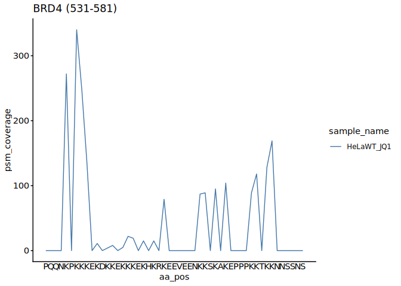<!-- -->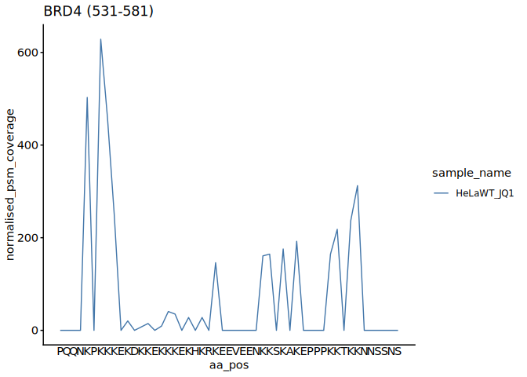<!-- -->

``` r
PNAS2022_PSM_WT <- PNAS2022_PSM_WT$coverage_plot_g

# PNAS2022 - BRD4 WT -PTM
PNAS2022_PTM_WT <- plot_ptm_stoichiometry(
  pnas2022.stoic.dt[sample_name == "HeLaWT_JQ1"], accession = "O60885", plot_range = c(531, 581), all.protein.bs, sample_colors = NA)
```

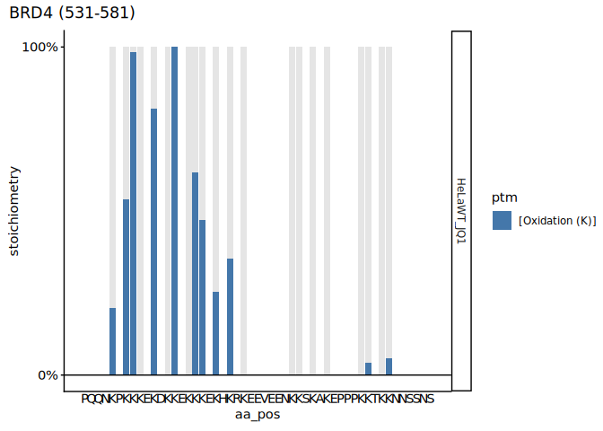<!-- -->

``` r
#--------------------
# PNAS2022 - JMJD6KO
#--------------------

# PNAS2022 - BRD4 JMJD6KO -PSM
PNAS2022_PSM_JMJD6KO <- plot_psm_coverage(
  pnas2022.stoic.dt[sample_name == "HeLaJMJD6KO_JQ1"], accession = "O60885", plot_range = c(531, 581), all.protein.bs, sample_colors = NA)
```

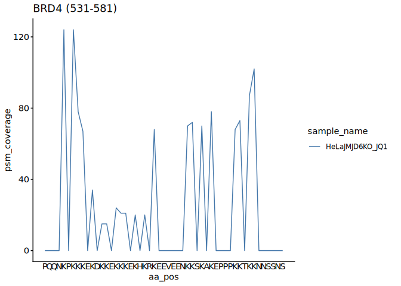<!-- -->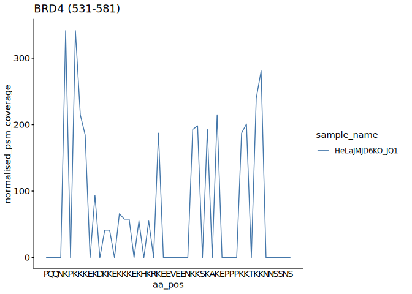<!-- -->

``` r
PNAS2022_PSM_JMJD6KO <- PNAS2022_PSM_JMJD6KO$coverage_plot_g

# PNAS2022 - BRD4 JMJD6KO - PTM 
PNAS2022_PTM_JMJD6KO <- plot_ptm_stoichiometry(
  pnas2022.stoic.dt[sample_name == "HeLaJMJD6KO_JQ1"], accession = "O60885", plot_range = c(531, 581), all.protein.bs, sample_colors = NA)
```

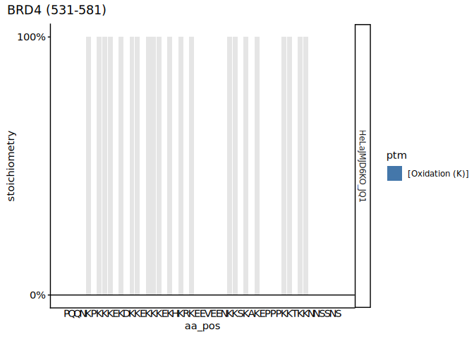<!-- -->

``` r
# Combine PSM and PTM plot together using patchwork
# WT
#PNAS2022_PSM_WT/PNAS2022_PTM_WT

# JMJD6KO
#PNAS2022_PSM_JMJD6KO/PNAS2022_PTM_JMJD6KO

# Load library 
library(ggplot2)
library(ggpubr)

# Combine PSM and PTM plot together using ggarrange
# WT
ggarrange(
  PNAS2022_PSM_WT, PNAS2022_PTM_WT,
  ncol = 1, nrow = 2,
  align = "hv", 
  legend = "none"
)
```

    ## Warning: Graphs cannot be vertically aligned unless the axis parameter is set.
    ## Placing graphs unaligned.

    ## Warning: Graphs cannot be horizontally aligned unless the axis parameter is
    ## set. Placing graphs unaligned.

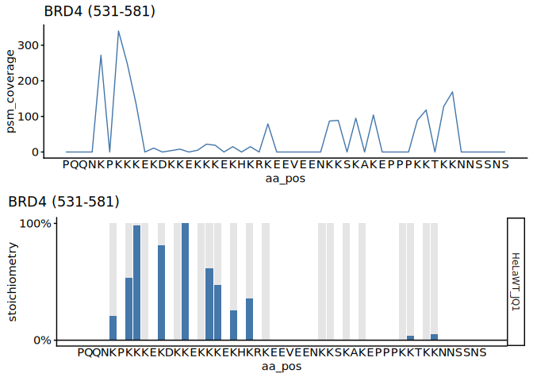<!-- -->

``` r
# JMJD6KO
ggarrange(
  PNAS2022_PSM_JMJD6KO, PNAS2022_PTM_JMJD6KO,
  ncol = 1, nrow = 2,
  align = "hv", 
  legend = "none"
)
```

    ## Warning: Graphs cannot be vertically aligned unless the axis parameter is set.
    ## Placing graphs unaligned.
    ## Warning: Graphs cannot be horizontally aligned unless the axis parameter is
    ## set. Placing graphs unaligned.

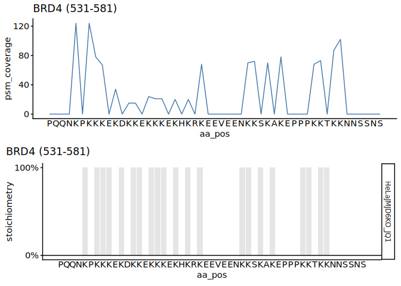<!-- -->

``` r
# Load sample run info data (MQ standard)
MQ_Std_run_info <- read_excel(
  file.path(project.dir, "data/analysis_setting/PXD031221_sample_matrix.xlsx"),
  sheet = "MQ_standard" 
) %>% data.table

# Add a new column 'sample_id' that assigns a unique sequential number to each 
#row (1:N), where N is the total number of rows in the data.table
MQ_Std_run_info[, sample_id := 1:.N]

## Read stoichiometry data for MQ_DI
MQ_Std_stoic_dt <- lapply(
  MQ_Std_run_info[, prefix],
  read_stoic_data,
  pre_prefix = "", 
  post_fix = "",
  dir_path = file.path(results.dir, "p2-analysis-setting", "MQ_Std_MSMS")
) %>% rbindlist

# MQ_DI - BRD4 WT - PTM 
MQ_PTM_WT <- plot_ptm_stoichiometry(
  MQ_Std_stoic_dt[sample_name == "JQ1_HeLaWT_derivatised"], accession = "O60885", plot_range = c(531, 581), all.protein.bs, sample_colors = NA)
```

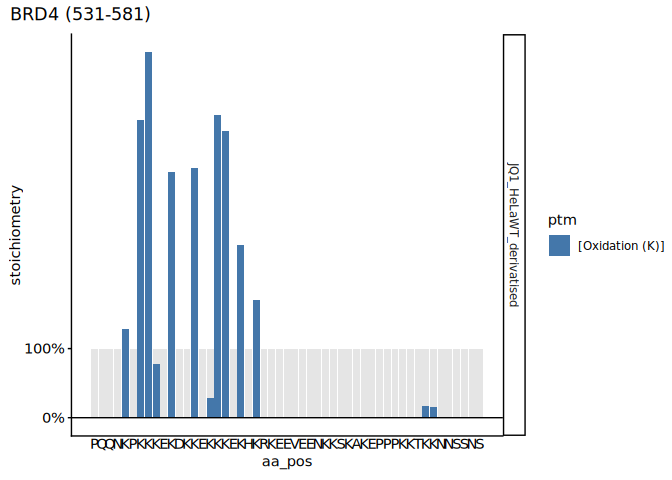<!-- -->

``` r
# MQ_DI - BRD4 WT - PSM 
MQ_PSM_WT <- plot_psm_coverage(
  MQ_Std_stoic_dt[sample_name == "JQ1_HeLaWT_derivatised"], accession = "O60885", plot_range = c(531, 581), all.protein.bs, sample_colors = NA)
```

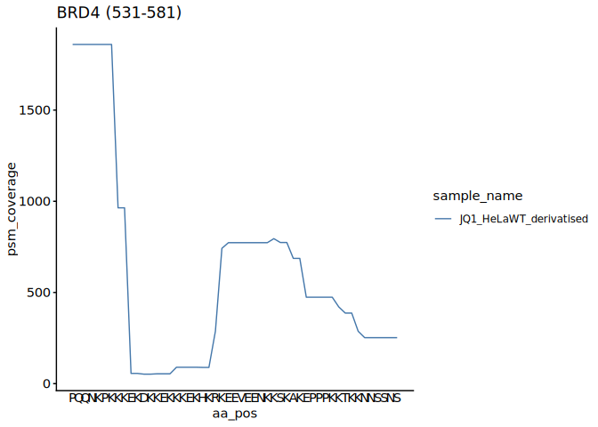<!-- -->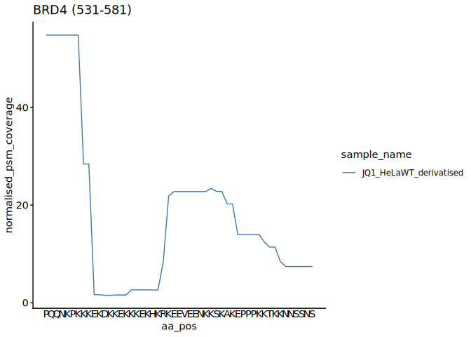<!-- -->

``` r
MQ_PSM_WT <- MQ_PSM_WT$coverage_plot_g

# Combine PSM and PTM plot together using ggarrange
# WT
ggarrange(
  MQ_PSM_WT, MQ_PTM_WT,
  ncol = 1, nrow = 2,
  align = "hv", 
  legend = "none"
)
```

    ## Warning: Graphs cannot be vertically aligned unless the axis parameter is set.
    ## Placing graphs unaligned.

    ## Warning: Graphs cannot be horizontally aligned unless the axis parameter is
    ## set. Placing graphs unaligned.

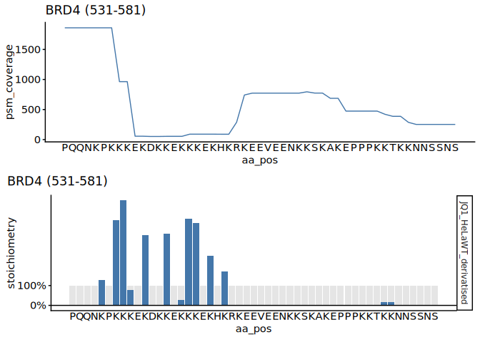<!-- -->

``` r
# MQ_DI - BRD4 JMJD6KO - PSM 
MQ_PSM_JMJD6KO <-plot_psm_coverage(
  MQ_Std_stoic_dt[sample_name == "JQ1_HeLaJMJD6KO_derivatised"], accession = "O60885", plot_range = c(531, 581), all.protein.bs, sample_colors = NA)
```

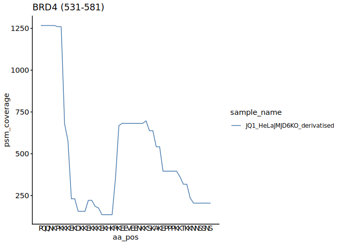<!-- -->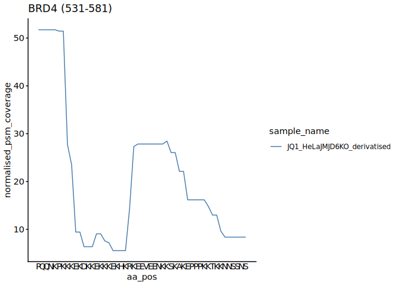<!-- -->

``` r
MQ_PSM_JMJD6KO <- MQ_PSM_JMJD6KO$coverage_plot_g

# MQ_DI - BRD4 JMJD6KO - PTM
MQ_PTM_JMJD6KO <- plot_ptm_stoichiometry(
  MQ_Std_stoic_dt[sample_name == "JQ1_HeLaJMJD6KO_derivatised"], accession = "O60885", plot_range = c(531, 581), all.protein.bs, sample_colors = NA)
```

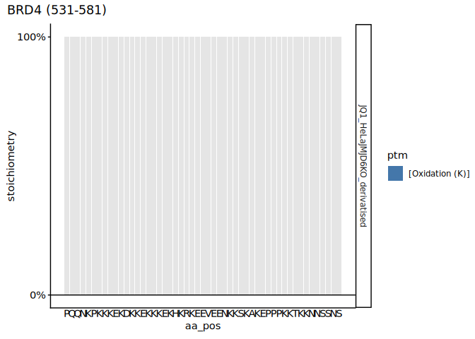<!-- -->

``` r
# Combine PSM and PTM plot together using ggarrange
# JMJD6KO
ggarrange(
  MQ_PSM_JMJD6KO, MQ_PTM_JMJD6KO,
  ncol = 1, nrow = 2,
  align = "hv", 
  legend = "none"
)
```

    ## Warning: Graphs cannot be vertically aligned unless the axis parameter is set.
    ## Placing graphs unaligned.
    ## Warning: Graphs cannot be horizontally aligned unless the axis parameter is
    ## set. Placing graphs unaligned.

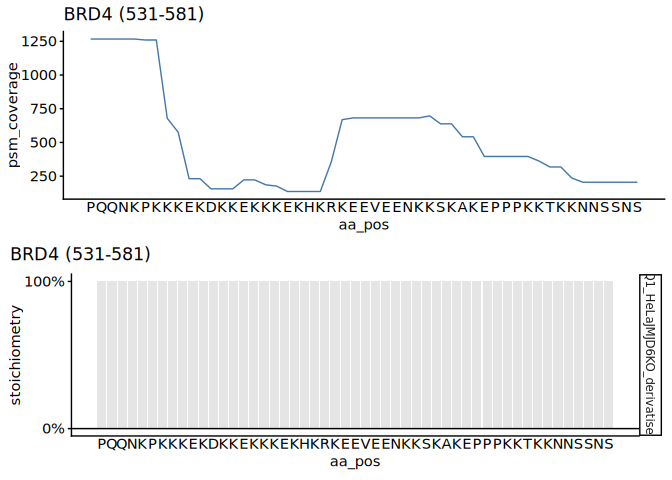<!-- -->

# 2.1.1.4 Comparing PSM coverage between m2, m5, and m7 miscleavages

``` r
## MQ_DI PSM coverage according to miscleavages (m2, m5, m7)

# m2
MQ_PSM_WT <- plot_psm_coverage(
  MQ_Std_stoic_dt[sample_name == "JQ1_HeLaWT_derivatised" & condition == "data-A_trp_m2_v2_def"], accession = "O60885", plot_range = c(531, 581), all.protein.bs, sample_colors = NA) 
```

<!-- --><!-- -->

``` r
MQ_PSM_WT$coverage_plot_g + coord_cartesian(ylim = c(0, 350)) +
    labs(title = "BRD4 PSM miscleavages m2")
```

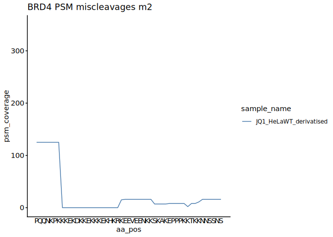<!-- -->

``` r
# m5
MQ_PSM_WT <- plot_psm_coverage(
  MQ_Std_stoic_dt[sample_name == "JQ1_HeLaWT_derivatised" & condition == "data-A_trp_m5_v5_def"], accession = "O60885", plot_range = c(531, 581), all.protein.bs, sample_colors = NA)
```

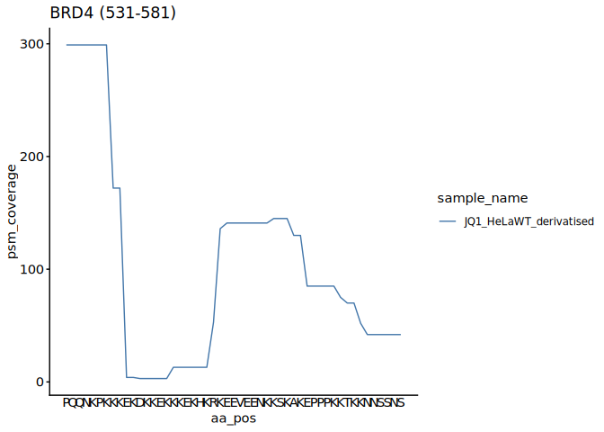<!-- -->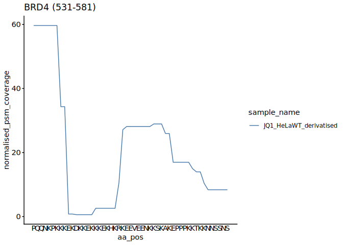<!-- -->

``` r
MQ_PSM_WT$coverage_plot_g + coord_cartesian(ylim = c(0, 350))
```

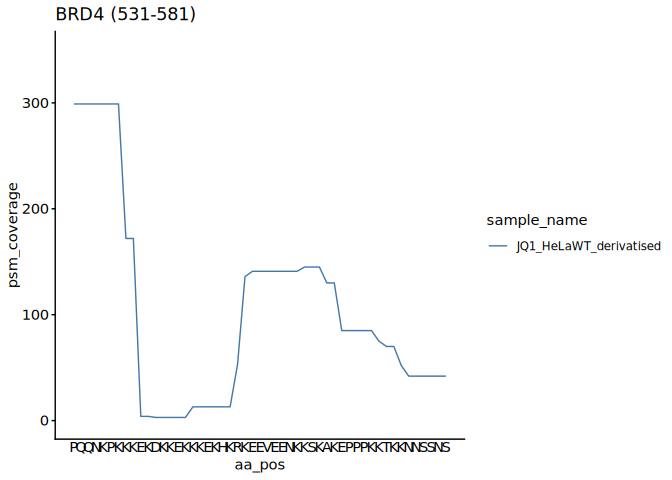<!-- -->

``` r
# m7
MQ_PSM_WT <- plot_psm_coverage(
  MQ_Std_stoic_dt[sample_name == "JQ1_HeLaWT_derivatised" & condition == "data-A_trp_m7_v7_def"], accession = "O60885", plot_range = c(531, 581), all.protein.bs, sample_colors = NA)
```

<!-- --><!-- -->

``` r
MQ_PSM_WT$coverage_plot_g + coord_cartesian(ylim = c(0, 350))
```

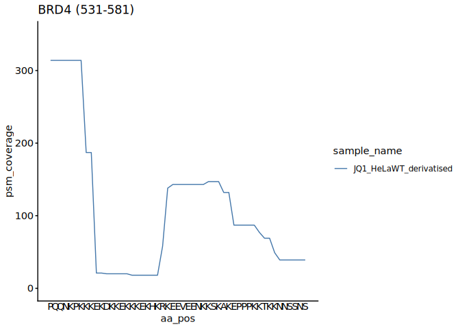<!-- -->

``` r
MQ_PSM_WT <- MQ_PSM_WT$coverage_plot_g
```

# Session information

``` r
sessioninfo::session_info()
```

    ## ─ Session info ───────────────────────────────────────────────────────────────
    ##  setting  value
    ##  version  R version 4.5.1 (2025-06-13)
    ##  os       Ubuntu 24.04.2 LTS
    ##  system   x86_64, linux-gnu
    ##  ui       X11
    ##  language (EN)
    ##  collate  C.UTF-8
    ##  ctype    C.UTF-8
    ##  tz       Europe/Berlin
    ##  date     2025-12-09
    ##  pandoc   3.4 @ /usr/lib/rstudio-server/bin/quarto/bin/tools/x86_64/ (via rmarkdown)
    ##  quarto   1.6.42 @ /usr/lib/rstudio-server/bin/quarto/bin/quarto
    ## 
    ## ─ Packages ───────────────────────────────────────────────────────────────────
    ##  package           * version    date (UTC) lib source
    ##  abind               1.4-8      2024-09-12 [1] CRAN (R 4.5.1)
    ##  backports           1.5.0      2024-05-23 [1] CRAN (R 4.5.1)
    ##  BiocGenerics      * 0.54.0     2025-04-15 [1] Bioconduc~
    ##  Biostrings        * 2.76.0     2025-04-15 [1] Bioconduc~
    ##  broom               1.0.10     2025-09-13 [1] CRAN (R 4.5.1)
    ##  car                 3.1-3      2024-09-27 [1] CRAN (R 4.5.1)
    ##  carData             3.0-5      2022-01-06 [1] CRAN (R 4.5.1)
    ##  cellranger          1.1.0      2016-07-27 [1] CRAN (R 4.5.1)
    ##  cli                 3.6.5      2025-04-23 [1] CRAN (R 4.5.1)
    ##  cowplot             1.2.0      2025-07-07 [1] CRAN (R 4.5.1)
    ##  crayon              1.5.3      2024-06-20 [1] CRAN (R 4.5.1)
    ##  data.table        * 1.17.8     2025-07-10 [1] CRAN (R 4.5.1)
    ##  digest              0.6.37     2024-08-19 [1] CRAN (R 4.5.1)
    ##  dplyr             * 1.1.4      2023-11-17 [1] CRAN (R 4.5.1)
    ##  evaluate            1.0.5      2025-08-27 [1] CRAN (R 4.5.1)
    ##  farver              2.1.2      2024-05-13 [1] CRAN (R 4.5.1)
    ##  fastmap             1.2.0      2024-05-15 [1] CRAN (R 4.5.1)
    ##  Formula             1.2-5      2023-02-24 [1] CRAN (R 4.5.1)
    ##  generics          * 0.1.4      2025-05-09 [1] CRAN (R 4.5.1)
    ##  GenomeInfoDb      * 1.44.3     2025-09-21 [1] Bioconduc~
    ##  GenomeInfoDbData    1.2.14     2025-09-24 [1] Bioconductor
    ##  ggplot2           * 4.0.0      2025-09-11 [1] CRAN (R 4.5.1)
    ##  ggpubr            * 0.6.2      2025-10-17 [1] CRAN (R 4.5.1)
    ##  ggsignif            0.6.4      2022-10-13 [1] CRAN (R 4.5.1)
    ##  glue                1.8.0      2024-09-30 [1] CRAN (R 4.5.1)
    ##  gtable              0.3.6      2024-10-25 [1] CRAN (R 4.5.1)
    ##  htmltools           0.5.8.1    2024-04-04 [1] CRAN (R 4.5.1)
    ##  httr                1.4.7      2023-08-15 [1] CRAN (R 4.5.1)
    ##  IRanges           * 2.42.0     2025-04-15 [1] Bioconduc~
    ##  janitor             2.2.1      2024-12-22 [1] CRAN (R 4.5.1)
    ##  jsonlite            2.0.0      2025-03-27 [1] CRAN (R 4.5.1)
    ##  khroma            * 1.16.0     2025-02-25 [1] CRAN (R 4.5.1)
    ##  knitr             * 1.50       2025-03-16 [1] CRAN (R 4.5.1)
    ##  labeling            0.4.3      2023-08-29 [1] CRAN (R 4.5.1)
    ##  lifecycle           1.0.4      2023-11-07 [1] CRAN (R 4.5.1)
    ##  lubridate           1.9.4      2024-12-08 [1] CRAN (R 4.5.1)
    ##  magrittr          * 2.0.4      2025-09-12 [1] CRAN (R 4.5.1)
    ##  patchwork           1.3.2      2025-08-25 [1] CRAN (R 4.5.1)
    ##  pillar              1.11.1     2025-09-17 [1] CRAN (R 4.5.1)
    ##  pkgconfig           2.0.3      2019-09-22 [1] CRAN (R 4.5.1)
    ##  ptm.stoichiometry * 0.0.0.9000 2025-11-07 [1] local
    ##  purrr               1.1.0      2025-07-10 [1] CRAN (R 4.5.1)
    ##  R6                  2.6.1      2025-02-15 [1] CRAN (R 4.5.1)
    ##  RColorBrewer        1.1-3      2022-04-03 [1] CRAN (R 4.5.1)
    ##  readxl            * 1.4.5      2025-03-07 [1] CRAN (R 4.5.1)
    ##  rlang               1.1.6      2025-04-11 [1] CRAN (R 4.5.1)
    ##  rmarkdown           2.29       2024-11-04 [1] CRAN (R 4.5.1)
    ##  rstatix             0.7.3      2025-10-18 [1] CRAN (R 4.5.1)
    ##  S4Vectors         * 0.46.0     2025-04-15 [1] Bioconduc~
    ##  S7                  0.2.0      2024-11-07 [1] CRAN (R 4.5.1)
    ##  scales              1.4.0      2025-04-24 [1] CRAN (R 4.5.1)
    ##  sessioninfo         1.2.3      2025-02-05 [1] CRAN (R 4.5.1)
    ##  snakecase           0.11.1     2023-08-27 [1] CRAN (R 4.5.1)
    ##  stringi             1.8.7      2025-03-27 [1] CRAN (R 4.5.1)
    ##  stringr           * 1.5.2      2025-09-08 [1] CRAN (R 4.5.1)
    ##  tibble              3.3.0      2025-06-08 [1] CRAN (R 4.5.1)
    ##  tidyr               1.3.1      2024-01-24 [1] CRAN (R 4.5.1)
    ##  tidyselect          1.2.1      2024-03-11 [1] CRAN (R 4.5.1)
    ##  timechange          0.3.0      2024-01-18 [1] CRAN (R 4.5.1)
    ##  UCSC.utils          1.4.0      2025-04-15 [1] Bioconduc~
    ##  vctrs               0.6.5      2023-12-01 [1] CRAN (R 4.5.1)
    ##  withr               3.0.2      2024-10-28 [1] CRAN (R 4.5.1)
    ##  xfun                0.53       2025-08-19 [1] CRAN (R 4.5.1)
    ##  XVector           * 0.48.0     2025-04-15 [1] Bioconduc~
    ##  yaml                2.3.10     2024-07-26 [1] CRAN (R 4.5.1)
    ## 
    ##  [1] /home/pkesava/R/x86_64-pc-linux-gnu-library/4.5
    ##  [2] /usr/local/lib/R/site-library
    ##  [3] /usr/lib/R/site-library
    ##  [4] /usr/lib/R/library
    ##  * ── Packages attached to the search path.
    ## 
    ## ──────────────────────────────────────────────────────────────────────────────
