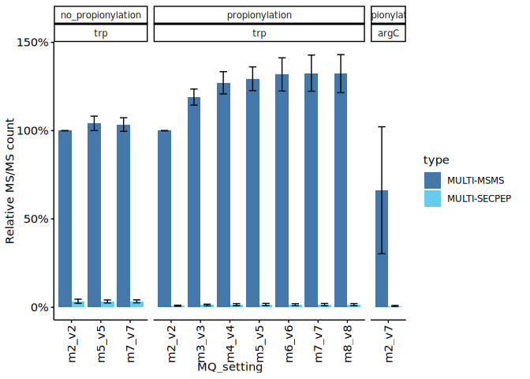
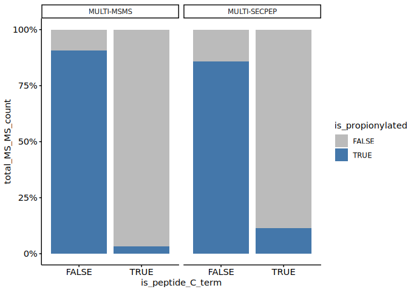
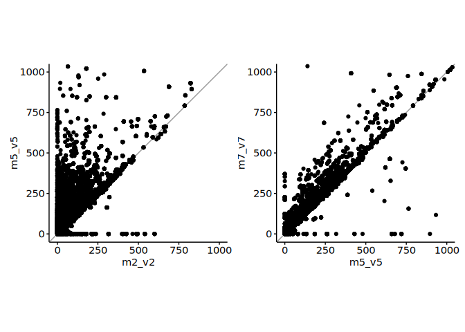
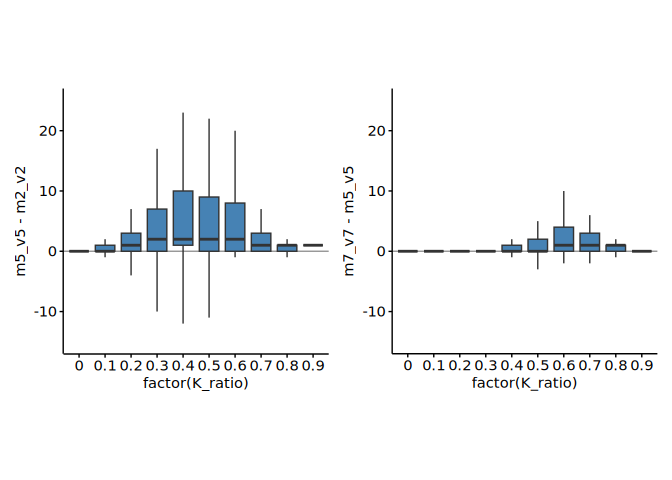
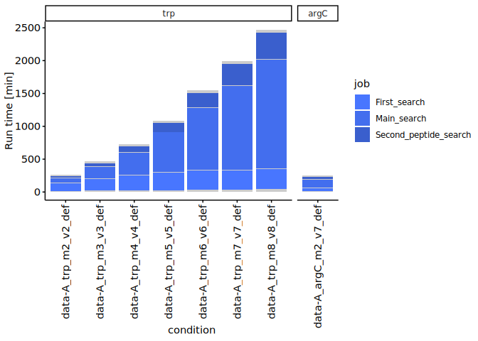
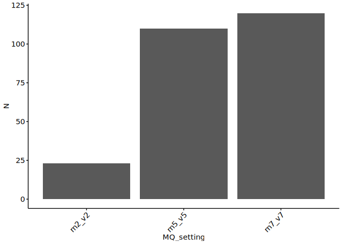
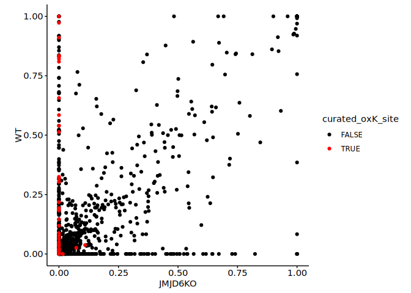
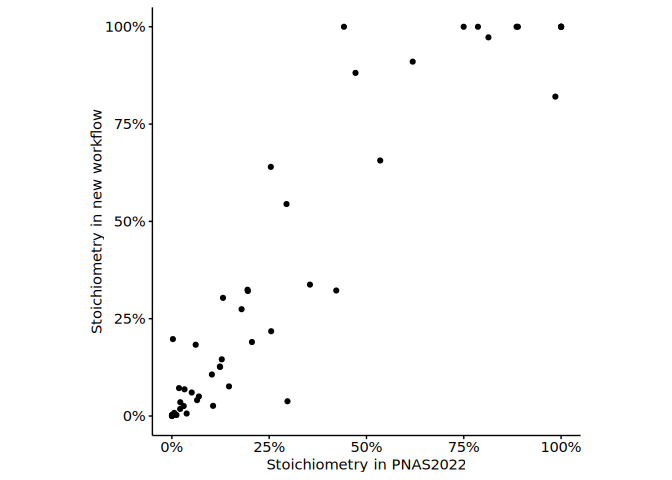

2-2. Optimise MQ parameters
================
Yoichiro Sugimoto and Pallavi Kesavan
07 January, 2026

- [Environment setup](#environment-setup)
- [2.2.1 Import basic data](#221-import-basic-data)
- [2.2.2 MS/MS count by different
  setting](#222-msms-count-by-different-setting)
- [2.2.3 QC by the position of propionylated
  lysines](#223-qc-by-the-position-of-propionylated-lysines)
- [2.2.4 The effect of MQ setting by K
  score](#224-the-effect-of-mq-setting-by-k-score)
- [2.2.5 The effect of MQ setting on
  runtime](#225-the-effect-of-mq-setting-on-runtime)
- [2.2.6 The hydroxylation sites reported in the PNAS2022
  paper](#226-the-hydroxylation-sites-reported-in-the-pnas2022-paper)
- [2.2.7 Comparison of WT and KO
  data](#227-comparison-of-wt-and-ko-data)
- [2.2.8 Comparison of the results of PNAS paper (hydoxylation
  stoichometry)](#228-comparison-of-the-results-of-pnas-paper-hydoxylation-stoichometry)
- [Session information](#session-information)

This script calculates the stoichiometry of PTMs.

# Environment setup

``` r
# renv::init(
#           "/fast/AG_Sugimoto/home/users/yoichiro/projects/20241111_PTMs_in_lysine_rich_domains/R"
#       )

project.dir <-
  file.path(
    "/fast/AG_Sugimoto/home/users/pallavi/projects/20241111_PTMs_in_lysine_rich_domains"
  )

# renv::snapshot(file.path(project.dir, "R"))
#renv::restore(file.path(project.dir, "R"))
```

``` r
## Load all R scripts from the 'functions' folder into the current session
P2_functions <-
  sapply(list.files(
    file.path(project.dir, "R/functions"),
    pattern = "*.R",
    full.names = TRUE
  ),
  source)
```

    ## 
    ## Attaching package: 'dplyr'

    ## The following objects are masked from 'package:stats':
    ## 
    ##     filter, lag

    ## The following objects are masked from 'package:base':
    ## 
    ##     intersect, setdiff, setequal, union

    ## 
    ## Attaching package: 'data.table'

    ## The following objects are masked from 'package:dplyr':
    ## 
    ##     between, first, last

    ## Loading required package: BiocGenerics

    ## 
    ## Attaching package: 'BiocGenerics'

    ## The following objects are masked from 'package:dplyr':
    ## 
    ##     combine, intersect, setdiff, union

    ## The following objects are masked from 'package:stats':
    ## 
    ##     IQR, mad, sd, var, xtabs

    ## The following objects are masked from 'package:base':
    ## 
    ##     anyDuplicated, aperm, append, as.data.frame, basename, cbind,
    ##     colnames, dirname, do.call, duplicated, eval, evalq, Filter, Find,
    ##     get, grep, grepl, intersect, is.unsorted, lapply, Map, mapply,
    ##     match, mget, order, paste, pmax, pmax.int, pmin, pmin.int,
    ##     Position, rank, rbind, Reduce, rownames, sapply, saveRDS, setdiff,
    ##     table, tapply, union, unique, unsplit, which.max, which.min

    ## Loading required package: S4Vectors

    ## Loading required package: stats4

    ## 
    ## Attaching package: 'S4Vectors'

    ## The following objects are masked from 'package:data.table':
    ## 
    ##     first, second

    ## The following objects are masked from 'package:dplyr':
    ## 
    ##     first, rename

    ## The following object is masked from 'package:utils':
    ## 
    ##     findMatches

    ## The following objects are masked from 'package:base':
    ## 
    ##     expand.grid, I, unname

    ## Loading required package: IRanges

    ## 
    ## Attaching package: 'IRanges'

    ## The following object is masked from 'package:data.table':
    ## 
    ##     shift

    ## The following objects are masked from 'package:dplyr':
    ## 
    ##     collapse, desc, slice

    ## Loading required package: XVector

    ## Loading required package: GenomeInfoDb

    ## 
    ## Attaching package: 'Biostrings'

    ## The following object is masked from 'package:base':
    ## 
    ##     strsplit

``` r
## Install private packages 
# Install ptm.stiochiometry package
#install.packages("/fast/AG_Sugimoto/home/users/pallavi/projects/ptm.stoichiometry", repos = NULL, type = "source")

# Load Libraries - ptm.stiochiometry and readxl
library(ptm.stoichiometry)
library("readxl")

# Define path to result directory 
p2_results_dir <- file.path(project.dir,
                        "results",
                        "p2_analysis_setting")
```

# 2.2.1 Import basic data

``` r
# Define path for data directory
data.dir <- file.path(project.dir, "data")

# Define file path for PNAS2022 data 
pnas2022_data <- file.path(
  project.dir,
  "data/PNAS2022" 
)

# Load sample run info using defined file path
all_sample_run_info <- read_excel(
  file.path(data.dir, "analysis_setting", "PXD031221_sample_matrix.xlsx"),
  sheet = "MQ_standard"
) %>% data.table

# Define path for protein feature data
protein.feature.dt <- fread(file.path(data.dir, "PNAS2022/all_protein_feature_per_position.csv"))

# Change column names
setnames(protein.feature.dt, old = c("uniprot_id", "position"), new = c("protein_accession", "aa_pos"))
```

# 2.2.2 MS/MS count by different setting

``` r
# Define "read_evidence" function 
read_evidence <- function(prefix, dir_path){
  input.file <- file.path(
    dir_path, 
    paste0("including_SECPEP_", prefix, "all_processed_evidence_data.csv")
  )
  if(file.exists(input.file)){
    dt <- fread(input.file)
    dt[, condition := gsub("_$", "", prefix)]
  } else {
    dt <- data.table()
  }
  return(dt)
}

# Apply the function 'read_evidence' to each selected 'prefix' value
evidence.dt <- lapply( # Filter data-A and data-D and retrieve corresponding prefix
  all_sample_run_info[data %in% c("data-A", "data-D") & !is.na(prefix), prefix], 
  read_evidence,
  dir_path = p2_results_dir
) %>% rbindlist


data.count.dt <- evidence.dt[, list(
  total_peptide_count = .N, # Count total number of rows (peptides)
  total_msms_count = sum(psm_mapped), # Sum of 'psm_mapped'
  total_intensity = sum(peak_intensity) # Sum of 'peak_intensity'
), by = list(file_name, sample_name, condition, type)] 

data.count.dt[, `:=`(
  propionylation = case_when(
    grepl("^data-D", condition) ~ "no_propionylation",
    TRUE ~ "propionylation"
  ),
  MQ_setting = str_extract(condition, "m\\d+_v\\d+"),
  protease_setting = str_split_fixed(condition, "_", n = 3)[, 2]
)]

data_col = c("total_peptide_count", "total_msms_count", "total_intensity")

m2_v2.dt <- data.count.dt[
  MQ_setting == "m2_v2" & type == "MULTI-MSMS"
][, c("file_name", data_col), with = FALSE]
setnames(m2_v2.dt, old = data_col, new = paste0("m2_v2_", data_col))

rel_count.dt <- data.count.dt

rel_count.dt <- merge(
  rel_count.dt,
  m2_v2.dt,
  by = c("file_name")
)

rel_count.dt[, `:=`(
  rel_total_peptide_count = total_peptide_count / m2_v2_total_peptide_count,
  rel_msms_count = total_msms_count / m2_v2_total_msms_count,
  rel_intensity = total_intensity / m2_v2_total_intensity 
)]

rel_count_stat.dt <- rel_count.dt[, list(
  meab_rel_total_peptide_count = mean(rel_total_peptide_count),
  sd_rel_total_peptide_count = sd(rel_total_peptide_count),
  mean_rel_msms_count = mean(rel_msms_count),
  sd_rel_msms_count = sd(rel_msms_count),
  mean_rel_intensity = mean(rel_intensity),
  sd_rel_intensity = sd(rel_intensity)
), by = list(propionylation, MQ_setting, protease_setting, type)]

rel_count_stat.dt[, `:=`(
  protease_setting = factor(protease_setting, levels = c("trp", "argC")),
  type = factor(type, levels = c("MULTI-MSMS", "MULTI-SECPEP"))
)]


ggplot(
  rel_count_stat.dt,
  aes(
    x = MQ_setting,
    y = mean_rel_msms_count,
    fill = type
  )
) +
  geom_bar(stat = "identity", position = "dodge") +
  geom_errorbar(aes(
    ymin = mean_rel_msms_count - sd_rel_msms_count,
    ymax = mean_rel_msms_count + sd_rel_msms_count
  ), width = 0.5, position = position_dodge(width = 0.9)) +
  facet_grid(~ propionylation + protease_setting, scales = "free", space = "free") +
  scale_y_continuous(labels = scales::percent_format(accuracy = 1)) +
  scale_x_discrete(guide = guide_axis(angle = 90)) +
  ylab("Relative MS/MS count") +
  scale_fill_manual(values = c("MULTI-MSMS" = "#4477AA", "MULTI-SECPEP" = "#66CCEE")) #+
```

<!-- -->

``` r
# scale_color_manual(values = c("MULTI-MSMS" = "#4477AA", "MULTI-SECPEP" = "#66CCEE"))
```

The results indicate that the setting with 7 miscleavage and 7 variable
modifications identify the highest MS/MS count.

# 2.2.3 QC by the position of propionylated lysines

``` r
read_all_per_pos_data_with_SECPEP <- function(prefix, dir_path){
  dt <- fread(file.path(dir_path, paste0("including_SECPEP_", prefix, "all_per_pos_data.csv")))
  dt[, condition := gsub("_$", "", prefix)]
  return(dt)
}

all_per_pos_with_SECPEP.dt <- lapply(
  all_sample_run_info[data %in% c("data-A") & grepl("m7_v7", prefix) & !is.na(prefix), prefix],
  read_all_per_pos_data_with_SECPEP,
  dir_path = p2_results_dir
) %>% rbindlist

all_per_pos_with_SECPEP.dt[, `:=`(
  propionylation = case_when(
    grepl("^data-D", condition) ~ "no_propionylation",
    TRUE ~ "propionylation"
  ),
  MQ_setting = str_extract(condition, "m\\d+_v\\d+"),
  protease_setting = str_split_fixed(condition, "_", n = 3)[, 2],
  is_peptide_C_term = peptide_end == aa_pos,
  is_propionylated = ptm %in% c("[Propionylation]", "[Oxidised Propionylation]")
)]

all_per_K_pos_with_SECPEP.dt <- all_per_pos_with_SECPEP.dt[aa == "K"]

propionylated_K_count.dt <- all_per_K_pos_with_SECPEP.dt[
  , list(total_MS_MS_count = sum(psm_mapped)),
  by = list(is_propionylated, is_peptide_C_term, type)
]

propionylated_K_count.dt
```

    ##    is_propionylated is_peptide_C_term         type total_MS_MS_count
    ##              <lgcl>            <lgcl>       <char>             <int>
    ## 1:            FALSE             FALSE MULTI-SECPEP               272
    ## 2:             TRUE             FALSE MULTI-SECPEP              1652
    ## 3:            FALSE              TRUE MULTI-SECPEP               273
    ## 4:             TRUE             FALSE   MULTI-MSMS            180191
    ## 5:            FALSE              TRUE   MULTI-MSMS             33088
    ## 6:            FALSE             FALSE   MULTI-MSMS             18788
    ## 7:             TRUE              TRUE   MULTI-MSMS              1124
    ## 8:             TRUE              TRUE MULTI-SECPEP                35

``` r
ggplot(
  propionylated_K_count.dt,
  aes(
    x = is_peptide_C_term,
    y = total_MS_MS_count,
    fill = is_propionylated
  )
) +
  geom_bar(stat = "identity", position="fill") +
  scale_fill_manual(values = c("TRUE" = "#4477AA", "FALSE" = "#BBBBBB")) +
  facet_grid(~ type) +
  scale_y_continuous(labels = scales::percent_format(accuracy = 1))
```

<!-- -->

Based on the analyses here, we decided to focus on using MULTI-MSMS
data.

# 2.2.4 The effect of MQ setting by K score

``` r
read_stoic_data <- function(prefix, dir_path){
  dt <- fread(file.path(dir_path, paste0(prefix, "PTM_stoichiometry.csv")))
  dt[, condition := gsub("_$", "", prefix)]
  return(dt)
}

all_stoic_pos.dt <- lapply(
  all_sample_run_info[
    data != "data-D" & 
      grepl("_trp_", prefix) &
      !grepl("including_SECPEP", prefix) &
      grepl("m[257]_v[257]_(def|mCC)", prefix) & 
      !is.na(prefix), prefix
  ],
  read_stoic_data,
  dir_path = p2_results_dir
) %>% rbindlist

all_stoic_pos.dt[, `:=`(
  MQ_setting = str_extract(condition, "m\\d+_v\\d+")
)]

ms_ms_count.dt <- all_stoic_pos.dt[
  , list(total_ms_ms_count = sum(sum_psm_mapped)), by = list(protein_accession, aa_pos, MQ_setting)
]

ms_ms_count.dt <- merge(
  ms_ms_count.dt,
  protein.feature.dt[, .(protein_accession, aa_pos, K_ratio, K_ratio_score, IUPRED2)],
  by = c("protein_accession", "aa_pos")
)

d.ms_ms_count.dt <- dcast(
  copy(ms_ms_count.dt)[, IUPRED2 := NULL],
  protein_accession + aa_pos + K_ratio + K_ratio_score ~ MQ_setting,
  value.var = "total_ms_ms_count", fill = 0
  
)

library("RColorBrewer")
library("patchwork")

d.ms_ms_count.dt[, table(K_ratio)]
```

    ## K_ratio
    ##      0    0.1    0.2    0.3    0.4    0.5    0.6    0.7    0.8    0.9 
    ## 281712 188153  76269  24156   7014   2074    604    221     60     10

``` r
p1 <- ggplot(
  d.ms_ms_count.dt[order(K_ratio)],
  aes(
    x = m2_v2,
    y = m5_v5
  )
) +
  geom_abline(slope = 1, intercept = 0, color = "gray60") +
  geom_point() +
  coord_cartesian(xlim = c(0, 1000), ylim = c(0, 1000)) +
  theme(aspect.ratio = 1)

p2 <- ggplot(
  d.ms_ms_count.dt[order(K_ratio)],
  aes(
    x = m5_v5,
    y = m7_v7
  )
) +
  geom_abline(slope = 1, intercept = 0, color = "gray60") +
  geom_point() +
  coord_cartesian(xlim = c(0, 1000), ylim = c(0, 1000)) +
  theme(aspect.ratio = 1)

p1 + p2
```

<!-- -->

``` r
p3 <- ggplot(
  d.ms_ms_count.dt,
  aes(
    x = factor(K_ratio),
    y = m5_v5 - m2_v2
  )
) +
  geom_hline(yintercept = 0, color = "gray60") +
  geom_boxplot(outlier.shape = NA, fill = "steelblue") +
  coord_cartesian(ylim = c(-15, 25)) +
  theme(aspect.ratio = 1)

p4 <- ggplot(
  d.ms_ms_count.dt,
  aes(
    x = factor(K_ratio),
    y = m7_v7 - m5_v5
  )
) +
  geom_hline(yintercept = 0, color = "gray60") +
  geom_boxplot(outlier.shape = NA, fill = "steelblue") +
  coord_cartesian(ylim = c(-15, 25))

p3 + p4
```

<!-- -->

# 2.2.5 The effect of MQ setting on runtime

``` r
read_runtime_data <- function(prefix, dir_path){
  dt <- fread(file.path(dir_path, paste0(prefix, "runningTimes.txt")))
  dt[, condition := gsub("_$", "", prefix)]
  
  dt <- janitor::clean_names(dt)
  
  dt[, job := 
       janitor::clean_names(setNames(nm = job)) %>%
       names %>% as.character
  ]
  
  dt[, `:=`(
    job = dplyr::case_when(
      job == "ms_ms_first_search" ~ "First_search",
      job == "ms_ms_main_search" ~ "Main_search",
      job == "second_peptide_search" ~ "Second_peptide_search",
      TRUE ~ job
    )
  )]
  return(dt)
}

all_runtime.dt <- lapply(
  all_sample_run_info[
    data == "data-A" & 
      !grepl("including_SECPEP", prefix) &
      grepl("m[2-8]_v[2-8]_(def|mCC)", prefix) & 
      !is.na(prefix), prefix
  ],
  read_runtime_data,
  dir_path = file.path(data.dir, "MQ_standard/PNAS2022/runtime")
) %>% rbindlist

job_names <- all_runtime.dt[, unique(job)]

all_runtime.dt[, `:=`(
  job = factor(job, levels = rev(job_names)),
  condition = factor(condition, levels = c(
    all_sample_run_info[
      data == "data-A" & 
        !grepl("including_SECPEP", prefix) &
        grepl("m[2-8]_v[2-8]_(def|mCC)", prefix) & 
        !is.na(prefix), prefix
    ] %>% {gsub("_$", "", .)}
  ))
)]

all_runtime.dt[, `:=`(
  protease_setting = 
    str_split_fixed(condition, "_", n = 5)[, 2] %>%
    factor(levels = c("trp", "argC"))
)]

runtime_plot_colors <- setNames(
  rep("gray80", times = length(job_names)), nm = job_names
) 

runtime_plot_colors[c("First_search", "Main_search", "Second_peptide_search")] <- c("royalblue1", "royalblue2", "royalblue3")

ggplot(
  data = all_runtime.dt,
  aes(
    x = condition,
    y = running_time_min,
    fill = job
  ),
  color = NA
) + 
  geom_bar(stat = "identity") +
  scale_fill_manual(
    breaks = c("First_search", "Main_search", "Second_peptide_search"),
    values = runtime_plot_colors
  ) +
  facet_grid(~ protease_setting, scales = "free_x", space = "free") +
  scale_x_discrete(guide = guide_axis(angle = 90)) +
  ylab("Run time [min]")
```

<!-- -->

# 2.2.6 The hydroxylation sites reported in the PNAS2022 paper

``` r
## Hydroxylation stoichiometry comparisons
pnas2022.stoic.dt <- fread(file.path(data.dir, "PNAS2022/long_K_stoichiometry_data.csv"))
setnames(pnas2022.stoic.dt, old = c("uniprot_id", "position"), new = c("protein_accession", "aa_pos"))

pnas2022.stoic.dt[, `:=`(
  accession_position = paste0(protein_accession, "_", aa_pos)
)]

# PNAS paper reported 153 sites
nrow(pnas2022.stoic.dt[curated_oxK_site == TRUE][!duplicated(paste(accession_position))])
```

    ## [1] 153

``` r
# Check how many hydroxylation sites that were reported by PNAS2022 are identified by the new workflow

all_stoic_pos.dt[, `:=`(
  curated_oxK_site = 
    paste0(protein_accession, "_", aa_pos) %in%
    pnas2022.stoic.dt[curated_oxK_site == TRUE, paste0(protein_accession, "_", aa_pos)],
  genotype = str_extract(sample_name, "(?<=HeLa)(WT|JMJD6KO)")
)]

# PNAS paper reported 153 sites
nrow(pnas2022.stoic.dt[curated_oxK_site == TRUE][!duplicated(paste(protein_accession, aa_pos))])
```

    ## [1] 153

``` r
# The number of hydroxylated sites identified by different MQ cleavage setting
all_stoic_pos.dt[
  curated_oxK_site == TRUE & genotype == "WT" & ptm == "[Oxidation (K)]"
][order(stoichiometry, MQ_setting, decreasing = TRUE)][
  !duplicated(paste(genotype, MQ_setting, protein_accession, aa_pos, ptm))
][,list(.N), by = list(genotype, MQ_setting, ptm)][order(MQ_setting, ptm)]
```

    ##    genotype MQ_setting             ptm     N
    ##      <char>     <char>          <char> <int>
    ## 1:       WT      m2_v2 [Oxidation (K)]    23
    ## 2:       WT      m5_v5 [Oxidation (K)]   110
    ## 3:       WT      m7_v7 [Oxidation (K)]   120

``` r
MQ_Khydoxy_dt <- all_stoic_pos.dt[
  curated_oxK_site == TRUE & genotype == "WT" & ptm == "[Oxidation (K)]"
][order(stoichiometry, MQ_setting, decreasing = TRUE)][
  !duplicated(paste(genotype, MQ_setting, protein_accession, aa_pos, ptm))
][,list(.N), by = list(genotype, MQ_setting, ptm)][order(MQ_setting, ptm)]

# Plot - Number of hydroxylated sites identified based on MQ cleavage setting 
ggplot(data = MQ_Khydoxy_dt,
       aes(x = MQ_setting,
           y = N) 
) +
  geom_col() +
  theme(axis.text.x = element_text(angle = 45, hjust = 1))
```

<!-- -->

``` r
## The sites not identified by the new workflow
print("Unidentified sites out of 150")
```

    ## [1] "Unidentified sites out of 150"

``` r
pnas2022.stoic.dt[curated_oxK_site == TRUE][!duplicated(paste(accession_position))][!(accession_position %in% all_stoic_pos.dt[MQ_setting == "m7_v7" & curated_oxK_site == TRUE & grepl("[Oxidation (K)]", ptm, fixed = TRUE) & genotype == "WT", paste0(protein_accession, "_", aa_pos)]), .(Accession, aa_pos)]
```

    ##              Accession aa_pos
    ##                 <char>  <int>
    ##  1: O15042|SR140_HUMAN    962
    ##  2: O15042|SR140_HUMAN    972
    ##  3:  O60885|BRD4_HUMAN    286
    ##  4:  O60885|BRD4_HUMAN    289
    ##  5:  O60885|BRD4_HUMAN    291
    ##  6: O95232|LC7L3_HUMAN    392
    ##  7:  P02545|LMNA_HUMAN    341
    ##  8: P11142|HSP7C_HUMAN    248
    ##  9:  P11387|TOP1_HUMAN     40
    ## 10:  P11387|TOP1_HUMAN    159
    ## 11: P18077|RL35A_HUMAN     45
    ## 12:  P35251|RFC1_HUMAN     38
    ## 13:  P46100|ATRX_HUMAN   1422
    ## 14:  P46100|ATRX_HUMAN   1424
    ## 15:  Q13428|TCOF_HUMAN   1348
    ## 16:  Q14331|FRG1_HUMAN     27
    ## 17:  Q14331|FRG1_HUMAN     29
    ## 18:  Q14331|FRG1_HUMAN     30
    ## 19:  Q15059|BRD3_HUMAN    487
    ## 20:  Q15059|BRD3_HUMAN    683
    ## 21: Q66PJ3|AR6P4_HUMAN    290
    ## 22: Q66PJ3|AR6P4_HUMAN    292
    ## 23: Q66PJ3|AR6P4_HUMAN    294
    ## 24: Q6NYC1|JMJD6_HUMAN    219
    ## 25: Q8WXA9|SREK1_HUMAN    269
    ## 26: Q8WXA9|SREK1_HUMAN    400
    ## 27: Q8WXA9|SREK1_HUMAN    414
    ## 28: Q96SB4|SRPK1_HUMAN     18
    ## 29:  Q9BVP2|GNL3_HUMAN     20
    ## 30: Q9NQ29|LUC7L_HUMAN    323
    ## 31: Q9NQ29|LUC7L_HUMAN    325
    ## 32:  Q9NYK5|RM39_HUMAN    322
    ## 33: Q9P1Y6|PHRF1_HUMAN   1073
    ##              Accession aa_pos

The following sites were identified by non-unique peptides (therefore
total number used here is 153 instead of 150 in the paper).

           Accession position curated_oxK_site    screen

1: Q14331\|FRG1_HUMAN 27 JMJD6_substrate FLAGJMJD6 2: Q14331\|FRG1_HUMAN
29 JMJD6_substrate FLAGJMJD6 3: Q14331\|FRG1_HUMAN 30 JMJD6_substrate
FLAGJMJD6 4: Q9UQ35\|SRRM2_HUMAN 241 JMJD6_substrate FLAGJMJD6 5:
Q9UQ35\|SRRM2_HUMAN 243 JMJD6_substrate FLAGJMJD6 6: Q9UQ35\|SRRM2_HUMAN
244 JMJD6_substrate FLAGJMJD6

In the end, 91% of hydroxylated sites were covered by the data, and 80%
(120 / 150) of reported hydroxylation sites were identified by this
workflow.

# 2.2.7 Comparison of WT and KO data

``` r
## Compare WT vs KO data
wt_ko_comparison.dt <- all_stoic_pos.dt[
  sample_name %in% c(
    "JMJD6peptide_HeLaWT_derivatised",
    "JMJD6peptide_HeLaJMJD6KO_derivatised",
    "JQ1_HeLaWT_derivatised",
    "JQ1_HeLaJMJD6KO_derivatised"
  ) &
    MQ_setting == "m7_v7"
]

wt_ko_comparison.dt[, `:=`(
  total_sum_psm_mapped = sum_psm_mapped
)]

no_hydroxyK.stoic.dt <- copy(wt_ko_comparison.dt[aa == "K"])
# Analyse positions for which at least one sample identified hydroxylation
no_hydroxyK.stoic.dt <- no_hydroxyK.stoic.dt[
  paste0(protein_accession, "_", aa_pos) %in% 
    wt_ko_comparison.dt[
      grepl("[Oxidation (K)]", ptm, fixed = TRUE), 
      paste0(protein_accession, "_", aa_pos)
    ]
]

# Assign 0 for the hydroxylation stoichiometry for the position which only identified unmodified K
no_hydroxyK.stoic.dt <- no_hydroxyK.stoic.dt[
  !(paste0(sample_name, "_", protein_accession, "_", aa_pos) %in% 
      wt_ko_comparison.dt[
        grepl("[Oxidation (K)]", ptm, fixed = TRUE), 
        paste0(sample_name, "_", protein_accession, "_", aa_pos)
      ]
  )
]

no_hydroxyK.stoic.dt[, `:=`(
  sum_psm_mapped = 0,
  stoichiometry = 0,
  ptm = "[Oxidation (K)]"
)]

hydroxyK.stoic.dt <- rbind(
  wt_ko_comparison.dt[grepl("[Oxidation (K)]", ptm, fixed = TRUE)],
  no_hydroxyK.stoic.dt
)

hydroxyK.stoic.dt <- hydroxyK.stoic.dt[, list(
  stoichiometry = sum(stoichiometry),
  sum_psm_mapped_per_position = max(sum_psm_mapped_per_position)
), by = list(sample_name, protein_accession, gene_name, aa_pos, genotype)]

hydroxyK.stoic.dt <- hydroxyK.stoic.dt[order(stoichiometry, decreasing = TRUE)][
  !duplicated(paste0(protein_accession, gene_name, aa_pos, genotype))
]

hydroxyK.stoic.dt <- hydroxyK.stoic.dt[
  sum_psm_mapped_per_position > 2
]

d.hydroxyK.stoic.dt <- dcast(
  hydroxyK.stoic.dt,
  protein_accession + gene_name + aa_pos ~ genotype,
  value.var = "stoichiometry"
)

d.hydroxyK.stoic.dt[, `:=`(
  curated_oxK_site = 
    paste0(protein_accession, "_", aa_pos) %in%
    pnas2022.stoic.dt[curated_oxK_site == TRUE, paste0(protein_accession, "_", aa_pos)]
)]

ggplot(
  data = d.hydroxyK.stoic.dt[order(curated_oxK_site)],
  aes(
    x = JMJD6KO,
    y = WT,
    color = curated_oxK_site
  )
) + geom_point() +
  theme(aspect.ratio = 1) +
  scale_color_manual(values = c("TRUE" = "red", "FALSE" = "black"))
```

    ## Warning: Removed 482 rows containing missing values or values outside the scale range
    ## (`geom_point()`).

<!-- -->

``` r
d.hydroxyK.stoic.dt[WT > 0.5 & JMJD6KO < 0.01 & curated_oxK_site == FALSE]
```

    ## Key: <protein_accession, gene_name, aa_pos>
    ##     protein_accession gene_name aa_pos JMJD6KO        WT curated_oxK_site
    ##                <char>    <char>  <int>   <num>     <num>           <lgcl>
    ##  1:            O14979   HNRNPDL    221       0 1.0000000            FALSE
    ##  2:            O60264   SMARCA5    249       0 1.0000000            FALSE
    ##  3:            O60573    EIF4E2    215       0 0.9054387            FALSE
    ##  4:            O95232    LUC7L3    377       0 0.5050502            FALSE
    ##  5:            P07237      P4HB    326       0 0.6760288            FALSE
    ##  6:            P11047     LAMC1   1466       0 0.5191134            FALSE
    ##  7:            P25440      BRD2    551       0 0.6077523            FALSE
    ##  8:            P25440      BRD2    552       0 0.7837141            FALSE
    ##  9:            P25440      BRD2    555       0 0.8367906            FALSE
    ## 10:            P25440      BRD2    556       0 0.7414816            FALSE
    ## 11:            P25440      BRD2    557       0 0.8703312            FALSE
    ## 12:            P27635     RPL10     40       0 1.0000000            FALSE
    ## 13:            P27635     RPL10     42       0 0.8997907            FALSE
    ## 14:            P27816      MAP4    870       0 0.5186066            FALSE
    ## 15:            P46100      ATRX    956       0 0.7404017            FALSE
    ## 16:            Q13123        IK    556       0 0.6816335            FALSE
    ## 17:            Q66PJ3   ARL6IP4    120       0 1.0000000            FALSE
    ## 18:            Q66PJ3   ARL6IP4    122       0 0.5600105            FALSE
    ## 19:            Q66PJ3   ARL6IP4    123       0 1.0000000            FALSE
    ## 20:            Q6KC79     NIPBL   1023       0 0.5172122            FALSE
    ## 21:            Q6KC79     NIPBL   1029       0 0.6771044            FALSE
    ## 22:            Q6KC79     NIPBL   1034       0 0.6771044            FALSE
    ## 23:            Q6KC79     NIPBL   1923       0 0.6472365            FALSE
    ## 24:            Q6UX04     CWC27    331       0 0.9769166            FALSE
    ## 25:            Q7L2H7     EIF3M    319       0 0.5234239            FALSE
    ## 26:            Q7L2H7     EIF3M    324       0 0.8555795            FALSE
    ## 27:            Q8N3C0     ASCC3   1825       0 0.7075247            FALSE
    ## 28:            Q8NC51    SERBP1    286       0 0.5397405            FALSE
    ## 29:            Q92541      RTF1    127       0 0.5219774            FALSE
    ## 30:            Q99816    TSG101     10       0 0.9181354            FALSE
    ## 31:            Q99816    TSG101     14       0 0.9181354            FALSE
    ## 32:            Q9BTC0     DIDO1    442       0 1.0000000            FALSE
    ## 33:            Q9UGU0     TCF20     96       0 0.5165910            FALSE
    ##     protein_accession gene_name aa_pos JMJD6KO        WT curated_oxK_site

The sites for BRD2 (551, 552, 555), ARL6IP4 (120, 122, 123), and maybe
NIPBL (1023, 1034, 1923) might be novel hydroxylation sites.

# 2.2.8 Comparison of the results of PNAS paper (hydoxylation stoichometry)

``` r
non.duplicated.pnas2022.stoic.dt <- pnas2022.stoic.dt[
  (data_source %in% c("HeLa_WT_JQ1", "HeLa_WT_J6pep")) &
    (curated_oxK_site == TRUE) &
    total_n_feature_K > 2
][
  order(
    data_source %in% c("HeLa_WT_JQ1", "HeLa_WT_J6pep"),
    curated_oxK_site == TRUE,
    oxK_ratio,
    decreasing = TRUE
  )][
    !duplicated(accession_position)
  ]

selected_stoic_pos.dt <- all_stoic_pos.dt[
  sample_name %in% c("JQ1_HeLaWT_derivatised", "JMJD6peptide_HeLaWT_derivatised") &
    aa == "K" & grepl("[Oxidation (K)]", ptm, fixed = TRUE)
][order(stoichiometry, decreasing = TRUE)][!duplicated(paste0(protein_accession, "_", aa_pos))]

pnas2022.mq1.stoic.dt <- merge(
  non.duplicated.pnas2022.stoic.dt,
  selected_stoic_pos.dt[, .(protein_accession, aa_pos, stoichiometry)],
  by = c("protein_accession", "aa_pos")
)

pnas2022.mq1.stoic.dt[, cor.test(oxK_ratio, stoichiometry)]
```

    ## 
    ##  Pearson's product-moment correlation
    ## 
    ## data:  oxK_ratio and stoichiometry
    ## t = 17.957, df = 48, p-value < 2.2e-16
    ## alternative hypothesis: true correlation is not equal to 0
    ## 95 percent confidence interval:
    ##  0.8842532 0.9615994
    ## sample estimates:
    ##       cor 
    ## 0.9329693

``` r
ggplot(
  pnas2022.mq1.stoic.dt,
  aes(
    x = oxK_ratio,
    y = stoichiometry
  )
) +
  geom_point() +
  coord_cartesian(xlim = c(0, 1), ylim = c(0, 1)) +
  theme(aspect.ratio = 1) +
  scale_x_continuous(labels = scales::percent_format(accuracy = 1)) +
  scale_y_continuous(labels = scales::percent_format(accuracy = 1)) +
  xlab("Stoichiometry in PNAS2022") +
  ylab("Stoichiometry in new workflow")
```

<!-- -->

# Session information

``` r
sessioninfo::session_info()
```

    ## ─ Session info ───────────────────────────────────────────────────────────────
    ##  setting  value
    ##  version  R version 4.4.3 (2025-02-28)
    ##  os       Ubuntu 24.04.2 LTS
    ##  system   x86_64, linux-gnu
    ##  ui       X11
    ##  language (EN)
    ##  collate  C.UTF-8
    ##  ctype    C.UTF-8
    ##  tz       Europe/Berlin
    ##  date     2026-01-07
    ##  pandoc   3.2 @ /usr/lib/rstudio-server/bin/quarto/bin/tools/x86_64/ (via rmarkdown)
    ##  quarto   1.5.57 @ /usr/lib/rstudio-server/bin/quarto/bin/quarto
    ## 
    ## ─ Packages ───────────────────────────────────────────────────────────────────
    ##  package           * version    date (UTC) lib source
    ##  BiocGenerics      * 0.52.0     2024-10-29 [1] Bioconduc~
    ##  Biostrings        * 2.74.1     2024-12-16 [1] Bioconduc~
    ##  cellranger          1.1.0      2016-07-27 [1] CRAN (R 4.4.3)
    ##  cli                 3.6.5      2025-04-23 [1] CRAN (R 4.4.3)
    ##  crayon              1.5.3      2024-06-20 [1] CRAN (R 4.4.3)
    ##  data.table        * 1.17.8     2025-07-10 [1] CRAN (R 4.4.3)
    ##  digest              0.6.37     2024-08-19 [1] CRAN (R 4.4.3)
    ##  dplyr             * 1.1.4      2023-11-17 [1] CRAN (R 4.4.3)
    ##  evaluate            1.0.4      2025-06-18 [1] CRAN (R 4.4.3)
    ##  farver              2.1.2      2024-05-13 [1] CRAN (R 4.4.3)
    ##  fastmap             1.2.0      2024-05-15 [1] CRAN (R 4.4.3)
    ##  generics            0.1.4      2025-05-09 [1] CRAN (R 4.4.3)
    ##  GenomeInfoDb      * 1.42.3     2025-01-27 [1] Bioconduc~
    ##  GenomeInfoDbData    1.2.13     2025-07-21 [1] Bioconductor
    ##  ggplot2           * 3.5.2      2025-04-09 [1] CRAN (R 4.4.3)
    ##  glue                1.8.0      2024-09-30 [1] CRAN (R 4.4.3)
    ##  gtable              0.3.6      2024-10-25 [1] CRAN (R 4.4.3)
    ##  htmltools           0.5.8.1    2024-04-04 [1] CRAN (R 4.4.3)
    ##  httr                1.4.7      2023-08-15 [1] CRAN (R 4.4.3)
    ##  IRanges           * 2.40.1     2024-12-05 [1] Bioconduc~
    ##  janitor             2.2.1      2024-12-22 [1] CRAN (R 4.4.3)
    ##  jsonlite            2.0.0      2025-03-27 [1] CRAN (R 4.4.3)
    ##  khroma            * 1.16.0     2025-02-25 [1] CRAN (R 4.4.3)
    ##  knitr             * 1.50       2025-03-16 [1] CRAN (R 4.4.3)
    ##  labeling            0.4.3      2023-08-29 [1] CRAN (R 4.4.3)
    ##  lifecycle           1.0.4      2023-11-07 [1] CRAN (R 4.4.3)
    ##  lubridate           1.9.4      2024-12-08 [1] CRAN (R 4.4.3)
    ##  magrittr          * 2.0.3      2022-03-30 [1] CRAN (R 4.4.3)
    ##  patchwork         * 1.3.1      2025-06-21 [1] CRAN (R 4.4.3)
    ##  pillar              1.11.0     2025-07-04 [1] CRAN (R 4.4.3)
    ##  pkgconfig           2.0.3      2019-09-22 [1] CRAN (R 4.4.3)
    ##  ptm.stoichiometry * 0.0.0.9000 2025-12-13 [1] local
    ##  R6                  2.6.1      2025-02-15 [1] CRAN (R 4.4.3)
    ##  RColorBrewer      * 1.1-3      2022-04-03 [1] CRAN (R 4.4.3)
    ##  readxl            * 1.4.5      2025-03-07 [1] CRAN (R 4.4.3)
    ##  rlang               1.1.6      2025-04-11 [1] CRAN (R 4.4.3)
    ##  rmarkdown           2.29       2024-11-04 [1] CRAN (R 4.4.3)
    ##  rstudioapi          0.17.1     2024-10-22 [1] CRAN (R 4.4.3)
    ##  S4Vectors         * 0.44.0     2024-10-29 [1] Bioconduc~
    ##  scales              1.4.0      2025-04-24 [1] CRAN (R 4.4.3)
    ##  sessioninfo         1.2.3      2025-02-05 [1] CRAN (R 4.4.3)
    ##  snakecase           0.11.1     2023-08-27 [1] CRAN (R 4.4.3)
    ##  stringi             1.8.7      2025-03-27 [1] CRAN (R 4.4.3)
    ##  stringr           * 1.5.1      2023-11-14 [1] CRAN (R 4.4.3)
    ##  tibble              3.3.0      2025-06-08 [1] CRAN (R 4.4.3)
    ##  tidyselect          1.2.1      2024-03-11 [1] CRAN (R 4.4.3)
    ##  timechange          0.3.0      2024-01-18 [1] CRAN (R 4.4.3)
    ##  UCSC.utils          1.2.0      2024-10-29 [1] Bioconduc~
    ##  vctrs               0.6.5      2023-12-01 [1] CRAN (R 4.4.3)
    ##  withr               3.0.2      2024-10-28 [1] CRAN (R 4.4.3)
    ##  xfun                0.52       2025-04-02 [1] CRAN (R 4.4.3)
    ##  XVector           * 0.46.0     2024-10-29 [1] Bioconduc~
    ##  yaml                2.3.10     2024-07-26 [1] CRAN (R 4.4.3)
    ##  zlibbioc            1.52.0     2024-10-29 [1] Bioconduc~
    ## 
    ##  [1] /home/ysugimo/R/x86_64-pc-linux-gnu-library/4.4
    ##  [2] /usr/local/lib/R/site-library
    ##  [3] /usr/lib/R/site-library
    ##  [4] /usr/lib/R/library
    ##  * ── Packages attached to the search path.
    ## 
    ## ──────────────────────────────────────────────────────────────────────────────
