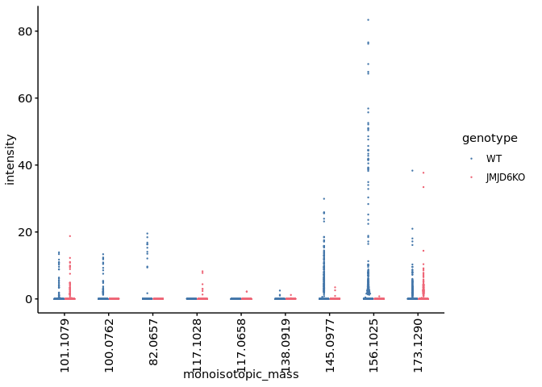
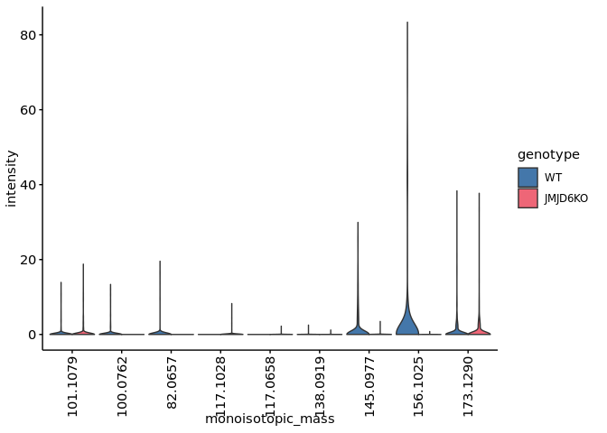
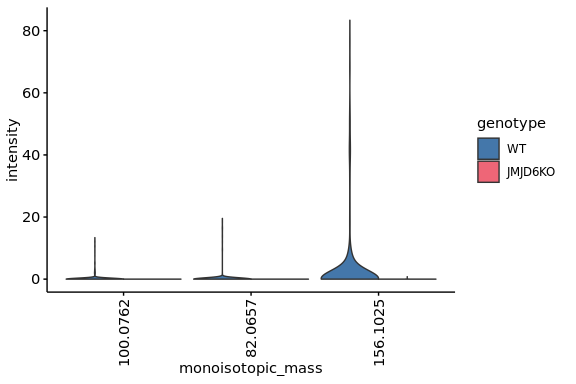
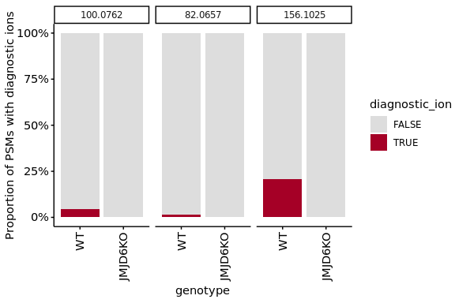

2-3. Identify diagnostic ions that can mark lysine hydroxylations
================
Yoichiro Sugimoto
07 March, 2025

- [Environment setup](#environment-setup)
- [Import basic data](#import-basic-data)
- [Identify useful diagnostic ions to identify lysine
  hydroxylations](#identify-useful-diagnostic-ions-to-identify-lysine-hydroxylations)
- [Session information](#session-information)

This script identify diagnosic ions to identify confident hydroxylation
sites.

# Environment setup

``` r
# renv::init(
#           "/fast/AG_Sugimoto/home/users/yoichiro/projects/20241111_PTMs_in_lysine_rich_domains/R"
#       )

project.dir <-
  file.path(
    "/fast/AG_Sugimoto/home/users/yoichiro/projects/20241111_PTMs_in_lysine_rich_domains"
  )

# renv::snapshot(file.path(project.dir, "R"))

renv::restore(file.path(project.dir, "R"))
```

    ## The following package(s) will be updated:
    ## 
    ## # https://bioconductor.org/packages/3.18/bioc --------------------------------
    ## - AnnotationDbi      [1.64.1 -> 1.64.1]
    ## - Biobase            [2.62.0 -> 2.62.0]
    ## - BiocGenerics       [0.48.1 -> 0.48.1]
    ## - BiocVersion        [3.18.1 -> 3.18.1]
    ## - Biostrings         [2.70.3 -> 2.70.3]
    ## - GenomeInfoDb       [1.38.8 -> 1.38.8]
    ## - IRanges            [2.36.0 -> 2.36.0]
    ## - KEGGREST           [1.42.0 -> 1.42.0]
    ## - S4Vectors          [0.40.2 -> 0.40.2]
    ## - XVector            [0.42.0 -> 0.42.0]
    ## - zlibbioc           [1.48.2 -> 1.48.2]
    ## 
    ## # https://bioconductor.org/packages/3.18/data/annotation ---------------------
    ## - GenomeInfoDbData   [1.2.11 -> 1.2.11]
    ## - org.Hs.eg.db       [3.18.0 -> 3.18.0]
    ## 
    ## # Installing packages --------------------------------------------------------
    ## - Installing BiocVersion ...                    OK [copied from cache]
    ## - Installing BiocGenerics ...                   OK [copied from cache]
    ## - Installing Biobase ...                        OK [copied from cache]
    ## - Installing S4Vectors ...                      OK [copied from cache]
    ## - Installing IRanges ...                        OK [copied from cache]
    ## - Installing zlibbioc ...                       OK [copied from cache]
    ## - Installing XVector ...                        OK [copied from cache]
    ## - Installing GenomeInfoDbData ...               OK [copied from cache]
    ## - Installing GenomeInfoDb ...                   OK [copied from cache]
    ## - Installing Biostrings ...                     OK [copied from cache]
    ## - Installing KEGGREST ...                       OK [copied from cache]
    ## - Installing AnnotationDbi ...                  OK [copied from cache]
    ## - Installing org.Hs.eg.db ...                   OK [copied from cache in 0.4s]

``` r
temp <-
  sapply(list.files(
    file.path(project.dir, "R/functions"),
    pattern = "*.R",
    full.names = TRUE
  ),
  source)
```

    ## 
    ## Attaching package: 'dplyr'

    ## The following objects are masked from 'package:stats':
    ## 
    ##     filter, lag

    ## The following objects are masked from 'package:base':
    ## 
    ##     intersect, setdiff, setequal, union

    ## 
    ## Attaching package: 'data.table'

    ## The following objects are masked from 'package:dplyr':
    ## 
    ##     between, first, last

    ## Loading required package: BiocGenerics

    ## 
    ## Attaching package: 'BiocGenerics'

    ## The following objects are masked from 'package:dplyr':
    ## 
    ##     combine, intersect, setdiff, union

    ## The following objects are masked from 'package:stats':
    ## 
    ##     IQR, mad, sd, var, xtabs

    ## The following objects are masked from 'package:base':
    ## 
    ##     anyDuplicated, aperm, append, as.data.frame, basename, cbind,
    ##     colnames, dirname, do.call, duplicated, eval, evalq, Filter, Find,
    ##     get, grep, grepl, intersect, is.unsorted, lapply, Map, mapply,
    ##     match, mget, order, paste, pmax, pmax.int, pmin, pmin.int,
    ##     Position, rank, rbind, Reduce, rownames, sapply, setdiff, sort,
    ##     table, tapply, union, unique, unsplit, which.max, which.min

    ## Loading required package: S4Vectors

    ## Loading required package: stats4

    ## 
    ## Attaching package: 'S4Vectors'

    ## The following objects are masked from 'package:data.table':
    ## 
    ##     first, second

    ## The following objects are masked from 'package:dplyr':
    ## 
    ##     first, rename

    ## The following object is masked from 'package:utils':
    ## 
    ##     findMatches

    ## The following objects are masked from 'package:base':
    ## 
    ##     expand.grid, I, unname

    ## Loading required package: IRanges

    ## 
    ## Attaching package: 'IRanges'

    ## The following object is masked from 'package:data.table':
    ## 
    ##     shift

    ## The following objects are masked from 'package:dplyr':
    ## 
    ##     collapse, desc, slice

    ## Loading required package: XVector

    ## Loading required package: GenomeInfoDb

    ## 
    ## Attaching package: 'Biostrings'

    ## The following object is masked from 'package:base':
    ## 
    ##     strsplit

``` r
library("readxl")
library("janitor")
```

    ## 
    ## Attaching package: 'janitor'

    ## The following objects are masked from 'package:stats':
    ## 
    ##     chisq.test, fisher.test

``` r
library("ptm.stoichiometry")

p2.res.dir <- file.path(project.dir,
                        "results",
                        "p2-analysis-setting")
```

# Import basic data

``` r
data.dir <- file.path(project.dir, "data")

diagnostic_ion_data <- file.path(
  data.dir, "diagnostic_ion_search/fragpipe_dataset-A/dataset01.diagnosticIons.tsv" 
) %>% 
  fread %>%
  clean_names
```

    ## Warning in fread(.): Discarded single-line footer: <<COMPLETE>>

``` r
fragpipe_psm <- file.path(
  data.dir, "diagnostic_ion_search/fragpipe_dataset-A/psm.tsv"
) %>%
  fread %>%
  clean_names

pnas2022_data <- file.path(
  data.dir,
  "MQ_output/PNAS2022" 
)

dataA_sample_info <- fread(file.path(
  pnas2022_data, "sample_info/MS_dataset_overview_PXD031221_data-A.csv"
))

ref_protein_dt <- import_reference_fasta(
  file.path(
    "/fast/AG_Sugimoto/reference/uniprot/human",
    "UP000005640_9606.fasta"
  )
)
```

# Identify useful diagnostic ions to identify lysine hydroxylations

``` r
diagnostic_ion_data <- merge(
  fragpipe_psm[, .(spectrum, protein_id, gene, protein_start, protein_end)], 
  diagnostic_ion_data, 
  by = "spectrum"
)

diagnostic_ion_data[, `:=`(
  file_name = str_split_fixed(spectrum, "\\.", n = 2)[, 1]
)]

diagnostic_ion_data <- merge(
  dataA_sample_info,
  diagnostic_ion_data,
  by = "file_name"
)

brd4_hydroxylation_site_di <- diagnostic_ion_data[
  gene == "BRD4" & (555 >= protein_start & 535 <= protein_end)
]

m.brd4_hydroxylation_site_di <- melt(
  brd4_hydroxylation_site_di,
  measure.vars = grep("intensity$",colnames(brd4_hydroxylation_site_di), value = TRUE),
  value.name = "intensity"
)

m.brd4_hydroxylation_site_di[, `:=`(
  monoisotopic_mass = variable %>%
    str_replace_all("ox_", "") %>%
    str_replace_all("_intensity", "") %>%
    str_replace_all("_", ".") %>%
    factor(levels = c(
      "101.1079", #Lysine   K           immonium ion    C5 H13 N2 +
      "100.0762", #Hydroxylation (K)    K   O   15.9949 diagnostic ion  C5 H10 N O+
      "82.0657", #Hydroxylation (K) K   O   15.9949 diagnostic ion (water loss) C5 H8 N+
      "117.1028", #Hydroxylation (K)    K   O   15.9949 immonium ion    C5 H13 O N2 + calculated
      "117.0658", #Hydroxylation (K)    K   O   15.9949 immonium ion    C5 H13 O N2 + (from citation)
      "138.0919", #Hydroxylation-Propionylation (K) K   C3 H4 O2    72.02112937 diagnostic ion (water loss) C8 H12 N1 O+
      "145.0977", #Hydroxylation (K)    K   O   15.9949 (intact, water loss)    C6H13N2O2+
      "156.1025", #Hydroxylation-Propionylation (K) K   C3 H4 O2    72.02112937 diagnostic ion  C8 H14 N1 O2+
      "173.1290" #Hydroxylation-Propionylation (K)  K   C3 H4 O2    72.02112937 immonium ion    C8 H17 O2 N2 +
      )),
  diagnostic_ion = intensity > 0,
  genotype = factor(genotype, levels = c("WT", "JMJD6KO"))
)]


library("ggbeeswarm")
library("khroma")

ggplot(
  data = m.brd4_hydroxylation_site_di,
  aes(
    x = monoisotopic_mass,
    y = intensity,
    color = genotype
  )
) +
  geom_quasirandom(dodge.width=0.5, size = 0.2) +
  scale_x_discrete(guide = guide_axis(angle = 90)) +
  scale_color_bright()
```

<!-- -->

``` r
ggplot(
  data = m.brd4_hydroxylation_site_di,
  aes(
    x = monoisotopic_mass,
    y = intensity,
    fill = genotype
  )
) +
  geom_violin(scale='width') +
  scale_x_discrete(guide = guide_axis(angle = 90)) +
  scale_fill_bright()
```

<!-- -->

``` r
selected.ms <- c("100.0762", "82.0657", "156.1025")

psm.count.by.di <- m.brd4_hydroxylation_site_di[monoisotopic_mass %in% c(selected.ms)][, .N, by = list(
  monoisotopic_mass, genotype, diagnostic_ion
)]

for(mi.ms in selected.ms){
  print(mi.ms)
  
  psm.count.by.di[monoisotopic_mass == mi.ms] %>%
    dcast(genotype ~ diagnostic_ion, value.var = "N") %>%
    setnafill(cols = c("FALSE", "TRUE"), fill = 0)  %>%
    {as.matrix(.[, c("FALSE", "TRUE"), with = FALSE])} %>%
    fisher.test %>% print
}
```

    ## [1] "100.0762"
    ## 
    ##  Fisher's Exact Test for Count Data
    ## 
    ## data:  .
    ## p-value = 4.92e-09
    ## alternative hypothesis: true odds ratio is not equal to 1
    ## 95 percent confidence interval:
    ##  0.0000000 0.1460815
    ## sample estimates:
    ## odds ratio 
    ##          0 
    ## 
    ## [1] "82.0657"
    ## 
    ##  Fisher's Exact Test for Count Data
    ## 
    ## data:  .
    ## p-value = 0.001736
    ## alternative hypothesis: true odds ratio is not equal to 1
    ## 95 percent confidence interval:
    ##  0.0000000 0.4571276
    ## sample estimates:
    ## odds ratio 
    ##          0 
    ## 
    ## [1] "156.1025"
    ## 
    ##  Fisher's Exact Test for Count Data
    ## 
    ## data:  .
    ## p-value < 2.2e-16
    ## alternative hypothesis: true odds ratio is not equal to 1
    ## 95 percent confidence interval:
    ##  0.0001688554 0.0369678626
    ## sample estimates:
    ##  odds ratio 
    ## 0.006489756

``` r
ggplot(
  data = m.brd4_hydroxylation_site_di[monoisotopic_mass %in% c(selected.ms)],
  aes(
    x = monoisotopic_mass,
    y = intensity,
    fill = genotype
  )
) +
  geom_violin(scale='width') +
  scale_x_discrete(guide = guide_axis(angle = 90)) +
  scale_fill_bright()
```

<!-- -->

``` r
ggplot(
  data = m.brd4_hydroxylation_site_di[monoisotopic_mass %in% c(selected.ms)],
  aes(
    x = genotype,
    fill = diagnostic_ion
  )
) +
  geom_bar(position = "fill") +
  scale_x_discrete(guide = guide_axis(angle = 90)) +
  facet_grid(~ monoisotopic_mass) +
  scale_fill_manual(values = c("TRUE" = "#A50026", "FALSE" = "#DDDDDD")) +
  scale_y_continuous(labels = scales::percent_format(accuracy = 1)) +
  ylab("Proportion of PSMs with diagnostic ions")
```

<!-- -->

# Session information

``` r
sessioninfo::session_info()
```

    ## ─ Session info ───────────────────────────────────────────────────────────────
    ##  setting  value
    ##  version  R version 4.3.2 (2023-10-31)
    ##  os       Ubuntu 22.04.3 LTS
    ##  system   x86_64, linux-gnu
    ##  ui       X11
    ##  language (EN)
    ##  collate  C.UTF-8
    ##  ctype    C.UTF-8
    ##  tz       Europe/Berlin
    ##  date     2025-03-07
    ##  pandoc   3.1.1 @ /usr/lib/rstudio-server/bin/quarto/bin/tools/ (via rmarkdown)
    ## 
    ## ─ Packages ───────────────────────────────────────────────────────────────────
    ##  package           * version    date (UTC) lib source
    ##  beeswarm            0.4.0      2021-06-01 [1] CRAN (R 4.3.2)
    ##  BiocGenerics      * 0.48.1     2023-11-01 [1] Bioconductor
    ##  BiocManager         1.30.25    2024-08-28 [1] CRAN (R 4.3.2)
    ##  Biostrings        * 2.70.3     2024-03-13 [1] Bioconductor 3.18 (R 4.3.2)
    ##  bitops              1.0-9      2024-10-03 [1] CRAN (R 4.3.2)
    ##  cellranger          1.1.0      2016-07-27 [1] CRAN (R 4.3.2)
    ##  cli                 3.6.3      2024-06-21 [1] CRAN (R 4.3.2)
    ##  colorspace          2.1-1      2024-07-26 [1] CRAN (R 4.3.2)
    ##  crayon              1.5.3      2024-06-20 [1] CRAN (R 4.3.2)
    ##  data.table        * 1.15.4     2024-03-30 [1] CRAN (R 4.3.2)
    ##  digest              0.6.36     2024-06-23 [1] CRAN (R 4.3.2)
    ##  dplyr             * 1.1.4      2023-11-17 [1] CRAN (R 4.3.2)
    ##  evaluate            0.24.0     2024-06-10 [1] CRAN (R 4.3.2)
    ##  fansi               1.0.6      2023-12-08 [1] CRAN (R 4.3.2)
    ##  farver              2.1.2      2024-05-13 [1] CRAN (R 4.3.2)
    ##  fastmap             1.2.0      2024-05-15 [1] CRAN (R 4.3.2)
    ##  generics            0.1.3      2022-07-05 [1] CRAN (R 4.3.2)
    ##  GenomeInfoDb      * 1.38.8     2024-03-15 [1] Bioconductor 3.18 (R 4.3.2)
    ##  GenomeInfoDbData    1.2.11     2024-11-18 [1] Bioconductor
    ##  ggbeeswarm        * 0.7.2      2023-04-29 [1] CRAN (R 4.3.2)
    ##  ggplot2           * 3.5.1      2024-04-23 [1] CRAN (R 4.3.2)
    ##  glue                1.7.0      2024-01-09 [1] CRAN (R 4.3.2)
    ##  gtable              0.3.5      2024-04-22 [1] CRAN (R 4.3.2)
    ##  highr               0.11       2024-05-26 [1] CRAN (R 4.3.2)
    ##  htmltools           0.5.8.1    2024-04-04 [1] CRAN (R 4.3.2)
    ##  IRanges           * 2.36.0     2023-10-24 [1] Bioconductor
    ##  janitor           * 2.2.0      2023-02-02 [1] CRAN (R 4.3.2)
    ##  khroma            * 1.14.0     2024-08-26 [1] CRAN (R 4.3.2)
    ##  knitr             * 1.48       2024-07-07 [1] CRAN (R 4.3.2)
    ##  labeling            0.4.3      2023-08-29 [1] CRAN (R 4.3.2)
    ##  lifecycle           1.0.4      2023-11-07 [1] CRAN (R 4.3.2)
    ##  lubridate           1.9.3      2023-09-27 [1] CRAN (R 4.3.2)
    ##  magrittr          * 2.0.3      2022-03-30 [1] CRAN (R 4.3.2)
    ##  munsell             0.5.1      2024-04-01 [1] CRAN (R 4.3.2)
    ##  pillar              1.9.0      2023-03-22 [1] CRAN (R 4.3.2)
    ##  pkgconfig           2.0.3      2019-09-22 [1] CRAN (R 4.3.2)
    ##  ptm.stoichiometry * 0.0.0.9000 2025-03-03 [1] local
    ##  R6                  2.5.1      2021-08-19 [1] CRAN (R 4.3.2)
    ##  RCurl               1.98-1.16  2024-07-11 [1] CRAN (R 4.3.2)
    ##  readxl            * 1.4.3      2023-07-06 [1] CRAN (R 4.3.2)
    ##  renv                1.0.7      2024-04-11 [1] CRAN (R 4.3.2)
    ##  rlang               1.1.4      2024-06-04 [1] CRAN (R 4.3.2)
    ##  rmarkdown           2.27       2024-05-17 [1] CRAN (R 4.3.2)
    ##  rstudioapi          0.17.1     2024-10-22 [1] CRAN (R 4.3.2)
    ##  S4Vectors         * 0.40.2     2023-11-23 [1] Bioconductor 3.18 (R 4.3.2)
    ##  scales              1.3.0      2023-11-28 [1] CRAN (R 4.3.2)
    ##  sessioninfo         1.2.2      2021-12-06 [1] CRAN (R 4.3.2)
    ##  snakecase           0.11.1     2023-08-27 [1] CRAN (R 4.3.2)
    ##  stringi             1.8.4      2024-05-06 [1] CRAN (R 4.3.2)
    ##  stringr           * 1.5.1      2023-11-14 [1] CRAN (R 4.3.2)
    ##  tibble              3.2.1      2023-03-20 [1] CRAN (R 4.3.2)
    ##  tidyselect          1.2.1      2024-03-11 [1] CRAN (R 4.3.2)
    ##  timechange          0.3.0      2024-01-18 [1] CRAN (R 4.3.2)
    ##  utf8                1.2.4      2023-10-22 [1] CRAN (R 4.3.2)
    ##  vctrs               0.6.5      2023-12-01 [1] CRAN (R 4.3.2)
    ##  vipor               0.4.7      2023-12-18 [1] CRAN (R 4.3.2)
    ##  withr               3.0.1      2024-07-31 [1] CRAN (R 4.3.2)
    ##  xfun                0.46       2024-07-18 [1] CRAN (R 4.3.2)
    ##  XVector           * 0.42.0     2023-10-24 [1] Bioconductor
    ##  yaml                2.3.10     2024-07-26 [1] CRAN (R 4.3.2)
    ##  zlibbioc            1.48.2     2024-03-13 [1] Bioconductor 3.18 (R 4.3.2)
    ## 
    ##  [1] /home/ysugimo/R/x86_64-pc-linux-gnu-library/4.3
    ##  [2] /usr/local/lib/R/site-library
    ##  [3] /usr/lib/R/site-library
    ##  [4] /usr/lib/R/library
    ## 
    ## ──────────────────────────────────────────────────────────────────────────────
