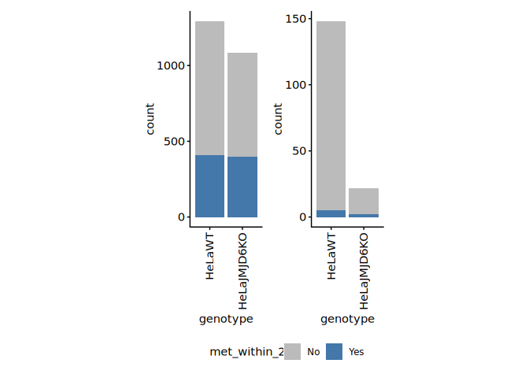
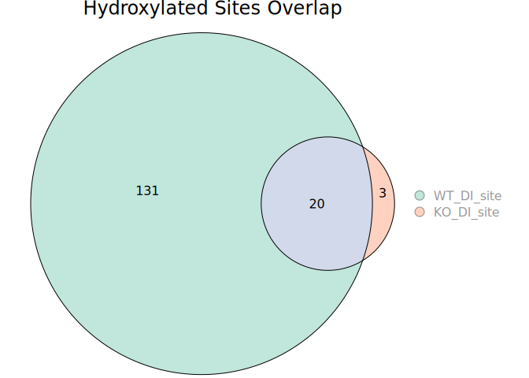

2-4. Analysis of lysine hydroxylations using diagnostic ions
================
Yoichiro Sugimoto and Pallavi Kesavan
29 March, 2026

- [Overview](#overview)
- [Environment setup](#environment-setup)
- [Import basic data](#import-basic-data)
- [Definition of functions](#definition-of-functions)
- [The effect of diagnostic ion on
  precision](#the-effect-of-diagnostic-ion-on-precision)
- [Overlaps of Hyl sites in WT and JMJD6 KO
  cells](#overlaps-of-hyl-sites-in-wt-and-jmjd6-ko-cells)
- [Comparison with previous PNAS 2022
  paper](#comparison-with-previous-pnas-2022-paper)
- [Session information](#session-information)

# Overview

This script examines how the use of diagnostic ions improve the analysis
of lysine hydroxylations.

# Environment setup

``` r
# renv::init(
#           "/fast/AG_Sugimoto/home/users/yoichiro/projects/20241111_PTMs_in_lysine_rich_domains/R"
#       )

# Define project directory - contains R scripts, data and results folders
project.dir <-
  file.path(
    "/fast/AG_Sugimoto/home/users/pallavi/projects/20241111_PTMs_in_lysine_rich_domains"
  )

# renv::snapshot(file.path(project.dir, "R"))

# renv::restore(file.path(project.dir, "R"))
```

``` r
# Load all R scripts from the 'functions' folder into the current session
P2_functions <-
  sapply(list.files(
    file.path(project.dir, "R/functions"),
    pattern = "*.R",
    full.names = TRUE
  ),
  source)
```

    ## 
    ## Attaching package: 'dplyr'

    ## The following objects are masked from 'package:stats':
    ## 
    ##     filter, lag

    ## The following objects are masked from 'package:base':
    ## 
    ##     intersect, setdiff, setequal, union

    ## 
    ## Attaching package: 'data.table'

    ## The following objects are masked from 'package:dplyr':
    ## 
    ##     between, first, last

    ## Loading required package: BiocGenerics

    ## 
    ## Attaching package: 'BiocGenerics'

    ## The following objects are masked from 'package:dplyr':
    ## 
    ##     combine, intersect, setdiff, union

    ## The following objects are masked from 'package:stats':
    ## 
    ##     IQR, mad, sd, var, xtabs

    ## The following objects are masked from 'package:base':
    ## 
    ##     anyDuplicated, aperm, append, as.data.frame, basename, cbind,
    ##     colnames, dirname, do.call, duplicated, eval, evalq, Filter, Find,
    ##     get, grep, grepl, intersect, is.unsorted, lapply, Map, mapply,
    ##     match, mget, order, paste, pmax, pmax.int, pmin, pmin.int,
    ##     Position, rank, rbind, Reduce, rownames, sapply, saveRDS, setdiff,
    ##     table, tapply, union, unique, unsplit, which.max, which.min

    ## Loading required package: S4Vectors

    ## Loading required package: stats4

    ## 
    ## Attaching package: 'S4Vectors'

    ## The following objects are masked from 'package:data.table':
    ## 
    ##     first, second

    ## The following objects are masked from 'package:dplyr':
    ## 
    ##     first, rename

    ## The following object is masked from 'package:utils':
    ## 
    ##     findMatches

    ## The following objects are masked from 'package:base':
    ## 
    ##     expand.grid, I, unname

    ## Loading required package: IRanges

    ## 
    ## Attaching package: 'IRanges'

    ## The following object is masked from 'package:data.table':
    ## 
    ##     shift

    ## The following objects are masked from 'package:dplyr':
    ## 
    ##     collapse, desc, slice

    ## Loading required package: XVector

    ## Loading required package: GenomeInfoDb

    ## 
    ## Attaching package: 'Biostrings'

    ## The following object is masked from 'package:base':
    ## 
    ##     strsplit

``` r
### Install private packages 
# Install ptm.stiochiometry package - package installed 16.12.2025
# install.packages("/fast/AG_Sugimoto/home/users/pallavi/projects/ptm.stoichiometry", repos = NULL, type = "source")


# Load Libraries - ptm.stiochiometry,readxl and janitor
library("readxl")
library("janitor")
```

    ## 
    ## Attaching package: 'janitor'

    ## The following objects are masked from 'package:stats':
    ## 
    ##     chisq.test, fisher.test

``` r
library("ptm.stoichiometry")
```

# Import basic data

``` r
# Define path to data directory
data.dir <- file.path(project.dir, "data")
results.dir <- file.path(project.dir, "results")

# Import human protein reference data from specified file path 
ref_protein_dt <- import_reference_fasta(
  file.path(
    "/fast/AG_Sugimoto/reference/uniprot/human",
    "UP000005640_9606.fasta"
  )
)

#----------------
# MQ_DI_noH2Oloss
#----------------

# Load sample run info data (MQ DI with no waterloss)
MQ_DI_noH2O_run_info <- read_excel(
  file.path(project.dir, "data/analysis_setting/PXD031221_sample_matrix.xlsx"),
  sheet = "MQ_with_DI_noH2O" 
) %>% data.table

# Add a new column 'sample_id' that assigns a unique sequential number to each 
#row (1:N), where N is the total number of rows in the data.table
MQ_DI_noH2O_run_info[, sample_id := 1:.N]
```

# Definition of functions

``` r
# Define function - 'read_stoic_data'
read_stoic_data <- function(prefix, pre_prefix, post_fix = "", dir_path){
  # Read csv file with defined file path,  
  dt <- fread(file.path(dir_path, paste0(pre_prefix, prefix, "PTM_stoichiometry", post_fix, ".csv"))) 
  dt[, condition := gsub("_$", "", prefix)] # Removes '_' at the end of the prefix and creates a new column called condition
  return(dt)
}
```

# The effect of diagnostic ion on precision

``` r
## Read stoichiometry data for MQ_DI (change from the older version: a potential diagnostic ions with water loss is no longer considered)
MQ_DI_noH20_stoic_dt <- lapply(
  MQ_DI_noH2O_run_info[, prefix],
  read_stoic_data,
  pre_prefix = "DI_noH2O_", 
  post_fix = "_DI",
  dir_path = file.path(results.dir, "p2-analysis-setting", "MQ_DI_noH2O")
) %>% rbindlist

# fwrite(MQ_DI_noH20_stoic_dt[ptm != ""], file = file.path(results.dir, "p2-analysis-setting", "all_hydroxylysine.csv"))

MQ_DI_noH20_stoic_dt <- MQ_DI_noH20_stoic_dt[aa == "K"]
MQ_DI_noH20_stoic_dt[, genotype := str_split_fixed(sample_name, "_", n = 3)[, 2] %>% factor(levels = c("HeLaWT", "HeLaJMJD6KO"))]

# Extract the sites with diagnostic ions
DI_sites <- MQ_DI_noH20_stoic_dt[diagnostic_peak == "+"][!duplicated(paste(protein_accession, aa_pos)), .(protein_accession, aa_pos)]

MQ_DI_noH20_stoic_dt[, DI_site :=
  paste(protein_accession, aa_pos) %in% DI_sites[, paste(protein_accession, aa_pos)] 
]

# Load protein feature data 
protein.feature.dt <- fread(file.path(data.dir, "PNAS2022/all_protein_feature_per_position.csv"))
protein.feature.dt <- protein.feature.dt[residue == "K"]
setnames(protein.feature.dt, old = c("uniprot_id", "position"), new = c("protein_accession", "aa_pos")) # change column names 

protein.feature.dt[, `:=`( #create a new column 'met_within_2'
  met_within_2 = case_when(
    nchar(Window) == 11 & grepl("M", substr(Window, start = 4, stop = 8)) ~ "Yes", # if M is in the middle, Yes
    nchar(Window) == 11 ~ "No", # if M is not in the sequence, then No 
    TRUE ~ "edge" # if M is in the sequence but not in the middle, then edge
  )
)]

# Merge data tables by protein_accession and aa_pos (MQ_DI)
wt_vs_KO_MQ_DI_noH20_stoic_dt <- copy(MQ_DI_noH20_stoic_dt)

wt_vs_KO_MQ_DI_noH20_stoic_dt <- merge(
  wt_vs_KO_MQ_DI_noH20_stoic_dt,
  protein.feature.dt,
  by = c("protein_accession", "aa_pos")
)

# Only analyse the sites with a coverage with 2 PSMs in both JMJD6 WT and KO data
wt_data_coverage <- wt_vs_KO_MQ_DI_noH20_stoic_dt[genotype == "HeLaWT"][
  , list(total_wt_sum_psm_mapped = sum(sum_psm_mapped)), by = list(protein_accession, aa_pos)]
KO_data_coverage <- wt_vs_KO_MQ_DI_noH20_stoic_dt[genotype == "HeLaJMJD6KO"][
  , list(total_ko_sum_psm_mapped = sum(sum_psm_mapped)), by = list(protein_accession, aa_pos)]

all_data_coverage <- merge(
  wt_data_coverage,
  KO_data_coverage,
  by = c("protein_accession", "aa_pos")
)

wt_vs_KO_MQ_DI_noH20_stoic_dt <- wt_vs_KO_MQ_DI_noH20_stoic_dt[
  paste(protein_accession, aa_pos) %in% 
    all_data_coverage[total_wt_sum_psm_mapped > 0 & total_ko_sum_psm_mapped > 0][, paste(protein_accession, aa_pos)]
]

# The # of sites analysed
wt_vs_KO_MQ_DI_noH20_stoic_dt[!duplicated(paste(genotype, protein_accession, aa_pos))][, .N, by = genotype]
```

    ##       genotype     N
    ##         <fctr> <int>
    ## 1:      HeLaWT 26074
    ## 2: HeLaJMJD6KO 26074

``` r
koh_wt_vs_KO_MQ_DI_noH20_stoic_dt <- wt_vs_KO_MQ_DI_noH20_stoic_dt[ptm == "[Oxidation (K)]"]
koh_wt_vs_KO_MQ_DI_noH20_stoic_dt <- koh_wt_vs_KO_MQ_DI_noH20_stoic_dt[order(-DI_site)][!duplicated(paste(genotype, protein_accession, aa_pos))]

g1 <- ggplot(
  data = koh_wt_vs_KO_MQ_DI_noH20_stoic_dt[met_within_2 != "edge"],
  aes(
    x = genotype,
    fill = met_within_2
  )
) +
  geom_bar() +  
  scale_fill_manual(values = c("Yes" = "#4477AA", "No" = "#BBBBBB")) +
  theme(aspect.ratio = 3) +
  scale_x_discrete(guide = guide_axis(angle = 90))

g2 <- ggplot(
  data = koh_wt_vs_KO_MQ_DI_noH20_stoic_dt[met_within_2 != "edge" & DI_site == TRUE],
  aes(
    x = genotype,
    fill = met_within_2
  )
) +
  geom_bar() +  
  scale_fill_manual(values = c("Yes" = "#4477AA", "No" = "#BBBBBB")) +
  theme(aspect.ratio = 3) +
  scale_x_discrete(guide = guide_axis(angle = 90))

library("patchwork")

g1 + g2 + plot_layout(guides = "collect") & theme(legend.position = "bottom") 
```

<!-- -->

# Overlaps of Hyl sites in WT and JMJD6 KO cells

``` r
koh_per_site <- dcast(
  koh_wt_vs_KO_MQ_DI_noH20_stoic_dt,
  protein_accession + aa_pos + DI_site + met_within_2 ~ genotype,
  fun.aggregate = length 
)

koh_per_site[, `:=`(Hyl_found_in = case_when(
  HeLaWT == 1 & HeLaJMJD6KO == 1 ~ "both",
  HeLaWT == 1 ~ "WT",
  HeLaJMJD6KO == 1 ~ "JMJD6KO",
  TRUE ~ "not_found"
) %>% factor(levels = c("WT", "JMJD6KO", "both", "not_found")))]

koh_per_site <- koh_per_site[met_within_2 != "edge"]

koh_per_site_count <- koh_per_site[, .N, by = list(Hyl_found_in, met_within_2, DI_site)]

g1 <- ggplot(koh_per_site_count, aes(x = Hyl_found_in, y = N, fill = met_within_2)) +
  geom_bar(stat = "identity") +  
  scale_fill_manual(values = c("Yes" = "#4477AA", "No" = "#BBBBBB")) +
  theme(aspect.ratio = 3) +
  scale_x_discrete(guide = guide_axis(angle = 90))

g2 <- ggplot(koh_per_site_count[DI_site == TRUE], aes(x = Hyl_found_in, y = N, fill = met_within_2)) +
  geom_bar(stat = "identity") +  
  scale_fill_manual(values = c("Yes" = "#4477AA", "No" = "#BBBBBB")) +
  theme(aspect.ratio = 3) +
  scale_x_discrete(guide = guide_axis(angle = 90))

g1 + g2 + plot_layout(guides = "collect") & theme(legend.position = "bottom")
```

<!-- -->

``` r
# Statistical significance of methionine enrichment
# All sites, found in both
all.K.m.count <- rbind(
  copy(protein.feature.dt[met_within_2 != "edge", .N, by = met_within_2])[, data_type := "all_K"],
  copy(koh_per_site_count[, list(N = sum(N)), by = met_within_2])[, data_type := "koh"]
) %>%
  dcast(
    met_within_2 ~ data_type,
    value.var = "N"
  )

fisher.test(all.K.m.count[, .(all_K, koh)], alternative = "two.sided")
```

    ## 
    ##  Fisher's Exact Test for Count Data
    ## 
    ## data:  all.K.m.count[, .(all_K, koh)]
    ## p-value < 2.2e-16
    ## alternative hypothesis: true odds ratio is not equal to 1
    ## 95 percent confidence interval:
    ##  4.577065 5.630746
    ## sample estimates:
    ## odds ratio 
    ##   5.079513

``` r
library("eulerr")
library("RColorBrewer")

vennlist <-  list(
  WT_DI_site = koh_wt_vs_KO_MQ_DI_noH20_stoic_dt[genotype == "HeLaWT" & DI_site == TRUE, paste(protein_accession, aa_pos)],
  KO_DI_site = koh_wt_vs_KO_MQ_DI_noH20_stoic_dt[genotype == "HeLaJMJD6KO" & DI_site == TRUE, paste(protein_accession, aa_pos)]
)

# Changing the circle size based on the number in the circle
venn_size_based <- euler(vennlist)

cols <- brewer.pal(3, "Set2")

# Plot the diagram
plot(venn_size_based,
     fills = list(fill = cols, alpha = 0.4),
     legend = list(side = "right"),
     quantities = TRUE,
     main = "Hydroxylated Sites Overlap")
```

<!-- -->

# Comparison with previous PNAS 2022 paper

``` r
# Define file path to load 'long_K_stiochiometry_data'  
pnas2022.stoic.dt <- fread(file.path(data.dir, "PNAS2022/long_K_stoichiometry_data.csv"))

#change the column names
setnames(pnas2022.stoic.dt, old = c("uniprot_id", "position", "residue"), new = c("protein_accession", "aa_pos", "aa")) 

# Create new column 'accession_position'
pnas2022.stoic.dt[, `:=`(
  accession_position = paste0(protein_accession, "_", aa_pos) # paste protein_accession and aa_pos together '_'
)]

# Check how many hydroxylation sites that were reported by PNAS2022 are identified by the new workflow
MQ_DI_noH20_stoic_dt[, `:=`( 
  curated_oxK_site = 
    paste0(protein_accession, "_", aa_pos) %in%
    pnas2022.stoic.dt[curated_oxK_site == TRUE, paste0(protein_accession, "_", aa_pos)] 
)]

MQ_DI_d.hydroxyK_dt <- MQ_DI_noH20_stoic_dt[ptm == "[Oxidation (K)]" & genotype == "HeLaWT"][order(genotype, DI_site)][!duplicated(paste(protein_accession, aa_pos))]

# Convert the data table into table and sum the number of diagnostic peak and curated oxK sites
hyl_precision <- MQ_DI_d.hydroxyK_dt[, table(DI_site, curated_oxK_site) %>% addmargins] %>% data.table
hyl_precision <- hyl_precision[DI_site %in% c("Sum", "TRUE") & curated_oxK_site != "Sum"]

hyl_precision
```

    ##    DI_site curated_oxK_site     N
    ##     <char>           <char> <num>
    ## 1:    TRUE            FALSE   157
    ## 2:     Sum            FALSE  1782
    ## 3:    TRUE             TRUE    78
    ## 4:     Sum             TRUE   120

``` r
ggplot(
  hyl_precision,
  aes(
    x = DI_site,
    y = N,
    fill = curated_oxK_site
  )
) +
  geom_bar(stat = "identity", position = "fill") +
  scale_y_continuous(labels = scales::percent_format(accuracy = 1)) +
  scale_fill_manual(values = c("TRUE" = "coral2", "FALSE" = "#BBBBBB")) +
  scale_x_discrete(guide = guide_axis(angle = 90)) +
  theme(aspect.ratio = 3.5)
```

<!-- -->

``` r
dcast(
  hyl_precision,
  DI_site ~ curated_oxK_site,
  value.var = "N"
) %>%
  {fisher.test(.[, c("FALSE", "TRUE"), with = FALSE], alternative = "two.sided")}
```

    ## 
    ##  Fisher's Exact Test for Count Data
    ## 
    ## data:  .[, c("FALSE", "TRUE"), with = FALSE]
    ## p-value < 2.2e-16
    ## alternative hypothesis: true odds ratio is not equal to 1
    ## 95 percent confidence interval:
    ##   5.224579 10.359296
    ## sample estimates:
    ## odds ratio 
    ##   7.365665

# Session information

``` r
sessioninfo::session_info()
```

    ## ─ Session info ───────────────────────────────────────────────────────────────
    ##  setting  value
    ##  version  R version 4.4.3 (2025-02-28)
    ##  os       Ubuntu 24.04.2 LTS
    ##  system   x86_64, linux-gnu
    ##  ui       X11
    ##  language (EN)
    ##  collate  C.UTF-8
    ##  ctype    C.UTF-8
    ##  tz       Europe/Berlin
    ##  date     2026-03-29
    ##  pandoc   3.2 @ /usr/lib/rstudio-server/bin/quarto/bin/tools/x86_64/ (via rmarkdown)
    ##  quarto   1.5.57 @ /usr/lib/rstudio-server/bin/quarto/bin/quarto
    ## 
    ## ─ Packages ───────────────────────────────────────────────────────────────────
    ##  package           * version    date (UTC) lib source
    ##  BiocGenerics      * 0.52.0     2024-10-29 [1] Bioconduc~
    ##  Biostrings        * 2.74.1     2024-12-16 [1] Bioconduc~
    ##  cellranger          1.1.0      2016-07-27 [1] CRAN (R 4.4.3)
    ##  cli                 3.6.5      2025-04-23 [1] CRAN (R 4.4.3)
    ##  crayon              1.5.3      2024-06-20 [1] CRAN (R 4.4.3)
    ##  data.table        * 1.17.8     2025-07-10 [1] CRAN (R 4.4.3)
    ##  digest              0.6.37     2024-08-19 [1] CRAN (R 4.4.3)
    ##  dplyr             * 1.1.4      2023-11-17 [1] CRAN (R 4.4.3)
    ##  eulerr            * 7.0.4      2025-09-24 [1] CRAN (R 4.4.3)
    ##  evaluate            1.0.5      2025-08-27 [1] CRAN (R 4.4.3)
    ##  farver              2.1.2      2024-05-13 [1] CRAN (R 4.4.3)
    ##  fastmap             1.2.0      2024-05-15 [1] CRAN (R 4.4.3)
    ##  generics            0.1.4      2025-05-09 [1] CRAN (R 4.4.3)
    ##  GenomeInfoDb      * 1.42.3     2025-01-27 [1] Bioconduc~
    ##  GenomeInfoDbData    1.2.13     2025-07-21 [1] Bioconductor
    ##  ggplot2           * 4.0.0      2025-09-11 [1] CRAN (R 4.4.3)
    ##  glue                1.8.0      2024-09-30 [1] CRAN (R 4.4.3)
    ##  gtable              0.3.6      2024-10-25 [1] CRAN (R 4.4.3)
    ##  htmltools           0.5.8.1    2024-04-04 [1] CRAN (R 4.4.3)
    ##  httr                1.4.7      2023-08-15 [1] CRAN (R 4.4.3)
    ##  IRanges           * 2.40.1     2024-12-05 [1] Bioconduc~
    ##  janitor           * 2.2.1      2024-12-22 [1] CRAN (R 4.4.3)
    ##  jsonlite            2.0.0      2025-03-27 [1] CRAN (R 4.4.3)
    ##  khroma            * 1.16.0     2025-02-25 [1] CRAN (R 4.4.3)
    ##  knitr             * 1.50       2025-03-16 [1] CRAN (R 4.4.3)
    ##  labeling            0.4.3      2023-08-29 [1] CRAN (R 4.4.3)
    ##  lifecycle           1.0.4      2023-11-07 [1] CRAN (R 4.4.3)
    ##  lubridate           1.9.4      2024-12-08 [1] CRAN (R 4.4.3)
    ##  magrittr          * 2.0.4      2025-09-12 [1] CRAN (R 4.4.3)
    ##  patchwork         * 1.3.2      2025-08-25 [1] CRAN (R 4.4.3)
    ##  pillar              1.11.1     2025-09-17 [1] CRAN (R 4.4.3)
    ##  pkgconfig           2.0.3      2019-09-22 [1] CRAN (R 4.4.3)
    ##  polyclip            1.10-7     2024-07-23 [1] CRAN (R 4.4.3)
    ##  polylabelr          0.3.0      2024-11-19 [1] CRAN (R 4.4.3)
    ##  ptm.stoichiometry * 0.0.0.9000 2025-12-13 [1] local
    ##  R6                  2.6.1      2025-02-15 [1] CRAN (R 4.4.3)
    ##  RColorBrewer      * 1.1-3      2022-04-03 [1] CRAN (R 4.4.3)
    ##  Rcpp                1.1.0      2025-07-02 [1] CRAN (R 4.4.3)
    ##  readxl            * 1.4.5      2025-03-07 [1] CRAN (R 4.4.3)
    ##  rlang               1.1.6      2025-04-11 [1] CRAN (R 4.4.3)
    ##  rmarkdown           2.29       2024-11-04 [1] CRAN (R 4.4.3)
    ##  rstudioapi          0.17.1     2024-10-22 [1] CRAN (R 4.4.3)
    ##  S4Vectors         * 0.44.0     2024-10-29 [1] Bioconduc~
    ##  S7                  0.2.0      2024-11-07 [1] CRAN (R 4.4.3)
    ##  scales              1.4.0      2025-04-24 [1] CRAN (R 4.4.3)
    ##  sessioninfo         1.2.3      2025-02-05 [1] CRAN (R 4.4.3)
    ##  snakecase           0.11.1     2023-08-27 [1] CRAN (R 4.4.3)
    ##  stringi             1.8.7      2025-03-27 [1] CRAN (R 4.4.3)
    ##  stringr           * 1.5.2      2025-09-08 [1] CRAN (R 4.4.3)
    ##  tibble              3.3.0      2025-06-08 [1] CRAN (R 4.4.3)
    ##  tidyselect          1.2.1      2024-03-11 [1] CRAN (R 4.4.3)
    ##  timechange          0.3.0      2024-01-18 [1] CRAN (R 4.4.3)
    ##  UCSC.utils          1.2.0      2024-10-29 [1] Bioconduc~
    ##  vctrs               0.6.5      2023-12-01 [1] CRAN (R 4.4.3)
    ##  withr               3.0.2      2024-10-28 [1] CRAN (R 4.4.3)
    ##  xfun                0.53       2025-08-19 [1] CRAN (R 4.4.3)
    ##  XVector           * 0.46.0     2024-10-29 [1] Bioconduc~
    ##  yaml                2.3.10     2024-07-26 [1] CRAN (R 4.4.3)
    ##  zlibbioc            1.52.0     2024-10-29 [1] Bioconduc~
    ## 
    ##  [1] /home/ysugimo/R/x86_64-pc-linux-gnu-library/4.4
    ##  [2] /usr/local/lib/R/site-library
    ##  [3] /usr/lib/R/site-library
    ##  [4] /usr/lib/R/library
    ##  * ── Packages attached to the search path.
    ## 
    ## ──────────────────────────────────────────────────────────────────────────────
