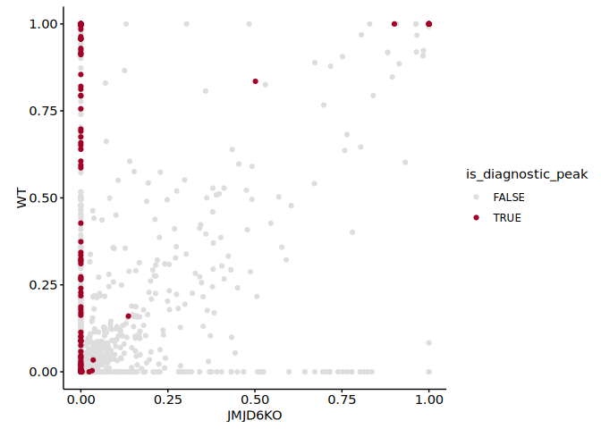
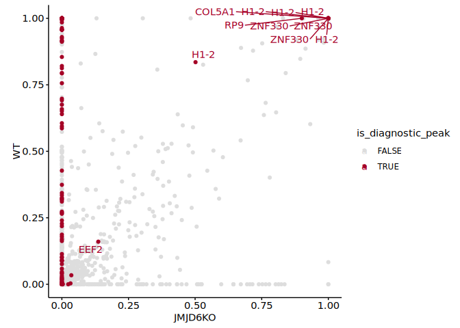
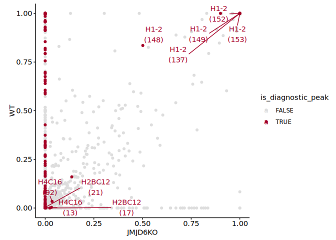
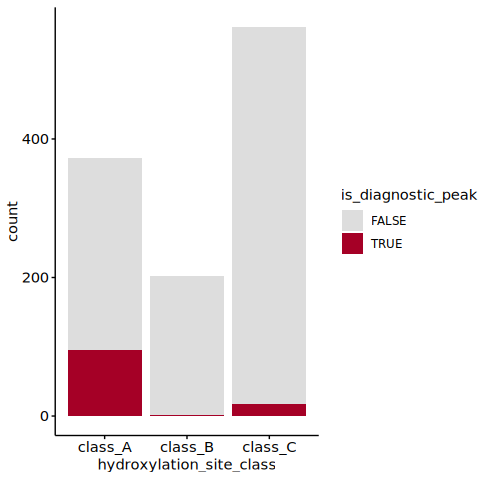
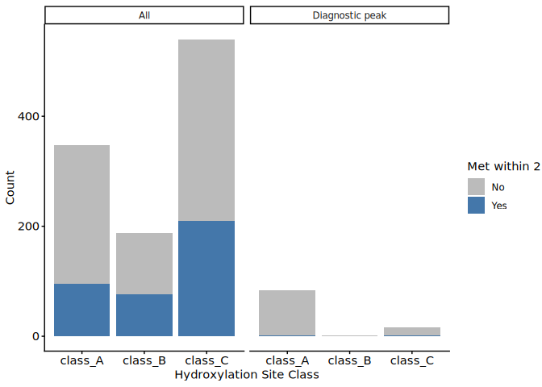
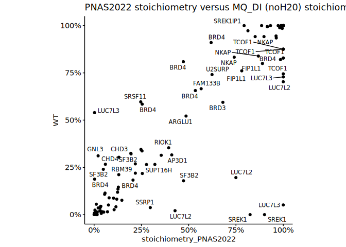
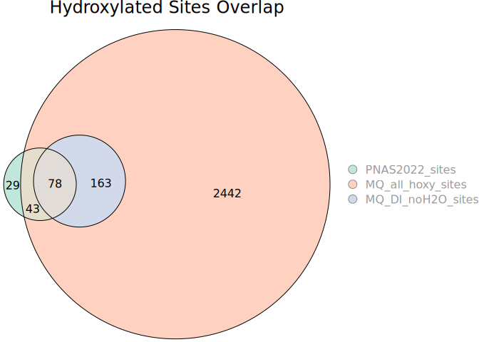
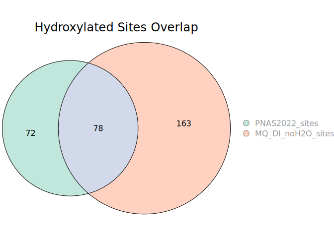
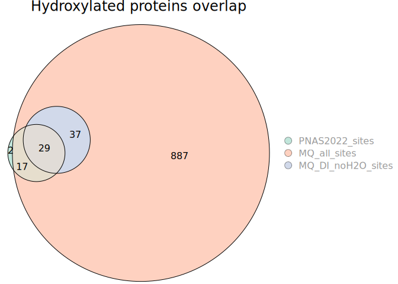
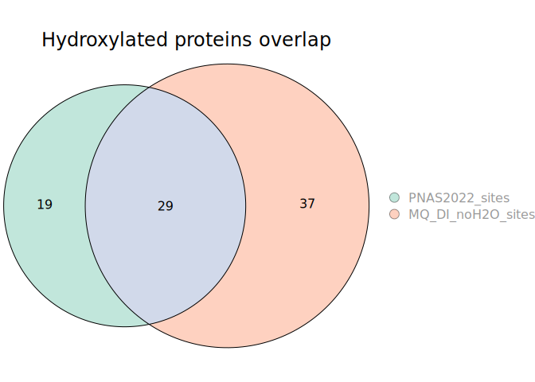

2-4. Analysis of lysine hydroxylations using diagnostic ions
================
Yoichiro Sugimoto and Pallavi Kesavan
08 January, 2026

- [Overview](#overview)
- [Environment setup](#environment-setup)
- [2.4.1 Import basic data](#241-import-basic-data)
- [2.4.2 Definition of functions](#242-definition-of-functions)
- [2.4.3 Analyse hydroxylation sites in the data of PNAS 2022
  paper](#243-analyse-hydroxylation-sites-in-the-data-of-pnas-2022-paper)
- [2.4.4 Analyse hydroxylation sites without DI
  data](#244-analyse-hydroxylation-sites-without-di-data)
- [2.4.5 Analyse hydroxylation sites with
  DI](#245-analyse-hydroxylation-sites-with-di)
- [2.4.6 Comparison of data without and with DI
  consideration](#246-comparison-of-data-without-and-with-di-consideration)
- [2.4.7 Comparison of hydroxylation site class (MQ_DI) vs methionine
  presence with diagnostic
  peak](#247-comparison-of-hydroxylation-site-class-mq_di-vs-methionine-presence-with-diagnostic-peak)
- [2.4.8 Comparison with previous PNAS 2022
  paper](#248-comparison-with-previous-pnas-2022-paper)
- [2.4.9 Number of hydroxylation sites and proteins identified in
  PNAS2022 and new
  workflow](#249-number-of-hydroxylation-sites-and-proteins-identified-in-pnas2022-and-new-workflow)
- [Session information](#session-information)

# Overview

This script examines how the use of diagnostic ions improve the analysis
of lysine hydroxylations.

# Environment setup

``` r
# renv::init(
#           "/fast/AG_Sugimoto/home/users/yoichiro/projects/20241111_PTMs_in_lysine_rich_domains/R"
#       )

# Define project directory - contains R scripts, data and results folders
project.dir <-
  file.path(
    "/fast/AG_Sugimoto/home/users/pallavi/projects/20241111_PTMs_in_lysine_rich_domains"
  )

# renv::snapshot(file.path(project.dir, "R"))

# renv::restore(file.path(project.dir, "R"))
```

``` r
# Load all R scripts from the 'functions' folder into the current session
P2_functions <-
  sapply(list.files(
    file.path(project.dir, "R/functions"),
    pattern = "*.R",
    full.names = TRUE
  ),
  source)
```

    ## 
    ## Attaching package: 'dplyr'

    ## The following objects are masked from 'package:stats':
    ## 
    ##     filter, lag

    ## The following objects are masked from 'package:base':
    ## 
    ##     intersect, setdiff, setequal, union

    ## 
    ## Attaching package: 'data.table'

    ## The following objects are masked from 'package:dplyr':
    ## 
    ##     between, first, last

    ## Loading required package: BiocGenerics

    ## 
    ## Attaching package: 'BiocGenerics'

    ## The following objects are masked from 'package:dplyr':
    ## 
    ##     combine, intersect, setdiff, union

    ## The following objects are masked from 'package:stats':
    ## 
    ##     IQR, mad, sd, var, xtabs

    ## The following objects are masked from 'package:base':
    ## 
    ##     anyDuplicated, aperm, append, as.data.frame, basename, cbind,
    ##     colnames, dirname, do.call, duplicated, eval, evalq, Filter, Find,
    ##     get, grep, grepl, intersect, is.unsorted, lapply, Map, mapply,
    ##     match, mget, order, paste, pmax, pmax.int, pmin, pmin.int,
    ##     Position, rank, rbind, Reduce, rownames, sapply, saveRDS, setdiff,
    ##     table, tapply, union, unique, unsplit, which.max, which.min

    ## Loading required package: S4Vectors

    ## Loading required package: stats4

    ## 
    ## Attaching package: 'S4Vectors'

    ## The following objects are masked from 'package:data.table':
    ## 
    ##     first, second

    ## The following objects are masked from 'package:dplyr':
    ## 
    ##     first, rename

    ## The following object is masked from 'package:utils':
    ## 
    ##     findMatches

    ## The following objects are masked from 'package:base':
    ## 
    ##     expand.grid, I, unname

    ## Loading required package: IRanges

    ## 
    ## Attaching package: 'IRanges'

    ## The following object is masked from 'package:data.table':
    ## 
    ##     shift

    ## The following objects are masked from 'package:dplyr':
    ## 
    ##     collapse, desc, slice

    ## Loading required package: XVector

    ## Loading required package: GenomeInfoDb

    ## 
    ## Attaching package: 'Biostrings'

    ## The following object is masked from 'package:base':
    ## 
    ##     strsplit

``` r
### Install private packages 
# Install ptm.stiochiometry package - package installed 16.12.2025
# install.packages("/fast/AG_Sugimoto/home/users/pallavi/projects/ptm.stoichiometry", repos = NULL, type = "source")


# Load Libraries - ptm.stiochiometry,readxl and janitor
library("readxl")
library("janitor")
```

    ## 
    ## Attaching package: 'janitor'

    ## The following objects are masked from 'package:stats':
    ## 
    ##     chisq.test, fisher.test

``` r
library("ptm.stoichiometry")
```

# 2.4.1 Import basic data

``` r
# Define path to data directory
data.dir <- file.path(project.dir, "data")
results.dir <- file.path(project.dir, "results")

## To be deleted
results.dir <- file.path("/fast/AG_Sugimoto/home/users/yoichiro/projects/20241111_PTMs_in_lysine_rich_domains", "results")

# Import human protein reference data from specified file path 
ref_protein_dt <- import_reference_fasta(
  file.path(
    "/fast/AG_Sugimoto/reference/uniprot/human",
    "UP000005640_9606.fasta"
  )
)

#------------
# MQ_Standard
#------------

# Load sample run info data (MQ Standard)
MQ_std_sample_run_info <- read_excel(
  file.path(project.dir, "data/analysis_setting/PXD031221_sample_matrix.xlsx"),
  sheet = "MQ_standard"
) %>% data.table

# Add a new column 'sample_id' that assigns a unique sequential number to each 
#row (1:N), where N is the total number of rows in the data.table
MQ_std_sample_run_info[, sample_id := 1:.N]

#----------------
# MQ_DI_noH2Oloss
#----------------

# Load sample run info data (MQ DI with no waterloss)
MQ_DI_noH2O_run_info <- read_excel(
  file.path(project.dir, "data/analysis_setting/PXD031221_sample_matrix.xlsx"),
  sheet = "MQ_with_DI_noH2O" 
) %>% data.table

# Add a new column 'sample_id' that assigns a unique sequential number to each 
#row (1:N), where N is the total number of rows in the data.table
MQ_DI_noH2O_run_info[, sample_id := 1:.N]
```

# 2.4.2 Definition of functions

``` r
# Define function - 'read_stoic_data'
read_stoic_data <- function(prefix, pre_prefix, post_fix = "", dir_path){
  # Read csv file with defined file path,  
  dt <- fread(file.path(dir_path, paste0(pre_prefix, prefix, "PTM_stoichiometry", post_fix, ".csv"))) 
  dt[, condition := gsub("_$", "", prefix)] # Removes '_' at the end of the prefix and creates a new column called condition
  return(dt)
}

## This function creates a data table with stoichiomtery values of WT and JMJD6KO samples for each gene_name
contrast_hydroxylation_by_genotype <- function(all_stoic_dt, min.psm = 2){
  wt_ko_dt <- all_stoic_dt
  
  # Add new columns into metadata
  wt_ko_dt[, `:=`(
    genotype = str_extract(sample_name, "(?<=HeLa)(WT|JMJD6KO)"), # new column - Genotype, extract WT or JMJD6KO from sample_name column
    pos_id = paste0(protein_accession, "_", aa_pos), 
    sample_pos_id = paste0(sample_name, "_", protein_accession, "_", aa_pos)
  )]
  
  # Identify position with at least one oxidation event
  oxidation_ids <- wt_ko_dt[
    grepl("[Oxidation (K)]", ptm, fixed = TRUE), # checks for oxidation event
    unique(pos_id) # Returns unique pos_id with oxidation event
  ]
  oxidation_sample_ids <- wt_ko_dt[
    grepl("[Oxidation (K)]", ptm, fixed = TRUE),
    unique(sample_pos_id)
  ]
  
  # Collect non hydroxylated K information for the sites with hydroxylation
  no_hydroxyK_dt <- copy(wt_ko_dt[aa == "K"])
  no_hydroxyK_dt <- no_hydroxyK_dt[pos_id %in% oxidation_ids] %>%
    {.[!sample_pos_id %in% oxidation_sample_ids]} # If hydroxylation data exist, this is not necessary
  
  # Set stoichiometry and PSM count to zero for these positions and update the PTM label
  no_hydroxyK_dt[, `:=`(
    sum_psm_mapped = 0,
    stoichiometry = 0,
    ptm = "[Oxidation (K)]"
  )]
  
  # Combine oxidation data from both original and the newly flagged unmodified K data
  hydroxyK_dt <- rbind(
    wt_ko_dt[grepl("[Oxidation (K)]", ptm, fixed = TRUE)],
    no_hydroxyK_dt
  )
  
  # Filter psm mapped greater than min.psm (def. 2) for higher confidence 
  hydroxyK_dt <- hydroxyK_dt[
    sum_psm_mapped_per_position > min.psm
  ]
  
  # Sort stoichiometry column from highest to lowest
  hydroxyK_dt <- hydroxyK_dt[order(stoichiometry, decreasing = TRUE)][
    !duplicated(paste0(protein_accession, gene_name, aa_pos, genotype)) # Remove duplicate rows
  ]
  
  # Reshape 'd.hydroxyK_dt' from long to wide based on stoichiometry values  
  d.hydroxyK_dt <- dcast(
    hydroxyK_dt,
    protein_accession + gene_name + aa_pos ~ genotype, # values in genotype become into separate columns (WT & JMJD6KO)
    value.var = "stoichiometry"
  )
  
  return(d.hydroxyK_dt)
}
```

# 2.4.3 Analyse hydroxylation sites in the data of PNAS 2022 paper

In Cockman et al. (PNAS, 2022), lysine hydroxylation sites were
identified by combining the following pieces of information: (1)
hydroxylysine identified through database search software (PEAKS); (2)
manual inspection of MSMS spectra; and (3) the absence of hydroxylation
in JMJD6 knockout cells. Here, we analysed the relationship between all
the hydroxylysines identified by the software and those that satisfied
conditions 2 and 3.

``` r
# Load PNAS stoichiometry data
pnas2022.stoic.dt <- fread(file.path(data.dir, "PNAS2022/long_K_stoichiometry_data.csv"))

# Replace old column names with new ones
setnames(
  pnas2022.stoic.dt, 
  old = c("uniprot_id", "position", "residue", "oxK_ratio", "data_source", "total_n_feature_oxK", "total_n_feature_K"), 
  new = c("protein_accession", "aa_pos", "aa", "stoichiometry", "sample_name", "sum_psm_mapped", "sum_psm_mapped_per_position")
)

# Merge the reference protein data with the PNAS stoichiometry data by protein accession ID
pnas2022.stoic.dt <- merge(
  ref_protein_dt[, .(protein_accession, gene_name)], # Take columns protein_accession and gene_name from the ref data 
  pnas2022.stoic.dt,
  by = "protein_accession" #combine both data.table by protein accession ID
)

## Add columns to pnas2022.stoic.dt metadata
# new columns: accession_position, ptm, sample_name 
pnas2022.stoic.dt[, `:=`(
  accession_position = paste0(protein_accession, "_", aa_pos), #this column combines data from protein_accession and aa_pos
  ptm = "[Oxidation (K)]", 
  sample_name = gsub("HeLa_", "HeLa", sample_name) %>% #replace sample names as mentioned (from "Hela_" to "HeLa")
    {gsub("HeLaJMJD6FLAG", "HeLaWT_JMJD6FLAG", .)} # Take response from previous line and change accordingly 
)]

# Create a data table with protein_accession, aa_pos, curated_oxK_site columns from metadata 
# order the curated oxK sites in descending order and remove duplicated rows from 
pnas2022_curated_hydroxylysine_dt <- pnas2022.stoic.dt[, .(protein_accession, aa_pos, curated_oxK_site)] %>%
  {.[order(curated_oxK_site, decreasing = TRUE)][!duplicated(paste(protein_accession, aa_pos))]}

# Subset curated_oxK_site and count number of TURE or FALSE oxK_sites
pnas2022_curated_hydroxylysine_dt[, table(curated_oxK_site)]
```

    ## curated_oxK_site
    ## FALSE  TRUE 
    ## 49480   153

``` r
# Hydroxylations sites identified in PNAS2022 - 153 sites
pnas2022.stoic.dt[
  curated_oxK_site == TRUE & aa == "K" & ptm == "[Oxidation (K)]"
][
  order(curated_oxK_site, decreasing = TRUE)
][
  !duplicated(paste(protein_accession, aa_pos))
][
  , .N
]
```

    ## [1] 153

``` r
# Contrast non hydroxylated and hydroxylated lysines
# Take only the HeLa samples with JQ1 or J6 peptide pull-down
d.pnas.hydroxyK_dt <- contrast_hydroxylation_by_genotype(
  pnas2022.stoic.dt[
    grepl("HeLa", sample_name) & (grepl("JQ1", sample_name) | grepl("J6pep", sample_name))
  ]
)

# Retain only samples with stoichiometry values of JMJD6 and WT greater than 0 
d.pnas.hydroxyK_dt <- d.pnas.hydroxyK_dt[JMJD6KO != 0 | WT != 0]

d.pnas.hydroxyK_dt <- merge(
  d.pnas.hydroxyK_dt,
  pnas2022_curated_hydroxylysine_dt,
  by = c("protein_accession", "aa_pos")
)

# Plot - Scatterplot of hydroxylation sites identified in the PNAS2022 paper
ggplot(
  data = d.pnas.hydroxyK_dt[order(curated_oxK_site)],
  aes(
    x = JMJD6KO,
    y = WT,
    color = curated_oxK_site
  )
) + geom_point() +
  theme(aspect.ratio = 1) +
  scale_color_manual(values = c("TRUE" = "red", "FALSE" = "black"))
```

    ## Warning: Removed 60 rows containing missing values or values outside the scale range
    ## (`geom_point()`).

<!-- -->

# 2.4.4 Analyse hydroxylation sites without DI data

``` r
## Read stoichiometry data for MQ_standard 
# Results taken from calculating stoichiometry  
MQ_std_stoic_dt <- lapply(
  MQ_std_sample_run_info[
    data != "data-D" & # do not consider data-D
      grepl("_trp_", prefix) & # fetch data prefix with 'trp'
      grepl("m7_v7_(def|mCC)", prefix) & # fetch data prefix with 'm7_v7_(def or mCC)'
      !is.na(prefix), prefix # filters rows with prefix values
  ],
  read_stoic_data,
  pre_prefix = "",
  dir_path = file.path(results.dir, "p2-analysis-setting", "MQ_Std_MSMS")
) %>% rbindlist

# Apply 'contrast_hydroxylation_by_genotype' function to create data table with stoichiometry data for WT and JMJD6KO per gene_name 
MQ_std_d.hydroxyK_dt <- contrast_hydroxylation_by_genotype(MQ_std_stoic_dt)

# Plot - Scatter plot of hydroxylation events in MQ_standard
ggplot(
  data = MQ_std_d.hydroxyK_dt,
  aes(
    x = JMJD6KO,
    y = WT
  )
) + geom_point() +
  theme(aspect.ratio = 1) 
```

    ## Warning: Removed 558 rows containing missing values or values outside the scale range
    ## (`geom_point()`).

<!-- -->

# 2.4.5 Analyse hydroxylation sites with DI

``` r
## Read stoichiometry data for MQ_DI (change from the older version: a potential diagnostic ions with water loss is no longer considered)
MQ_DI_noH20_stoic_dt <- lapply(
  MQ_DI_noH2O_run_info[, prefix],
  read_stoic_data,
  pre_prefix = "DI_noH2O_", 
  post_fix = "_DI",
  dir_path = file.path(results.dir, "p2-analysis-setting", "MQ_DI_noH2O")
) %>% rbindlist

fwrite(MQ_DI_noH20_stoic_dt[ptm != ""], file = file.path(results.dir, "p2-analysis-setting", "all_hydroxylysine.csv"))

# Generate data table with stoichiometry values for WT and JMJD6KO 
MQ_DI_d.hydroxyK_dt <- contrast_hydroxylation_by_genotype(MQ_DI_noH20_stoic_dt)

# Generate data table with WT and JMJD6KO with diagnostic peaks
DI_info <- MQ_DI_noH20_stoic_dt[
  , .(protein_accession, aa_pos, diagnostic_peak) # filter these columns and create a separate data table 
][
  order(protein_accession, aa_pos, -diagnostic_peak) # order the data based on the highest diagnostic peak 
][                                              
  !duplicated(paste(protein_accession, aa_pos)) # Keep only the first row for each unique protein and amino acid position,
  # removing duplicates while preserving the row with the highest diagnostic_peak (from previous sorting)
]

# merge the modified data table 'DI_info' with the metadata 'MQ_DI_d.hydroxyK_dt'
MQ_DI_d.hydroxyK_dt <- merge(MQ_DI_d.hydroxyK_dt, DI_info, by = c("protein_accession", "aa_pos"))

#Filter data table with presence of diagnostic_peak and WT stoichiometry values
MQ_DI_d.hydroxyK_dt[, `:=`(
  is_diagnostic_peak = diagnostic_peak == "+" 
)]

MQ_DI_d.hydroxyK_dt[diagnostic_peak == "+"][JMJD6KO < 0.0001 & WT > 0.001][, .N, by = gene_name][order(N)] # only includes data WT values
```

    ##     gene_name     N
    ##        <char> <int>
    ##  1:     U2AF2     1
    ##  2:      SUB1     1
    ##  3:      RPS7     1
    ##  4:     RPS25     1
    ##  5:    RPS27A     1
    ##  6:     SARNP     1
    ##  7:      GNL3     1
    ##  8:  SREK1IP1     2
    ##  9:     ZC3H4     2
    ## 10:   SUPT16H     2
    ## 11:    LUC7L3     3
    ## 12:      TOP1     3
    ## 13:     SSRP1     3
    ## 14:      BRD3     3
    ## 15:     RIOK1     3
    ## 16:     SRRM2     3
    ## 17:     SF3B2     5
    ## 18:     SREK1     5
    ## 19:   ARL6IP4     7
    ## 20:   ZCCHC17     7
    ## 21:      BRD2     9
    ## 22:    SRSF11     9
    ## 23:      BRD4    14
    ## 24:      NKAP    16
    ##     gene_name     N

``` r
# Plot - WT versus JMJD6KO with presence of diagnostic ions
ggplot(
  data = MQ_DI_d.hydroxyK_dt[order(is_diagnostic_peak)],
  aes(
    x = JMJD6KO,
    y = WT,
    color = is_diagnostic_peak
  )
) + geom_point() +
  theme(aspect.ratio = 1) +
  scale_color_manual(values = c("TRUE" = "#A50026", "FALSE" = "#DDDDDD"))
```

    ## Warning: Removed 497 rows containing missing values or values outside the scale range
    ## (`geom_point()`).

<!-- -->

``` r
# Plot - WT versus JMJD6KO with presence of diagnostic ions (label points that are JMJD6KO > 0.1 with diagnostic ion)
# This plot identifies lysine hydroxylations events in the absence of JMJD6
ggplot(
  data = MQ_DI_d.hydroxyK_dt[order(is_diagnostic_peak)],
  aes(
    x = JMJD6KO,
    y = WT,
    color = is_diagnostic_peak
  )
) + geom_point() +
  ggrepel::geom_text_repel(aes(label = ifelse(JMJD6KO > 0.1 & diagnostic_peak == "+", gene_name, NA)), max.overlaps = 50) +
  theme(aspect.ratio = 1) +
  scale_color_manual(values = c("TRUE" = "#A50026", "FALSE" = "#DDDDDD"))
```

    ## Warning: Removed 497 rows containing missing values or values outside the scale range
    ## (`geom_point()`).

    ## Warning: Removed 1856 rows containing missing values or values outside the scale range
    ## (`geom_text_repel()`).

<!-- -->

``` r
ggplot(
  data = MQ_DI_d.hydroxyK_dt[order(is_diagnostic_peak)],
  aes(
    x = JMJD6KO,
    y = WT,
    color = is_diagnostic_peak
  )
) + geom_point() +
  ggrepel::geom_text_repel(aes(label = ifelse(
    is_diagnostic_peak == TRUE &
    grepl("^H", gene_name), paste0(gene_name, "\n(", aa_pos, ")"), NA)), max.overlaps = 1000) +
  theme(aspect.ratio = 1) +
  scale_color_manual(values = c("TRUE" = "#A50026", "FALSE" = "#DDDDDD"))
```

    ## Warning: Removed 497 rows containing missing values or values outside the scale range
    ## (`geom_point()`).

    ## Warning: Removed 1858 rows containing missing values or values outside the scale range
    ## (`geom_text_repel()`).

<!-- -->

# 2.4.6 Comparison of data without and with DI consideration

``` r
# Categorize hydroxylation site based on JMJD6KO and WT stoichiometry values
MQ_DI_d.hydroxyK_dt[, `:=`(   # Create new column "hydroxylation_site_class"
  hydroxylation_site_class = case_when( 
    JMJD6KO < 0.00001 & WT > 0.01 ~ "class_A", # low in JMJD6KO and high in WT, then classify as class_A
    WT < 0.00001 & JMJD6KO > 0.01 ~ "class_B", # low in WT and high in JMJD6KO, then classify as class_B
    JMJD6KO > 0.00001 & WT > 0.00001 ~ "class_C", # present in JMJD6KO and WT, then classify as class_C
    TRUE ~ "others" # values that equal to 0 and missing values, classify as "others"
  )
)]

#Plot - Bar chart of hydroxylation site based on JMJD6KO and WT stoichiometry values
ggplot(
  MQ_DI_d.hydroxyK_dt[hydroxylation_site_class != "others"], # exclude "others" category 
  aes(
    x = hydroxylation_site_class,
    fill = is_diagnostic_peak
  )
) +
  geom_bar() +
  scale_fill_manual(values = c("TRUE" = "#A50026", "FALSE" = "#DDDDDD"))
```

<!-- -->

``` r
# Count the total hydroxylation site per class with diagnostic peak 
MQ_DI_d.hydroxyK_dt[, table(diagnostic_peak, hydroxylation_site_class) %>%
                      addmargins]
```

    ##                hydroxylation_site_class
    ## diagnostic_peak class_A class_B class_C others  Sum
    ##                     276     201     545    650 1672
    ##             +        96       1      17     81  195
    ##             Sum     372     202     562    731 1867

# 2.4.7 Comparison of hydroxylation site class (MQ_DI) vs methionine presence with diagnostic peak

``` r
# Load protein feature data 
protein.feature.dt <- fread(file.path(data.dir, "PNAS2022/all_protein_feature_per_position.csv"))
setnames(protein.feature.dt, old = c("uniprot_id", "position"), new = c("protein_accession", "aa_pos")) # change column names 

# Merge data tables by protein_accession and aa_pos (MQ_DI)
feature_MQ_DI_hydroxyK_dt <- merge(
  MQ_DI_d.hydroxyK_dt,
  protein.feature.dt,
  by = c("protein_accession", "aa_pos")
)

# Create column on the presence of M in the sequence (MQ_DI) 
feature_MQ_DI_hydroxyK_dt[, `:=`( #create a new column 'met_within_2'
  met_within_2 = case_when(
    nchar(Window) == 11 & grepl("M", substr(Window, start = 4, stop = 8)) ~ "Yes", # if M is in the middle, Yes
    nchar(Window) == 11 ~ "No", # if M is not in the sequence, then No 
    TRUE ~ "edge" # if M is in the sequence but not in the middle, then edge
  )
)]

# Filter feature data 
feature_data <- feature_MQ_DI_hydroxyK_dt[
  met_within_2 != "edge" & hydroxylation_site_class != "others" & CenterResidue == "K"
]

feature_data_plot <- rbind(
  feature_data[, .(hydroxylation_site_class, met_within_2, group = "All")],
  feature_data[is_diagnostic_peak == TRUE, .(hydroxylation_site_class, met_within_2, group = "Diagnostic peak")] 
)

# Plot - new 
ggplot(feature_data_plot, aes(x = hydroxylation_site_class, fill = met_within_2)) +
  geom_bar() +
  facet_wrap(~group) +  
  scale_fill_manual(values = c("Yes" = "#4477AA", "No" = "#BBBBBB")) +
  labs(
    x = "Hydroxylation Site Class",
    y = "Count",
    fill = "Met within 2"
  )
```

<!-- -->

# 2.4.8 Comparison with previous PNAS 2022 paper

``` r
# Define file path to load 'long_K_stiochiometry_data'  
pnas2022.stoic.dt <- fread(file.path(data.dir, "PNAS2022/long_K_stoichiometry_data.csv"))

#change the column names
setnames(pnas2022.stoic.dt, old = c("uniprot_id", "position", "residue"), new = c("protein_accession", "aa_pos", "aa")) 

# Create new column 'accession_position'
pnas2022.stoic.dt[, `:=`(
  accession_position = paste0(protein_accession, "_", aa_pos) # paste protein_accession and aa_pos together '_'
)]

# Check how many hydroxylation sites that were reported by PNAS2022 are identified by the new workflow
MQ_DI_d.hydroxyK_dt[, `:=`( 
  curated_oxK_site = 
    paste0(protein_accession, "_", aa_pos) %in%
    pnas2022.stoic.dt[curated_oxK_site == TRUE, paste0(protein_accession, "_", aa_pos)] 
)]

# Convert the data table into table and sum the number of diagnostic peak and curated oxK sites
MQ_DI_d.hydroxyK_dt[, table(is_diagnostic_peak, curated_oxK_site) %>% addmargins]
```

    ##                   curated_oxK_site
    ## is_diagnostic_peak FALSE TRUE  Sum
    ##              FALSE  1629   43 1672
    ##              TRUE    120   75  195
    ##              Sum    1749  118 1867

``` r
# Additionally, sum the number of hydroxylation site 
MQ_DI_d.hydroxyK_dt[, table(is_diagnostic_peak, hydroxylation_site_class, curated_oxK_site) %>% addmargins]
```

    ## , , curated_oxK_site = FALSE
    ## 
    ##                   hydroxylation_site_class
    ## is_diagnostic_peak class_A class_B class_C others  Sum
    ##              FALSE     246     200     544    639 1629
    ##              TRUE       47       1      17     55  120
    ##              Sum       293     201     561    694 1749
    ## 
    ## , , curated_oxK_site = TRUE
    ## 
    ##                   hydroxylation_site_class
    ## is_diagnostic_peak class_A class_B class_C others  Sum
    ##              FALSE      30       1       1     11   43
    ##              TRUE       49       0       0     26   75
    ##              Sum        79       1       1     37  118
    ## 
    ## , , curated_oxK_site = Sum
    ## 
    ##                   hydroxylation_site_class
    ## is_diagnostic_peak class_A class_B class_C others  Sum
    ##              FALSE     276     201     545    650 1672
    ##              TRUE       96       1      17     81  195
    ##              Sum       372     202     562    731 1867

``` r
## Data table containing WT and JMJD6KO samples isolated by J6 peptide
# Filter rows and columns to create a new data table 
j6_target_protein <- MQ_DI_d.hydroxyK_dt[
  hydroxylation_site_class == "class_A" & # keep only rows where hydroxylation_site_class is "class_A"
    is_diagnostic_peak == TRUE # keep only rows where is_diagnostic_peak is TRUE
][!duplicated(protein_accession)][, .(protein_accession, gene_name)] # remove duplicated protein_accession values (keep first occurrence), select and return columns 'protein_accession', 'gene_name'

# Create a new column 'known_target'
j6_target_protein[, `:=`( 
  # check if protein_accession in j6_target_protein exists in pnas2022.stoic.dt filtered data 
  known_target = protein_accession %in% pnas2022.stoic.dt[curated_oxK_site == TRUE, protein_accession] 
)] # filter rows where curated_oxK_site is TRUE, extract protein_accession column based on curated_oxK_site 

# Create table showing number of TRUE and FALSE values in known_target
j6_target_protein[, table(known_target)]
```

    ## known_target
    ## FALSE  TRUE 
    ##     4    18

``` r
# Return all rows where 'known_target' is FALSE
j6_target_protein[known_target == FALSE]
```

    ## Key: <protein_accession>
    ##    protein_accession gene_name known_target
    ##               <char>    <char>       <lgcl>
    ## 1:            P53999      SUB1        FALSE
    ## 2:            P62979    RPS27A        FALSE
    ## 3:            Q9NP64   ZCCHC17        FALSE
    ## 4:            Q9UPT8     ZC3H4        FALSE

``` r
## Correlation between pnas2022 stoic and new stoic data  
non.duplicated.pnas2022.stoic.dt <- pnas2022.stoic.dt[
  grepl("HeLa", data_source) & # extract sample rows using HeLa cell line 
    # (data_source %in% c("HeLa_WT_JQ1", "HeLa_WT_J6pep")) &
    (curated_oxK_site == TRUE) & # keep only rows where curated_oxK_site is TRUE
    total_n_feature_K > 2 # filter rows where total_n_feature_K is greater than 2
][
  order(
    #data_source %in% c("HeLa_WT_JQ1", "HeLa_WT_J6pep"),
    curated_oxK_site == TRUE, # sort first by 'curated_oxK_site'
    oxK_ratio, # sort by oxK_ratio
    decreasing = TRUE # arrange oxK_ratio in descending order (from largest to smallest)
  )][
    !duplicated(accession_position) # remove duplicated accession_position, (keep first occurrence value only)
  ]

# Create a new column 'stoichiometry_PNAS2022' and assign it the values of 'oxK_ratio'
non.duplicated.pnas2022.stoic.dt[, stoichiometry_PNAS2022 := oxK_ratio]

# Merge MQ_DI stoic and pnas2022 by 'protein_accession' and 'aa_pos'
d.pnas2022.hydroxyK_DI_dt <- merge(
  MQ_DI_d.hydroxyK_dt,
  non.duplicated.pnas2022.stoic.dt[, .(protein_accession, aa_pos, stoichiometry_PNAS2022)],
  by = c("protein_accession", "aa_pos")
)

# Plot - Scatterplot of PNAS2022 stoichiometry versus MQ_DI stoichiometry data 
ggplot(
  d.pnas2022.hydroxyK_DI_dt,
  aes(
    x = stoichiometry_PNAS2022,
    y = WT
  )
) +
  geom_point() +
  ggrepel::geom_text_repel(aes(label = gene_name), size = 3, force = 1, max.overlaps = 7)+
  theme(aspect.ratio = 1) +
  labs(title = "PNAS2022 stoichiometry versus MQ_DI (noH20) stoichiometry data ") +
  scale_x_continuous(labels = scales::percent_format(accuracy = 1)) +
  scale_y_continuous(labels = scales::percent_format(accuracy = 1))
```

    ## Warning: Removed 1 row containing missing values or values outside the scale range
    ## (`geom_point()`).

    ## Warning: Removed 1 row containing missing values or values outside the scale range
    ## (`geom_text_repel()`).

    ## Warning: ggrepel: 73 unlabeled data points (too many overlaps). Consider
    ## increasing max.overlaps

<!-- -->

``` r
# Correlation test between pnas2022 stoic and new stoic data 
d.pnas2022.hydroxyK_DI_dt %$%
  cor.test(
    stoichiometry_PNAS2022, WT
  )
```

    ## 
    ##  Pearson's product-moment correlation
    ## 
    ## data:  stoichiometry_PNAS2022 and WT
    ## t = 24.22, df = 111, p-value < 2.2e-16
    ## alternative hypothesis: true correlation is not equal to 0
    ## 95 percent confidence interval:
    ##  0.8816087 0.9421326
    ## sample estimates:
    ##       cor 
    ## 0.9169969

``` r
# Merge MQ_stoic data and PNAS2022 by 'protein_accession' and 'aa_pos' 
pnas2022_MQStd_hydroxyK_dt <- merge(
  MQ_std_d.hydroxyK_dt,
  non.duplicated.pnas2022.stoic.dt[, .(protein_accession, aa_pos, stoichiometry_PNAS2022)],
  by = c("protein_accession", "aa_pos")
)

# Plot - Scatterplot of PNAS2022 stoichiometry versus MQ_Std stoichiometry data 
ggplot(
  pnas2022_MQStd_hydroxyK_dt,
  aes(
    x = stoichiometry_PNAS2022,
    y = WT
  )
) +
  geom_point() +
  ggrepel::geom_text_repel(aes(label = gene_name), size = 3, force = 1, max.overlaps = 7)+
  theme(aspect.ratio = 1) +
  labs(title = "PNAS2022 stoichiometry versus MQ_DI (noH20) stoichiometry data ") +
  scale_x_continuous(labels = scales::percent_format(accuracy = 1)) +
  scale_y_continuous(labels = scales::percent_format(accuracy = 1))
```

    ## Warning: Removed 1 row containing missing values or values outside the scale range
    ## (`geom_point()`).

    ## Warning: Removed 1 row containing missing values or values outside the scale range
    ## (`geom_text_repel()`).

    ## Warning: ggrepel: 73 unlabeled data points (too many overlaps). Consider
    ## increasing max.overlaps

<!-- -->

``` r
# Correlation test between PNAS2022 stoichiometry versus MQ_Std stoichiometry data 
pnas2022_MQStd_hydroxyK_dt %$%
  cor.test(
    stoichiometry_PNAS2022, WT
  )
```

    ## 
    ##  Pearson's product-moment correlation
    ## 
    ## data:  stoichiometry_PNAS2022 and WT
    ## t = 19.261, df = 112, p-value < 2.2e-16
    ## alternative hypothesis: true correlation is not equal to 0
    ## 95 percent confidence interval:
    ##  0.8255784 0.9131483
    ## sample estimates:
    ##       cor 
    ## 0.8764209

# 2.4.9 Number of hydroxylation sites and proteins identified in PNAS2022 and new workflow

``` r
#----------
## MQ_All
#----------

# MQ data including all lysine hydroxylation sites
MQ_all_hoxy_site_count <- MQ_DI_noH20_stoic_dt[aa == "K"][ptm == "[Oxidation (K)]"][order(protein_accession, aa_pos, -diagnostic_peak)][!duplicated(paste(protein_accession, aa_pos))]

# Add new column to data table 
MQ_all_hoxy_site_count[, `:=`(
  accession_position = paste0(protein_accession, "_", aa_pos)
)
]

# MQ data including all lysine hydroxylation proteins
MQ_all_hoxy_protein_count <- MQ_DI_noH20_stoic_dt[aa == "K"][ptm == "[Oxidation (K)]"][order(protein_accession, aa_pos, -diagnostic_peak)][!duplicated(paste(protein_accession, gene_name))]

#----------------
# MQ_DI_noH2Oloss
#----------------

# Count the total number of lysine hydroxylations in MQ_DI (aa_pos)
MQ_DI_noH20_stoic_dt[diagnostic_peak == "+"][aa == "K"][ptm == "[Oxidation (K)]"][order(protein_accession, aa_pos, -diagnostic_peak)][!duplicated(paste(protein_accession, aa_pos))][, .N]
```

    ## [1] 241

``` r
# create data table with hydroxylated sites 
MQ_DI_noH2O_site_count <- MQ_DI_noH20_stoic_dt[diagnostic_peak == "+"][aa == "K"][ptm == "[Oxidation (K)]"][order(protein_accession, aa_pos, -diagnostic_peak)][!duplicated(paste(protein_accession, aa_pos))]

# Add new column to data table 
MQ_DI_noH2O_site_count[, `:=`(
  accession_position = paste0(protein_accession, "_", aa_pos)
)
]

# Count the total number of lysine hydroxylations in MQ_DI (gene_name)
MQ_DI_noH20_stoic_dt[diagnostic_peak == "+"][aa == "K"][ptm == "[Oxidation (K)]"][order(protein_accession, aa_pos, -diagnostic_peak)][!duplicated(paste(protein_accession, gene_name))][, .N]
```

    ## [1] 66

``` r
# create data table with hydroxylated proteins
MQ_DI_noH2O_protein_count <- MQ_DI_noH20_stoic_dt[diagnostic_peak == "+"][aa == "K"][ptm == "[Oxidation (K)]"][order(protein_accession, aa_pos, -diagnostic_peak)][!duplicated(paste(protein_accession, gene_name))]


#-----------
## PNAS2022
#-----------

# Define file path to load 'long_K_stiochiometry_data'  
pnas2022.stoic.dt <- fread(file.path(data.dir, "PNAS2022/long_K_stoichiometry_data.csv"))

# Replace old column names with new ones
setnames(
  pnas2022.stoic.dt, 
  old = c("uniprot_id", "position", "residue", "oxK_ratio", "data_source", "total_n_feature_oxK", "total_n_feature_K"), 
  new = c("protein_accession", "aa_pos", "aa", "stoichiometry", "sample_name", "sum_psm_mapped", "sum_psm_mapped_per_position")
)

# Merge the reference protein data with the PNAS stoichiometry data by protein accession ID
pnas2022.stoic.dt <- merge(
  ref_protein_dt[, .(protein_accession, gene_name)], # Take columns protein_accession and gene_name from the ref data 
  pnas2022.stoic.dt,
  by = "protein_accession" #combine both data.table by protein accession ID
)

# Create new column 'accession_position'
pnas2022.stoic.dt[, `:=`(
  accession_position = paste0(protein_accession, "_", aa_pos) # paste protein_accession and aa_pos together '_'
)]

# Remove duplicated protein and aa_pos - FRG1 gene 
# Note: in the PNAS2022 paper, during protein assignment, 3 aa sequences were assigned to two different proteins by MaxQuant, which resulted 3 duplicated hydroxylated sites. In order to have a fair comparison, the 3 duplicated sites have been removed from PNAS2022 data. 

pnas2022.stoic.dt <- pnas2022.stoic.dt[
  protein_accession != "Q14331" &
    !(aa_pos %in% c(27, 29, 30))
]

# Create data table with hydroxylated sites only
# Note: this data set already contains the accession_protein column 
PNAS2022_site_count <- pnas2022.stoic.dt[
  curated_oxK_site == TRUE & aa == "K"
][
  order(curated_oxK_site, decreasing = TRUE)
][
  !duplicated(paste(protein_accession, aa_pos))
]

# Since different sub-isoforms were used
PNAS2022_site_count[, aa_pos := case_when(
  protein_accession == "Q66PJ3" ~ aa_pos - 184,
  TRUE ~ aa_pos
)]

PNAS2022_protein_count <- pnas2022.stoic.dt[
  curated_oxK_site == TRUE & aa == "K"
][
  order(curated_oxK_site, decreasing = TRUE)
][
  !duplicated(paste(protein_accession, gene_name))
]
```

``` r
# Plot - Venn Diagram of comparing hydroxylated sites between PNAS2022, MQ_all and MQ_DI_noH20loss

# Install package "ggVennDiagram"
# install.packages("ggVennDiagram")
# install.packages("eulerr")

# load libraries
# library(ggVennDiagram)
library(ggplot2)
library(eulerr)
library(RColorBrewer)

# Extract the accession position vectors 
vennlist <-  list(
  PNAS2022_sites = as.vector(PNAS2022_site_count[, accession_position]),
  MQ_all_hoxy_sites = as.vector(MQ_all_hoxy_site_count[, accession_position]),
  MQ_DI_noH2O_sites = as.vector(MQ_DI_noH2O_site_count[, accession_position])
)

# Changing the circle size based on the number in the circle
venn_size_based <- euler(vennlist)

cols <- brewer.pal(3, "Set2")

# Plot the diagram
plot(venn_size_based,
     fills = list(fill = cols, alpha = 0.4),
     legend = list(side = "right"),
     quantities = TRUE,
     main = "Hydroxylated Sites Overlap")
```

<!-- -->

``` r
vennlist <-  list(
  PNAS2022_sites = as.vector(PNAS2022_site_count[, accession_position]),
  MQ_DI_noH2O_sites = as.vector(MQ_DI_noH2O_site_count[, accession_position])
)

# Changing the circle size based on the number in the circle
venn_size_based <- euler(vennlist)

cols <- brewer.pal(2, "Set2")
```

    ## Warning in brewer.pal(2, "Set2"): minimal value for n is 3, returning requested palette with 3 different levels

``` r
# Plot the diagram
plot(venn_size_based,
     fills = list(fill = cols, alpha = 0.4),
     legend = list(side = "right"),
     quantities = TRUE,
     main = "Hydroxylated Sites Overlap")
```

<!-- -->

``` r
# Duplicated sites check PNAS 
# MQ_all_hoxy_site_count[protein_accession == "Q14331" & aa_pos %in% c(27, 29, 30)]
# MQ_all_hoxy_site_count[protein_accession == "Q9UQ35" & aa_pos %in% c(241, 243, 244)]
```

``` r
# Plot - Venn Diagram of comparing hydroxylated proteins between PNAS2022, MQ_all and MQ_DI_noH20loss

# Extract the gene name vectors 
vennlist <-  list(
  PNAS2022_sites = as.vector(PNAS2022_protein_count[, gene_name]),
    MQ_all_sites = as.vector(MQ_all_hoxy_protein_count[, gene_name]),
  MQ_DI_noH2O_sites = as.vector(MQ_DI_noH2O_protein_count[, gene_name])
)

# Changing the circle size based on the number in the circle
venn_size_based <- euler(vennlist)

cols <- brewer.pal(3, "Set2")

# Plot the diagram
plot(venn_size_based,
     fills = list(fill = cols, alpha = 0.4),
     legend = list(side = "right"),
     quantities = TRUE,
     main = "Hydroxylated proteins overlap")
```

<!-- -->

``` r
# Extract the gene name vectors 
vennlist <-  list(
  PNAS2022_sites = as.vector(PNAS2022_protein_count[, gene_name]),
  MQ_DI_noH2O_sites = as.vector(MQ_DI_noH2O_protein_count[, gene_name])
)

# Changing the circle size based on the number in the circle
venn_size_based <- euler(vennlist)

cols <- brewer.pal(2, "Set2")
```

    ## Warning in brewer.pal(2, "Set2"): minimal value for n is 3, returning requested palette with 3 different levels

``` r
# Plot the diagram
plot(venn_size_based,
     fills = list(fill = cols, alpha = 0.4),
     legend = list(side = "right"),
     quantities = TRUE,
     main = "Hydroxylated proteins overlap")
```

<!-- -->

# Session information

``` r
sessioninfo::session_info()
```

    ## ─ Session info ───────────────────────────────────────────────────────────────
    ##  setting  value
    ##  version  R version 4.4.3 (2025-02-28)
    ##  os       Ubuntu 24.04.2 LTS
    ##  system   x86_64, linux-gnu
    ##  ui       X11
    ##  language (EN)
    ##  collate  C.UTF-8
    ##  ctype    C.UTF-8
    ##  tz       Europe/Berlin
    ##  date     2026-01-08
    ##  pandoc   3.2 @ /usr/lib/rstudio-server/bin/quarto/bin/tools/x86_64/ (via rmarkdown)
    ##  quarto   1.5.57 @ /usr/lib/rstudio-server/bin/quarto/bin/quarto
    ## 
    ## ─ Packages ───────────────────────────────────────────────────────────────────
    ##  package           * version    date (UTC) lib source
    ##  BiocGenerics      * 0.52.0     2024-10-29 [1] Bioconduc~
    ##  Biostrings        * 2.74.1     2024-12-16 [1] Bioconduc~
    ##  cellranger          1.1.0      2016-07-27 [1] CRAN (R 4.4.3)
    ##  cli                 3.6.5      2025-04-23 [1] CRAN (R 4.4.3)
    ##  crayon              1.5.3      2024-06-20 [1] CRAN (R 4.4.3)
    ##  data.table        * 1.17.8     2025-07-10 [1] CRAN (R 4.4.3)
    ##  digest              0.6.37     2024-08-19 [1] CRAN (R 4.4.3)
    ##  dplyr             * 1.1.4      2023-11-17 [1] CRAN (R 4.4.3)
    ##  eulerr            * 7.0.4      2025-09-24 [1] CRAN (R 4.4.3)
    ##  evaluate            1.0.4      2025-06-18 [1] CRAN (R 4.4.3)
    ##  farver              2.1.2      2024-05-13 [1] CRAN (R 4.4.3)
    ##  fastmap             1.2.0      2024-05-15 [1] CRAN (R 4.4.3)
    ##  generics            0.1.4      2025-05-09 [1] CRAN (R 4.4.3)
    ##  GenomeInfoDb      * 1.42.3     2025-01-27 [1] Bioconduc~
    ##  GenomeInfoDbData    1.2.13     2025-07-21 [1] Bioconductor
    ##  ggplot2           * 3.5.2      2025-04-09 [1] CRAN (R 4.4.3)
    ##  ggrepel             0.9.6      2024-09-07 [1] CRAN (R 4.4.3)
    ##  glue                1.8.0      2024-09-30 [1] CRAN (R 4.4.3)
    ##  gtable              0.3.6      2024-10-25 [1] CRAN (R 4.4.3)
    ##  htmltools           0.5.8.1    2024-04-04 [1] CRAN (R 4.4.3)
    ##  httr                1.4.7      2023-08-15 [1] CRAN (R 4.4.3)
    ##  IRanges           * 2.40.1     2024-12-05 [1] Bioconduc~
    ##  janitor           * 2.2.1      2024-12-22 [1] CRAN (R 4.4.3)
    ##  jsonlite            2.0.0      2025-03-27 [1] CRAN (R 4.4.3)
    ##  khroma            * 1.16.0     2025-02-25 [1] CRAN (R 4.4.3)
    ##  knitr             * 1.50       2025-03-16 [1] CRAN (R 4.4.3)
    ##  labeling            0.4.3      2023-08-29 [1] CRAN (R 4.4.3)
    ##  lifecycle           1.0.4      2023-11-07 [1] CRAN (R 4.4.3)
    ##  lubridate           1.9.4      2024-12-08 [1] CRAN (R 4.4.3)
    ##  magrittr          * 2.0.3      2022-03-30 [1] CRAN (R 4.4.3)
    ##  pillar              1.11.0     2025-07-04 [1] CRAN (R 4.4.3)
    ##  pkgconfig           2.0.3      2019-09-22 [1] CRAN (R 4.4.3)
    ##  polyclip            1.10-7     2024-07-23 [1] CRAN (R 4.4.3)
    ##  polylabelr          0.3.0      2024-11-19 [1] CRAN (R 4.4.3)
    ##  ptm.stoichiometry * 0.0.0.9000 2025-12-13 [1] local
    ##  R6                  2.6.1      2025-02-15 [1] CRAN (R 4.4.3)
    ##  RColorBrewer      * 1.1-3      2022-04-03 [1] CRAN (R 4.4.3)
    ##  Rcpp                1.1.0      2025-07-02 [1] CRAN (R 4.4.3)
    ##  readxl            * 1.4.5      2025-03-07 [1] CRAN (R 4.4.3)
    ##  rlang               1.1.6      2025-04-11 [1] CRAN (R 4.4.3)
    ##  rmarkdown           2.29       2024-11-04 [1] CRAN (R 4.4.3)
    ##  rstudioapi          0.17.1     2024-10-22 [1] CRAN (R 4.4.3)
    ##  S4Vectors         * 0.44.0     2024-10-29 [1] Bioconduc~
    ##  scales              1.4.0      2025-04-24 [1] CRAN (R 4.4.3)
    ##  sessioninfo         1.2.3      2025-02-05 [1] CRAN (R 4.4.3)
    ##  snakecase           0.11.1     2023-08-27 [1] CRAN (R 4.4.3)
    ##  stringi             1.8.7      2025-03-27 [1] CRAN (R 4.4.3)
    ##  stringr           * 1.5.1      2023-11-14 [1] CRAN (R 4.4.3)
    ##  tibble              3.3.0      2025-06-08 [1] CRAN (R 4.4.3)
    ##  tidyselect          1.2.1      2024-03-11 [1] CRAN (R 4.4.3)
    ##  timechange          0.3.0      2024-01-18 [1] CRAN (R 4.4.3)
    ##  UCSC.utils          1.2.0      2024-10-29 [1] Bioconduc~
    ##  vctrs               0.6.5      2023-12-01 [1] CRAN (R 4.4.3)
    ##  withr               3.0.2      2024-10-28 [1] CRAN (R 4.4.3)
    ##  xfun                0.52       2025-04-02 [1] CRAN (R 4.4.3)
    ##  XVector           * 0.46.0     2024-10-29 [1] Bioconduc~
    ##  yaml                2.3.10     2024-07-26 [1] CRAN (R 4.4.3)
    ##  zlibbioc            1.52.0     2024-10-29 [1] Bioconduc~
    ## 
    ##  [1] /home/ysugimo/R/x86_64-pc-linux-gnu-library/4.4
    ##  [2] /usr/local/lib/R/site-library
    ##  [3] /usr/lib/R/site-library
    ##  [4] /usr/lib/R/library
    ##  * ── Packages attached to the search path.
    ## 
    ## ──────────────────────────────────────────────────────────────────────────────
