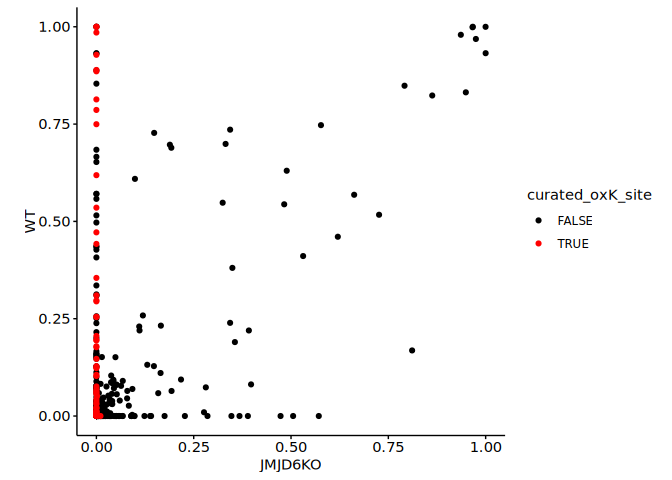
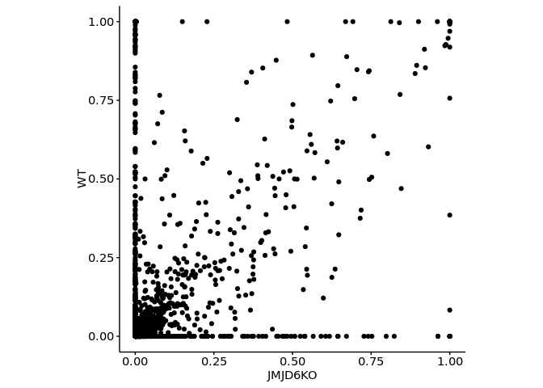
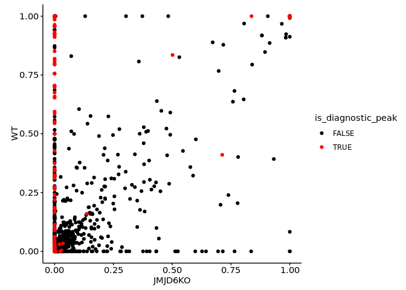
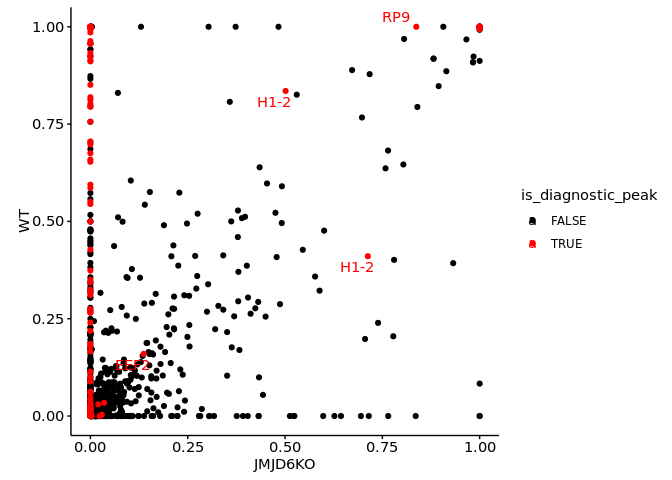
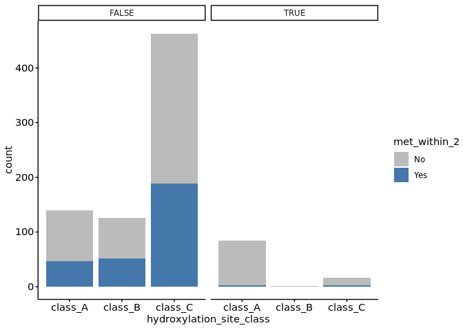

2-4. Analysis of lysine hydroxylations using diagnostic ions
================
Yoichiro Sugimoto
11 March, 2025

- [Environment setup](#environment-setup)
- [Import basic data](#import-basic-data)
- [Definition of functions](#definition-of-functions)
- [Analyse hydroxylation sites in the data of PNAS
  paper](#analyse-hydroxylation-sites-in-the-data-of-pnas-paper)
- [Analyse hydroxylation sites without DI
  data](#analyse-hydroxylation-sites-without-di-data)
- [Analyse hydroxylation sites with DI
  data](#analyse-hydroxylation-sites-with-di-data)
- [Comparison of data without and with DI
  consideration](#comparison-of-data-without-and-with-di-consideration)
- [Session information](#session-information)

This script examines how the use of diagnostic ions improve the analysis
of lysine hydroxylations.

# Environment setup

``` r
# renv::init(
#           "/fast/AG_Sugimoto/home/users/yoichiro/projects/20241111_PTMs_in_lysine_rich_domains/R"
#       )

project.dir <-
  file.path(
    "/fast/AG_Sugimoto/home/users/yoichiro/projects/20241111_PTMs_in_lysine_rich_domains"
  )

# renv::snapshot(file.path(project.dir, "R"))

renv::restore(file.path(project.dir, "R"))
```

    ## The following package(s) will be updated:
    ## 
    ## # https://bioconductor.org/packages/3.18/bioc --------------------------------
    ## - AnnotationDbi      [1.64.1 -> 1.64.1]
    ## - Biobase            [2.62.0 -> 2.62.0]
    ## - BiocGenerics       [0.48.1 -> 0.48.1]
    ## - BiocVersion        [3.18.1 -> 3.18.1]
    ## - Biostrings         [2.70.3 -> 2.70.3]
    ## - GenomeInfoDb       [1.38.8 -> 1.38.8]
    ## - IRanges            [2.36.0 -> 2.36.0]
    ## - KEGGREST           [1.42.0 -> 1.42.0]
    ## - S4Vectors          [0.40.2 -> 0.40.2]
    ## - XVector            [0.42.0 -> 0.42.0]
    ## - zlibbioc           [1.48.2 -> 1.48.2]
    ## 
    ## # https://bioconductor.org/packages/3.18/data/annotation ---------------------
    ## - GenomeInfoDbData   [1.2.11 -> 1.2.11]
    ## - org.Hs.eg.db       [3.18.0 -> 3.18.0]
    ## 
    ## # Installing packages --------------------------------------------------------
    ## - Installing BiocVersion ...                    OK [copied from cache]
    ## - Installing BiocGenerics ...                   OK [copied from cache]
    ## - Installing Biobase ...                        OK [copied from cache]
    ## - Installing S4Vectors ...                      OK [copied from cache]
    ## - Installing IRanges ...                        OK [copied from cache]
    ## - Installing zlibbioc ...                       OK [copied from cache]
    ## - Installing XVector ...                        OK [copied from cache]
    ## - Installing GenomeInfoDbData ...               OK [copied from cache]
    ## - Installing GenomeInfoDb ...                   OK [copied from cache]
    ## - Installing Biostrings ...                     OK [copied from cache]
    ## - Installing KEGGREST ...                       OK [copied from cache]
    ## - Installing AnnotationDbi ...                  OK [copied from cache]
    ## - Installing org.Hs.eg.db ...                   OK [copied from cache in 0.81s]

``` r
temp <-
  sapply(list.files(
    file.path(project.dir, "R/functions"),
    pattern = "*.R",
    full.names = TRUE
  ),
  source)
```

    ## 
    ## Attaching package: 'dplyr'

    ## The following objects are masked from 'package:stats':
    ## 
    ##     filter, lag

    ## The following objects are masked from 'package:base':
    ## 
    ##     intersect, setdiff, setequal, union

    ## 
    ## Attaching package: 'data.table'

    ## The following objects are masked from 'package:dplyr':
    ## 
    ##     between, first, last

    ## Loading required package: BiocGenerics

    ## 
    ## Attaching package: 'BiocGenerics'

    ## The following objects are masked from 'package:dplyr':
    ## 
    ##     combine, intersect, setdiff, union

    ## The following objects are masked from 'package:stats':
    ## 
    ##     IQR, mad, sd, var, xtabs

    ## The following objects are masked from 'package:base':
    ## 
    ##     anyDuplicated, aperm, append, as.data.frame, basename, cbind,
    ##     colnames, dirname, do.call, duplicated, eval, evalq, Filter, Find,
    ##     get, grep, grepl, intersect, is.unsorted, lapply, Map, mapply,
    ##     match, mget, order, paste, pmax, pmax.int, pmin, pmin.int,
    ##     Position, rank, rbind, Reduce, rownames, sapply, setdiff, sort,
    ##     table, tapply, union, unique, unsplit, which.max, which.min

    ## Loading required package: S4Vectors

    ## Loading required package: stats4

    ## 
    ## Attaching package: 'S4Vectors'

    ## The following objects are masked from 'package:data.table':
    ## 
    ##     first, second

    ## The following objects are masked from 'package:dplyr':
    ## 
    ##     first, rename

    ## The following object is masked from 'package:utils':
    ## 
    ##     findMatches

    ## The following objects are masked from 'package:base':
    ## 
    ##     expand.grid, I, unname

    ## Loading required package: IRanges

    ## 
    ## Attaching package: 'IRanges'

    ## The following object is masked from 'package:data.table':
    ## 
    ##     shift

    ## The following objects are masked from 'package:dplyr':
    ## 
    ##     collapse, desc, slice

    ## Loading required package: XVector

    ## Loading required package: GenomeInfoDb

    ## 
    ## Attaching package: 'Biostrings'

    ## The following object is masked from 'package:base':
    ## 
    ##     strsplit

``` r
library("readxl")
library("janitor")
```

    ## 
    ## Attaching package: 'janitor'

    ## The following objects are masked from 'package:stats':
    ## 
    ##     chisq.test, fisher.test

``` r
library("ptm.stoichiometry")

p2.res.dir <- file.path(project.dir,
                        "results",
                        "p2-analysis-setting")
```

# Import basic data

``` r
data.dir <- file.path(project.dir, "data")

ref_protein_dt <- import_reference_fasta(
  file.path(
    "/fast/AG_Sugimoto/reference/uniprot/human",
    "UP000005640_9606.fasta"
  )
)

pnas2022_data <- file.path(
  project.dir,
  "data/MQ_output/PNAS2022" 
)

all_sample_run_info <- read_excel(
  file.path(pnas2022_data, "PXD031221_sample_matrix.xlsx"),
  sheet = "run_setting"
) %>% data.table

all_sample_run_info[, sample_id := 1:.N]

pnas2022_DI_data <- file.path(
  project.dir,
  "data/MQ_DI_output/PNAS2022" 
)

di_sample_run_info <- read_excel(
  file.path(pnas2022_DI_data, "PXD031221_sample_matrix.xlsx"),
  sheet = "run_setting"
) %>% data.table

di_sample_run_info[, sample_id := 1:.N]
```

# Definition of functions

``` r
read_stoic_data <- function(prefix, pre_prefix, dir_path){
  dt <- fread(file.path(dir_path, paste0(pre_prefix, prefix, "PTM_stoichiometry.csv")))
  dt[, condition := gsub("_$", "", prefix)]
  return(dt)
}

contrast_hydroxylation_by_genotype <- function(all_stoic_dt){
  wt_ko_dt <- all_stoic_dt
  
  wt_ko_dt[, `:=`(
    genotype = str_extract(sample_name, "(?<=HeLa)(WT|JMJD6KO)"),
    pos_id = paste0(protein_accession, "_", aa_pos),
    sample_pos_id = paste0(sample_name, "_", protein_accession, "_", aa_pos)
  )]
  
  # Identify position with at least one oxidation event
  oxidation_ids <- wt_ko_dt[
    grepl("[Oxidation (K)]", ptm, fixed = TRUE),
    unique(pos_id)
  ]
  oxidation_sample_ids <- wt_ko_dt[
    grepl("[Oxidation (K)]", ptm, fixed = TRUE),
    unique(sample_pos_id)
  ]
  
  # Collect non hydroxylated K information for the sites with hydroxylation
  no_hydroxyK_dt <- copy(wt_ko_dt[aa == "K"])
  no_hydroxyK_dt <- no_hydroxyK_dt[pos_id %in% oxidation_ids] %>%
    {.[!sample_pos_id %in% oxidation_sample_ids]} # If hydroxylation data exist, this is not necessay
  
  ## Set stoichiometry and PSM count to zero for these positions and update the PTM label
  no_hydroxyK_dt[, `:=`(
    sum_psm_mapped = 0,
    stoichiometry = 0,
    ptm = "[Oxidation (K)]"
  )]
  
  ## Combine oxidation data from both original and the newly flagged unmodified K data
  hydroxyK_dt <- rbind(
    wt_ko_dt[grepl("[Oxidation (K)]", ptm, fixed = TRUE)],
    no_hydroxyK_dt
  )
  
  hydroxyK_dt <- hydroxyK_dt[
    sum_psm_mapped_per_position > 2
  ]
  
  hydroxyK_dt <- hydroxyK_dt[order(stoichiometry, decreasing = TRUE)][
    !duplicated(paste0(protein_accession, gene_name, aa_pos, genotype))
  ]
  
  d.hydroxyK_dt <- dcast(
    hydroxyK_dt,
    protein_accession + gene_name + aa_pos ~ genotype,
    value.var = "stoichiometry"
  )
  
  return(d.hydroxyK_dt)
}
```

# Analyse hydroxylation sites in the data of PNAS paper

``` r
pnas2022.stoic.dt <- fread(file.path(data.dir, "PNAS2022/long_K_stoichiometry_data.csv"))
setnames(
  pnas2022.stoic.dt, 
  old = c("uniprot_id", "position", "residue", "oxK_ratio", "data_source", "total_n_feature_oxK", "total_n_feature_K"), 
  new = c("protein_accession", "aa_pos", "aa", "stoichiometry", "sample_name", "sum_psm_mapped", "sum_psm_mapped_per_position")
)

pnas2022.stoic.dt <- merge(
  ref_protein_dt[, .(protein_accession, gene_name)],
  pnas2022.stoic.dt,
  by = "protein_accession"
)

pnas2022.stoic.dt[, `:=`(
  accession_position = paste0(protein_accession, "_", aa_pos),
  ptm = "[Oxidation (K)]",
  sample_name = gsub("HeLa_", "HeLa", sample_name) %>%
    {gsub("HeLaJMJD6FLAG", "HeLaWT_JMJD6FLAG", .)}
)]

# PNAS paper reported 153 sites
pnas2022_curated_hydroxylysine_dt <- pnas2022.stoic.dt[, .(protein_accession, aa_pos, curated_oxK_site)] %>%
  {.[order(curated_oxK_site, decreasing = TRUE)][!duplicated(paste(protein_accession, aa_pos))]}

pnas2022_curated_hydroxylysine_dt[, table(curated_oxK_site)]
```

    ## curated_oxK_site
    ## FALSE  TRUE 
    ## 49480   153

``` r
# Contrast non hydroxylated and hydroxylated lysines
d.pnas.hydroxyK_dt <- contrast_hydroxylation_by_genotype(
  pnas2022.stoic.dt[
    grepl("HeLa", sample_name) & (grepl("JQ1", sample_name) | grepl("J6pep", sample_name))
  ]
)

d.pnas.hydroxyK_dt <- d.pnas.hydroxyK_dt[JMJD6KO != 0 | WT != 0]

d.pnas.hydroxyK_dt <- merge(
  d.pnas.hydroxyK_dt,
  pnas2022_curated_hydroxylysine_dt,
  by = c("protein_accession", "aa_pos")
)

ggplot(
  data = d.pnas.hydroxyK_dt[order(curated_oxK_site)],
  aes(
    x = JMJD6KO,
    y = WT,
    color = curated_oxK_site
  )
) + geom_point() +
  theme(aspect.ratio = 1) +
  scale_color_manual(values = c("TRUE" = "red", "FALSE" = "black"))
```

    ## Warning: Removed 60 rows containing missing values or values outside the scale range
    ## (`geom_point()`).

<!-- -->

# Analyse hydroxylation sites without DI data

``` r
all_stoic_dt <- lapply(
  all_sample_run_info[
    data != "data-D" & 
      grepl("_trp_", prefix) &
      !grepl("including_SECPEP", prefix) &
      grepl("m7_v7_(def|mCC)", prefix) & 
      !is.na(prefix), prefix
  ],
  read_stoic_data,
  pre_prefix = "",
  dir_path = p2.res.dir
) %>% rbindlist

d.hydroxyK_dt <- contrast_hydroxylation_by_genotype(all_stoic_dt)

ggplot(
  data = d.hydroxyK_dt,
  aes(
    x = JMJD6KO,
    y = WT
  )
) + geom_point() +
  theme(aspect.ratio = 1) 
```

    ## Warning: Removed 558 rows containing missing values or values outside the scale range
    ## (`geom_point()`).

<!-- -->

# Analyse hydroxylation sites with DI data

``` r
all_stoic_with_di_dt <- lapply(
  di_sample_run_info[, prefix],
  read_stoic_data,
  pre_prefix = "DI_",
  dir_path = p2.res.dir
) %>% rbindlist

read_di_data <- function(prefix, dir_path){
  dt <- fread(file.path(dir_path, paste0("DI_", prefix, "ptm_site.csv")))
  dt[, condition := gsub("_$", "", prefix)]
  return(dt)
}

all_ptm_dt <- lapply(
  di_sample_run_info[, prefix],
  read_di_data,
  dir_path = p2.res.dir
) %>% rbindlist

all_ptm_dt <- all_ptm_dt[order(
    diagnostic_peak == "+",
    score_for_localization,
    decreasing = TRUE
  )][!duplicated(paste(protein_accession, aa_pos, ptm))]


d.hydroxyK_DI_dt <- contrast_hydroxylation_by_genotype(all_stoic_with_di_dt)

d.hydroxyK_DI_dt <- merge(
  d.hydroxyK_DI_dt,
  all_ptm_dt,
  by = c("protein_accession", "aa_pos")
)

d.hydroxyK_DI_dt[, `:=`(
  is_diagnostic_peak = diagnostic_peak == "+"
)]

d.hydroxyK_DI_dt[diagnostic_peak == "+"]
```

    ## Key: <protein_accession, aa_pos>
    ##      protein_accession aa_pos gene_name JMJD6KO         WT localization_prob
    ##                 <char>  <int>    <char>   <num>      <num>             <num>
    ##   1:            A2RUB6     38    CCDC66      NA 0.50727207          0.709310
    ##   2:            A2RUB6     40    CCDC66      NA 0.83430402          0.774563
    ##   3:            A2RUB6     43    CCDC66      NA 0.06457039          0.388015
    ##   4:            O15042    980    U2SURP      NA 1.00000000          0.999999
    ##   5:            O15042    981    U2SURP      NA 0.74097810          0.999585
    ##  ---                                                                        
    ## 185:            Q9Y383    365    LUC7L2      NA 0.01519482          0.999685
    ## 186:            Q9Y383    368    LUC7L2      NA 0.02085478          0.999570
    ## 187:            Q9Y3S2      3    ZNF330       1 0.99414424          0.984878
    ## 188:            Q9Y3S2     10    ZNF330       1 1.00000000          0.999220
    ## 189:            Q9Y3S2     11    ZNF330       1 1.00000000          0.999220
    ##      score_for_localization best_localization_ms_ms_id
    ##                       <num>                      <int>
    ##   1:                 96.640                      48213
    ##   2:                 96.640                      48213
    ##   3:                 63.827                      48212
    ##   4:                101.280                       9106
    ##   5:                101.280                       9106
    ##  ---                                                  
    ## 185:                 87.667                       8310
    ## 186:                164.720                       8361
    ## 187:                115.180                     148715
    ## 188:                 96.113                     173752
    ## 189:                 96.113                     173752
    ##      best_localization_raw_file diagnostic_peak             ptm
    ##                          <char>          <char>          <char>
    ##   1:      20201203_GV2130_MC309               + [Oxidation (K)]
    ##   2:      20201203_GV2130_MC309               + [Oxidation (K)]
    ##   3:      20201203_GV2130_MC307               + [Oxidation (K)]
    ##   4:      20201203_GV2130_MC311               + [Oxidation (K)]
    ##   5:      20201203_GV2130_MC311               + [Oxidation (K)]
    ##  ---                                                           
    ## 185:      20201203_GV2130_MC317               + [Oxidation (K)]
    ## 186:      20201203_GV2130_MC309               + [Oxidation (K)]
    ## 187:      20201203_GV2132_MC364               + [Oxidation (K)]
    ## 188:      20201203_GV2132_MC341               + [Oxidation (K)]
    ## 189:      20201203_GV2132_MC341               + [Oxidation (K)]
    ##                  condition is_diagnostic_peak
    ##                     <char>             <lgcl>
    ##   1:  data-C_trp_m7_v7_mCC               TRUE
    ##   2:  data-C_trp_m7_v7_mCC               TRUE
    ##   3:  data-C_trp_m7_v7_mCC               TRUE
    ##   4:  data-C_trp_m7_v7_mCC               TRUE
    ##   5:  data-C_trp_m7_v7_mCC               TRUE
    ##  ---                                         
    ## 185:  data-C_trp_m7_v7_mCC               TRUE
    ## 186:  data-C_trp_m7_v7_mCC               TRUE
    ## 187: data-B1_trp_m7_v7_mCC               TRUE
    ## 188: data-B2_trp_m7_v7_mCC               TRUE
    ## 189: data-B2_trp_m7_v7_mCC               TRUE

``` r
d.hydroxyK_DI_dt[diagnostic_peak == "+"][JMJD6KO < 0.0001 & WT > 0.001][, .N, by = gene_name][order(N)]
```

    ##     gene_name     N
    ##        <char> <int>
    ##  1:     U2AF2     1
    ##  2:      SUB1     1
    ##  3:      RPS7     1
    ##  4:     RPS25     1
    ##  5:    RPS27A     1
    ##  6:     SARNP     1
    ##  7:      GNL3     1
    ##  8:  SREK1IP1     2
    ##  9:     RIOK1     2
    ## 10:      TOP1     3
    ## 11:     SSRP1     3
    ## 12:      BRD3     3
    ## 13:     SRRM2     3
    ## 14:    LUC7L3     4
    ## 15:     SF3B2     5
    ## 16:     SREK1     5
    ## 17:   ARL6IP4     7
    ## 18:   ZCCHC17     7
    ## 19:    SRSF11     9
    ## 20:      BRD2    11
    ## 21:      BRD4    12
    ## 22:      NKAP    16
    ##     gene_name     N

``` r
ggplot(
  data = d.hydroxyK_DI_dt[order(is_diagnostic_peak)],
  aes(
    x = JMJD6KO,
    y = WT,
    color = is_diagnostic_peak
  )
) + geom_point() +
  theme(aspect.ratio = 1) +
  scale_color_manual(values = c("TRUE" = "red", "FALSE" = "black"))
```

    ## Warning: Removed 335 rows containing missing values or values outside the scale range
    ## (`geom_point()`).

<!-- -->

``` r
ggplot(
  data = d.hydroxyK_DI_dt[order(is_diagnostic_peak)],
  aes(
    x = JMJD6KO,
    y = WT,
    color = is_diagnostic_peak
  )
) + geom_point() +
  ggrepel::geom_text_repel(aes(label = ifelse(JMJD6KO > 0.1 & diagnostic_peak == "+", gene_name, NA))) +
  theme(aspect.ratio = 1) +
  scale_color_manual(values = c("TRUE" = "red", "FALSE" = "black"))
```

    ## Warning: Removed 335 rows containing missing values or values outside the scale range
    ## (`geom_point()`).

    ## Warning: Removed 1299 rows containing missing values or values outside the scale range
    ## (`geom_text_repel()`).

    ## Warning: ggrepel: 7 unlabeled data points (too many overlaps). Consider
    ## increasing max.overlaps

<!-- -->

``` r
d.hydroxyK_DI_dt[JMJD6KO > 0.1 & diagnostic_peak == "+"]
```

    ## Key: <protein_accession, aa_pos>
    ##     protein_accession aa_pos gene_name   JMJD6KO        WT localization_prob
    ##                <char>  <int>    <char>     <num>     <num>             <num>
    ##  1:            P13639    159      EEF2 0.1366361 0.1596582          0.999364
    ##  2:            P16403    137      H1-2 1.0000000 1.0000000          0.906622
    ##  3:            P16403    148      H1-2 0.5015587 0.8350577          0.455378
    ##  4:            P16403    149      H1-2 1.0000000 1.0000000          0.491510
    ##  5:            P16403    152      H1-2 1.0000000 1.0000000          0.491510
    ##  6:            P16403    153      H1-2 0.7127951 0.4104401          0.491510
    ##  7:            P20908    535    COL5A1 1.0000000 1.0000000          1.000000
    ##  8:            Q8TA86    195       RP9 0.8372242 1.0000000          1.000000
    ##  9:            Q9Y3S2      3    ZNF330 1.0000000 0.9941442          0.984878
    ## 10:            Q9Y3S2     10    ZNF330 1.0000000 1.0000000          0.999220
    ## 11:            Q9Y3S2     11    ZNF330 1.0000000 1.0000000          0.999220
    ##     score_for_localization best_localization_ms_ms_id
    ##                      <num>                      <int>
    ##  1:                 81.017                      89527
    ##  2:                 65.395                     101875
    ##  3:                 65.395                     101883
    ##  4:                 68.440                     101887
    ##  5:                 68.440                     101887
    ##  6:                 68.440                     101887
    ##  7:                131.040                      34443
    ##  8:                 52.490                      27478
    ##  9:                115.180                     148715
    ## 10:                 96.113                     173752
    ## 11:                 96.113                     173752
    ##     best_localization_raw_file diagnostic_peak             ptm
    ##                         <char>          <char>          <char>
    ##  1:      20201203_GV2132_MC373               + [Oxidation (K)]
    ##  2:      20201203_GV2132_MC331               + [Oxidation (K)]
    ##  3:      20201203_GV2132_MC358               + [Oxidation (K)]
    ##  4:      20201203_GV2132_MC362               + [Oxidation (K)]
    ##  5:      20201203_GV2132_MC362               + [Oxidation (K)]
    ##  6:      20201203_GV2132_MC362               + [Oxidation (K)]
    ##  7:      20201119_GV2048_MC276               + [Oxidation (K)]
    ##  8:      20201203_GV2130_MC304               + [Oxidation (K)]
    ##  9:      20201203_GV2132_MC364               + [Oxidation (K)]
    ## 10:      20201203_GV2132_MC341               + [Oxidation (K)]
    ## 11:      20201203_GV2132_MC341               + [Oxidation (K)]
    ##                 condition is_diagnostic_peak
    ##                    <char>             <lgcl>
    ##  1: data-B2_trp_m7_v7_mCC               TRUE
    ##  2: data-B1_trp_m7_v7_mCC               TRUE
    ##  3: data-B1_trp_m7_v7_mCC               TRUE
    ##  4: data-B1_trp_m7_v7_mCC               TRUE
    ##  5: data-B1_trp_m7_v7_mCC               TRUE
    ##  6: data-B1_trp_m7_v7_mCC               TRUE
    ##  7:  data-A_trp_m7_v7_def               TRUE
    ##  8:  data-C_trp_m7_v7_mCC               TRUE
    ##  9: data-B1_trp_m7_v7_mCC               TRUE
    ## 10: data-B2_trp_m7_v7_mCC               TRUE
    ## 11: data-B2_trp_m7_v7_mCC               TRUE

# Comparison of data without and with DI consideration

``` r
d.hydroxyK_DI_dt[, `:=`(
  hydroxylation_site_class = case_when(
    JMJD6KO < 0.00001 & WT > 0.01 ~ "class_A",
    WT < 0.00001 & JMJD6KO > 0.01 ~ "class_B",
    JMJD6KO > 0.00001 & WT > 0.00001 ~ "class_C",
    TRUE ~ "others"
  )
)]

ggplot(
  d.hydroxyK_DI_dt[hydroxylation_site_class != "others"],
  aes(
    x = hydroxylation_site_class,
    fill = is_diagnostic_peak
  )
) +
  geom_bar() +
  scale_fill_manual(values = c("TRUE" = "#A50026", "FALSE" = "#DDDDDD"))
```

<!-- -->

``` r
d.hydroxyK_DI_dt[, table(diagnostic_peak, hydroxylation_site_class) %>%
                   addmargins]
```

    ##                hydroxylation_site_class
    ## diagnostic_peak class_A class_B class_C others  Sum
    ##                     146     130     474    371 1121
    ##             +        91       1      18     79  189
    ##             Sum     237     131     492    450 1310

``` r
protein.feature.dt <- fread(file.path(data.dir, "PNAS2022/all_protein_feature_per_position.csv"))
setnames(protein.feature.dt, old = c("uniprot_id", "position"), new = c("protein_accession", "aa_pos"))

feature.d.hydroxyK_DI_dt <- merge(
  d.hydroxyK_DI_dt,
  protein.feature.dt,
  by = c("protein_accession", "aa_pos")
)
```

``` r
feature.d.hydroxyK_DI_dt[, `:=`(
  met_within_2 = case_when(
    nchar(Window) == 11 & grepl("M", substr(Window, start = 4, stop = 8)) ~ "Yes",
    nchar(Window) == 11 ~ "No",
    TRUE ~ "edge"
  )
)]

feature.d.hydroxyK_DI_dt[
  met_within_2 == "Yes" & is_diagnostic_peak == TRUE
]
```

    ## Key: <protein_accession, aa_pos>
    ##    protein_accession aa_pos gene_name    JMJD6KO          WT localization_prob
    ##               <char>  <int>    <char>      <num>       <num>             <num>
    ## 1:            P13639    159      EEF2 0.13663605 0.159658185          0.999364
    ## 2:            P19338    282       NCL 0.02947093 0.003397929          0.846533
    ## 3:            P60709    191      ACTB 0.02023117 0.030089207          1.000000
    ## 4:            Q9BRS2    535     RIOK1 0.00000000 0.027109815          0.695718
    ## 5:            Q9BRS2    539     RIOK1 0.00000000 0.062475201          0.997315
    ##    score_for_localization best_localization_ms_ms_id best_localization_raw_file
    ##                     <num>                      <int>                     <char>
    ## 1:                 81.017                      89527      20201203_GV2132_MC373
    ## 2:                 66.351                      94906      20201203_GV2132_MC361
    ## 3:                101.390                      19020      20201119_GV2048_MC278
    ## 4:                 78.934                      27757      20201203_GV2130_MC316
    ## 5:                 78.934                      27757      20201203_GV2130_MC316
    ##    diagnostic_peak             ptm             condition is_diagnostic_peak
    ##             <char>          <char>                <char>             <lgcl>
    ## 1:               + [Oxidation (K)] data-B2_trp_m7_v7_mCC               TRUE
    ## 2:               + [Oxidation (K)] data-B1_trp_m7_v7_mCC               TRUE
    ## 3:               + [Oxidation (K)]  data-A_trp_m7_v7_def               TRUE
    ## 4:               + [Oxidation (K)]  data-C_trp_m7_v7_mCC               TRUE
    ## 5:               + [Oxidation (K)]  data-C_trp_m7_v7_mCC               TRUE
    ##    hydroxylation_site_class          Accession residue IUPRED2 K_position
    ##                      <char>             <char>  <char>   <num>      <int>
    ## 1:                  class_C   P13639|EF2_HUMAN       K  0.1229          1
    ## 2:                  class_C  P19338|NUCL_HUMAN       K  0.8162          1
    ## 3:                  class_C  P60709|ACTB_HUMAN       K  0.1373          1
    ## 4:                  class_A Q9BRS2|RIOK1_HUMAN       K  0.7799          1
    ## 5:                  class_A Q9BRS2|RIOK1_HUMAN       K  0.7459          1
    ##    K_ratio K_ratio_score WindowHydropathy  windowCharge CenterResidue
    ##      <num>         <num>            <num>         <num>        <char>
    ## 1:     0.1           0.2        0.5393636  0.0901760160             K
    ## 2:     0.3           0.5        0.2435455  0.3606715422             K
    ## 3:     0.1           0.1        0.4585455 -0.0005117681             K
    ## 4:     0.3           0.5        0.2132727  0.2692648367             K
    ## 5:     0.3           0.5        0.2647273  0.2707946970             K
    ##         Window met_within_2
    ##         <char>       <char>
    ## 1: VLMMNKMDRAL          Yes
    ## 2: PGKRKKEMAKQ          Yes
    ## 3: TDYLMKILTER          Yes
    ## 4: DKKERKKMVKE          Yes
    ## 5: RKKMVKEAQRE          Yes

``` r
ggplot(
  feature.d.hydroxyK_DI_dt[
    met_within_2 != "edge" & hydroxylation_site_class != "others" & CenterResidue == "K"
  ],
  aes(
    x = hydroxylation_site_class,
    fill = met_within_2
  )
) +
  geom_bar() +
  facet_grid(~ is_diagnostic_peak) +
  scale_fill_manual(values = c("Yes" = "#4477AA", "No" = "#BBBBBB"))
```

<!-- -->

# Session information

``` r
sessioninfo::session_info()
```

    ## ─ Session info ───────────────────────────────────────────────────────────────
    ##  setting  value
    ##  version  R version 4.3.2 (2023-10-31)
    ##  os       Ubuntu 22.04.3 LTS
    ##  system   x86_64, linux-gnu
    ##  ui       X11
    ##  language (EN)
    ##  collate  C.UTF-8
    ##  ctype    C.UTF-8
    ##  tz       Europe/Berlin
    ##  date     2025-03-11
    ##  pandoc   3.1.1 @ /usr/lib/rstudio-server/bin/quarto/bin/tools/ (via rmarkdown)
    ## 
    ## ─ Packages ───────────────────────────────────────────────────────────────────
    ##  package           * version    date (UTC) lib source
    ##  BiocGenerics      * 0.48.1     2023-11-01 [1] Bioconductor
    ##  BiocManager         1.30.25    2024-08-28 [1] CRAN (R 4.3.2)
    ##  Biostrings        * 2.70.3     2024-03-13 [1] Bioconductor 3.18 (R 4.3.2)
    ##  bitops              1.0-9      2024-10-03 [1] CRAN (R 4.3.2)
    ##  cellranger          1.1.0      2016-07-27 [1] CRAN (R 4.3.2)
    ##  cli                 3.6.3      2024-06-21 [1] CRAN (R 4.3.2)
    ##  colorspace          2.1-1      2024-07-26 [1] CRAN (R 4.3.2)
    ##  crayon              1.5.3      2024-06-20 [1] CRAN (R 4.3.2)
    ##  data.table        * 1.15.4     2024-03-30 [1] CRAN (R 4.3.2)
    ##  digest              0.6.36     2024-06-23 [1] CRAN (R 4.3.2)
    ##  dplyr             * 1.1.4      2023-11-17 [1] CRAN (R 4.3.2)
    ##  evaluate            0.24.0     2024-06-10 [1] CRAN (R 4.3.2)
    ##  fansi               1.0.6      2023-12-08 [1] CRAN (R 4.3.2)
    ##  farver              2.1.2      2024-05-13 [1] CRAN (R 4.3.2)
    ##  fastmap             1.2.0      2024-05-15 [1] CRAN (R 4.3.2)
    ##  generics            0.1.3      2022-07-05 [1] CRAN (R 4.3.2)
    ##  GenomeInfoDb      * 1.38.8     2024-03-15 [1] Bioconductor 3.18 (R 4.3.2)
    ##  GenomeInfoDbData    1.2.11     2024-11-18 [1] Bioconductor
    ##  ggplot2           * 3.5.1      2024-04-23 [1] CRAN (R 4.3.2)
    ##  ggrepel             0.9.6      2024-09-07 [1] CRAN (R 4.3.2)
    ##  glue                1.7.0      2024-01-09 [1] CRAN (R 4.3.2)
    ##  gtable              0.3.5      2024-04-22 [1] CRAN (R 4.3.2)
    ##  highr               0.11       2024-05-26 [1] CRAN (R 4.3.2)
    ##  htmltools           0.5.8.1    2024-04-04 [1] CRAN (R 4.3.2)
    ##  IRanges           * 2.36.0     2023-10-24 [1] Bioconductor
    ##  janitor           * 2.2.0      2023-02-02 [1] CRAN (R 4.3.2)
    ##  khroma            * 1.14.0     2024-08-26 [1] CRAN (R 4.3.2)
    ##  knitr             * 1.48       2024-07-07 [1] CRAN (R 4.3.2)
    ##  labeling            0.4.3      2023-08-29 [1] CRAN (R 4.3.2)
    ##  lifecycle           1.0.4      2023-11-07 [1] CRAN (R 4.3.2)
    ##  lubridate           1.9.3      2023-09-27 [1] CRAN (R 4.3.2)
    ##  magrittr          * 2.0.3      2022-03-30 [1] CRAN (R 4.3.2)
    ##  munsell             0.5.1      2024-04-01 [1] CRAN (R 4.3.2)
    ##  pillar              1.9.0      2023-03-22 [1] CRAN (R 4.3.2)
    ##  pkgconfig           2.0.3      2019-09-22 [1] CRAN (R 4.3.2)
    ##  ptm.stoichiometry * 0.0.0.9000 2025-03-03 [1] local
    ##  R6                  2.5.1      2021-08-19 [1] CRAN (R 4.3.2)
    ##  Rcpp                1.0.13-1   2024-11-02 [1] CRAN (R 4.3.2)
    ##  RCurl               1.98-1.16  2024-07-11 [1] CRAN (R 4.3.2)
    ##  readxl            * 1.4.3      2023-07-06 [1] CRAN (R 4.3.2)
    ##  renv                1.0.7      2024-04-11 [1] CRAN (R 4.3.2)
    ##  rlang               1.1.4      2024-06-04 [1] CRAN (R 4.3.2)
    ##  rmarkdown           2.27       2024-05-17 [1] CRAN (R 4.3.2)
    ##  rstudioapi          0.17.1     2024-10-22 [1] CRAN (R 4.3.2)
    ##  S4Vectors         * 0.40.2     2023-11-23 [1] Bioconductor 3.18 (R 4.3.2)
    ##  scales              1.3.0      2023-11-28 [1] CRAN (R 4.3.2)
    ##  sessioninfo         1.2.2      2021-12-06 [1] CRAN (R 4.3.2)
    ##  snakecase           0.11.1     2023-08-27 [1] CRAN (R 4.3.2)
    ##  stringi             1.8.4      2024-05-06 [1] CRAN (R 4.3.2)
    ##  stringr           * 1.5.1      2023-11-14 [1] CRAN (R 4.3.2)
    ##  tibble              3.2.1      2023-03-20 [1] CRAN (R 4.3.2)
    ##  tidyselect          1.2.1      2024-03-11 [1] CRAN (R 4.3.2)
    ##  timechange          0.3.0      2024-01-18 [1] CRAN (R 4.3.2)
    ##  utf8                1.2.4      2023-10-22 [1] CRAN (R 4.3.2)
    ##  vctrs               0.6.5      2023-12-01 [1] CRAN (R 4.3.2)
    ##  withr               3.0.1      2024-07-31 [1] CRAN (R 4.3.2)
    ##  xfun                0.46       2024-07-18 [1] CRAN (R 4.3.2)
    ##  XVector           * 0.42.0     2023-10-24 [1] Bioconductor
    ##  yaml                2.3.10     2024-07-26 [1] CRAN (R 4.3.2)
    ##  zlibbioc            1.48.2     2024-03-13 [1] Bioconductor 3.18 (R 4.3.2)
    ## 
    ##  [1] /home/ysugimo/R/x86_64-pc-linux-gnu-library/4.3
    ##  [2] /usr/local/lib/R/site-library
    ##  [3] /usr/lib/R/site-library
    ##  [4] /usr/lib/R/library
    ## 
    ## ──────────────────────────────────────────────────────────────────────────────
