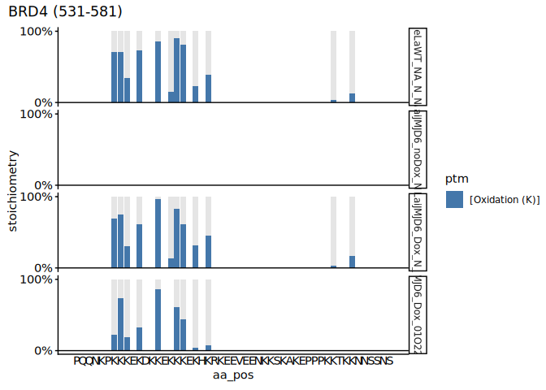
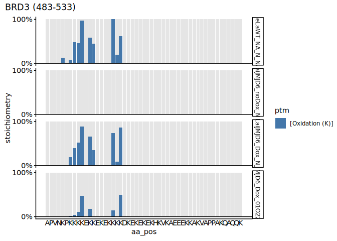
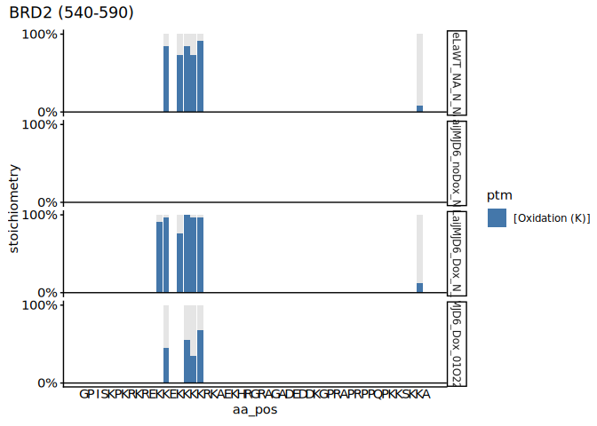
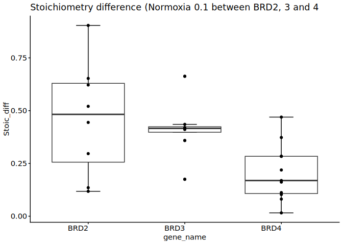
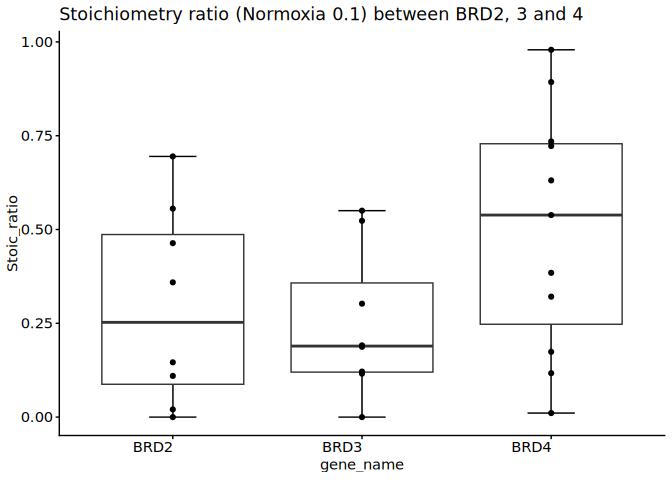
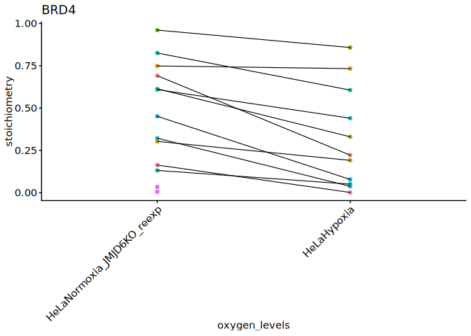
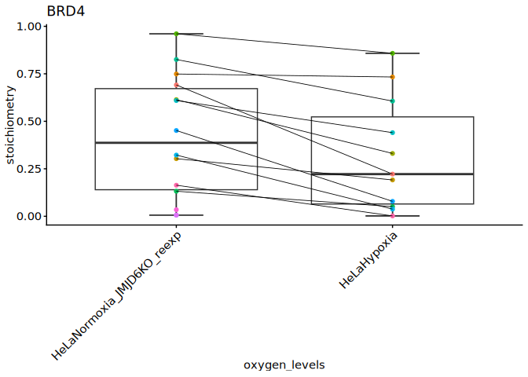

2-5. Lysine hydroxylations in hypoxia and normoxia
================
Yoichiro Sugimoto and Pallavi Kesavan
17 December, 2025

- [Environment setup](#environment-setup)
- [2.5.1 Install,load essential functions and
  libraries](#251-installload-essential-functions-and-libraries)
- [2.5.2 Import human protein reference
  data](#252-import-human-protein-reference-data)
- [2.5.3 Calculation of Stoichiometry with diagnostic ion in hypoxia and
  normoxia](#253-calculation-of-stoichiometry-with-diagnostic-ion-in-hypoxia-and-normoxia)
- [2.5.4 Plotting Stoichiometry values of hypoxia and normoxia data (+
  diagnostic
  ion)](#254-plotting-stoichiometry-values-of-hypoxia-and-normoxia-data--diagnostic-ion)
- [2.5.5 Plotting Stoichiometry of hypoxia and normoxia data with
  re-expression of JMJD6 (+ diagnostic
  peak)](#255-plotting-stoichiometry-of-hypoxia-and-normoxia-data-with-re-expression-of-jmjd6--diagnostic-peak)
- [Session information](#session-information)

# Environment setup

``` r
## Initialize renv (first time only) - re-installed 24.09.2025
# Creates project specific library and renv.lock file. 
# Use 'renv::init(filepath)' to create project library
# renv::init(
#        "/fast/AG_Sugimoto/home/users/pallavi/projects/20241111_PTMs_in_lysine_rich_domains/R"
#    )

# Define project directory - contains the R scripts, data and result folders
project.dir <-
  file.path(
    "/fast/AG_Sugimoto/home/users/pallavi/projects/20241111_PTMs_in_lysine_rich_domains"
  )

# renv::snapshot(file.path(project.dir, "R"))

#renv::restore completed 24.09.2025
#renv::restore(file.path(project.dir, "R"))
```

# 2.5.1 Install,load essential functions and libraries

``` r
## Load all R scripts from the 'functions' folder into the current session
P2_functions <- sapply(list.files(file.path(project.dir, "R/functions"), pattern="*.R", full.names = TRUE), source)
```

    ## 
    ## Attaching package: 'dplyr'

    ## The following objects are masked from 'package:stats':
    ## 
    ##     filter, lag

    ## The following objects are masked from 'package:base':
    ## 
    ##     intersect, setdiff, setequal, union

    ## 
    ## Attaching package: 'data.table'

    ## The following objects are masked from 'package:dplyr':
    ## 
    ##     between, first, last

    ## Loading required package: BiocGenerics

    ## Loading required package: generics

    ## 
    ## Attaching package: 'generics'

    ## The following object is masked from 'package:dplyr':
    ## 
    ##     explain

    ## The following objects are masked from 'package:base':
    ## 
    ##     as.difftime, as.factor, as.ordered, intersect, is.element, setdiff,
    ##     setequal, union

    ## 
    ## Attaching package: 'BiocGenerics'

    ## The following object is masked from 'package:dplyr':
    ## 
    ##     combine

    ## The following objects are masked from 'package:stats':
    ## 
    ##     IQR, mad, sd, var, xtabs

    ## The following objects are masked from 'package:base':
    ## 
    ##     anyDuplicated, aperm, append, as.data.frame, basename, cbind,
    ##     colnames, dirname, do.call, duplicated, eval, evalq, Filter, Find,
    ##     get, grep, grepl, is.unsorted, lapply, Map, mapply, match, mget,
    ##     order, paste, pmax, pmax.int, pmin, pmin.int, Position, rank,
    ##     rbind, Reduce, rownames, sapply, saveRDS, table, tapply, unique,
    ##     unsplit, which.max, which.min

    ## Loading required package: S4Vectors

    ## Loading required package: stats4

    ## 
    ## Attaching package: 'S4Vectors'

    ## The following objects are masked from 'package:data.table':
    ## 
    ##     first, second

    ## The following objects are masked from 'package:dplyr':
    ## 
    ##     first, rename

    ## The following object is masked from 'package:utils':
    ## 
    ##     findMatches

    ## The following objects are masked from 'package:base':
    ## 
    ##     expand.grid, I, unname

    ## Loading required package: IRanges

    ## 
    ## Attaching package: 'IRanges'

    ## The following object is masked from 'package:data.table':
    ## 
    ##     shift

    ## The following objects are masked from 'package:dplyr':
    ## 
    ##     collapse, desc, slice

    ## Loading required package: XVector

    ## Loading required package: GenomeInfoDb

    ## 
    ## Attaching package: 'Biostrings'

    ## The following object is masked from 'package:base':
    ## 
    ##     strsplit

``` r
## Install private package 
# Install ptm.stiochiometry package
# install.packages("/fast/AG_Sugimoto/home/users/pallavi/projects/ptm.stoichiometry", repos = NULL, type = "source")

# Load Libraries
library("readxl")
library("janitor")
```

    ## 
    ## Attaching package: 'janitor'

    ## The following objects are masked from 'package:stats':
    ## 
    ##     chisq.test, fisher.test

``` r
library("ptm.stoichiometry")
```

# 2.5.2 Import human protein reference data

``` r
# Import human protein reference data from specified file path 
ref_protein_dt <- import_reference_fasta(file.path
                                         ("/fast/AG_Sugimoto/reference/uniprot/human", 
                                           "UP000005640_9606.fasta")) 
```

# 2.5.3 Calculation of Stoichiometry with diagnostic ion in hypoxia and normoxia

``` r
# Define path to data directory
data.dir <- file.path(project.dir, "data")
results.dir <- file.path(project.dir, "results")

# Load data into environment
MS_KR1_data <- file.path(
  project.dir,
  "data/MQ_with_DI/MS_KR_1" 
)

# Create file path for results
MS_KR_1_dir <- file.path(project.dir, "results", "p2-analysis-setting", "MS_KR_1")
# dir.create(MS_KR_1_dir, recursive = TRUE)

# Define file path common PTM mapping file
ptm_mapping_file <- file.path(
  project.dir,
  "data/analysis_setting/ptm_replacement_de-propionylate_for_hydroxylysine.csv"
)
```

``` r
# Define file path to MaxQuant evidence files
mq_evidence_data <- file.path(MS_KR1_data, 
                              "MS_KR_1_evidence.txt")

# Print which sample id is being processed
message("Processing: ", basename(mq_evidence_data)) 
```

    ## Processing: MS_KR_1_evidence.txt

``` r
# Checks whether the sample ID has the corresponding evidence.txt file. If yes, then proceed
if (file.exists(mq_evidence_data)) {
  
  # Locate and fetch all PTM site files within the ptm folder
  ptm_files <- list.files(file.path(
    MS_KR1_data, "ptm"), 
    full.names = TRUE)
  
  # Generate PTM names based on file names, add brackets and remove "Sites.txt"
  ptm_names <- paste0(
    "[", str_replace_all(basename(ptm_files), "Sites.txt", ""), "]"
  )
  
  # Run the stoichiometry calculation
  stoic.dt <- calculate_stoichiometry2(
    mq_evidence_data = mq_evidence_data,
    sample_info_file = file.path(
      MS_KR1_data,
      "sample_info.csv"
    ),
    ref_protein_dt = ref_protein_dt,
    ptm_files = ptm_files,
    ptm_names = ptm_names,
    output_prefix = file.path(MS_KR_1_dir, "MS_KR_1_"),
    ptm_mapping_file = ptm_mapping_file,
    K_only = FALSE,
    selected_type = "MULTI-MSMS",
    parse_protein_accession_function = NA
  )
} else { # If evidence.txt does not exist, skip the function and print below message
  print(paste0("File does not exist: ", mq_evidence_data))
}

# Garbage collection - to free up memory
gc()
```

    ##            used  (Mb) gc trigger  (Mb) max used  (Mb)
    ## Ncells  4225967 225.7    8203997 438.2  8203997 438.2
    ## Vcells 21423162 163.5   64675529 493.5 64675048 493.5

# 2.5.4 Plotting Stoichiometry values of hypoxia and normoxia data (+ diagnostic ion)

``` r
# Read FASTA data 
all.protein.bs <- Biostrings::readAAStringSet(
  file.path(
    "/fast/AG_Sugimoto/reference/uniprot/human",
    "UP000005640_9606.fasta"
  )
)

# Define function - 'read_stoic_data'
read_stoic_data <- function(prefix, pre_prefix, post_fix = "", dir_path){
  # Read csv file with defined file path,  
  dt <- fread(file.path(dir_path, paste0(pre_prefix, prefix, "PTM_stoichiometry", post_fix, ".csv"))) 
  dt[, condition := gsub("_$", "", prefix)] # Removes '_' at the end of the prefix and creates a new column called condition
  return(dt)
}

## Read stoichiometry data for MS_KR1 data 
 MS_KR1_stoic_dt <- read_stoic_data(
  prefix = "MS_KR_1_noH2O_",
  pre_prefix = "",
  post_fix = "_DI",
  dir_path = file.path(results.dir, "p2-analysis-setting", "MS_KR_1_noH2O"))


#Filter data table with presence of diagnostic_peak and WT stoichiometry values
MS_KR1_stoic_dt[, `:=`(
  is_diagnostic_peak = diagnostic_peak == "+" 
)]

# categorize data according to sample names 
MS_KR1_stoic_dt[, `:=`(
  sample_name =  
    factor(sample_name, levels = c("HeLaWT_NA_N_NA", "HeLaiJMJD6_noDox_N_NA", "HeLaiJMJD6_Dox_N_NA", "HeLaiJMJD6_Dox_01O224h_NA"))
)]

# BRD4 
plot_ptm_stoichiometry(
  MS_KR1_stoic_dt[sample_name %in% c("HeLaWT_NA_N_NA","HeLaiJMJD6_noDox_N_NA", "HeLaiJMJD6_Dox_N_NA", "HeLaiJMJD6_Dox_01O224h_NA")], accession = "O60885", plot_range = c(531, 581), all.protein.bs, sample_colors = NA,
)
```

<!-- --><!-- -->

``` r
# BRD3
plot_ptm_stoichiometry(
  MS_KR1_stoic_dt[sample_name %in% c("HeLaWT_NA_N_NA","HeLaiJMJD6_noDox_N_NA", "HeLaiJMJD6_Dox_N_NA", "HeLaiJMJD6_Dox_01O224h_NA")], accession = "Q15059", plot_range = c(483, 533), all.protein.bs, sample_colors = NA
)
```

<!-- --><!-- -->

``` r
# BRD2
plot_ptm_stoichiometry(
  MS_KR1_stoic_dt[sample_name %in% c("HeLaWT_NA_N_NA","HeLaiJMJD6_noDox_N_NA", "HeLaiJMJD6_Dox_N_NA", "HeLaiJMJD6_Dox_01O224h_NA")], accession = "P25440", plot_range = c(540, 590), all.protein.bs, sample_colors = NA
)
```

<!-- --><!-- -->

# 2.5.5 Plotting Stoichiometry of hypoxia and normoxia data with re-expression of JMJD6 (+ diagnostic peak)

``` r
# Remove non JMJD6 re expression data (HeLaWT_NA_N_NA, HeLaiJMJD6_noDox_N_NA)
MS_KR1_stoic_dt <-  droplevels(MS_KR1_stoic_dt[!sample_name %in% c("HeLaWT_NA_N_NA", "HeLaiJMJD6_noDox_N_NA")])


# categorize data according to sample names 
MS_KR1_stoic_dt[, `:=`(
  sample_name =  
    factor(sample_name, levels = c("HeLaiJMJD6_Dox_N_NA", "HeLaiJMJD6_Dox_01O224h_NA"))
)]


# Filter MS_KR_1 data to retain only BRD2, 3, 4 data
MS_KR1_stoic_dt <-  MS_KR1_stoic_dt[gene_name %in% c("BRD2", "BRD3", "BRD4")]

MS_KR1_stoic_dt[, `:=`(
  oxygen_levels =
    factor(
      fcase(
        grepl("^HeLaiJMJD6_Dox_N_NA", sample_name),
        "HeLaNormoxia_JMJD6KO_reexp",
        grepl("^HeLaiJMJD6_Dox_01O224h_NA", sample_name),
        "HeLaHypoxia",
        default = NA_character_
      ),
      levels = c("HeLaNormoxia_JMJD6KO_reexp", "HeLaHypoxia")
    )
)]

# Define function - 'contrast_hydroxylation_by_oxygen_stat'
contrast_hydroxylation_by_oxygen_stat <- function(all_stoic_dt){
  wt_ko_dt <- all_stoic_dt
  
  # Add new columns into metadata
  wt_ko_dt[, `:=`(
    oxygen_stat = str_extract(oxygen_levels, "(?<=HeLa)(Normoxia|Hypoxia)"), # new column - oxygen status, extract Normoxia or Hypoxia from oxygen_levels column
    pos_id = paste0(protein_accession, "_", aa_pos), 
    sample_pos_id = paste0(oxygen_levels, "_", protein_accession, "_", aa_pos)
  )]
  
  # Identify position with at least one oxidation event
  oxidation_ids <- wt_ko_dt[
    grepl("[Oxidation (K)]", ptm, fixed = TRUE), # checks for oxidation event
    unique(pos_id) # Returns unique pos_id with oxidation event
  ]
  oxidation_sample_ids <- wt_ko_dt[
    grepl("[Oxidation (K)]", ptm, fixed = TRUE),
    unique(sample_pos_id)
  ]
  
  # Collect non hydroxylated K information for the sites with hydroxylation
  no_hydroxyK_dt <- copy(wt_ko_dt[aa == "K"])
  no_hydroxyK_dt <- no_hydroxyK_dt[pos_id %in% oxidation_ids] %>%
    {.[!sample_pos_id %in% oxidation_sample_ids]} # If hydroxylation data exist, this is not necessary
  
  # Set stoichiometry and PSM count to zero for these positions and update the PTM label
  no_hydroxyK_dt[, `:=`(
    sum_psm_mapped = 0,
    stoichiometry = 0,
    ptm = "[Oxidation (K)]"
  )]
  
  # Combine oxidation data from both original and the newly flagged unmodified K data
  hydroxyK_dt <- rbind(
    wt_ko_dt[grepl("[Oxidation (K)]", ptm, fixed = TRUE)],
    no_hydroxyK_dt
  )
  
  # Filter psm mapped greater than 2 for higher confidence 
  hydroxyK_dt <- hydroxyK_dt[
    sum_psm_mapped_per_position > 2
  ]
  
  # Sort stoichiometry column from highest to lowest
  hydroxyK_dt <- hydroxyK_dt[order(stoichiometry, decreasing = TRUE)][
    !duplicated(paste0(protein_accession, gene_name, aa_pos, oxygen_stat)) # Remove duplicate rows
  ]
  
  # Reshape 'd.hydroxyK_dt' from long to wide based on stoichiometry values  
  d.hydroxyK_dt <- dcast(
    hydroxyK_dt,
    protein_accession + gene_name + aa_pos ~ oxygen_stat, # values in oxygen_stat become into separate columns (Normoxia & Hypoxia)
    value.var = "stoichiometry"
  )
  
  return(d.hydroxyK_dt)
}

# Use contrast function on 'MS_KR1_stoic_dt' to set NA to 0, only if the sample contains an [oxidation K] 
MS_KR_1_hydroxy_dt <-  contrast_hydroxylation_by_oxygen_stat(MS_KR1_stoic_dt)

# Generate data table with WT and JMJD6KO with diagnostic peaks
DI_info <- MS_KR1_stoic_dt[
  , .(protein_accession, aa_pos, diagnostic_peak) # filter these columns and create a separate data table 
][
  order(protein_accession, aa_pos, -diagnostic_peak) # order the data based on the highest diagnostic peak 
][                                              
  !duplicated(paste(protein_accession, aa_pos)) # Keep only the first row for each unique protein and amino acid position,
  # removing duplicates while preserving the row with the highest diagnostic_peak (from previous sorting)
]

# merge the modified data table 'DI_info' with the metadata 'MS_KR_1_hydroxy_dt'
MS_KR_1_hydroxy_dt <- merge(MS_KR_1_hydroxy_dt, DI_info, by = c("protein_accession", "aa_pos"))

#Filter data table with presence of diagnostic_peak and WT stoichiometry values
MS_KR_1_hydroxy_dt[, `:=`(
  is_diagnostic_peak = diagnostic_peak == "+" 
)]

# Calculate the difference in stoichiometric values of JMJD6 re expression and Hypoxia
MS_KR_1_hydroxy_dt <- MS_KR_1_hydroxy_dt[, `:=`(
  Stoic_diff = (Normoxia - Hypoxia),
  Stoic_ratio = (Hypoxia/Normoxia)
)]

# filter data to have hydroxylysine with diagnostic ion 
MS_KR_1_hydroxy_dt <- MS_KR_1_hydroxy_dt[is_diagnostic_peak == TRUE]

# Factor the gene names
MS_KR_1_hydroxy_dt[, `:=`(
  gene_name =  
    factor(gene_name)
)]
```

``` r
# Normoxia set at 0.05 and above
MS_KR_1_hydroxy_dt <- subset(MS_KR_1_hydroxy_dt, Normoxia >= 0.05)

subset(MS_KR_1_hydroxy_dt, gene_name %in% c("BRD2", "BRD3", "BRD4"))[, table(gene_name)]
```

    ## gene_name
    ## BRD2 BRD3 BRD4 
    ##    8    9   11

``` r
# ANOVA - Stoic-diff
anova_MS_KR_1 <- aov(Stoic_diff ~ gene_name, data = MS_KR_1_hydroxy_dt)

summary(anova_MS_KR_1)
```

    ##             Df Sum Sq Mean Sq F value Pr(>F)  
    ## gene_name    2 0.3247 0.16235   4.438 0.0224 *
    ## Residuals   25 0.9145 0.03658                 
    ## ---
    ## Signif. codes:  0 '***' 0.001 '**' 0.01 '*' 0.05 '.' 0.1 ' ' 1

``` r
# ANOVA - Stoic-ratio
anova_MS_KR_1 <- aov(Stoic_ratio ~ gene_name, data = MS_KR_1_hydroxy_dt)

summary(anova_MS_KR_1)
```

    ##             Df Sum Sq Mean Sq F value Pr(>F)  
    ## gene_name    2 0.4237 0.21187   2.862  0.076 .
    ## Residuals   25 1.8510 0.07404                 
    ## ---
    ## Signif. codes:  0 '***' 0.001 '**' 0.01 '*' 0.05 '.' 0.1 ' ' 1

``` r
t.test(Stoic_diff ~ gene_name, data = subset(MS_KR_1_hydroxy_dt, gene_name %in% c("BRD2", "BRD3")))
```

    ## 
    ##  Welch Two Sample t-test
    ## 
    ## data:  Stoic_diff by gene_name
    ## t = 0.77829, df = 11.286, p-value = 0.4524
    ## alternative hypothesis: true difference in means between group BRD2 and group BRD3 is not equal to 0
    ## 95 percent confidence interval:
    ##  -0.1562680  0.3280621
    ## sample estimates:
    ## mean in group BRD2 mean in group BRD3 
    ##          0.4615853          0.3756882

``` r
t.test(Stoic_diff ~ gene_name, data = subset(MS_KR_1_hydroxy_dt, gene_name %in% c("BRD3", "BRD4")))
```

    ## 
    ##  Welch Two Sample t-test
    ## 
    ## data:  Stoic_diff by gene_name
    ## t = 2.4719, df = 15.531, p-value = 0.02543
    ## alternative hypothesis: true difference in means between group BRD3 and group BRD4 is not equal to 0
    ## 95 percent confidence interval:
    ##  0.02373838 0.31465242
    ## sample estimates:
    ## mean in group BRD3 mean in group BRD4 
    ##          0.3756882          0.2064928

``` r
t.test(Stoic_diff ~ gene_name, data = subset(MS_KR_1_hydroxy_dt, gene_name %in% c("BRD2", "BRD4")))
```

    ## 
    ##  Welch Two Sample t-test
    ## 
    ## data:  Stoic_diff by gene_name
    ## t = 2.4495, df = 9.5667, p-value = 0.0353
    ## alternative hypothesis: true difference in means between group BRD2 and group BRD4 is not equal to 0
    ## 95 percent confidence interval:
    ##  0.02162352 0.48856139
    ## sample estimates:
    ## mean in group BRD2 mean in group BRD4 
    ##          0.4615853          0.2064928

``` r
t.test(Stoic_ratio ~ gene_name, data = subset(MS_KR_1_hydroxy_dt, gene_name %in% c("BRD2", "BRD3")))
```

    ## 
    ##  Welch Two Sample t-test
    ## 
    ## data:  Stoic_ratio by gene_name
    ## t = 0.63267, df = 13.16, p-value = 0.5378
    ## alternative hypothesis: true difference in means between group BRD2 and group BRD3 is not equal to 0
    ## 95 percent confidence interval:
    ##  -0.1745475  0.3193724
    ## sample estimates:
    ## mean in group BRD2 mean in group BRD3 
    ##          0.2937103          0.2212978

``` r
t.test(Stoic_ratio ~ gene_name, data = subset(MS_KR_1_hydroxy_dt, gene_name %in% c("BRD3", "BRD4")))
```

    ## 
    ##  Welch Two Sample t-test
    ## 
    ## data:  Stoic_ratio by gene_name
    ## t = -2.3569, df = 16.994, p-value = 0.03068
    ## alternative hypothesis: true difference in means between group BRD3 and group BRD4 is not equal to 0
    ## 95 percent confidence interval:
    ##  -0.52927081 -0.02927531
    ## sample estimates:
    ## mean in group BRD3 mean in group BRD4 
    ##          0.2212978          0.5005709

``` r
t.test(Stoic_ratio ~ gene_name, data = subset(MS_KR_1_hydroxy_dt, gene_name %in% c("BRD2", "BRD4")))
```

    ## 
    ##  Welch Two Sample t-test
    ## 
    ## data:  Stoic_ratio by gene_name
    ## t = -1.5395, df = 16.733, p-value = 0.1424
    ## alternative hypothesis: true difference in means between group BRD2 and group BRD4 is not equal to 0
    ## 95 percent confidence interval:
    ##  -0.49069585  0.07697462
    ## sample estimates:
    ## mean in group BRD2 mean in group BRD4 
    ##          0.2937103          0.5005709

``` r
# Normoxia set at 0.06
MS_KR_1_hydroxy_dt <- subset(MS_KR_1_hydroxy_dt, Normoxia >= 0.06)

subset(MS_KR_1_hydroxy_dt, gene_name %in% c("BRD2", "BRD3", "BRD4"))[, table(gene_name)]
```

    ## gene_name
    ## BRD2 BRD3 BRD4 
    ##    8    9   11

``` r
# ANOVA
anova_MS_KR_1 <- aov(Stoic_diff ~ gene_name, data = MS_KR_1_hydroxy_dt)

summary(anova_MS_KR_1)
```

    ##             Df Sum Sq Mean Sq F value Pr(>F)  
    ## gene_name    2 0.3247 0.16235   4.438 0.0224 *
    ## Residuals   25 0.9145 0.03658                 
    ## ---
    ## Signif. codes:  0 '***' 0.001 '**' 0.01 '*' 0.05 '.' 0.1 ' ' 1

``` r
# ANOVA - Stoic-ratio
anova_MS_KR_1 <- aov(Stoic_ratio ~ gene_name, data = MS_KR_1_hydroxy_dt)

summary(anova_MS_KR_1)
```

    ##             Df Sum Sq Mean Sq F value Pr(>F)  
    ## gene_name    2 0.4237 0.21187   2.862  0.076 .
    ## Residuals   25 1.8510 0.07404                 
    ## ---
    ## Signif. codes:  0 '***' 0.001 '**' 0.01 '*' 0.05 '.' 0.1 ' ' 1

``` r
t.test(Stoic_diff ~ gene_name, data = subset(MS_KR_1_hydroxy_dt, gene_name %in% c("BRD2", "BRD3")))
```

    ## 
    ##  Welch Two Sample t-test
    ## 
    ## data:  Stoic_diff by gene_name
    ## t = 0.77829, df = 11.286, p-value = 0.4524
    ## alternative hypothesis: true difference in means between group BRD2 and group BRD3 is not equal to 0
    ## 95 percent confidence interval:
    ##  -0.1562680  0.3280621
    ## sample estimates:
    ## mean in group BRD2 mean in group BRD3 
    ##          0.4615853          0.3756882

``` r
t.test(Stoic_diff ~ gene_name, data = subset(MS_KR_1_hydroxy_dt, gene_name %in% c("BRD3", "BRD4")))
```

    ## 
    ##  Welch Two Sample t-test
    ## 
    ## data:  Stoic_diff by gene_name
    ## t = 2.4719, df = 15.531, p-value = 0.02543
    ## alternative hypothesis: true difference in means between group BRD3 and group BRD4 is not equal to 0
    ## 95 percent confidence interval:
    ##  0.02373838 0.31465242
    ## sample estimates:
    ## mean in group BRD3 mean in group BRD4 
    ##          0.3756882          0.2064928

``` r
t.test(Stoic_diff ~ gene_name, data = subset(MS_KR_1_hydroxy_dt, gene_name %in% c("BRD2", "BRD4")))
```

    ## 
    ##  Welch Two Sample t-test
    ## 
    ## data:  Stoic_diff by gene_name
    ## t = 2.4495, df = 9.5667, p-value = 0.0353
    ## alternative hypothesis: true difference in means between group BRD2 and group BRD4 is not equal to 0
    ## 95 percent confidence interval:
    ##  0.02162352 0.48856139
    ## sample estimates:
    ## mean in group BRD2 mean in group BRD4 
    ##          0.4615853          0.2064928

``` r
t.test(Stoic_ratio ~ gene_name, data = subset(MS_KR_1_hydroxy_dt, gene_name %in% c("BRD2", "BRD3")))
```

    ## 
    ##  Welch Two Sample t-test
    ## 
    ## data:  Stoic_ratio by gene_name
    ## t = 0.63267, df = 13.16, p-value = 0.5378
    ## alternative hypothesis: true difference in means between group BRD2 and group BRD3 is not equal to 0
    ## 95 percent confidence interval:
    ##  -0.1745475  0.3193724
    ## sample estimates:
    ## mean in group BRD2 mean in group BRD3 
    ##          0.2937103          0.2212978

``` r
t.test(Stoic_ratio ~ gene_name, data = subset(MS_KR_1_hydroxy_dt, gene_name %in% c("BRD3", "BRD4")))
```

    ## 
    ##  Welch Two Sample t-test
    ## 
    ## data:  Stoic_ratio by gene_name
    ## t = -2.3569, df = 16.994, p-value = 0.03068
    ## alternative hypothesis: true difference in means between group BRD3 and group BRD4 is not equal to 0
    ## 95 percent confidence interval:
    ##  -0.52927081 -0.02927531
    ## sample estimates:
    ## mean in group BRD3 mean in group BRD4 
    ##          0.2212978          0.5005709

``` r
t.test(Stoic_ratio ~ gene_name, data = subset(MS_KR_1_hydroxy_dt, gene_name %in% c("BRD2", "BRD4")))
```

    ## 
    ##  Welch Two Sample t-test
    ## 
    ## data:  Stoic_ratio by gene_name
    ## t = -1.5395, df = 16.733, p-value = 0.1424
    ## alternative hypothesis: true difference in means between group BRD2 and group BRD4 is not equal to 0
    ## 95 percent confidence interval:
    ##  -0.49069585  0.07697462
    ## sample estimates:
    ## mean in group BRD2 mean in group BRD4 
    ##          0.2937103          0.5005709

``` r
# Normoxia set at 0.07
MS_KR_1_hydroxy_dt <- subset(MS_KR_1_hydroxy_dt, Normoxia >= 0.07)

subset(MS_KR_1_hydroxy_dt, gene_name %in% c("BRD2", "BRD3", "BRD4"))[, table(gene_name)]
```

    ## gene_name
    ## BRD2 BRD3 BRD4 
    ##    8    9   11

``` r
# ANOVA
anova_MS_KR_1 <- aov(Stoic_diff ~ gene_name, data = MS_KR_1_hydroxy_dt)

summary(anova_MS_KR_1)
```

    ##             Df Sum Sq Mean Sq F value Pr(>F)  
    ## gene_name    2 0.3247 0.16235   4.438 0.0224 *
    ## Residuals   25 0.9145 0.03658                 
    ## ---
    ## Signif. codes:  0 '***' 0.001 '**' 0.01 '*' 0.05 '.' 0.1 ' ' 1

``` r
# ANOVA - Stoic-ratio
anova_MS_KR_1 <- aov(Stoic_ratio ~ gene_name, data = MS_KR_1_hydroxy_dt)

summary(anova_MS_KR_1)
```

    ##             Df Sum Sq Mean Sq F value Pr(>F)  
    ## gene_name    2 0.4237 0.21187   2.862  0.076 .
    ## Residuals   25 1.8510 0.07404                 
    ## ---
    ## Signif. codes:  0 '***' 0.001 '**' 0.01 '*' 0.05 '.' 0.1 ' ' 1

``` r
t.test(Stoic_diff ~ gene_name, data = subset(MS_KR_1_hydroxy_dt, gene_name %in% c("BRD2", "BRD3")))
```

    ## 
    ##  Welch Two Sample t-test
    ## 
    ## data:  Stoic_diff by gene_name
    ## t = 0.77829, df = 11.286, p-value = 0.4524
    ## alternative hypothesis: true difference in means between group BRD2 and group BRD3 is not equal to 0
    ## 95 percent confidence interval:
    ##  -0.1562680  0.3280621
    ## sample estimates:
    ## mean in group BRD2 mean in group BRD3 
    ##          0.4615853          0.3756882

``` r
t.test(Stoic_diff ~ gene_name, data = subset(MS_KR_1_hydroxy_dt, gene_name %in% c("BRD3", "BRD4")))
```

    ## 
    ##  Welch Two Sample t-test
    ## 
    ## data:  Stoic_diff by gene_name
    ## t = 2.4719, df = 15.531, p-value = 0.02543
    ## alternative hypothesis: true difference in means between group BRD3 and group BRD4 is not equal to 0
    ## 95 percent confidence interval:
    ##  0.02373838 0.31465242
    ## sample estimates:
    ## mean in group BRD3 mean in group BRD4 
    ##          0.3756882          0.2064928

``` r
t.test(Stoic_diff ~ gene_name, data = subset(MS_KR_1_hydroxy_dt, gene_name %in% c("BRD2", "BRD4")))
```

    ## 
    ##  Welch Two Sample t-test
    ## 
    ## data:  Stoic_diff by gene_name
    ## t = 2.4495, df = 9.5667, p-value = 0.0353
    ## alternative hypothesis: true difference in means between group BRD2 and group BRD4 is not equal to 0
    ## 95 percent confidence interval:
    ##  0.02162352 0.48856139
    ## sample estimates:
    ## mean in group BRD2 mean in group BRD4 
    ##          0.4615853          0.2064928

``` r
t.test(Stoic_ratio ~ gene_name, data = subset(MS_KR_1_hydroxy_dt, gene_name %in% c("BRD2", "BRD3")))
```

    ## 
    ##  Welch Two Sample t-test
    ## 
    ## data:  Stoic_ratio by gene_name
    ## t = 0.63267, df = 13.16, p-value = 0.5378
    ## alternative hypothesis: true difference in means between group BRD2 and group BRD3 is not equal to 0
    ## 95 percent confidence interval:
    ##  -0.1745475  0.3193724
    ## sample estimates:
    ## mean in group BRD2 mean in group BRD3 
    ##          0.2937103          0.2212978

``` r
t.test(Stoic_ratio ~ gene_name, data = subset(MS_KR_1_hydroxy_dt, gene_name %in% c("BRD3", "BRD4")))
```

    ## 
    ##  Welch Two Sample t-test
    ## 
    ## data:  Stoic_ratio by gene_name
    ## t = -2.3569, df = 16.994, p-value = 0.03068
    ## alternative hypothesis: true difference in means between group BRD3 and group BRD4 is not equal to 0
    ## 95 percent confidence interval:
    ##  -0.52927081 -0.02927531
    ## sample estimates:
    ## mean in group BRD3 mean in group BRD4 
    ##          0.2212978          0.5005709

``` r
t.test(Stoic_ratio ~ gene_name, data = subset(MS_KR_1_hydroxy_dt, gene_name %in% c("BRD2", "BRD4")))
```

    ## 
    ##  Welch Two Sample t-test
    ## 
    ## data:  Stoic_ratio by gene_name
    ## t = -1.5395, df = 16.733, p-value = 0.1424
    ## alternative hypothesis: true difference in means between group BRD2 and group BRD4 is not equal to 0
    ## 95 percent confidence interval:
    ##  -0.49069585  0.07697462
    ## sample estimates:
    ## mean in group BRD2 mean in group BRD4 
    ##          0.2937103          0.5005709

``` r
# Normoxia set at 0.08
MS_KR_1_hydroxy_dt <- subset(MS_KR_1_hydroxy_dt, Normoxia >= 0.08)

subset(MS_KR_1_hydroxy_dt, gene_name %in% c("BRD2", "BRD3", "BRD4"))[, table(gene_name)]
```

    ## gene_name
    ## BRD2 BRD3 BRD4 
    ##    8    9   11

``` r
# ANOVA
anova_MS_KR_1 <- aov(Stoic_diff ~ gene_name, data = MS_KR_1_hydroxy_dt)

summary(anova_MS_KR_1)
```

    ##             Df Sum Sq Mean Sq F value Pr(>F)  
    ## gene_name    2 0.3247 0.16235   4.438 0.0224 *
    ## Residuals   25 0.9145 0.03658                 
    ## ---
    ## Signif. codes:  0 '***' 0.001 '**' 0.01 '*' 0.05 '.' 0.1 ' ' 1

``` r
# ANOVA - Stoic-ratio
anova_MS_KR_1 <- aov(Stoic_ratio ~ gene_name, data = MS_KR_1_hydroxy_dt)

summary(anova_MS_KR_1)
```

    ##             Df Sum Sq Mean Sq F value Pr(>F)  
    ## gene_name    2 0.4237 0.21187   2.862  0.076 .
    ## Residuals   25 1.8510 0.07404                 
    ## ---
    ## Signif. codes:  0 '***' 0.001 '**' 0.01 '*' 0.05 '.' 0.1 ' ' 1

``` r
t.test(Stoic_diff ~ gene_name, data = subset(MS_KR_1_hydroxy_dt, gene_name %in% c("BRD2", "BRD3")))
```

    ## 
    ##  Welch Two Sample t-test
    ## 
    ## data:  Stoic_diff by gene_name
    ## t = 0.77829, df = 11.286, p-value = 0.4524
    ## alternative hypothesis: true difference in means between group BRD2 and group BRD3 is not equal to 0
    ## 95 percent confidence interval:
    ##  -0.1562680  0.3280621
    ## sample estimates:
    ## mean in group BRD2 mean in group BRD3 
    ##          0.4615853          0.3756882

``` r
t.test(Stoic_diff ~ gene_name, data = subset(MS_KR_1_hydroxy_dt, gene_name %in% c("BRD3", "BRD4")))
```

    ## 
    ##  Welch Two Sample t-test
    ## 
    ## data:  Stoic_diff by gene_name
    ## t = 2.4719, df = 15.531, p-value = 0.02543
    ## alternative hypothesis: true difference in means between group BRD3 and group BRD4 is not equal to 0
    ## 95 percent confidence interval:
    ##  0.02373838 0.31465242
    ## sample estimates:
    ## mean in group BRD3 mean in group BRD4 
    ##          0.3756882          0.2064928

``` r
t.test(Stoic_diff ~ gene_name, data = subset(MS_KR_1_hydroxy_dt, gene_name %in% c("BRD2", "BRD4")))
```

    ## 
    ##  Welch Two Sample t-test
    ## 
    ## data:  Stoic_diff by gene_name
    ## t = 2.4495, df = 9.5667, p-value = 0.0353
    ## alternative hypothesis: true difference in means between group BRD2 and group BRD4 is not equal to 0
    ## 95 percent confidence interval:
    ##  0.02162352 0.48856139
    ## sample estimates:
    ## mean in group BRD2 mean in group BRD4 
    ##          0.4615853          0.2064928

``` r
t.test(Stoic_ratio ~ gene_name, data = subset(MS_KR_1_hydroxy_dt, gene_name %in% c("BRD2", "BRD3")))
```

    ## 
    ##  Welch Two Sample t-test
    ## 
    ## data:  Stoic_ratio by gene_name
    ## t = 0.63267, df = 13.16, p-value = 0.5378
    ## alternative hypothesis: true difference in means between group BRD2 and group BRD3 is not equal to 0
    ## 95 percent confidence interval:
    ##  -0.1745475  0.3193724
    ## sample estimates:
    ## mean in group BRD2 mean in group BRD3 
    ##          0.2937103          0.2212978

``` r
t.test(Stoic_ratio ~ gene_name, data = subset(MS_KR_1_hydroxy_dt, gene_name %in% c("BRD3", "BRD4")))
```

    ## 
    ##  Welch Two Sample t-test
    ## 
    ## data:  Stoic_ratio by gene_name
    ## t = -2.3569, df = 16.994, p-value = 0.03068
    ## alternative hypothesis: true difference in means between group BRD3 and group BRD4 is not equal to 0
    ## 95 percent confidence interval:
    ##  -0.52927081 -0.02927531
    ## sample estimates:
    ## mean in group BRD3 mean in group BRD4 
    ##          0.2212978          0.5005709

``` r
t.test(Stoic_ratio ~ gene_name, data = subset(MS_KR_1_hydroxy_dt, gene_name %in% c("BRD2", "BRD4")))
```

    ## 
    ##  Welch Two Sample t-test
    ## 
    ## data:  Stoic_ratio by gene_name
    ## t = -1.5395, df = 16.733, p-value = 0.1424
    ## alternative hypothesis: true difference in means between group BRD2 and group BRD4 is not equal to 0
    ## 95 percent confidence interval:
    ##  -0.49069585  0.07697462
    ## sample estimates:
    ## mean in group BRD2 mean in group BRD4 
    ##          0.2937103          0.5005709

``` r
# Normoxia set at 0.09
MS_KR_1_hydroxy_dt <- subset(MS_KR_1_hydroxy_dt, Normoxia >= 0.09)

subset(MS_KR_1_hydroxy_dt, gene_name %in% c("BRD2", "BRD3", "BRD4"))[, table(gene_name)]
```

    ## gene_name
    ## BRD2 BRD3 BRD4 
    ##    8    8   11

``` r
# ANOVA
anova_MS_KR_1 <- aov(Stoic_diff ~ gene_name, data = MS_KR_1_hydroxy_dt)

summary(anova_MS_KR_1)
```

    ##             Df Sum Sq Mean Sq F value Pr(>F)  
    ## gene_name    2 0.3554 0.17770   5.199 0.0133 *
    ## Residuals   24 0.8204 0.03418                 
    ## ---
    ## Signif. codes:  0 '***' 0.001 '**' 0.01 '*' 0.05 '.' 0.1 ' ' 1

``` r
# ANOVA - Stoic-ratio
anova_MS_KR_1 <- aov(Stoic_ratio ~ gene_name, data = MS_KR_1_hydroxy_dt)

summary(anova_MS_KR_1)
```

    ##             Df Sum Sq Mean Sq F value Pr(>F)
    ## gene_name    2 0.3506 0.17528   2.342  0.118
    ## Residuals   24 1.7959 0.07483

``` r
t.test(Stoic_diff ~ gene_name, data = subset(MS_KR_1_hydroxy_dt, gene_name %in% c("BRD2", "BRD3")))
```

    ## 
    ##  Welch Two Sample t-test
    ## 
    ## data:  Stoic_diff by gene_name
    ## t = 0.46666, df = 10.162, p-value = 0.6506
    ## alternative hypothesis: true difference in means between group BRD2 and group BRD3 is not equal to 0
    ## 95 percent confidence interval:
    ##  -0.1872285  0.2867037
    ## sample estimates:
    ## mean in group BRD2 mean in group BRD3 
    ##          0.4615853          0.4118476

``` r
t.test(Stoic_diff ~ gene_name, data = subset(MS_KR_1_hydroxy_dt, gene_name %in% c("BRD3", "BRD4")))
```

    ## 
    ##  Welch Two Sample t-test
    ## 
    ## data:  Stoic_diff by gene_name
    ## t = 3.3036, df = 15.469, p-value = 0.004658
    ## alternative hypothesis: true difference in means between group BRD3 and group BRD4 is not equal to 0
    ## 95 percent confidence interval:
    ##  0.07321137 0.33749826
    ## sample estimates:
    ## mean in group BRD3 mean in group BRD4 
    ##          0.4118476          0.2064928

``` r
t.test(Stoic_diff ~ gene_name, data = subset(MS_KR_1_hydroxy_dt, gene_name %in% c("BRD2", "BRD4")))
```

    ## 
    ##  Welch Two Sample t-test
    ## 
    ## data:  Stoic_diff by gene_name
    ## t = 2.4495, df = 9.5667, p-value = 0.0353
    ## alternative hypothesis: true difference in means between group BRD2 and group BRD4 is not equal to 0
    ## 95 percent confidence interval:
    ##  0.02162352 0.48856139
    ## sample estimates:
    ## mean in group BRD2 mean in group BRD4 
    ##          0.4615853          0.2064928

``` r
t.test(Stoic_ratio ~ gene_name, data = subset(MS_KR_1_hydroxy_dt, gene_name %in% c("BRD2", "BRD3")))
```

    ## 
    ##  Welch Two Sample t-test
    ## 
    ## data:  Stoic_ratio by gene_name
    ## t = 0.38638, df = 13.01, p-value = 0.7055
    ## alternative hypothesis: true difference in means between group BRD2 and group BRD3 is not equal to 0
    ## 95 percent confidence interval:
    ##  -0.2054414  0.2949418
    ## sample estimates:
    ## mean in group BRD2 mean in group BRD3 
    ##          0.2937103          0.2489600

``` r
t.test(Stoic_ratio ~ gene_name, data = subset(MS_KR_1_hydroxy_dt, gene_name %in% c("BRD3", "BRD4")))
```

    ## 
    ##  Welch Two Sample t-test
    ## 
    ## data:  Stoic_ratio by gene_name
    ## t = -2.1001, df = 16.63, p-value = 0.0513
    ## alternative hypothesis: true difference in means between group BRD3 and group BRD4 is not equal to 0
    ## 95 percent confidence interval:
    ##  -0.504811598  0.001589927
    ## sample estimates:
    ## mean in group BRD3 mean in group BRD4 
    ##          0.2489600          0.5005709

``` r
t.test(Stoic_ratio ~ gene_name, data = subset(MS_KR_1_hydroxy_dt, gene_name %in% c("BRD2", "BRD4")))
```

    ## 
    ##  Welch Two Sample t-test
    ## 
    ## data:  Stoic_ratio by gene_name
    ## t = -1.5395, df = 16.733, p-value = 0.1424
    ## alternative hypothesis: true difference in means between group BRD2 and group BRD4 is not equal to 0
    ## 95 percent confidence interval:
    ##  -0.49069585  0.07697462
    ## sample estimates:
    ## mean in group BRD2 mean in group BRD4 
    ##          0.2937103          0.5005709

``` r
# Normoxia set at 0.1
MS_KR_1_hydroxy_dt <- subset(MS_KR_1_hydroxy_dt, Normoxia >= 0.1)

subset(MS_KR_1_hydroxy_dt, gene_name %in% c("BRD2", "BRD3", "BRD4"))[, table(gene_name)]
```

    ## gene_name
    ## BRD2 BRD3 BRD4 
    ##    8    8   11

``` r
# ANOVA
anova_MS_KR_1 <- aov(Stoic_diff ~ gene_name, data = MS_KR_1_hydroxy_dt)

summary(anova_MS_KR_1)
```

    ##             Df Sum Sq Mean Sq F value Pr(>F)  
    ## gene_name    2 0.3554 0.17770   5.199 0.0133 *
    ## Residuals   24 0.8204 0.03418                 
    ## ---
    ## Signif. codes:  0 '***' 0.001 '**' 0.01 '*' 0.05 '.' 0.1 ' ' 1

``` r
# ANOVA - Stoic-ratio
anova_MS_KR_1 <- aov(Stoic_ratio ~ gene_name, data = MS_KR_1_hydroxy_dt)

summary(anova_MS_KR_1)
```

    ##             Df Sum Sq Mean Sq F value Pr(>F)
    ## gene_name    2 0.3506 0.17528   2.342  0.118
    ## Residuals   24 1.7959 0.07483

``` r
t.test(Stoic_diff ~ gene_name, data = subset(MS_KR_1_hydroxy_dt, gene_name %in% c("BRD2", "BRD3")))
```

    ## 
    ##  Welch Two Sample t-test
    ## 
    ## data:  Stoic_diff by gene_name
    ## t = 0.46666, df = 10.162, p-value = 0.6506
    ## alternative hypothesis: true difference in means between group BRD2 and group BRD3 is not equal to 0
    ## 95 percent confidence interval:
    ##  -0.1872285  0.2867037
    ## sample estimates:
    ## mean in group BRD2 mean in group BRD3 
    ##          0.4615853          0.4118476

``` r
t.test(Stoic_diff ~ gene_name, data = subset(MS_KR_1_hydroxy_dt, gene_name %in% c("BRD3", "BRD4")))
```

    ## 
    ##  Welch Two Sample t-test
    ## 
    ## data:  Stoic_diff by gene_name
    ## t = 3.3036, df = 15.469, p-value = 0.004658
    ## alternative hypothesis: true difference in means between group BRD3 and group BRD4 is not equal to 0
    ## 95 percent confidence interval:
    ##  0.07321137 0.33749826
    ## sample estimates:
    ## mean in group BRD3 mean in group BRD4 
    ##          0.4118476          0.2064928

``` r
t.test(Stoic_diff ~ gene_name, data = subset(MS_KR_1_hydroxy_dt, gene_name %in% c("BRD2", "BRD4")))
```

    ## 
    ##  Welch Two Sample t-test
    ## 
    ## data:  Stoic_diff by gene_name
    ## t = 2.4495, df = 9.5667, p-value = 0.0353
    ## alternative hypothesis: true difference in means between group BRD2 and group BRD4 is not equal to 0
    ## 95 percent confidence interval:
    ##  0.02162352 0.48856139
    ## sample estimates:
    ## mean in group BRD2 mean in group BRD4 
    ##          0.4615853          0.2064928

``` r
t.test(Stoic_ratio ~ gene_name, data = subset(MS_KR_1_hydroxy_dt, gene_name %in% c("BRD2", "BRD3")))
```

    ## 
    ##  Welch Two Sample t-test
    ## 
    ## data:  Stoic_ratio by gene_name
    ## t = 0.38638, df = 13.01, p-value = 0.7055
    ## alternative hypothesis: true difference in means between group BRD2 and group BRD3 is not equal to 0
    ## 95 percent confidence interval:
    ##  -0.2054414  0.2949418
    ## sample estimates:
    ## mean in group BRD2 mean in group BRD3 
    ##          0.2937103          0.2489600

``` r
t.test(Stoic_ratio ~ gene_name, data = subset(MS_KR_1_hydroxy_dt, gene_name %in% c("BRD3", "BRD4")))
```

    ## 
    ##  Welch Two Sample t-test
    ## 
    ## data:  Stoic_ratio by gene_name
    ## t = -2.1001, df = 16.63, p-value = 0.0513
    ## alternative hypothesis: true difference in means between group BRD3 and group BRD4 is not equal to 0
    ## 95 percent confidence interval:
    ##  -0.504811598  0.001589927
    ## sample estimates:
    ## mean in group BRD3 mean in group BRD4 
    ##          0.2489600          0.5005709

``` r
t.test(Stoic_ratio ~ gene_name, data = subset(MS_KR_1_hydroxy_dt, gene_name %in% c("BRD2", "BRD4")))
```

    ## 
    ##  Welch Two Sample t-test
    ## 
    ## data:  Stoic_ratio by gene_name
    ## t = -1.5395, df = 16.733, p-value = 0.1424
    ## alternative hypothesis: true difference in means between group BRD2 and group BRD4 is not equal to 0
    ## 95 percent confidence interval:
    ##  -0.49069585  0.07697462
    ## sample estimates:
    ## mean in group BRD2 mean in group BRD4 
    ##          0.2937103          0.5005709

``` r
# Plot - Stoic difference between BRD2, 3 and 4
ggplot(
  data = MS_KR_1_hydroxy_dt[is_diagnostic_peak == TRUE],
  aes(
    x = gene_name,
    y = Stoic_diff
  )
) +
  stat_boxplot(geom = "errorbar", width = 0.25) + 
  geom_boxplot() +
  geom_point() +
  labs(title = "Stoichiometry difference (Normoxia 0.1 between BRD2, 3 and 4") +
  theme(axis.text.x = element_text(angle = 0, hjust = 1)) + 
  theme(legend.position="none")
```

<!-- -->

``` r
# Plot - Stoic ratio between BRD2, 3 and 4
ggplot(
  data = MS_KR_1_hydroxy_dt[is_diagnostic_peak == TRUE],
  aes(
    x = gene_name,
    y = Stoic_ratio
  )
) +
  stat_boxplot(geom = "errorbar", width = 0.25) + 
  geom_boxplot() +
  geom_point() +
  labs(title = "Stoichiometry ratio (Normoxia 0.1) between BRD2, 3 and 4") +
  theme(axis.text.x = element_text(angle = 0, hjust = 1)) + 
  theme(legend.position="none")
```

<!-- -->

``` r
# Plot - JMJD6 re-expression - BRD4
ggplot(
  data = MS_KR1_stoic_dt[gene_name %in% c("BRD4") & diagnostic_peak == "+"],
  aes(
    x = oxygen_levels,
    y = stoichiometry,
    group = paste(protein_accession, aa_pos)
  )
) +
  geom_point(aes(colour = paste(protein_accession, aa_pos))) +
  geom_line(linewidth = 0.4) +
  labs(title = "BRD4") +
  theme(axis.text.x = element_text(angle = 45, hjust = 1)) + 
  theme(legend.position="none") +
  scale_x_discrete(limits = rev(levels(MS_KR1_stoic_dt$Oxygen_levels)))
```

<!-- -->

``` r
## Boxplot and scatter plot

install.packages("viridis")
```

    ## Installing package into '/home/pkesava/R/x86_64-pc-linux-gnu-library/4.5'
    ## (as 'lib' is unspecified)

``` r
library(viridis)
```

    ## Loading required package: viridisLite

``` r
# Plot - JMJD6 re-expression - BRD4
ggplot(
  data = MS_KR1_stoic_dt[gene_name %in% c("BRD4") & diagnostic_peak == "+"],
  aes(
    x = oxygen_levels,
    y = stoichiometry
  )
) +
  stat_boxplot(geom = "errorbar", width = 0.25) + 
  geom_boxplot() +
  geom_point(aes(colour = paste(protein_accession, aa_pos))) +
  geom_line(aes(group =  aa_pos), size=0.3, colour='black') +
  labs(title = "BRD4") +
  theme(axis.text.x = element_text(angle = 45, hjust = 1)) + 
  theme(legend.position="none") +
  scale_x_discrete(limits = rev(levels(MS_KR1_stoic_dt$Oxygen_levels)))
```

    ## Warning: Using `size` aesthetic for lines was deprecated in ggplot2 3.4.0.
    ## ℹ Please use `linewidth` instead.
    ## This warning is displayed once every 8 hours.
    ## Call `lifecycle::last_lifecycle_warnings()` to see where this warning was
    ## generated.

<!-- -->

# Session information

``` r
sessioninfo::session_info()
```

    ## ─ Session info ───────────────────────────────────────────────────────────────
    ##  setting  value
    ##  version  R version 4.5.1 (2025-06-13)
    ##  os       Ubuntu 24.04.2 LTS
    ##  system   x86_64, linux-gnu
    ##  ui       X11
    ##  language (EN)
    ##  collate  C.UTF-8
    ##  ctype    C.UTF-8
    ##  tz       Europe/Berlin
    ##  date     2025-12-17
    ##  pandoc   3.4 @ /usr/lib/rstudio-server/bin/quarto/bin/tools/x86_64/ (via rmarkdown)
    ##  quarto   1.6.42 @ /usr/lib/rstudio-server/bin/quarto/bin/quarto
    ## 
    ## ─ Packages ───────────────────────────────────────────────────────────────────
    ##  package           * version    date (UTC) lib source
    ##  BiocGenerics      * 0.54.0     2025-04-15 [1] Bioconduc~
    ##  Biostrings        * 2.76.0     2025-04-15 [1] Bioconduc~
    ##  bit                 4.6.0      2025-03-06 [1] CRAN (R 4.5.1)
    ##  bit64               4.6.0-1    2025-01-16 [1] CRAN (R 4.5.1)
    ##  cellranger          1.1.0      2016-07-27 [1] CRAN (R 4.5.1)
    ##  cli                 3.6.5      2025-04-23 [1] CRAN (R 4.5.1)
    ##  crayon              1.5.3      2024-06-20 [1] CRAN (R 4.5.1)
    ##  data.table        * 1.17.8     2025-07-10 [1] CRAN (R 4.5.1)
    ##  digest              0.6.37     2024-08-19 [1] CRAN (R 4.5.1)
    ##  dplyr             * 1.1.4      2023-11-17 [1] CRAN (R 4.5.1)
    ##  evaluate            1.0.5      2025-08-27 [1] CRAN (R 4.5.1)
    ##  farver              2.1.2      2024-05-13 [1] CRAN (R 4.5.1)
    ##  fastmap             1.2.0      2024-05-15 [1] CRAN (R 4.5.1)
    ##  generics          * 0.1.4      2025-05-09 [1] CRAN (R 4.5.1)
    ##  GenomeInfoDb      * 1.44.3     2025-09-21 [1] Bioconduc~
    ##  GenomeInfoDbData    1.2.14     2025-09-24 [1] Bioconductor
    ##  ggplot2           * 4.0.1      2025-11-14 [1] CRAN (R 4.5.1)
    ##  glue                1.8.0      2024-09-30 [1] CRAN (R 4.5.1)
    ##  gridExtra           2.3        2017-09-09 [1] CRAN (R 4.5.1)
    ##  gtable              0.3.6      2024-10-25 [1] CRAN (R 4.5.1)
    ##  htmltools           0.5.8.1    2024-04-04 [1] CRAN (R 4.5.1)
    ##  httr                1.4.7      2023-08-15 [1] CRAN (R 4.5.1)
    ##  IRanges           * 2.42.0     2025-04-15 [1] Bioconduc~
    ##  janitor           * 2.2.1      2024-12-22 [1] CRAN (R 4.5.1)
    ##  jsonlite            2.0.0      2025-03-27 [1] CRAN (R 4.5.1)
    ##  khroma            * 1.16.0     2025-02-25 [1] CRAN (R 4.5.1)
    ##  knitr             * 1.50       2025-03-16 [1] CRAN (R 4.5.1)
    ##  labeling            0.4.3      2023-08-29 [1] CRAN (R 4.5.1)
    ##  lifecycle           1.0.4      2023-11-07 [1] CRAN (R 4.5.1)
    ##  lubridate           1.9.4      2024-12-08 [1] CRAN (R 4.5.1)
    ##  magrittr          * 2.0.4      2025-09-12 [1] CRAN (R 4.5.1)
    ##  patchwork           1.3.2      2025-08-25 [1] CRAN (R 4.5.1)
    ##  pillar              1.11.1     2025-09-17 [1] CRAN (R 4.5.1)
    ##  pkgconfig           2.0.3      2019-09-22 [1] CRAN (R 4.5.1)
    ##  ptm.stoichiometry * 0.0.0.9000 2025-12-16 [1] local
    ##  R6                  2.6.1      2025-02-15 [1] CRAN (R 4.5.1)
    ##  RColorBrewer        1.1-3      2022-04-03 [1] CRAN (R 4.5.1)
    ##  readxl            * 1.4.5      2025-03-07 [1] CRAN (R 4.5.1)
    ##  rlang               1.1.6      2025-04-11 [1] CRAN (R 4.5.1)
    ##  rmarkdown           2.29       2024-11-04 [1] CRAN (R 4.5.1)
    ##  rstudioapi          0.17.1     2024-10-22 [1] CRAN (R 4.5.1)
    ##  S4Vectors         * 0.46.0     2025-04-15 [1] Bioconduc~
    ##  S7                  0.2.0      2024-11-07 [1] CRAN (R 4.5.1)
    ##  scales              1.4.0      2025-04-24 [1] CRAN (R 4.5.1)
    ##  sessioninfo         1.2.3      2025-02-05 [1] CRAN (R 4.5.1)
    ##  snakecase           0.11.1     2023-08-27 [1] CRAN (R 4.5.1)
    ##  stringi             1.8.7      2025-03-27 [1] CRAN (R 4.5.1)
    ##  stringr           * 1.5.2      2025-09-08 [1] CRAN (R 4.5.1)
    ##  tibble              3.3.0      2025-06-08 [1] CRAN (R 4.5.1)
    ##  tidyselect          1.2.1      2024-03-11 [1] CRAN (R 4.5.1)
    ##  timechange          0.3.0      2024-01-18 [1] CRAN (R 4.5.1)
    ##  UCSC.utils          1.4.0      2025-04-15 [1] Bioconduc~
    ##  vctrs               0.6.5      2023-12-01 [1] CRAN (R 4.5.1)
    ##  viridis           * 0.6.5      2024-01-29 [1] CRAN (R 4.5.1)
    ##  viridisLite       * 0.4.2      2023-05-02 [1] CRAN (R 4.5.1)
    ##  withr               3.0.2      2024-10-28 [1] CRAN (R 4.5.1)
    ##  xfun                0.53       2025-08-19 [1] CRAN (R 4.5.1)
    ##  XVector           * 0.48.0     2025-04-15 [1] Bioconduc~
    ##  yaml                2.3.10     2024-07-26 [1] CRAN (R 4.5.1)
    ## 
    ##  [1] /home/pkesava/R/x86_64-pc-linux-gnu-library/4.5
    ##  [2] /usr/local/lib/R/site-library
    ##  [3] /usr/lib/R/site-library
    ##  [4] /usr/lib/R/library
    ##  * ── Packages attached to the search path.
    ## 
    ## ──────────────────────────────────────────────────────────────────────────────
