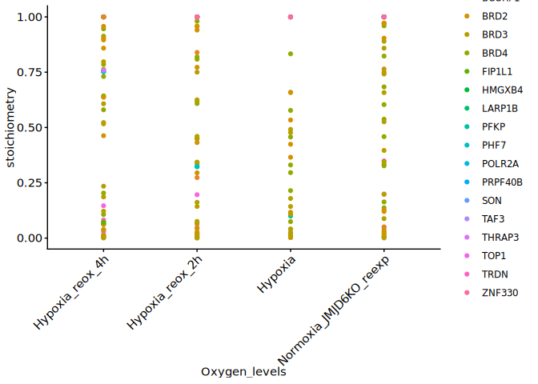
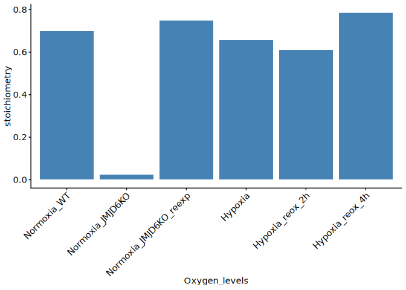

2-5. Lysine hydroxylations in hypoxia and normoxia
================
Yoichiro Sugimoto and Pallavi Kesavan
24 November, 2025

- [Environment setup](#environment-setup)
- [2.5.1 Install,load essential functions and
  libraries](#251-installload-essential-functions-and-libraries)
- [2.5.2 Import human protein reference
  data](#252-import-human-protein-reference-data)
- [2.5.3 Calculation of Stoichiometry with diagnostic ion in hypoxia and
  normoxia](#253-calculation-of-stoichiometry-with-diagnostic-ion-in-hypoxia-and-normoxia)
- [Session information](#session-information)

# Environment setup

``` r
## Initialize renv (first time only) - re-installed 24.09.2025
# Creates project specific library and renv.lock file. 
# Use 'renv::init(filepath)' to create project library
# renv::init(
#        "/fast/AG_Sugimoto/home/users/pallavi/projects/20241111_PTMs_in_lysine_rich_domains/R"
#    )

# Define project directory - contains the R scripts, data and result folders
 project.dir <-
  file.path(
    "/fast/AG_Sugimoto/home/users/pallavi/projects/20241111_PTMs_in_lysine_rich_domains"
)

# renv::snapshot(file.path(project.dir, "R"))

#renv::restore completed 24.09.2025
#renv::restore(file.path(project.dir, "R"))
```

# 2.5.1 Install,load essential functions and libraries

``` r
## Load all R scripts from the 'functions' folder into the current session
P2_functions <- sapply(list.files(file.path(project.dir, "R/functions"), pattern="*.R", full.names = TRUE), source)
```

    ## 
    ## Attaching package: 'dplyr'

    ## The following objects are masked from 'package:stats':
    ## 
    ##     filter, lag

    ## The following objects are masked from 'package:base':
    ## 
    ##     intersect, setdiff, setequal, union

    ## 
    ## Attaching package: 'data.table'

    ## The following objects are masked from 'package:dplyr':
    ## 
    ##     between, first, last

    ## Loading required package: BiocGenerics

    ## Loading required package: generics

    ## 
    ## Attaching package: 'generics'

    ## The following object is masked from 'package:dplyr':
    ## 
    ##     explain

    ## The following objects are masked from 'package:base':
    ## 
    ##     as.difftime, as.factor, as.ordered, intersect, is.element, setdiff,
    ##     setequal, union

    ## 
    ## Attaching package: 'BiocGenerics'

    ## The following object is masked from 'package:dplyr':
    ## 
    ##     combine

    ## The following objects are masked from 'package:stats':
    ## 
    ##     IQR, mad, sd, var, xtabs

    ## The following objects are masked from 'package:base':
    ## 
    ##     anyDuplicated, aperm, append, as.data.frame, basename, cbind,
    ##     colnames, dirname, do.call, duplicated, eval, evalq, Filter, Find,
    ##     get, grep, grepl, is.unsorted, lapply, Map, mapply, match, mget,
    ##     order, paste, pmax, pmax.int, pmin, pmin.int, Position, rank,
    ##     rbind, Reduce, rownames, sapply, saveRDS, table, tapply, unique,
    ##     unsplit, which.max, which.min

    ## Loading required package: S4Vectors

    ## Loading required package: stats4

    ## 
    ## Attaching package: 'S4Vectors'

    ## The following objects are masked from 'package:data.table':
    ## 
    ##     first, second

    ## The following objects are masked from 'package:dplyr':
    ## 
    ##     first, rename

    ## The following object is masked from 'package:utils':
    ## 
    ##     findMatches

    ## The following objects are masked from 'package:base':
    ## 
    ##     expand.grid, I, unname

    ## Loading required package: IRanges

    ## 
    ## Attaching package: 'IRanges'

    ## The following object is masked from 'package:data.table':
    ## 
    ##     shift

    ## The following objects are masked from 'package:dplyr':
    ## 
    ##     collapse, desc, slice

    ## Loading required package: XVector

    ## Loading required package: GenomeInfoDb

    ## 
    ## Attaching package: 'Biostrings'

    ## The following object is masked from 'package:base':
    ## 
    ##     strsplit

``` r
## Install private package 
# Install ptm.stiochiometry package
#install.packages("/fast/AG_Sugimoto/home/users/pallavi/projects/ptm.stoichiometry", repos = NULL, type = "source")

# Load Libraries
library("readxl")
library("janitor")
```

    ## 
    ## Attaching package: 'janitor'

    ## The following objects are masked from 'package:stats':
    ## 
    ##     chisq.test, fisher.test

``` r
library("ptm.stoichiometry")
```

# 2.5.2 Import human protein reference data

``` r
# Import human protein reference data from specified file path 
ref_protein_dt <- import_reference_fasta(file.path
("/fast/AG_Sugimoto/reference/uniprot/human", 
  "UP000005640_9606.fasta")) 
```

# 2.5.3 Calculation of Stoichiometry with diagnostic ion in hypoxia and normoxia

``` r
# Define path to data directory
data.dir <- file.path(project.dir, "data")
results.dir <- file.path(project.dir, "results")

# Load data into environment
MS_KR1_data <- file.path(
  project.dir,
  "data/MQ_with_DI/MS_KR_1" 
)

# Create file path for results
MS_KR_1_dir <- file.path(project.dir, "results", "p2-analysis-setting", "MS_KR_1")
dir.create(MS_KR_1_dir, recursive = TRUE)
```

    ## Warning in dir.create(MS_KR_1_dir, recursive = TRUE):
    ## '/fast/AG_Sugimoto/home/users/pallavi/projects/20241111_PTMs_in_lysine_rich_domains/results/p2-analysis-setting/MS_KR_1'
    ## already exists

``` r
# Define file path common PTM mapping file
ptm_mapping_file <- file.path(
  project.dir,
  "data/analysis_setting/ptm_replacement_de-propionylate_for_hydroxylysine.csv"
)
```

``` r
    # Define file path to MaxQuant evidence files
    mq_evidence_data <- file.path(MS_KR1_data, 
                                  "MS_KR_1_evidence.txt")
    
    # Print which sample id is being processed
    message("Processing: ", basename(mq_evidence_data)) 
```

    ## Processing: MS_KR_1_evidence.txt

``` r
   # Checks whether the sample ID has the corresponding evidence.txt file. If yes, then proceed
  if (file.exists(mq_evidence_data)) {
    
    # Locate and fetch all PTM site files within the ptm folder
    ptm_files <- list.files(file.path(
      MS_KR1_data, "ptm"), 
      full.names = TRUE)
    
    # Generate PTM names based on file names, add brackets and remove "Sites.txt"
    ptm_names <- paste0(
      "[", str_replace_all(basename(ptm_files), "Sites.txt", ""), "]"
    )
    
    # Run the stoichiometry calculation
    stoic.dt <- calculate_stoichiometry2(
      mq_evidence_data = mq_evidence_data,
      sample_info_file = file.path(
        MS_KR1_data,
        "sample_info.csv"
      ),
      ref_protein_dt = ref_protein_dt,
      ptm_files = ptm_files,
      ptm_names = ptm_names,
      output_prefix = file.path(MS_KR_1_dir, "MS_KR_1_"),
      ptm_mapping_file = ptm_mapping_file,
      K_only = FALSE,
      selected_type = "MULTI-MSMS",
      parse_protein_accession_function = NA
    )
  } else { # If evidence.txt does not exist, skip the function and print below message
    print(paste0("File does not exist: ", mq_evidence_data))
  }
  
  # Garbage collection - to free up memory
  gc()
```

    ##            used  (Mb) gc trigger  (Mb) max used  (Mb)
    ## Ncells  4296377 229.5    8171660 436.5  8171660 436.5
    ## Vcells 21529659 164.3   64859297 494.9 64859263 494.9

``` r
# Define function - 'read_stoic_data'
read_stoic_data <- function(prefix, pre_prefix, post_fix = "", dir_path){
  # Read csv file with defined file path,  
  dt <- fread(file.path(dir_path, paste0(pre_prefix, prefix, "PTM_stoichiometry", post_fix, ".csv"))) 
  dt[, condition := gsub("_$", "", prefix)] # Removes '_' at the end of the prefix and creates a new column called condiiton
  return(dt)
}

## Read stoichiometry data for MS_KR1 data 
MS_KR1_stoic_dt <- read_stoic_data(
  prefix = "MS_KR_1_",
  pre_prefix = "",
  post_fix = "_DI",
  dir_path = file.path(results.dir, "p2-analysis-setting", "MS_KR_1"))


#Filter data table with presence of diagnostic_peak and WT stoichiometry values
MS_KR1_stoic_dt[, `:=`(
  is_diagnostic_peak = diagnostic_peak == "+" 
)]

all.protein.bs <- Biostrings::readAAStringSet(
  file.path(
    "/fast/AG_Sugimoto/reference/uniprot/human",
    "UP000005640_9606.fasta"
  )
)

MS_KR1_stoic_dt[, `:=`(
  Oxygen_levels = fcase(
    grepl("^HeLaWT_NA_N_NA", sample_name), "Normoxia_WT",
    grepl("^HeLaiJMJD6_noDox_N_NA", sample_name), "Normoxia_JMJD6KO",
    grepl("^HeLaiJMJD6_Dox_01O224h_N2h", sample_name), "Hypoxia_reox_2h",
    grepl("^HeLaiJMJD6_Dox_01O224h_N4h", sample_name), "Hypoxia_reox_4h", 
    grepl("^HeLaiJMJD6_Dox_01O224h_NA", sample_name), "Hypoxia", 
    grepl("^HeLaiJMJD6_Dox_N_NA", sample_name), "Normoxia_JMJD6KO_reexp", 
    default = NA_character_
  ) %>% factor(levels = c("Normoxia_WT", "Normoxia_JMJD6KO", "Normoxia_JMJD6KO_reexp", "Hypoxia", "Hypoxia_reox_2h", "Hypoxia_reox_4h"))
)]

MS_KR1_stoic_dt[, `:=`(
  sample_name =  
    factor(sample_name, levels = c("HeLaWT_NA_N_NA", "HeLaiJMJD6_noDox_N_NA", "HeLaiJMJD6_Dox_N_NA", "HeLaiJMJD6_Dox_01O224h_NA", "HeLaiJMJD6_Dox_01O224h_N2h", "HeLaiJMJD6_Dox_01O224h_N4h"))
)]


# BRD4 
plot_ptm_stoichiometry(
  MS_KR1_stoic_dt[sample_name %in% c("HeLaWT_NA_N_NA","HeLaiJMJD6_noDox_N_NA", "HeLaiJMJD6_Dox_N_NA", "HeLaiJMJD6_Dox_01O224h_NA")], accession = "O60885", plot_range = c(531, 581), all.protein.bs, sample_colors = NA,
  )
```

<!-- --><!-- -->

``` r
# BRD3
plot_ptm_stoichiometry(
  MS_KR1_stoic_dt[sample_name %in% c("HeLaWT_NA_N_NA","HeLaiJMJD6_noDox_N_NA", "HeLaiJMJD6_Dox_N_NA", "HeLaiJMJD6_Dox_01O224h_NA")], accession = "Q15059", plot_range = c(483, 533), all.protein.bs, sample_colors = NA
  )
```

<!-- --><!-- -->

``` r
# BRD2
plot_ptm_stoichiometry(
  MS_KR1_stoic_dt[sample_name %in% c("HeLaWT_NA_N_NA","HeLaiJMJD6_noDox_N_NA", "HeLaiJMJD6_Dox_N_NA", "HeLaiJMJD6_Dox_01O224h_NA")], accession = "P25440", plot_range = c(540, 590), all.protein.bs, sample_colors = NA
  )
```

<!-- --><!-- -->

``` r
MS_KR1_stoic_dt[, stoic_bin := case_when(
  stoichiometry < 0.10 ~ "low",
  between(stoichiometry, 0.10, 0.50) ~ "middle",
  stoichiometry > 0.50 ~ "high"
)]


# Plot 
ggplot(
  data = MS_KR1_stoic_dt[sample_name %in% c("HeLaiJMJD6_Dox_N_NA", "HeLaiJMJD6_Dox_01O224h_NA","HeLaiJMJD6_Dox_01O224h_N2h", "HeLaiJMJD6_Dox_01O224h_N4h") & diagnostic_peak == "+"],
  aes(
    x = Oxygen_levels,
    y = stoichiometry,
    color = gene_name
  )
) +
  geom_point() +
  theme(axis.text.x = element_text(angle = 45, hjust = 1))
```

<!-- -->

``` r
ggplot(
  data = MS_KR1_stoic_dt[gene_name == "BRD4" & diagnostic_peak == "+" & aa_pos == 538],
  aes(
    x = Oxygen_levels,
    y = stoichiometry,
  )
) +
  geom_col(fill = "steelblue") +
  theme(axis.text.x = element_text(angle = 45, hjust = 1))
```

<!-- -->

# Session information

``` r
sessioninfo::session_info()
```

    ## ─ Session info ───────────────────────────────────────────────────────────────
    ##  setting  value
    ##  version  R version 4.5.1 (2025-06-13)
    ##  os       Ubuntu 24.04.2 LTS
    ##  system   x86_64, linux-gnu
    ##  ui       X11
    ##  language (EN)
    ##  collate  C.UTF-8
    ##  ctype    C.UTF-8
    ##  tz       Europe/Berlin
    ##  date     2025-11-24
    ##  pandoc   3.4 @ /usr/lib/rstudio-server/bin/quarto/bin/tools/x86_64/ (via rmarkdown)
    ##  quarto   1.6.42 @ /usr/lib/rstudio-server/bin/quarto/bin/quarto
    ## 
    ## ─ Packages ───────────────────────────────────────────────────────────────────
    ##  package           * version    date (UTC) lib source
    ##  BiocGenerics      * 0.54.0     2025-04-15 [1] Bioconduc~
    ##  Biostrings        * 2.76.0     2025-04-15 [1] Bioconduc~
    ##  bit                 4.6.0      2025-03-06 [1] CRAN (R 4.5.1)
    ##  bit64               4.6.0-1    2025-01-16 [1] CRAN (R 4.5.1)
    ##  cellranger          1.1.0      2016-07-27 [1] CRAN (R 4.5.1)
    ##  cli                 3.6.5      2025-04-23 [1] CRAN (R 4.5.1)
    ##  crayon              1.5.3      2024-06-20 [1] CRAN (R 4.5.1)
    ##  data.table        * 1.17.8     2025-07-10 [1] CRAN (R 4.5.1)
    ##  digest              0.6.37     2024-08-19 [1] CRAN (R 4.5.1)
    ##  dplyr             * 1.1.4      2023-11-17 [1] CRAN (R 4.5.1)
    ##  evaluate            1.0.5      2025-08-27 [1] CRAN (R 4.5.1)
    ##  farver              2.1.2      2024-05-13 [1] CRAN (R 4.5.1)
    ##  fastmap             1.2.0      2024-05-15 [1] CRAN (R 4.5.1)
    ##  generics          * 0.1.4      2025-05-09 [1] CRAN (R 4.5.1)
    ##  GenomeInfoDb      * 1.44.3     2025-09-21 [1] Bioconduc~
    ##  GenomeInfoDbData    1.2.14     2025-09-24 [1] Bioconductor
    ##  ggplot2           * 4.0.0      2025-09-11 [1] CRAN (R 4.5.1)
    ##  glue                1.8.0      2024-09-30 [1] CRAN (R 4.5.1)
    ##  gtable              0.3.6      2024-10-25 [1] CRAN (R 4.5.1)
    ##  htmltools           0.5.8.1    2024-04-04 [1] CRAN (R 4.5.1)
    ##  httr                1.4.7      2023-08-15 [1] CRAN (R 4.5.1)
    ##  IRanges           * 2.42.0     2025-04-15 [1] Bioconduc~
    ##  janitor           * 2.2.1      2024-12-22 [1] CRAN (R 4.5.1)
    ##  jsonlite            2.0.0      2025-03-27 [1] CRAN (R 4.5.1)
    ##  khroma            * 1.16.0     2025-02-25 [1] CRAN (R 4.5.1)
    ##  knitr             * 1.50       2025-03-16 [1] CRAN (R 4.5.1)
    ##  labeling            0.4.3      2023-08-29 [1] CRAN (R 4.5.1)
    ##  lifecycle           1.0.4      2023-11-07 [1] CRAN (R 4.5.1)
    ##  lubridate           1.9.4      2024-12-08 [1] CRAN (R 4.5.1)
    ##  magrittr          * 2.0.4      2025-09-12 [1] CRAN (R 4.5.1)
    ##  patchwork           1.3.2      2025-08-25 [1] CRAN (R 4.5.1)
    ##  pillar              1.11.1     2025-09-17 [1] CRAN (R 4.5.1)
    ##  pkgconfig           2.0.3      2019-09-22 [1] CRAN (R 4.5.1)
    ##  ptm.stoichiometry * 0.0.0.9000 2025-11-07 [1] local
    ##  R6                  2.6.1      2025-02-15 [1] CRAN (R 4.5.1)
    ##  RColorBrewer        1.1-3      2022-04-03 [1] CRAN (R 4.5.1)
    ##  readxl            * 1.4.5      2025-03-07 [1] CRAN (R 4.5.1)
    ##  rlang               1.1.6      2025-04-11 [1] CRAN (R 4.5.1)
    ##  rmarkdown           2.29       2024-11-04 [1] CRAN (R 4.5.1)
    ##  S4Vectors         * 0.46.0     2025-04-15 [1] Bioconduc~
    ##  S7                  0.2.0      2024-11-07 [1] CRAN (R 4.5.1)
    ##  scales              1.4.0      2025-04-24 [1] CRAN (R 4.5.1)
    ##  sessioninfo         1.2.3      2025-02-05 [1] CRAN (R 4.5.1)
    ##  snakecase           0.11.1     2023-08-27 [1] CRAN (R 4.5.1)
    ##  stringi             1.8.7      2025-03-27 [1] CRAN (R 4.5.1)
    ##  stringr           * 1.5.2      2025-09-08 [1] CRAN (R 4.5.1)
    ##  tibble              3.3.0      2025-06-08 [1] CRAN (R 4.5.1)
    ##  tidyselect          1.2.1      2024-03-11 [1] CRAN (R 4.5.1)
    ##  timechange          0.3.0      2024-01-18 [1] CRAN (R 4.5.1)
    ##  UCSC.utils          1.4.0      2025-04-15 [1] Bioconduc~
    ##  vctrs               0.6.5      2023-12-01 [1] CRAN (R 4.5.1)
    ##  withr               3.0.2      2024-10-28 [1] CRAN (R 4.5.1)
    ##  xfun                0.53       2025-08-19 [1] CRAN (R 4.5.1)
    ##  XVector           * 0.48.0     2025-04-15 [1] Bioconduc~
    ##  yaml                2.3.10     2024-07-26 [1] CRAN (R 4.5.1)
    ## 
    ##  [1] /home/pkesava/R/x86_64-pc-linux-gnu-library/4.5
    ##  [2] /usr/local/lib/R/site-library
    ##  [3] /usr/lib/R/site-library
    ##  [4] /usr/lib/R/library
    ##  * ── Packages attached to the search path.
    ## 
    ## ──────────────────────────────────────────────────────────────────────────────
