2-8. Lysine hydroxylations in varying O2 pc and dox induction time -
data visualisation
================
Yoichiro Sugimoto and Pallavi Kesavan
13 March, 2026

- [Overview](#overview)
- [Environment setup](#environment-setup)
- [2.8.1 Install,load essential functions and
  libraries](#281-installload-essential-functions-and-libraries)
- [2.8.2 Import human protein reference
  data](#282-import-human-protein-reference-data)
- [2.8.3 Defining functions and data
  preprocessing](#283-defining-functions-and-data-preprocessing)
- [2.8.4 Plotting raw stoichiometry values of normoxia data with
  re-expression of
  JMJD6](#284-plotting-raw-stoichiometry-values-of-normoxia-data-with-re-expression-of-jmjd6)
- [2.8.5 Plotting raw stoichiometry values of normoxia and hypoxia data
  with re-expression of
  JMJD6](#285-plotting-raw-stoichiometry-values-of-normoxia-and-hypoxia-data-with-re-expression-of-jmjd6)
- [2.8.6 Plotting Stoichiometry values of hypoxia and normoxia data with
  re-expression of JMJD6 (+ diagnostic
  ion)](#286-plotting-stoichiometry-values-of-hypoxia-and-normoxia-data-with-re-expression-of-jmjd6--diagnostic-ion)
- [2.8.7 XIC values against MS_SS, MS_KR_1 and PNAS stoichiometry
  data.](#287-xic-values-against-ms_ss-ms_kr_1-and-pnas-stoichiometry-data)
- [2.8.8 Oxygen sensitivity - Comparing hypoxia stoichiometry under
  varying dox incubation (+ diagnostic
  ion)](#288-oxygen-sensitivity---comparing-hypoxia-stoichiometry-under-varying-dox-incubation--diagnostic-ion)
- [2.8.9 Oxygen sensitivity - Comparing hypoxia stoichiometry under
  varying dox incubation - Re-exp J6 (+ diagnostic
  ion)](#289-oxygen-sensitivity---comparing-hypoxia-stoichiometry-under-varying-dox-incubation---re-exp-j6--diagnostic-ion)
- [2.8.10 Oxygen sensitivity - Comparing hypoxia stoichiometry vs
  normoxia stoichiometry (+ diagnostic
  ion)](#2810-oxygen-sensitivity---comparing-hypoxia-stoichiometry-vs-normoxia-stoichiometry--diagnostic-ion)
- [2.8.11 Comparing hypoxia stoichiometry under varying dox incubation
  (+ diagnostic
  ion)](#2811-comparing-hypoxia-stoichiometry-under-varying-dox-incubation--diagnostic-ion)
- [Session information](#session-information)

# Overview

This script examines the oxygen sensitivity of lysine hydroxylations in
BRD proteins and their respective sites. This script is for visualizing
the calculated stoichiometry.

# Environment setup

``` r
## Initialize renv (first time only) - re-installed 24.09.2025
# Creates project specific library and renv.lock file. 
# Use 'renv::init(filepath)' to create project library
# renv::init(
#        "/fast/AG_Sugimoto/home/users/pallavi/projects/20241111_PTMs_in_lysine_rich_domains/R"
#    )

# Define project directory - contains the R scripts, data and result folders
project.dir <-
  file.path(
    "/fast/AG_Sugimoto/home/users/pallavi/projects/20241111_PTMs_in_lysine_rich_domains"
  )

# renv::snapshot(file.path(project.dir, "R"))

#renv::restore completed 24.09.2025
#renv::restore(file.path(project.dir, "R"))
```

# 2.8.1 Install,load essential functions and libraries

``` r
## Load all R scripts from the 'functions' folder into the current session
P2_functions <- sapply(list.files
                       (file.path(project.dir, "R/functions"), 
                         pattern="*.R", 
                         full.names = TRUE), 
                       source)
```

    ## 
    ## Attaching package: 'dplyr'

    ## The following objects are masked from 'package:stats':
    ## 
    ##     filter, lag

    ## The following objects are masked from 'package:base':
    ## 
    ##     intersect, setdiff, setequal, union

    ## 
    ## Attaching package: 'data.table'

    ## The following objects are masked from 'package:dplyr':
    ## 
    ##     between, first, last

    ## Loading required package: BiocGenerics

    ## Loading required package: generics

    ## 
    ## Attaching package: 'generics'

    ## The following object is masked from 'package:dplyr':
    ## 
    ##     explain

    ## The following objects are masked from 'package:base':
    ## 
    ##     as.difftime, as.factor, as.ordered, intersect, is.element, setdiff,
    ##     setequal, union

    ## 
    ## Attaching package: 'BiocGenerics'

    ## The following object is masked from 'package:dplyr':
    ## 
    ##     combine

    ## The following objects are masked from 'package:stats':
    ## 
    ##     IQR, mad, sd, var, xtabs

    ## The following objects are masked from 'package:base':
    ## 
    ##     anyDuplicated, aperm, append, as.data.frame, basename, cbind,
    ##     colnames, dirname, do.call, duplicated, eval, evalq, Filter, Find,
    ##     get, grep, grepl, is.unsorted, lapply, Map, mapply, match, mget,
    ##     order, paste, pmax, pmax.int, pmin, pmin.int, Position, rank,
    ##     rbind, Reduce, rownames, sapply, saveRDS, table, tapply, unique,
    ##     unsplit, which.max, which.min

    ## Loading required package: S4Vectors

    ## Loading required package: stats4

    ## 
    ## Attaching package: 'S4Vectors'

    ## The following objects are masked from 'package:data.table':
    ## 
    ##     first, second

    ## The following objects are masked from 'package:dplyr':
    ## 
    ##     first, rename

    ## The following object is masked from 'package:utils':
    ## 
    ##     findMatches

    ## The following objects are masked from 'package:base':
    ## 
    ##     expand.grid, I, unname

    ## Loading required package: IRanges

    ## 
    ## Attaching package: 'IRanges'

    ## The following object is masked from 'package:data.table':
    ## 
    ##     shift

    ## The following objects are masked from 'package:dplyr':
    ## 
    ##     collapse, desc, slice

    ## Loading required package: XVector

    ## Loading required package: GenomeInfoDb

    ## 
    ## Attaching package: 'Biostrings'

    ## The following object is masked from 'package:base':
    ## 
    ##     strsplit

``` r
## Install private package 
# Install ptm.stiochiometry package
# install.packages("/fast/AG_Sugimoto/home/users/pallavi/projects/ptm.stoichiometry", repos = NULL, type = "source")

# Load Libraries
library("readxl")
library("janitor")
```

    ## 
    ## Attaching package: 'janitor'

    ## The following objects are masked from 'package:stats':
    ## 
    ##     chisq.test, fisher.test

``` r
library("ptm.stoichiometry")


# install "gt" package
install.packages("gt")
```

    ## Installing package into '/home/pkesava/R/x86_64-pc-linux-gnu-library/4.5'
    ## (as 'lib' is unspecified)

``` r
library("gt")
```

# 2.8.2 Import human protein reference data

``` r
# Import human protein reference data from specified file path 
ref_protein_dt <- import_reference_fasta(file.path
                                         ("/fast/AG_Sugimoto/reference/uniprot/human", 
                                           "UP000005640_9606.fasta")) 
```

``` r
# Define path to data directory
data.dir <- file.path(project.dir, "data")
results.dir <- file.path(project.dir, "results")

#Create p1 results directory
p2_MS_SS_KR <- file.path(results.dir, "p2_MS_SS_KR")
# create.dirs(c(results.dir, p2_MS_SS_KR))
```

# 2.8.3 Defining functions and data preprocessing

``` r
# Read FASTA data 
all.protein.bs <- Biostrings::readAAStringSet(
  file.path(
    "/fast/AG_Sugimoto/reference/uniprot/human",
    "UP000005640_9606.fasta"
  )
)

# Define function - 'read_stoic_data'
read_stoic_data <- function(prefix, pre_prefix, post_fix = "", dir_path){
  # Read csv file with defined file path,  
  dt <- fread(file.path(dir_path, paste0(pre_prefix, prefix, "PTM_stoichiometry", post_fix, ".csv"))) 
  dt[, condition := gsub("_$", "", prefix)] # Removes '_' at the end of the prefix and creates a new column called condition
  return(dt)
}

#-------------------------------------
# Contrast function - by sample group
#-------------------------------------

contrast_hydroxylation_by_sample_group<- function(all_stoic_dt){
  wt_ko_dt <- all_stoic_dt
  
  # Add new columns into metadata
  wt_ko_dt[, `:=`(
    pos_id = paste0(protein_accession, "_", aa_pos), 
    sample_pos_id = paste0(sample_group, "_", protein_accession, "_", aa_pos)
  )]
  
  # Identify position with at least one oxidation event
  oxidation_ids <- wt_ko_dt[
    grepl("[Oxidation (K)]", ptm, fixed = TRUE), # checks for oxidation event
    unique(pos_id) # Returns unique pos_id with oxidation event
  ]
  oxidation_sample_ids <- wt_ko_dt[
    grepl("[Oxidation (K)]", ptm, fixed = TRUE),
    unique(sample_pos_id)
  ]
  
  # Collect non hydroxylated K information for the sites with hydroxylation
  no_hydroxyK_dt <- copy(wt_ko_dt[aa == "K"])
  no_hydroxyK_dt <- no_hydroxyK_dt[pos_id %in% oxidation_ids] %>%
    {.[!sample_pos_id %in% oxidation_sample_ids]} # If hydroxylation data exist, this is not necessary
  
  # Set stoichiometry and PSM count to zero for these positions and update the PTM label
  no_hydroxyK_dt[, `:=`(
    sum_psm_mapped = 0,
    stoichiometry = 0,
    ptm = "[Oxidation (K)]"
  )]
  
  # Combine oxidation data from both original and the newly flagged unmodified K data
  hydroxyK_dt <- rbind(
    wt_ko_dt[grepl("[Oxidation (K)]", ptm, fixed = TRUE)],
    no_hydroxyK_dt
  )
  
  # Filter psm mapped greater than 2 for higher confidence 
  hydroxyK_dt <- hydroxyK_dt[
    sum_psm_mapped_per_position > 2
  ]
  
  # Sort stoichiometry column from highest to lowest
  hydroxyK_dt <- hydroxyK_dt[order(stoichiometry, decreasing = TRUE)][
    !duplicated(paste0(protein_accession, gene_name, aa_pos, sample_group)) # Remove duplicate rows
  ]
  
  # Reshape 'd.hydroxyK_dt' from long to wide based on stoichiometry values  
  d.hydroxyK_dt <- dcast(
    hydroxyK_dt,
    protein_accession + gene_name + aa_pos ~ sample_group, # values in oxygen_stat become into separate columns (Normoxia & Hypoxia)
    value.var = "stoichiometry"
  )
  
  return(d.hydroxyK_dt)
}
```

``` r
#-----------------------------
# Load MS_KR_1 stoichiometry data
#-----------------------------

## Read stoichiometry data for MS_KR1 data (noH2O loss)
 MS_KR1_stoic_dt <- read_stoic_data(
  prefix = "MS_KR_1_noH2O_",
  pre_prefix = "",
  post_fix = "_DI",
  dir_path = file.path(results.dir, "p2-analysis-setting", "MS_KR_1_noH2O"))


# Create a logical column for diagnostic peak. For rows where diagnostic peak is 
# present "+", logical vector is "TRUE", or else "FALSE"
MS_KR1_stoic_dt[, `:=`(
  is_diagnostic_peak = diagnostic_peak == "+" 
)]

#-----------------------------
# Load MS_SS stoichiometry data
#-----------------------------

## Read stoichiometry data for MS_SS data 
 MS_SS_stoic_dt <- read_stoic_data(
  prefix = "MS_SS_",
  pre_prefix = "",
  post_fix = "_DI",
  dir_path = file.path(results.dir, "p2-analysis-setting", "MS_SS_noH2O"))

 #[Oxidation (K)] 

# Create a logical column for diagnostic peak. For rows where diagnostic peak is 
# present "+", logical vector is "TRUE", or else "FALSE"
MS_SS_stoic_dt[, `:=`(
  is_diagnostic_peak = diagnostic_peak == "+" 
)]

#--------------------------------------------------------------
# Load PNAS stoichiometry data analysed by MaxQuant (dataset A)
#--------------------------------------------------------------

 pnas2022_stoic_dt <- read_stoic_data(
  prefix = "DI_noH2O_data-A_trp_m7_v7_def_",
  pre_prefix = "",
  post_fix = "_DI",
  dir_path = file.path(results.dir, "p2-analysis-setting", "MQ_DI_noH2O"))

# Create a logical column for diagnostic peak. For rows where diagnostic peak is 
# present "+", logical vector is "TRUE", or else "FALSE"
pnas2022_stoic_dt[, `:=`(
  is_diagnostic_peak = diagnostic_peak == "+" 
)]
```

``` r
# Filter MS_KR_1 data to retain only BRD2, 3, 4 data
MS_KR1_BRD_dt <- MS_KR1_stoic_dt[
  gene_name %in% c("BRD2", "BRD3", "BRD4")
]

# Filter MS_SS data to retain only BRD2, 3, 4 data 
MS_SS_BRD_dt <-  MS_SS_stoic_dt[
  gene_name %in% c("BRD2", "BRD3", "BRD4")
]

# Filter PNAS2022 data to retain only BRD2, 3, 4 data 
pnas2022_BRD_dt <-  pnas2022_stoic_dt[
  gene_name %in% c("BRD2", "BRD3", "BRD4")
]


# Convert data table into publication ready 
MS_KR1_gt_dt <- gt(MS_KR1_BRD_dt)
MS_SS_gt_dt <- gt(MS_SS_BRD_dt)

# Combine MS_KR1_subset_dt and MS_SS_all_dt data
MS_SS_KR_PNAS_dt <- rbindlist(list(MS_SS_BRD_dt,
                         MS_KR1_BRD_dt,
                         pnas2022_BRD_dt),
                         use.names = TRUE)

# Remove BRD2/3 samples reporting BRD4 stoichiomtery and vice versa
# These samples are removed as it could be false positives reported by the system 
MS_SS_KR_PNAS_dt <- MS_SS_KR_PNAS_dt[
  !((grepl("_BRD23$", sample_name) & gene_name == "BRD4") |
       (grepl("_BRD4$", sample_name) & gene_name %in% c("BRD2", "BRD3")))
]

# Column "sample group" created to simplify sample names
MS_SS_KR_PNAS_dt[, `:=`(
  sample_group = case_when(
    condition == "MS_SS" & grepl("minusDox", sample_name) ~ paste0("iJ6_0h_21pc_SS"),
    condition == "MS_SS"~ paste0("iJ6_", str_split_fixed(sample_name, "_", 3)[, 1], "_", str_split_fixed(sample_name, "_", 3)[, 2], "_SS"),
    sample_name == "HeLaiJMJD6_noDox_N_NA" ~ "iJ6_0h_21pc_KR",
    sample_name == "HeLaiJMJD6_Dox_N_NA" ~ "iJ6_24h_21pc_KR",
    sample_name == "HeLaWT_NA_N_NA" ~ "WT_Inf_21pc_KR", 
    sample_name == "HeLaiJMJD6_Dox_01O224h_NA" ~ "iJ6_24h_01pc_KR",
    sample_name == "JQ1_HeLaWT_derivatised" ~ "WT_Inf_21pc_PNAS", 
    sample_name == "JQ1_HeLaJMJD6KO_derivatised" ~ "iJ6_Inf_21pc_PNAS"
  )
)]
```

# 2.8.4 Plotting raw stoichiometry values of normoxia data with re-expression of JMJD6

``` r
# Plotting stoichiometry of BRD proteins in different O2% 
# Note: the amino acid region of the proteins is that of the ones represented 
# in the PNAS2022 paper. 

# subset data to specific BRD2 protein
MS_SS_KR_PNAS_BRD2_dt <- MS_SS_KR_PNAS_dt[grepl("Inf|0h|4h|8h|18h|24h", sample_group) & 
                                            grepl("21pc", sample_group) & 
                                            !sample_name %in% c("minusDox_BRD23", "JQ1_HeLaWT_derivatised", "JQ1_HeLaJMJD6KO_derivatised") & 
                                            gene_name == "BRD2"]


# reorder sample names
MS_SS_KR_PNAS_BRD2_dt <-  MS_SS_KR_PNAS_BRD2_dt[, sample_name := factor(
  sample_name, 
  levels = c("HeLaWT_NA_N_NA",
             "HeLaiJMJD6_noDox_N_NA",
             "4h_21pc_BRD23",
             "8h_21pc_BRD23",
             "18h_21pc_BRD23",
             "HeLaiJMJD6_Dox_N_NA")
)
  ]

#accession = "P25440", plot_range = c(540, 590) BRD2
plot_ptm_stoichiometry(
  MS_SS_KR_PNAS_BRD2_dt,
  accession = "P25440",
  plot_range = c(540, 590), 
  all.protein.bs, 
  sample_colors = NA,
)
```

<!-- --><!-- -->

``` r
MS_SS_KR_PNAS_BRD2 <- MS_SS_KR_PNAS_BRD2_dt[is_diagnostic_peak == TRUE & aa == "K"]

# Write to csv table to identify "K" with DI 
fwrite(MS_SS_KR_PNAS_BRD2, file.path(results.dir, "p2_MS_SS_KR", "MS_SS_KR_PNAS_BRD2.csv"))
```

``` r
# subset data to specific BRD3 protein
MS_SS_KR_PNAS_BRD3_dt <- MS_SS_KR_PNAS_dt[grepl("Inf|0h|4h|8h|18h|24h", sample_group) & 
                                            grepl("21pc", sample_group) & 
                                            !sample_name %in% c("minusDox_BRD23", "JQ1_HeLaWT_derivatised", "JQ1_HeLaJMJD6KO_derivatised")&
                                            gene_name == "BRD3"]


MS_SS_KR_PNAS_BRD3_dt <-  MS_SS_KR_PNAS_BRD3_dt[, sample_name := factor(
  sample_name, 
  levels = c("HeLaWT_NA_N_NA",
             "HeLaiJMJD6_noDox_N_NA",
             "4h_21pc_BRD23",
             "8h_21pc_BRD23",
             "18h_21pc_BRD23",
             "HeLaiJMJD6_Dox_N_NA")
)
  ]

# accession = "Q15059", plot_range = c(483, 533) BRD3
plot_ptm_stoichiometry(
  MS_SS_KR_PNAS_BRD3_dt,
  accession = "Q15059",
  plot_range = c(483, 533), 
  all.protein.bs, 
  sample_colors = NA,
)
```

<!-- -->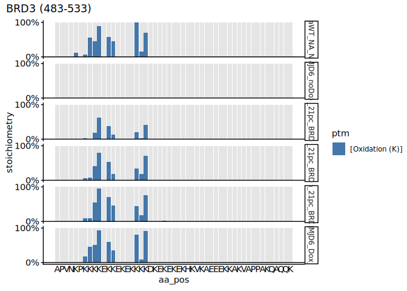<!-- -->

``` r
MS_SS_KR_PNAS_BRD3 <- MS_SS_KR_PNAS_BRD3_dt[is_diagnostic_peak == TRUE & aa == "K"]

# Write to csv table to identify "K" with DI 
fwrite(MS_SS_KR_PNAS_BRD3, file.path(results.dir, "p2_MS_SS_KR", "MS_SS_KR_PNAS_BRD3.csv"))
```

``` r
# subset data to specific BRD4 protein
MS_SS_KR_PNAS_BRD4_dt <- MS_SS_KR_PNAS_dt[grepl("Inf|0h|4h|8h|18h|24h", sample_group) & 
                                            grepl("21pc", sample_group) & 
                                            !sample_name %in% c("minusDox_BRD4", "JQ1_HeLaWT_derivatised", "JQ1_HeLaJMJD6KO_derivatised")&
                                            gene_name == "BRD4"]


# reorder sample names
MS_SS_KR_PNAS_BRD4_dt <-  MS_SS_KR_PNAS_BRD4_dt[, sample_name := factor(
  sample_name, 
  levels = c("HeLaWT_NA_N_NA",
             "HeLaiJMJD6_noDox_N_NA",
             "4h_21pc_BRD4",
             "8h_21pc_BRD4",
             "18h_21pc_BRD4",
             "HeLaiJMJD6_Dox_N_NA")
)
  ]

# accession = "O60885", plot_range = c(531, 581) BRD4 
plot_ptm_stoichiometry(
  MS_SS_KR_PNAS_BRD4_dt,
  accession = "O60885",
  plot_range = c(531, 581), 
  all.protein.bs, 
  sample_colors = NA,
)
```

<!-- --><!-- -->

``` r
MS_SS_KR_PNAS_BRD4 <- MS_SS_KR_PNAS_BRD4_dt[is_diagnostic_peak == TRUE & aa == "K"]

# Write to csv table to identify "K" with DI 
fwrite(MS_SS_KR_PNAS_BRD4, file.path(results.dir, "p2_MS_SS_KR", "MS_SS_KR_PNAS_BRD4.csv"))
```

# 2.8.5 Plotting raw stoichiometry values of normoxia and hypoxia data with re-expression of JMJD6

``` r
# Plotting stoichiometry of BRD proteins in different O2% 
# Note: the amino acid region of the proteins is that of the ones represented in the PNAS2022 paper. 

# HeLaWT_NA_N_NA - WT_Inf_21pc_KR
# JQ1_HeLaWT_derivatised - WT_Inf_21pc_PNAS
# JQ1_HeLaJMJD6KO_derivatised - iJ6_Inf_21pc_PNAS
# HeLaiJMJD6_Dox_N_NA - iJ6_24h_21pc_KR
# 18h_4pc_BRD23 - iJ6_18h_4pc_SS
# 18h_1pc_BRD23 - iJ6_18h_1pc_SS
# HeLaiJMJD6_Dox_01O224h_NA - iJ6_24h_01pc_KR
# minusDox_BRD23 - iJ6_0h_21pc_SS
# HeLaiJMJD6_noDox_N_NA - iJ6_0h_21pc_KR


# HeLaWT_NA_N_NA - WT_Inf_21pc_KR
# JQ1_HeLaWT_derivatised - WT_Inf_21pc_PNAS
# JQ1_HeLaJMJD6KO_derivatised - iJ6_Inf_21pc_PNAS
# HeLaiJMJD6_Dox_N_NA - iJ6_24h_21pc_KR
# 18h_4pc_BRD23 - iJ6_18h_4pc_SS
# 18h_1pc_BRD23 - iJ6_18h_1pc_SS
# HeLaiJMJD6_Dox_01O224h_NA - iJ6_24h_01pc_KR
# HeLaiJMJD6_noDox_N_NA - iJ6_0h_21pc_KR

#------
# BRD2
#------
# subset data to specific BRD protein
MS_SS_KR_PNAS_BRD2_O2pc_dt <- MS_SS_KR_PNAS_dt[
  grepl("Inf|18h|24h|0h", sample_group) & 
    !sample_name %in% c("minusDox_BRD23", "18h_21pc_BRD23","HeLaiJMJD6_noDox_N_NA", "JQ1_HeLaWT_derivatised", "JQ1_HeLaJMJD6KO_derivatised") & 
    gene_name == "BRD2"]

# reorder sample names
MS_SS_KR_PNAS_BRD2_O2pc_dt <-  MS_SS_KR_PNAS_BRD2_O2pc_dt[, sample_name := factor(
  sample_name, 
  levels = c("HeLaWT_NA_N_NA",
             "HeLaiJMJD6_Dox_N_NA",
             "18h_4pc_BRD23",
             "18h_1pc_BRD23",
             "HeLaiJMJD6_Dox_01O224h_NA")
)
]

#accession = "P25440", plot_range = c(540, 590) BRD2
plot_ptm_stoichiometry(
  MS_SS_KR_PNAS_BRD2_O2pc_dt,
  accession = "P25440",
  plot_range = c(540, 590), 
  all.protein.bs, 
  sample_colors = NA,
)
```

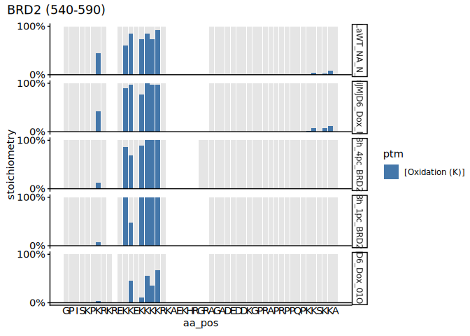<!-- --><!-- -->

``` r
MS_SS_KR_PNAS_BRD2_O2pc <- MS_SS_KR_PNAS_BRD2_O2pc_dt[is_diagnostic_peak == TRUE & aa == "K"]

# Write to csv table to identify "K" with DI 
fwrite(MS_SS_KR_PNAS_BRD2_O2pc, file.path(results.dir, "p2_MS_SS_KR", "MS_SS_KR_PNAS_BRD2_O2pc.csv"))
```

``` r
#------
# BRD3
#------
# subset data to specific BRD protein
MS_SS_KR_PNAS_BRD3_O2pc_dt <- MS_SS_KR_PNAS_dt[
  grepl("Inf|18h|24h|0h", sample_group) & 
    !sample_name %in% c("minusDox_BRD23", "18h_21pc_BRD23","HeLaiJMJD6_noDox_N_NA", "JQ1_HeLaWT_derivatised", "JQ1_HeLaJMJD6KO_derivatised") & 
    gene_name == "BRD3"]


# reorder sample names
MS_SS_KR_PNAS_BRD3_O2pc_dt <-  MS_SS_KR_PNAS_BRD3_O2pc_dt[, sample_name := factor(
  sample_name, 
  levels = c("HeLaWT_NA_N_NA",
             "HeLaiJMJD6_Dox_N_NA",
             "18h_4pc_BRD23",
             "18h_1pc_BRD23",
             "HeLaiJMJD6_Dox_01O224h_NA")
)
]


# accession = "Q15059", plot_range = c(483, 533) BRD3
plot_ptm_stoichiometry(
  MS_SS_KR_PNAS_BRD3_O2pc_dt,
  accession = "Q15059",
  plot_range = c(483, 533), 
  all.protein.bs, 
  sample_colors = NA,
)
```

<!-- --><!-- -->

``` r
MS_SS_KR_PNAS_BRD3_O2pc <- MS_SS_KR_PNAS_BRD3_O2pc_dt[is_diagnostic_peak == TRUE & aa == "K"]

# Write to csv table to identify "K" with DI 
fwrite(MS_SS_KR_PNAS_BRD3_O2pc, file.path(results.dir, "p2_MS_SS_KR", "MS_SS_KR_PNAS_BRD3_O2pc.csv"))
```

``` r
#------
# BRD4
#------

# subset data to specific BRD protein
MS_SS_KR_PNAS_BRD4_O2pc_dt <- MS_SS_KR_PNAS_dt[  grepl("Inf|18h|24h|0h", sample_group) & 
    !sample_name %in% c("minusDox_BRD4", "18h_21pc_BRD4","HeLaiJMJD6_noDox_N_NA", "JQ1_HeLaWT_derivatised", "JQ1_HeLaJMJD6KO_derivatised") & 
    gene_name == "BRD4"]


#iJ6_0h_21pc_SS - minusDox_BRD23
# HeLaiJMJD6_noDox_N_NA

# reorder sample names
MS_SS_KR_PNAS_BRD4_O2pc_dt <-  MS_SS_KR_PNAS_BRD4_O2pc_dt[, sample_name := factor(
  sample_name, 
  levels = c("HeLaWT_NA_N_NA",
             "HeLaiJMJD6_Dox_N_NA",
             "18h_4pc_BRD4",
             "18h_1pc_BRD4",
             "HeLaiJMJD6_Dox_01O224h_NA")
)
  ]

# accession = "O60885", plot_range = c(531, 581) BRD4 
plot_ptm_stoichiometry(
  MS_SS_KR_PNAS_BRD4_O2pc_dt,
  accession = "O60885",
  plot_range = c(531, 581), 
  all.protein.bs, 
  sample_colors = NA,
)
```

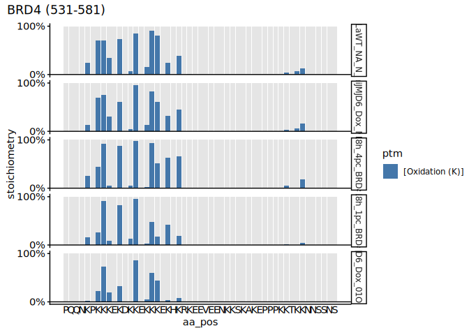<!-- --><!-- -->

``` r
MS_SS_KR_PNAS_BRD4_O2pc <- MS_SS_KR_PNAS_BRD4_O2pc_dt[is_diagnostic_peak == TRUE & aa == "K"]

# Write to csv table to identify "K" with DI 
fwrite(MS_SS_KR_PNAS_BRD4_O2pc, file.path(results.dir, "p2_MS_SS_KR", "MS_SS_KR_PNAS_BRD4_O2pc.csv"))
```

# 2.8.6 Plotting Stoichiometry values of hypoxia and normoxia data with re-expression of JMJD6 (+ diagnostic ion)

``` r
# subset rows with diagnostic ion from MS_SS and MS_KR data
DI_sites <- rbind(
  MS_KR1_BRD_dt[is_diagnostic_peak == TRUE, .(protein_accession, aa_pos)],
  MS_SS_BRD_dt[is_diagnostic_peak == TRUE, .(protein_accession, aa_pos)],
  pnas2022_BRD_dt[is_diagnostic_peak == TRUE, .(protein_accession, aa_pos)]
)

# remove duplicate sites 
DI_sites <- DI_sites[!duplicated(paste(protein_accession, aa_pos))]

# Merge MS_SS_KR data to only have unique diagnostic ion sites
MS_SS_KR_PNAS_dt <- merge(
  DI_sites,
  MS_SS_KR_PNAS_dt[aa == "K"],
  by = c("protein_accession", "aa_pos")
)

# Remove BRD2/3 samples reporting BRD4 stoichiomtery and vice versa
# These samples are removed as it could be false positives reported by the system 
MS_SS_KR_PNAS_dt <- MS_SS_KR_PNAS_dt[
  !((grepl("_BRD23$", sample_name) & gene_name == "BRD4") |
       (grepl("_BRD4$", sample_name) & gene_name %in% c("BRD2", "BRD3")))
]

# Using contrast function on MS_SS_KR raw stoic data
c_MS_SS_KR_PNAS_dt <- contrast_hydroxylation_by_sample_group(MS_SS_KR_PNAS_dt)

# Factor the gene names
c_MS_SS_KR_PNAS_dt[, `:=`(
  gene_name =  
    factor(gene_name)
)]

# WT values subset to greater than 0 
c_MS_SS_KR_PNAS_dt <- c_MS_SS_KR_PNAS_dt[WT_Inf_21pc_KR > 0]
```

``` r
# Change wide format to long format 
lc_MS_SS_KR_PNAS_dt <- melt(
  c_MS_SS_KR_PNAS_dt,
  id.vars = c("protein_accession", "gene_name", "aa_pos"),
  value.name = "Stoichiometry", 
  variable.name = "sample_group"
  #value.var = grep("_", colnames(c_MS_SS_KR_all_dt), value = TRUE)
)

# Separate the contents of sample_group column into new columns 
lc_MS_SS_KR_PNAS_dt[, `:=`(
  cell = str_split_fixed(sample_group, "_", 4)[, 1],
  induction = str_split_fixed(sample_group, "_", 4)[, 2] %>%
    factor(levels = c("Inf", "0h", "4h", "8h", "18h", "24h")),
  oxygen = str_split_fixed(sample_group, "_", 4)[, 3],
  dataset = str_split_fixed(sample_group, "_", 4)[, 4]
)]

# subset rows that do not contain NA values 
lc_MS_SS_KR_PNAS_dt <- lc_MS_SS_KR_PNAS_dt[!is.na(Stoichiometry)]

# counting the data per sample and size 
lc_MS_SS_KR_PNAS_dt[, data_size_per_sample := .N, by = list(sample_group)]
lc_MS_SS_KR_PNAS_dt[, data_size_per_site := .N, by = list(protein_accession, aa_pos)]

# reorder the oxygen levels
lc_MS_SS_KR_PNAS_dt <-  lc_MS_SS_KR_PNAS_dt[, oxygen := factor(
  oxygen,
  levels = c("01pc", "1pc", "4pc", "21pc")
)]


# subset data to WT normoxia (MS_KR_1 sample)
wt_21pc <- lc_MS_SS_KR_PNAS_dt[sample_group == "WT_Inf_21pc_KR", .(protein_accession, aa_pos, Stoichiometry)]
setnames(wt_21pc, old = "Stoichiometry", "WT_stoichiometry")

wt_21pc <- wt_21pc[WT_stoichiometry > 0]

# Merge WT data with lc_MS_SS_KR_PNAS_dt dtata
lc_MS_SS_KR_PNAS_WT_dt <- merge(
  lc_MS_SS_KR_PNAS_dt[
    cell %in% c("iJ6", "WT")
  ],
  wt_21pc,
  by = c("protein_accession", "aa_pos")
)
```

# 2.8.7 XIC values against MS_SS, MS_KR_1 and PNAS stoichiometry data.

``` r
#-------------
# XIC vs stoic
#-------------

# Load XIC data
xic_MS_SS <- fread(file.path(data.dir, "xic_MS_SS.csv"))

# Merge XIC data and stoichiometry data
xic_stoic <- merge(lc_MS_SS_KR_PNAS_dt, 
                   xic_MS_SS,
                   by = c("induction", "oxygen", "gene_name", "aa_pos"))

# Scatter plot - XIC vs stoichiometry
ggplot(
  xic_stoic,
  aes(
    x = XIC,
    y = Stoichiometry
  )
) + 
  geom_point() +
  geom_smooth(method=lm , color="red", se=TRUE) +
theme_classic_2()
```

    ## `geom_smooth()` using formula = 'y ~ x'

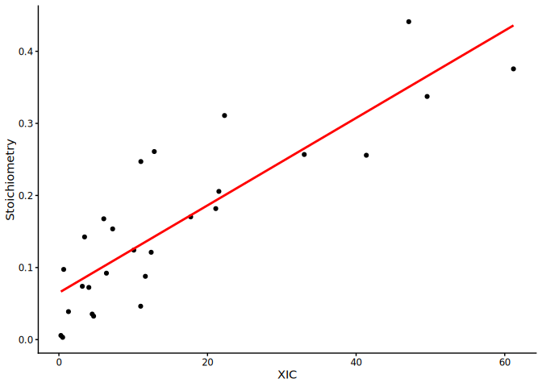<!-- -->

``` r
# Boxplot - Stoichiometry of Dox + and - JMJD6 under O2 levels
ggplot(
  data = lc_MS_SS_KR_PNAS_WT_dt[induction != "Inf" & data_size_per_site == max(lc_MS_SS_KR_PNAS_WT_dt[, data_size_per_site])],
  aes(
    x = induction,
    y = Stoichiometry
  )
) +
  #geom_hline(yintercept = 1, color = "gray60") +
  geom_boxplot(outlier.shape = NA) +
  facet_grid(~ oxygen) +
  ylab("Stoichiometry [%]") +
  theme_classic_2()+
  theme(axis.text.x = element_text(angle = 90, hjust = 1)) + 
  theme(legend.position="right") +
  coord_cartesian(ylim = c(0, 1.2)) +
  theme(aspect.ratio = 2) +
  scale_y_continuous(labels = scales::percent_format(accuracy = 1))
```

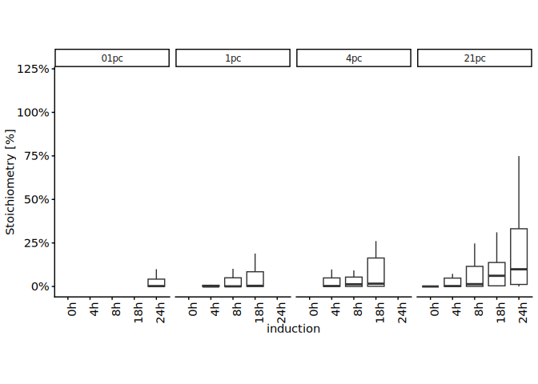<!-- -->

``` r
#---------------------------------------------
# Normoxia samples under varying dox induction
#--------------------------------------------- 

# Boxplot - Stoichiometry of Dox + and - JMJD6 at 21pc O2
ggplot(
  data = lc_MS_SS_KR_PNAS_WT_dt[oxygen == "21pc" & induction != "Inf" & data_size_per_site == max(lc_MS_SS_KR_PNAS_WT_dt[, data_size_per_site])],
  aes(
    x = induction,
    y = Stoichiometry
  )
) +
  #geom_hline(yintercept = 1, color = "gray60") +
  geom_boxplot(outlier.shape = NA) +
  # facet_grid(~ oxygen) +
  ylab("Stoichiometry [%]") +
  theme_classic_2()+
  theme(axis.text.x = element_text(angle = 90, hjust = 1)) + 
  theme(legend.position="right") +
  coord_cartesian(ylim = c(0, 1.2)) +
  theme(aspect.ratio = 2) +
  scale_y_continuous(labels = scales::percent_format(accuracy = 1))
```

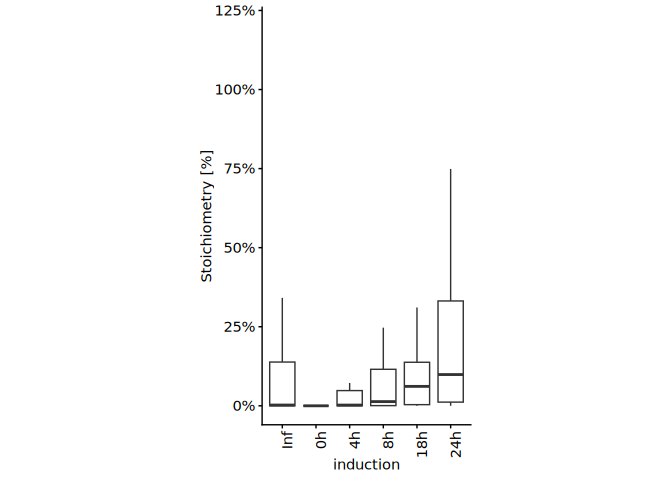<!-- -->

``` r
#------------------------
# Boxplot - Stoichiometry of Dox + and - JMJD6 at 21pc O2 (N >= 0.1)
ggplot(
  data = lc_MS_SS_KR_PNAS_WT_dt[WT_stoichiometry >= 0.1 & oxygen == "21pc" & induction != "Inf" & data_size_per_site == max(lc_MS_SS_KR_PNAS_WT_dt[, data_size_per_site])],
  aes(
    x = induction,
    y = Stoichiometry
  )
) +
  #geom_hline(yintercept = 1, color = "gray60") +
  geom_boxplot(outlier.shape = NA) +
  # facet_grid(~ oxygen) +
  ylab("(N >= 0.1) Stoichiometry [%]") +
  theme_classic_2()+
  theme(axis.text.x = element_text(angle = 90, hjust = 1)) + 
  theme(legend.position="right") +
  coord_cartesian(ylim = c(0, 1.2)) +
  theme(aspect.ratio = 2) +
  scale_y_continuous(labels = scales::percent_format(accuracy = 1))
```

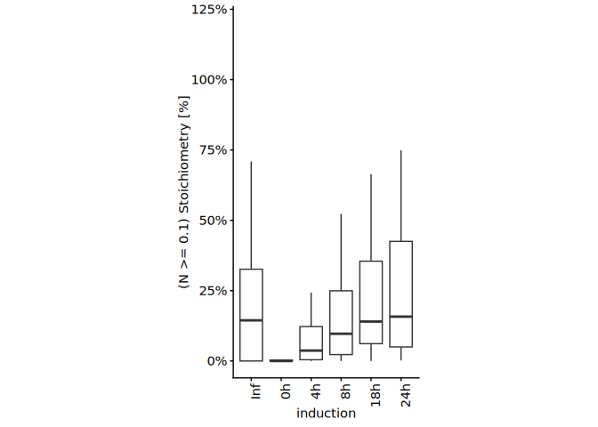<!-- -->

``` r
# Boxplot - Stoichiometry of Dox + and - JMJD6 under O2 pc levels
ggplot(
  data = lc_MS_SS_KR_PNAS_WT_dt[induction != "Inf"& data_size_per_site == max(lc_MS_SS_KR_PNAS_WT_dt[, data_size_per_site])],
  aes(
    x = induction,
    y = Stoichiometry/WT_stoichiometry
  )
) +
  #geom_hline(yintercept = 1, color = "gray60") +
  geom_boxplot(outlier.shape = NA) +
  facet_grid(~ oxygen) +
  labs(title = "Stoichiometry of Dox +/- JMJD6 at O2pc levels") + 
  ylab("Stoichiometry [% to WT]") +
  theme_classic_2()+
  theme(axis.text.x = element_text(angle = 90, hjust = 1)) + 
  theme(legend.position="right") +
  coord_cartesian(ylim = c(0, 1.2)) +
  theme(aspect.ratio = 2) +
  scale_y_continuous(labels = scales::percent_format(accuracy = 1))
```

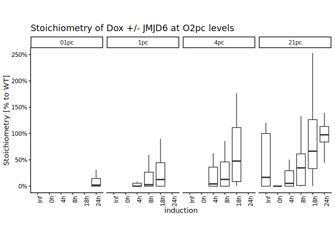<!-- -->

``` r
#---------------------------------------------
# Normoxia samples under varying dox induction
#---------------------------------------------

# Boxplot - Stoichiometry of Dox + and - JMJD6 at 21pc O2
ggplot(
  data = lc_MS_SS_KR_PNAS_WT_dt[oxygen == "21pc" & induction != "Inf"& data_size_per_site == max(lc_MS_SS_KR_PNAS_WT_dt[, data_size_per_site])],
  aes(
    x = induction,
    y = Stoichiometry/WT_stoichiometry
  )
) +
  #geom_hline(yintercept = 1, color = "gray60") +
  geom_boxplot(outlier.shape = NA) +
  labs(title = "Stoic of Dox +/- JMJD6 at 21pc O2") + 
  # facet_grid(~ oxygen) +
  ylab("Stoichiometry [% to WT]") +
  theme_classic_2()+
  theme(axis.text.x = element_text(angle = 90, hjust = 1)) + 
  theme(legend.position="right") +
  coord_cartesian(ylim = c(0, 1.2)) +
  theme(aspect.ratio = 2) +
  scale_y_continuous(labels = scales::percent_format(accuracy = 1))
```

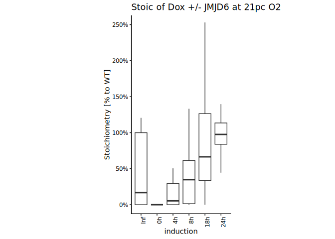<!-- -->

``` r
#------------------------
# Boxplot - Stoichiometry of Dox + and - JMJD6 at 21pc O2 (N >= 0.1)
ggplot(
  data = lc_MS_SS_KR_PNAS_WT_dt[WT_stoichiometry >= 0.1 & oxygen == "21pc" & induction != "Inf"& data_size_per_site == max(lc_MS_SS_KR_PNAS_WT_dt[, data_size_per_site])],
  aes(
    x = induction,
    y = Stoichiometry/WT_stoichiometry
  )
) +
  #geom_hline(yintercept = 1, color = "gray60") +
  geom_boxplot(outlier.shape = NA) +
  # facet_grid(~ oxygen) +
  labs(title = "Stoic of Dox +/- JMJD6 at 21pc O2 (N >= 0.1)") + 
  ylab("(N >= 0.1) Stoichiometry [% to WT]") +
  theme_classic_2()+
  theme(axis.text.x = element_text(angle = 90, hjust = 1)) + 
  theme(legend.position="right") +
  coord_cartesian(ylim = c(0, 1.2)) +
  theme(aspect.ratio = 2) +
  scale_y_continuous(labels = scales::percent_format(accuracy = 1))
```

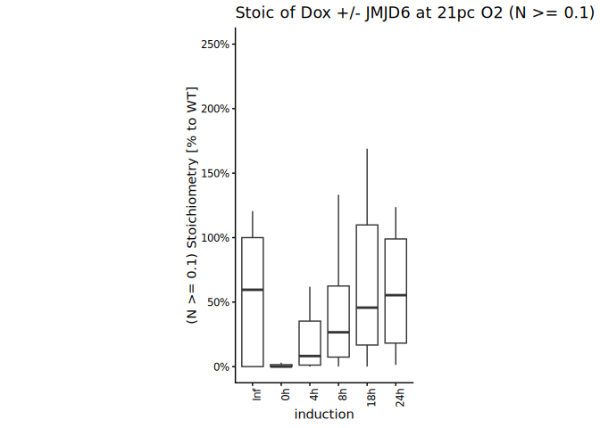<!-- -->

# 2.8.8 Oxygen sensitivity - Comparing hypoxia stoichiometry under varying dox incubation (+ diagnostic ion)

``` r
# Boxplot - Comparing the stoic between normoxia and varying pc of hypoxia
# Data subset to overnight (18/24h) dox induction

lc_MS_SS_KR_PNAS_Hxpo_dt <- lc_MS_SS_KR_PNAS_WT_dt[
  grepl("18h|24h|Inf", induction) &
    !sample_group %in% c("iJ6_18h_21pc_SS", "iJ6_Inf_21pc_PNAS", "WT_Inf_21pc_PNAS")
]

#test <-  lc_MS_SS_KR_PNAS_WT_dt[grepl("Inf", induction)]

# reorder the sample_group according to oxygen levels
lc_MS_SS_KR_PNAS_Hxpo_dt[, sample_group :=
                       factor(sample_group,
                              levels = c("WT_Inf_21pc_KR",
                                         "iJ6_24h_21pc_KR",
                                         "iJ6_18h_4pc_SS",
                                         "iJ6_18h_1pc_SS",
                                         "iJ6_24h_01pc_KR"))
]

# Plot
ggplot(
  data = lc_MS_SS_KR_PNAS_Hxpo_dt[data_size_per_site == max(lc_MS_SS_KR_PNAS_Hxpo_dt
                                                            [, data_size_per_site])],
  aes(
    x = sample_group,
    y = Stoichiometry
  )
) +
  geom_boxplot(outlier.shape = NA) +
  ylab("Stoichiometry [%]") +
  theme_classic_2()+
  theme(axis.text.x = element_text(angle = 90, hjust = 1)) + 
  theme(legend.position="right") +
  coord_cartesian(ylim = c(0, 1.2)) +
  theme(aspect.ratio = 2) +
  scale_y_continuous(labels = scales::percent_format(accuracy = 1))
```

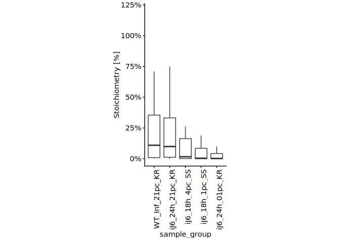<!-- -->

``` r
# Plot - relative to WT_stoichiometry
ggplot(
  data = lc_MS_SS_KR_PNAS_Hxpo_dt[data_size_per_site == max(lc_MS_SS_KR_PNAS_Hxpo_dt
                                                            [, data_size_per_site])],
  aes(
    x = sample_group,
    y = Stoichiometry/WT_stoichiometry
  )
) +
  geom_boxplot(outlier.shape = NA) +
  ylab("Stoichiometry [% to WT]") +
  theme_classic_2()+
  theme(axis.text.x = element_text(angle = 90, hjust = 1)) + 
  theme(legend.position="right") +
  coord_cartesian(ylim = c(0, 1.2)) +
  theme(aspect.ratio = 2) +
  scale_y_continuous(labels = scales::percent_format(accuracy = 1))
```

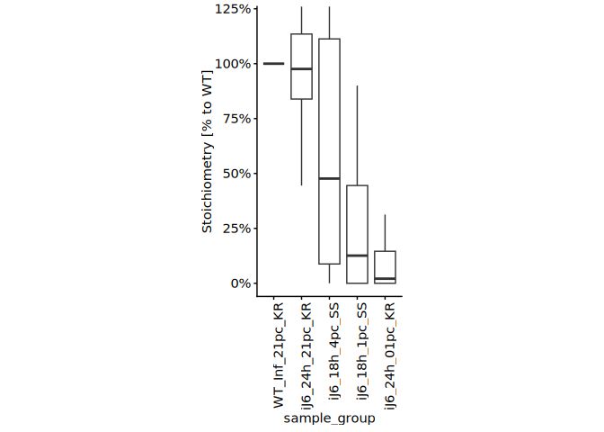<!-- -->

``` r
# Plot - Subset WT data - N >= 0.1
ggplot(
  data = lc_MS_SS_KR_PNAS_Hxpo_dt[WT_stoichiometry >= 0.1 & data_size_per_site == max(lc_MS_SS_KR_PNAS_Hxpo_dt[, data_size_per_site])],
  aes(
    x = sample_group,
    y = Stoichiometry
  )
) +
  geom_boxplot(outlier.shape = NA) +
  ylab("(N >= 0.1) Stoichiometry [%]") +
  theme_classic_2()+
  theme(axis.text.x = element_text(angle = 90, hjust = 1)) + 
  theme(legend.position="right") +
  coord_cartesian(ylim = c(0, 1.2)) +
  theme(aspect.ratio = 2) +
  scale_y_continuous(labels = scales::percent_format(accuracy = 1))
```

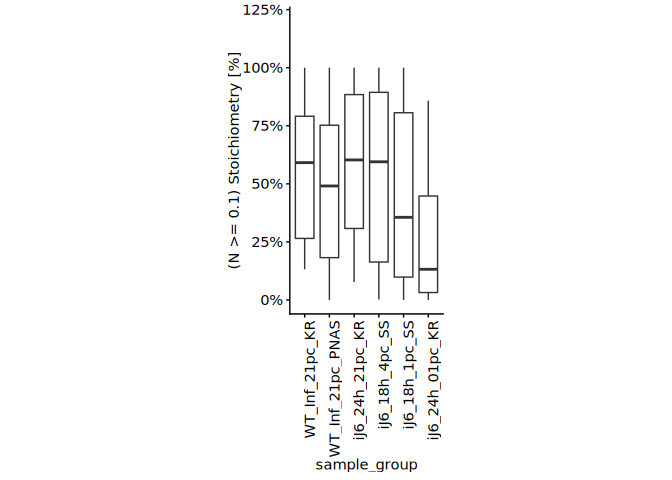<!-- -->

``` r
# Plot - Subset WT data - N >= 0.1, relative to WT_stoichiometry
ggplot(
  data = lc_MS_SS_KR_PNAS_Hxpo_dt[WT_stoichiometry >= 0.1 & data_size_per_site == max(lc_MS_SS_KR_PNAS_Hxpo_dt[, data_size_per_site])],
  aes(
    x = sample_group,
    y = Stoichiometry/WT_stoichiometry
  )
) +
  geom_boxplot(outlier.shape = NA) +
  ylab("(N >= 0.1) Stoichiometry [% to WT]") +
  theme_classic_2()+
  theme(axis.text.x = element_text(angle = 90, hjust = 1)) + 
  theme(legend.position="right") +
  coord_cartesian(ylim = c(0, 1.2)) +
  theme(aspect.ratio = 2) +
  scale_y_continuous(labels = scales::percent_format(accuracy = 1))
```

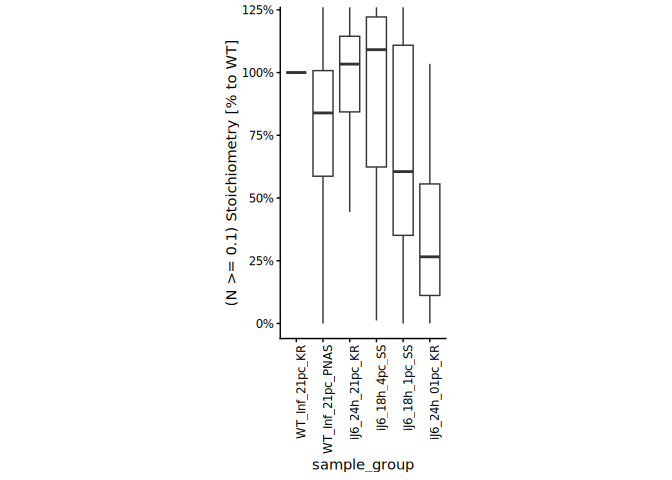<!-- -->

# 2.8.9 Oxygen sensitivity - Comparing hypoxia stoichiometry under varying dox incubation - Re-exp J6 (+ diagnostic ion)

``` r
#--------------------------------------
# Only JMJD6 re-expression data plotted
#--------------------------------------

lc_Hxpo_reexp_J6_dt <- lc_MS_SS_KR_PNAS_WT_dt[
  grepl("18h|24h", induction) &
    !sample_group %in% c("iJ6_18h_21pc_SS", "iJ6_Inf_21pc_PNAS")
]

# reorder the sample_group according to oxygen levels
lc_Hxpo_reexp_J6_dt[, sample_group :=
                       factor(sample_group,
                              levels = c("iJ6_24h_21pc_KR",
                                         "iJ6_18h_4pc_SS",
                                         "iJ6_18h_1pc_SS",
                                         "iJ6_24h_01pc_KR"))
]

# Plot
ggplot(
  data = lc_Hxpo_reexp_J6_dt[data_size_per_site == max(lc_Hxpo_reexp_J6_dt[, data_size_per_site])],
  aes(
    x = sample_group,
    y = Stoichiometry
  )
) +
  geom_boxplot(outlier.shape = NA) +
  ylab("Stoichiometry [%]") +
  theme_classic_2()+
  theme(axis.text.x = element_text(angle = 90, hjust = 1)) + 
  theme(legend.position="right") +
  coord_cartesian(ylim = c(0, 1.2)) +
  theme(aspect.ratio = 2) +
  scale_y_continuous(labels = scales::percent_format(accuracy = 1))
```

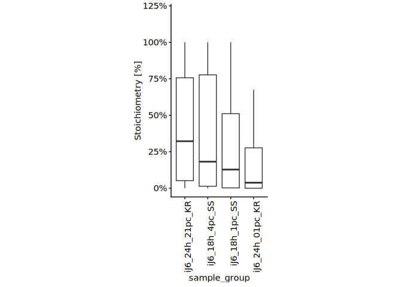<!-- -->

``` r
# Plot- relative to WT_stoichiometry
ggplot(
  data = lc_Hxpo_reexp_J6_dt[data_size_per_site == max(lc_Hxpo_reexp_J6_dt[, data_size_per_site])],
  aes(
    x = sample_group,
    y = Stoichiometry/WT_stoichiometry
  )
) +
  geom_boxplot(outlier.shape = NA) +
  ylab("Stoichiometry [% to WT]") +
  theme_classic_2()+
  theme(axis.text.x = element_text(angle = 90, hjust = 1)) + 
  theme(legend.position="right") +
  coord_cartesian(ylim = c(0, 1.2)) +
  theme(aspect.ratio = 2) +
  scale_y_continuous(labels = scales::percent_format(accuracy = 1))
```

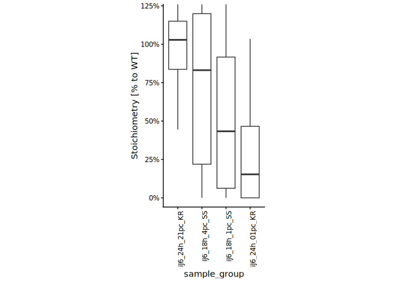<!-- -->

``` r
# Subset WT data - N >= 0.1 
# Plot
ggplot(
  data = lc_Hxpo_reexp_J6_dt[WT_stoichiometry >= 0.1 & data_size_per_site == max(lc_Hxpo_reexp_J6_dt[, data_size_per_site])],
  aes(
    x = sample_group,
    y = Stoichiometry
  )
) +
  geom_boxplot(outlier.shape = NA) +
  ylab("(N >= 0.1) Stoichiometry [%]") +
  theme_classic_2()+
  theme(axis.text.x = element_text(angle = 90, hjust = 1)) + 
  theme(legend.position="right") +
  coord_cartesian(ylim = c(0, 1.2)) +
  theme(aspect.ratio = 2) +
  scale_y_continuous(labels = scales::percent_format(accuracy = 1))
```

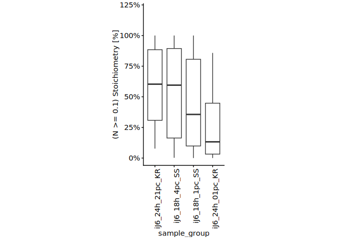<!-- -->

``` r
# Plot- N >= 0.1 relative to WT_stoichiometry
ggplot(
  data = lc_Hxpo_reexp_J6_dt[WT_stoichiometry >= 0.1 & data_size_per_site == max(lc_Hxpo_reexp_J6_dt[, data_size_per_site])],
  aes(
    x = sample_group,
    y = Stoichiometry/WT_stoichiometry
  )
) +
  geom_boxplot(outlier.shape = NA) +
  ylab("(N >= 0.1) Stoichiometry [% to WT]") +
  theme_classic_2()+
  theme(axis.text.x = element_text(angle = 90, hjust = 1)) + 
  theme(legend.position="right") +
  coord_cartesian(ylim = c(0, 1.2)) +
  theme(aspect.ratio = 2) +
  scale_y_continuous(labels = scales::percent_format(accuracy = 1))
```

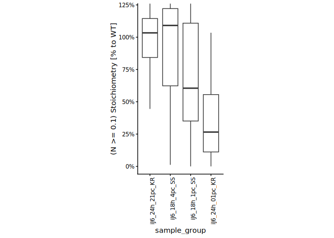<!-- -->

``` r
lc_Hxpo_J6_dt <- lc_MS_SS_KR_PNAS_WT_dt[
  grepl("18h|24h", induction) &
    !sample_group %in% c("iJ6_18h_21pc_SS", "iJ6_Inf_21pc_PNAS", "iJ6_24h_21pc_KR")
]

# reorder the sample_group according to oxygen levels
lc_Hxpo_J6_dt[, sample_group :=
                       factor(sample_group,
                              levels = c("iJ6_18h_4pc_SS",
                                         "iJ6_18h_1pc_SS",
                                         "iJ6_24h_01pc_KR"))
]


# Plot- relative to WT_stoichiometry
ggplot(
  data = lc_Hxpo_J6_dt[data_size_per_site == max(lc_Hxpo_J6_dt[, data_size_per_site])],
  aes(
    x = sample_group,
    y = Stoichiometry/WT_stoichiometry
  )
) +
  geom_boxplot(outlier.shape = NA) +
  ylab("Stoichiometry [% to WT]") +
  theme_classic_2()+
  theme(axis.text.x = element_text(angle = 90, hjust = 1)) + 
  theme(legend.position="right") +
  coord_cartesian(ylim = c(0, 1.2)) +
  theme(aspect.ratio = 2) +
  scale_y_continuous(labels = scales::percent_format(accuracy = 1))
```

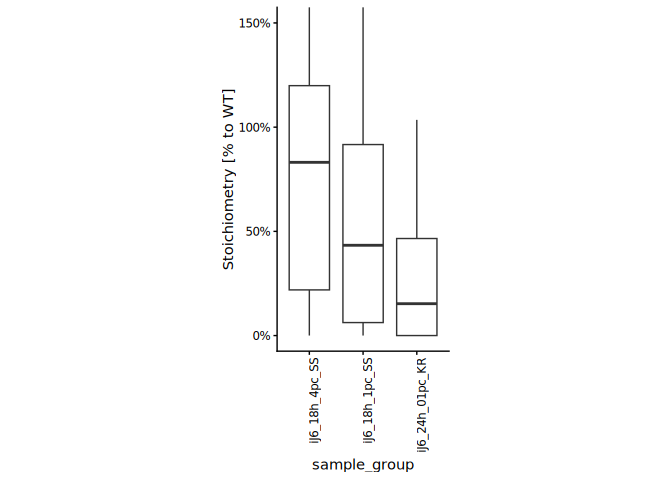<!-- -->

``` r
# Plot- Subset WT to >= 0.1
ggplot(
  data = lc_Hxpo_J6_dt[WT_stoichiometry >= 0.1 & data_size_per_site == max(lc_Hxpo_J6_dt[, data_size_per_site])],
  aes(
    x = sample_group,
    y = Stoichiometry/WT_stoichiometry
  )
) +
  geom_boxplot(outlier.shape = NA) +
  ylab("(N >= 0.1) Stoichiometry [% to WT]") +
  theme_classic_2()+
  theme(axis.text.x = element_text(angle = 90, hjust = 1)) + 
  theme(legend.position="right") +
  coord_cartesian(ylim = c(0, 1.2)) +
  theme(aspect.ratio = 2) +
  scale_y_continuous(labels = scales::percent_format(accuracy = 1))
```

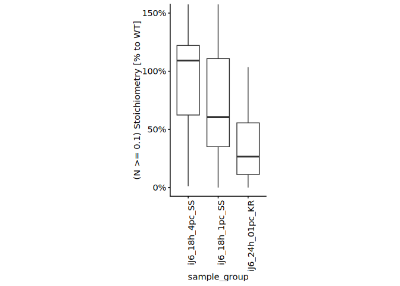<!-- -->

# 2.8.10 Oxygen sensitivity - Comparing hypoxia stoichiometry vs normoxia stoichiometry (+ diagnostic ion)

``` r
# Scatter plot - Normoxia stoichiometry versus hypoxia at 4% - 18h dox incubation
ggplot(
  data = c_MS_SS_KR_PNAS_dt, 
  aes(
    x = iJ6_24h_21pc_KR,
    y = iJ6_18h_4pc_SS
  )
) +
  geom_point(aes(colour = gene_name)) +
  geom_smooth(method=lm , color="black", size = 0.5, se=TRUE)+
  #facet_grid(~ gene_name, space = "free")+
  theme_classic_2() +
  coord_cartesian(ylim = c(0, 1)) +
  theme(axis.text.x = element_text(angle = 90, hjust = 1)) + 
  theme(legend.position="right") 
```

    ## Warning: Using `size` aesthetic for lines was deprecated in ggplot2 3.4.0.
    ## ℹ Please use `linewidth` instead.
    ## This warning is displayed once every 8 hours.
    ## Call `lifecycle::last_lifecycle_warnings()` to see where this warning was
    ## generated.

    ## `geom_smooth()` using formula = 'y ~ x'

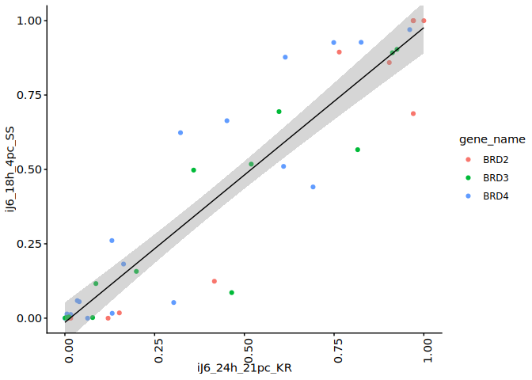<!-- -->

``` r
# correlation test 
cor.test(c_MS_SS_KR_PNAS_dt[, iJ6_24h_21pc_KR], c_MS_SS_KR_PNAS_dt[, iJ6_18h_4pc_SS], method = "spearma")
```

    ## Warning in cor.test.default(c_MS_SS_KR_PNAS_dt[, iJ6_24h_21pc_KR],
    ## c_MS_SS_KR_PNAS_dt[, : Cannot compute exact p-value with ties

    ## 
    ##  Spearman's rank correlation rho
    ## 
    ## data:  c_MS_SS_KR_PNAS_dt[, iJ6_24h_21pc_KR] and c_MS_SS_KR_PNAS_dt[, iJ6_18h_4pc_SS]
    ## S = 1123, p-value < 2.2e-16
    ## alternative hypothesis: true rho is not equal to 0
    ## sample estimates:
    ##       rho 
    ## 0.9152059

``` r
wilcox.test(
  c_MS_SS_KR_PNAS_dt[, iJ6_18h_4pc_SS],
  c_MS_SS_KR_PNAS_dt[, iJ6_24h_21pc_KR],
  paired = TRUE
)
```

    ## Warning in wilcox.test.default(c_MS_SS_KR_PNAS_dt[, iJ6_18h_4pc_SS],
    ## c_MS_SS_KR_PNAS_dt[, : cannot compute exact p-value with zeroes

    ## 
    ##  Wilcoxon signed rank test with continuity correction
    ## 
    ## data:  c_MS_SS_KR_PNAS_dt[, iJ6_18h_4pc_SS] and c_MS_SS_KR_PNAS_dt[, iJ6_24h_21pc_KR]
    ## V = 381, p-value = 0.5255
    ## alternative hypothesis: true location shift is not equal to 0

``` r
# Scatter plot - Normoxia stoichiometry versus hypoxia at 1% - 18h dox incubation
ggplot(
  data = c_MS_SS_KR_PNAS_dt, 
  aes(
    x = iJ6_24h_21pc_KR,
    y = iJ6_18h_1pc_SS
  )
) +
  geom_point(aes(colour = gene_name)) +
  geom_smooth(method=lm , color="black", size = 0.5, se=TRUE)+
  #  facet_grid(~ gene_name, space = "free")+
  theme_classic_2() +
  coord_cartesian(ylim = c(0, 1)) +
  theme(axis.text.x = element_text(angle = 90, hjust = 1)) + 
  theme(legend.position="right") 
```

    ## `geom_smooth()` using formula = 'y ~ x'

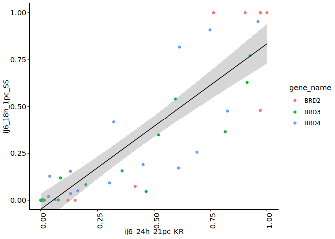<!-- -->

``` r
# correlation test 
cor.test(c_MS_SS_KR_PNAS_dt[, iJ6_24h_21pc_KR], c_MS_SS_KR_PNAS_dt[, iJ6_18h_1pc_SS], method = "spearma")
```

    ## Warning in cor.test.default(c_MS_SS_KR_PNAS_dt[, iJ6_24h_21pc_KR],
    ## c_MS_SS_KR_PNAS_dt[, : Cannot compute exact p-value with ties

    ## 
    ##  Spearman's rank correlation rho
    ## 
    ## data:  c_MS_SS_KR_PNAS_dt[, iJ6_24h_21pc_KR] and c_MS_SS_KR_PNAS_dt[, iJ6_18h_1pc_SS]
    ## S = 1250.4, p-value < 2.2e-16
    ## alternative hypothesis: true rho is not equal to 0
    ## sample estimates:
    ##       rho 
    ## 0.9055844

``` r
wilcox.test(
  c_MS_SS_KR_PNAS_dt[, iJ6_18h_1pc_SS],
  c_MS_SS_KR_PNAS_dt[, iJ6_24h_21pc_KR],
  paired = TRUE
)
```

    ## Warning in wilcox.test.default(c_MS_SS_KR_PNAS_dt[, iJ6_18h_1pc_SS],
    ## c_MS_SS_KR_PNAS_dt[, : cannot compute exact p-value with zeroes

    ## 
    ##  Wilcoxon signed rank test with continuity correction
    ## 
    ## data:  c_MS_SS_KR_PNAS_dt[, iJ6_18h_1pc_SS] and c_MS_SS_KR_PNAS_dt[, iJ6_24h_21pc_KR]
    ## V = 196, p-value = 0.002427
    ## alternative hypothesis: true location shift is not equal to 0

``` r
# Scatter plot - Normoxia stoichiometry versus hypoxia at 0.1% - 24h dox incubation
ggplot(
  data = c_MS_SS_KR_PNAS_dt, 
  aes(
    x = iJ6_24h_21pc_KR,
    y = iJ6_24h_01pc_KR
  )
) +
  geom_point(aes(colour = gene_name)) +
    geom_smooth(method=lm , color="black", size = 0.5, se=TRUE)+
  #facet_grid(~ gene_name, space = "free")+
  theme_classic_2() +
  coord_cartesian(ylim = c(0, 1)) +
  theme(axis.text.x = element_text(angle = 90, hjust = 1)) + 
  theme(legend.position="right")
```

    ## `geom_smooth()` using formula = 'y ~ x'

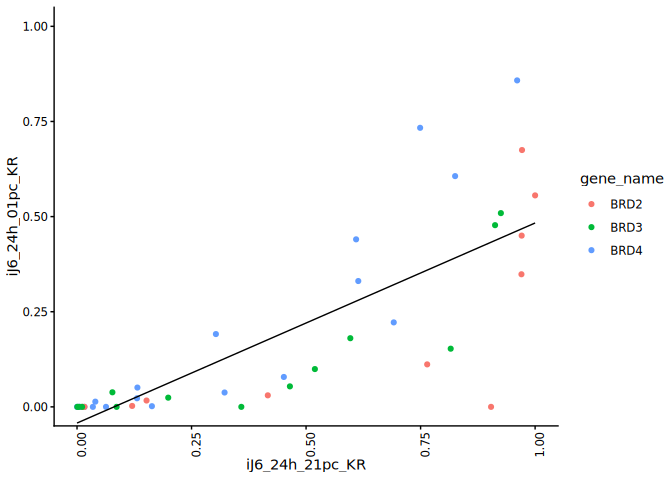<!-- -->

``` r
# correlation test 
cor.test(c_MS_SS_KR_PNAS_dt[, iJ6_24h_21pc_KR], c_MS_SS_KR_PNAS_dt[, iJ6_24h_01pc_KR], method = "spearma")
```

    ## Warning in cor.test.default(c_MS_SS_KR_PNAS_dt[, iJ6_24h_21pc_KR],
    ## c_MS_SS_KR_PNAS_dt[, : Cannot compute exact p-value with ties

    ## 
    ##  Spearman's rank correlation rho
    ## 
    ## data:  c_MS_SS_KR_PNAS_dt[, iJ6_24h_21pc_KR] and c_MS_SS_KR_PNAS_dt[, iJ6_24h_01pc_KR]
    ## S = 1909.6, p-value = 2.629e-13
    ## alternative hypothesis: true rho is not equal to 0
    ## sample estimates:
    ##       rho 
    ## 0.8558139

``` r
wilcox.test(
  c_MS_SS_KR_PNAS_dt[, iJ6_24h_01pc_KR],
  c_MS_SS_KR_PNAS_dt[, iJ6_24h_21pc_KR],
  paired = TRUE
)
```

    ## Warning in wilcox.test.default(c_MS_SS_KR_PNAS_dt[, iJ6_24h_01pc_KR],
    ## c_MS_SS_KR_PNAS_dt[, : cannot compute exact p-value with zeroes

    ## 
    ##  Wilcoxon signed rank test with continuity correction
    ## 
    ## data:  c_MS_SS_KR_PNAS_dt[, iJ6_24h_01pc_KR] and c_MS_SS_KR_PNAS_dt[, iJ6_24h_21pc_KR]
    ## V = 0, p-value = 1.709e-08
    ## alternative hypothesis: true location shift is not equal to 0

# 2.8.11 Comparing hypoxia stoichiometry under varying dox incubation (+ diagnostic ion)

``` r
# box_plot - hypoxia stoichiometry in diff dox incubation
ggplot(
  data = lc_MS_SS_KR_PNAS_WT_dt[data_size_per_site == max(lc_MS_SS_KR_PNAS_WT_dt[, data_size_per_site]) & induction != "Inf" & oxygen != "21pc"], 
  aes(
    x = induction,
    y = Stoichiometry/WT_stoichiometry
  )
) +
  geom_boxplot(outlier.shape = NA) +
  facet_grid(~ oxygen)+
  ggtitle("Hypoxia samples in diff dox incubation") +
  ylab("Stoichiometry [% to WT]") +
  theme_classic_2()+
  theme(axis.text.x = element_text(angle = 90, hjust = 1)) + 
  theme(legend.position="right") +
  theme(aspect.ratio = 3) +
  scale_y_continuous(labels = scales::percent_format(accuracy = 1))
```

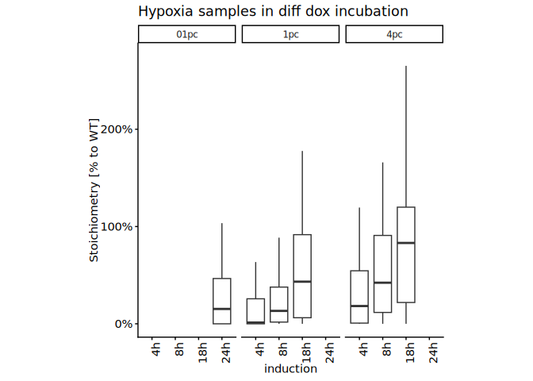<!-- -->

``` r
#--------------------
# box_plot - Hypoxia samples in diff dox incubation (N =>0.1)
ggplot(
  data = lc_MS_SS_KR_PNAS_WT_dt[data_size_per_site == max(lc_MS_SS_KR_PNAS_WT_dt[, data_size_per_site]) & WT_stoichiometry >= 0.1 & induction != "Inf" & oxygen != "21pc"], 
  aes(
    x = induction,
    y = Stoichiometry/WT_stoichiometry
  )
) +
  geom_boxplot(outlier.shape = NA) +
  facet_grid(~ oxygen)+
  ggtitle("Hypoxia samples in diff dox incubation (N subset)") +
  ylab("Stoichiometry [%] (N =>0.1)") +
  theme_classic_2()+
  theme(axis.text.x = element_text(angle = 90, hjust = 1)) + 
  theme(legend.position="right") +
  theme(aspect.ratio = 3) +
  scale_y_continuous(labels = scales::percent_format(accuracy = 1))
```

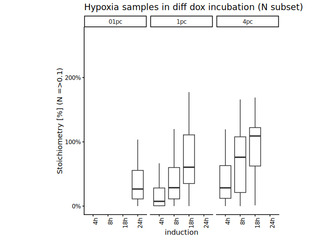<!-- -->

# Session information

``` r
sessioninfo::session_info()
```

    ## ─ Session info ───────────────────────────────────────────────────────────────
    ##  setting  value
    ##  version  R version 4.5.1 (2025-06-13)
    ##  os       Ubuntu 24.04.2 LTS
    ##  system   x86_64, linux-gnu
    ##  ui       X11
    ##  language (EN)
    ##  collate  C.UTF-8
    ##  ctype    C.UTF-8
    ##  tz       Europe/Berlin
    ##  date     2026-03-13
    ##  pandoc   3.4 @ /usr/lib/rstudio-server/bin/quarto/bin/tools/x86_64/ (via rmarkdown)
    ##  quarto   1.6.42 @ /usr/lib/rstudio-server/bin/quarto/bin/quarto
    ## 
    ## ─ Packages ───────────────────────────────────────────────────────────────────
    ##  package           * version    date (UTC) lib source
    ##  BiocGenerics      * 0.54.0     2025-04-15 [1] Bioconduc~
    ##  Biostrings        * 2.76.0     2025-04-15 [1] Bioconduc~
    ##  cellranger          1.1.0      2016-07-27 [1] CRAN (R 4.5.1)
    ##  cli                 3.6.5      2025-04-23 [1] CRAN (R 4.5.1)
    ##  crayon              1.5.3      2024-06-20 [1] CRAN (R 4.5.1)
    ##  data.table        * 1.17.8     2025-07-10 [1] CRAN (R 4.5.1)
    ##  digest              0.6.37     2024-08-19 [1] CRAN (R 4.5.1)
    ##  dplyr             * 1.1.4      2023-11-17 [1] CRAN (R 4.5.1)
    ##  evaluate            1.0.5      2025-08-27 [1] CRAN (R 4.5.1)
    ##  farver              2.1.2      2024-05-13 [1] CRAN (R 4.5.1)
    ##  fastmap             1.2.0      2024-05-15 [1] CRAN (R 4.5.1)
    ##  fs                  1.6.6      2025-04-12 [1] CRAN (R 4.5.1)
    ##  generics          * 0.1.4      2025-05-09 [1] CRAN (R 4.5.1)
    ##  GenomeInfoDb      * 1.44.3     2025-09-21 [1] Bioconduc~
    ##  GenomeInfoDbData    1.2.14     2025-09-24 [1] Bioconductor
    ##  ggplot2           * 4.0.1      2025-11-14 [1] CRAN (R 4.5.1)
    ##  glue                1.8.0      2024-09-30 [1] CRAN (R 4.5.1)
    ##  gt                * 1.3.0      2026-01-22 [1] CRAN (R 4.5.1)
    ##  gtable              0.3.6      2024-10-25 [1] CRAN (R 4.5.1)
    ##  htmltools           0.5.8.1    2024-04-04 [1] CRAN (R 4.5.1)
    ##  httr                1.4.7      2023-08-15 [1] CRAN (R 4.5.1)
    ##  IRanges           * 2.42.0     2025-04-15 [1] Bioconduc~
    ##  janitor           * 2.2.1      2024-12-22 [1] CRAN (R 4.5.1)
    ##  jsonlite            2.0.0      2025-03-27 [1] CRAN (R 4.5.1)
    ##  khroma            * 1.16.0     2025-02-25 [1] CRAN (R 4.5.1)
    ##  knitr             * 1.50       2025-03-16 [1] CRAN (R 4.5.1)
    ##  labeling            0.4.3      2023-08-29 [1] CRAN (R 4.5.1)
    ##  lattice             0.22-5     2023-10-24 [4] CRAN (R 4.3.3)
    ##  lifecycle           1.0.4      2023-11-07 [1] CRAN (R 4.5.1)
    ##  lubridate           1.9.4      2024-12-08 [1] CRAN (R 4.5.1)
    ##  magrittr          * 2.0.4      2025-09-12 [1] CRAN (R 4.5.1)
    ##  Matrix              1.7-3      2025-03-11 [4] CRAN (R 4.4.3)
    ##  mgcv                1.9-1      2023-12-21 [4] CRAN (R 4.3.2)
    ##  nlme                3.1-168    2025-03-31 [4] CRAN (R 4.4.3)
    ##  patchwork           1.3.2      2025-08-25 [1] CRAN (R 4.5.1)
    ##  pillar              1.11.1     2025-09-17 [1] CRAN (R 4.5.1)
    ##  pkgconfig           2.0.3      2019-09-22 [1] CRAN (R 4.5.1)
    ##  ptm.stoichiometry * 0.0.0.9000 2025-12-16 [1] local
    ##  R6                  2.6.1      2025-02-15 [1] CRAN (R 4.5.1)
    ##  RColorBrewer        1.1-3      2022-04-03 [1] CRAN (R 4.5.1)
    ##  readxl            * 1.4.5      2025-03-07 [1] CRAN (R 4.5.1)
    ##  rlang               1.1.6      2025-04-11 [1] CRAN (R 4.5.1)
    ##  rmarkdown           2.29       2024-11-04 [1] CRAN (R 4.5.1)
    ##  rstudioapi          0.17.1     2024-10-22 [1] CRAN (R 4.5.1)
    ##  S4Vectors         * 0.46.0     2025-04-15 [1] Bioconduc~
    ##  S7                  0.2.0      2024-11-07 [1] CRAN (R 4.5.1)
    ##  scales              1.4.0      2025-04-24 [1] CRAN (R 4.5.1)
    ##  sessioninfo         1.2.3      2025-02-05 [1] CRAN (R 4.5.1)
    ##  snakecase           0.11.1     2023-08-27 [1] CRAN (R 4.5.1)
    ##  stringi             1.8.7      2025-03-27 [1] CRAN (R 4.5.1)
    ##  stringr           * 1.5.2      2025-09-08 [1] CRAN (R 4.5.1)
    ##  tibble              3.3.0      2025-06-08 [1] CRAN (R 4.5.1)
    ##  tidyselect          1.2.1      2024-03-11 [1] CRAN (R 4.5.1)
    ##  timechange          0.3.0      2024-01-18 [1] CRAN (R 4.5.1)
    ##  UCSC.utils          1.4.0      2025-04-15 [1] Bioconduc~
    ##  vctrs               0.6.5      2023-12-01 [1] CRAN (R 4.5.1)
    ##  withr               3.0.2      2024-10-28 [1] CRAN (R 4.5.1)
    ##  xfun                0.53       2025-08-19 [1] CRAN (R 4.5.1)
    ##  xml2                1.4.0      2025-08-20 [1] CRAN (R 4.5.1)
    ##  XVector           * 0.48.0     2025-04-15 [1] Bioconduc~
    ##  yaml                2.3.10     2024-07-26 [1] CRAN (R 4.5.1)
    ## 
    ##  [1] /home/pkesava/R/x86_64-pc-linux-gnu-library/4.5
    ##  [2] /usr/local/lib/R/site-library
    ##  [3] /usr/lib/R/site-library
    ##  [4] /usr/lib/R/library
    ##  * ── Packages attached to the search path.
    ## 
    ## ──────────────────────────────────────────────────────────────────────────────
