2-8. Lysine hydroxylations in varying O2 pc and dox induction time -
data visualisation
================
Yoichiro Sugimoto and Pallavi Kesavan
16 April, 2026

- [Overview](#overview)
- [Environment setup](#environment-setup)
- [Install,load essential functions and
  libraries](#installload-essential-functions-and-libraries)
- [Import human protein reference
  data](#import-human-protein-reference-data)
- [Defining functions and data
  preprocessing](#defining-functions-and-data-preprocessing)
- [Plotting Stoichiometry values of hypoxia and normoxia data with
  re-expression of JMJD6 (+ diagnostic
  ion)](#plotting-stoichiometry-values-of-hypoxia-and-normoxia-data-with-re-expression-of-jmjd6--diagnostic-ion)
- [Kinetics](#kinetics)
  - [t50](#t50)
- [XIC values against MS_SS, MS_KR_1 and PNAS stoichiometry
  data.](#xic-values-against-ms_ss-ms_kr_1-and-pnas-stoichiometry-data)
- [Interaction](#interaction)
- [Oxygen sensitivity - Comparing hypoxia stoichiometry under varying
  dox incubation (+ diagnostic
  ion)](#oxygen-sensitivity---comparing-hypoxia-stoichiometry-under-varying-dox-incubation--diagnostic-ion)
- [Relationship of the stoichiometry in WT and changes in stoichiometry
  by
  hypoxia](#relationship-of-the-stoichiometry-in-wt-and-changes-in-stoichiometry-by-hypoxia)
- [Session information](#session-information)

# Overview

This script examines the oxygen sensitivity of lysine hydroxylations in
BRD proteins and their respective sites. This script is for visualizing
the calculated stoichiometry.

# Environment setup

``` r
## Initialize renv (first time only) - re-installed 24.09.2025
# Creates project specific library and renv.lock file. 
# Use 'renv::init(filepath)' to create project library
# renv::init(
#        "/fast/AG_Sugimoto/home/users/pallavi/projects/20241111_PTMs_in_lysine_rich_domains/R"
#    )

# Define project directory - contains the R scripts, data and result folders
project.dir <-
  file.path(
    "/fast/AG_Sugimoto/home/users/pallavi/projects/20241111_PTMs_in_lysine_rich_domains"
  )

# renv::snapshot(file.path(project.dir, "R"))

#renv::restore completed 24.09.2025
#renv::restore(file.path(project.dir, "R"))
```

# Install,load essential functions and libraries

``` r
## Load all R scripts from the 'functions' folder into the current session
P2_functions <- sapply(list.files
                       (file.path(project.dir, "R/functions"), 
                         pattern="*.R", 
                         full.names = TRUE), 
                       source)
```

    ## 
    ## Attaching package: 'dplyr'

    ## The following objects are masked from 'package:stats':
    ## 
    ##     filter, lag

    ## The following objects are masked from 'package:base':
    ## 
    ##     intersect, setdiff, setequal, union

    ## 
    ## Attaching package: 'data.table'

    ## The following objects are masked from 'package:dplyr':
    ## 
    ##     between, first, last

    ## Loading required package: BiocGenerics

    ## 
    ## Attaching package: 'BiocGenerics'

    ## The following objects are masked from 'package:dplyr':
    ## 
    ##     combine, intersect, setdiff, union

    ## The following objects are masked from 'package:stats':
    ## 
    ##     IQR, mad, sd, var, xtabs

    ## The following objects are masked from 'package:base':
    ## 
    ##     anyDuplicated, aperm, append, as.data.frame, basename, cbind,
    ##     colnames, dirname, do.call, duplicated, eval, evalq, Filter, Find,
    ##     get, grep, grepl, intersect, is.unsorted, lapply, Map, mapply,
    ##     match, mget, order, paste, pmax, pmax.int, pmin, pmin.int,
    ##     Position, rank, rbind, Reduce, rownames, sapply, saveRDS, setdiff,
    ##     table, tapply, union, unique, unsplit, which.max, which.min

    ## Loading required package: S4Vectors

    ## Loading required package: stats4

    ## 
    ## Attaching package: 'S4Vectors'

    ## The following objects are masked from 'package:data.table':
    ## 
    ##     first, second

    ## The following objects are masked from 'package:dplyr':
    ## 
    ##     first, rename

    ## The following object is masked from 'package:utils':
    ## 
    ##     findMatches

    ## The following objects are masked from 'package:base':
    ## 
    ##     expand.grid, I, unname

    ## Loading required package: IRanges

    ## 
    ## Attaching package: 'IRanges'

    ## The following object is masked from 'package:data.table':
    ## 
    ##     shift

    ## The following objects are masked from 'package:dplyr':
    ## 
    ##     collapse, desc, slice

    ## Loading required package: XVector

    ## Loading required package: GenomeInfoDb

    ## 
    ## Attaching package: 'Biostrings'

    ## The following object is masked from 'package:base':
    ## 
    ##     strsplit

``` r
## Install private package 
# Install ptm.stiochiometry package
# install.packages("/fast/AG_Sugimoto/home/users/pallavi/projects/ptm.stoichiometry", repos = NULL, type = "source")

# Load Libraries
library("readxl")
library("janitor")
```

    ## 
    ## Attaching package: 'janitor'

    ## The following objects are masked from 'package:stats':
    ## 
    ##     chisq.test, fisher.test

``` r
library("ptm.stoichiometry")
```

# Import human protein reference data

``` r
# Import human protein reference data from specified file path 
ref_protein_dt <- import_reference_fasta(file.path
                                         ("/fast/AG_Sugimoto/reference/uniprot/human", 
                                           "UP000005640_9606.fasta")) 
```

``` r
# Define path to data directory
data.dir <- file.path(project.dir, "data")
results.dir <- file.path(project.dir, "results")

#Create p1 results directory
p2_MS_SS_KR <- file.path(results.dir, "p2_MS_SS_KR")
# create.dirs(c(results.dir, p2_MS_SS_KR))
```

# Defining functions and data preprocessing

``` r
# Read FASTA data 
all.protein.bs <- Biostrings::readAAStringSet(
  file.path(
    "/fast/AG_Sugimoto/reference/uniprot/human",
    "UP000005640_9606.fasta"
  )
)

# Define function - 'read_stoic_data'
read_stoic_data <- function(prefix, pre_prefix, post_fix = "", dir_path){
  # Read csv file with defined file path,  
  dt <- fread(file.path(dir_path, paste0(pre_prefix, prefix, "PTM_stoichiometry", post_fix, ".csv"))) 
  dt[, condition := gsub("_$", "", prefix)] # Removes '_' at the end of the prefix and creates a new column called condition
  return(dt)
}

#-------------------------------------
# Contrast function - by sample group
#-------------------------------------

contrast_hydroxylation_by_sample_group<- function(all_stoic_dt){
  wt_ko_dt <- all_stoic_dt
  
  # Add new columns into metadata
  wt_ko_dt[, `:=`(
    pos_id = paste0(protein_accession, "_", aa_pos), 
    sample_pos_id = paste0(sample_group, "_", protein_accession, "_", aa_pos)
  )]
  
  # Identify position with at least one oxidation event
  oxidation_ids <- wt_ko_dt[
    grepl("[Oxidation (K)]", ptm, fixed = TRUE), # checks for oxidation event
    unique(pos_id) # Returns unique pos_id with oxidation event
  ]
  oxidation_sample_ids <- wt_ko_dt[
    grepl("[Oxidation (K)]", ptm, fixed = TRUE),
    unique(sample_pos_id)
  ]
  
  # Collect non hydroxylated K information for the sites with hydroxylation
  no_hydroxyK_dt <- copy(wt_ko_dt[aa == "K"])
  no_hydroxyK_dt <- no_hydroxyK_dt[pos_id %in% oxidation_ids] %>%
    {.[!sample_pos_id %in% oxidation_sample_ids]} # If hydroxylation data exist, this is not necessary
  
  # Set stoichiometry and PSM count to zero for these positions and update the PTM label
  no_hydroxyK_dt[, `:=`(
    sum_psm_mapped = 0,
    stoichiometry = 0,
    ptm = "[Oxidation (K)]"
  )]
  
  # Combine oxidation data from both original and the newly flagged unmodified K data
  hydroxyK_dt <- rbind(
    wt_ko_dt[grepl("[Oxidation (K)]", ptm, fixed = TRUE)],
    no_hydroxyK_dt
  )
  
  # Filter psm mapped greater than 2 for higher confidence 
  hydroxyK_dt <- hydroxyK_dt[
    sum_psm_mapped_per_position > 2
  ]
  
  # Sort stoichiometry column from highest to lowest
  hydroxyK_dt <- hydroxyK_dt[order(stoichiometry, decreasing = TRUE)][
    !duplicated(paste0(protein_accession, gene_name, aa_pos, sample_group)) # Remove duplicate rows
  ]
  
  # Reshape 'd.hydroxyK_dt' from long to wide based on stoichiometry values  
  d.hydroxyK_dt <- dcast(
    hydroxyK_dt,
    protein_accession + gene_name + aa_pos ~ sample_group, # values in oxygen_stat become into separate columns (Normoxia & Hypoxia)
    value.var = "stoichiometry"
  )
  
  return(d.hydroxyK_dt)
}
```

``` r
#-----------------------------
# Load MS_KR_1 stoichiometry data
#-----------------------------

## Read stoichiometry data for MS_KR1 data (noH2O loss)
MS_KR1_stoic_dt <- read_stoic_data(
  prefix = "MS_KR_1_noH2O_",
  pre_prefix = "",
  post_fix = "_DI",
  dir_path = file.path(results.dir, "p2-analysis-setting", "MS_KR_1_noH2O"))


# Create a logical column for diagnostic peak. For rows where diagnostic peak is 
# present "+", logical vector is "TRUE", or else "FALSE"
MS_KR1_stoic_dt[, `:=`(
  is_diagnostic_peak = diagnostic_peak == "+" 
)]

#-----------------------------
# Load MS_SS stoichiometry data
#-----------------------------

## Read stoichiometry data for MS_SS data 
MS_SS_stoic_dt <- read_stoic_data(
  prefix = "MS_SS_",
  pre_prefix = "",
  post_fix = "_DI",
  dir_path = file.path(results.dir, "p2-analysis-setting", "MS_SS_noH2O"))

 #[Oxidation (K)] 

# Create a logical column for diagnostic peak. For rows where diagnostic peak is 
# present "+", logical vector is "TRUE", or else "FALSE"
MS_SS_stoic_dt[, `:=`(
  is_diagnostic_peak = diagnostic_peak == "+" 
)]

#--------------------------------------------------------------
# Load PNAS stoichiometry data analysed by MaxQuant (dataset A)
#--------------------------------------------------------------

pnas2022_stoic_dt <- read_stoic_data(
  prefix = "DI_noH2O_data-A_trp_m7_v7_def_",
  pre_prefix = "",
  post_fix = "_DI",
  dir_path = file.path(results.dir, "p2-analysis-setting", "MQ_DI_noH2O"))

# Create a logical column for diagnostic peak. For rows where diagnostic peak is 
# present "+", logical vector is "TRUE", or else "FALSE"
pnas2022_stoic_dt[, `:=`(
  is_diagnostic_peak = diagnostic_peak == "+" 
)]

#------------------------------------------------------
# Load PNAS stoichiometry data manually curated sites
#------------------------------------------------------

# Load PNAS stoichiometry data
pnas2022_dt <- fread(file.path(data.dir, "PNAS2022/long_K_stoichiometry_data.csv"))

# Replace old column names with new ones
setnames(
  pnas2022_dt, 
  old = c("uniprot_id", "position", "residue", "oxK_ratio", "data_source", "total_n_feature_oxK", "total_n_feature_K"), 
  new = c("protein_accession", "aa_pos", "aa", "stoichiometry", "sample_name", "sum_psm_mapped", "sum_psm_mapped_per_position")
)
```

``` r
# Remove BRD2/3 samples reporting BRD4 stoichiomtery and vice versa
# These samples are removed as it could be false positives reported by the system 
MS_SS_stoic_dt <- MS_SS_stoic_dt[
  !((grepl("_BRD23$", sample_name) & gene_name == "BRD4") |
       (grepl("_BRD4$", sample_name) & gene_name %in% c("BRD2", "BRD3")))
]

# Combine MS_KR1_subset_dt and MS_SS_all_dt data
MS_SS_KR_PNAS_dt <- rbindlist(list(MS_SS_stoic_dt,
                         MS_KR1_stoic_dt#,
                         #pnas2022_stoic_dt
                         ),
                         use.names = TRUE)

MS_SS_KR_PNAS_dt <- MS_SS_KR_PNAS_dt[
  gene_name %in% c("BRD2", "BRD3", "BRD4")
]

# Column "sample group" created to simplify sample names
MS_SS_KR_PNAS_dt[, `:=`(
  sample_group = case_when(
    condition == "MS_SS" & grepl("minusDox", sample_name) ~ paste0("iJ6_0h_21pc_SS"),
    condition == "MS_SS"~ paste0("iJ6_", str_split_fixed(sample_name, "_", 3)[, 1], "_", str_split_fixed(sample_name, "_", 3)[, 2], "_SS"),
    sample_name == "HeLaiJMJD6_noDox_N_NA" ~ "iJ6_0h_21pc_KR",
    sample_name == "HeLaiJMJD6_Dox_N_NA" ~ "iJ6_24h_21pc_KR",
    sample_name == "HeLaWT_NA_N_NA" ~ "WT_Inf_21pc_KR", 
    sample_name == "HeLaiJMJD6_Dox_01O224h_NA" ~ "iJ6_24h_01pc_KR",
    sample_name == "JQ1_HeLaWT_derivatised" ~ "WT_Inf_21pc_PNAS", 
    sample_name == "JQ1_HeLaJMJD6KO_derivatised" ~ "iJ6_Inf_21pc_PNAS"
  )
)]
```

# Plotting Stoichiometry values of hypoxia and normoxia data with re-expression of JMJD6 (+ diagnostic ion)

``` r
# subset rows with diagnostic ion from MS_SS and MS_KR data
DI_sites <- rbind(
  MS_SS_stoic_dt[is_diagnostic_peak == TRUE, .(protein_accession, aa_pos)],
  MS_KR1_stoic_dt[is_diagnostic_peak == TRUE, .(protein_accession, aa_pos)],
  pnas2022_stoic_dt[is_diagnostic_peak == TRUE, .(protein_accession, aa_pos)],
  pnas2022_dt[curated_oxK_site == TRUE, .(protein_accession, aa_pos)]
)

# remove duplicate sites 
DI_sites <- DI_sites[!duplicated(paste(protein_accession, aa_pos))]

# Merge MS_SS_KR data to only have unique diagnostic ion sites
MS_SS_KR_PNAS_dt <- merge(
  DI_sites,
  MS_SS_KR_PNAS_dt[aa == "K"],
  by = c("protein_accession", "aa_pos")
)

# Using contrast function on MS_SS_KR raw stoic data
c_MS_SS_KR_PNAS_dt <- contrast_hydroxylation_by_sample_group(MS_SS_KR_PNAS_dt)

# Factor the gene names
c_MS_SS_KR_PNAS_dt[, `:=`(
  gene_name =  
    factor(gene_name, levels = c("BRD2", "BRD3", "BRD4"))
)]
```

``` r
# Change wide format to long format 
lc_MS_SS_KR_PNAS_dt <- melt(
  c_MS_SS_KR_PNAS_dt,
  id.vars = c("protein_accession", "gene_name", "aa_pos"),
  value.name = "Stoichiometry", 
  variable.name = "sample_group"
  #value.var = grep("_", colnames(c_MS_SS_KR_all_dt), value = TRUE)
)

# Separate the contents of sample_group column into new columns 
lc_MS_SS_KR_PNAS_dt[, `:=`(
  cell = str_split_fixed(sample_group, "_", 4)[, 1],
  induction = str_split_fixed(sample_group, "_", 4)[, 2] %>%
    factor(levels = c("Inf", "0h", "4h", "8h", "18h", "24h")),
  oxygen = str_split_fixed(sample_group, "_", 4)[, 3],
  dataset = str_split_fixed(sample_group, "_", 4)[, 4]
)]

# reorder the oxygen levels
lc_MS_SS_KR_PNAS_dt <-  lc_MS_SS_KR_PNAS_dt[, oxygen := factor(
  oxygen,
  levels = c("01pc", "1pc", "4pc", "21pc")
)]

# subset rows that do not contain NA values 
lc_MS_SS_KR_PNAS_dt <- lc_MS_SS_KR_PNAS_dt[!is.na(Stoichiometry)]

# counting the data per sample and size 
lc_MS_SS_KR_PNAS_dt[, data_size_per_sample := .N, by = list(sample_group)]
lc_MS_SS_KR_PNAS_dt[, data_size_per_site := .N, by = list(protein_accession, aa_pos)]
```

# Kinetics

``` r
#---------------------------------------------
# Normoxia samples under varying dox induction
#--------------------------------------------- 

# subset data to WT normoxia (MS_KR_1 sample)
wt_21pc <- lc_MS_SS_KR_PNAS_dt[sample_group == "WT_Inf_21pc_KR", .(protein_accession, aa_pos, Stoichiometry)]
setnames(wt_21pc, old = "Stoichiometry", "WT_stoichiometry")

long_pc2wt_21pc <- rbind(
  lc_MS_SS_KR_PNAS_dt[
    cell == "iJ6" &
    oxygen == "21pc"
  ],
  lc_MS_SS_KR_PNAS_dt[sample_group == "WT_Inf_21pc_KR"]
)

long_pc2wt_21pc <- long_pc2wt_21pc[sample_group != "iJ6_0h_21pc_SS"]

lc_MS_SS_KR_PNAS_dt[, induction2 := case_when(
  induction == "18h" ~ "18-24h",
  induction == "24h" ~ "18-24h",
  #induction == "Inf" ~ "18-24h",
  TRUE ~ induction
)][, induction2 := factor(induction2, levels = c("Inf", "0h", "4h", "8h", "18-24h"))]

plot_long_pc2wt_21pc <- copy(long_pc2wt_21pc)[, data_size_per_site := .N, by = list(protein_accession, aa_pos)]
plot_long_pc2wt_21pc <- plot_long_pc2wt_21pc[data_size_per_site == max(plot_long_pc2wt_21pc[, data_size_per_site])]

plot_long_pc2wt_21pc <- plot_long_pc2wt_21pc[
  paste(protein_accession, aa_pos) %in% plot_long_pc2wt_21pc[cell == "WT"][Stoichiometry > 0, paste(protein_accession, aa_pos)]
]

ggplot(
  plot_long_pc2wt_21pc,
  aes(
    x = induction,
    y = Stoichiometry
  )
) +
  geom_boxplot(outlier.shape = NA) +
  ylab("Stoichiometry [%]") +
  theme_classic_2()+
  theme(axis.text.x = element_text(angle = 90, hjust = 1)) + 
  theme(legend.position="right") +
  coord_cartesian(ylim = c(0, 1)) +
  theme(aspect.ratio = 1.5) +
  scale_y_continuous(labels = scales::percent_format(accuracy = 1)) +
  ggtitle("All the sites")
```

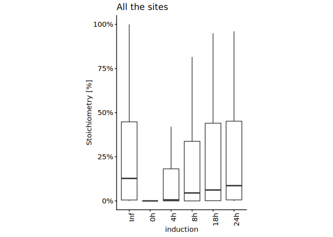<!-- -->

``` r
plot_long_pc2wt_21pc[, .N, by = induction]
```

    ##    induction     N
    ##       <fctr> <int>
    ## 1:        0h    42
    ## 2:       18h    42
    ## 3:       24h    42
    ## 4:        4h    42
    ## 5:        8h    42
    ## 6:       Inf    42

``` r
# Plot ratio

# Merge MS_SS normoxia data with MS_KR_1 WT normoxia data
pc2wt_21pc <- merge(
  lc_MS_SS_KR_PNAS_dt[
    cell == "iJ6" &
    oxygen == "21pc"
  ],
  wt_21pc,
  by = c("protein_accession", "aa_pos")
)

pc2wt_21pc_sub <- pc2wt_21pc[WT_stoichiometry > 0][sample_group != "iJ6_0h_21pc_SS"]

pc2wt_21pc_sub <- copy(pc2wt_21pc_sub)[, data_size_per_site := .N, by = list(protein_accession, aa_pos)]
pc2wt_21pc_sub <- pc2wt_21pc_sub[data_size_per_site == max(pc2wt_21pc_sub[, data_size_per_site])]

# Boxplot - comparing normoxia in different dox incubation timings
ggplot(
  data = pc2wt_21pc_sub,
  aes(
    x = induction,
    y = Stoichiometry / WT_stoichiometry
  )
) +
  #geom_hline(yintercept = 1, color = "gray60") +
  geom_boxplot(outlier.shape = NA) +
  # facet_grid(~ oxygen) +
  ylab("Stoichiometry [% to WT]") +
  theme_classic_2()+
  theme(axis.text.x = element_text(angle = 90, hjust = 1)) + 
  theme(legend.position="right") +
  coord_cartesian(ylim = c(0, 1.5)) +
  theme(aspect.ratio = 2) +
  scale_y_continuous(labels = scales::percent_format(accuracy = 1))
```

<!-- -->

``` r
induction_t_test <- data.table()

for(i in pc2wt_21pc_sub[, unique(induction)]){
  t.out <- t.test(
    pc2wt_21pc_sub[induction == i][, Stoichiometry],
    pc2wt_21pc_sub[induction == i][, WT_stoichiometry],
    paired = TRUE
  )
  induction_t_test <- rbind(
    induction_t_test,
    data.table(induction = i, p_value = t.out$p.value, n = nrow(pc2wt_21pc_sub[induction == i]))
  )  
}

induction_t_test[, padj := p.adjust(p_value, method = "holm")]
induction_t_test[, significance := case_when(
  padj < 0.005 ~ "**",
  padj < 0.05 ~ "*",
  TRUE ~ "N.S."
)]

induction_t_test
```

    ##    induction      p_value     n         padj significance
    ##       <char>        <num> <int>        <num>       <char>
    ## 1:        0h 3.428546e-07    42 1.714273e-06           **
    ## 2:       18h 2.409872e-01    42 4.819744e-01         N.S.
    ## 3:       24h 3.362069e-01    42 4.819744e-01         N.S.
    ## 4:        4h 1.425583e-05    42 5.702331e-05           **
    ## 5:        8h 6.817018e-03    42 2.045105e-02            *

## t50

``` r
# helper: convert time to numeric and replace Inf by a large finite value
time_to_num <- function(x, inf_value = 100) {
  x_chr <- as.character(x)
  out <- suppressWarnings(as.numeric(gsub("[^0-9.]+", "", x_chr)))
  out[grepl("^inf$", x_chr, ignore.case = TRUE)] <- inf_value
  out[is.infinite(out)] <- inf_value
  out
}

calc_t50 <- function(dt, time_col = "induction", y_col = "Stoichiometry", inf_value = 100) {
  t <- time_to_num(dt[[time_col]], inf_value = inf_value)
  y <- as.numeric(dt[[y_col]])

  keep <- is.finite(t) & is.finite(y)
  t <- t[keep]
  y <- y[keep]

  if (length(t) < 2L || uniqueN(t) < 2L || all(y <= 0, na.rm = TRUE)) {
    return(NA_real_)
  }

  # average replicates at the same time
  d <- data.table(t = t, y = y)[, .(y = mean(y, na.rm = TRUE)), by = t][order(t)]

  # monotone increasing fit
  iso <- isoreg(d$t, d$y)
  y_fit <- iso$yf

  ymax <- max(y_fit, na.rm = TRUE)
  if (!is.finite(ymax) || ymax <= 0) return(NA_real_)

  y_half <- ymax / 2

  # first point where fitted curve reaches half-max
  idx <- which(y_fit >= y_half)[1]
  if (is.na(idx)) return(NA_real_)

  if (idx == 1L) return(d$t[1])

  t1 <- d$t[idx - 1L]
  t2 <- d$t[idx]
  y1 <- y_fit[idx - 1L]
  y2 <- y_fit[idx]

  if (y2 == y1) return(mean(c(t1, t2)))

  t1 + (y_half - y1) * (t2 - t1) / (y2 - y1)
}

t50_dt <- lc_MS_SS_KR_PNAS_dt[oxygen == "21pc"][, .(
  t50 = calc_t50(.SD, time_col = "induction", y_col = "Stoichiometry", inf_value = 100),
  n = .N
), by = .(gene_name, aa_pos)]

t50_dt[, `:=`(
  t50_bin = case_when(
    t50 <= 4 ~ "0-4h",
    t50 <= 8 ~ "4-8h",
    TRUE ~ ">8h"
  ) %>% factor(levels = c("0-4h", "4-8h", ">8h"))
)]

t50_dt
```

    ##     gene_name aa_pos       t50     n t50_bin
    ##        <fctr>  <int>     <num> <int>  <fctr>
    ##  1:      BRD4    291 62.000000     7     >8h
    ##  2:      BRD4    329 13.000000     7     >8h
    ##  3:      BRD4    332 10.875997     7     >8h
    ##  4:      BRD4    535  5.205940     7    4-8h
    ##  5:      BRD4    537 12.537167     7     >8h
    ##  6:      BRD4    538  1.914826     7    0-4h
    ##  7:      BRD4    539 20.354251     7     >8h
    ##  8:      BRD4    541  2.000000     6    0-4h
    ##  9:      BRD4    543  2.000000     6    0-4h
    ## 10:      BRD4    544  2.202539     6    0-4h
    ## 11:      BRD4    546 19.094271     6     >8h
    ## 12:      BRD4    547  2.274141     6    0-4h
    ## 13:      BRD4    548  2.757705     6    0-4h
    ## 14:      BRD4    550  5.957624     6    4-8h
    ## 15:      BRD4    552  4.641731     7    4-8h
    ## 16:      BRD4    554 11.541566     7     >8h
    ## 17:      BRD4    561 21.276581     7     >8h
    ## 18:      BRD4    562 15.945181     7     >8h
    ## 19:      BRD4    572  5.688024     7    4-8h
    ## 20:      BRD4    574 19.155493     7     >8h
    ## 21:      BRD4    575 14.865966     7     >8h
    ## 22:      BRD4    727 12.503481     4     >8h
    ## 23:      BRD2    546 19.201084     7     >8h
    ## 24:      BRD2    551  4.166637     5    4-8h
    ## 25:      BRD2    552  6.595157     5    4-8h
    ## 26:      BRD2    554  4.482859     5    4-8h
    ## 27:      BRD2    555  8.000000     4    4-8h
    ## 28:      BRD2    556  8.000000     4    4-8h
    ## 29:      BRD2    557  8.000000     4    4-8h
    ## 30:      BRD2    585 21.000000     7     >8h
    ## 31:      BRD2    586 19.995857     7     >8h
    ## 32:      BRD2    589 13.918552     7     >8h
    ## 33:      BRD2    713 21.000000     7     >8h
    ## 34:      BRD2    718 21.000000     7     >8h
    ## 35:      BRD2    755 19.116352     7     >8h
    ## 36:      BRD2    756 42.153411     7     >8h
    ## 37:      BRD3    245 37.736947     7     >8h
    ## 38:      BRD3    364 31.555315     7     >8h
    ## 39:      BRD3    487 61.640419     7     >8h
    ## 40:      BRD3    489 10.259251     7     >8h
    ## 41:      BRD3    490 20.979746     7     >8h
    ## 42:      BRD3    491  5.273730     7    4-8h
    ## 43:      BRD3    492  2.965761     7    0-4h
    ## 44:      BRD3    494  3.306317     7    0-4h
    ## 45:      BRD3    495  9.684812     7     >8h
    ## 46:      BRD3    500 18.957295     7     >8h
    ## 47:      BRD3    501  5.638917     7    4-8h
    ## 48:      BRD3    502  3.837635     7    0-4h
    ## 49:      BRD3    504  2.000000     7    0-4h
    ## 50:      BRD3    538 10.701912     7     >8h
    ## 51:      BRD3    591  1.758896     7    0-4h
    ## 52:      BRD3    650 13.000000     7     >8h
    ## 53:      BRD3    651  7.106203     7    4-8h
    ## 54:      BRD3    655 13.000000     7     >8h
    ## 55:      BRD3    683 58.749514     7     >8h
    ## 56:      BRD3    684 10.794703     7     >8h
    ##     gene_name aa_pos       t50     n t50_bin

``` r
kinetics_data <- pc2wt_21pc[!(induction %in% c("0h", "18h"))][WT_stoichiometry > 0]

ggplot(
  data = kinetics_data,
  aes(
    x = WT_stoichiometry,
    y = Stoichiometry / WT_stoichiometry
  )
) +
  # geom_smooth(method = "lm", se = FALSE) +
  geom_point() +
  facet_grid(~ induction2) +
  ylab("Stoichiometry [% to WT]") +
  theme_classic_2()+
  theme(axis.text.x = element_text(angle = 90, hjust = 1)) + 
  theme(legend.position="right") +
  coord_cartesian(ylim = c(0, 1.5)) +
  theme(aspect.ratio = 1) +
  scale_x_continuous(labels = scales::percent_format(accuracy = 1))
```

<!-- -->

``` r
kinetics_out <- data.table()

for(i2 in kinetics_data[, unique(induction2)]){
  c1 <- kinetics_data[induction2 == i2] %$%
    cor.test(x = WT_stoichiometry, y = Stoichiometry / WT_stoichiometry, method = "spearman")
  
  kinetics_out <- rbind(kinetics_out, data.table(induction2 = i2, rho = c1$estimate, p_val = c1$p.value, n = nrow(kinetics_data[induction2 == i2])))
}
```

    ## Warning in cor.test.default(x = WT_stoichiometry, y =
    ## Stoichiometry/WT_stoichiometry, : Cannot compute exact p-value with ties
    ## Warning in cor.test.default(x = WT_stoichiometry, y =
    ## Stoichiometry/WT_stoichiometry, : Cannot compute exact p-value with ties
    ## Warning in cor.test.default(x = WT_stoichiometry, y =
    ## Stoichiometry/WT_stoichiometry, : Cannot compute exact p-value with ties

``` r
kinetics_out[, padj := p.adjust(p_val, method = "holm")]

kinetics_out
```

    ##    induction2       rho        p_val     n         padj
    ##        <char>     <num>        <num> <int>        <num>
    ## 1:     18-24h 0.1381575 3.490397e-01    48 3.490397e-01
    ## 2:         4h 0.6632045 1.700021e-06    42 5.100062e-06
    ## 3:         8h 0.4699430 7.513709e-04    48 1.502742e-03

``` r
kinetics_data <- merge(
  kinetics_data,
  t50_dt,
  by = c("gene_name", "aa_pos")
)

ggplot(
  data = kinetics_data[!duplicated(paste(gene_name, aa_pos))],
  aes(
    x = t50_bin,
    y = WT_stoichiometry
  )
) +
  # geom_smooth(method = "lm", se = FALSE) +
  geom_boxplot(outlier.shape = NA) +
  ylab("Stoichiometry [%]") +
  theme_classic_2()+
  theme(axis.text.x = element_text(angle = 90, hjust = 1)) + 
  theme(legend.position="right") +
  coord_cartesian(ylim = c(0, 1)) +
  theme(aspect.ratio = 3) +
  scale_y_continuous(labels = scales::percent_format(accuracy = 1))
```

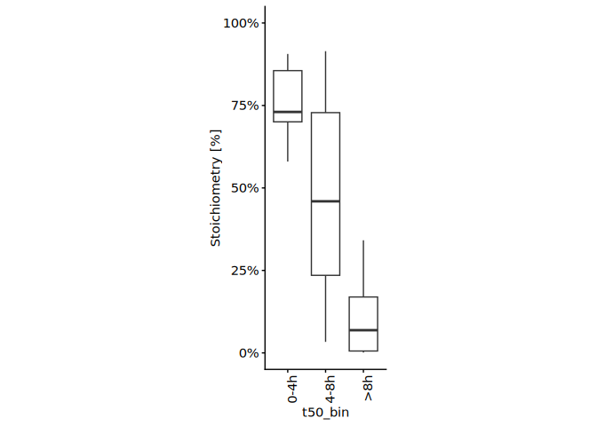<!-- -->

``` r
kinetics_data[!duplicated(paste(gene_name, aa_pos))][, table(gene_name, t50_bin)]
```

    ##          t50_bin
    ## gene_name 0-4h 4-8h >8h
    ##      BRD2    0    6   6
    ##      BRD3    3    3  10
    ##      BRD4    6    4  10

# XIC values against MS_SS, MS_KR_1 and PNAS stoichiometry data.

``` r
#-------------
# XIC vs stoic
#-------------

# Load XIC data
xic_MS_SS <- fread(file.path(data.dir, "xic_MS_SS.csv"))
xic_MS_SS[, induction2 := case_when(
  induction == "18h" ~ "18-24h",
  TRUE ~ induction
)]

on_lc_MS_SS_KR_PNAS_dt <- copy(lc_MS_SS_KR_PNAS_dt)[, induction2 := case_when(
  induction == "18h" ~ "18-24h",
  induction == "24h" ~ "18-24h",
  #induction == "Inf" ~ "18-24h",
  TRUE ~ induction
)]

# on_lc_MS_SS_KR_PNAS_dt <- on_lc_MS_SS_KR_PNAS_dt[induction != "24h"]

# Merge XIC data and stoichiometry data
xic_stoic <- merge(on_lc_MS_SS_KR_PNAS_dt, 
                   xic_MS_SS,
                   by = c("induction2", "oxygen", "gene_name", "aa_pos"))

xic_stoic[, XIC := XIC/100]

# Scatter plot - XIC vs stoichiometry
ggplot(
  xic_stoic,
  aes(
    x = XIC,
    y = Stoichiometry
  )
) + 
  geom_point(size = 2) +
  theme_classic_2() +
  theme(aspect.ratio = 1) +
  coord_cartesian(xlim = c(0, 0.7), ylim = c(0, 0.7)) +
  scale_y_continuous(labels = scales::percent_format(accuracy = 1)) +
  scale_x_continuous(labels = scales::percent_format(accuracy = 1))
```

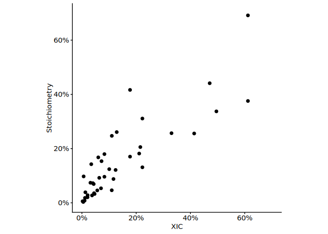<!-- -->

``` r
xic_stoic %$%
cor.test(
  XIC,
  Stoichiometry
)
```

    ## 
    ##  Pearson's product-moment correlation
    ## 
    ## data:  XIC and Stoichiometry
    ## t = 10.24, df = 38, p-value = 1.761e-12
    ## alternative hypothesis: true correlation is not equal to 0
    ## 95 percent confidence interval:
    ##  0.7436956 0.9221384
    ## sample estimates:
    ##       cor 
    ## 0.8567283

``` r
m_xic_stoic <- melt(
  xic_stoic,
  id.vars = c("gene_name", "aa_pos", "oxygen", "induction2"),
  measure.vars = c("Stoichiometry", "XIC"),
  variable.name = "type",
  value.name = "stoichiometry"
)

m_xic_stoic[, `:=`(
  oxygen = factor(oxygen, levels = rev(c("1pc", "4pc", "21pc"))),
  induction2 = factor(induction2, levels = c("4h", "8h", "18-24h"))
)]
```

``` r
ggplot(
  m_xic_stoic,
  aes(
    x = induction2,
    y = stoichiometry,
    color = type
  )
) + 
  facet_grid(~ gene_name + aa_pos + oxygen, scale = "free", space = "free") +
  geom_point(size = 4) +
  theme_classic_2() +
  coord_cartesian(ylim = c(0, 0.7)) +
  scale_x_discrete(guide = guide_axis(angle = 90)) +
  scale_y_continuous(labels = scales::percent_format(accuracy = 1)) +
  scale_color_manual(values = c("XIC" = "black", "Stoichiometry" = "darkred"))
```

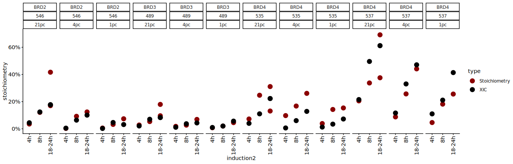<!-- -->

# Interaction

``` r
t50_dt[gene_name == "BRD4"][aa_pos > 534 & aa_pos < 560]
```

    ##     gene_name aa_pos       t50     n t50_bin
    ##        <fctr>  <int>     <num> <int>  <fctr>
    ##  1:      BRD4    535  5.205940     7    4-8h
    ##  2:      BRD4    537 12.537167     7     >8h
    ##  3:      BRD4    538  1.914826     7    0-4h
    ##  4:      BRD4    539 20.354251     7     >8h
    ##  5:      BRD4    541  2.000000     6    0-4h
    ##  6:      BRD4    543  2.000000     6    0-4h
    ##  7:      BRD4    544  2.202539     6    0-4h
    ##  8:      BRD4    546 19.094271     6     >8h
    ##  9:      BRD4    547  2.274141     6    0-4h
    ## 10:      BRD4    548  2.757705     6    0-4h
    ## 11:      BRD4    550  5.957624     6    4-8h
    ## 12:      BRD4    552  4.641731     7    4-8h
    ## 13:      BRD4    554 11.541566     7     >8h

``` r
calculate_low_hyl_stoic_with_high_hylhiometry <- function(input_per_pos_data, high_stoic_sites, low_stoic_sites, sample_group){
  
  peptide_with_high_sotic_sites <- input_per_pos_data[paste(protein_accession, aa_pos) %in% high_stoic_sites[, paste(protein_accession, aa_pos)]][, unique(peptide_id)]
  peptide_with_low_sotic_sites <- input_per_pos_data[paste(protein_accession, aa_pos) %in% low_stoic_sites[, paste(protein_accession, aa_pos)]][, unique(peptide_id)]
  
  hydroxy_input_per_pos_data <- copy(input_per_pos_data)[peptide_id %in% intersect(peptide_with_high_sotic_sites, peptide_with_low_sotic_sites)]
  
  peptide_with_multiple_hydroxyK_sites <- hydroxy_input_per_pos_data[, .N, by = list(peptide_id)][N > 1, unique(peptide_id)]
  
  sl_input_per_pos_data <- input_per_pos_data[peptide_id %in% peptide_with_multiple_hydroxyK_sites]
  
  interaction_summary <- data.table()
  
  for(high_hyl_site in high_stoic_sites[, paste(protein_accession, aa_pos)]){
    for(low_hyl_site in low_stoic_sites[, paste(protein_accession, aa_pos)]){
      
      peptide_with_both_sites <- sl_input_per_pos_data[(paste(protein_accession, aa_pos) %in% high_hyl_site) | (paste(protein_accession, aa_pos) %in% low_hyl_site)] %>%
        {.[, .N, by = peptide_id][N > 1, unique(peptide_id)]}
      
      if(length(peptide_with_both_sites) > 1){
        stoic_sl_input_per_pos_data <- sl_input_per_pos_data[peptide_id %in% peptide_with_both_sites]
        
        total_raw_stoic <- stoic_sl_input_per_pos_data[paste(protein_accession, aa_pos) == low_hyl_site & ptm %in% c("[Oxidation (K) DI]", "[Oxidised Propionylation (K) DI]"), sum(peak_intensity)] /
          stoic_sl_input_per_pos_data[paste(protein_accession, aa_pos) == low_hyl_site , sum(peak_intensity)]
        
        peptide_with_hyl_in_high <- stoic_sl_input_per_pos_data[
          ptm %in% c("[Oxidation (K) DI]", "[Oxidised Propionylation (K) DI]")
        ][paste(protein_accession, aa_pos) == high_hyl_site, unique(peptide_id)]
        
        highK_stoic_sl_input_per_pos_data <- stoic_sl_input_per_pos_data[peptide_id %in% peptide_with_hyl_in_high]
        
        highHyl_stoic <- highK_stoic_sl_input_per_pos_data[paste(protein_accession, aa_pos) == low_hyl_site & ptm %in% c("[Oxidation (K) DI]", "[Oxidised Propionylation (K) DI]"), sum(peak_intensity)] /
          highK_stoic_sl_input_per_pos_data[paste(protein_accession, aa_pos) == low_hyl_site , sum(peak_intensity)]
        
        no_highK_stoic_sl_input_per_pos_data <- stoic_sl_input_per_pos_data[!(peptide_id %in% peptide_with_hyl_in_high)]
        
        low_hyl_stoic_without_high_hyl <- no_highK_stoic_sl_input_per_pos_data[paste(protein_accession, aa_pos) == low_hyl_site & ptm %in% c("[Oxidation (K) DI]", "[Oxidised Propionylation (K) DI]"), sum(peak_intensity)] /
          no_highK_stoic_sl_input_per_pos_data[paste(protein_accession, aa_pos) == low_hyl_site , sum(peak_intensity)]
        
        interaction_summary <- rbind(
          interaction_summary, 
          data.table(
            protein_accession = str_split_fixed(high_hyl_site, " ", 2)[, 1], 
            high_stoic_aa_pos = str_split_fixed(high_hyl_site, " ", 2)[, 2] %>% as.integer, 
            low_stoic_aa_pos = str_split_fixed(low_hyl_site, " ", 2)[, 2] %>% as.integer, 
            low_hyl_total_stoic = total_raw_stoic, 
            low_hyl_stoic_with_high_hyl = highHyl_stoic,
            low_hyl_stoic_without_high_hyl,
            n = length(peptide_with_both_sites),
            sample_group
          )
        )
      } else {}
    }
  }
  
  interaction_summary <- interaction_summary[low_hyl_total_stoic > 0]
  
  return(interaction_summary)
}

t50_dt[gene_name == "BRD4"][aa_pos > 534 & aa_pos < 560]
```

    ##     gene_name aa_pos       t50     n t50_bin
    ##        <fctr>  <int>     <num> <int>  <fctr>
    ##  1:      BRD4    535  5.205940     7    4-8h
    ##  2:      BRD4    537 12.537167     7     >8h
    ##  3:      BRD4    538  1.914826     7    0-4h
    ##  4:      BRD4    539 20.354251     7     >8h
    ##  5:      BRD4    541  2.000000     6    0-4h
    ##  6:      BRD4    543  2.000000     6    0-4h
    ##  7:      BRD4    544  2.202539     6    0-4h
    ##  8:      BRD4    546 19.094271     6     >8h
    ##  9:      BRD4    547  2.274141     6    0-4h
    ## 10:      BRD4    548  2.757705     6    0-4h
    ## 11:      BRD4    550  5.957624     6    4-8h
    ## 12:      BRD4    552  4.641731     7    4-8h
    ## 13:      BRD4    554 11.541566     7     >8h

``` r
high_stoic_sites <- data.table(protein_accession = "O60885", aa_pos = c(535, 538, 548)) # 535 included here for computation purpose
low_stoic_sites <- data.table(protein_accession = "O60885", aa_pos = c(535, 537, 550, 552))


dataA_per_pos <- fread(file.path(results.dir, "p2-analysis-setting/MQ_DI_noH2O/DI_noH2O_data-A_trp_m7_v7_def_all_per_pos_data.csv"))[gene_name %in% c("BRD2", "BRD3", "BRD4")] %>%
  {.[sample_name == "JQ1_HeLaWT_derivatised"]}
dataA_interaction_summary <- calculate_low_hyl_stoic_with_high_hylhiometry(input_per_pos_data = dataA_per_pos, high_stoic_sites, low_stoic_sites, sample_group = "WT_PNAS2022")

MS_KR_1_per_pos <- fread(file.path(results.dir, "p2-analysis-setting/MS_KR_1_noH2O/MS_KR_1_noH2O_all_per_pos_data.csv"))[gene_name %in% c("BRD2", "BRD3", "BRD4")] 
MS_KR_1_WT_per_pos <- MS_KR_1_per_pos[sample_name == "HeLaWT_NA_N_NA"]
MS_KR_1_WT_interaction_summary <- calculate_low_hyl_stoic_with_high_hylhiometry(input_per_pos_data = MS_KR_1_WT_per_pos, high_stoic_sites, low_stoic_sites, sample_group = "WT")

MS_KR_1_24h_per_pos <- MS_KR_1_per_pos[sample_name == "HeLaiJMJD6_Dox_N_NA"]
MS_KR_1_24h_interaction_summary <- calculate_low_hyl_stoic_with_high_hylhiometry(input_per_pos_data = MS_KR_1_24h_per_pos, high_stoic_sites, low_stoic_sites, sample_group = "iJMJD6 24h")

MS_SS_1_per_pos <- fread(file.path(results.dir, "p2-analysis-setting/MS_SS_noH2O/MS_SS_all_per_pos_data.csv")) %>%
  {rbind(.[gene_name %in% c("BRD4")][sample_name == "18h_21pc_BRD4"], .[gene_name %in% c("BRD2", "BRD3")][sample_name == "18h_21pc_BRD23"])}
MS_SS_1_interaction_summary <- calculate_low_hyl_stoic_with_high_hylhiometry(input_per_pos_data = MS_SS_1_per_pos, high_stoic_sites, low_stoic_sites, sample_group = "iJMJD6 18h")

all_interaction_summary <- rbindlist(
  list(
    dataA_interaction_summary, MS_KR_1_WT_interaction_summary, MS_KR_1_24h_interaction_summary, MS_SS_1_interaction_summary 
  )
)

## Stats
interaction_out_data <- data.table()

all_sites_to_analyse <- all_interaction_summary[!duplicated(paste(protein_accession, high_stoic_aa_pos, low_stoic_aa_pos))][, .(protein_accession, high_stoic_aa_pos, low_stoic_aa_pos)]

for(irow in 1:nrow(all_sites_to_analyse)){
  
  sl_all_interaction_summary <- merge(
    all_interaction_summary,
    all_sites_to_analyse[irow],
    by = c("protein_accession", "high_stoic_aa_pos", "low_stoic_aa_pos")
  )
  
  if(nrow(sl_all_interaction_summary) > 2){
    
    t_out <- sl_all_interaction_summary %$%
      t.test(low_hyl_stoic_without_high_hyl, low_hyl_stoic_with_high_hyl, paired = TRUE)
    
    m_all_interaction_summary <- melt(
      sl_all_interaction_summary, 
      id.vars = c("protein_accession", "high_stoic_aa_pos", "low_stoic_aa_pos", "n"), 
      measure.vars = c("low_hyl_stoic_without_high_hyl", "low_hyl_stoic_with_high_hyl"),
      variable.name = "type",
      value.name = "stoichiometry"
    )
    
    interaction_out_data <- rbind(
      interaction_out_data,
      data.table(all_sites_to_analyse[irow], p_val = t_out$p.value, n = nrow(sl_all_interaction_summary))
    )} else {}
}


interaction_out_data
```

    ##    protein_accession high_stoic_aa_pos low_stoic_aa_pos       p_val     n
    ##               <char>             <int>            <int>       <num> <int>
    ## 1:            O60885               535              537 0.066869776     4
    ## 2:            O60885               538              535 0.003700816     4
    ## 3:            O60885               538              537 0.071239152     4
    ## 4:            O60885               548              550 0.057590253     4
    ## 5:            O60885               548              552 0.136244776     4

``` r
all_interaction_summary[!(high_stoic_aa_pos == 550)] %$%
  t.test(low_hyl_stoic_without_high_hyl, low_hyl_stoic_with_high_hyl, paired = TRUE)
```

    ## 
    ##  Paired t-test
    ## 
    ## data:  low_hyl_stoic_without_high_hyl and low_hyl_stoic_with_high_hyl
    ## t = -6.0346, df = 19, p-value = 8.345e-06
    ## alternative hypothesis: true mean difference is not equal to 0
    ## 95 percent confidence interval:
    ##  -0.3614428 -0.1752847
    ## sample estimates:
    ## mean difference 
    ##      -0.2683637

``` r
## Plot
m_all_interaction_summary <- melt(
  all_interaction_summary, 
  id.vars = c("protein_accession", "high_stoic_aa_pos", "low_stoic_aa_pos", "n", "sample_group"), 
  measure.vars = c("low_hyl_stoic_with_high_hyl", "low_hyl_stoic_without_high_hyl"),
  variable.name = "type",
  value.name = "stoichiometry"
)

m_all_interaction_summary[, type := gsub("low_hyl_stoic_", "", type)]

ggplot(
  data = m_all_interaction_summary[!(high_stoic_aa_pos == 550)],
  aes(
    x = type,
    y = stoichiometry,
    group = paste(sample_group, high_stoic_aa_pos, low_stoic_aa_pos),
    color = paste(high_stoic_aa_pos, low_stoic_aa_pos)
  )
) +
  geom_line(color = "black") +
  geom_point(size = 4) +
  scale_y_continuous(labels = scales::percent_format(accuracy = 1)) +
  scale_color_bright() +
  scale_x_discrete(guide = guide_axis(angle = 90)) +
  theme_classic_2() +
  theme(aspect.ratio = 4)
```

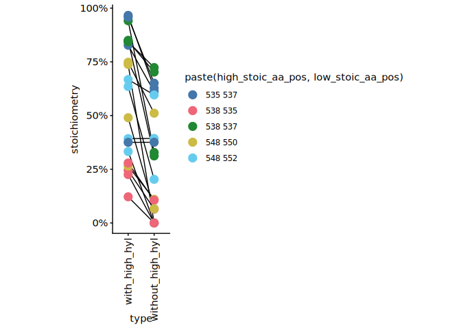<!-- -->

``` r
ggplot(
  data = m_all_interaction_summary[high_stoic_aa_pos == 535],
  aes(
    x = type,
    y = stoichiometry,
    group = paste(sample_group, high_stoic_aa_pos, low_stoic_aa_pos)
  )
) +
  geom_line(color = "black") +
  geom_point(size = 4) +
  scale_color_bright() +
  scale_y_continuous(labels = scales::percent_format(accuracy = 1)) +
  scale_x_discrete(guide = guide_axis(angle = 90)) +
  coord_cartesian(ylim = c(0, 1)) +
  theme_classic_2() +
  theme(aspect.ratio = 4) +
  ggtitle("BRD4 K535-K537 interaction")
```

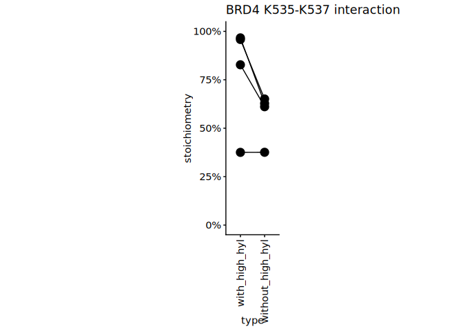<!-- -->

# Oxygen sensitivity - Comparing hypoxia stoichiometry under varying dox incubation (+ diagnostic ion)

``` r
# Boxplot - Comparing the stoic between normoxia and varying pc of hypoxia
# Data subset to overnight (18/24h) dox induction

on_data <- lc_MS_SS_KR_PNAS_dt[induction2 %in% c("18-24h", "Inf")][
  sample_group != "iJ6_18h_21pc_SS" # As iJ6_24h_21pc_KR exists
]


#---------------------------------------------
# Stoichiometry relative to WT values
#---------------------------------------------

# subset data to WT normoxia (MS_KR_1 sample)
wt_on <- on_data[induction2 == "Inf", .(protein_accession, aa_pos, Stoichiometry)]
setnames(wt_on, old = "Stoichiometry", "WT_stoichiometry")

# Merge MS_SS normoxia data with MS_KR_1 WT normoxia data
pc2wt_on <- merge(
  on_data[induction2 != "Inf"],
  wt_on,
  by = c("protein_accession", "aa_pos")
)

pc2wt_on <- copy(pc2wt_on)[, data_size_per_site := .N, by = list(protein_accession, aa_pos)]
pc2wt_on <- pc2wt_on[data_size_per_site == max(pc2wt_on[, data_size_per_site])]

pc2wt_on <- pc2wt_on[WT_stoichiometry > 0]
pc2wt_on[, `:=`(
  oxygen = factor(oxygen, c("21pc", "4pc", "1pc", "01pc"))
)]

ggplot(
  data = pc2wt_on,
  aes(
    x = oxygen,
    y = Stoichiometry
  )
) +
  geom_boxplot(outlier.shape = NA) +
  ylab("Stoichiometry") +
  theme_classic_2()+
  theme(axis.text.x = element_text(angle = 90, hjust = 1)) + 
  theme(legend.position="right") +
  coord_cartesian(ylim = c(0, 1)) +
  theme(aspect.ratio = 2) +
  scale_y_continuous(labels = scales::percent_format(accuracy = 1)) +
  ggtitle("Min WT stoichiometry > 0")
```

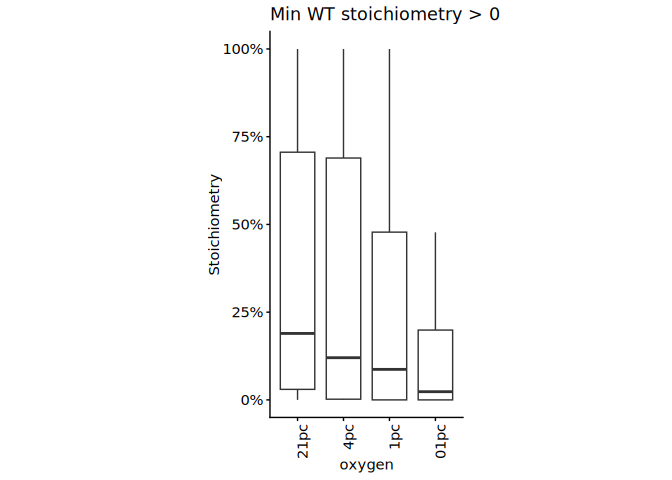<!-- -->

``` r
pc2wt_on[, .N, by = oxygen]
```

    ##    oxygen     N
    ##    <fctr> <int>
    ## 1:    1pc    48
    ## 2:    4pc    48
    ## 3:   01pc    48
    ## 4:   21pc    48

``` r
# Boxplot - comparing normoxia versus hypoxia
ggplot(
  data = pc2wt_on,
  aes(
    x = oxygen,
    y = Stoichiometry / WT_stoichiometry
  )
) +
  #geom_hline(yintercept = 1, color = "gray60") +
  geom_boxplot(outlier.shape = NA) +
  # facet_grid(~ oxygen) +
  ylab("Stoichiometry [% to WT]") +
  theme_classic_2()+
  theme(axis.text.x = element_text(angle = 90, hjust = 1)) + 
  theme(legend.position="right") +
  coord_cartesian(ylim = c(0, 1.5)) +
  theme(aspect.ratio = 2) +
  scale_y_continuous(labels = scales::percent_format(accuracy = 1))
```

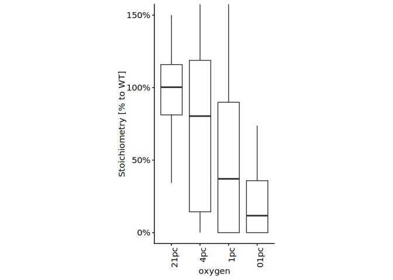<!-- -->

``` r
oxygen_t_test <- data.table()

for(i in pc2wt_on[, unique(oxygen)]){
  t.out <- t.test(
    pc2wt_on[oxygen == i][, Stoichiometry/WT_stoichiometry],
    pc2wt_on[oxygen == "21pc"][, Stoichiometry/WT_stoichiometry],
    paired = TRUE
  )
  oxygen_t_test <- rbind(
    oxygen_t_test,
    data.table(induction = i, p_value = t.out$p.value, n = nrow(pc2wt_on[data_size_per_site == max(pc2wt_on[, data_size_per_site])][oxygen == i]))
  )  
}

oxygen_t_test[, padj := p.adjust(p_value, method = "holm")]
oxygen_t_test[, significance := case_when(
  padj < 0.005 ~ "**",
  padj < 0.05 ~ "*",
  TRUE ~ "N.S."
)]

oxygen_t_test
```

    ##    induction      p_value     n         padj significance
    ##       <char>        <num> <int>        <num>       <char>
    ## 1:       1pc 1.988958e-05    48 3.977917e-05           **
    ## 2:       4pc 3.860210e-02    48 3.860210e-02            *
    ## 3:      01pc 9.613294e-12    48 2.883988e-11           **
    ## 4:      21pc          NaN    48          NaN         N.S.

# Relationship of the stoichiometry in WT and changes in stoichiometry by hypoxia

``` r
ggplot(
  data = pc2wt_on[oxygen != "21pc"],
  aes(
    x = WT_stoichiometry,
    y = Stoichiometry / WT_stoichiometry
  )
) +
  geom_smooth(method = "lm", se = FALSE) +
  geom_point(size = 2) +
  facet_grid(~ oxygen) +
  theme(
    aspect.ratio = 1,
    legend.position = NULL
  ) +
  ylab("Stoichiometry [% to WT]") +
  scale_y_continuous(labels = scales::percent_format(accuracy = 1)) +
  scale_x_continuous(labels = scales::percent_format(accuracy = 1))
```

    ## `geom_smooth()` using formula = 'y ~ x'

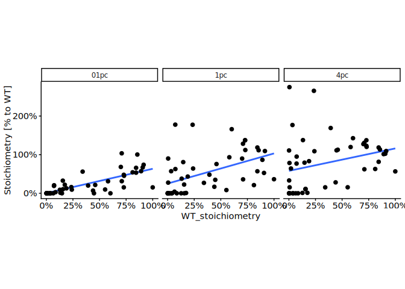<!-- -->

``` r
oxygen_out <- data.table()

for(o2 in pc2wt_on[oxygen != "21pc"][, unique(oxygen)]){
  c2 <- pc2wt_on[oxygen == o2] %$%
    cor.test(
      WT_stoichiometry, Stoichiometry / WT_stoichiometry, method = "spearman"
    )
  
    oxygen_out <- rbind(oxygen_out, data.table(oxygen = o2, rho = c2$estimate, p_val = c2$p.value, n = nrow(pc2wt_on[oxygen == o2])))
}
```

    ## Warning in cor.test.default(WT_stoichiometry, Stoichiometry/WT_stoichiometry, :
    ## Cannot compute exact p-value with ties
    ## Warning in cor.test.default(WT_stoichiometry, Stoichiometry/WT_stoichiometry, :
    ## Cannot compute exact p-value with ties
    ## Warning in cor.test.default(WT_stoichiometry, Stoichiometry/WT_stoichiometry, :
    ## Cannot compute exact p-value with ties

``` r
oxygen_out[, padj := p.adjust(p_val, method = "holm")]

oxygen_out
```

    ##    oxygen       rho        p_val     n         padj
    ##    <char>     <num>        <num> <int>        <num>
    ## 1:    1pc 0.6117460 3.846637e-06    48 7.693273e-06
    ## 2:    4pc 0.4209248 2.890543e-03    48 2.890543e-03
    ## 3:   01pc 0.8053679 5.133028e-12    48 1.539908e-11

``` r
# Boxplot - Comparing the stoic between normoxia and varying pc of hypoxia
on_01pc_MS_KR_1_data <- lc_MS_SS_KR_PNAS_dt[induction2 %in% c("18-24h", "Inf")][
  sample_group == "iJ6_24h_01pc_KR"
]
setnames(on_01pc_MS_KR_1_data, old = "Stoichiometry", "ON01_stioichiomtry")

wt_on <- lc_MS_SS_KR_PNAS_dt[sample_group == "WT_Inf_21pc_KR"]
setnames(wt_on, old = "Stoichiometry", "WT_stoichiometry")

merge.dts <- function(dt_list, by_columns){Reduce(function(...) merge(..., by = by_columns), dt_list)}

sl.columns <- c("protein_accession", "aa_pos")

ref_dts <- merge.dts(
  dt_list = list(
    on_01pc_MS_KR_1_data[, c(sl.columns, "ON01_stioichiomtry"), with = FALSE],
    wt_on[, c(sl.columns, "WT_stoichiometry"), with = FALSE]
  ),
  by = sl.columns
)

non_ref_lc_MS_SS_KR_PNAS_dt <- lc_MS_SS_KR_PNAS_dt[
  !(sample_group %in% c("iJ6_24h_01pc_KR", "WT_Inf_21pc_KR", "iJ6_0h_21pc_SS", "iJ6_0h_21pc_KR", "iJ6_18h_21pc_SS"))
]

induction2vsref_21pc <- merge(
  non_ref_lc_MS_SS_KR_PNAS_dt,
  ref_dts,
  by = sl.columns
)

induction2vsref_21pc <- induction2vsref_21pc[WT_stoichiometry > 0]
## induction2vsref_21pc <- induction2vsref_21pc[sample_group %in% c("iJ6_4h_21pc_SS", "iJ6_8h_21pc_SS", "iJ6_24h_21pc_KR")]
induction2vsref_21pc[, data_size_per_site := .N, by = list(protein_accession, aa_pos)]
induction2vsref_21pc <- induction2vsref_21pc[data_size_per_site == max(induction2vsref_21pc[, data_size_per_site])]

induction2vsref_21pc[, .N, by = list(sample_group, gene_name)][order(sample_group)]
```

    ##        sample_group gene_name     N
    ##              <fctr>    <fctr> <int>
    ##  1:  iJ6_18h_1pc_SS      BRD4    20
    ##  2:  iJ6_18h_1pc_SS      BRD2     6
    ##  3:  iJ6_18h_1pc_SS      BRD3    16
    ##  4:  iJ6_18h_4pc_SS      BRD4    20
    ##  5:  iJ6_18h_4pc_SS      BRD2     6
    ##  6:  iJ6_18h_4pc_SS      BRD3    16
    ##  7: iJ6_24h_21pc_KR      BRD4    20
    ##  8: iJ6_24h_21pc_KR      BRD2     6
    ##  9: iJ6_24h_21pc_KR      BRD3    16
    ## 10:   iJ6_4h_1pc_SS      BRD4    20
    ## 11:   iJ6_4h_1pc_SS      BRD2     6
    ## 12:   iJ6_4h_1pc_SS      BRD3    16
    ## 13:  iJ6_4h_21pc_SS      BRD4    20
    ## 14:  iJ6_4h_21pc_SS      BRD2     6
    ## 15:  iJ6_4h_21pc_SS      BRD3    16
    ## 16:   iJ6_4h_4pc_SS      BRD4    20
    ## 17:   iJ6_4h_4pc_SS      BRD2     6
    ## 18:   iJ6_4h_4pc_SS      BRD3    16
    ## 19:   iJ6_8h_1pc_SS      BRD4    20
    ## 20:   iJ6_8h_1pc_SS      BRD2     6
    ## 21:   iJ6_8h_1pc_SS      BRD3    16
    ## 22:  iJ6_8h_21pc_SS      BRD4    20
    ## 23:  iJ6_8h_21pc_SS      BRD2     6
    ## 24:  iJ6_8h_21pc_SS      BRD3    16
    ## 25:   iJ6_8h_4pc_SS      BRD4    20
    ## 26:   iJ6_8h_4pc_SS      BRD2     6
    ## 27:   iJ6_8h_4pc_SS      BRD3    16
    ##        sample_group gene_name     N

``` r
ggplot(
  data = induction2vsref_21pc,
  aes(
    x = ON01_stioichiomtry,
    y = Stoichiometry
  )
) +
  # geom_smooth(method = "lm", se = FALSE) +
  geom_abline(intercept = 0, slope = 1) +
  geom_point() +
  facet_grid(oxygen ~ induction2) +
  theme(aspect.ratio = 1) +
  coord_cartesian(ylim = c(0, 1), xlim = c(0, 1))
```

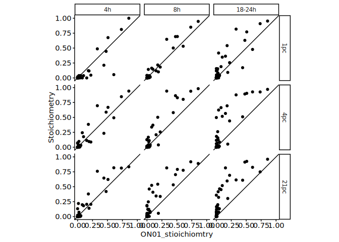<!-- -->

``` r
rsq_out_dt <- data.table()

for(o2 in induction2vsref_21pc[, unique(oxygen)]){
  for(i2 in induction2vsref_21pc[, unique(induction2)]){
    rsq_dt <- induction2vsref_21pc[
      oxygen == o2 & induction2 == i2
    ]
    rsq_dt[, mean_St := mean(Stoichiometry)]
    rsq <- 1 - sum(rsq_dt[, (Stoichiometry - ON01_stioichiomtry)^2]) / sum(rsq_dt[, (Stoichiometry - mean_St)^2])
    rsq_out_dt <- rbind(
      rsq_out_dt, data.table(oxygen = o2, induction2 = i2, rsq = rsq, n = nrow(rsq_dt))
    )
  }
}

rsq_out_dt
```

    ##    oxygen induction2       rsq     n
    ##    <char>     <char>     <num> <int>
    ## 1:    1pc     18-24h 0.6976193    42
    ## 2:    1pc         4h 0.7678493    42
    ## 3:    1pc         8h 0.9091016    42
    ## 4:    4pc     18-24h 0.4727418    42
    ## 5:    4pc         4h 0.8588508    42
    ## 6:    4pc         8h 0.7383229    42
    ## 7:   21pc     18-24h 0.4097677    42
    ## 8:   21pc         4h 0.8504380    42
    ## 9:   21pc         8h 0.6441541    42

``` r
pc2wt_on_kinetics <- merge(
  pc2wt_on,
  t50_dt,
  by = c("gene_name", "aa_pos")
)

library("ggbeeswarm")

ggplot(
  pc2wt_on_kinetics[n == 7][oxygen != "21pc"],
  aes(
    x = t50,
    y = Stoichiometry / WT_stoichiometry
  )
) +
  geom_point(size = 2) +
  facet_grid(~ oxygen) +
  theme(
    aspect.ratio = 1,
    legend.position = NULL
  ) +
  ylab("Stoichiometry [% to WT]") +
  coord_cartesian(xlim = c(0, 24)) +
  scale_y_continuous(labels = scales::percent_format(accuracy = 1))
```

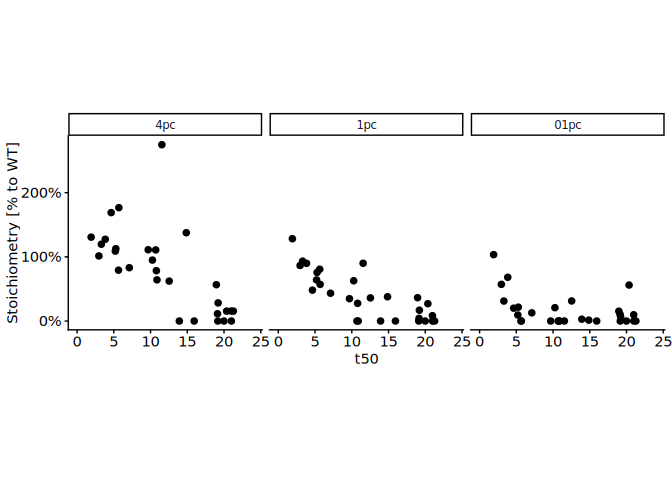<!-- -->

``` r
ggplot(
  pc2wt_on_kinetics[n == 7][oxygen != "21pc"],
  aes(
    x = oxygen,
    y = Stoichiometry / WT_stoichiometry
  )
) +
  geom_boxplot(outlier.shape = NA) +
  geom_beeswarm() +
  facet_grid(~ t50_bin) +
  theme(
    aspect.ratio = 3,
    legend.position = NULL
  ) +
  ylab("Stoichiometry [% to WT]") +
  scale_x_discrete(guide = guide_axis(angle = 90)) +
  coord_cartesian(ylim = c(0, 2)) +
  scale_y_continuous(labels = scales::percent_format(accuracy = 1))
```

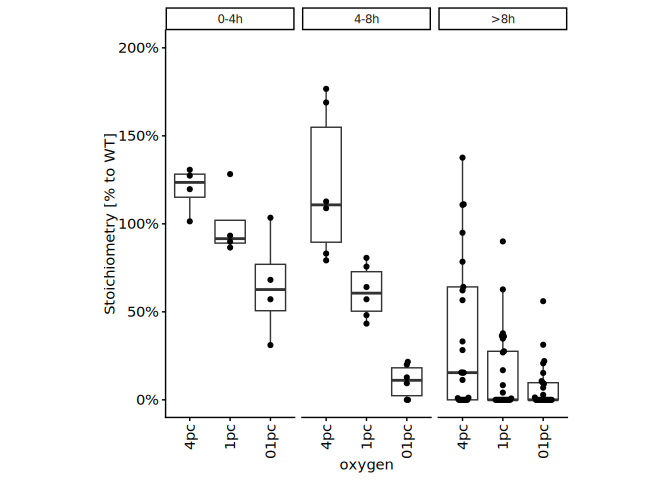<!-- -->

``` r
# QC
ggplot(
  pc2wt_on_kinetics[n == 7],
  aes(
    x = oxygen,
    y = Stoichiometry / WT_stoichiometry
  )
) +
  geom_boxplot(outlier.shape = NA) +
  facet_grid(~ t50_bin) +
  theme(
    aspect.ratio = 3,
    legend.position = NULL
  ) +
  ylab("Stoichiometry [% to WT]") +
  scale_x_discrete(guide = guide_axis(angle = 90)) +
  coord_cartesian(ylim = c(0, 2)) +
  scale_y_continuous(labels = scales::percent_format(accuracy = 1))
```

<!-- -->

``` r
pc2wt_on_kinetics[n == 7][, .N, by = list(oxygen, t50_bin)]
```

    ##     oxygen t50_bin     N
    ##     <fctr>  <fctr> <int>
    ##  1:    1pc     >8h    25
    ##  2:    4pc     >8h    25
    ##  3:   01pc     >8h    25
    ##  4:   21pc     >8h    25
    ##  5:    1pc    4-8h     6
    ##  6:    4pc    4-8h     6
    ##  7:   01pc    4-8h     6
    ##  8:   21pc    4-8h     6
    ##  9:    1pc    0-4h     4
    ## 10:    4pc    0-4h     4
    ## 11:   01pc    0-4h     4
    ## 12:   21pc    0-4h     4

# Session information

``` r
sessioninfo::session_info()
```

    ## ─ Session info ───────────────────────────────────────────────────────────────
    ##  setting  value
    ##  version  R version 4.4.3 (2025-02-28)
    ##  os       Ubuntu 24.04.2 LTS
    ##  system   x86_64, linux-gnu
    ##  ui       X11
    ##  language (EN)
    ##  collate  C.UTF-8
    ##  ctype    C.UTF-8
    ##  tz       Europe/Berlin
    ##  date     2026-04-16
    ##  pandoc   3.2 @ /usr/lib/rstudio-server/bin/quarto/bin/tools/x86_64/ (via rmarkdown)
    ##  quarto   1.5.57 @ /usr/lib/rstudio-server/bin/quarto/bin/quarto
    ## 
    ## ─ Packages ───────────────────────────────────────────────────────────────────
    ##  package           * version    date (UTC) lib source
    ##  beeswarm            0.4.0      2021-06-01 [1] CRAN (R 4.4.3)
    ##  BiocGenerics      * 0.52.0     2024-10-29 [1] Bioconduc~
    ##  Biostrings        * 2.74.1     2024-12-16 [1] Bioconduc~
    ##  cellranger          1.1.0      2016-07-27 [1] CRAN (R 4.4.3)
    ##  cli                 3.6.5      2025-04-23 [1] CRAN (R 4.4.3)
    ##  crayon              1.5.3      2024-06-20 [1] CRAN (R 4.4.3)
    ##  data.table        * 1.17.8     2025-07-10 [1] CRAN (R 4.4.3)
    ##  digest              0.6.37     2024-08-19 [1] CRAN (R 4.4.3)
    ##  dplyr             * 1.1.4      2023-11-17 [1] CRAN (R 4.4.3)
    ##  evaluate            1.0.5      2025-08-27 [1] CRAN (R 4.4.3)
    ##  farver              2.1.2      2024-05-13 [1] CRAN (R 4.4.3)
    ##  fastmap             1.2.0      2024-05-15 [1] CRAN (R 4.4.3)
    ##  generics            0.1.4      2025-05-09 [1] CRAN (R 4.4.3)
    ##  GenomeInfoDb      * 1.42.3     2025-01-27 [1] Bioconduc~
    ##  GenomeInfoDbData    1.2.13     2025-07-21 [1] Bioconductor
    ##  ggbeeswarm        * 0.7.2      2023-04-29 [1] CRAN (R 4.4.3)
    ##  ggplot2           * 4.0.0      2025-09-11 [1] CRAN (R 4.4.3)
    ##  glue                1.8.0      2024-09-30 [1] CRAN (R 4.4.3)
    ##  gtable              0.3.6      2024-10-25 [1] CRAN (R 4.4.3)
    ##  htmltools           0.5.8.1    2024-04-04 [1] CRAN (R 4.4.3)
    ##  httr                1.4.7      2023-08-15 [1] CRAN (R 4.4.3)
    ##  IRanges           * 2.40.1     2024-12-05 [1] Bioconduc~
    ##  janitor           * 2.2.1      2024-12-22 [1] CRAN (R 4.4.3)
    ##  jsonlite            2.0.0      2025-03-27 [1] CRAN (R 4.4.3)
    ##  khroma            * 1.16.0     2025-02-25 [1] CRAN (R 4.4.3)
    ##  knitr             * 1.50       2025-03-16 [1] CRAN (R 4.4.3)
    ##  labeling            0.4.3      2023-08-29 [1] CRAN (R 4.4.3)
    ##  lattice             0.22-5     2023-10-24 [4] CRAN (R 4.3.3)
    ##  lifecycle           1.0.4      2023-11-07 [1] CRAN (R 4.4.3)
    ##  lubridate           1.9.4      2024-12-08 [1] CRAN (R 4.4.3)
    ##  magrittr          * 2.0.4      2025-09-12 [1] CRAN (R 4.4.3)
    ##  Matrix              1.7-3      2025-03-11 [1] CRAN (R 4.4.3)
    ##  mgcv                1.9-1      2023-12-21 [1] CRAN (R 4.4.3)
    ##  nlme                3.1-168    2025-03-31 [4] CRAN (R 4.4.3)
    ##  pillar              1.11.1     2025-09-17 [1] CRAN (R 4.4.3)
    ##  pkgconfig           2.0.3      2019-09-22 [1] CRAN (R 4.4.3)
    ##  ptm.stoichiometry * 0.0.0.9000 2025-12-13 [1] local
    ##  R6                  2.6.1      2025-02-15 [1] CRAN (R 4.4.3)
    ##  RColorBrewer        1.1-3      2022-04-03 [1] CRAN (R 4.4.3)
    ##  readxl            * 1.4.5      2025-03-07 [1] CRAN (R 4.4.3)
    ##  rlang               1.1.6      2025-04-11 [1] CRAN (R 4.4.3)
    ##  rmarkdown           2.29       2024-11-04 [1] CRAN (R 4.4.3)
    ##  rstudioapi          0.17.1     2024-10-22 [1] CRAN (R 4.4.3)
    ##  S4Vectors         * 0.44.0     2024-10-29 [1] Bioconduc~
    ##  S7                  0.2.0      2024-11-07 [1] CRAN (R 4.4.3)
    ##  scales              1.4.0      2025-04-24 [1] CRAN (R 4.4.3)
    ##  sessioninfo         1.2.3      2025-02-05 [1] CRAN (R 4.4.3)
    ##  snakecase           0.11.1     2023-08-27 [1] CRAN (R 4.4.3)
    ##  stringi             1.8.7      2025-03-27 [1] CRAN (R 4.4.3)
    ##  stringr           * 1.5.2      2025-09-08 [1] CRAN (R 4.4.3)
    ##  tibble              3.3.0      2025-06-08 [1] CRAN (R 4.4.3)
    ##  tidyselect          1.2.1      2024-03-11 [1] CRAN (R 4.4.3)
    ##  timechange          0.3.0      2024-01-18 [1] CRAN (R 4.4.3)
    ##  UCSC.utils          1.2.0      2024-10-29 [1] Bioconduc~
    ##  vctrs               0.6.5      2023-12-01 [1] CRAN (R 4.4.3)
    ##  vipor               0.4.7      2023-12-18 [1] CRAN (R 4.4.3)
    ##  withr               3.0.2      2024-10-28 [1] CRAN (R 4.4.3)
    ##  xfun                0.53       2025-08-19 [1] CRAN (R 4.4.3)
    ##  XVector           * 0.46.0     2024-10-29 [1] Bioconduc~
    ##  yaml                2.3.10     2024-07-26 [1] CRAN (R 4.4.3)
    ##  zlibbioc            1.52.0     2024-10-29 [1] Bioconduc~
    ## 
    ##  [1] /home/ysugimo/R/x86_64-pc-linux-gnu-library/4.4
    ##  [2] /usr/local/lib/R/site-library
    ##  [3] /usr/lib/R/site-library
    ##  [4] /usr/lib/R/library
    ##  * ── Packages attached to the search path.
    ## 
    ## ──────────────────────────────────────────────────────────────────────────────
