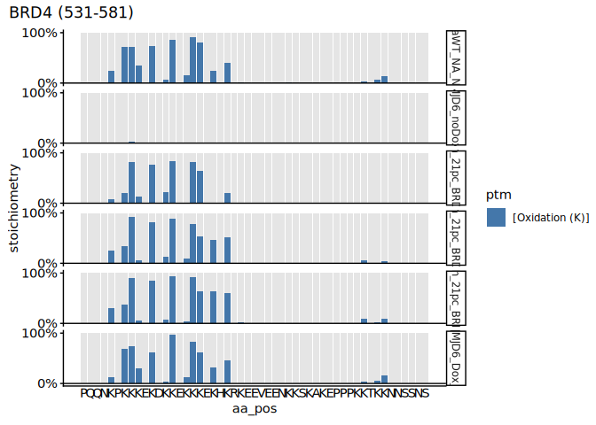
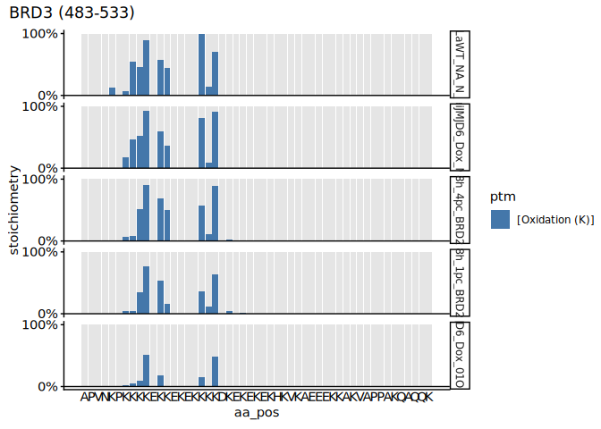

2-8. Site-specific stoichiometry of lysine hydroxylations in varying O2%
and dox induction time
================
Yoichiro Sugimoto and Pallavi Kesavan
14 June, 2026

- [Overview](#overview)
- [Environment setup](#environment-setup)
- [2.8.1 Install,load essential functions and
  libraries](#281-installload-essential-functions-and-libraries)
- [2.8.2 Import human protein reference
  data](#282-import-human-protein-reference-data)
- [2.8.3 Defining functions and data
  preprocessing](#283-defining-functions-and-data-preprocessing)
- [2.8.4 Plotting raw stoichiometry values of normoxia data with
  re-expression of
  JMJD6](#284-plotting-raw-stoichiometry-values-of-normoxia-data-with-re-expression-of-jmjd6)
- [2.8.5 Plotting raw stoichiometry values of normoxia and hypoxia data
  with re-expression of
  JMJD6](#285-plotting-raw-stoichiometry-values-of-normoxia-and-hypoxia-data-with-re-expression-of-jmjd6)
- [Session information](#session-information)

# Overview

This script examines site-specific stoichiometry of lysine
hydroxylations in BRD proteins across varying oxygen percentages and
doxycycline induction times. The site-specific stoichiometries are
visualised using the plot_ptm_stoichiometry function from the
ptm.stoichiometry package

# Environment setup

``` r
## Initialize renv (first time only) - re-installed 24.09.2025
# Creates project specific library and renv.lock file. 
# Use 'renv::init(filepath)' to create project library
# renv::init(
#        "/fast/AG_Sugimoto/home/users/pallavi/projects/20241111_PTMs_in_lysine_rich_domains/R"
#    )

# Define project directory - contains the R scripts, data and result folders
project.dir <-
  file.path(
    "/fast/AG_Sugimoto/home/users/pallavi/projects/20241111_PTMs_in_lysine_rich_domains"
  )

# renv::snapshot(file.path(project.dir, "R"))

#renv::restore completed 24.09.2025
#renv::restore(file.path(project.dir, "R"))
```

# 2.8.1 Install,load essential functions and libraries

``` r
## Load all R scripts from the 'functions' folder into the current session
P2_functions <- sapply(list.files
                       (file.path(project.dir, "R/functions"), 
                         pattern="*.R", 
                         full.names = TRUE), 
                       source)
```

    ## 
    ## Attaching package: 'dplyr'

    ## The following objects are masked from 'package:stats':
    ## 
    ##     filter, lag

    ## The following objects are masked from 'package:base':
    ## 
    ##     intersect, setdiff, setequal, union

    ## 
    ## Attaching package: 'data.table'

    ## The following objects are masked from 'package:dplyr':
    ## 
    ##     between, first, last

    ## Loading required package: BiocGenerics

    ## Loading required package: generics

    ## 
    ## Attaching package: 'generics'

    ## The following object is masked from 'package:dplyr':
    ## 
    ##     explain

    ## The following objects are masked from 'package:base':
    ## 
    ##     as.difftime, as.factor, as.ordered, intersect, is.element, setdiff,
    ##     setequal, union

    ## 
    ## Attaching package: 'BiocGenerics'

    ## The following object is masked from 'package:dplyr':
    ## 
    ##     combine

    ## The following objects are masked from 'package:stats':
    ## 
    ##     IQR, mad, sd, var, xtabs

    ## The following objects are masked from 'package:base':
    ## 
    ##     anyDuplicated, aperm, append, as.data.frame, basename, cbind,
    ##     colnames, dirname, do.call, duplicated, eval, evalq, Filter, Find,
    ##     get, grep, grepl, is.unsorted, lapply, Map, mapply, match, mget,
    ##     order, paste, pmax, pmax.int, pmin, pmin.int, Position, rank,
    ##     rbind, Reduce, rownames, sapply, saveRDS, table, tapply, unique,
    ##     unsplit, which.max, which.min

    ## Loading required package: S4Vectors

    ## Loading required package: stats4

    ## 
    ## Attaching package: 'S4Vectors'

    ## The following objects are masked from 'package:data.table':
    ## 
    ##     first, second

    ## The following objects are masked from 'package:dplyr':
    ## 
    ##     first, rename

    ## The following object is masked from 'package:utils':
    ## 
    ##     findMatches

    ## The following objects are masked from 'package:base':
    ## 
    ##     expand.grid, I, unname

    ## Loading required package: IRanges

    ## 
    ## Attaching package: 'IRanges'

    ## The following object is masked from 'package:data.table':
    ## 
    ##     shift

    ## The following objects are masked from 'package:dplyr':
    ## 
    ##     collapse, desc, slice

    ## Loading required package: XVector

    ## Loading required package: GenomeInfoDb

    ## 
    ## Attaching package: 'Biostrings'

    ## The following object is masked from 'package:base':
    ## 
    ##     strsplit

``` r
## Install private package 
# Install ptm.stoichiometry package
# install.packages("/fast/AG_Sugimoto/home/users/pallavi/projects/ptm.stoichiometry", repos = NULL, type = "source")

# Load Libraries
library("readxl")
library("janitor")
```

    ## 
    ## Attaching package: 'janitor'

    ## The following objects are masked from 'package:stats':
    ## 
    ##     chisq.test, fisher.test

``` r
library("ptm.stoichiometry")
```

# 2.8.2 Import human protein reference data

``` r
# Import human protein reference data from specified file path 
ref_protein_dt <- import_reference_fasta(file.path
                                         ("/fast/AG_Sugimoto/reference/uniprot/human", 
                                           "UP000005640_9606.fasta")) 
```

``` r
# Define path to data directory
data.dir <- file.path(project.dir, "data")
results.dir <- file.path(project.dir, "results")

#Create p1 results directory
p2_MS_SS_KR <- file.path(results.dir, "p2_MS_SS_KR")
# create.dirs(c(results.dir, p2_MS_SS_KR))
```

# 2.8.3 Defining functions and data preprocessing

``` r
# Read FASTA data 
all.protein.bs <- Biostrings::readAAStringSet(
  file.path(
    "/fast/AG_Sugimoto/reference/uniprot/human",
    "UP000005640_9606.fasta"
  )
)

# Define function - 'read_stoic_data'
read_stoic_data <- function(prefix, pre_prefix, post_fix = "", dir_path){
  # Read csv file with defined file path,  
  dt <- fread(file.path(dir_path, paste0(pre_prefix, prefix, "PTM_stoichiometry", post_fix, ".csv"))) 
  dt[, condition := gsub("_$", "", prefix)] # Removes '_' at the end of the prefix and creates a new column called condition
  return(dt)
}
```

``` r
#-----------------------------
# Load MS_KR_1 stoichiometry data
#-----------------------------

## Read stoichiometry data for MS_KR1 data (noH2O loss)
MS_KR1_stoic_dt <- read_stoic_data(
  prefix = "MS_KR_1_noH2O_",
  pre_prefix = "",
  post_fix = "_DI",
  dir_path = file.path(results.dir, "p2-analysis-setting", "MS_KR_1_noH2O"))


# Create a logical column for diagnostic peak. For rows where diagnostic peak is 
# present "+", logical vector is "TRUE", or else "FALSE"
MS_KR1_stoic_dt[, `:=`(
  is_diagnostic_peak = diagnostic_peak == "+" 
)]

#-----------------------------
# Load MS_SS stoichiometry data
#-----------------------------

## Read stoichiometry data for MS_SS data 
MS_SS_stoic_dt <- read_stoic_data(
  prefix = "MS_SS_",
  pre_prefix = "",
  post_fix = "_DI",
  dir_path = file.path(results.dir, "p2-analysis-setting", "MS_SS_noH2O"))

 #[Oxidation (K)] 

# Create a logical column for diagnostic peak. For rows where diagnostic peak is 
# present "+", logical vector is "TRUE", or else "FALSE"
MS_SS_stoic_dt[, `:=`(
  is_diagnostic_peak = diagnostic_peak == "+" 
)]

#--------------------------------------------------------------
# Load PNAS stoichiometry data analysed by MaxQuant (dataset A)
#--------------------------------------------------------------

pnas2022_stoic_dt <- read_stoic_data(
  prefix = "DI_noH2O_data-A_trp_m7_v7_def_",
  pre_prefix = "",
  post_fix = "_DI",
  dir_path = file.path(results.dir, "p2-analysis-setting", "MQ_DI_noH2O"))

# Create a logical column for diagnostic peak. For rows where diagnostic peak is 
# present "+", logical vector is "TRUE", or else "FALSE"
pnas2022_stoic_dt[, `:=`(
  is_diagnostic_peak = diagnostic_peak == "+" 
)]

#------------------------------------------------------
# Load PNAS stoichiometry data manually curated sites
#------------------------------------------------------

# Load PNAS stoichiometry data
pnas2022_dt <- fread(file.path(data.dir, "PNAS2022/long_K_stoichiometry_data.csv"))

# Replace old column names with new ones
setnames(
  pnas2022_dt, 
  old = c("uniprot_id", "position", "residue", "oxK_ratio", "data_source", "total_n_feature_oxK", "total_n_feature_K"), 
  new = c("protein_accession", "aa_pos", "aa", "stoichiometry", "sample_name", "sum_psm_mapped", "sum_psm_mapped_per_position")
)
```

``` r
# Remove BRD2/3 samples reporting BRD4 stoichiomtery and vice versa
# These samples are removed as it could be false positives reported by the system 
MS_SS_stoic_dt <- MS_SS_stoic_dt[
  !((grepl("_BRD23$", sample_name) & gene_name == "BRD4") |
       (grepl("_BRD4$", sample_name) & gene_name %in% c("BRD2", "BRD3")))
]

# Combine MS_KR1_subset_dt and MS_SS_all_dt data
MS_SS_KR_PNAS_dt <- rbindlist(list(MS_SS_stoic_dt,
                         MS_KR1_stoic_dt,
                         pnas2022_stoic_dt),
                         use.names = TRUE)

MS_SS_KR_PNAS_dt <- MS_SS_KR_PNAS_dt[
  gene_name %in% c("BRD2", "BRD3", "BRD4")
]

# Column "sample group" created to simplify sample names
MS_SS_KR_PNAS_dt[, `:=`(
  sample_group = case_when(
    condition == "MS_SS" & grepl("minusDox", sample_name) ~ paste0("iJ6_0h_21pc_SS"),
    condition == "MS_SS"~ paste0("iJ6_", str_split_fixed(sample_name, "_", 3)[, 1], "_", str_split_fixed(sample_name, "_", 3)[, 2], "_SS"),
    sample_name == "HeLaiJMJD6_noDox_N_NA" ~ "iJ6_0h_21pc_KR",
    sample_name == "HeLaiJMJD6_Dox_N_NA" ~ "iJ6_24h_21pc_KR",
    sample_name == "HeLaWT_NA_N_NA" ~ "WT_Inf_21pc_KR", 
    sample_name == "HeLaiJMJD6_Dox_01O224h_NA" ~ "iJ6_24h_01pc_KR",
    sample_name == "JQ1_HeLaWT_derivatised" ~ "WT_Inf_21pc_PNAS", 
    sample_name == "JQ1_HeLaJMJD6KO_derivatised" ~ "iJ6_Inf_21pc_PNAS"
  )
)]
```

# 2.8.4 Plotting raw stoichiometry values of normoxia data with re-expression of JMJD6

``` r
# Plotting stoichiometry of BRD proteins in different O2% 
# Note: the amino acid region of the proteins is that of the ones represented 
# in the PNAS2022 paper. 

# subset data to specific BRD2 protein
MS_SS_KR_PNAS_BRD2_dt <- MS_SS_KR_PNAS_dt[grepl("Inf|0h|4h|8h|18h|24h", sample_group) & 
                                            grepl("21pc", sample_group) & 
                                            !sample_name %in% c("minusDox_BRD23", "JQ1_HeLaWT_derivatised", "JQ1_HeLaJMJD6KO_derivatised") & 
                                            gene_name == "BRD2"]


# reorder sample names
MS_SS_KR_PNAS_BRD2_dt <-  MS_SS_KR_PNAS_BRD2_dt[, sample_name := factor(
  sample_name, 
  levels = c("HeLaWT_NA_N_NA",
             "HeLaiJMJD6_noDox_N_NA",
             "4h_21pc_BRD23",
             "8h_21pc_BRD23",
             "18h_21pc_BRD23",
             "HeLaiJMJD6_Dox_N_NA")
)
  ]

#accession = "P25440", plot_range = c(540, 590) BRD2
plot_ptm_stoichiometry(
  MS_SS_KR_PNAS_BRD2_dt,
  accession = "P25440",
  plot_range = c(540, 590), 
  all.protein.bs, 
  sample_colors = NA,
)
```

<!-- --><!-- -->

``` r
# subset data to specific BRD3 protein
MS_SS_KR_PNAS_BRD3_dt <- MS_SS_KR_PNAS_dt[grepl("Inf|0h|4h|8h|18h|24h", sample_group) & 
                                            grepl("21pc", sample_group) & 
                                            !sample_name %in% c("minusDox_BRD23", "JQ1_HeLaWT_derivatised", "JQ1_HeLaJMJD6KO_derivatised")&
                                            gene_name == "BRD3"]


MS_SS_KR_PNAS_BRD3_dt <-  MS_SS_KR_PNAS_BRD3_dt[, sample_name := factor(
  sample_name, 
  levels = c("HeLaWT_NA_N_NA",
             "HeLaiJMJD6_noDox_N_NA",
             "4h_21pc_BRD23",
             "8h_21pc_BRD23",
             "18h_21pc_BRD23",
             "HeLaiJMJD6_Dox_N_NA")
)
  ]

# accession = "Q15059", plot_range = c(483, 533) BRD3
plot_ptm_stoichiometry(
  MS_SS_KR_PNAS_BRD3_dt,
  accession = "Q15059",
  plot_range = c(483, 533), 
  all.protein.bs, 
  sample_colors = NA,
)
```

<!-- --><!-- -->

``` r
# subset data to specific BRD4 protein
MS_SS_KR_PNAS_BRD4_dt <- MS_SS_KR_PNAS_dt[grepl("Inf|0h|4h|8h|18h|24h", sample_group) & 
                                            grepl("21pc", sample_group) & 
                                            !sample_name %in% c("minusDox_BRD4", "JQ1_HeLaWT_derivatised", "JQ1_HeLaJMJD6KO_derivatised")&
                                            gene_name == "BRD4"]


# reorder sample names
MS_SS_KR_PNAS_BRD4_dt <-  MS_SS_KR_PNAS_BRD4_dt[, sample_name := factor(
  sample_name, 
  levels = c("HeLaWT_NA_N_NA",
             "HeLaiJMJD6_noDox_N_NA",
             "4h_21pc_BRD4",
             "8h_21pc_BRD4",
             "18h_21pc_BRD4",
             "HeLaiJMJD6_Dox_N_NA")
)
  ]

# accession = "O60885", plot_range = c(531, 581) BRD4 
plot_ptm_stoichiometry(
  MS_SS_KR_PNAS_BRD4_dt,
  accession = "O60885",
  plot_range = c(531, 581), 
  all.protein.bs, 
  sample_colors = NA,
)
```

<!-- --><!-- -->

# 2.8.5 Plotting raw stoichiometry values of normoxia and hypoxia data with re-expression of JMJD6

``` r
# Plotting stoichiometry of BRD proteins in different O2% 
# Note: the amino acid region of the proteins is that of the ones represented in the PNAS2022 paper. 

# HeLaWT_NA_N_NA - WT_Inf_21pc_KR
# JQ1_HeLaWT_derivatised - WT_Inf_21pc_PNAS
# JQ1_HeLaJMJD6KO_derivatised - iJ6_Inf_21pc_PNAS
# HeLaiJMJD6_Dox_N_NA - iJ6_24h_21pc_KR
# 18h_4pc_BRD23 - iJ6_18h_4pc_SS
# 18h_1pc_BRD23 - iJ6_18h_1pc_SS
# HeLaiJMJD6_Dox_01O224h_NA - iJ6_24h_01pc_KR
# minusDox_BRD23 - iJ6_0h_21pc_SS
# HeLaiJMJD6_noDox_N_NA - iJ6_0h_21pc_KR

#------
# BRD2
#------
# subset data to specific BRD protein
MS_SS_KR_PNAS_BRD2_O2pc_dt <- MS_SS_KR_PNAS_dt[
  grepl("Inf|18h|24h|0h", sample_group) & 
    !sample_name %in% c("minusDox_BRD23", "18h_21pc_BRD23","HeLaiJMJD6_noDox_N_NA", "JQ1_HeLaWT_derivatised", "JQ1_HeLaJMJD6KO_derivatised") & 
    gene_name == "BRD2"]

# reorder sample names
MS_SS_KR_PNAS_BRD2_O2pc_dt <-  MS_SS_KR_PNAS_BRD2_O2pc_dt[, sample_name := factor(
  sample_name, 
  levels = c("HeLaWT_NA_N_NA",
             "HeLaiJMJD6_Dox_N_NA",
             "18h_4pc_BRD23",
             "18h_1pc_BRD23",
             "HeLaiJMJD6_Dox_01O224h_NA")
)
]

#accession = "P25440", plot_range = c(540, 590) BRD2
plot_ptm_stoichiometry(
  MS_SS_KR_PNAS_BRD2_O2pc_dt,
  accession = "P25440",
  plot_range = c(540, 590), 
  all.protein.bs, 
  sample_colors = NA,
)
```

<!-- --><!-- -->

``` r
#------
# BRD3
#------
# subset data to specific BRD protein
MS_SS_KR_PNAS_BRD3_O2pc_dt <- MS_SS_KR_PNAS_dt[
  grepl("Inf|18h|24h|0h", sample_group) & 
    !sample_name %in% c("minusDox_BRD23", "18h_21pc_BRD23","HeLaiJMJD6_noDox_N_NA", "JQ1_HeLaWT_derivatised", "JQ1_HeLaJMJD6KO_derivatised") & 
    gene_name == "BRD3"]


# reorder sample names
MS_SS_KR_PNAS_BRD3_O2pc_dt <-  MS_SS_KR_PNAS_BRD3_O2pc_dt[, sample_name := factor(
  sample_name, 
  levels = c("HeLaWT_NA_N_NA",
             "HeLaiJMJD6_Dox_N_NA",
             "18h_4pc_BRD23",
             "18h_1pc_BRD23",
             "HeLaiJMJD6_Dox_01O224h_NA")
)
]


# accession = "Q15059", plot_range = c(483, 533) BRD3
plot_ptm_stoichiometry(
  MS_SS_KR_PNAS_BRD3_O2pc_dt,
  accession = "Q15059",
  plot_range = c(483, 533), 
  all.protein.bs, 
  sample_colors = NA,
)
```

<!-- --><!-- -->

``` r
#------
# BRD4
#------

# subset data to specific BRD protein
MS_SS_KR_PNAS_BRD4_O2pc_dt <- MS_SS_KR_PNAS_dt[  grepl("Inf|18h|24h|0h", sample_group) & 
    !sample_name %in% c("minusDox_BRD4", "18h_21pc_BRD4","HeLaiJMJD6_noDox_N_NA", "JQ1_HeLaWT_derivatised", "JQ1_HeLaJMJD6KO_derivatised") & 
    gene_name == "BRD4"]


#iJ6_0h_21pc_SS - minusDox_BRD23
# HeLaiJMJD6_noDox_N_NA

# reorder sample names
MS_SS_KR_PNAS_BRD4_O2pc_dt <-  MS_SS_KR_PNAS_BRD4_O2pc_dt[, sample_name := factor(
  sample_name, 
  levels = c("HeLaWT_NA_N_NA",
             "HeLaiJMJD6_Dox_N_NA",
             "18h_4pc_BRD4",
             "18h_1pc_BRD4",
             "HeLaiJMJD6_Dox_01O224h_NA")
)
  ]

# accession = "O60885", plot_range = c(531, 581) BRD4 
plot_ptm_stoichiometry(
  MS_SS_KR_PNAS_BRD4_O2pc_dt,
  accession = "O60885",
  plot_range = c(531, 581), 
  all.protein.bs, 
  sample_colors = NA,
)
```

<!-- --><!-- -->

# Session information

``` r
sessioninfo::session_info()
```

    ## ─ Session info ───────────────────────────────────────────────────────────────
    ##  setting  value
    ##  version  R version 4.5.1 (2025-06-13)
    ##  os       Ubuntu 24.04.2 LTS
    ##  system   x86_64, linux-gnu
    ##  ui       X11
    ##  language (EN)
    ##  collate  C.UTF-8
    ##  ctype    C.UTF-8
    ##  tz       Europe/Berlin
    ##  date     2026-06-14
    ##  pandoc   3.4 @ /usr/lib/rstudio-server/bin/quarto/bin/tools/x86_64/ (via rmarkdown)
    ##  quarto   1.6.42 @ /usr/lib/rstudio-server/bin/quarto/bin/quarto
    ## 
    ## ─ Packages ───────────────────────────────────────────────────────────────────
    ##  package           * version    date (UTC) lib source
    ##  BiocGenerics      * 0.54.0     2025-04-15 [1] Bioconduc~
    ##  Biostrings        * 2.76.0     2025-04-15 [1] Bioconduc~
    ##  cellranger          1.1.0      2016-07-27 [1] CRAN (R 4.5.1)
    ##  cli                 3.6.5      2025-04-23 [1] CRAN (R 4.5.1)
    ##  crayon              1.5.3      2024-06-20 [1] CRAN (R 4.5.1)
    ##  data.table        * 1.17.8     2025-07-10 [1] CRAN (R 4.5.1)
    ##  digest              0.6.37     2024-08-19 [1] CRAN (R 4.5.1)
    ##  dplyr             * 1.1.4      2023-11-17 [1] CRAN (R 4.5.1)
    ##  evaluate            1.0.5      2025-08-27 [1] CRAN (R 4.5.1)
    ##  farver              2.1.2      2024-05-13 [1] CRAN (R 4.5.1)
    ##  fastmap             1.2.0      2024-05-15 [1] CRAN (R 4.5.1)
    ##  generics          * 0.1.4      2025-05-09 [1] CRAN (R 4.5.1)
    ##  GenomeInfoDb      * 1.44.3     2025-09-21 [1] Bioconduc~
    ##  GenomeInfoDbData    1.2.14     2025-09-24 [1] Bioconductor
    ##  ggplot2           * 4.0.1      2025-11-14 [1] CRAN (R 4.5.1)
    ##  glue                1.8.0      2024-09-30 [1] CRAN (R 4.5.1)
    ##  gtable              0.3.6      2024-10-25 [1] CRAN (R 4.5.1)
    ##  htmltools           0.5.8.1    2024-04-04 [1] CRAN (R 4.5.1)
    ##  httr                1.4.7      2023-08-15 [1] CRAN (R 4.5.1)
    ##  IRanges           * 2.42.0     2025-04-15 [1] Bioconduc~
    ##  janitor           * 2.2.1      2024-12-22 [1] CRAN (R 4.5.1)
    ##  jsonlite            2.0.0      2025-03-27 [1] CRAN (R 4.5.1)
    ##  khroma            * 1.16.0     2025-02-25 [1] CRAN (R 4.5.1)
    ##  knitr             * 1.50       2025-03-16 [1] CRAN (R 4.5.1)
    ##  lifecycle           1.0.4      2023-11-07 [1] CRAN (R 4.5.1)
    ##  lubridate           1.9.4      2024-12-08 [1] CRAN (R 4.5.1)
    ##  magrittr          * 2.0.4      2025-09-12 [1] CRAN (R 4.5.1)
    ##  patchwork           1.3.2      2025-08-25 [1] CRAN (R 4.5.1)
    ##  pillar              1.11.1     2025-09-17 [1] CRAN (R 4.5.1)
    ##  pkgconfig           2.0.3      2019-09-22 [1] CRAN (R 4.5.1)
    ##  ptm.stoichiometry * 0.0.0.9000 2026-05-15 [1] local
    ##  R6                  2.6.1      2025-02-15 [1] CRAN (R 4.5.1)
    ##  RColorBrewer        1.1-3      2022-04-03 [1] CRAN (R 4.5.1)
    ##  readxl            * 1.4.5      2025-03-07 [1] CRAN (R 4.5.1)
    ##  rlang               1.1.6      2025-04-11 [1] CRAN (R 4.5.1)
    ##  rmarkdown           2.29       2024-11-04 [1] CRAN (R 4.5.1)
    ##  rstudioapi          0.17.1     2024-10-22 [1] CRAN (R 4.5.1)
    ##  S4Vectors         * 0.46.0     2025-04-15 [1] Bioconduc~
    ##  S7                  0.2.0      2024-11-07 [1] CRAN (R 4.5.1)
    ##  scales              1.4.0      2025-04-24 [1] CRAN (R 4.5.1)
    ##  sessioninfo         1.2.3      2025-02-05 [1] CRAN (R 4.5.1)
    ##  snakecase           0.11.1     2023-08-27 [1] CRAN (R 4.5.1)
    ##  stringi             1.8.7      2025-03-27 [1] CRAN (R 4.5.1)
    ##  stringr           * 1.5.2      2025-09-08 [1] CRAN (R 4.5.1)
    ##  tibble              3.3.0      2025-06-08 [1] CRAN (R 4.5.1)
    ##  tidyselect          1.2.1      2024-03-11 [1] CRAN (R 4.5.1)
    ##  timechange          0.3.0      2024-01-18 [1] CRAN (R 4.5.1)
    ##  UCSC.utils          1.4.0      2025-04-15 [1] Bioconduc~
    ##  vctrs               0.6.5      2023-12-01 [1] CRAN (R 4.5.1)
    ##  withr               3.0.2      2024-10-28 [1] CRAN (R 4.5.1)
    ##  xfun                0.53       2025-08-19 [1] CRAN (R 4.5.1)
    ##  XVector           * 0.48.0     2025-04-15 [1] Bioconduc~
    ##  yaml                2.3.10     2024-07-26 [1] CRAN (R 4.5.1)
    ## 
    ##  [1] /home/pkesava/R/x86_64-pc-linux-gnu-library/4.5
    ##  [2] /usr/local/lib/R/site-library
    ##  [3] /usr/lib/R/site-library
    ##  [4] /usr/lib/R/library
    ##  * ── Packages attached to the search path.
    ## 
    ## ──────────────────────────────────────────────────────────────────────────────
